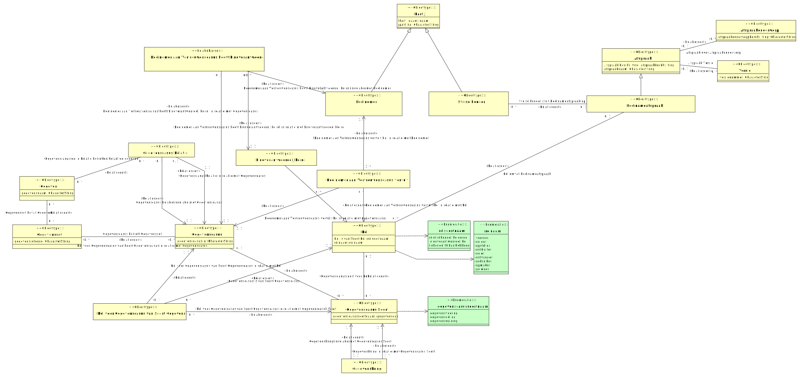

# CIM afsprakenstelsel

- [Afspraak](#TAfspraak)
  - [Deelnameafspraak](#TDeelnameafspraak)
- [Afspraakonderwerp](#TAfspraakonderwerp)
- [Deelnemer aan Vertrouwenscasus vervult Rol](#TDeelnemer-aan-Vertrouwenscasus-vervult-Rol)
- [Gegeven](#TGegeven)
- [Gegevenscasus](#TGegevenscasus)
- [Gegevenscasus Relatie](#TGegevenscasus-Relatie)
- [Gegevenscasus Soort](#TGegevenscasus-Soort)
- [Gegevenskring](#TGegevenskring)
- [Gegevensset](#TGegevensset)
- [Partij](#TPartij)
  - [Deelnemer](#TDeelnemer)
  - [Stelselhouder](#TStelselhouder)
- [Rol](#TRol)
  - [Eindverantwoordelijke rol](#TEindverantwoordelijke-rol)
- [Rol voor Gegevenscasus van Soort Gegevenscasus](#TRol-voor-Gegevenscasus-van-Soort-Gegevenscasus)
- [Versie](#TVersie)

## Afspraak {#TAfspraak}

|{: .def}||
|-|-|
|Begrip|[Afspraak](#afspraak)|
|Subtype(s)|[Deelnameafspraak](#TDeelnameafspraak)|
|Toelichting|afspraak  [afspraaknaam](#TAfspraak.afspraaknaam)  bestaat|
|Kenmerken|[Afspraak Beschrijving](#TAfspraak-Beschrijving), [afspraaknaam](#TAfspraak-afspraaknaam)|
|Rollen|[Afspraak Versie](#TAfspraak-Versie)|
|Relatie met|[Afspraak over Afspraakonderwerp](#TAfspraak-over-Afspraakonderwerp)|

### Afspraak Beschrijving {#TAfspraak-Beschrijving}

|{: .def}||
|-|-|
|Toelichting|[Afspraak](#TAfspraak)  is:  [afspraakbeschrijving](#Tafspraakbeschrijving)|
|Eigenschap van|[Afspraak](#TAfspraak)|
|Type|[afspraakbeschrijving](#Tafspraakbeschrijving)|

### afspraaknaam {#TAfspraak-afspraaknaam}

|{: .def}||
|-|-|
|Eigenschap van|[Afspraak](#TAfspraak)|
|Type|CharacterString|

## Afspraakonderwerp {#TAfspraakonderwerp}

|{: .def}||
|-|-|
|Toelichting|We kunnen afspraken maken over  [afspraakonderwerpbeschrijving](#TAfspraakonderwerp.afspraakonderwerpbeschrijving)|
|Kenmerken|[afspraakonderwerpbeschrijving](#TAfspraakonderwerp-afspraakonderwerpbeschrijving)|
|Rollen|[Afspraak over Afspraakonderwerp](#TAfspraak-over-Afspraakonderwerp)|

### afspraakonderwerpbeschrijving {#TAfspraakonderwerp-afspraakonderwerpbeschrijving}

|{: .def}||
|-|-|
|Eigenschap van|[Afspraakonderwerp](#TAfspraakonderwerp)|
|Type|CharacterString|

## Deelnameafspraak {#TDeelnameafspraak}

|{: .def}||
|-|-|
|Begrip|[Deelnameafspraak](#deelnameafspraak)|
|Supertype|[Afspraak](#TAfspraak)|
|Rollen|[Rol omvat Deelnameafspraak](#TRol-omvat-Deelnameafspraak)|
|Relatie met|[Stelselhouder stelt Deelnameafspraak op](#TStelselhouder-stelt-Deelnameafspraak-op)|

## Deelnemer {#TDeelnemer}

|{: .def}||
|-|-|
|Begrip|[Deelnemer](#deelnemer)|
|Supertype|[Partij](#TPartij)|
|Relatie met|[Deelnemer aan Vertrouwenscasus heeft Eindverantwoordelijke rol in relatie met Deelnemer](#TDeelnemer-aan-Vertrouwenscasus-heeft-Eindverantwoordelijke-rol-Deelnemer), [Deelnemer aan Vertrouwenscasus vervult Rol in relatie met Deelnemer](#TDeelnemer-aan-Vertrouwenscasus-vervult-Rol-Deelnemer)|

## Deelnemer aan Vertrouwenscasus vervult Rol {#TDeelnemer-aan-Vertrouwenscasus-vervult-Rol}

|{: .def}||
|-|-|
|Toelichting|[Deelnemer](#TDeelnemer)  aan  [Gegevenscasus](#TGegevenscasus)  vervult  [Rol](#TRol)|
|Rollen|[Deelnemer aan Vertrouwenscasus vervult Rol in relatie met Deelnemer](#TDeelnemer-aan-Vertrouwenscasus-vervult-Rol-Deelnemer), [Deelnemer aan Vertrouwenscasus vervult Rol in relatie met Gegevenscasus](#TDeelnemer-aan-Vertrouwenscasus-vervult-Rol-Gegevenscasus), [Deelnemer aan Vertrouwenscasus vervult Rol in relatie met Rol](#TDeelnemer-aan-Vertrouwenscasus-vervult-Rol-Rol)|

## Eindverantwoordelijke rol {#TEindverantwoordelijke-rol}

|{: .def}||
|-|-|
|Supertype|[Rol](#TRol)|
|Relatie met|[Deelnemer aan Vertrouwenscasus heeft Eindverantwoordelijke rol in relatie met Eindverantwoordelijke rol](#TDeelnemer-aan-Vertrouwenscasus-heeft-Eindverantwoordelijke-rol-Eindverantwoordelijke-rol)|

## Gegeven {#TGegeven}

|{: .def}||
|-|-|
|Toelichting|[gegevensnaam](#TGegeven.gegevensnaam)  is een gegeven|
|Kenmerken|[gegevensnaam](#TGegeven-gegevensnaam)|
|Rollen|[Gegevenscasussen in Relatie betreffen hetzelfde gegeven](#TGegevenscasussen-in-Relatie-betreffen-hetzelfde-gegeven)|
|Relatie met|[Gegevensset bevat Gegeven](#TGegevensset-bevat-Gegeven)|

### gegevensnaam {#TGegeven-gegevensnaam}

|{: .def}||
|-|-|
|Eigenschap van|[Gegeven](#TGegeven)|
|Type|CharacterString|

## Gegevenscasus {#TGegevenscasus}

|{: .def}||
|-|-|
|Begrip|[Gegevenscasus](#gegevenscasus)|
|Kenmerken|[gegevenscasus id](#TGegevenscasus-gegevenscasus-id)|
|Relatie met|[Deelnemer aan Vertrouwenscasus heeft Eindverantwoordelijke rol in relatie met Gegevenscasus](#TDeelnemer-aan-Vertrouwenscasus-heeft-Eindverantwoordelijke-rol-Gegevenscasus), [Deelnemer aan Vertrouwenscasus vervult Rol in relatie met Gegevenscasus](#TDeelnemer-aan-Vertrouwenscasus-vervult-Rol-Gegevenscasus), [Gegevenscasus Relatie in relatie met Gegevenscasus](#TGegevenscasus-Relatie-Gegevenscasus-481), [Gegevenscasus Relatie in relatie met Gegevenscasus](#TGegevenscasus-Relatie-Gegevenscasus-480), [Gegevenscasus betreft Gegevensset](#TGegevenscasus-betreft-Gegevensset), [Gegevenscasus is van Soort Gegevenscasus](#TGegevenscasus-is-van-Soort-Gegevenscasus), [Rol voor Gegevenscasus van Soort Gegevenscasus in relatie met Gegevenscasus](#TRol-voor-Gegevenscasus-van-Soort-Gegevenscasus-Gegevenscasus)|

### gegevenscasus id {#TGegevenscasus-gegevenscasus-id}

|{: .def}||
|-|-|
|Eigenschap van|[Gegevenscasus](#TGegevenscasus)|
|Type|CharacterString|

## Gegevenscasus Relatie {#TGegevenscasus-Relatie}

|{: .def}||
|-|-|
|Toelichting|gegevenscasus  [Gegevenscasus](#TGegevenscasus)  volgt op  [Gegevenscasus](#TGegevenscasus)|
|Rollen|[Gegevenscasus Relatie in relatie met Gegevenscasus](#TGegevenscasus-Relatie-Gegevenscasus-481), [Gegevenscasus Relatie in relatie met Gegevenscasus](#TGegevenscasus-Relatie-Gegevenscasus-480)|
|Relatie met|[Gegevenscasussen in Relatie betreffen hetzelfde gegeven](#TGegevenscasussen-in-Relatie-betreffen-hetzelfde-gegeven)|

## Gegevenscasus Soort {#TGegevenscasus-Soort}

|{: .def}||
|-|-|
|Begrip|[Gegevenscasus Soort](#gegevenscasus-soort)|
|Kenmerken|[gegevenscasussoortnaam](#TGegevenscasus-Soort-gegevenscasussoortnaam)|
|Rollen|[Gegevenscasus is van Soort Gegevenscasus](#TGegevenscasus-is-van-Soort-Gegevenscasus), [Gegevenscasussoort voor Rol](#TGegevenscasussoort-voor-Rol)|
|Relatie met|[Gegevenskring in relatie met Gegevenscasus Soort](#TGegevenskring-Gegevenscasus-Soort-485), [Gegevenskring in relatie met Gegevenscasus Soort](#TGegevenskring-Gegevenscasus-Soort-484), [Rol voor Gegevenscasus van Soort Gegevenscasus in relatie met Gegevenscasus Soort](#TRol-voor-Gegevenscasus-van-Soort-Gegevenscasus-Gegevenscasus-Soort)|

### gegevenscasussoortnaam {#TGegevenscasus-Soort-gegevenscasussoortnaam}

|{: .def}||
|-|-|
|Eigenschap van|[Gegevenscasus Soort](#TGegevenscasus-Soort)|
|Type|[gegevenscasussoortnaam](#Tgegevenscasussoortnaam)|
|Mogelijke waarden|gegevensduiding; gegevensdeling; gegevensvoering|

## Gegevenskring {#TGegevenskring}

|{: .def}||
|-|-|
|Begrip|[Gegevenskring](#gegevenskring)|
|Toelichting|gegevenscasus Soort  [Gegevenscasus Soort](#TGegevenscasus_Soort)  volgt op Gegevenscasus Soort  [Gegevenscasus Soort](#TGegevenscasus_Soort)|
|Rollen|[Gegevenskring in relatie met Gegevenscasus Soort](#TGegevenskring-Gegevenscasus-Soort-485), [Gegevenskring in relatie met Gegevenscasus Soort](#TGegevenskring-Gegevenscasus-Soort-484)|

## Gegevensset {#TGegevensset}

|{: .def}||
|-|-|
|Begrip|[Gegevensset](#gegevensset)|
|Toelichting|er is een gegevensset met code  [gegevenssetcode](#TGegevensset.gegevenssetcode)|
|Kenmerken|[gegevenssetcode](#TGegevensset-gegevenssetcode)|
|Rollen|[Gegevenscasus betreft Gegevensset](#TGegevenscasus-betreft-Gegevensset), [Gegevensset bevat Gegeven](#TGegevensset-bevat-Gegeven)|

### gegevenssetcode {#TGegevensset-gegevenssetcode}

|{: .def}||
|-|-|
|Eigenschap van|[Gegevensset](#TGegevensset)|
|Type|CharacterString|

## Partij {#TPartij}

|{: .def}||
|-|-|
|Begrip|[Partij](#partij)|
|Subtype(s)|[Stelselhouder](#TStelselhouder), [Deelnemer](#TDeelnemer)|
|Toelichting|Partij  [partij id](#TPartij.partij_id)  bestaat|
|Kenmerken|[Partij naam](#TPartij-naam), [partij id](#TPartij-partij-id)|

### Partij naam {#TPartij-naam}

|{: .def}||
|-|-|
|Toelichting|[Partij](#TPartij)  heet  [naam](#Tnaam)|
|Eigenschap van|[Partij](#TPartij)|
|Type|[naam](#Tnaam)|

### partij id {#TPartij-partij-id}

|{: .def}||
|-|-|
|Eigenschap van|[Partij](#TPartij)|
|Type|CharacterString|

## Rol {#TRol}

|{: .def}||
|-|-|
|Begrip|[Rol](#rol)|
|Subtype(s)|[Eindverantwoordelijke rol](#TEindverantwoordelijke-rol)|
|Kenmerken|[Rol is van Soort Rol](#TRol-is-van-Soort-Rol), [rolnaam](#TRol-rolnaam)|
|Relatie met|[Deelnemer aan Vertrouwenscasus vervult Rol in relatie met Rol](#TDeelnemer-aan-Vertrouwenscasus-vervult-Rol-Rol), [Gegevenscasussoort voor Rol](#TGegevenscasussoort-voor-Rol), [Rol omvat Deelnameafspraak](#TRol-omvat-Deelnameafspraak), [Rol voor Gegevenscasus van Soort Gegevenscasus in relatie met Rol](#TRol-voor-Gegevenscasus-van-Soort-Gegevenscasus-Rol)|

### Rol is van Soort Rol {#TRol-is-van-Soort-Rol}

|{: .def}||
|-|-|
|Toelichting|[Rol](#TRol)  is van  [rolsoortnaam](#Trolsoortnaam) rolsoort |
|Eigenschap van|[Rol](#TRol)|
|Type|[rolsoortnaam](#Trolsoortnaam)|
|Mogelijke waarden|eindverantwoordelijke; niet-inhoudelijke derde; inhoudelijk baathebbende|

### rolnaam {#TRol-rolnaam}

|{: .def}||
|-|-|
|Eigenschap van|[Rol](#TRol)|
|Type|[rolnaam](#Trolnaam)|
|Mogelijke waarden|ontsluiter; opsteller; gebruiker; geleider; opmaker; voerder; deler; duider; ontvanger|

## Rol voor Gegevenscasus van Soort Gegevenscasus {#TRol-voor-Gegevenscasus-van-Soort-Gegevenscasus}

|{: .def}||
|-|-|
|Toelichting|[Rol](#TRol)  is een toegestane rol  voor  [Gegevenscasus Soort](#TGegevenscasus_Soort)  [Gegevenscasus](#TGegevenscasus)|
|Rollen|[Rol voor Gegevenscasus van Soort Gegevenscasus in relatie met Gegevenscasus](#TRol-voor-Gegevenscasus-van-Soort-Gegevenscasus-Gegevenscasus), [Rol voor Gegevenscasus van Soort Gegevenscasus in relatie met Gegevenscasus Soort](#TRol-voor-Gegevenscasus-van-Soort-Gegevenscasus-Gegevenscasus-Soort), [Rol voor Gegevenscasus van Soort Gegevenscasus in relatie met Rol](#TRol-voor-Gegevenscasus-van-Soort-Gegevenscasus-Rol)|

## Stelselhouder {#TStelselhouder}

|{: .def}||
|-|-|
|Begrip|[Stelselhouder](#stelselhouder)|
|Supertype|[Partij](#TPartij)|
|Rollen|[Stelselhouder stelt Deelnameafspraak op](#TStelselhouder-stelt-Deelnameafspraak-op)|

## Versie {#TVersie}

|{: .def}||
|-|-|
|Begrip|[Versie](#versie)|
|Kenmerken|[versienummer](#TVersie-versienummer)|
|Relatie met|[Afspraak Versie](#TAfspraak-Versie)|

### versienummer {#TVersie-versienummer}

|{: .def}||
|-|-|
|Begrip|[Versienummer](#versienummer)|
|Eigenschap van|[Versie](#TVersie)|
|Type|CharacterString|

### Afspraak Versie {#TAfspraak-Versie}

|{: .def}||
|-|-|
|Toelichting|[Afspraak](#TAfspraak)  versie  [Versie](#TVersie)|
|Rol van|0..1 [Afspraak](#TAfspraak)|
|Met|0..* [Versie](#TVersie)|

### Afspraak over Afspraakonderwerp {#TAfspraak-over-Afspraakonderwerp}

|{: .def}||
|-|-|
|Toelichting|[Afspraak](#TAfspraak)  gaat over  [Afspraakonderwerp](#TAfspraakonderwerp)|
|Rol van|0..* [Afspraakonderwerp](#TAfspraakonderwerp)|
|Met|0..1 [Afspraak](#TAfspraak)|

### Deelnemer aan Vertrouwenscasus heeft Eindverantwoordelijke rol {#TDeelnemer-aan-Vertrouwenscasus-heeft-Eindverantwoordelijke-rol}

|{: .def}||
|-|-|
|Toelichting|[Deelnemer](#TDeelnemer)  aan  [Gegevenscasus](#TGegevenscasus)  heeft  [Eindverantwoordelijke rol](#TEindverantwoordelijke_rol)|
|Rollen|[Deelnemer aan Vertrouwenscasus heeft Eindverantwoordelijke rol in relatie met Deelnemer](#TDeelnemer-aan-Vertrouwenscasus-heeft-Eindverantwoordelijke-rol-Deelnemer), [Deelnemer aan Vertrouwenscasus heeft Eindverantwoordelijke rol in relatie met Eindverantwoordelijke rol](#TDeelnemer-aan-Vertrouwenscasus-heeft-Eindverantwoordelijke-rol-Eindverantwoordelijke-rol), [Deelnemer aan Vertrouwenscasus heeft Eindverantwoordelijke rol in relatie met Gegevenscasus](#TDeelnemer-aan-Vertrouwenscasus-heeft-Eindverantwoordelijke-rol-Gegevenscasus)|

### Deelnemer aan Vertrouwenscasus heeft Eindverantwoordelijke rol in relatie met Deelnemer {#TDeelnemer-aan-Vertrouwenscasus-heeft-Eindverantwoordelijke-rol-Deelnemer}

|{: .def}||
|-|-|
|Rol van|0..* [Deelnemer aan Vertrouwenscasus heeft Eindverantwoordelijke rol](#TDeelnemer-aan-Vertrouwenscasus-heeft-Eindverantwoordelijke-rol)|
|Met|1..1 [Deelnemer](#TDeelnemer)|

### Deelnemer aan Vertrouwenscasus heeft Eindverantwoordelijke rol in relatie met Eindverantwoordelijke rol {#TDeelnemer-aan-Vertrouwenscasus-heeft-Eindverantwoordelijke-rol-Eindverantwoordelijke-rol}

|{: .def}||
|-|-|
|Rol van|0..* [Deelnemer aan Vertrouwenscasus heeft Eindverantwoordelijke rol](#TDeelnemer-aan-Vertrouwenscasus-heeft-Eindverantwoordelijke-rol)|
|Met|1..1 [Eindverantwoordelijke rol](#TEindverantwoordelijke-rol)|

### Deelnemer aan Vertrouwenscasus heeft Eindverantwoordelijke rol in relatie met Gegevenscasus {#TDeelnemer-aan-Vertrouwenscasus-heeft-Eindverantwoordelijke-rol-Gegevenscasus}

|{: .def}||
|-|-|
|Rol van|0..1 [Deelnemer aan Vertrouwenscasus heeft Eindverantwoordelijke rol](#TDeelnemer-aan-Vertrouwenscasus-heeft-Eindverantwoordelijke-rol)|
|Met|1..1 [Gegevenscasus](#TGegevenscasus)|

### Deelnemer aan Vertrouwenscasus vervult Rol in relatie met Deelnemer {#TDeelnemer-aan-Vertrouwenscasus-vervult-Rol-Deelnemer}

|{: .def}||
|-|-|
|Rol van|1..* [Deelnemer aan Vertrouwenscasus vervult Rol](#TDeelnemer-aan-Vertrouwenscasus-vervult-Rol)|
|Met|1..1 [Deelnemer](#TDeelnemer)|

### Deelnemer aan Vertrouwenscasus vervult Rol in relatie met Gegevenscasus {#TDeelnemer-aan-Vertrouwenscasus-vervult-Rol-Gegevenscasus}

|{: .def}||
|-|-|
|Rol van|0..* [Deelnemer aan Vertrouwenscasus vervult Rol](#TDeelnemer-aan-Vertrouwenscasus-vervult-Rol)|
|Met|1..1 [Gegevenscasus](#TGegevenscasus)|

### Deelnemer aan Vertrouwenscasus vervult Rol in relatie met Rol {#TDeelnemer-aan-Vertrouwenscasus-vervult-Rol-Rol}

|{: .def}||
|-|-|
|Rol van|0..* [Deelnemer aan Vertrouwenscasus vervult Rol](#TDeelnemer-aan-Vertrouwenscasus-vervult-Rol)|
|Met|1..1 [Rol](#TRol)|

### Gegevenscasus Relatie in relatie met Gegevenscasus {#TGegevenscasus-Relatie-Gegevenscasus-481}

|{: .def}||
|-|-|
|Rol van|0..1 [Gegevenscasus Relatie](#TGegevenscasus-Relatie)|
|Met|1..1 [Gegevenscasus](#TGegevenscasus)|

### Gegevenscasus Relatie in relatie met Gegevenscasus {#TGegevenscasus-Relatie-Gegevenscasus-480}

|{: .def}||
|-|-|
|Rol van|0..1 [Gegevenscasus Relatie](#TGegevenscasus-Relatie)|
|Met|1..1 [Gegevenscasus](#TGegevenscasus)|

### Gegevenscasus betreft Gegevensset {#TGegevenscasus-betreft-Gegevensset}

|{: .def}||
|-|-|
|Toelichting|[Gegevenscasus](#TGegevenscasus)  betreft  [Gegevensset](#TGegevensset)|
|Rol van|0..* [Gegevensset](#TGegevensset)|
|Met|0..* [Gegevenscasus](#TGegevenscasus)|

### Gegevenscasus is van Soort Gegevenscasus {#TGegevenscasus-is-van-Soort-Gegevenscasus}

|{: .def}||
|-|-|
|Toelichting|gegevenscasus  [Gegevenscasus](#TGegevenscasus)  is van gegevenscasussoort  [Gegevenscasus Soort](#TGegevenscasus_Soort)|
|Rol van|0..* [Gegevenscasus Soort](#TGegevenscasus-Soort)|
|Met|0..1 [Gegevenscasus](#TGegevenscasus)|

### Gegevenscasussen in Relatie betreffen hetzelfde gegeven {#TGegevenscasussen-in-Relatie-betreffen-hetzelfde-gegeven}

|{: .def}||
|-|-|
|Toelichting|[Gegevenscasus Relatie](#TGegevenscasus_Relatie)  betreft  [Gegeven](#TGegeven)|
|Rol van|0..* [Gegeven](#TGegeven)|
|Met|0..* [Gegevenscasus Relatie](#TGegevenscasus-Relatie)|

### Gegevenscasussoort voor Rol {#TGegevenscasussoort-voor-Rol}

|{: .def}||
|-|-|
|Toelichting|[Rol](#TRol)  hoort bij  [Gegevenscasus Soort](#TGegevenscasus_Soort)|
|Rol van|0..* [Gegevenscasus Soort](#TGegevenscasus-Soort)|
|Met|0..1 [Rol](#TRol)|

### Gegevenskring in relatie met Gegevenscasus Soort {#TGegevenskring-Gegevenscasus-Soort-485}

|{: .def}||
|-|-|
|Rol van|1..* [Gegevenskring](#TGegevenskring)|
|Met|1..1 [Gegevenscasus Soort](#TGegevenscasus-Soort)|

### Gegevenskring in relatie met Gegevenscasus Soort {#TGegevenskring-Gegevenscasus-Soort-484}

|{: .def}||
|-|-|
|Rol van|1..1 [Gegevenskring](#TGegevenskring)|
|Met|1..1 [Gegevenscasus Soort](#TGegevenscasus-Soort)|

### Gegevensset bevat Gegeven {#TGegevensset-bevat-Gegeven}

|{: .def}||
|-|-|
|Toelichting|[Gegevensset](#TGegevensset)  bevat  [Gegeven](#TGegeven)|
|Rol van|0..* [Gegevensset](#TGegevensset)|
|Met|0..* [Gegeven](#TGegeven)|

### Rol omvat Deelnameafspraak {#TRol-omvat-Deelnameafspraak}

|{: .def}||
|-|-|
|Toelichting|[Rol](#TRol)  omvat  [Deelnameafspraak](#TDeelnameafspraak)|
|Rol van|0..1 [Deelnameafspraak](#TDeelnameafspraak)|
|Met|0..* [Rol](#TRol)|

### Rol voor Gegevenscasus van Soort Gegevenscasus in relatie met Gegevenscasus {#TRol-voor-Gegevenscasus-van-Soort-Gegevenscasus-Gegevenscasus}

|{: .def}||
|-|-|
|Rol van|0..1 [Rol voor Gegevenscasus van Soort Gegevenscasus](#TRol-voor-Gegevenscasus-van-Soort-Gegevenscasus)|
|Met|1..1 [Gegevenscasus](#TGegevenscasus)|

### Rol voor Gegevenscasus van Soort Gegevenscasus in relatie met Gegevenscasus Soort {#TRol-voor-Gegevenscasus-van-Soort-Gegevenscasus-Gegevenscasus-Soort}

|{: .def}||
|-|-|
|Rol van|0..* [Rol voor Gegevenscasus van Soort Gegevenscasus](#TRol-voor-Gegevenscasus-van-Soort-Gegevenscasus)|
|Met|1..1 [Gegevenscasus Soort](#TGegevenscasus-Soort)|

### Rol voor Gegevenscasus van Soort Gegevenscasus in relatie met Rol {#TRol-voor-Gegevenscasus-van-Soort-Gegevenscasus-Rol}

|{: .def}||
|-|-|
|Rol van|0..* [Rol voor Gegevenscasus van Soort Gegevenscasus](#TRol-voor-Gegevenscasus-van-Soort-Gegevenscasus)|
|Met|1..1 [Rol](#TRol)|

### Stelselhouder stelt Deelnameafspraak op {#TStelselhouder-stelt-Deelnameafspraak-op}

|{: .def}||
|-|-|
|Toelichting|[Stelselhouder](#TStelselhouder)  stelt  [Deelnameafspraak](#TDeelnameafspraak)  op|
|Rol van|0..* [Stelselhouder](#TStelselhouder)|
|Met|0..1 [Deelnameafspraak](#TDeelnameafspraak)|

## Waardetypering en referentielijsten

### afspraakbeschrijving {#Tafspraakbeschrijving}

|{: .def}||
|-|-|
|Gebaseerd op|CharacterString|

### naam {#Tnaam}

|{: .def}||
|-|-|
|Gebaseerd op|CharacterString|

### gegevenscasussoortnaam {#Tgegevenscasussoortnaam}

De volgende waarden zijn mogelijk:
- [gegevensdeling](#gegevensdeling)
- [gegevensduiding](#gegevensduiding)
- [gegevensvoering](#gegevensvoering)

### rolnaam {#Trolnaam}

De volgende waarden zijn mogelijk:
- [deler](#deler)
- [duider](#duider)
- [gebruiker](#gebruiker)
- [geleider](#geleider)
- [ontsluiter](#ontsluiter)
- [ontvanger](#ontvanger)
- [opmaker](#opmaker)
- [opsteller](#opsteller)
- [voerder](#voerder)

### rolsoortnaam {#Trolsoortnaam}

De volgende waarden zijn mogelijk:
- [eindverantwoordelijke](#eindverantwoordelijke)
- [inhoudelijk baathebbende](#inhoudelijk-baathebbende)
- [niet-inhoudelijke derde](#niet-inhoudelijke-derde)

