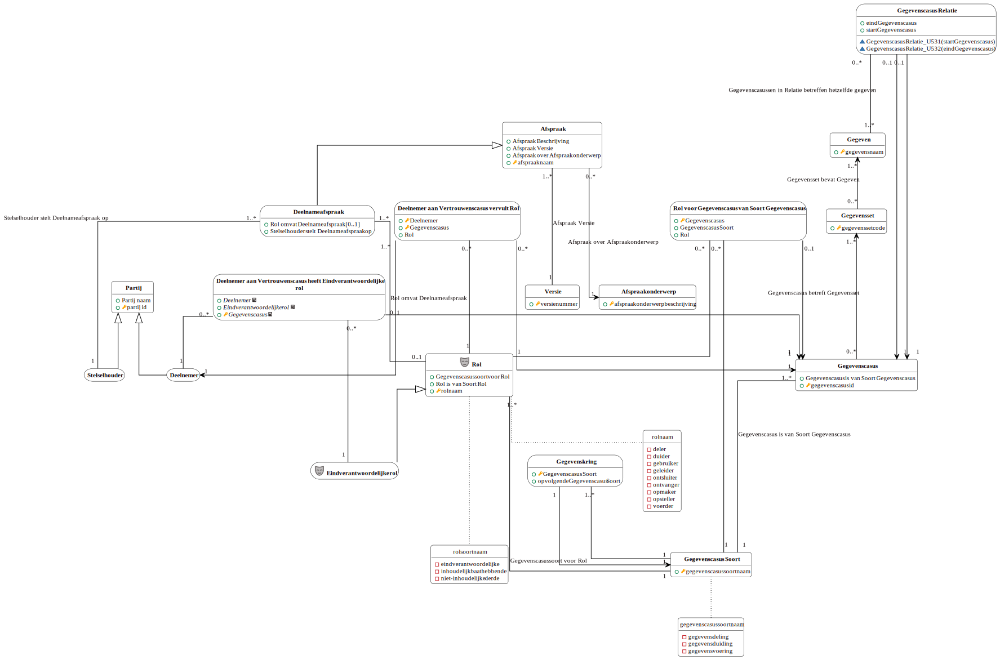

# Logische gegevensmodellen

## Afsprakenstelsel

Het logische model van de gegevens die nodig zijn om de afspraken in het afsprakenstelsel te administreren wordt hieronder getoond.

<a href="./logische-modellen/afsprakenstelsel.uml.svg" target="_blank">Vergrote versie op nieuw tabblad</a>
