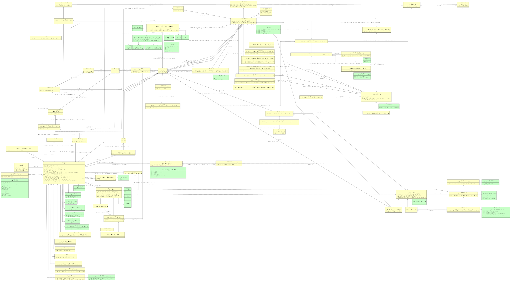

# CIM dpia

- [Afdeling binnen partij](#TAfdeling-binnen-partij)
- [Akkoordverklaring](#TAkkoordverklaring)
- [Beleid](#TBeleid)
- [Beperking op recht van de betrokkene](#TBeperking-op-recht-van-de-betrokkene)
- [Betrokken partij bij DPIA](#TBetrokken-partij-bij-DPIA)
- [Betrokken partij bij gegevensverwerking](#TBetrokken-partij-bij-gegevensverwerking)
- [Betrokken partij bij gegevensverwerking is verwerkingsverantwoordelijke](#TBetrokken-partij-bij-gegevensverwerking-is-verwerkingsverantwoordelijke)
- [Bewaartermijn van persoonsgegeven in gegevensverwerking](#TBewaartermijn-van-persoonsgegeven-in-gegevensverwerking)
- [Categorie betrokkenen in DPIA](#TCategorie-betrokkenen-in-DPIA)
- [Categorie bijzonder persoonsgegeven in gegevensverwerking](#TCategorie-bijzonder-persoonsgegeven-in-gegevensverwerking)
- [Classificatie](#TClassificatie)
  - [Classificatie Persoonsgegevens](#TClassificatie-Persoonsgegevens)
    - [Classificatie Type Persoonsgegevens](#TClassificatie-Type-Persoonsgegevens)
      - [Classificatie Type Bijzondere Persoonsgegevens](#TClassificatie-Type-Bijzondere-Persoonsgegevens)
- [Conclusie toelaatbaarheid hergebruik](#TConclusie-toelaatbaarheid-hergebruik)
- [Conclusie verenigbaarheidstoets](#TConclusie-verenigbaarheidstoets)
- [DPIA](#TDPIA)
  - [DPIA met algoritme](#TDPIA-met-algoritme)
  - [DPIA met big data-verwerking](#TDPIA-met-big-data-verwerking)
  - [DPIA met cloudoplossing](#TDPIA-met-cloudoplossing)
  - [DPIA met geautomatiseerde besluitvorming](#TDPIA-met-geautomatiseerde-besluitvorming)
  - [DPIA met mogelijk sprake van discriminatie](#TDPIA-met-mogelijk-sprake-van-discriminatie)
  - [DPIA met profilering](#TDPIA-met-profilering)
  - [DPIA met resterende risico's](#TDPIA-met-resterende-risico-s)
- [DPIA beschrijft onderwerp](#TDPIA-beschrijft-onderwerp)
- [Document](#TDocument)
- [Functie in afdeling](#TFunctie-in-afdeling)
- [Functie in organisatorische eenheid van Partij](#TFunctie-in-organisatorische-eenheid-van-Partij)
- [Functionaris voor gegevensbescherming](#TFunctionaris-voor-gegevensbescherming)
- [Gegevenssetspecificatie gegevensverwerking persoonsgegevens](#TGegevenssetspecificatie-gegevensverwerking-persoonsgegevens)
  - [Persoonsgegeven in gegevensverwerking met nieuw en oorspronkelijk verwerkingsdoeleinde](#TPersoonsgegeven-in-gegevensverwerking-met-nieuw-en-oorspronkelijk-verwerkingsdoeleinde)
    - [Hergebruik toelaatbaar o.b.v. Unie- of lidstatelijk recht](#THergebruik-toelaatbaar-o-b-v-Unie-of-lidstatelijk-recht)
- [Gegevenstype](#TGegevenstype)
  - [Persoonsgegeven](#TPersoonsgegeven)
    - [Bijzonder persoonsgegeven](#TBijzonder-persoonsgegeven)
    - [Persoonsgegeven via betrokken partij](#TPersoonsgegeven-via-betrokken-partij)
- [Gegevensverwerking](#TGegevensverwerking)
  - [Gegevensverwerking persoonsgegevens](#TGegevensverwerking-persoonsgegevens)
    - [Gegevensverwerking nationale identificatienummers](#TGegevensverwerking-nationale-identificatienummers)
    - [Gegevensverwerking op basis van rechtsgrond gerechtvaardigd belang](#TGegevensverwerking-op-basis-van-rechtsgrond-gerechtvaardigd-belang)
    - [Gegevensverwerking op basis van rechtsgrond noodzakelijk voor de uitvoering van een overeenkomst](#TGegevensverwerking-op-basis-van-rechtsgrond-noodzakelijk-voor-de-uitvoering-van-een-overeenkomst)
    - [Gegevensverwerking op basis van rechtsgrond toestemming](#TGegevensverwerking-op-basis-van-rechtsgrond-toestemming)
    - [Gegevensverwerking op basis van rechtsgrond vitaal belang](#TGegevensverwerking-op-basis-van-rechtsgrond-vitaal-belang)
    - [Gegevensverwerking op basis van rechtsgrond wettelijke verplichting of taak van algemeen belang](#TGegevensverwerking-op-basis-van-rechtsgrond-wettelijke-verplichting-of-taak-van-algemeen-belang)
    - [Gegevensverwerking strafrechtelijke persoonsgegevens](#TGegevensverwerking-strafrechtelijke-persoonsgegevens)
- [Land](#TLand)
  - [Derde land](#TDerde-land)
- [Normenkader of voorschrift in DPIA](#TNormenkader-of-voorschrift-in-DPIA)
- [Organisatorische activiteit](#TOrganisatorische-activiteit)
  - [Organisatorische activiteit persoonsgegevens](#TOrganisatorische-activiteit-persoonsgegevens)
    - [Organisatorische activiteit zonder DPIA-verplichting o.b.v. Lijst AP of EDPB](#TOrganisatorische-activiteit-zonder-DPIA-verplichting-o-b-v-Lijst-AP-of-EDPB)
- [Partij](#TPartij)
- [Partij bij gegevensverwerking met toegang tot persoonsgegeven](#TPartij-bij-gegevensverwerking-met-toegang-tot-persoonsgegeven)
  - [Partij bij gegevensverwerking met functie/afdeling met toegang tot persoonsgegevens bekend](#TPartij-bij-gegevensverwerking-met-functie-afdeling-met-toegang-tot-persoonsgegevens-bekend)
- [Partij is betrokken bij gegevensverwerking als verwerkingsverantwoordelijke of derde](#TPartij-is-betrokken-bij-gegevensverwerking-als-verwerkingsverantwoordelijke-of-derde)
- [Persoon](#TPersoon)
- [Persoon in Functie](#TPersoon-in-Functie)
- [Persoonsgegeven is onderdeel van DPIA](#TPersoonsgegeven-is-onderdeel-van-DPIA)
- [Recht van de betrokkene](#TRecht-van-de-betrokkene)
- [Risico voor betrokkenen](#TRisico-voor-betrokkenen)
  - [Inherent risico voor betrokkenen](#TInherent-risico-voor-betrokkenen)
    - [Risico op basis van doorgifte](#TRisico-op-basis-van-doorgifte)
    - [Risico op discriminatie](#TRisico-op-discriminatie)
  - [Resterend risico voor betrokkenen](#TResterend-risico-voor-betrokkenen)
- [Verwerkingslocatie buiten de EER](#TVerwerkingslocatie-buiten-de-EER)
- [Verwerkingsverantwoordelijke bij DPIA](#TVerwerkingsverantwoordelijke-bij-DPIA)
- [Verwerkingsverantwoordelijke die DPIA opstelt](#TVerwerkingsverantwoordelijke-die-DPIA-opstelt)
- [Wet- en Regelgeving](#TWet-en-Regelgeving)
  - [Wetsartikel over beperking op recht van de betrokkene](#TWetsartikel-over-beperking-op-recht-van-de-betrokkene)

## Afdeling binnen partij {#TAfdeling-binnen-partij}

|{: .def}||
|-|-|
|Kenmerken|[afdelingsnaam](#TAfdeling-binnen-partij-afdelingsnaam)|
|Rollen|[Afdeling binnen partij in relatie met Partij](#TAfdeling-binnen-partij-Partij), [Toezichthouder bewaartermijn](#TToezichthouder-bewaartermijn)|

### afdelingsnaam {#TAfdeling-binnen-partij-afdelingsnaam}

|{: .def}||
|-|-|
|Eigenschap van|[Afdeling binnen partij](#TAfdeling-binnen-partij)|
|Type|CharacterString|

### Afdeling binnen partij in relatie met Partij {#TAfdeling-binnen-partij-Partij}

|{: .def}||
|-|-|
|Rol van|0..* [Afdeling binnen partij](#TAfdeling-binnen-partij)|
|Met|1..1 [Partij](#TPartij)|

### Toezichthouder bewaartermijn {#TToezichthouder-bewaartermijn}

|{: .def}||
|-|-|
|Begrip|[Toezichthouder bewaartermijn](#toezichthouder-bewaartermijn)|
|Rol van|0..* [Afdeling binnen partij](#TAfdeling-binnen-partij)|
|Met|0..* [Bewaartermijn van persoonsgegeven in gegevensverwerking](#TBewaartermijn-van-persoonsgegeven-in-gegevensverwerking)|

## Akkoordverklaring {#TAkkoordverklaring}

|{: .def}||
|-|-|
|Begrip|[Akkoordverklaring](#akkoordverklaring)|
|Kenmerken|[Datum akkoordverklaring](#TDatum-akkoordverklaring)|
|Rollen|[Akkoordverklaring in relatie met Persoon in Functie](#TAkkoordverklaring-Persoon-in-Functie), [Akkoordverklaring in relatie met Verwerkingsverantwoordelijke die DPIA opstelt](#TAkkoordverklaring-Verwerkingsverantwoordelijke-die-DPIA-opstelt)|

### Datum akkoordverklaring {#TDatum-akkoordverklaring}

|{: .def}||
|-|-|
|Begrip|[Datum akkoordverklaring](#datum-akkoordverklaring)|
|Eigenschap van|[Akkoordverklaring](#TAkkoordverklaring)|
|Type|[datum](#Tdatum)|

### Akkoordverklaring in relatie met Verwerkingsverantwoordelijke die DPIA opstelt {#TAkkoordverklaring-Verwerkingsverantwoordelijke-die-DPIA-opstelt}

|{: .def}||
|-|-|
|Rol van|0..* [Akkoordverklaring](#TAkkoordverklaring)|
|Met|1..1 [Verwerkingsverantwoordelijke die DPIA opstelt](#TVerwerkingsverantwoordelijke-die-DPIA-opstelt)|

### Akkoordverklaring in relatie met Persoon in Functie {#TAkkoordverklaring-Persoon-in-Functie}

|{: .def}||
|-|-|
|Rol van|0..* [Akkoordverklaring](#TAkkoordverklaring)|
|Met|1..1 [Persoon in Functie](#TPersoon-in-Functie)|

## Beleid {#TBeleid}

|{: .def}||
|-|-|
|Begrip|[Beleid](#beleid)|
|Kenmerken|[beleid naam](#TBeleid-beleid-naam), [pagina](#TBeleid-pagina), [paragraaf](#TBeleid-paragraaf)|
|Rollen|[Beleidsmatig kader](#TBeleidsmatig-kader)|

### pagina {#TBeleid-pagina}

|{: .def}||
|-|-|
|Eigenschap van|[Beleid](#TBeleid)|
|Type|CharacterString|

### paragraaf {#TBeleid-paragraaf}

|{: .def}||
|-|-|
|Eigenschap van|[Beleid](#TBeleid)|
|Type|CharacterString|

### beleid naam {#TBeleid-beleid-naam}

|{: .def}||
|-|-|
|Eigenschap van|[Beleid](#TBeleid)|
|Type|CharacterString|

### Beleidsmatig kader {#TBeleidsmatig-kader}

|{: .def}||
|-|-|
|Begrip|[Beleidsmatig kader](#beleidsmatig-kader)|
|Rol van|0..* [Beleid](#TBeleid)|
|Met|0..* [Gegevensverwerking persoonsgegevens](#TGegevensverwerking-persoonsgegevens)|

## Beperking op recht van de betrokkene {#TBeperking-op-recht-van-de-betrokkene}

|{: .def}||
|-|-|
|Begrip|[Beperking op recht van de betrokkene](#beperking-op-recht-van-de-betrokkene)|
|Kenmerken|[beperking recht van de betrokkene](#TBeperking-op-recht-van-de-betrokkene-beperking-recht-van-de-betrokkene)|
|Rollen|[Beperking op recht van de betrokkene in relatie met Recht van de betrokkene](#TBeperking-op-recht-van-de-betrokkene-Recht-van-de-betrokkene), [Rechtsgrond voor beperking op recht van de betrokkene](#TRechtsgrond-voor-beperking-op-recht-van-de-betrokkene)|

### beperking recht van de betrokkene {#TBeperking-op-recht-van-de-betrokkene-beperking-recht-van-de-betrokkene}

|{: .def}||
|-|-|
|Eigenschap van|[Beperking op recht van de betrokkene](#TBeperking-op-recht-van-de-betrokkene)|
|Type|CharacterString|

### Beperking op recht van de betrokkene in relatie met Recht van de betrokkene {#TBeperking-op-recht-van-de-betrokkene-Recht-van-de-betrokkene}

|{: .def}||
|-|-|
|Rol van|0..* [Beperking op recht van de betrokkene](#TBeperking-op-recht-van-de-betrokkene)|
|Met|1..1 [Recht van de betrokkene](#TRecht-van-de-betrokkene)|

### Rechtsgrond voor beperking op recht van de betrokkene {#TRechtsgrond-voor-beperking-op-recht-van-de-betrokkene}

|{: .def}||
|-|-|
|Begrip|[Rechtsgrond voor beperking op recht van de betrokkene](#rechtsgrond-voor-beperking-op-recht-van-de-betrokkene)|
|Rol van|0..* [Beperking op recht van de betrokkene](#TBeperking-op-recht-van-de-betrokkene)|
|Met|0..* [Wetsartikel over beperking op recht van de betrokkene](#TWetsartikel-over-beperking-op-recht-van-de-betrokkene)|

## Betrokken partij bij DPIA {#TBetrokken-partij-bij-DPIA}

|{: .def}||
|-|-|
|Begrip|[Betrokken partij bij DPIA](#betrokken-partij-bij-dpia)|
|Kenmerken|[Belang van betrokken partij](#TBelang-van-betrokken-partij)|
|Rollen|[Betrokken partij bij DPIA in relatie met DPIA](#TBetrokken-partij-bij-DPIA-DPIA), [Betrokken partij bij DPIA in relatie met Partij](#TBetrokken-partij-bij-DPIA-Partij)|

### Belang van betrokken partij {#TBelang-van-betrokken-partij}

|{: .def}||
|-|-|
|Begrip|[Belang van betrokken partij](#belang-van-betrokken-partij)|
|Eigenschap van|[Betrokken partij bij DPIA](#TBetrokken-partij-bij-DPIA)|
|Type|[belangbeschrijving](#Tbelangbeschrijving)|

### Betrokken partij bij DPIA in relatie met Partij {#TBetrokken-partij-bij-DPIA-Partij}

|{: .def}||
|-|-|
|Rol van|0..* [Betrokken partij bij DPIA](#TBetrokken-partij-bij-DPIA)|
|Met|1..1 [Partij](#TPartij)|

### Betrokken partij bij DPIA in relatie met DPIA {#TBetrokken-partij-bij-DPIA-DPIA}

|{: .def}||
|-|-|
|Rol van|0..* [Betrokken partij bij DPIA](#TBetrokken-partij-bij-DPIA)|
|Met|1..1 [DPIA](#TDPIA)|

## Betrokken partij bij gegevensverwerking {#TBetrokken-partij-bij-gegevensverwerking}

|{: .def}||
|-|-|
|Begrip|[Betrokken partij bij gegevensverwerking](#betrokken-partij-bij-gegevensverwerking)|
|Kenmerken|[Betrokken partij bij gegevensverwerking is derde](#TBetrokken-partij-bij-gegevensverwerking-is-derde), [Betrokken partij bij gegevensverwerking is ontvanger](#TBetrokken-partij-bij-gegevensverwerking-is-ontvanger), [Betrokken partij bij gegevensverwerking is verwerker of sub-verwerker](#TBetrokken-partij-bij-gegevensverwerking-is-verwerker-of-sub-verwerker), [Functie/afdeling met toegang tot persoonsgegevens bekend](#TFunctie-afdeling-met-toegang-tot-persoonsgegevens-bekend)|
|Rollen|[Betrokken partij bij gegevensverwerking in relatie met Gegevensverwerking persoonsgegevens](#TBetrokken-partij-bij-gegevensverwerking-Gegevensverwerking-persoonsgegevens), [Betrokken partij bij gegevensverwerking in relatie met Partij](#TBetrokken-partij-bij-gegevensverwerking-Partij)|
|Relatie met|[Betrokken partij bij gegevensverwerking is verwerkingsverantwoordelijke in relatie met Betrokken partij bij gegevensverwerking](#TBetrokken-partij-bij-gegevensverwerking-is-verwerkingsverantwoordelijke-Betrokken-partij-bij-gegevensverwerking)|

### Functie/afdeling met toegang tot persoonsgegevens bekend {#TFunctie-afdeling-met-toegang-tot-persoonsgegevens-bekend}

|{: .def}||
|-|-|
|Begrip|[Functie/afdeling met toegang tot persoonsgegevens bekend](#functie-afdeling-met-toegang-tot-persoonsgegevens-bekend)|
|Eigenschap van|[Betrokken partij bij gegevensverwerking](#TBetrokken-partij-bij-gegevensverwerking)|
|Type|[bekend/onbekend](#Tbekend-onbekend)|
|Mogelijke waarden|bekend; onbekend|

### Betrokken partij bij gegevensverwerking is ontvanger {#TBetrokken-partij-bij-gegevensverwerking-is-ontvanger}

|{: .def}||
|-|-|
|Eigenschap van|[Betrokken partij bij gegevensverwerking](#TBetrokken-partij-bij-gegevensverwerking)|
|Type|[ontvanger](#Tontvanger)|
|Mogelijke waarden|ontvanger|

### Betrokken partij bij gegevensverwerking is derde {#TBetrokken-partij-bij-gegevensverwerking-is-derde}

|{: .def}||
|-|-|
|Begrip|[Betrokken partij bij gegevensverwerking is derde](#betrokken-partij-bij-gegevensverwerking-is-derde)|
|Eigenschap van|[Betrokken partij bij gegevensverwerking](#TBetrokken-partij-bij-gegevensverwerking)|
|Type|[derde](#Tderde)|
|Mogelijke waarden|derde|

### Betrokken partij bij gegevensverwerking is verwerker of sub-verwerker {#TBetrokken-partij-bij-gegevensverwerking-is-verwerker-of-sub-verwerker}

|{: .def}||
|-|-|
|Begrip|[Betrokken partij bij gegevensverwerking is verwerker of sub-verwerker](#betrokken-partij-bij-gegevensverwerking-is-verwerker-of-sub-verwerker)|
|Eigenschap van|[Betrokken partij bij gegevensverwerking](#TBetrokken-partij-bij-gegevensverwerking)|
|Type|[verwerker/sub-verwerker](#Tverwerker-sub-verwerker)|
|Mogelijke waarden|verwerker; sub-verwerker|

### Betrokken partij bij gegevensverwerking in relatie met Gegevensverwerking persoonsgegevens {#TBetrokken-partij-bij-gegevensverwerking-Gegevensverwerking-persoonsgegevens}

|{: .def}||
|-|-|
|Rol van|0..* [Betrokken partij bij gegevensverwerking](#TBetrokken-partij-bij-gegevensverwerking)|
|Met|1..1 [Gegevensverwerking persoonsgegevens](#TGegevensverwerking-persoonsgegevens)|

### Betrokken partij bij gegevensverwerking in relatie met Partij {#TBetrokken-partij-bij-gegevensverwerking-Partij}

|{: .def}||
|-|-|
|Rol van|0..* [Betrokken partij bij gegevensverwerking](#TBetrokken-partij-bij-gegevensverwerking)|
|Met|1..1 [Partij](#TPartij)|

## Betrokken partij bij gegevensverwerking is verwerkingsverantwoordelijke {#TBetrokken-partij-bij-gegevensverwerking-is-verwerkingsverantwoordelijke}

|{: .def}||
|-|-|
|Begrip|[Betrokken partij bij gegevensverwerking is verwerkingsverantwoordelijke](#betrokken-partij-bij-gegevensverwerking-is-verwerkingsverantwoordelijke)|
|Kenmerken|[Betrokken partij bij gegevensverwerking is gezamenlijke verwerkingsverantwoordelijke](#TBetrokken-partij-bij-gegevensverwerking-is-gezamenlijke-verwerkingsverantwoordelijke), [Betrokken partij bij gegevensverwerking is verstrekker](#TBetrokken-partij-bij-gegevensverwerking-is-verstrekker), [verwerkingsverantwoordelijke](#TBetrokken-partij-bij-gegevensverwerking-is-verwerkingsverantwoordelijke-verwerkingsverantwoordelijke)|
|Rollen|[Betrokken partij bij gegevensverwerking is verwerkingsverantwoordelijke in relatie met Betrokken partij bij gegevensverwerking](#TBetrokken-partij-bij-gegevensverwerking-is-verwerkingsverantwoordelijke-Betrokken-partij-bij-gegevensverwerking)|

### Betrokken partij bij gegevensverwerking is verstrekker {#TBetrokken-partij-bij-gegevensverwerking-is-verstrekker}

|{: .def}||
|-|-|
|Begrip|[Betrokken partij bij gegevensverwerking is verstrekker](#betrokken-partij-bij-gegevensverwerking-is-verstrekker)|
|Eigenschap van|[Betrokken partij bij gegevensverwerking is verwerkingsverantwoordelijke](#TBetrokken-partij-bij-gegevensverwerking-is-verwerkingsverantwoordelijke)|
|Type|[verstrekker](#Tverstrekker)|
|Mogelijke waarden|verstrekker|

### verwerkingsverantwoordelijke {#TBetrokken-partij-bij-gegevensverwerking-is-verwerkingsverantwoordelijke-verwerkingsverantwoordelijke}

|{: .def}||
|-|-|
|Begrip|[Verwerkingsverantwoordelijke](#verwerkingsverantwoordelijke)|
|Eigenschap van|[Betrokken partij bij gegevensverwerking is verwerkingsverantwoordelijke](#TBetrokken-partij-bij-gegevensverwerking-is-verwerkingsverantwoordelijke)|
|Type|CharacterString|

### Betrokken partij bij gegevensverwerking is gezamenlijke verwerkingsverantwoordelijke {#TBetrokken-partij-bij-gegevensverwerking-is-gezamenlijke-verwerkingsverantwoordelijke}

|{: .def}||
|-|-|
|Begrip|[Betrokken partij bij gegevensverwerking is gezamenlijke verwerkingsverantwoordelijke](#betrokken-partij-bij-gegevensverwerking-is-gezamenlijke-verwerkingsverantwoordelijke)|
|Eigenschap van|[Betrokken partij bij gegevensverwerking is verwerkingsverantwoordelijke](#TBetrokken-partij-bij-gegevensverwerking-is-verwerkingsverantwoordelijke)|
|Type|[gezamenlijke verwerkingsverantwoordelijke](#Tgezamenlijke-verwerkingsverantwoordelijke)|
|Mogelijke waarden|gezamenlijke verwerkingsverantwoordelijke|

### Betrokken partij bij gegevensverwerking is verwerkingsverantwoordelijke in relatie met Betrokken partij bij gegevensverwerking {#TBetrokken-partij-bij-gegevensverwerking-is-verwerkingsverantwoordelijke-Betrokken-partij-bij-gegevensverwerking}

|{: .def}||
|-|-|
|Rol van|0..* [Betrokken partij bij gegevensverwerking is verwerkingsverantwoordelijke](#TBetrokken-partij-bij-gegevensverwerking-is-verwerkingsverantwoordelijke)|
|Met|1..1 [Betrokken partij bij gegevensverwerking](#TBetrokken-partij-bij-gegevensverwerking)|

## Bewaartermijn van persoonsgegeven in gegevensverwerking {#TBewaartermijn-van-persoonsgegeven-in-gegevensverwerking}

|{: .def}||
|-|-|
|Kenmerken|[Motivatie bewaartermijn persoonsgegeven in gegevensverwerking](#TMotivatie-bewaartermijn-persoonsgegeven-in-gegevensverwerking), [bewaartermijn](#TBewaartermijn-van-persoonsgegeven-in-gegevensverwerking-bewaartermijn)|
|Rollen|[Bewaartermijn van persoonsgegeven in gegevensverwerking in relatie met Gegevenssetspecificatie gegevensverwerking persoonsgegevens](#TBewaartermijn-van-persoonsgegeven-in-gegevensverwerking-Gegevenssetspecificatie-gegevensverwerking-persoonsgegevens)|
|Relatie met|[Toezichthouder bewaartermijn](#TToezichthouder-bewaartermijn)|

### bewaartermijn {#TBewaartermijn-van-persoonsgegeven-in-gegevensverwerking-bewaartermijn}

|{: .def}||
|-|-|
|Begrip|[Bewaartermijn](#bewaartermijn)|
|Eigenschap van|[Bewaartermijn van persoonsgegeven in gegevensverwerking](#TBewaartermijn-van-persoonsgegeven-in-gegevensverwerking)|
|Type|CharacterString|

### Motivatie bewaartermijn persoonsgegeven in gegevensverwerking {#TMotivatie-bewaartermijn-persoonsgegeven-in-gegevensverwerking}

|{: .def}||
|-|-|
|Eigenschap van|[Bewaartermijn van persoonsgegeven in gegevensverwerking](#TBewaartermijn-van-persoonsgegeven-in-gegevensverwerking)|
|Type|[motivatie bewaartermijn](#Tmotivatie-bewaartermijn)|

### Bewaartermijn van persoonsgegeven in gegevensverwerking in relatie met Gegevenssetspecificatie gegevensverwerking persoonsgegevens {#TBewaartermijn-van-persoonsgegeven-in-gegevensverwerking-Gegevenssetspecificatie-gegevensverwerking-persoonsgegevens}

|{: .def}||
|-|-|
|Rol van|0..* [Bewaartermijn van persoonsgegeven in gegevensverwerking](#TBewaartermijn-van-persoonsgegeven-in-gegevensverwerking)|
|Met|1..1 [Gegevenssetspecificatie gegevensverwerking persoonsgegevens](#TGegevenssetspecificatie-gegevensverwerking-persoonsgegevens)|

## Bijzonder persoonsgegeven {#TBijzonder-persoonsgegeven}

|{: .def}||
|-|-|
|Begrip|[Bijzonder persoonsgegeven](#bijzonder-persoonsgegeven)|
|Supertype|[Persoonsgegeven](#TPersoonsgegeven)|
|Rollen|[Type bijzonder persoonsgegeven](#TType-bijzonder-persoonsgegeven)|

### Type bijzonder persoonsgegeven {#TType-bijzonder-persoonsgegeven}

|{: .def}||
|-|-|
|Rol van|0..* [Bijzonder persoonsgegeven](#TBijzonder-persoonsgegeven)|
|Met|0..* [Classificatie Type Bijzondere Persoonsgegevens](#TClassificatie-Type-Bijzondere-Persoonsgegevens)|

## Categorie betrokkenen in DPIA {#TCategorie-betrokkenen-in-DPIA}

|{: .def}||
|-|-|
|Kenmerken|[Kwetsbaarheid categorie betrokkenen](#TKwetsbaarheid-categorie-betrokkenen), [categorie betrokkenen](#TCategorie-betrokkenen-in-DPIA-categorie-betrokkenen)|
|Rollen|[Categorie betrokkenen in DPIA in relatie met DPIA](#TCategorie-betrokkenen-in-DPIA-DPIA)|

### categorie betrokkenen {#TCategorie-betrokkenen-in-DPIA-categorie-betrokkenen}

|{: .def}||
|-|-|
|Begrip|[Categorie betrokkenen](#categorie-betrokkenen)|
|Eigenschap van|[Categorie betrokkenen in DPIA](#TCategorie-betrokkenen-in-DPIA)|
|Type|CharacterString|

### Kwetsbaarheid categorie betrokkenen {#TKwetsbaarheid-categorie-betrokkenen}

|{: .def}||
|-|-|
|Eigenschap van|[Categorie betrokkenen in DPIA](#TCategorie-betrokkenen-in-DPIA)|
|Type|[kwetsbaarheid](#Tkwetsbaarheid)|
|Mogelijke waarden|niet kwetsbaar; kwetsbaar|

### Categorie betrokkenen in DPIA in relatie met DPIA {#TCategorie-betrokkenen-in-DPIA-DPIA}

|{: .def}||
|-|-|
|Rol van|0..* [Categorie betrokkenen in DPIA](#TCategorie-betrokkenen-in-DPIA)|
|Met|1..1 [DPIA](#TDPIA)|

## Categorie bijzonder persoonsgegeven in gegevensverwerking {#TCategorie-bijzonder-persoonsgegeven-in-gegevensverwerking}

|{: .def}||
|-|-|
|Kenmerken|[Doorbrekingsgrond](#TDoorbrekingsgrond), [classificatie_type_bpg_waarde](#TCategorie-bijzonder-persoonsgegeven-in-gegevensverwerking-classificatie-type-bpg-waarde)|
|Rollen|[Categorie bijzonder persoonsgegeven in gegevensverwerking in relatie met Gegevensverwerking persoonsgegevens](#TCategorie-bijzonder-persoonsgegeven-in-gegevensverwerking-Gegevensverwerking-persoonsgegevens)|
|Relatie met|[Wet- of regelgeving doorbrekingsgrond](#TWet-of-regelgeving-doorbrekingsgrond)|

### classificatie_type_bpg_waarde {#TCategorie-bijzonder-persoonsgegeven-in-gegevensverwerking-classificatie-type-bpg-waarde}

|{: .def}||
|-|-|
|Eigenschap van|[Categorie bijzonder persoonsgegeven in gegevensverwerking](#TCategorie-bijzonder-persoonsgegeven-in-gegevensverwerking)|
|Type|CharacterString|

### Doorbrekingsgrond {#TDoorbrekingsgrond}

|{: .def}||
|-|-|
|Begrip|[Doorbrekingsgrond](#doorbrekingsgrond)|
|Eigenschap van|[Categorie bijzonder persoonsgegeven in gegevensverwerking](#TCategorie-bijzonder-persoonsgegeven-in-gegevensverwerking)|
|Type|[doorbrekingsgrond bijzondere persoonsgegevens](#Tdoorbrekingsgrond-bijzondere-persoonsgegevens)|

### Categorie bijzonder persoonsgegeven in gegevensverwerking in relatie met Gegevensverwerking persoonsgegevens {#TCategorie-bijzonder-persoonsgegeven-in-gegevensverwerking-Gegevensverwerking-persoonsgegevens}

|{: .def}||
|-|-|
|Rol van|0..* [Categorie bijzonder persoonsgegeven in gegevensverwerking](#TCategorie-bijzonder-persoonsgegeven-in-gegevensverwerking)|
|Met|1..1 [Gegevensverwerking persoonsgegevens](#TGegevensverwerking-persoonsgegevens)|

## Classificatie {#TClassificatie}

|{: .def}||
|-|-|
|Begrip|[Classificatie](#classificatie)|
|Subtype(s)|[Classificatie Persoonsgegevens](#TClassificatie-Persoonsgegevens)|
|Kenmerken|[classificatie id](#TClassificatie-classificatie-id)|
|Relatie met|[Gegevenstype heeft Classificatie](#TGegevenstype-heeft-Classificatie)|

### classificatie id {#TClassificatie-classificatie-id}

|{: .def}||
|-|-|
|Eigenschap van|[Classificatie](#TClassificatie)|
|Type|CharacterString|

## Classificatie Persoonsgegevens {#TClassificatie-Persoonsgegevens}

|{: .def}||
|-|-|
|Begrip|[Classificatie persoonsgegevens](#classificatie-persoonsgegevens)|
|Supertype|[Classificatie](#TClassificatie)|
|Subtype(s)|[Classificatie Type Persoonsgegevens](#TClassificatie-Type-Persoonsgegevens)|
|Kenmerken|[Classificatie Persoonsgegevens Aanwezig](#TClassificatie-Persoonsgegevens-Aanwezig)|

### Classificatie Persoonsgegevens Aanwezig {#TClassificatie-Persoonsgegevens-Aanwezig}

|{: .def}||
|-|-|
|Eigenschap van|[Classificatie Persoonsgegevens](#TClassificatie-Persoonsgegevens)|
|Type|[classificatie_persoonsgegevens_aanwezig](#Tclassificatie-persoonsgegevens-aanwezig)|
|Mogelijke waarden|bevat persoonsgegevens; bevat geen persoonsgegevens|

## Classificatie Type Bijzondere Persoonsgegevens {#TClassificatie-Type-Bijzondere-Persoonsgegevens}

|{: .def}||
|-|-|
|Supertype|[Classificatie Type Persoonsgegevens](#TClassificatie-Type-Persoonsgegevens)|
|Kenmerken|[Classificatie Type Bijzondere Persoonsgegevens waarde](#TClassificatie-Type-Bijzondere-Persoonsgegevens-waarde)|
|Relatie met|[Type bijzonder persoonsgegeven](#TType-bijzonder-persoonsgegeven)|

### Classificatie Type Bijzondere Persoonsgegevens waarde {#TClassificatie-Type-Bijzondere-Persoonsgegevens-waarde}

|{: .def}||
|-|-|
|Eigenschap van|[Classificatie Type Bijzondere Persoonsgegevens](#TClassificatie-Type-Bijzondere-Persoonsgegevens)|
|Type|[classificatie_type_bpg_waarde](#Tclassificatie-type-bpg-waarde)|
|Mogelijke waarden|genetische gegevens; gegevens over ras of etnische afkomst; gegevens over religieuze of levensbeschouwelijke overtuigingen; gegevens over lidmaatschap van een vakbond; gegevens over gezondheid; biometrische gegevens met het oog op de unieke identificatie van een persoon; gegevens over iemands seksueel gedrag of seksuele gerichtheid; gegevens over politieke opvattingen|

## Classificatie Type Persoonsgegevens {#TClassificatie-Type-Persoonsgegevens}

|{: .def}||
|-|-|
|Begrip|[Classificatie type persoonsgegevens](#classificatie-type-persoonsgegevens)|
|Supertype|[Classificatie Persoonsgegevens](#TClassificatie-Persoonsgegevens)|
|Subtype(s)|[Classificatie Type Bijzondere Persoonsgegevens](#TClassificatie-Type-Bijzondere-Persoonsgegevens)|
|Kenmerken|[Classificatie Type Persoonsgegevens Waarde](#TClassificatie-Type-Persoonsgegevens-Waarde)|
|Relatie met|[Type persoonsgegeven](#TType-persoonsgegeven), [Type persoonsgegeven in context van DPIA](#TType-persoonsgegeven-in-context-van-DPIA)|

### Classificatie Type Persoonsgegevens Waarde {#TClassificatie-Type-Persoonsgegevens-Waarde}

|{: .def}||
|-|-|
|Eigenschap van|[Classificatie Type Persoonsgegevens](#TClassificatie-Type-Persoonsgegevens)|
|Type|[classificatie_type_pg_waarde](#Tclassificatie-type-pg-waarde)|
|Mogelijke waarden|bevat gevoelige persoonsgegevens; bevat bijzondere persoonsgegevens; bevat strafrechtelijke persoonsgegevens; bevat gewone persoonsgegevens; bevat nationale identificatienummers|

## Conclusie toelaatbaarheid hergebruik {#TConclusie-toelaatbaarheid-hergebruik}

|{: .def}||
|-|-|
|Begrip|[Conclusie toelaatbaarheid hergebruik](#conclusie-toelaatbaarheid-hergebruik)|
|Kenmerken|[Toelichting op conclusie toelaatbaarheid hergebruik](#TToelichting-op-conclusie-toelaatbaarheid-hergebruik), [toelaatbaarheid hergebruik](#TConclusie-toelaatbaarheid-hergebruik-toelaatbaarheid-hergebruik)|
|Rollen|[Conclusie toelaatbaarheid hergebruik in relatie met Persoonsgegeven in gegevensverwerking met nieuw en oorspronkelijk verwerkingsdoeleinde](#TConclusie-toelaatbaarheid-hergebruik-Persoonsgegeven-in-gegevensverwerking-met-nieuw-en-oorspronkelijk-verwerkingsdoeleinde)|

### Toelichting op conclusie toelaatbaarheid hergebruik {#TToelichting-op-conclusie-toelaatbaarheid-hergebruik}

|{: .def}||
|-|-|
|Eigenschap van|[Conclusie toelaatbaarheid hergebruik](#TConclusie-toelaatbaarheid-hergebruik)|
|Type|[toelichting toelaatbaarheid](#Ttoelichting-toelaatbaarheid)|

### toelaatbaarheid hergebruik {#TConclusie-toelaatbaarheid-hergebruik-toelaatbaarheid-hergebruik}

|{: .def}||
|-|-|
|Eigenschap van|[Conclusie toelaatbaarheid hergebruik](#TConclusie-toelaatbaarheid-hergebruik)|
|Type|CharacterString|

### Conclusie toelaatbaarheid hergebruik in relatie met Persoonsgegeven in gegevensverwerking met nieuw en oorspronkelijk verwerkingsdoeleinde {#TConclusie-toelaatbaarheid-hergebruik-Persoonsgegeven-in-gegevensverwerking-met-nieuw-en-oorspronkelijk-verwerkingsdoeleinde}

|{: .def}||
|-|-|
|Rol van|0..* [Conclusie toelaatbaarheid hergebruik](#TConclusie-toelaatbaarheid-hergebruik)|
|Met|1..1 [Persoonsgegeven in gegevensverwerking met nieuw en oorspronkelijk verwerkingsdoeleinde](#TPersoonsgegeven-in-gegevensverwerking-met-nieuw-en-oorspronkelijk-verwerkingsdoeleinde)|

## Conclusie verenigbaarheidstoets {#TConclusie-verenigbaarheidstoets}

|{: .def}||
|-|-|
|Begrip|[Conclusie verenigbaarheidstoets](#conclusie-verenigbaarheidstoets)|
|Kenmerken|[Toelichting op conclusie verenigbaarheidstoets](#TToelichting-op-conclusie-verenigbaarheidstoets), [verenigbaarheid](#TConclusie-verenigbaarheidstoets-verenigbaarheid)|
|Rollen|[Conclusie verenigbaarheidstoets in relatie met Persoonsgegeven in gegevensverwerking met nieuw en oorspronkelijk verwerkingsdoeleinde](#TConclusie-verenigbaarheidstoets-Persoonsgegeven-in-gegevensverwerking-met-nieuw-en-oorspronkelijk-verwerkingsdoeleinde)|

### Toelichting op conclusie verenigbaarheidstoets {#TToelichting-op-conclusie-verenigbaarheidstoets}

|{: .def}||
|-|-|
|Eigenschap van|[Conclusie verenigbaarheidstoets](#TConclusie-verenigbaarheidstoets)|
|Type|[toelichting verenigbaarheidstoets](#Ttoelichting-verenigbaarheidstoets)|

### verenigbaarheid {#TConclusie-verenigbaarheidstoets-verenigbaarheid}

|{: .def}||
|-|-|
|Eigenschap van|[Conclusie verenigbaarheidstoets](#TConclusie-verenigbaarheidstoets)|
|Type|CharacterString|

### Conclusie verenigbaarheidstoets in relatie met Persoonsgegeven in gegevensverwerking met nieuw en oorspronkelijk verwerkingsdoeleinde {#TConclusie-verenigbaarheidstoets-Persoonsgegeven-in-gegevensverwerking-met-nieuw-en-oorspronkelijk-verwerkingsdoeleinde}

|{: .def}||
|-|-|
|Rol van|0..* [Conclusie verenigbaarheidstoets](#TConclusie-verenigbaarheidstoets)|
|Met|1..1 [Persoonsgegeven in gegevensverwerking met nieuw en oorspronkelijk verwerkingsdoeleinde](#TPersoonsgegeven-in-gegevensverwerking-met-nieuw-en-oorspronkelijk-verwerkingsdoeleinde)|

## DPIA {#TDPIA}

|{: .def}||
|-|-|
|Begrip|[DPIA](#dpia)|
|Subtype(s)|[DPIA met geautomatiseerde besluitvorming](#TDPIA-met-geautomatiseerde-besluitvorming), [DPIA met mogelijk sprake van discriminatie](#TDPIA-met-mogelijk-sprake-van-discriminatie), [DPIA met algoritme](#TDPIA-met-algoritme), [DPIA met cloudoplossing](#TDPIA-met-cloudoplossing), [DPIA met big data-verwerking](#TDPIA-met-big-data-verwerking), [DPIA met profilering](#TDPIA-met-profilering), [DPIA met resterende risico's](#TDPIA-met-resterende-risico-s)|
|Kenmerken|[Algoritme](#TAlgoritme), [Betrokken functies bij opstellen DPIA](#TBetrokken-functies-bij-opstellen-DPIA), [Big data-verwerking](#TBig-data-verwerking), [Cloudoplossing](#TCloudoplossing), [DPIA inleiding](#TDPIA-inleiding), [DPIA managementsamenvatting](#TDPIA-managementsamenvatting), [DPIA status](#TDPIA-status), [DPIA versie](#TDPIA-versie), [DPIA ziet toe op voorstel](#TDPIA-ziet-toe-op-voorstel), [Mogelijk sprake van discriminatie](#TMogelijk-sprake-van-discriminatie), [Profilering](#TProfilering), [Proportionaliteit](#TProportionaliteit), [Stroomschema gegevensverwerkingen](#TStroomschema-gegevensverwerkingen), [Subsidiariteit](#TSubsidiariteit), [Technieken en methoden van gegevensverwerking](#TTechnieken-en-methoden-van-gegevensverwerking), [Toelichting consultatie betrokkenen DPIA](#TToelichting-consultatie-betrokkenen-DPIA), [Voorafgaande raadpleging AP](#TVoorafgaande-raadpleging-AP), [dpia code](#TDPIA-dpia-code), [geautomatiseerde besluitvorming](#Tgeautomatiseerde-besluitvorming)|
|Rollen|[DPIA heeft betrekking op Gegevensverwerking](#TDPIA-heeft-betrekking-op-Gegevensverwerking), [DPIA voor organisatorische activiteit](#TDPIA-voor-organisatorische-activiteit)|
|Relatie met|[Betrokken partij bij DPIA in relatie met DPIA](#TBetrokken-partij-bij-DPIA-DPIA), [Categorie betrokkenen in DPIA in relatie met DPIA](#TCategorie-betrokkenen-in-DPIA-DPIA), [DPIA beschrijft onderwerp in relatie met DPIA](#TDPIA-beschrijft-onderwerp-DPIA), [DPIA dossier](#TDPIA-dossier), [Locatie monitoring en evaluatie van maatregelen bij DPIA](#TLocatie-monitoring-en-evaluatie-van-maatregelen-bij-DPIA), [Normenkader of voorschrift in DPIA in relatie met DPIA](#TNormenkader-of-voorschrift-in-DPIA-DPIA), [Persoonsgegeven is onderdeel van DPIA in relatie met DPIA](#TPersoonsgegeven-is-onderdeel-van-DPIA-DPIA), [Recht van de betrokkene in relatie met DPIA](#TRecht-van-de-betrokkene-DPIA), [Risico voor betrokkenen in relatie met DPIA](#TRisico-voor-betrokkenen-DPIA), [Verwerkingslocatie buiten de EER in relatie met DPIA](#TVerwerkingslocatie-buiten-de-EER-DPIA), [Verwerkingsverantwoordelijke bij DPIA in relatie met DPIA](#TVerwerkingsverantwoordelijke-bij-DPIA-DPIA), [Verwerkingsverantwoordelijke die DPIA opstelt in relatie met DPIA](#TVerwerkingsverantwoordelijke-die-DPIA-opstelt-DPIA)|

### DPIA ziet toe op voorstel {#TDPIA-ziet-toe-op-voorstel}

|{: .def}||
|-|-|
|Eigenschap van|[DPIA](#TDPIA)|
|Type|[voorstel](#Tvoorstel)|

### DPIA inleiding {#TDPIA-inleiding}

|{: .def}||
|-|-|
|Begrip|[DPIA inleiding](#dpia-inleiding)|
|Eigenschap van|[DPIA](#TDPIA)|
|Type|[inleiding](#Tinleiding)|

### Algoritme {#TAlgoritme}

|{: .def}||
|-|-|
|Begrip|[Algoritme](#algoritme)|
|Eigenschap van|[DPIA](#TDPIA)|
|Type|[wel/geen sprake van een algoritme](#Twel-geen-sprake-van-een-algoritme)|
|Mogelijke waarden|sprake van een algoritme; geen sprake van een algoritme|

### dpia code {#TDPIA-dpia-code}

|{: .def}||
|-|-|
|Eigenschap van|[DPIA](#TDPIA)|
|Type|CharacterString|

### Voorafgaande raadpleging AP {#TVoorafgaande-raadpleging-AP}

|{: .def}||
|-|-|
|Begrip|[Voorafgaande raadpleging AP](#voorafgaande-raadpleging-ap)|
|Eigenschap van|[DPIA](#TDPIA)|
|Type|[advies AP](#Tadvies-AP)|

### Cloudoplossing {#TCloudoplossing}

|{: .def}||
|-|-|
|Begrip|[Cloudoplossing](#cloudoplossing)|
|Eigenschap van|[DPIA](#TDPIA)|
|Type|[wel/geen sprake van een cloudoplossing](#Twel-geen-sprake-van-een-cloudoplossing)|
|Mogelijke waarden|geen sprake van een cloudoplossing; sprake van een cloudoplossing|

### DPIA versie {#TDPIA-versie}

|{: .def}||
|-|-|
|Begrip|[DPIA versie](#dpia-versie)|
|Eigenschap van|[DPIA](#TDPIA)|
|Type|[versienummer](#Tversienummer)|

### Betrokken functies bij opstellen DPIA {#TBetrokken-functies-bij-opstellen-DPIA}

|{: .def}||
|-|-|
|Eigenschap van|[DPIA](#TDPIA)|
|Type|[functie](#Tfunctie)|

### geautomatiseerde besluitvorming {#Tgeautomatiseerde-besluitvorming}

|{: .def}||
|-|-|
|Begrip|[Geautomatiseerde besluitvorming](#geautomatiseerde-besluitvorming)|
|Eigenschap van|[DPIA](#TDPIA)|
|Type|[wel/geen sprake van geautomatiseerde besluitvorming](#Twel-geen-sprake-van-geautomatiseerde-besluitvorming)|
|Mogelijke waarden|sprake van geautomatiseerde besluitvorming; geen sprake van geautomatiseerde besluitvorming|

### Mogelijk sprake van discriminatie {#TMogelijk-sprake-van-discriminatie}

|{: .def}||
|-|-|
|Begrip|[Mogelijk sprake van discriminatie](#mogelijk-sprake-van-discriminatie)|
|Eigenschap van|[DPIA](#TDPIA)|
|Type|[sprake van discriminatie](#Tsprake-van-discriminatie)|
|Mogelijke waarden|zou sprake kunnen zijn van discriminatie; zou geen sprake kunnen zijn van discriminatie|

### Stroomschema gegevensverwerkingen {#TStroomschema-gegevensverwerkingen}

|{: .def}||
|-|-|
|Eigenschap van|[DPIA](#TDPIA)|
|Type|[afbeelding](#Tafbeelding)|

### DPIA status {#TDPIA-status}

|{: .def}||
|-|-|
|Begrip|[DPIA status](#dpia-status)|
|Eigenschap van|[DPIA](#TDPIA)|
|Type|[dpiastatuscode](#Tdpiastatuscode)|
|Mogelijke waarden|akkoord; niet akkoord|

### Proportionaliteit {#TProportionaliteit}

|{: .def}||
|-|-|
|Begrip|[Proportionaliteit](#proportionaliteit)|
|Eigenschap van|[DPIA](#TDPIA)|
|Type|[proportionaliteitsbeoordeling](#Tproportionaliteitsbeoordeling)|

### Toelichting consultatie betrokkenen DPIA {#TToelichting-consultatie-betrokkenen-DPIA}

|{: .def}||
|-|-|
|Begrip|[Toelichting consultatie betrokkenen DPIA](#toelichting-consultatie-betrokkenen-dpia)|
|Eigenschap van|[DPIA](#TDPIA)|
|Type|[toelichting consultatie betrokkenen](#Ttoelichting-consultatie-betrokkenen)|

### DPIA managementsamenvatting {#TDPIA-managementsamenvatting}

|{: .def}||
|-|-|
|Begrip|[DPIA managementsamenvatting](#dpia-managementsamenvatting)|
|Eigenschap van|[DPIA](#TDPIA)|
|Type|[managementsamenvatting](#Tmanagementsamenvatting)|

### Subsidiariteit {#TSubsidiariteit}

|{: .def}||
|-|-|
|Begrip|[Subsidiariteit](#subsidiariteit)|
|Eigenschap van|[DPIA](#TDPIA)|
|Type|[subsidiariteitsbeoordeling](#Tsubsidiariteitsbeoordeling)|

### Big data-verwerking {#TBig-data-verwerking}

|{: .def}||
|-|-|
|Begrip|[Big data-verwerking](#big-data-verwerking)|
|Eigenschap van|[DPIA](#TDPIA)|
|Type|[wel/geen sprake van een big data-verwerking](#Twel-geen-sprake-van-een-big-data-verwerking)|
|Mogelijke waarden|sprake van een big data-verwerking; geen sprake van een big data-verwerking|

### Technieken en methoden van gegevensverwerking {#TTechnieken-en-methoden-van-gegevensverwerking}

|{: .def}||
|-|-|
|Begrip|[Technieken en methoden van gegevensverwerking](#technieken-en-methoden-van-gegevensverwerking)|
|Eigenschap van|[DPIA](#TDPIA)|
|Type|[toelichting technieken en methoden](#Ttoelichting-technieken-en-methoden)|

### Profilering {#TProfilering}

|{: .def}||
|-|-|
|Begrip|[Profilering](#profilering)|
|Eigenschap van|[DPIA](#TDPIA)|
|Type|[wel/geen sprake van profilering](#Twel-geen-sprake-van-profilering)|
|Mogelijke waarden|geen sprake van profilering; sprake van profilering|

### DPIA heeft betrekking op Gegevensverwerking {#TDPIA-heeft-betrekking-op-Gegevensverwerking}

|{: .def}||
|-|-|
|Rol van|0..* [DPIA](#TDPIA)|
|Met|0..* [Gegevensverwerking persoonsgegevens](#TGegevensverwerking-persoonsgegevens)|

### DPIA voor organisatorische activiteit {#TDPIA-voor-organisatorische-activiteit}

|{: .def}||
|-|-|
|Rol van|0..* [DPIA](#TDPIA)|
|Met|0..* [Organisatorische activiteit persoonsgegevens](#TOrganisatorische-activiteit-persoonsgegevens)|

## DPIA beschrijft onderwerp {#TDPIA-beschrijft-onderwerp}

|{: .def}||
|-|-|
|Kenmerken|[DPIA heeft aanvullende informatie over onderwerp](#TDPIA-heeft-aanvullende-informatie-over-onderwerp), [DPIA onderwerp](#TDPIA-beschrijft-onderwerp-DPIA-onderwerp)|
|Rollen|[DPIA beschrijft onderwerp in relatie met DPIA](#TDPIA-beschrijft-onderwerp-DPIA)|

### DPIA onderwerp {#TDPIA-beschrijft-onderwerp-DPIA-onderwerp}

|{: .def}||
|-|-|
|Begrip|[DPIA onderwerp](#dpia-onderwerp)|
|Eigenschap van|[DPIA beschrijft onderwerp](#TDPIA-beschrijft-onderwerp)|
|Type|CharacterString|

### DPIA heeft aanvullende informatie over onderwerp {#TDPIA-heeft-aanvullende-informatie-over-onderwerp}

|{: .def}||
|-|-|
|Eigenschap van|[DPIA beschrijft onderwerp](#TDPIA-beschrijft-onderwerp)|
|Type|[aanvullende informatie](#Taanvullende-informatie)|

### DPIA beschrijft onderwerp in relatie met DPIA {#TDPIA-beschrijft-onderwerp-DPIA}

|{: .def}||
|-|-|
|Rol van|0..* [DPIA beschrijft onderwerp](#TDPIA-beschrijft-onderwerp)|
|Met|1..1 [DPIA](#TDPIA)|

## DPIA met algoritme {#TDPIA-met-algoritme}

|{: .def}||
|-|-|
|Supertype|[DPIA](#TDPIA)|
|Kenmerken|[AI-systeem](#TAI-systeem), [Algoritme toelichting](#TAlgoritme-toelichting)|

### Algoritme toelichting {#TAlgoritme-toelichting}

|{: .def}||
|-|-|
|Begrip|[Algoritme toelichting](#algoritme-toelichting)|
|Eigenschap van|[DPIA met algoritme](#TDPIA-met-algoritme)|
|Type|[toelichting algoritme(s)](#Ttoelichting-algoritme-s-)|

### AI-systeem {#TAI-systeem}

|{: .def}||
|-|-|
|Begrip|[AI-systeem](#ai-systeem)|
|Eigenschap van|[DPIA met algoritme](#TDPIA-met-algoritme)|
|Type|[wel/geen sprake van een algoritme dat kwalificeert als een AI-systeem](#Twel-geen-sprake-van-een-algoritme-dat-kwalificeert-als-een-AI-systeem)|
|Mogelijke waarden|sprake van een algoritme dat kwalificeert als een AI-systeem; geen sprake van een algoritme dat kwalificeert als een AI-systeem|

## DPIA met big data-verwerking {#TDPIA-met-big-data-verwerking}

|{: .def}||
|-|-|
|Supertype|[DPIA](#TDPIA)|
|Kenmerken|[Big data-verwerking toelichting](#TBig-data-verwerking-toelichting)|

### Big data-verwerking toelichting {#TBig-data-verwerking-toelichting}

|{: .def}||
|-|-|
|Begrip|[Big data-verwerking toelichting](#big-data-verwerking-toelichting)|
|Eigenschap van|[DPIA met big data-verwerking](#TDPIA-met-big-data-verwerking)|
|Type|[toelichting big data-verwerking(en)](#Ttoelichting-big-data-verwerking-en-)|

## DPIA met cloudoplossing {#TDPIA-met-cloudoplossing}

|{: .def}||
|-|-|
|Supertype|[DPIA](#TDPIA)|
|Kenmerken|[Cloudoplossing toelichting](#TCloudoplossing-toelichting)|

### Cloudoplossing toelichting {#TCloudoplossing-toelichting}

|{: .def}||
|-|-|
|Begrip|[Cloudoplossing toelichting](#cloudoplossing-toelichting)|
|Eigenschap van|[DPIA met cloudoplossing](#TDPIA-met-cloudoplossing)|
|Type|[toelichting cloudoplossing(en)](#Ttoelichting-cloudoplossing-en-)|

## DPIA met geautomatiseerde besluitvorming {#TDPIA-met-geautomatiseerde-besluitvorming}

|{: .def}||
|-|-|
|Supertype|[DPIA](#TDPIA)|
|Kenmerken|[geautomatiseerde besluitvorming toelichting](#Tgeautomatiseerde-besluitvorming-toelichting)|

### geautomatiseerde besluitvorming toelichting {#Tgeautomatiseerde-besluitvorming-toelichting}

|{: .def}||
|-|-|
|Begrip|[Geautomatiseerde besluitvorming toelichting](#geautomatiseerde-besluitvorming-toelichting)|
|Eigenschap van|[DPIA met geautomatiseerde besluitvorming](#TDPIA-met-geautomatiseerde-besluitvorming)|
|Type|[toelichting geautomatiseerde besluitvorming](#Ttoelichting-geautomatiseerde-besluitvorming)|

## DPIA met mogelijk sprake van discriminatie {#TDPIA-met-mogelijk-sprake-van-discriminatie}

|{: .def}||
|-|-|
|Supertype|[DPIA](#TDPIA)|
|Kenmerken|[Anti-discriminatietoets bij DPIA](#TAnti-discriminatietoets-bij-DPIA)|

### Anti-discriminatietoets bij DPIA {#TAnti-discriminatietoets-bij-DPIA}

|{: .def}||
|-|-|
|Eigenschap van|[DPIA met mogelijk sprake van discriminatie](#TDPIA-met-mogelijk-sprake-van-discriminatie)|
|Type|[anti-discriminatietoets](#Tanti-discriminatietoets)|

## DPIA met profilering {#TDPIA-met-profilering}

|{: .def}||
|-|-|
|Supertype|[DPIA](#TDPIA)|
|Kenmerken|[Profilering toelichting](#TProfilering-toelichting)|

### Profilering toelichting {#TProfilering-toelichting}

|{: .def}||
|-|-|
|Begrip|[Profilering toelichting](#profilering-toelichting)|
|Eigenschap van|[DPIA met profilering](#TDPIA-met-profilering)|
|Type|[toelichting profilering](#Ttoelichting-profilering)|

## DPIA met resterende risico's {#TDPIA-met-resterende-risico-s}

|{: .def}||
|-|-|
|Begrip|[DPIA met resterende risico's](#dpia-met-resterende-risico-s)|
|Supertype|[DPIA](#TDPIA)|
|Subtype(s)||
|Kenmerken|[Onderbouwing acceptatie resterende risico's](#TOnderbouwing-acceptatie-resterende-risico-s)|

### Onderbouwing acceptatie resterende risico's {#TOnderbouwing-acceptatie-resterende-risico-s}

|{: .def}||
|-|-|
|Begrip|[Onderbouwing acceptatie resterende risico's](#onderbouwing-acceptatie-resterende-risico-s)|
|Eigenschap van|[DPIA met resterende risico's](#TDPIA-met-resterende-risico-s)|
|Type|[onderbouwing risico-acceptatie](#Tonderbouwing-risico-acceptatie)|

## Derde land {#TDerde-land}

|{: .def}||
|-|-|
|Begrip|[Derde land](#derde-land)|
|Supertype|[Land](#TLand)|
|Relatie met|[Verwerkingslocatie buiten de EER in relatie met Derde land](#TVerwerkingslocatie-buiten-de-EER-Derde-land)|

## Document {#TDocument}

|{: .def}||
|-|-|
|Begrip|[Document](#document)|
|Kenmerken|[Document Locatie](#TDocument-Locatie), [Document Naam](#TDocument-Naam), [Document Soort](#TDocument-Soort), [Document Versie](#TDocument-Versie), [documentcode](#TDocument-documentcode)|
|Rollen|[DPIA dossier](#TDPIA-dossier)|

### Document Locatie {#TDocument-Locatie}

|{: .def}||
|-|-|
|Eigenschap van|[Document](#TDocument)|
|Type|[locatie](#Tlocatie)|

### Document Soort {#TDocument-Soort}

|{: .def}||
|-|-|
|Eigenschap van|[Document](#TDocument)|
|Type|[documentsoort](#Tdocumentsoort)|

### documentcode {#TDocument-documentcode}

|{: .def}||
|-|-|
|Eigenschap van|[Document](#TDocument)|
|Type|CharacterString|

### Document Versie {#TDocument-Versie}

|{: .def}||
|-|-|
|Eigenschap van|[Document](#TDocument)|
|Type|[versienummer](#Tversienummer)|

### Document Naam {#TDocument-Naam}

|{: .def}||
|-|-|
|Eigenschap van|[Document](#TDocument)|
|Type|[naam](#Tnaam)|

### DPIA dossier {#TDPIA-dossier}

|{: .def}||
|-|-|
|Begrip|[DPIA dossier](#dpia-dossier)|
|Rol van|0..* [Document](#TDocument)|
|Met|0..* [DPIA](#TDPIA)|

## Functie in afdeling {#TFunctie-in-afdeling}

|{: .def}||
|-|-|
|Kenmerken|[afdelingsnaam](#TFunctie-in-afdeling-afdelingsnaam), [functie](#TFunctie-in-afdeling-functie)|
|Rollen|[Functie/afdeling met toegang tot persoonsgegeven in gegevensverwerking](#TFunctie-afdeling-met-toegang-tot-persoonsgegeven-in-gegevensverwerking)|

### functie {#TFunctie-in-afdeling-functie}

|{: .def}||
|-|-|
|Begrip|[Functie](#functie)|
|Eigenschap van|[Functie in afdeling](#TFunctie-in-afdeling)|
|Type|CharacterString|

### afdelingsnaam {#TFunctie-in-afdeling-afdelingsnaam}

|{: .def}||
|-|-|
|Eigenschap van|[Functie in afdeling](#TFunctie-in-afdeling)|
|Type|CharacterString|

### Functie/afdeling met toegang tot persoonsgegeven in gegevensverwerking {#TFunctie-afdeling-met-toegang-tot-persoonsgegeven-in-gegevensverwerking}

|{: .def}||
|-|-|
|Rol van|0..* [Functie in afdeling](#TFunctie-in-afdeling)|
|Met|0..* [Partij bij gegevensverwerking met functie/afdeling met toegang tot persoonsgegevens bekend](#TPartij-bij-gegevensverwerking-met-functie-afdeling-met-toegang-tot-persoonsgegevens-bekend)|

## Functie in organisatorische eenheid van Partij {#TFunctie-in-organisatorische-eenheid-van-Partij}

|{: .def}||
|-|-|
|Kenmerken|[functie](#TFunctie-in-organisatorische-eenheid-van-Partij-functie), [organisatorische eenheid](#TFunctie-in-organisatorische-eenheid-van-Partij-organisatorische-eenheid)|
|Rollen|[Functie in organisatorische eenheid van Partij in relatie met Partij](#TFunctie-in-organisatorische-eenheid-van-Partij-Partij)|
|Relatie met|[Beheerder van maatregelen](#TBeheerder-van-maatregelen), [Persoon in Functie in relatie met Functie in organisatorische eenheid van Partij](#TPersoon-in-Functie-Functie-in-organisatorische-eenheid-van-Partij)|

### organisatorische eenheid {#TFunctie-in-organisatorische-eenheid-van-Partij-organisatorische-eenheid}

|{: .def}||
|-|-|
|Begrip|[Organisatorische eenheid](#organisatorische-eenheid)|
|Eigenschap van|[Functie in organisatorische eenheid van Partij](#TFunctie-in-organisatorische-eenheid-van-Partij)|
|Type|CharacterString|

### functie {#TFunctie-in-organisatorische-eenheid-van-Partij-functie}

|{: .def}||
|-|-|
|Begrip|[Functie](#functie)|
|Eigenschap van|[Functie in organisatorische eenheid van Partij](#TFunctie-in-organisatorische-eenheid-van-Partij)|
|Type|CharacterString|

### Functie in organisatorische eenheid van Partij in relatie met Partij {#TFunctie-in-organisatorische-eenheid-van-Partij-Partij}

|{: .def}||
|-|-|
|Rol van|0..* [Functie in organisatorische eenheid van Partij](#TFunctie-in-organisatorische-eenheid-van-Partij)|
|Met|1..1 [Partij](#TPartij)|

## Functionaris voor gegevensbescherming {#TFunctionaris-voor-gegevensbescherming}

|{: .def}||
|-|-|
|Begrip|[Functionaris voor gegevensbescherming](#functionaris-voor-gegevensbescherming)|
|Kenmerken|[organisatorische eenheid](#TFunctionaris-voor-gegevensbescherming-organisatorische-eenheid)|
|Rollen|[FG geeft advies](#TFG-geeft-advies), [Functionaris voor gegevensbescherming in relatie met Partij](#TFunctionaris-voor-gegevensbescherming-Partij), [Functionaris voor gegevensbescherming in relatie met Persoon](#TFunctionaris-voor-gegevensbescherming-Persoon)|

### organisatorische eenheid {#TFunctionaris-voor-gegevensbescherming-organisatorische-eenheid}

|{: .def}||
|-|-|
|Begrip|[Organisatorische eenheid](#organisatorische-eenheid)|
|Eigenschap van|[Functionaris voor gegevensbescherming](#TFunctionaris-voor-gegevensbescherming)|
|Type|CharacterString|

### Functionaris voor gegevensbescherming in relatie met Persoon {#TFunctionaris-voor-gegevensbescherming-Persoon}

|{: .def}||
|-|-|
|Rol van|0..* [Functionaris voor gegevensbescherming](#TFunctionaris-voor-gegevensbescherming)|
|Met|1..1 [Persoon](#TPersoon)|

### Functionaris voor gegevensbescherming in relatie met Partij {#TFunctionaris-voor-gegevensbescherming-Partij}

|{: .def}||
|-|-|
|Rol van|0..* [Functionaris voor gegevensbescherming](#TFunctionaris-voor-gegevensbescherming)|
|Met|1..1 [Partij](#TPartij)|

### FG geeft advies {#TFG-geeft-advies}

|{: .def}||
|-|-|
|Rol van|0..* [Functionaris voor gegevensbescherming](#TFunctionaris-voor-gegevensbescherming)|
|Met|0..* [Verwerkingsverantwoordelijke die DPIA opstelt](#TVerwerkingsverantwoordelijke-die-DPIA-opstelt)|

## Gegevenssetspecificatie gegevensverwerking persoonsgegevens {#TGegevenssetspecificatie-gegevensverwerking-persoonsgegevens}

|{: .def}||
|-|-|
|Subtype(s)|[Persoonsgegeven in gegevensverwerking met nieuw en oorspronkelijk verwerkingsdoeleinde](#TPersoonsgegeven-in-gegevensverwerking-met-nieuw-en-oorspronkelijk-verwerkingsdoeleinde)|
|Rollen|[Gegevenssetspecificatie gegevensverwerking persoonsgegevens in relatie met Gegevensverwerking persoonsgegevens](#TGegevenssetspecificatie-gegevensverwerking-persoonsgegevens-Gegevensverwerking-persoonsgegevens), [Gegevenssetspecificatie gegevensverwerking persoonsgegevens in relatie met Persoonsgegeven](#TGegevenssetspecificatie-gegevensverwerking-persoonsgegevens-Persoonsgegeven)|
|Relatie met|[Bewaartermijn van persoonsgegeven in gegevensverwerking in relatie met Gegevenssetspecificatie gegevensverwerking persoonsgegevens](#TBewaartermijn-van-persoonsgegeven-in-gegevensverwerking-Gegevenssetspecificatie-gegevensverwerking-persoonsgegevens)|

### Gegevenssetspecificatie gegevensverwerking persoonsgegevens in relatie met Persoonsgegeven {#TGegevenssetspecificatie-gegevensverwerking-persoonsgegevens-Persoonsgegeven}

|{: .def}||
|-|-|
|Rol van|0..* [Gegevenssetspecificatie gegevensverwerking persoonsgegevens](#TGegevenssetspecificatie-gegevensverwerking-persoonsgegevens)|
|Met|1..1 [Persoonsgegeven](#TPersoonsgegeven)|

### Gegevenssetspecificatie gegevensverwerking persoonsgegevens in relatie met Gegevensverwerking persoonsgegevens {#TGegevenssetspecificatie-gegevensverwerking-persoonsgegevens-Gegevensverwerking-persoonsgegevens}

|{: .def}||
|-|-|
|Rol van|0..* [Gegevenssetspecificatie gegevensverwerking persoonsgegevens](#TGegevenssetspecificatie-gegevensverwerking-persoonsgegevens)|
|Met|1..1 [Gegevensverwerking persoonsgegevens](#TGegevensverwerking-persoonsgegevens)|

## Gegevenstype {#TGegevenstype}

|{: .def}||
|-|-|
|Begrip|[Gegevenstype](#gegevenstype)|
|Subtype(s)|[Persoonsgegeven](#TPersoonsgegeven)|
|Kenmerken|[Naam gegevenstype](#TNaam-gegevenstype), [gegevenstype code](#TGegevenstype-gegevenstype-code)|
|Rollen|[Gegevenstype heeft Classificatie](#TGegevenstype-heeft-Classificatie)|
|Relatie met|[Gegevenssetspecificatie](#TGegevenssetspecificatie)|

### gegevenstype code {#TGegevenstype-gegevenstype-code}

|{: .def}||
|-|-|
|Eigenschap van|[Gegevenstype](#TGegevenstype)|
|Type|CharacterString|

### Naam gegevenstype {#TNaam-gegevenstype}

|{: .def}||
|-|-|
|Eigenschap van|[Gegevenstype](#TGegevenstype)|
|Type|[gegevenstypenaam](#Tgegevenstypenaam)|

### Gegevenstype heeft Classificatie {#TGegevenstype-heeft-Classificatie}

|{: .def}||
|-|-|
|Rol van|0..* [Gegevenstype](#TGegevenstype)|
|Met|0..* [Classificatie](#TClassificatie)|

## Gegevensverwerking {#TGegevensverwerking}

|{: .def}||
|-|-|
|Begrip|[Gegevensverwerking](#gegevensverwerking)|
|Subtype(s)|[Gegevensverwerking persoonsgegevens](#TGegevensverwerking-persoonsgegevens)|
|Kenmerken|[Gegevensverwerking heeft beschrijving](#TGegevensverwerking-heeft-beschrijving), [Gegevensverwerking heeft naam](#TGegevensverwerking-heeft-naam), [gegevensverwerking code](#TGegevensverwerking-gegevensverwerking-code)|
|Rollen|[Gegevenssetspecificatie](#TGegevenssetspecificatie)|
|Relatie met|[Organisatorische activiteit heeft Gegevensverwerking](#TOrganisatorische-activiteit-heeft-Gegevensverwerking)|

### Gegevensverwerking heeft naam {#TGegevensverwerking-heeft-naam}

|{: .def}||
|-|-|
|Eigenschap van|[Gegevensverwerking](#TGegevensverwerking)|
|Type|[gegevensverwerking naam](#Tgegevensverwerking-naam)|

### Gegevensverwerking heeft beschrijving {#TGegevensverwerking-heeft-beschrijving}

|{: .def}||
|-|-|
|Eigenschap van|[Gegevensverwerking](#TGegevensverwerking)|
|Type|[gegevensverwerking beschrijving](#Tgegevensverwerking-beschrijving)|

### gegevensverwerking code {#TGegevensverwerking-gegevensverwerking-code}

|{: .def}||
|-|-|
|Eigenschap van|[Gegevensverwerking](#TGegevensverwerking)|
|Type|CharacterString|

### Gegevenssetspecificatie {#TGegevenssetspecificatie}

|{: .def}||
|-|-|
|Begrip|[Gegevenssetspecificatie](#gegevenssetspecificatie)|
|Rol van|0..* [Gegevensverwerking](#TGegevensverwerking)|
|Met|0..* [Gegevenstype](#TGegevenstype)|

## Gegevensverwerking nationale identificatienummers {#TGegevensverwerking-nationale-identificatienummers}

|{: .def}||
|-|-|
|Supertype|[Gegevensverwerking persoonsgegevens](#TGegevensverwerking-persoonsgegevens)|
|Kenmerken|[Uitzonderingsgrond nationaal identificatienummer](#TUitzonderingsgrond-nationaal-identificatienummer)|
|Rollen|[Wet- of regelgeving uitzonderingsgrond identificatienummer](#TWet-of-regelgeving-uitzonderingsgrond-identificatienummer)|

### Uitzonderingsgrond nationaal identificatienummer {#TUitzonderingsgrond-nationaal-identificatienummer}

|{: .def}||
|-|-|
|Eigenschap van|[Gegevensverwerking nationale identificatienummers](#TGegevensverwerking-nationale-identificatienummers)|
|Type|[uitzonderingsgrond nationale identificatienummers](#Tuitzonderingsgrond-nationale-identificatienummers)|

### Wet- of regelgeving uitzonderingsgrond identificatienummer {#TWet-of-regelgeving-uitzonderingsgrond-identificatienummer}

|{: .def}||
|-|-|
|Rol van|0..* [Gegevensverwerking nationale identificatienummers](#TGegevensverwerking-nationale-identificatienummers)|
|Met|0..* [Wet- en Regelgeving](#TWet-en-Regelgeving)|

## Gegevensverwerking op basis van rechtsgrond gerechtvaardigd belang {#TGegevensverwerking-op-basis-van-rechtsgrond-gerechtvaardigd-belang}

|{: .def}||
|-|-|
|Supertype|[Gegevensverwerking persoonsgegevens](#TGegevensverwerking-persoonsgegevens)|
|Kenmerken|[Rechtsgrond gerechtvaardigd belang belangenafweging](#TRechtsgrond-gerechtvaardigd-belang-belangenafweging)|
|Rollen|[Verwerkingsverantwoordelijke of derde met gerechtvaardigd belang](#TVerwerkingsverantwoordelijke-of-derde-met-gerechtvaardigd-belang)|

### Rechtsgrond gerechtvaardigd belang belangenafweging {#TRechtsgrond-gerechtvaardigd-belang-belangenafweging}

|{: .def}||
|-|-|
|Begrip|[Rechtsgrond gerechtvaardigd belang belangenafweging](#rechtsgrond-gerechtvaardigd-belang-belangenafweging)|
|Eigenschap van|[Gegevensverwerking op basis van rechtsgrond gerechtvaardigd belang](#TGegevensverwerking-op-basis-van-rechtsgrond-gerechtvaardigd-belang)|
|Type|[belangenafweging](#Tbelangenafweging)|

### Verwerkingsverantwoordelijke of derde met gerechtvaardigd belang {#TVerwerkingsverantwoordelijke-of-derde-met-gerechtvaardigd-belang}

|{: .def}||
|-|-|
|Rol van|0..* [Gegevensverwerking op basis van rechtsgrond gerechtvaardigd belang](#TGegevensverwerking-op-basis-van-rechtsgrond-gerechtvaardigd-belang)|
|Met|0..* [Partij is betrokken bij gegevensverwerking als verwerkingsverantwoordelijke of derde](#TPartij-is-betrokken-bij-gegevensverwerking-als-verwerkingsverantwoordelijke-of-derde)|

## Gegevensverwerking op basis van rechtsgrond noodzakelijk voor de uitvoering van een overeenkomst {#TGegevensverwerking-op-basis-van-rechtsgrond-noodzakelijk-voor-de-uitvoering-van-een-overeenkomst}

|{: .def}||
|-|-|
|Supertype|[Gegevensverwerking persoonsgegevens](#TGegevensverwerking-persoonsgegevens)|
|Kenmerken|[Overeenkomst als basis voor rechtsgrond](#TOvereenkomst-als-basis-voor-rechtsgrond)|

### Overeenkomst als basis voor rechtsgrond {#TOvereenkomst-als-basis-voor-rechtsgrond}

|{: .def}||
|-|-|
|Eigenschap van|[Gegevensverwerking op basis van rechtsgrond noodzakelijk voor de uitvoering van een overeenkomst](#TGegevensverwerking-op-basis-van-rechtsgrond-noodzakelijk-voor-de-uitvoering-van-een-overeenkomst)|
|Type|[overeenkomst naam](#Tovereenkomst-naam)|

## Gegevensverwerking op basis van rechtsgrond toestemming {#TGegevensverwerking-op-basis-van-rechtsgrond-toestemming}

|{: .def}||
|-|-|
|Supertype|[Gegevensverwerking persoonsgegevens](#TGegevensverwerking-persoonsgegevens)|
|Kenmerken|[Rechtsgrond toestemming toelichting](#TRechtsgrond-toestemming-toelichting), [Toestemming ondubbelzinnig](#TToestemming-ondubbelzinnig), [Toestemming specifiek en geïnformeerd](#TToestemming-specifiek-en-ge-nformeerd), [Toestemming vrij gegeven](#TToestemming-vrij-gegeven)|

### Rechtsgrond toestemming toelichting {#TRechtsgrond-toestemming-toelichting}

|{: .def}||
|-|-|
|Eigenschap van|[Gegevensverwerking op basis van rechtsgrond toestemming](#TGegevensverwerking-op-basis-van-rechtsgrond-toestemming)|
|Type|[toestemming toelichting](#Ttoestemming-toelichting)|

### Toestemming vrij gegeven {#TToestemming-vrij-gegeven}

|{: .def}||
|-|-|
|Begrip|[Toestemming vrij gegeven](#toestemming-vrij-gegeven)|
|Eigenschap van|[Gegevensverwerking op basis van rechtsgrond toestemming](#TGegevensverwerking-op-basis-van-rechtsgrond-toestemming)|
|Type|[toelichting vrij gegeven toestemming](#Ttoelichting-vrij-gegeven-toestemming)|

### Toestemming specifiek en geïnformeerd {#TToestemming-specifiek-en-ge-nformeerd}

|{: .def}||
|-|-|
|Begrip|[Toestemming specifiek en geïnformeerd](#toestemming-specifiek-en-ge-nformeerd)|
|Eigenschap van|[Gegevensverwerking op basis van rechtsgrond toestemming](#TGegevensverwerking-op-basis-van-rechtsgrond-toestemming)|
|Type|[toelichting specifieke en geinformeerde toestemming](#Ttoelichting-specifieke-en-geinformeerde-toestemming)|

### Toestemming ondubbelzinnig {#TToestemming-ondubbelzinnig}

|{: .def}||
|-|-|
|Begrip|[Toestemming ondubbelzinnig](#toestemming-ondubbelzinnig)|
|Eigenschap van|[Gegevensverwerking op basis van rechtsgrond toestemming](#TGegevensverwerking-op-basis-van-rechtsgrond-toestemming)|
|Type|[toelichting ondubbelzinnige toestemming](#Ttoelichting-ondubbelzinnige-toestemming)|

## Gegevensverwerking op basis van rechtsgrond vitaal belang {#TGegevensverwerking-op-basis-van-rechtsgrond-vitaal-belang}

|{: .def}||
|-|-|
|Supertype|[Gegevensverwerking persoonsgegevens](#TGegevensverwerking-persoonsgegevens)|
|Kenmerken|[Rechtsgrond vitaal belang toelichting](#TRechtsgrond-vitaal-belang-toelichting)|

### Rechtsgrond vitaal belang toelichting {#TRechtsgrond-vitaal-belang-toelichting}

|{: .def}||
|-|-|
|Eigenschap van|[Gegevensverwerking op basis van rechtsgrond vitaal belang](#TGegevensverwerking-op-basis-van-rechtsgrond-vitaal-belang)|
|Type|[vitaal belang toelichting](#Tvitaal-belang-toelichting)|

## Gegevensverwerking op basis van rechtsgrond wettelijke verplichting of taak van algemeen belang {#TGegevensverwerking-op-basis-van-rechtsgrond-wettelijke-verplichting-of-taak-van-algemeen-belang}

|{: .def}||
|-|-|
|Supertype|[Gegevensverwerking persoonsgegevens](#TGegevensverwerking-persoonsgegevens)|
|Relatie met|[Rechtsgrond wettelijke plicht of taak van algemeen belang wet-/regelgeving](#TRechtsgrond-wettelijke-plicht-of-taak-van-algemeen-belang-wet-regelgeving)|

## Gegevensverwerking persoonsgegevens {#TGegevensverwerking-persoonsgegevens}

|{: .def}||
|-|-|
|Begrip|[Gegevensverwerking persoonsgegevens](#gegevensverwerking-persoonsgegevens)|
|Supertype|[Gegevensverwerking](#TGegevensverwerking)|
|Subtype(s)|[Gegevensverwerking nationale identificatienummers](#TGegevensverwerking-nationale-identificatienummers), [Gegevensverwerking op basis van rechtsgrond wettelijke verplichting of taak van algemeen belang](#TGegevensverwerking-op-basis-van-rechtsgrond-wettelijke-verplichting-of-taak-van-algemeen-belang), [Gegevensverwerking strafrechtelijke persoonsgegevens](#TGegevensverwerking-strafrechtelijke-persoonsgegevens), [Gegevensverwerking op basis van rechtsgrond toestemming](#TGegevensverwerking-op-basis-van-rechtsgrond-toestemming), [Gegevensverwerking op basis van rechtsgrond gerechtvaardigd belang](#TGegevensverwerking-op-basis-van-rechtsgrond-gerechtvaardigd-belang), [Gegevensverwerking op basis van rechtsgrond noodzakelijk voor de uitvoering van een overeenkomst](#TGegevensverwerking-op-basis-van-rechtsgrond-noodzakelijk-voor-de-uitvoering-van-een-overeenkomst), [Gegevensverwerking op basis van rechtsgrond vitaal belang](#TGegevensverwerking-op-basis-van-rechtsgrond-vitaal-belang)|
|Kenmerken|[Rechtsgrond bij gegevensverwerking](#TRechtsgrond-bij-gegevensverwerking), [Verwerkingsdoeleinde gegevensverwerking](#TVerwerkingsdoeleinde-gegevensverwerking)|
|Rollen|[Organisatorische activiteit persoonsgegevens heeft Gegevensverwerking persoonsgegevens](#TOrganisatorische-activiteit-persoonsgegevens-heeft-Gegevensverwerking-persoonsgegevens), [Verwerkingslocatie van gegevensverwerking](#TVerwerkingslocatie-van-gegevensverwerking)|
|Relatie met|[Beleidsmatig kader](#TBeleidsmatig-kader), [Betrokken partij bij gegevensverwerking in relatie met Gegevensverwerking persoonsgegevens](#TBetrokken-partij-bij-gegevensverwerking-Gegevensverwerking-persoonsgegevens), [Categorie bijzonder persoonsgegeven in gegevensverwerking in relatie met Gegevensverwerking persoonsgegevens](#TCategorie-bijzonder-persoonsgegeven-in-gegevensverwerking-Gegevensverwerking-persoonsgegevens), [DPIA heeft betrekking op Gegevensverwerking](#TDPIA-heeft-betrekking-op-Gegevensverwerking), [Gegevenssetspecificatie gegevensverwerking persoonsgegevens in relatie met Gegevensverwerking persoonsgegevens](#TGegevenssetspecificatie-gegevensverwerking-persoonsgegevens-Gegevensverwerking-persoonsgegevens), [Juridisch kader](#TJuridisch-kader), [Partij bij gegevensverwerking met toegang tot persoonsgegeven in relatie met Gegevensverwerking persoonsgegevens](#TPartij-bij-gegevensverwerking-met-toegang-tot-persoonsgegeven-Gegevensverwerking-persoonsgegevens), [Partij is betrokken bij gegevensverwerking als verwerkingsverantwoordelijke of derde in relatie met Gegevensverwerking persoonsgegevens](#TPartij-is-betrokken-bij-gegevensverwerking-als-verwerkingsverantwoordelijke-of-derde-Gegevensverwerking-persoonsgegevens), [Sub-verwerker bij gegevensverwerking](#TSub-verwerker-bij-gegevensverwerking), [Verwerker bij gegevensverwerking](#TVerwerker-bij-gegevensverwerking), [Verwerkingsverantwoordelijke bij gegevensverwerking](#TVerwerkingsverantwoordelijke-bij-gegevensverwerking)|

### Rechtsgrond bij gegevensverwerking {#TRechtsgrond-bij-gegevensverwerking}

|{: .def}||
|-|-|
|Eigenschap van|[Gegevensverwerking persoonsgegevens](#TGegevensverwerking-persoonsgegevens)|
|Type|[rechtsgrond](#Trechtsgrond)|
|Mogelijke waarden|Rechtsgrond wettelijke verplichting; Rechtsgrond toestemming; Rechtsgrond noodzakelijk voor de uitvoering van een overeenkomst; Rechtsgrond vitaal belang; Rechtsgrond taak van algemeen belang; Rechtsgrond gerechtvaardigd belang|

### Verwerkingsdoeleinde gegevensverwerking {#TVerwerkingsdoeleinde-gegevensverwerking}

|{: .def}||
|-|-|
|Eigenschap van|[Gegevensverwerking persoonsgegevens](#TGegevensverwerking-persoonsgegevens)|
|Type|[verwerkingsdoeleinde](#Tverwerkingsdoeleinde)|

### Organisatorische activiteit persoonsgegevens heeft Gegevensverwerking persoonsgegevens {#TOrganisatorische-activiteit-persoonsgegevens-heeft-Gegevensverwerking-persoonsgegevens}

|{: .def}||
|-|-|
|Rol van|0..* [Gegevensverwerking persoonsgegevens](#TGegevensverwerking-persoonsgegevens)|
|Met|0..* [Organisatorische activiteit persoonsgegevens](#TOrganisatorische-activiteit-persoonsgegevens)|

### Verwerkingslocatie van gegevensverwerking {#TVerwerkingslocatie-van-gegevensverwerking}

|{: .def}||
|-|-|
|Rol van|0..* [Gegevensverwerking persoonsgegevens](#TGegevensverwerking-persoonsgegevens)|
|Met|0..* [Land](#TLand)|

## Gegevensverwerking strafrechtelijke persoonsgegevens {#TGegevensverwerking-strafrechtelijke-persoonsgegevens}

|{: .def}||
|-|-|
|Supertype|[Gegevensverwerking persoonsgegevens](#TGegevensverwerking-persoonsgegevens)|
|Kenmerken|[Uitzonderingsgrond strafrechtelijk persoonsgegeven](#TUitzonderingsgrond-strafrechtelijk-persoonsgegeven)|
|Rollen|[Wet- of regelgeving uitzonderingsgrond strafrechtelijk](#TWet-of-regelgeving-uitzonderingsgrond-strafrechtelijk)|

### Uitzonderingsgrond strafrechtelijk persoonsgegeven {#TUitzonderingsgrond-strafrechtelijk-persoonsgegeven}

|{: .def}||
|-|-|
|Eigenschap van|[Gegevensverwerking strafrechtelijke persoonsgegevens](#TGegevensverwerking-strafrechtelijke-persoonsgegevens)|
|Type|[uitzonderingsgrond strafrechtelijke persoonsgegevens](#Tuitzonderingsgrond-strafrechtelijke-persoonsgegevens)|

### Wet- of regelgeving uitzonderingsgrond strafrechtelijk {#TWet-of-regelgeving-uitzonderingsgrond-strafrechtelijk}

|{: .def}||
|-|-|
|Rol van|0..* [Gegevensverwerking strafrechtelijke persoonsgegevens](#TGegevensverwerking-strafrechtelijke-persoonsgegevens)|
|Met|0..* [Wet- en Regelgeving](#TWet-en-Regelgeving)|

## Hergebruik toelaatbaar o.b.v. Unie- of lidstatelijk recht {#THergebruik-toelaatbaar-o-b-v-Unie-of-lidstatelijk-recht}

|{: .def}||
|-|-|
|Begrip|[Hergebruik toelaatbaar o.b.v. Unie- of lidstatelijk recht](#hergebruik-toelaatbaar-o-b-v-unie-of-lidstatelijk-recht)|
|Supertype|[Persoonsgegeven in gegevensverwerking met nieuw en oorspronkelijk verwerkingsdoeleinde](#TPersoonsgegeven-in-gegevensverwerking-met-nieuw-en-oorspronkelijk-verwerkingsdoeleinde)|
|Relatie met|[Hergebruik toelaatbaar o.b.v. wet- en regelgeving](#THergebruik-toelaatbaar-o-b-v-wet-en-regelgeving)|

## Inherent risico voor betrokkenen {#TInherent-risico-voor-betrokkenen}

|{: .def}||
|-|-|
|Begrip|[Inherent risico voor betrokkenen](#inherent-risico-voor-betrokkenen)|
|Supertype|[Risico voor betrokkenen](#TRisico-voor-betrokkenen)|
|Subtype(s)|[Risico op basis van doorgifte](#TRisico-op-basis-van-doorgifte), [Risico op discriminatie](#TRisico-op-discriminatie)|
|Kenmerken|[Effect van maatregelen op risico](#TEffect-van-maatregelen-op-risico), [Maatregel risico voor betrokkenen](#TMaatregel-risico-voor-betrokkenen), [Oorsprong risico voor betrokkenen](#TOorsprong-risico-voor-betrokkenen)|
|Rollen|[Beheerder van maatregelen](#TBeheerder-van-maatregelen), [Resterend risico bij initieel risico](#TResterend-risico-bij-initieel-risico)|

### Maatregel risico voor betrokkenen {#TMaatregel-risico-voor-betrokkenen}

|{: .def}||
|-|-|
|Eigenschap van|[Inherent risico voor betrokkenen](#TInherent-risico-voor-betrokkenen)|
|Type|[maatregel](#Tmaatregel)|

### Oorsprong risico voor betrokkenen {#TOorsprong-risico-voor-betrokkenen}

|{: .def}||
|-|-|
|Begrip|[Oorsprong risico voor betrokkenen](#oorsprong-risico-voor-betrokkenen)|
|Eigenschap van|[Inherent risico voor betrokkenen](#TInherent-risico-voor-betrokkenen)|
|Type|[oorsprong](#Toorsprong)|

### Effect van maatregelen op risico {#TEffect-van-maatregelen-op-risico}

|{: .def}||
|-|-|
|Eigenschap van|[Inherent risico voor betrokkenen](#TInherent-risico-voor-betrokkenen)|
|Type|[effect maatregelen](#Teffect-maatregelen)|

### Resterend risico bij initieel risico {#TResterend-risico-bij-initieel-risico}

|{: .def}||
|-|-|
|Rol van|0..* [Inherent risico voor betrokkenen](#TInherent-risico-voor-betrokkenen)|
|Met|0..* [Resterend risico voor betrokkenen](#TResterend-risico-voor-betrokkenen)|

### Beheerder van maatregelen {#TBeheerder-van-maatregelen}

|{: .def}||
|-|-|
|Begrip|[Beheerder van maatregelen](#beheerder-van-maatregelen)|
|Rol van|0..* [Inherent risico voor betrokkenen](#TInherent-risico-voor-betrokkenen)|
|Met|0..* [Functie in organisatorische eenheid van Partij](#TFunctie-in-organisatorische-eenheid-van-Partij)|

## Land {#TLand}

|{: .def}||
|-|-|
|Subtype(s)|[Derde land](#TDerde-land)|
|Kenmerken|[land naam](#TLand-land-naam)|
|Rollen|[Locatie monitoring en evaluatie van maatregelen bij DPIA](#TLocatie-monitoring-en-evaluatie-van-maatregelen-bij-DPIA)|
|Relatie met|[Verwerkingslocatie van gegevensverwerking](#TVerwerkingslocatie-van-gegevensverwerking)|

### land naam {#TLand-land-naam}

|{: .def}||
|-|-|
|Eigenschap van|[Land](#TLand)|
|Type|CharacterString|

### Locatie monitoring en evaluatie van maatregelen bij DPIA {#TLocatie-monitoring-en-evaluatie-van-maatregelen-bij-DPIA}

|{: .def}||
|-|-|
|Rol van|0..* [Land](#TLand)|
|Met|0..* [DPIA](#TDPIA)|

## Normenkader of voorschrift in DPIA {#TNormenkader-of-voorschrift-in-DPIA}

|{: .def}||
|-|-|
|Kenmerken|[Invulling normenkader of voorschrift in DPIA](#TInvulling-normenkader-of-voorschrift-in-DPIA), [normenkader/voorschrift naam](#TNormenkader-of-voorschrift-in-DPIA-normenkader-voorschrift-naam)|
|Rollen|[Normenkader of voorschrift in DPIA in relatie met DPIA](#TNormenkader-of-voorschrift-in-DPIA-DPIA)|

### Invulling normenkader of voorschrift in DPIA {#TInvulling-normenkader-of-voorschrift-in-DPIA}

|{: .def}||
|-|-|
|Eigenschap van|[Normenkader of voorschrift in DPIA](#TNormenkader-of-voorschrift-in-DPIA)|
|Type|[invulling normenkader of voorschrift](#Tinvulling-normenkader-of-voorschrift)|

### normenkader/voorschrift naam {#TNormenkader-of-voorschrift-in-DPIA-normenkader-voorschrift-naam}

|{: .def}||
|-|-|
|Eigenschap van|[Normenkader of voorschrift in DPIA](#TNormenkader-of-voorschrift-in-DPIA)|
|Type|CharacterString|

### Normenkader of voorschrift in DPIA in relatie met DPIA {#TNormenkader-of-voorschrift-in-DPIA-DPIA}

|{: .def}||
|-|-|
|Rol van|0..* [Normenkader of voorschrift in DPIA](#TNormenkader-of-voorschrift-in-DPIA)|
|Met|1..1 [DPIA](#TDPIA)|

## Organisatorische activiteit {#TOrganisatorische-activiteit}

|{: .def}||
|-|-|
|Begrip|[Organisatorische activiteit](#organisatorische-activiteit)|
|Subtype(s)|[Organisatorische activiteit persoonsgegevens](#TOrganisatorische-activiteit-persoonsgegevens)|
|Kenmerken|[organisatorische activiteit code](#TOrganisatorische-activiteit-organisatorische-activiteit-code)|
|Rollen|[Organisatorische activiteit heeft Gegevensverwerking](#TOrganisatorische-activiteit-heeft-Gegevensverwerking)|

### organisatorische activiteit code {#TOrganisatorische-activiteit-organisatorische-activiteit-code}

|{: .def}||
|-|-|
|Eigenschap van|[Organisatorische activiteit](#TOrganisatorische-activiteit)|
|Type|CharacterString|

### Organisatorische activiteit heeft Gegevensverwerking {#TOrganisatorische-activiteit-heeft-Gegevensverwerking}

|{: .def}||
|-|-|
|Rol van|0..* [Organisatorische activiteit](#TOrganisatorische-activiteit)|
|Met|0..* [Gegevensverwerking](#TGegevensverwerking)|

## Organisatorische activiteit persoonsgegevens {#TOrganisatorische-activiteit-persoonsgegevens}

|{: .def}||
|-|-|
|Begrip|[Organisatorische activiteit persoonsgegevens](#organisatorische-activiteit-persoonsgegevens)|
|Supertype|[Organisatorische activiteit](#TOrganisatorische-activiteit)|
|Subtype(s)|[Organisatorische activiteit zonder DPIA-verplichting o.b.v. Lijst AP of EDPB](#TOrganisatorische-activiteit-zonder-DPIA-verplichting-o-b-v-Lijst-AP-of-EDPB), |
|Relatie met|[DPIA voor organisatorische activiteit](#TDPIA-voor-organisatorische-activiteit), [Organisatorische activiteit persoonsgegevens heeft Gegevensverwerking persoonsgegevens](#TOrganisatorische-activiteit-persoonsgegevens-heeft-Gegevensverwerking-persoonsgegevens)|

## Organisatorische activiteit zonder DPIA-verplichting o.b.v. Lijst AP of EDPB {#TOrganisatorische-activiteit-zonder-DPIA-verplichting-o-b-v-Lijst-AP-of-EDPB}

|{: .def}||
|-|-|
|Begrip|[Organisatorische activiteit zonder DPIA-verplichting o.b.v. lijst AP of EDPB](#organisatorische-activiteit-zonder-dpia-verplichting-o-b-v-lijst-ap-of-edpb)|
|Supertype|[Organisatorische activiteit persoonsgegevens](#TOrganisatorische-activiteit-persoonsgegevens)|

## Partij {#TPartij}

|{: .def}||
|-|-|
|Begrip|[Partij](#partij)|
|Kenmerken|[Partij naam](#TPartij-naam), [partij id](#TPartij-partij-id)|
|Rollen|[Sub-verwerker bij gegevensverwerking](#TSub-verwerker-bij-gegevensverwerking), [Verwerker bij gegevensverwerking](#TVerwerker-bij-gegevensverwerking), [Verwerkingsverantwoordelijke bij gegevensverwerking](#TVerwerkingsverantwoordelijke-bij-gegevensverwerking)|
|Relatie met|[Afdeling binnen partij in relatie met Partij](#TAfdeling-binnen-partij-Partij), [Betrokken partij bij DPIA in relatie met Partij](#TBetrokken-partij-bij-DPIA-Partij), [Betrokken partij bij gegevensverwerking in relatie met Partij](#TBetrokken-partij-bij-gegevensverwerking-Partij), [Functie in organisatorische eenheid van Partij in relatie met Partij](#TFunctie-in-organisatorische-eenheid-van-Partij-Partij), [Functionaris voor gegevensbescherming in relatie met Partij](#TFunctionaris-voor-gegevensbescherming-Partij), [Partij bij gegevensverwerking met toegang tot persoonsgegeven in relatie met Partij](#TPartij-bij-gegevensverwerking-met-toegang-tot-persoonsgegeven-Partij), [Partij is betrokken bij gegevensverwerking als verwerkingsverantwoordelijke of derde in relatie met Partij](#TPartij-is-betrokken-bij-gegevensverwerking-als-verwerkingsverantwoordelijke-of-derde-Partij), [Partij verstrekt persoonsgegeven](#TPartij-verstrekt-persoonsgegeven), [Verwerkingsverantwoordelijke bij DPIA in relatie met Partij](#TVerwerkingsverantwoordelijke-bij-DPIA-Partij), [Verwerkingsverantwoordelijke die DPIA opstelt in relatie met Partij](#TVerwerkingsverantwoordelijke-die-DPIA-opstelt-Partij)|

### Partij naam {#TPartij-naam}

|{: .def}||
|-|-|
|Begrip|[Partij naam](#partij-naam)|
|Eigenschap van|[Partij](#TPartij)|
|Type|[naam](#Tnaam)|

### partij id {#TPartij-partij-id}

|{: .def}||
|-|-|
|Eigenschap van|[Partij](#TPartij)|
|Type|CharacterString|

### Verwerker bij gegevensverwerking {#TVerwerker-bij-gegevensverwerking}

|{: .def}||
|-|-|
|Rol van|0..* [Partij](#TPartij)|
|Met|0..* [Gegevensverwerking persoonsgegevens](#TGegevensverwerking-persoonsgegevens)|

### Sub-verwerker bij gegevensverwerking {#TSub-verwerker-bij-gegevensverwerking}

|{: .def}||
|-|-|
|Rol van|0..* [Partij](#TPartij)|
|Met|0..* [Gegevensverwerking persoonsgegevens](#TGegevensverwerking-persoonsgegevens)|

### Verwerkingsverantwoordelijke bij gegevensverwerking {#TVerwerkingsverantwoordelijke-bij-gegevensverwerking}

|{: .def}||
|-|-|
|Rol van|0..* [Partij](#TPartij)|
|Met|0..* [Gegevensverwerking persoonsgegevens](#TGegevensverwerking-persoonsgegevens)|

## Partij bij gegevensverwerking met functie/afdeling met toegang tot persoonsgegevens bekend {#TPartij-bij-gegevensverwerking-met-functie-afdeling-met-toegang-tot-persoonsgegevens-bekend}

|{: .def}||
|-|-|
|Supertype|[Partij bij gegevensverwerking met toegang tot persoonsgegeven](#TPartij-bij-gegevensverwerking-met-toegang-tot-persoonsgegeven)|
|Relatie met|[Functie/afdeling met toegang tot persoonsgegeven in gegevensverwerking](#TFunctie-afdeling-met-toegang-tot-persoonsgegeven-in-gegevensverwerking)|

## Partij bij gegevensverwerking met toegang tot persoonsgegeven {#TPartij-bij-gegevensverwerking-met-toegang-tot-persoonsgegeven}

|{: .def}||
|-|-|
|Subtype(s)|[Partij bij gegevensverwerking met functie/afdeling met toegang tot persoonsgegevens bekend](#TPartij-bij-gegevensverwerking-met-functie-afdeling-met-toegang-tot-persoonsgegevens-bekend)|
|Rollen|[Partij bij gegevensverwerking met toegang tot persoonsgegeven in relatie met Gegevensverwerking persoonsgegevens](#TPartij-bij-gegevensverwerking-met-toegang-tot-persoonsgegeven-Gegevensverwerking-persoonsgegevens), [Partij bij gegevensverwerking met toegang tot persoonsgegeven in relatie met Partij](#TPartij-bij-gegevensverwerking-met-toegang-tot-persoonsgegeven-Partij), [Partij bij gegevensverwerking met toegang tot persoonsgegeven in relatie met Persoonsgegeven](#TPartij-bij-gegevensverwerking-met-toegang-tot-persoonsgegeven-Persoonsgegeven)|

### Partij bij gegevensverwerking met toegang tot persoonsgegeven in relatie met Partij {#TPartij-bij-gegevensverwerking-met-toegang-tot-persoonsgegeven-Partij}

|{: .def}||
|-|-|
|Rol van|0..* [Partij bij gegevensverwerking met toegang tot persoonsgegeven](#TPartij-bij-gegevensverwerking-met-toegang-tot-persoonsgegeven)|
|Met|1..1 [Partij](#TPartij)|

### Partij bij gegevensverwerking met toegang tot persoonsgegeven in relatie met Persoonsgegeven {#TPartij-bij-gegevensverwerking-met-toegang-tot-persoonsgegeven-Persoonsgegeven}

|{: .def}||
|-|-|
|Rol van|0..* [Partij bij gegevensverwerking met toegang tot persoonsgegeven](#TPartij-bij-gegevensverwerking-met-toegang-tot-persoonsgegeven)|
|Met|1..1 [Persoonsgegeven](#TPersoonsgegeven)|

### Partij bij gegevensverwerking met toegang tot persoonsgegeven in relatie met Gegevensverwerking persoonsgegevens {#TPartij-bij-gegevensverwerking-met-toegang-tot-persoonsgegeven-Gegevensverwerking-persoonsgegevens}

|{: .def}||
|-|-|
|Rol van|0..* [Partij bij gegevensverwerking met toegang tot persoonsgegeven](#TPartij-bij-gegevensverwerking-met-toegang-tot-persoonsgegeven)|
|Met|1..1 [Gegevensverwerking persoonsgegevens](#TGegevensverwerking-persoonsgegevens)|

## Partij is betrokken bij gegevensverwerking als verwerkingsverantwoordelijke of derde {#TPartij-is-betrokken-bij-gegevensverwerking-als-verwerkingsverantwoordelijke-of-derde}

|{: .def}||
|-|-|
|Kenmerken|[Betrokken partij bij gegevensverwerking is derde/verwerkingsverantwoordelijke](#TBetrokken-partij-bij-gegevensverwerking-is-derde-verwerkingsverantwoordelijke)|
|Rollen|[Partij is betrokken bij gegevensverwerking als verwerkingsverantwoordelijke of derde in relatie met Gegevensverwerking persoonsgegevens](#TPartij-is-betrokken-bij-gegevensverwerking-als-verwerkingsverantwoordelijke-of-derde-Gegevensverwerking-persoonsgegevens), [Partij is betrokken bij gegevensverwerking als verwerkingsverantwoordelijke of derde in relatie met Partij](#TPartij-is-betrokken-bij-gegevensverwerking-als-verwerkingsverantwoordelijke-of-derde-Partij)|
|Relatie met|[Verwerkingsverantwoordelijke of derde met gerechtvaardigd belang](#TVerwerkingsverantwoordelijke-of-derde-met-gerechtvaardigd-belang)|

### Betrokken partij bij gegevensverwerking is derde/verwerkingsverantwoordelijke {#TBetrokken-partij-bij-gegevensverwerking-is-derde-verwerkingsverantwoordelijke}

|{: .def}||
|-|-|
|Begrip|[Betrokken partij bij gegevensverwerking is derde/verwerkingsverantwoordelijke](#betrokken-partij-bij-gegevensverwerking-is-derde-verwerkingsverantwoordelijke)|
|Eigenschap van|[Partij is betrokken bij gegevensverwerking als verwerkingsverantwoordelijke of derde](#TPartij-is-betrokken-bij-gegevensverwerking-als-verwerkingsverantwoordelijke-of-derde)|
|Type|[derde/verwerkingsverantwoordelijke](#Tderde-verwerkingsverantwoordelijke)|
|Mogelijke waarden|verwerkingsverantwoordelijke; derde|

### Partij is betrokken bij gegevensverwerking als verwerkingsverantwoordelijke of derde in relatie met Partij {#TPartij-is-betrokken-bij-gegevensverwerking-als-verwerkingsverantwoordelijke-of-derde-Partij}

|{: .def}||
|-|-|
|Rol van|0..* [Partij is betrokken bij gegevensverwerking als verwerkingsverantwoordelijke of derde](#TPartij-is-betrokken-bij-gegevensverwerking-als-verwerkingsverantwoordelijke-of-derde)|
|Met|1..1 [Partij](#TPartij)|

### Partij is betrokken bij gegevensverwerking als verwerkingsverantwoordelijke of derde in relatie met Gegevensverwerking persoonsgegevens {#TPartij-is-betrokken-bij-gegevensverwerking-als-verwerkingsverantwoordelijke-of-derde-Gegevensverwerking-persoonsgegevens}

|{: .def}||
|-|-|
|Rol van|0..* [Partij is betrokken bij gegevensverwerking als verwerkingsverantwoordelijke of derde](#TPartij-is-betrokken-bij-gegevensverwerking-als-verwerkingsverantwoordelijke-of-derde)|
|Met|1..1 [Gegevensverwerking persoonsgegevens](#TGegevensverwerking-persoonsgegevens)|

## Persoon {#TPersoon}

|{: .def}||
|-|-|
|Begrip|[Persoon](#persoon)|
|Kenmerken|[persoon id](#TPersoon-persoon-id), [persoonsnaam](#Tpersoonsnaam)|
|Relatie met|[Functionaris voor gegevensbescherming in relatie met Persoon](#TFunctionaris-voor-gegevensbescherming-Persoon), [Persoon in Functie in relatie met Persoon](#TPersoon-in-Functie-Persoon)|

### persoonsnaam {#Tpersoonsnaam}

|{: .def}||
|-|-|
|Eigenschap van|[Persoon](#TPersoon)|
|Type|[naam](#Tnaam)|

### persoon id {#TPersoon-persoon-id}

|{: .def}||
|-|-|
|Eigenschap van|[Persoon](#TPersoon)|
|Type|CharacterString|

## Persoon in Functie {#TPersoon-in-Functie}

|{: .def}||
|-|-|
|Begrip|[Persoon in functie](#persoon-in-functie)|
|Rollen|[Persoon in Functie in relatie met Functie in organisatorische eenheid van Partij](#TPersoon-in-Functie-Functie-in-organisatorische-eenheid-van-Partij), [Persoon in Functie in relatie met Persoon](#TPersoon-in-Functie-Persoon)|
|Relatie met|[Akkoordverklaring in relatie met Persoon in Functie](#TAkkoordverklaring-Persoon-in-Functie), [Documentbeheerder](#TDocumentbeheerder)|

### Persoon in Functie in relatie met Persoon {#TPersoon-in-Functie-Persoon}

|{: .def}||
|-|-|
|Rol van|0..* [Persoon in Functie](#TPersoon-in-Functie)|
|Met|1..1 [Persoon](#TPersoon)|

### Persoon in Functie in relatie met Functie in organisatorische eenheid van Partij {#TPersoon-in-Functie-Functie-in-organisatorische-eenheid-van-Partij}

|{: .def}||
|-|-|
|Rol van|0..* [Persoon in Functie](#TPersoon-in-Functie)|
|Met|1..1 [Functie in organisatorische eenheid van Partij](#TFunctie-in-organisatorische-eenheid-van-Partij)|

## Persoonsgegeven {#TPersoonsgegeven}

|{: .def}||
|-|-|
|Begrip|[Persoonsgegeven](#persoonsgegeven)|
|Supertype|[Gegevenstype](#TGegevenstype)|
|Subtype(s)|[Persoonsgegeven via betrokken partij](#TPersoonsgegeven-via-betrokken-partij), [Bijzonder persoonsgegeven](#TBijzonder-persoonsgegeven)|
|Kenmerken|[Bron persoonsgegevens](#TBron-persoonsgegevens), [Categorie van persoonsgegevens](#TCategorie-van-persoonsgegevens), [Naam persoonsgegeven](#TNaam-persoonsgegeven), [Oorspronkelijk verwerkingsdoeleinde persoonsgegeven](#TOorspronkelijk-verwerkingsdoeleinde-persoonsgegeven), [Persoonsgegeven van categorie betrokkenen](#TPersoonsgegeven-van-categorie-betrokkenen)|
|Rollen|[Type persoonsgegeven](#TType-persoonsgegeven)|
|Relatie met|[Gegevenssetspecificatie gegevensverwerking persoonsgegevens in relatie met Persoonsgegeven](#TGegevenssetspecificatie-gegevensverwerking-persoonsgegevens-Persoonsgegeven), [Partij bij gegevensverwerking met toegang tot persoonsgegeven in relatie met Persoonsgegeven](#TPartij-bij-gegevensverwerking-met-toegang-tot-persoonsgegeven-Persoonsgegeven), [Persoonsgegeven is onderdeel van DPIA in relatie met Persoonsgegeven](#TPersoonsgegeven-is-onderdeel-van-DPIA-Persoonsgegeven)|

### Persoonsgegeven van categorie betrokkenen {#TPersoonsgegeven-van-categorie-betrokkenen}

|{: .def}||
|-|-|
|Eigenschap van|[Persoonsgegeven](#TPersoonsgegeven)|
|Type|[categorie betrokkenen](#Tcategorie-betrokkenen)|

### Bron persoonsgegevens {#TBron-persoonsgegevens}

|{: .def}||
|-|-|
|Begrip|[Bron persoonsgegevens](#bron-persoonsgegevens)|
|Eigenschap van|[Persoonsgegeven](#TPersoonsgegeven)|
|Type|[waarde direct van de betrokkene](#Twaarde-direct-van-de-betrokkene)|
|Mogelijke waarden|rechtstreeks bij betrokkene; via betrokken partij|

### Categorie van persoonsgegevens {#TCategorie-van-persoonsgegevens}

|{: .def}||
|-|-|
|Eigenschap van|[Persoonsgegeven](#TPersoonsgegeven)|
|Type|[categorie persoonsgegevens](#Tcategorie-persoonsgegevens)|

### Naam persoonsgegeven {#TNaam-persoonsgegeven}

|{: .def}||
|-|-|
|Eigenschap van|[Persoonsgegeven](#TPersoonsgegeven)|
|Type|[persoonsgegeven naam](#Tpersoonsgegeven-naam)|

### Oorspronkelijk verwerkingsdoeleinde persoonsgegeven {#TOorspronkelijk-verwerkingsdoeleinde-persoonsgegeven}

|{: .def}||
|-|-|
|Eigenschap van|[Persoonsgegeven](#TPersoonsgegeven)|
|Type|[verwerkingsdoeleinde](#Tverwerkingsdoeleinde)|

### Type persoonsgegeven {#TType-persoonsgegeven}

|{: .def}||
|-|-|
|Begrip|[Type persoonsgegeven](#type-persoonsgegeven)|
|Rol van|0..* [Persoonsgegeven](#TPersoonsgegeven)|
|Met|0..* [Classificatie Type Persoonsgegevens](#TClassificatie-Type-Persoonsgegevens)|

## Persoonsgegeven in gegevensverwerking met nieuw en oorspronkelijk verwerkingsdoeleinde {#TPersoonsgegeven-in-gegevensverwerking-met-nieuw-en-oorspronkelijk-verwerkingsdoeleinde}

|{: .def}||
|-|-|
|Supertype|[Gegevenssetspecificatie gegevensverwerking persoonsgegevens](#TGegevenssetspecificatie-gegevensverwerking-persoonsgegevens)|
|Subtype(s)|[Hergebruik toelaatbaar o.b.v. Unie- of lidstatelijk recht](#THergebruik-toelaatbaar-o-b-v-Unie-of-lidstatelijk-recht)|
|Relatie met|[Conclusie toelaatbaarheid hergebruik in relatie met Persoonsgegeven in gegevensverwerking met nieuw en oorspronkelijk verwerkingsdoeleinde](#TConclusie-toelaatbaarheid-hergebruik-Persoonsgegeven-in-gegevensverwerking-met-nieuw-en-oorspronkelijk-verwerkingsdoeleinde), [Conclusie verenigbaarheidstoets in relatie met Persoonsgegeven in gegevensverwerking met nieuw en oorspronkelijk verwerkingsdoeleinde](#TConclusie-verenigbaarheidstoets-Persoonsgegeven-in-gegevensverwerking-met-nieuw-en-oorspronkelijk-verwerkingsdoeleinde)|

## Persoonsgegeven is onderdeel van DPIA {#TPersoonsgegeven-is-onderdeel-van-DPIA}

|{: .def}||
|-|-|
|Rollen|[Persoonsgegeven is onderdeel van DPIA in relatie met DPIA](#TPersoonsgegeven-is-onderdeel-van-DPIA-DPIA), [Persoonsgegeven is onderdeel van DPIA in relatie met Persoonsgegeven](#TPersoonsgegeven-is-onderdeel-van-DPIA-Persoonsgegeven), [Type persoonsgegeven in context van DPIA](#TType-persoonsgegeven-in-context-van-DPIA)|

### Persoonsgegeven is onderdeel van DPIA in relatie met DPIA {#TPersoonsgegeven-is-onderdeel-van-DPIA-DPIA}

|{: .def}||
|-|-|
|Rol van|0..* [Persoonsgegeven is onderdeel van DPIA](#TPersoonsgegeven-is-onderdeel-van-DPIA)|
|Met|1..1 [DPIA](#TDPIA)|

### Type persoonsgegeven in context van DPIA {#TType-persoonsgegeven-in-context-van-DPIA}

|{: .def}||
|-|-|
|Begrip|[Type persoonsgegeven in context van DPIA](#type-persoonsgegeven-in-context-van-dpia)|
|Rol van|0..* [Persoonsgegeven is onderdeel van DPIA](#TPersoonsgegeven-is-onderdeel-van-DPIA)|
|Met|0..* [Classificatie Type Persoonsgegevens](#TClassificatie-Type-Persoonsgegevens)|

### Persoonsgegeven is onderdeel van DPIA in relatie met Persoonsgegeven {#TPersoonsgegeven-is-onderdeel-van-DPIA-Persoonsgegeven}

|{: .def}||
|-|-|
|Rol van|0..* [Persoonsgegeven is onderdeel van DPIA](#TPersoonsgegeven-is-onderdeel-van-DPIA)|
|Met|1..1 [Persoonsgegeven](#TPersoonsgegeven)|

## Persoonsgegeven via betrokken partij {#TPersoonsgegeven-via-betrokken-partij}

|{: .def}||
|-|-|
|Supertype|[Persoonsgegeven](#TPersoonsgegeven)|
|Kenmerken|[Bron tool/platform](#TBron-tool-platform), [Rechtsgrond verstrekking](#TRechtsgrond-verstrekking)|
|Rollen|[Partij verstrekt persoonsgegeven](#TPartij-verstrekt-persoonsgegeven)|

### Rechtsgrond verstrekking {#TRechtsgrond-verstrekking}

|{: .def}||
|-|-|
|Begrip|[Rechtsgrond verstrekking](#rechtsgrond-verstrekking)|
|Eigenschap van|[Persoonsgegeven via betrokken partij](#TPersoonsgegeven-via-betrokken-partij)|
|Type|[rechtsgrond](#Trechtsgrond)|
|Mogelijke waarden|Rechtsgrond wettelijke verplichting; Rechtsgrond toestemming; Rechtsgrond noodzakelijk voor de uitvoering van een overeenkomst; Rechtsgrond vitaal belang; Rechtsgrond taak van algemeen belang; Rechtsgrond gerechtvaardigd belang|

### Bron tool/platform {#TBron-tool-platform}

|{: .def}||
|-|-|
|Begrip|[Bron tool/platform](#bron-tool-platform)|
|Eigenschap van|[Persoonsgegeven via betrokken partij](#TPersoonsgegeven-via-betrokken-partij)|
|Type|[tool/platform naam](#Ttool-platform-naam)|

### Partij verstrekt persoonsgegeven {#TPartij-verstrekt-persoonsgegeven}

|{: .def}||
|-|-|
|Rol van|0..* [Persoonsgegeven via betrokken partij](#TPersoonsgegeven-via-betrokken-partij)|
|Met|0..* [Partij](#TPartij)|

## Recht van de betrokkene {#TRecht-van-de-betrokkene}

|{: .def}||
|-|-|
|Begrip|[Recht van de betrokkene](#recht-van-de-betrokkene)|
|Kenmerken|[Procedure ter invulling van het recht van de betrokkene](#TProcedure-ter-invulling-van-het-recht-van-de-betrokkene), [naam recht van de betrokkene](#TRecht-van-de-betrokkene-naam-recht-van-de-betrokkene)|
|Rollen|[Recht van de betrokkene in relatie met DPIA](#TRecht-van-de-betrokkene-DPIA)|
|Relatie met|[Beperking op recht van de betrokkene in relatie met Recht van de betrokkene](#TBeperking-op-recht-van-de-betrokkene-Recht-van-de-betrokkene)|

### Procedure ter invulling van het recht van de betrokkene {#TProcedure-ter-invulling-van-het-recht-van-de-betrokkene}

|{: .def}||
|-|-|
|Begrip|[Procedure ter invulling van het recht van de betrokkene](#procedure-ter-invulling-van-het-recht-van-de-betrokkene)|
|Eigenschap van|[Recht van de betrokkene](#TRecht-van-de-betrokkene)|
|Type|[procedure recht van de betrokkene](#Tprocedure-recht-van-de-betrokkene)|

### naam recht van de betrokkene {#TRecht-van-de-betrokkene-naam-recht-van-de-betrokkene}

|{: .def}||
|-|-|
|Eigenschap van|[Recht van de betrokkene](#TRecht-van-de-betrokkene)|
|Type|CharacterString|

### Recht van de betrokkene in relatie met DPIA {#TRecht-van-de-betrokkene-DPIA}

|{: .def}||
|-|-|
|Rol van|0..* [Recht van de betrokkene](#TRecht-van-de-betrokkene)|
|Met|1..1 [DPIA](#TDPIA)|

## Resterend risico voor betrokkenen {#TResterend-risico-voor-betrokkenen}

|{: .def}||
|-|-|
|Begrip|[Resterend risico voor betrokkenen](#resterend-risico-voor-betrokkenen)|
|Supertype|[Risico voor betrokkenen](#TRisico-voor-betrokkenen)|
|Relatie met|[Resterend risico bij initieel risico](#TResterend-risico-bij-initieel-risico)|

## Risico op basis van doorgifte {#TRisico-op-basis-van-doorgifte}

|{: .def}||
|-|-|
|Begrip|[Risico op basis van doorgifte](#risico-op-basis-van-doorgifte)|
|Supertype|[Inherent risico voor betrokkenen](#TInherent-risico-voor-betrokkenen)|
|Kenmerken|[Maatregel tegen risico op basis van doorgifte](#TMaatregel-tegen-risico-op-basis-van-doorgifte)|

### Maatregel tegen risico op basis van doorgifte {#TMaatregel-tegen-risico-op-basis-van-doorgifte}

|{: .def}||
|-|-|
|Begrip|[Maatregel tegen risico op basis van doorgifte](#maatregel-tegen-risico-op-basis-van-doorgifte)|
|Eigenschap van|[Risico op basis van doorgifte](#TRisico-op-basis-van-doorgifte)|
|Type|[maatregel doorgifte](#Tmaatregel-doorgifte)|

## Risico op discriminatie {#TRisico-op-discriminatie}

|{: .def}||
|-|-|
|Supertype|[Inherent risico voor betrokkenen](#TInherent-risico-voor-betrokkenen)|

## Risico voor betrokkenen {#TRisico-voor-betrokkenen}

|{: .def}||
|-|-|
|Begrip|[Risico voor betrokkenen](#risico-voor-betrokkenen)|
|Subtype(s)|[Inherent risico voor betrokkenen](#TInherent-risico-voor-betrokkenen), [Resterend risico voor betrokkenen](#TResterend-risico-voor-betrokkenen)|
|Kenmerken|[Impact van optreden risico voor betrokkenen](#TImpact-van-optreden-risico-voor-betrokkenen), [Kans op optreden risico voor betrokkenen](#TKans-op-optreden-risico-voor-betrokkenen), [Motivatie impact risico voor betrokkenen](#TMotivatie-impact-risico-voor-betrokkenen), [Motivatie kans risico voor betrokkenen](#TMotivatie-kans-risico-voor-betrokkenen), [Motivatie risiconiveau risico voor betrokkenen](#TMotivatie-risiconiveau-risico-voor-betrokkenen), [Risiconiveau van risico voor betrokkenen](#TRisiconiveau-van-risico-voor-betrokkenen), [risicobeschrijving](#TRisico-voor-betrokkenen-risicobeschrijving)|
|Rollen|[Risico voor betrokkenen in relatie met DPIA](#TRisico-voor-betrokkenen-DPIA)|

### Motivatie kans risico voor betrokkenen {#TMotivatie-kans-risico-voor-betrokkenen}

|{: .def}||
|-|-|
|Eigenschap van|[Risico voor betrokkenen](#TRisico-voor-betrokkenen)|
|Type|[motivatie kans](#Tmotivatie-kans)|

### Impact van optreden risico voor betrokkenen {#TImpact-van-optreden-risico-voor-betrokkenen}

|{: .def}||
|-|-|
|Begrip|[Impact van optreden risico voor betrokkenen](#impact-van-optreden-risico-voor-betrokkenen)|
|Eigenschap van|[Risico voor betrokkenen](#TRisico-voor-betrokkenen)|
|Type|[impact](#Timpact)|
|Mogelijke waarden|midden; laag; hoog|

### risicobeschrijving {#TRisico-voor-betrokkenen-risicobeschrijving}

|{: .def}||
|-|-|
|Begrip|[Risicobeschrijving](#risicobeschrijving)|
|Eigenschap van|[Risico voor betrokkenen](#TRisico-voor-betrokkenen)|
|Type|CharacterString|

### Motivatie risiconiveau risico voor betrokkenen {#TMotivatie-risiconiveau-risico-voor-betrokkenen}

|{: .def}||
|-|-|
|Eigenschap van|[Risico voor betrokkenen](#TRisico-voor-betrokkenen)|
|Type|[motivatie risiconiveau](#Tmotivatie-risiconiveau)|

### Risiconiveau van risico voor betrokkenen {#TRisiconiveau-van-risico-voor-betrokkenen}

|{: .def}||
|-|-|
|Eigenschap van|[Risico voor betrokkenen](#TRisico-voor-betrokkenen)|
|Type|[risiconiveau](#Trisiconiveau)|
|Mogelijke waarden|laag; midden; hoog|

### Motivatie impact risico voor betrokkenen {#TMotivatie-impact-risico-voor-betrokkenen}

|{: .def}||
|-|-|
|Eigenschap van|[Risico voor betrokkenen](#TRisico-voor-betrokkenen)|
|Type|[motivatie impact](#Tmotivatie-impact)|

### Kans op optreden risico voor betrokkenen {#TKans-op-optreden-risico-voor-betrokkenen}

|{: .def}||
|-|-|
|Begrip|[Kans op optreden risico voor betrokkenen](#kans-op-optreden-risico-voor-betrokkenen)|
|Eigenschap van|[Risico voor betrokkenen](#TRisico-voor-betrokkenen)|
|Type|[kans](#Tkans)|
|Mogelijke waarden|laag; hoog; midden|

### Risico voor betrokkenen in relatie met DPIA {#TRisico-voor-betrokkenen-DPIA}

|{: .def}||
|-|-|
|Rol van|0..* [Risico voor betrokkenen](#TRisico-voor-betrokkenen)|
|Met|1..1 [DPIA](#TDPIA)|

## Verwerkingslocatie buiten de EER {#TVerwerkingslocatie-buiten-de-EER}

|{: .def}||
|-|-|
|Begrip|[Verwerkingslocatie buiten de EER](#verwerkingslocatie-buiten-de-eer)|
|Kenmerken|[Doorgiftemechanisme verwerkingslocatie](#TDoorgiftemechanisme-verwerkingslocatie)|
|Rollen|[Verwerkingslocatie buiten de EER in relatie met DPIA](#TVerwerkingslocatie-buiten-de-EER-DPIA), [Verwerkingslocatie buiten de EER in relatie met Derde land](#TVerwerkingslocatie-buiten-de-EER-Derde-land)|

### Doorgiftemechanisme verwerkingslocatie {#TDoorgiftemechanisme-verwerkingslocatie}

|{: .def}||
|-|-|
|Eigenschap van|[Verwerkingslocatie buiten de EER](#TVerwerkingslocatie-buiten-de-EER)|
|Type|[doorgiftemechanisme](#Tdoorgiftemechanisme)|

### Verwerkingslocatie buiten de EER in relatie met Derde land {#TVerwerkingslocatie-buiten-de-EER-Derde-land}

|{: .def}||
|-|-|
|Rol van|0..* [Verwerkingslocatie buiten de EER](#TVerwerkingslocatie-buiten-de-EER)|
|Met|1..1 [Derde land](#TDerde-land)|

### Verwerkingslocatie buiten de EER in relatie met DPIA {#TVerwerkingslocatie-buiten-de-EER-DPIA}

|{: .def}||
|-|-|
|Rol van|0..* [Verwerkingslocatie buiten de EER](#TVerwerkingslocatie-buiten-de-EER)|
|Met|1..1 [DPIA](#TDPIA)|

## Verwerkingsverantwoordelijke bij DPIA {#TVerwerkingsverantwoordelijke-bij-DPIA}

|{: .def}||
|-|-|
|Begrip|[Verwerkingsverantwoordelijke bij DPIA](#verwerkingsverantwoordelijke-bij-dpia)|
|Rollen|[Verwerkingsverantwoordelijke bij DPIA in relatie met DPIA](#TVerwerkingsverantwoordelijke-bij-DPIA-DPIA), [Verwerkingsverantwoordelijke bij DPIA in relatie met Partij](#TVerwerkingsverantwoordelijke-bij-DPIA-Partij)|

### Verwerkingsverantwoordelijke bij DPIA in relatie met DPIA {#TVerwerkingsverantwoordelijke-bij-DPIA-DPIA}

|{: .def}||
|-|-|
|Rol van|0..* [Verwerkingsverantwoordelijke bij DPIA](#TVerwerkingsverantwoordelijke-bij-DPIA)|
|Met|1..1 [DPIA](#TDPIA)|

### Verwerkingsverantwoordelijke bij DPIA in relatie met Partij {#TVerwerkingsverantwoordelijke-bij-DPIA-Partij}

|{: .def}||
|-|-|
|Rol van|0..* [Verwerkingsverantwoordelijke bij DPIA](#TVerwerkingsverantwoordelijke-bij-DPIA)|
|Met|1..1 [Partij](#TPartij)|

## Verwerkingsverantwoordelijke die DPIA opstelt {#TVerwerkingsverantwoordelijke-die-DPIA-opstelt}

|{: .def}||
|-|-|
|Kenmerken|[DPIA opslaglocatie](#TDPIA-opslaglocatie)|
|Rollen|[Documentbeheerder](#TDocumentbeheerder), [Verwerkingsverantwoordelijke die DPIA opstelt in relatie met DPIA](#TVerwerkingsverantwoordelijke-die-DPIA-opstelt-DPIA), [Verwerkingsverantwoordelijke die DPIA opstelt in relatie met Partij](#TVerwerkingsverantwoordelijke-die-DPIA-opstelt-Partij)|
|Relatie met|[Akkoordverklaring in relatie met Verwerkingsverantwoordelijke die DPIA opstelt](#TAkkoordverklaring-Verwerkingsverantwoordelijke-die-DPIA-opstelt), [FG geeft advies](#TFG-geeft-advies)|

### DPIA opslaglocatie {#TDPIA-opslaglocatie}

|{: .def}||
|-|-|
|Begrip|[DPIA opslaglocatie](#dpia-opslaglocatie)|
|Eigenschap van|[Verwerkingsverantwoordelijke die DPIA opstelt](#TVerwerkingsverantwoordelijke-die-DPIA-opstelt)|
|Type|[locatie](#Tlocatie)|

### Verwerkingsverantwoordelijke die DPIA opstelt in relatie met Partij {#TVerwerkingsverantwoordelijke-die-DPIA-opstelt-Partij}

|{: .def}||
|-|-|
|Rol van|0..* [Verwerkingsverantwoordelijke die DPIA opstelt](#TVerwerkingsverantwoordelijke-die-DPIA-opstelt)|
|Met|1..1 [Partij](#TPartij)|

### Documentbeheerder {#TDocumentbeheerder}

|{: .def}||
|-|-|
|Begrip|[Documentbeheerder](#documentbeheerder)|
|Rol van|0..* [Verwerkingsverantwoordelijke die DPIA opstelt](#TVerwerkingsverantwoordelijke-die-DPIA-opstelt)|
|Met|0..* [Persoon in Functie](#TPersoon-in-Functie)|

### Verwerkingsverantwoordelijke die DPIA opstelt in relatie met DPIA {#TVerwerkingsverantwoordelijke-die-DPIA-opstelt-DPIA}

|{: .def}||
|-|-|
|Rol van|0..* [Verwerkingsverantwoordelijke die DPIA opstelt](#TVerwerkingsverantwoordelijke-die-DPIA-opstelt)|
|Met|1..1 [DPIA](#TDPIA)|

## Wet- en Regelgeving {#TWet-en-Regelgeving}

|{: .def}||
|-|-|
|Begrip|[Wet- en regelgeving](#wet-en-regelgeving)|
|Subtype(s)|[Wetsartikel over beperking op recht van de betrokkene](#TWetsartikel-over-beperking-op-recht-van-de-betrokkene)|
|Kenmerken|[Wet- en Regelgeving over beperking op recht van de betrokkene](#TWet-en-Regelgeving-over-beperking-op-recht-van-de-betrokkene), [artikel](#TWet-en-Regelgeving-artikel), [lid](#TWet-en-Regelgeving-lid), [sub](#TWet-en-Regelgeving-sub), [wet- en regelgeving naam](#TWet-en-Regelgeving-wet-en-regelgeving-naam)|
|Rollen|[Hergebruik toelaatbaar o.b.v. wet- en regelgeving](#THergebruik-toelaatbaar-o-b-v-wet-en-regelgeving), [Juridisch kader](#TJuridisch-kader), [Rechtsgrond wettelijke plicht of taak van algemeen belang wet-/regelgeving](#TRechtsgrond-wettelijke-plicht-of-taak-van-algemeen-belang-wet-regelgeving), [Wet- of regelgeving doorbrekingsgrond](#TWet-of-regelgeving-doorbrekingsgrond)|
|Relatie met|[Wet- of regelgeving uitzonderingsgrond identificatienummer](#TWet-of-regelgeving-uitzonderingsgrond-identificatienummer), [Wet- of regelgeving uitzonderingsgrond strafrechtelijk](#TWet-of-regelgeving-uitzonderingsgrond-strafrechtelijk)|

### lid {#TWet-en-Regelgeving-lid}

|{: .def}||
|-|-|
|Eigenschap van|[Wet- en Regelgeving](#TWet-en-Regelgeving)|
|Type|Integer|

### artikel {#TWet-en-Regelgeving-artikel}

|{: .def}||
|-|-|
|Eigenschap van|[Wet- en Regelgeving](#TWet-en-Regelgeving)|
|Type|CharacterString|

### sub {#TWet-en-Regelgeving-sub}

|{: .def}||
|-|-|
|Eigenschap van|[Wet- en Regelgeving](#TWet-en-Regelgeving)|
|Type|CharacterString|

### Wet- en Regelgeving over beperking op recht van de betrokkene {#TWet-en-Regelgeving-over-beperking-op-recht-van-de-betrokkene}

|{: .def}||
|-|-|
|Begrip|[Wet- en regelgeving over beperking op recht van de betrokkene](#wet-en-regelgeving-over-beperking-op-recht-van-de-betrokkene)|
|Eigenschap van|[Wet- en Regelgeving](#TWet-en-Regelgeving)|
|Type|[wetsoort](#Twetsoort)|
|Mogelijke waarden|Wetsartikel over beperking op recht van de betrokkene|

### wet- en regelgeving naam {#TWet-en-Regelgeving-wet-en-regelgeving-naam}

|{: .def}||
|-|-|
|Eigenschap van|[Wet- en Regelgeving](#TWet-en-Regelgeving)|
|Type|CharacterString|

### Rechtsgrond wettelijke plicht of taak van algemeen belang wet-/regelgeving {#TRechtsgrond-wettelijke-plicht-of-taak-van-algemeen-belang-wet-regelgeving}

|{: .def}||
|-|-|
|Rol van|0..* [Wet- en Regelgeving](#TWet-en-Regelgeving)|
|Met|0..* [Gegevensverwerking op basis van rechtsgrond wettelijke verplichting of taak van algemeen belang](#TGegevensverwerking-op-basis-van-rechtsgrond-wettelijke-verplichting-of-taak-van-algemeen-belang)|

### Wet- of regelgeving doorbrekingsgrond {#TWet-of-regelgeving-doorbrekingsgrond}

|{: .def}||
|-|-|
|Rol van|0..* [Wet- en Regelgeving](#TWet-en-Regelgeving)|
|Met|0..* [Categorie bijzonder persoonsgegeven in gegevensverwerking](#TCategorie-bijzonder-persoonsgegeven-in-gegevensverwerking)|

### Juridisch kader {#TJuridisch-kader}

|{: .def}||
|-|-|
|Begrip|[Juridisch kader](#juridisch-kader)|
|Rol van|0..* [Wet- en Regelgeving](#TWet-en-Regelgeving)|
|Met|0..* [Gegevensverwerking persoonsgegevens](#TGegevensverwerking-persoonsgegevens)|

### Hergebruik toelaatbaar o.b.v. wet- en regelgeving {#THergebruik-toelaatbaar-o-b-v-wet-en-regelgeving}

|{: .def}||
|-|-|
|Rol van|0..* [Wet- en Regelgeving](#TWet-en-Regelgeving)|
|Met|0..* [Hergebruik toelaatbaar o.b.v. Unie- of lidstatelijk recht](#THergebruik-toelaatbaar-o-b-v-Unie-of-lidstatelijk-recht)|

## Wetsartikel over beperking op recht van de betrokkene {#TWetsartikel-over-beperking-op-recht-van-de-betrokkene}

|{: .def}||
|-|-|
|Begrip|[Wetsartikel over beperking op recht van de betrokkene](#wetsartikel-over-beperking-op-recht-van-de-betrokkene)|
|Supertype|[Wet- en Regelgeving](#TWet-en-Regelgeving)|
|Relatie met|[Rechtsgrond voor beperking op recht van de betrokkene](#TRechtsgrond-voor-beperking-op-recht-van-de-betrokkene)|

## Waardetypering en referentielijsten

### aanvullende informatie {#Taanvullende-informatie}

|{: .def}||
|-|-|
|Gebaseerd op|[beschrijving](#Tbeschrijving)|

### advies AP {#Tadvies-AP}

|{: .def}||
|-|-|
|Begrip|[Advies AP](#advies-ap)|
|Gebaseerd op|[beschrijving](#Tbeschrijving)|

### afbeelding {#Tafbeelding}

|{: .def}||
|-|-|
|Gebaseerd op|CharacterString|

### anti-discriminatietoets {#Tanti-discriminatietoets}

|{: .def}||
|-|-|
|Begrip|[Anti-discriminatietoets](#anti-discriminatietoets)|

### belangbeschrijving {#Tbelangbeschrijving}

|{: .def}||
|-|-|
|Gebaseerd op|[beschrijving](#Tbeschrijving)|

### belangenafweging {#Tbelangenafweging}

|{: .def}||
|-|-|
|Begrip|[Belangenafweging](#belangenafweging)|
|Gebaseerd op|[beschrijving](#Tbeschrijving)|

### beschrijving {#Tbeschrijving}

|{: .def}||
|-|-|
|Gebaseerd op|CharacterString|

### categorie betrokkenen {#Tcategorie-betrokkenen}

|{: .def}||
|-|-|
|Begrip|[Categorie betrokkenen](#categorie-betrokkenen)|
|Gebaseerd op|[beschrijving](#Tbeschrijving)|

### categorie persoonsgegevens {#Tcategorie-persoonsgegevens}

|{: .def}||
|-|-|
|Begrip|[Categorie persoonsgegevens](#categorie-persoonsgegevens)|
|Gebaseerd op|[beschrijving](#Tbeschrijving)|

### datum {#Tdatum}

|{: .def}||
|-|-|
|Gebaseerd op|Date|

### documentsoort {#Tdocumentsoort}

|{: .def}||
|-|-|
|Gebaseerd op|CharacterString|

### doorbrekingsgrond bijzondere persoonsgegevens {#Tdoorbrekingsgrond-bijzondere-persoonsgegevens}

|{: .def}||
|-|-|
|Gebaseerd op|CharacterString|

### doorgiftemechanisme {#Tdoorgiftemechanisme}

|{: .def}||
|-|-|
|Begrip|[Doorgiftemechanisme](#doorgiftemechanisme)|
|Gebaseerd op|CharacterString|

### effect maatregelen {#Teffect-maatregelen}

|{: .def}||
|-|-|
|Begrip|[Effect maatregelen](#effect-maatregelen)|
|Gebaseerd op|[beschrijving](#Tbeschrijving)|

### functie {#Tfunctie}

|{: .def}||
|-|-|
|Begrip|[Functie](#functie)|
|Gebaseerd op|CharacterString|

### gegevenstypenaam {#Tgegevenstypenaam}

|{: .def}||
|-|-|
|Gebaseerd op|CharacterString|

### gegevensverwerking beschrijving {#Tgegevensverwerking-beschrijving}

|{: .def}||
|-|-|
|Gebaseerd op|[beschrijving](#Tbeschrijving)|

### gegevensverwerking naam {#Tgegevensverwerking-naam}

|{: .def}||
|-|-|
|Gebaseerd op|[naam](#Tnaam)|

### inleiding {#Tinleiding}

|{: .def}||
|-|-|
|Gebaseerd op|[beschrijving](#Tbeschrijving)|

### invulling normenkader of voorschrift {#Tinvulling-normenkader-of-voorschrift}

|{: .def}||
|-|-|
|Gebaseerd op|[beschrijving](#Tbeschrijving)|

### locatie {#Tlocatie}

|{: .def}||
|-|-|
|Gebaseerd op|CharacterString|

### maatregel {#Tmaatregel}

|{: .def}||
|-|-|
|Begrip|[Maatregel](#maatregel)|
|Gebaseerd op|[beschrijving](#Tbeschrijving)|

### maatregel doorgifte {#Tmaatregel-doorgifte}

|{: .def}||
|-|-|
|Begrip|[Maatregel doorgifte](#maatregel-doorgifte)|
|Gebaseerd op|[maatregel](#Tmaatregel)|

### managementsamenvatting {#Tmanagementsamenvatting}

|{: .def}||
|-|-|
|Gebaseerd op|[beschrijving](#Tbeschrijving)|

### motivatie bewaartermijn {#Tmotivatie-bewaartermijn}

|{: .def}||
|-|-|
|Begrip|[Motivatie bewaartermijn](#motivatie-bewaartermijn)|
|Gebaseerd op|[beschrijving](#Tbeschrijving)|

### motivatie impact {#Tmotivatie-impact}

|{: .def}||
|-|-|
|Gebaseerd op|[beschrijving](#Tbeschrijving)|

### motivatie kans {#Tmotivatie-kans}

|{: .def}||
|-|-|
|Gebaseerd op|[beschrijving](#Tbeschrijving)|

### motivatie risiconiveau {#Tmotivatie-risiconiveau}

|{: .def}||
|-|-|
|Gebaseerd op|[beschrijving](#Tbeschrijving)|

### naam {#Tnaam}

|{: .def}||
|-|-|
|Gebaseerd op|CharacterString|

### onderbouwing risico-acceptatie {#Tonderbouwing-risico-acceptatie}

|{: .def}||
|-|-|
|Gebaseerd op|[beschrijving](#Tbeschrijving)|

### oorsprong {#Toorsprong}

|{: .def}||
|-|-|
|Gebaseerd op|[beschrijving](#Tbeschrijving)|

### organisatorische eenheid {#Torganisatorische-eenheid}

|{: .def}||
|-|-|
|Begrip|[Organisatorische eenheid](#organisatorische-eenheid)|
|Gebaseerd op|CharacterString|

### overeenkomst naam {#Tovereenkomst-naam}

|{: .def}||
|-|-|
|Gebaseerd op|[naam](#Tnaam)|

### persoonsgegeven naam {#Tpersoonsgegeven-naam}

|{: .def}||
|-|-|
|Gebaseerd op|CharacterString|

### procedure recht van de betrokkene {#Tprocedure-recht-van-de-betrokkene}

|{: .def}||
|-|-|
|Gebaseerd op|[beschrijving](#Tbeschrijving)|

### proportionaliteitsbeoordeling {#Tproportionaliteitsbeoordeling}

|{: .def}||
|-|-|
|Begrip|[Proportionaliteitsbeoordeling](#proportionaliteitsbeoordeling)|
|Gebaseerd op|[beschrijving](#Tbeschrijving)|

### subsidiariteitsbeoordeling {#Tsubsidiariteitsbeoordeling}

|{: .def}||
|-|-|
|Begrip|[Subsidiariteitsbeoordeling](#subsidiariteitsbeoordeling)|
|Gebaseerd op|[beschrijving](#Tbeschrijving)|

### toelichting algoritme(s) {#Ttoelichting-algoritme-s-}

|{: .def}||
|-|-|
|Gebaseerd op|[beschrijving](#Tbeschrijving)|

### toelichting big data-verwerking(en) {#Ttoelichting-big-data-verwerking-en-}

|{: .def}||
|-|-|
|Gebaseerd op|[beschrijving](#Tbeschrijving)|

### toelichting cloudoplossing(en) {#Ttoelichting-cloudoplossing-en-}

|{: .def}||
|-|-|
|Gebaseerd op|[beschrijving](#Tbeschrijving)|

### toelichting consultatie betrokkenen {#Ttoelichting-consultatie-betrokkenen}

|{: .def}||
|-|-|
|Gebaseerd op|[beschrijving](#Tbeschrijving)|

### toelichting geautomatiseerde besluitvorming {#Ttoelichting-geautomatiseerde-besluitvorming}

|{: .def}||
|-|-|
|Gebaseerd op|[beschrijving](#Tbeschrijving)|

### toelichting ondubbelzinnige toestemming {#Ttoelichting-ondubbelzinnige-toestemming}

|{: .def}||
|-|-|
|Gebaseerd op|[beschrijving](#Tbeschrijving)|

### toelichting profilering {#Ttoelichting-profilering}

|{: .def}||
|-|-|
|Gebaseerd op|[beschrijving](#Tbeschrijving)|

### toelichting specifieke en geinformeerde toestemming {#Ttoelichting-specifieke-en-geinformeerde-toestemming}

|{: .def}||
|-|-|
|Gebaseerd op|[beschrijving](#Tbeschrijving)|

### toelichting technieken en methoden {#Ttoelichting-technieken-en-methoden}

|{: .def}||
|-|-|
|Gebaseerd op|[beschrijving](#Tbeschrijving)|

### toelichting toelaatbaarheid {#Ttoelichting-toelaatbaarheid}

|{: .def}||
|-|-|
|Gebaseerd op|[beschrijving](#Tbeschrijving)|

### toelichting verenigbaarheidstoets {#Ttoelichting-verenigbaarheidstoets}

|{: .def}||
|-|-|
|Gebaseerd op|[beschrijving](#Tbeschrijving)|

### toelichting vrij gegeven toestemming {#Ttoelichting-vrij-gegeven-toestemming}

|{: .def}||
|-|-|
|Gebaseerd op|[beschrijving](#Tbeschrijving)|

### toestemming toelichting {#Ttoestemming-toelichting}

|{: .def}||
|-|-|
|Gebaseerd op|[beschrijving](#Tbeschrijving)|

### tool/platform naam {#Ttool-platform-naam}

|{: .def}||
|-|-|
|Gebaseerd op|[naam](#Tnaam)|

### uitzonderingsgrond nationale identificatienummers {#Tuitzonderingsgrond-nationale-identificatienummers}

|{: .def}||
|-|-|
|Gebaseerd op|CharacterString|

### uitzonderingsgrond strafrechtelijke persoonsgegevens {#Tuitzonderingsgrond-strafrechtelijke-persoonsgegevens}

|{: .def}||
|-|-|
|Gebaseerd op|CharacterString|

### versienummer {#Tversienummer}

|{: .def}||
|-|-|
|Gebaseerd op|CharacterString|

### verwerkingsdoeleinde {#Tverwerkingsdoeleinde}

|{: .def}||
|-|-|
|Begrip|[Verwerkingsdoeleinde](#verwerkingsdoeleinde)|
|Gebaseerd op|[beschrijving](#Tbeschrijving)|

### vitaal belang toelichting {#Tvitaal-belang-toelichting}

|{: .def}||
|-|-|
|Gebaseerd op|[beschrijving](#Tbeschrijving)|

### voorstel {#Tvoorstel}

|{: .def}||
|-|-|
|Begrip|[Voorstel](#voorstel)|
|Gebaseerd op|[beschrijving](#Tbeschrijving)|

### AVG-rol {#TAVG-rol}

De volgende waarden zijn mogelijk:
- [derde](#derde)
- [gezamenlijke verwerkingsverantwoordelijke](#gezamenlijke-verwerkingsverantwoordelijke)
- [ontvanger](#ontvanger)
- [sub-verwerker](#sub-verwerker)
- [verstrekker](#verstrekker)
- [verwerker](#verwerker)
- [verwerkingsverantwoordelijke](#verwerkingsverantwoordelijke)

### DPIA onderwerp {#TDPIA-onderwerp}

De volgende waarden zijn mogelijk:
- [belangen](#dpia-onderwerp-belangen)
- [betrokken partijen](#dpia-onderwerp-betrokken-partijen)
- [bewaartermijnen](#dpia-onderwerp-bewaartermijnen)
- [bijzondere persoonsgegevens, strafrechtelijke persoonsgegevens en nationale identificatienummers](#dpia-onderwerp-bijzondere-persoonsgegevens-strafrechtelijke-persoonsgegevens-en-nationale-identificatienummers)
- [doelbinding](#doelbindingdpia-onderwerp-doelbinding)
- [gegevensverwerkingen](#dpia-onderwerp-gegevensverwerkingen)
- [juridisch en beleidsmatig kader](#dpia-onderwerp-juridisch-en-beleidsmatig-kader)
- [maatregelen](#dpia-onderwerp-maatregelen)
- [noodzaak en evenredigheid](#dpia-onderwerp-noodzaak-en-evenredigheid)
- [persoonsgegevens](#dpia-onderwerp-persoonsgegevens)
- [rechten van de betrokkene](#dpia-onderwerp-rechten-van-de-betrokkene)
- [rechtsgronden](#dpia-onderwerp-rechtsgronden)
- [risico's voor betrokkenen](#dpia-onderwerp-risico-s-voor-betrokkenen)
- [technieken en methoden](#dpia-onderwerp-technieken-en-methoden-van-gegevensverwerking)
- [verwerkingsdoeleinden](#dpia-onderwerp-verwerkingsdoeleinden)
- [verwerkingslocaties](#dpia-onderwerp-verwerkingslocaties)

### bekend/onbekend {#Tbekend-onbekend}

De volgende waarden zijn mogelijk:
- bekend
- onbekend

### classificatie_persoonsgegevens_aanwezig {#Tclassificatie-persoonsgegevens-aanwezig}

De volgende waarden zijn mogelijk:
- [bevat geen persoonsgegevens](#classificatie-persoonsgegevens-bevat-geen-persoonsgegevens)
- [bevat persoonsgegevens](#classificatie-persoonsgegevens-bevat-persoonsgegevens)

### classificatie_type_bpg_waarde {#Tclassificatie-type-bpg-waarde}

De volgende waarden zijn mogelijk:
- [biometrische gegevens met het oog op de unieke identificatie van een persoon](#categorie-bijzondere-persoonsgegevens-biometrische-gegevens-met-het-oog-op-de-unieke-identificatie-van-een-persoon)
- [gegevens over gezondheid](#categorie-bijzondere-persoonsgegevens-gegevens-over-gezondheid)
- [gegevens over iemands seksueel gedrag of seksuele gerichtheid](#categorie-bijzondere-persoonsgegevens-gegevens-met-betrekking-tot-iemands-seksueel-gedrag-of-seksuele-gerichtheid)
- [gegevens over lidmaatschap van een vakbond](#categorie-bijzondere-persoonsgegevens-persoonsgegevens-waaruit-het-lidmaatschap-van-een-vakbond-blijkt)
- [gegevens over politieke opvattingen](#categorie-bijzondere-persoonsgegevens-persoonsgegevens-waaruit-politieke-opvattingen-blijken)
- [gegevens over ras of etnische afkomst](#categorie-bijzondere-persoonsgegevens-persoonsgegevens-waaruit-ras-of-etnische-afkomst-blijkt)
- [gegevens over religieuze of levensbeschouwelijke overtuigingen](#categorie-bijzondere-persoonsgegevens-persoonsgegevens-waaruit-religieuze-of-levensbeschouwelijke-overtuigingen-blijken)
- [genetische gegevens](#categorie-bijzondere-persoonsgegevens-genetische-gegevens)

### classificatie_type_pg_waarde {#Tclassificatie-type-pg-waarde}

De volgende waarden zijn mogelijk:
- [bevat bijzondere persoonsgegevens](#classificatie-type-persoonsgegevens-bijzonder)
- [bevat gevoelige persoonsgegevens](#classificatie-type-persoonsgegevens-gevoelig)
- [bevat gewone persoonsgegevens](#classificatie-type-persoonsgegevens-gewoon)
- [bevat nationale identificatienummers](#classificatie-type-persoonsgegevens-nationaal-identificatienummer)
- [bevat strafrechtelijke persoonsgegevens](#classificatie-type-persoonsgegevens-strafrechtelijk)

### derde {#Tderde}

De volgende waarden zijn mogelijk:
- [derde](#derde)

### derde/verwerkingsverantwoordelijke {#Tderde-verwerkingsverantwoordelijke}

De volgende waarden zijn mogelijk:
- [derde](#derde)
- [verwerkingsverantwoordelijke](#verwerkingsverantwoordelijke)

### dpiastatuscode {#Tdpiastatuscode}

De volgende waarden zijn mogelijk:
- [akkoord](#dpia-status-akkoord)
- [niet akkoord](#dpia-status-niet-akkoord)

### gezamenlijke verwerkingsverantwoordelijke {#Tgezamenlijke-verwerkingsverantwoordelijke}

De volgende waarden zijn mogelijk:
- [gezamenlijke verwerkingsverantwoordelijke](#gezamenlijke-verwerkingsverantwoordelijke)

### impact {#Timpact}

De volgende waarden zijn mogelijk:
- [hoog](#hoge-impact)
- [laag](#lage-impact)
- [midden](#gemiddelde-impact)

### kans {#Tkans}

De volgende waarden zijn mogelijk:
- [hoog](#hoge-kans)
- [laag](#lage-kans)
- [midden](#gemiddelde-kans)

### kwetsbaarheid {#Tkwetsbaarheid}

De volgende waarden zijn mogelijk:
- [kwetsbaar](#kwetsbaarheid-kwetsbaar)
- [niet kwetsbaar](#kwetsbaarheid-niet-kwetsbaar)

### naam recht van de betrokkene {#Tnaam-recht-van-de-betrokkene}

De volgende waarden zijn mogelijk:
- [Recht om niet onderworpen te worden aan een uitsluitend op geautomatiseerde verwerking gebaseerd besluit](#recht-om-niet-onderworpen-te-worden-aan-een-uitsluitend-op-geautomatiseerde-verwerking-gebaseerd-besluit)
- [Recht op beperking van de verwerking](#recht-op-beperking-van-de-verwerking)
- [Recht op gegevenswissing](#recht-op-gegevenswissing)
- [Recht op informatie](#recht-op-informatie)
- [Recht op overdraagbaarheid van gegevens](#recht-op-overdraagbaarheid-van-gegevens)
- Recht op rectificatie
- [Recht van bezwaar](#recht-van-bezwaar)
- [Recht van inzage](#recht-van-inzage)

### ontvanger {#Tontvanger}

De volgende waarden zijn mogelijk:
- [ontvanger](#ontvanger)

### rechtsgrond {#Trechtsgrond}

De volgende waarden zijn mogelijk:
- [Rechtsgrond gerechtvaardigd belang](#rechtsgrond-gerechtvaardigd-belangrechtsgrond-gerechtvaardigd-belang-belangenafweging)
- [Rechtsgrond noodzakelijk voor de uitvoering van een overeenkomst](#rechtsgrond-noodzakelijk-voor-de-uitvoering-van-een-overeenkomst)
- [Rechtsgrond taak van algemeen belang](#rechtsgrond-taak-van-algemeen-belang)
- [Rechtsgrond toestemming](#rechtsgrond-toestemming)
- [Rechtsgrond vitaal belang](#rechtsgrond-vitaal-belang)
- [Rechtsgrond wettelijke verplichting](#rechtsgrond-wettelijke-verplichting)

### risiconiveau {#Trisiconiveau}

De volgende waarden zijn mogelijk:
- [hoog](#hoog-risico)
- [laag](#laag-risico)
- [midden](#gemiddeld-risico)

### sprake van discriminatie {#Tsprake-van-discriminatie}

De volgende waarden zijn mogelijk:
- [zou geen sprake kunnen zijn van discriminatie](#mogelijk-sprake-van-discriminatie-zou-geen-sprake-kunnen-zijn-van-discriminatie)
- [zou sprake kunnen zijn van discriminatie](#mogelijk-sprake-van-discriminatie-zou-sprake-kunnen-zijn-van-discriminatie)

### toelaatbaarheid hergebruik {#Ttoelaatbaarheid-hergebruik}

De volgende waarden zijn mogelijk:
- [niet toelaatbaar](#conclusie-toelaatbaarheid-hergebruik-niet-toelaatbaar)
- [toelaatbaar o.b.v. Unie- of lidstatelijk recht](#toelaatbaarheid-hergebruik-toelaatbaar-o-b-v-unie-of-lidstatelijk-recht)
- [toelaatbaar o.b.v. toestemming](#conclusie-toelaatbaarheid-hergebruik-toelaatbaar-o-b-v-toestemming)

### verenigbaarheid {#Tverenigbaarheid}

De volgende waarden zijn mogelijk:
- [niet verenigbaar](#conclusie-verenigbaarheidstoets-niet-verenigbaar)
- [verenigbaar](#verenigbaarconclusie-verenigbaarheidstoets-verenigbaar)

### verstrekker {#Tverstrekker}

De volgende waarden zijn mogelijk:
- [verstrekker](#verstrekker)

### verwerker/sub-verwerker {#Tverwerker-sub-verwerker}

De volgende waarden zijn mogelijk:
- [sub-verwerker](#sub-verwerker)
- [verwerker](#verwerker)

### verwerkingsverantwoordelijke {#Tverwerkingsverantwoordelijke}

De volgende waarden zijn mogelijk:
- [verwerkingsverantwoordelijke](#verwerkingsverantwoordelijke)

### waarde direct van de betrokkene {#Twaarde-direct-van-de-betrokkene}

De volgende waarden zijn mogelijk:
- [rechtstreeks bij betrokkene](#bron-persoonsgegevens-rechtstreeks-bij-betrokkene)
- [via betrokken partij](#bron-persoonsgegevens-via-betrokken-partij)

### wel/geen sprake van een algoritme {#Twel-geen-sprake-van-een-algoritme}

De volgende waarden zijn mogelijk:
- [geen sprake van een algoritme](#algoritme-geen-sprake-van-een-algoritme)
- [sprake van een algoritme](#algoritme-sprake-van-een-algoritme)

### wel/geen sprake van een algoritme dat kwalificeert als een AI-systeem {#Twel-geen-sprake-van-een-algoritme-dat-kwalificeert-als-een-AI-systeem}

De volgende waarden zijn mogelijk:
- [geen sprake van een algoritme dat kwalificeert als een AI-systeem](#ai-systeem-geen-sprake-van-een-algoritme-dat-kwalificeert-als-een-ai-systeem)
- [sprake van een algoritme dat kwalificeert als een AI-systeem](#ai-systeem-sprake-van-een-algoritme-dat-kwalificeert-als-een-ai-systeem)

### wel/geen sprake van een big data-verwerking {#Twel-geen-sprake-van-een-big-data-verwerking}

De volgende waarden zijn mogelijk:
- geen sprake van een big data-verwerking
- sprake van een big data-verwerking

### wel/geen sprake van een cloudoplossing {#Twel-geen-sprake-van-een-cloudoplossing}

De volgende waarden zijn mogelijk:
- geen sprake van een cloudoplossing
- sprake van een cloudoplossing

### wel/geen sprake van geautomatiseerde besluitvorming {#Twel-geen-sprake-van-geautomatiseerde-besluitvorming}

De volgende waarden zijn mogelijk:
- geen sprake van geautomatiseerde besluitvorming
- sprake van geautomatiseerde besluitvorming

### wel/geen sprake van profilering {#Twel-geen-sprake-van-profilering}

De volgende waarden zijn mogelijk:
- geen sprake van profilering
- sprake van profilering

### wetsoort {#Twetsoort}

De volgende waarden zijn mogelijk:
- [Wetsartikel over beperking op recht van de betrokkene](#wetsartikel-over-beperking-op-recht-van-de-betrokkene)

