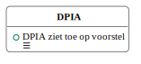
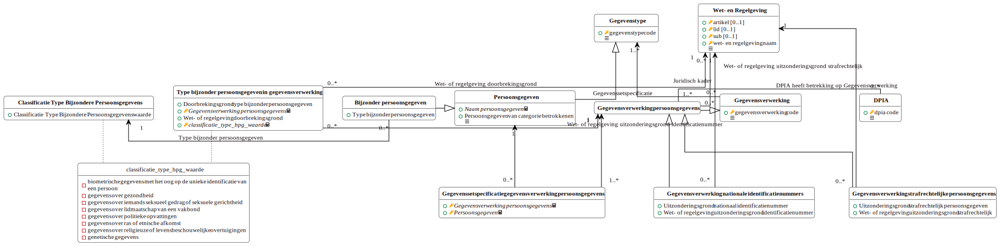
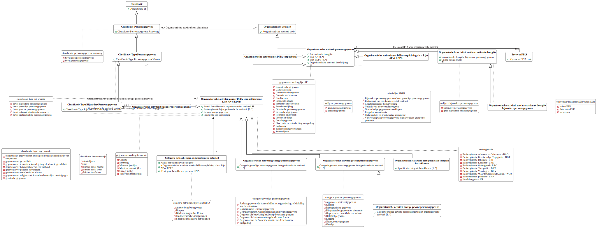
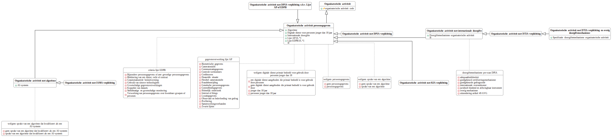

# Logische gegevensmodellen

## DPIA

Vanwege de omvang van het logisch model voor de gehele DPIA wordt het model opgesplitst in sub-modellen per paragraaf.

### DPIA - 00. Algemeen

<a href="./logische-modellen/00_Algemeen.uml.svg" target="_blank">Vergrote versie op nieuw tabblad</a>

### DPIA - 01. Voorstel

<a href="./logische-modellen/01_Voorstel.uml.svg" target="_blank">Vergrote versie op nieuw tabblad</a>

### DPIA - 02. Persoonsgegevens

<a href="./logische-modellen/02_Persoonsgegevens.uml.svg" target="_blank">Vergrote versie op nieuw tabblad</a>

### DPIA - 03. Gegevensverwerkingen

<a href="./logische-modellen/03_Gegevensverwerkingen.uml.svg" target="_blank">Vergrote versie op nieuw tabblad</a>

### DPIA - 04. Technieken en methoden

<a href="./logische-modellen/04_Technieken_en_methoden.uml.svg" target="_blank">Vergrote versie op nieuw tabblad</a>

### DPIA - 05. Verwerkingsdoeleinden

<a href="./logische-modellen/05_Verwerkingsdoeleinden.uml.svg" target="_blank">Vergrote versie op nieuw tabblad</a>

### DPIA - 06. Betrokken partijen

<a href="./logische-modellen/06_Betrokken_partijen.uml.svg" target="_blank">Vergrote versie op nieuw tabblad</a>

### DPIA - 07. Belangen

<a href="./logische-modellen/07_Belangen.uml.svg" target="_blank">Vergrote versie op nieuw tabblad</a>

### DPIA - 08. Verwerkingslocaties

<a href="./logische-modellen/08_Verwerkingslocaties.uml.svg" target="_blank">Vergrote versie op nieuw tabblad</a>

### DPIA - 09. Juridisch en beleidsmatig kader

<a href="./logische-modellen/09_Juridisch_en_beleidsmatig_kader.uml.svg" target="_blank">Vergrote versie op nieuw tabblad</a>

### DPIA - 10. Bewaartermijnen

<a href="./logische-modellen/10_Bewaartermijnen.uml.svg" target="_blank">Vergrote versie op nieuw tabblad</a>

### DPIA - 11. Rechtsgronden

<a href="./logische-modellen/11_Rechtsgronden.uml.svg" target="_blank">Vergrote versie op nieuw tabblad</a>

### DPIA - 12. Bijzondere persoonsgegevens, strafrechtelijke persoonsgegevens en nationale identificatienummers

<a href="./logische-modellen/12_bijzonder_strafrechtelijk_identificatienummer.uml.svg" target="_blank">Vergrote versie op nieuw tabblad</a>

### DPIA - 13. Doelbinding

<a href="./logische-modellen/13_Doelbinding.uml.svg" target="_blank">Vergrote versie op nieuw tabblad</a>

### DPIA - 14. Noodzaak en evenredigheid

<a href="./logische-modellen/14_Noodzaak_en_evenredigheid.uml.svg" target="_blank">Vergrote versie op nieuw tabblad</a>

### DPIA - 15. Rechten van de betrokkene

<a href="./logische-modellen/15_Rechten_van_de_betrokkene.uml.svg" target="_blank">Vergrote versie op nieuw tabblad</a>

### DPIA - 16. Risicos voor betrokkenen

<a href="./logische-modellen/16_Risicos_voor_betrokkenen.uml.svg" target="_blank">Vergrote versie op nieuw tabblad</a>

### DPIA - 17. Maatregelen

<a href="./logische-modellen/17_Maatregelen.uml.svg" target="_blank">Vergrote versie op nieuw tabblad</a>

## Pre-scan DPIA

Voor de pre-scan DPIA zijn er twee logische modellen gemaakt. Eén model met alle relevante gegevens uit de pre-scan DPIA, en één model waarin de verschillende verplichtingen om instrumenten als DPIA, KIA, IAMA en DTIA in te zetten worden uitgedrukt.

### Pre-scan DPIA

<a href="./logische-modellen/pre-scan_dpia.uml.svg" target="_blank">Vergrote versie op nieuw tabblad</a>

### Pre-scan DPIA - Instrument verplichtingen

<a href="./logische-modellen/instrument_verplichtingen.uml.svg" target="_blank">Vergrote versie op nieuw tabblad</a>

