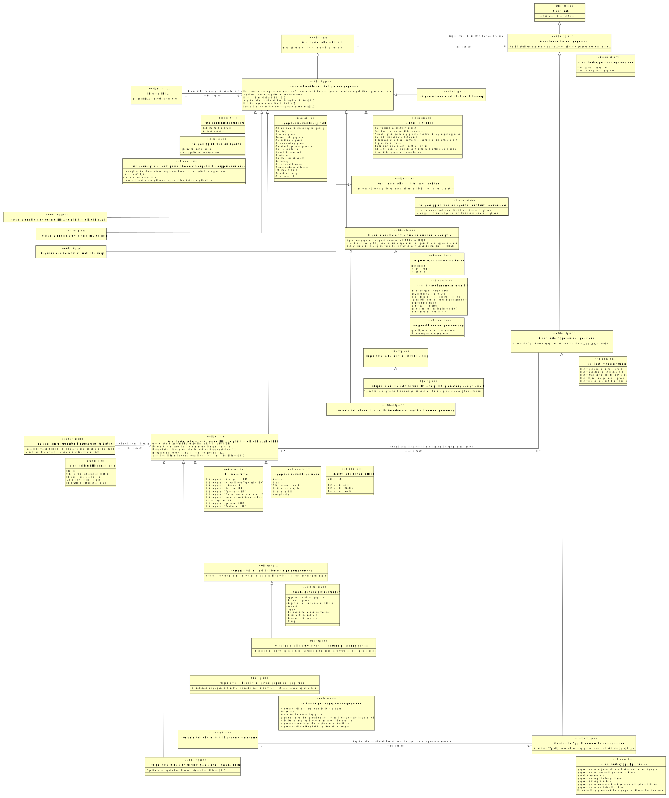

# CIM pre-scan_dpia

- [Categorie betrokkenen in organisatorische activiteit](#-ategorie-betrokkenen-in-organisatorische-activiteit)
- [Classificatie](#-lassificatie)
  - [Classificatie Persoonsgegevens](#-lassificatie-ersoonsgegevens)
    - [Classificatie Type Persoonsgegevens](#-lassificatie-ype-ersoonsgegevens)
      - [Classificatie Type Bijzondere Persoonsgegevens](#-lassificatie-ype-ijzondere-ersoonsgegevens)
- [Organisatorische activiteit](#-rganisatorische-activiteit)
  - [Organisatorische activiteit persoonsgegevens](#-rganisatorische-activiteit-persoonsgegevens)
    - [Organisatorische activiteit met DPIA-verplichting](#-rganisatorische-activiteit-met-verplichting)
    - [Organisatorische activiteit met DPIA-verplichting o.b.v. Lijst AP of EDPB](#-rganisatorische-activiteit-met-verplichting-o-b-v-ijst-of-)
    - [Organisatorische activiteit met KIA verplichting](#-rganisatorische-activiteit-met-verplichting)
    - [Organisatorische activiteit met algoritme](#-rganisatorische-activiteit-met-algoritme)
      - [Organisatorische activiteit met IAMA verplichting](#-rganisatorische-activiteit-met-verplichting)
    - [Organisatorische activiteit met internationale doorgifte](#-rganisatorische-activiteit-met-internationale-doorgifte)
      - [Organisatorische activiteit met DTIA-verplichting](#-rganisatorische-activiteit-met-verplichting)
        - [Organisatorische activiteit met DTIA-verplichting en overig doorgiftemechanisme](#-rganisatorische-activiteit-met-verplichting-en-overig-doorgiftemechanisme)
      - [Organisatorische activiteit met internationale doorgifte bijzondere persoonsgegevens](#-rganisatorische-activiteit-met-internationale-doorgifte-bijzondere-persoonsgegevens)
    - [Organisatorische activiteit zonder DPIA-verplichting o.b.v. Lijst AP of EDPB](#-rganisatorische-activiteit-zonder-verplichting-o-b-v-ijst-of-)
      - [Organisatorische activiteit bijzondere persoonsgegevens](#-rganisatorische-activiteit-bijzondere-persoonsgegevens)
      - [Organisatorische activiteit gevoelige persoonsgegevens](#-rganisatorische-activiteit-gevoelige-persoonsgegevens)
      - [Organisatorische activiteit gewone persoonsgegevens](#-rganisatorische-activiteit-gewone-persoonsgegevens)
        - [Organisatorische activiteit overige gewone persoonsgegevens](#-rganisatorische-activiteit-overige-gewone-persoonsgegevens)
      - [Organisatorische activiteit met specificatie categorie betrokkenen](#-rganisatorische-activiteit-met-specificatie-categorie-betrokkenen)
- [Pre-scan DPIA](#-re-scan-)

## Categorie betrokkenen in organisatorische activiteit {#-ategorie-betrokkenen-in-organisatorische-activiteit}

|{: .def}||
|-|-|
|Kenmerken|[Aantal betrokkenen van categorie](#-antal-betrokkenen-van-categorie), [categorie betrokkenen pre-scan DPIA](#-ategorie-betrokkenen-in-organisatorische-activiteit-categorie-betrokkenen-pre-scan-)|
|Rollen|[Categorie betrokkenen in organisatorische activiteit in relatie met Organisatorische activiteit zonder DPIA-verplichting o.b.v. Lijst AP of EDPB](#-ategorie-betrokkenen-in-organisatorische-activiteit-rganisatorische-activiteit-zonder-verplichting-o-b-v-ijst-of-)|

### categorie betrokkenen pre-scan DPIA {#-ategorie-betrokkenen-in-organisatorische-activiteit-categorie-betrokkenen-pre-scan-}

|{: .def}||
|-|-|
|Eigenschap van|[Categorie betrokkenen in organisatorische activiteit](#-ategorie-betrokkenen-in-organisatorische-activiteit)|
|Type|[categorie betrokkenen pre-scan DPIA](#-categorie-betrokkenen-pre-scan-)|
|Mogelijke waarden|Andere kwetsbare groepen; Kinderen jonger dan 16 jaar; Specificatie categorie betrokkenen; Burgers; Medewerkers/bewindspersonen|

### Aantal betrokkenen van categorie {#-antal-betrokkenen-van-categorie}

|{: .def}||
|-|-|
|Eigenschap van|[Categorie betrokkenen in organisatorische activiteit](#-ategorie-betrokkenen-in-organisatorische-activiteit)|
|Type|[aantal betrokkenen](#-aantal-betrokkenen)|

### Categorie betrokkenen in organisatorische activiteit in relatie met Organisatorische activiteit zonder DPIA-verplichting o.b.v. Lijst AP of EDPB {#-ategorie-betrokkenen-in-organisatorische-activiteit-rganisatorische-activiteit-zonder-verplichting-o-b-v-ijst-of-}

|{: .def}||
|-|-|
|Rol van|0..* [Categorie betrokkenen in organisatorische activiteit](#-ategorie-betrokkenen-in-organisatorische-activiteit)|
|Met|1..1 [Organisatorische activiteit zonder DPIA-verplichting o.b.v. Lijst AP of EDPB](#-rganisatorische-activiteit-zonder-verplichting-o-b-v-ijst-of-)|

## Classificatie {#-lassificatie}

|{: .def}||
|-|-|
|Subtype(s)|[Classificatie Persoonsgegevens](#-lassificatie-ersoonsgegevens)|
|Kenmerken|[classificatie id](#-lassificatie-classificatie-id)|

### classificatie id {#-lassificatie-classificatie-id}

|{: .def}||
|-|-|
|Eigenschap van|[Classificatie](#-lassificatie)|
|Type|CharacterString|

## Classificatie Persoonsgegevens {#-lassificatie-ersoonsgegevens}

|{: .def}||
|-|-|
|Supertype|[Classificatie](#-lassificatie)|
|Subtype(s)|[Classificatie Type Persoonsgegevens](#-lassificatie-ype-ersoonsgegevens)|
|Kenmerken|[Classificatie Persoonsgegevens Aanwezig](#-lassificatie-ersoonsgegevens-anwezig)|
|Relatie met|[Organisatorische activiteit heeft classificatie](#-rganisatorische-activiteit-heeft-classificatie)|

### Classificatie Persoonsgegevens Aanwezig {#-lassificatie-ersoonsgegevens-anwezig}

|{: .def}||
|-|-|
|Eigenschap van|[Classificatie Persoonsgegevens](#-lassificatie-ersoonsgegevens)|
|Type|[classificatie_persoonsgegevens_aanwezig](#-classificatie-persoonsgegevens-aanwezig)|
|Mogelijke waarden|bevat geen persoonsgegevens; bevat persoonsgegevens|

## Classificatie Type Bijzondere Persoonsgegevens {#-lassificatie-ype-ijzondere-ersoonsgegevens}

|{: .def}||
|-|-|
|Supertype|[Classificatie Type Persoonsgegevens](#-lassificatie-ype-ersoonsgegevens)|
|Kenmerken|[Classificatie Type Bijzondere Persoonsgegevens waarde](#-lassificatie-ype-ijzondere-ersoonsgegevens-waarde)|
|Relatie met|[Organisatorische activiteit heeft classificatie type bijzondere persoonsgegevens](#-rganisatorische-activiteit-heeft-classificatie-type-bijzondere-persoonsgegevens)|

### Classificatie Type Bijzondere Persoonsgegevens waarde {#-lassificatie-ype-ijzondere-ersoonsgegevens-waarde}

|{: .def}||
|-|-|
|Eigenschap van|[Classificatie Type Bijzondere Persoonsgegevens](#-lassificatie-ype-ijzondere-ersoonsgegevens)|
|Type|[classificatie_type_bpg_waarde](#-classificatie-type-bpg-waarde)|
|Mogelijke waarden|gegevens over politieke opvattingen; genetische gegevens; gegevens over lidmaatschap van een vakbond; gegevens over religieuze of levensbeschouwelijke overtuigingen; gegevens over iemands seksueel gedrag of seksuele gerichtheid; gegevens over ras of etnische afkomst; biometrische gegevens met het oog op de unieke identificatie van een persoon; gegevens over gezondheid|

## Classificatie Type Persoonsgegevens {#-lassificatie-ype-ersoonsgegevens}

|{: .def}||
|-|-|
|Supertype|[Classificatie Persoonsgegevens](#-lassificatie-ersoonsgegevens)|
|Subtype(s)|[Classificatie Type Bijzondere Persoonsgegevens](#-lassificatie-ype-ijzondere-ersoonsgegevens)|
|Kenmerken|[Classificatie Type Persoonsgegevens Waarde](#-lassificatie-ype-ersoonsgegevens-aarde)|
|Relatie met|[Organisatorische activiteit heeft classificatie type persoonsgegevens](#-rganisatorische-activiteit-heeft-classificatie-type-persoonsgegevens)|

### Classificatie Type Persoonsgegevens Waarde {#-lassificatie-ype-ersoonsgegevens-aarde}

|{: .def}||
|-|-|
|Eigenschap van|[Classificatie Type Persoonsgegevens](#-lassificatie-ype-ersoonsgegevens)|
|Type|[classificatie_type_pg_waarde](#-classificatie-type-pg-waarde)|
|Mogelijke waarden|bevat gewone persoonsgegevens; bevat bijzondere persoonsgegevens; bevat nationale identificatienummers; bevat gevoelige persoonsgegevens; bevat strafrechtelijke persoonsgegevens|

## Organisatorische activiteit {#-rganisatorische-activiteit}

|{: .def}||
|-|-|
|Subtype(s)|[Organisatorische activiteit persoonsgegevens](#-rganisatorische-activiteit-persoonsgegevens)|
|Kenmerken|[organisatorische activiteit code](#-rganisatorische-activiteit-organisatorische-activiteit-code)|
|Rollen|[Organisatorische activiteit heeft classificatie](#-rganisatorische-activiteit-heeft-classificatie)|

### organisatorische activiteit code {#-rganisatorische-activiteit-organisatorische-activiteit-code}

|{: .def}||
|-|-|
|Eigenschap van|[Organisatorische activiteit](#-rganisatorische-activiteit)|
|Type|CharacterString|

### Organisatorische activiteit heeft classificatie {#-rganisatorische-activiteit-heeft-classificatie}

|{: .def}||
|-|-|
|Rol van|0..* [Organisatorische activiteit](#-rganisatorische-activiteit)|
|Met|0..* [Classificatie Persoonsgegevens](#-lassificatie-ersoonsgegevens)|

## Organisatorische activiteit bijzondere persoonsgegevens {#-rganisatorische-activiteit-bijzondere-persoonsgegevens}

|{: .def}||
|-|-|
|Supertype|[Organisatorische activiteit zonder DPIA-verplichting o.b.v. Lijst AP of EDPB](#-rganisatorische-activiteit-zonder-verplichting-o-b-v-ijst-of-)|
|Rollen|[Organisatorische activiteit heeft classificatie type bijzondere persoonsgegevens](#-rganisatorische-activiteit-heeft-classificatie-type-bijzondere-persoonsgegevens)|

### Organisatorische activiteit heeft classificatie type bijzondere persoonsgegevens {#-rganisatorische-activiteit-heeft-classificatie-type-bijzondere-persoonsgegevens}

|{: .def}||
|-|-|
|Rol van|0..* [Organisatorische activiteit bijzondere persoonsgegevens](#-rganisatorische-activiteit-bijzondere-persoonsgegevens)|
|Met|0..* [Classificatie Type Bijzondere Persoonsgegevens](#-lassificatie-ype-ijzondere-ersoonsgegevens)|

## Organisatorische activiteit gevoelige persoonsgegevens {#-rganisatorische-activiteit-gevoelige-persoonsgegevens}

|{: .def}||
|-|-|
|Supertype|[Organisatorische activiteit zonder DPIA-verplichting o.b.v. Lijst AP of EDPB](#-rganisatorische-activiteit-zonder-verplichting-o-b-v-ijst-of-)|
|Kenmerken|[Categorie gevoelige persoonsgegevens in organisatorische activiteit](#-ategorie-gevoelige-persoonsgegevens-in-organisatorische-activiteit)|

### Categorie gevoelige persoonsgegevens in organisatorische activiteit {#-ategorie-gevoelige-persoonsgegevens-in-organisatorische-activiteit}

|{: .def}||
|-|-|
|Eigenschap van|[Organisatorische activiteit gevoelige persoonsgegevens](#-rganisatorische-activiteit-gevoelige-persoonsgegevens)|
|Type|[categorie gevoelige persoonsgegevens](#-categorie-gevoelige-persoonsgegevens)|
|Mogelijke waarden|Gegevens die kunnen worden gebruikt voor fraude; Gebruikersnamen, wachtwoorden en andere inloggegevens; Andere gegevens die kunnen leiden tot stigmatisering of uitsluiting van de betrokkene; Communicatie- en locatiegegevens; Gegevens over de financiële situatie van de betrokkene; Surfgedrag; Gegevens die betrekking hebben op kwetsbare groepen|

## Organisatorische activiteit gewone persoonsgegevens {#-rganisatorische-activiteit-gewone-persoonsgegevens}

|{: .def}||
|-|-|
|Supertype|[Organisatorische activiteit zonder DPIA-verplichting o.b.v. Lijst AP of EDPB](#-rganisatorische-activiteit-zonder-verplichting-o-b-v-ijst-of-)|
|Subtype(s)|[Organisatorische activiteit overige gewone persoonsgegevens](#-rganisatorische-activiteit-overige-gewone-persoonsgegevens)|
|Kenmerken|[Categorie gewone persoonsgegevens in organisatorische activiteit](#-ategorie-gewone-persoonsgegevens-in-organisatorische-activiteit)|

### Categorie gewone persoonsgegevens in organisatorische activiteit {#-ategorie-gewone-persoonsgegevens-in-organisatorische-activiteit}

|{: .def}||
|-|-|
|Eigenschap van|[Organisatorische activiteit gewone persoonsgegevens](#-rganisatorische-activiteit-gewone-persoonsgegevens)|
|Type|[categorie gewone persoonsgegevens](#-categorie-gewone-persoonsgegevens)|
|Mogelijke waarden|Gegevens verzameld via een website; Apparaat- en internetgegevens; Helpdeskgegevens; Content; Naam, contactgegevens; Diagnostische gegevens of telemetrie; Overige; Demografische gegevens; Logging|

## Organisatorische activiteit met DPIA-verplichting {#-rganisatorische-activiteit-met-verplichting}

|{: .def}||
|-|-|
|Supertype|[Organisatorische activiteit persoonsgegevens](#-rganisatorische-activiteit-persoonsgegevens)|

## Organisatorische activiteit met DPIA-verplichting o.b.v. Lijst AP of EDPB {#-rganisatorische-activiteit-met-verplichting-o-b-v-ijst-of-}

|{: .def}||
|-|-|
|Supertype|[Organisatorische activiteit persoonsgegevens](#-rganisatorische-activiteit-persoonsgegevens)|

## Organisatorische activiteit met DTIA-verplichting {#-rganisatorische-activiteit-met-verplichting}

|{: .def}||
|-|-|
|Supertype|[Organisatorische activiteit met internationale doorgifte](#-rganisatorische-activiteit-met-internationale-doorgifte)|
|Subtype(s)|[Organisatorische activiteit met DTIA-verplichting en overig doorgiftemechanisme](#-rganisatorische-activiteit-met-verplichting-en-overig-doorgiftemechanisme)|

## Organisatorische activiteit met DTIA-verplichting en overig doorgiftemechanisme {#-rganisatorische-activiteit-met-verplichting-en-overig-doorgiftemechanisme}

|{: .def}||
|-|-|
|Supertype|[Organisatorische activiteit met DTIA-verplichting](#-rganisatorische-activiteit-met-verplichting)|
|Kenmerken|[Specificatie doorgiftemechanisme organisatorische activiteit](#-pecificatie-doorgiftemechanisme-organisatorische-activiteit)|

### Specificatie doorgiftemechanisme organisatorische activiteit {#-pecificatie-doorgiftemechanisme-organisatorische-activiteit}

|{: .def}||
|-|-|
|Eigenschap van|[Organisatorische activiteit met DTIA-verplichting en overig doorgiftemechanisme](#-rganisatorische-activiteit-met-verplichting-en-overig-doorgiftemechanisme)|
|Type|[specificatie doorgiftemechanisme](#-specificatie-doorgiftemechanisme)|

## Organisatorische activiteit met IAMA verplichting {#-rganisatorische-activiteit-met-verplichting}

|{: .def}||
|-|-|
|Supertype|[Organisatorische activiteit met algoritme](#-rganisatorische-activiteit-met-algoritme)|

## Organisatorische activiteit met KIA verplichting {#-rganisatorische-activiteit-met-verplichting}

|{: .def}||
|-|-|
|Supertype|[Organisatorische activiteit persoonsgegevens](#-rganisatorische-activiteit-persoonsgegevens)|

## Organisatorische activiteit met algoritme {#-rganisatorische-activiteit-met-algoritme}

|{: .def}||
|-|-|
|Supertype|[Organisatorische activiteit persoonsgegevens](#-rganisatorische-activiteit-persoonsgegevens)|
|Subtype(s)|[Organisatorische activiteit met IAMA verplichting](#-rganisatorische-activiteit-met-verplichting)|
|Kenmerken|[AI-systeem](#-systeem)|

### AI-systeem {#-systeem}

|{: .def}||
|-|-|
|Eigenschap van|[Organisatorische activiteit met algoritme](#-rganisatorische-activiteit-met-algoritme)|
|Type|[wel/geen sprake van een algoritme dat kwalificeert als een AI-systeem](#-wel-geen-sprake-van-een-algoritme-dat-kwalificeert-als-een-systeem)|
|Mogelijke waarden|sprake van een algoritme dat kwalificeert als een AI-systeem; geen sprake van een algoritme dat kwalificeert als een AI-systeem|

## Organisatorische activiteit met internationale doorgifte {#-rganisatorische-activiteit-met-internationale-doorgifte}

|{: .def}||
|-|-|
|Supertype|[Organisatorische activiteit persoonsgegevens](#-rganisatorische-activiteit-persoonsgegevens)|
|Subtype(s)|[Organisatorische activiteit met internationale doorgifte bijzondere persoonsgegevens](#-rganisatorische-activiteit-met-internationale-doorgifte-bijzondere-persoonsgegevens), [Organisatorische activiteit met DTIA-verplichting](#-rganisatorische-activiteit-met-verplichting)|
|Kenmerken|[Doorgiftemechanisme organisatorische activiteit](#-oorgiftemechanisme-organisatorische-activiteit), [Internationale doorgifte bijzondere persoonsgegevens](#-nternationale-doorgifte-bijzondere-persoonsgegevens), [Opslag van gegevens](#-pslag-van-gegevens)|

### Opslag van gegevens {#-pslag-van-gegevens}

|{: .def}||
|-|-|
|Eigenschap van|[Organisatorische activiteit met internationale doorgifte](#-rganisatorische-activiteit-met-internationale-doorgifte)|
|Type|[on premise/datacenter EER/buiten EER](#-on-premise-datacenter-buiten-)|
|Mogelijke waarden|datacenter EER; buiten EER; on premise|

### Internationale doorgifte bijzondere persoonsgegevens {#-nternationale-doorgifte-bijzondere-persoonsgegevens}

|{: .def}||
|-|-|
|Eigenschap van|[Organisatorische activiteit met internationale doorgifte](#-rganisatorische-activiteit-met-internationale-doorgifte)|
|Type|[wel/geen bijzondere persoonsgegevens](#-wel-geen-bijzondere-persoonsgegevens)|
|Mogelijke waarden|geen bijzondere persoonsgegevens; bijzondere persoonsgegevens|

### Doorgiftemechanisme organisatorische activiteit {#-oorgiftemechanisme-organisatorische-activiteit}

|{: .def}||
|-|-|
|Eigenschap van|[Organisatorische activiteit met internationale doorgifte](#-rganisatorische-activiteit-met-internationale-doorgifte)|
|Type|[doorgiftemechanisme pre-scan DPIA](#-doorgiftemechanisme-pre-scan-)|
|Mogelijke waarden|Binding Corporate Rules (BCR); standaard contractsbepalingen (SCC); uitzondering artikel 49 AVG; goedgekeurd certificeringsmechanisme; juridisch bindend en afdwingbaar instrument; overig mechanisme; adequaatheidsbesluit; goedgekeurde gedragscode|

## Organisatorische activiteit met internationale doorgifte bijzondere persoonsgegevens {#-rganisatorische-activiteit-met-internationale-doorgifte-bijzondere-persoonsgegevens}

|{: .def}||
|-|-|
|Supertype|[Organisatorische activiteit met internationale doorgifte](#-rganisatorische-activiteit-met-internationale-doorgifte)|

## Organisatorische activiteit met specificatie categorie betrokkenen {#-rganisatorische-activiteit-met-specificatie-categorie-betrokkenen}

|{: .def}||
|-|-|
|Supertype|[Organisatorische activiteit zonder DPIA-verplichting o.b.v. Lijst AP of EDPB](#-rganisatorische-activiteit-zonder-verplichting-o-b-v-ijst-of-)|
|Kenmerken|[Specificatie categorie betrokkenen](#-pecificatie-categorie-betrokkenen)|

### Specificatie categorie betrokkenen {#-pecificatie-categorie-betrokkenen}

|{: .def}||
|-|-|
|Eigenschap van|[Organisatorische activiteit met specificatie categorie betrokkenen](#-rganisatorische-activiteit-met-specificatie-categorie-betrokkenen)|
|Type|[categorie betrokkenen](#-categorie-betrokkenen)|

## Organisatorische activiteit overige gewone persoonsgegevens {#-rganisatorische-activiteit-overige-gewone-persoonsgegevens}

|{: .def}||
|-|-|
|Supertype|[Organisatorische activiteit gewone persoonsgegevens](#-rganisatorische-activiteit-gewone-persoonsgegevens)|
|Kenmerken|[Categorie overige gewone persoonsgegevens in organisatorische activiteit](#-ategorie-overige-gewone-persoonsgegevens-in-organisatorische-activiteit)|

### Categorie overige gewone persoonsgegevens in organisatorische activiteit {#-ategorie-overige-gewone-persoonsgegevens-in-organisatorische-activiteit}

|{: .def}||
|-|-|
|Eigenschap van|[Organisatorische activiteit overige gewone persoonsgegevens](#-rganisatorische-activiteit-overige-gewone-persoonsgegevens)|
|Type|[categorie persoonsgegevens](#-categorie-persoonsgegevens)|

## Organisatorische activiteit persoonsgegevens {#-rganisatorische-activiteit-persoonsgegevens}

|{: .def}||
|-|-|
|Supertype|[Organisatorische activiteit](#-rganisatorische-activiteit)|
|Subtype(s)|[Organisatorische activiteit met DPIA-verplichting o.b.v. Lijst AP of EDPB](#-rganisatorische-activiteit-met-verplichting-o-b-v-ijst-of-), [Organisatorische activiteit zonder DPIA-verplichting o.b.v. Lijst AP of EDPB](#-rganisatorische-activiteit-zonder-verplichting-o-b-v-ijst-of-), [Organisatorische activiteit met algoritme](#-rganisatorische-activiteit-met-algoritme), [Organisatorische activiteit met DPIA-verplichting](#-rganisatorische-activiteit-met-verplichting), [Organisatorische activiteit met internationale doorgifte](#-rganisatorische-activiteit-met-internationale-doorgifte), [Organisatorische activiteit met KIA verplichting](#-rganisatorische-activiteit-met-verplichting)|
|Kenmerken|[Algoritme](#-lgoritme), [Digitale dienst voor personen jonger dan 18](#-igitale-dienst-voor-personen-jonger-dan-18), [Internationale doorgifte](#-nternationale-doorgifte), [Lijst AP](#-ijst-), [Lijst EDPB](#-ijst-), [Organisatorische activiteit beschrijving](#-rganisatorische-activiteit-beschrijving)|
|Relatie met|[Pre-scan DPIA voor organisatorische activiteit](#-re-scan-voor-organisatorische-activiteit)|

### Digitale dienst voor personen jonger dan 18 {#-igitale-dienst-voor-personen-jonger-dan-18}

|{: .def}||
|-|-|
|Eigenschap van|[Organisatorische activiteit persoonsgegevens](#-rganisatorische-activiteit-persoonsgegevens)|
|Type|[wel/geen digitale dienst primair bedoeld voor gebruik door personen jonger dan 18](#-wel-geen-digitale-dienst-primair-bedoeld-voor-gebruik-door-personen-jonger-dan-18)|
|Mogelijke waarden|jonger dan 18 jaar; een digitale dienst aangeboden die primair bedoeld is voor gebruik door personen; geen digitale dienst aangeboden die primair bedoeld is voor gebruik door; personen jonger dan 18 jaar|

### Algoritme {#-lgoritme}

|{: .def}||
|-|-|
|Eigenschap van|[Organisatorische activiteit persoonsgegevens](#-rganisatorische-activiteit-persoonsgegevens)|
|Type|[wel/geen sprake van een algoritme](#-wel-geen-sprake-van-een-algoritme)|
|Mogelijke waarden|sprake van een algoritme; geen sprake van een algoritme|

### Lijst EDPB {#-ijst-}

|{: .def}||
|-|-|
|Eigenschap van|[Organisatorische activiteit persoonsgegevens](#-rganisatorische-activiteit-persoonsgegevens)|
|Type|[criteria lijst EDPB](#-criteria-lijst-)|
|Mogelijke waarden|Bijzondere persoonsgegevens of zeer gevoelige persoonsgegevens; Mensen beoordelen met persoonskenmerken (evaluatie of scoring); Gebruik van nieuwe technologieën; Stelselmatige en grootschalige monitoring; Koppelen van datasets; Geautomatiseerde besluitvorming; Verwerking van persoonsgegevens over kwetsbare groepen of personen; Blokkering van een dienst, recht of contract; Grootschalige gegevensverwerkingen|

### Organisatorische activiteit beschrijving {#-rganisatorische-activiteit-beschrijving}

|{: .def}||
|-|-|
|Eigenschap van|[Organisatorische activiteit persoonsgegevens](#-rganisatorische-activiteit-persoonsgegevens)|
|Type|[beschrijving](#-beschrijving)|

### Lijst AP {#-ijst-}

|{: .def}||
|-|-|
|Eigenschap van|[Organisatorische activiteit persoonsgegevens](#-rganisatorische-activiteit-persoonsgegevens)|
|Type|[gegevensverwerking lijst AP](#-gegevensverwerking-lijst-)|
|Mogelijke waarden|Controle werknemers; Biometrische gegevens; Internet of things; Financiële situatie; Genetische persoonsgegevens; Heimelijk onderzoek; Communicatiegegevens; Gezondheidsgegevens; Locatiegegevens; Zwarte lijsten; Samenwerkingsverbanden; Observatie en beïnvloeding van gedrag; Creditscores; Cameratoezicht; Flexibel cameratoezicht; Profilering; Fraudebestrijding|

### Internationale doorgifte {#-nternationale-doorgifte}

|{: .def}||
|-|-|
|Eigenschap van|[Organisatorische activiteit persoonsgegevens](#-rganisatorische-activiteit-persoonsgegevens)|
|Type|[wel/geen persoonsgegevens](#-wel-geen-persoonsgegevens)|
|Mogelijke waarden|persoonsgegevens; geen persoonsgegevens|

## Organisatorische activiteit zonder DPIA-verplichting o.b.v. Lijst AP of EDPB {#-rganisatorische-activiteit-zonder-verplichting-o-b-v-ijst-of-}

|{: .def}||
|-|-|
|Supertype|[Organisatorische activiteit persoonsgegevens](#-rganisatorische-activiteit-persoonsgegevens)|
|Subtype(s)|[Organisatorische activiteit gewone persoonsgegevens](#-rganisatorische-activiteit-gewone-persoonsgegevens), [Organisatorische activiteit gevoelige persoonsgegevens](#-rganisatorische-activiteit-gevoelige-persoonsgegevens), [Organisatorische activiteit bijzondere persoonsgegevens](#-rganisatorische-activiteit-bijzondere-persoonsgegevens), [Organisatorische activiteit met specificatie categorie betrokkenen](#-rganisatorische-activiteit-met-specificatie-categorie-betrokkenen)|
|Kenmerken|[Aantal betrokkenen in organisatorische activiteit](#-antal-betrokkenen-in-organisatorische-activiteit), [Basisregistratie bij organisatorische activiteit](#-asisregistratie-bij-organisatorische-activiteit), [Bewaartermijn gegevens](#-ewaartermijn-gegevens), [Frequentie van verwerking](#-requentie-van-verwerking)|
|Rollen|[Organisatorische activiteit heeft classificatie type persoonsgegevens](#-rganisatorische-activiteit-heeft-classificatie-type-persoonsgegevens)|
|Relatie met|[Categorie betrokkenen in organisatorische activiteit in relatie met Organisatorische activiteit zonder DPIA-verplichting o.b.v. Lijst AP of EDPB](#-ategorie-betrokkenen-in-organisatorische-activiteit-rganisatorische-activiteit-zonder-verplichting-o-b-v-ijst-of-)|

### Frequentie van verwerking {#-requentie-van-verwerking}

|{: .def}||
|-|-|
|Eigenschap van|[Organisatorische activiteit zonder DPIA-verplichting o.b.v. Lijst AP of EDPB](#-rganisatorische-activiteit-zonder-verplichting-o-b-v-ijst-of-)|
|Type|[gegevensverwerkingsfrequentie](#-gegevensverwerkingsfrequentie)|
|Mogelijke waarden|Vaker dan maandelijks; Minstens jaarlijks; Onregelmatig; Minstens maandelijks; Continu; Eenmalig|

### Basisregistratie bij organisatorische activiteit {#-asisregistratie-bij-organisatorische-activiteit}

|{: .def}||
|-|-|
|Eigenschap van|[Organisatorische activiteit zonder DPIA-verplichting o.b.v. Lijst AP of EDPB](#-rganisatorische-activiteit-zonder-verplichting-o-b-v-ijst-of-)|
|Type|[basisregistratie](#-basisregistratie)|
|Mogelijke waarden|Basisregistratie Grootschalige Topografie - BGT; Basisregistratie Topografie - BRT; Basisregistratie Inkomen - BRI; Basisregistratie Voertuigen - BRV; Basisregistratie Adressen en Gebouwen - BAG; Basisregistratie Ondergrond - BRO; Basisregistratie Waarde Onroerende Zaken - WOZ; Handelsregister - HR; Basisregistratie personen - BRP; Basisregistratie Kadaster - BRK|

### Bewaartermijn gegevens {#-ewaartermijn-gegevens}

|{: .def}||
|-|-|
|Eigenschap van|[Organisatorische activiteit zonder DPIA-verplichting o.b.v. Lijst AP of EDPB](#-rganisatorische-activiteit-zonder-verplichting-o-b-v-ijst-of-)|
|Type|[classificatie bewaartermijn](#-classificatie-bewaartermijn)|
|Mogelijke waarden|Jaar; Minder dan 1 maand; Minder dan 1 week; Minder dan 24 uur; Aantal jaren|

### Aantal betrokkenen in organisatorische activiteit {#-antal-betrokkenen-in-organisatorische-activiteit}

|{: .def}||
|-|-|
|Eigenschap van|[Organisatorische activiteit zonder DPIA-verplichting o.b.v. Lijst AP of EDPB](#-rganisatorische-activiteit-zonder-verplichting-o-b-v-ijst-of-)|
|Type|[aantal betrokkenen](#-aantal-betrokkenen)|

### Organisatorische activiteit heeft classificatie type persoonsgegevens {#-rganisatorische-activiteit-heeft-classificatie-type-persoonsgegevens}

|{: .def}||
|-|-|
|Rol van|0..* [Organisatorische activiteit zonder DPIA-verplichting o.b.v. Lijst AP of EDPB](#-rganisatorische-activiteit-zonder-verplichting-o-b-v-ijst-of-)|
|Met|0..* [Classificatie Type Persoonsgegevens](#-lassificatie-ype-ersoonsgegevens)|

## Pre-scan DPIA {#-re-scan-}

|{: .def}||
|-|-|
|Kenmerken|[pre-scan DPIA code](#-re-scan-pre-scan-code)|
|Rollen|[Pre-scan DPIA voor organisatorische activiteit](#-re-scan-voor-organisatorische-activiteit)|

### pre-scan DPIA code {#-re-scan-pre-scan-code}

|{: .def}||
|-|-|
|Eigenschap van|[Pre-scan DPIA](#-re-scan-)|
|Type|CharacterString|

### Pre-scan DPIA voor organisatorische activiteit {#-re-scan-voor-organisatorische-activiteit}

|{: .def}||
|-|-|
|Rol van|0..* [Pre-scan DPIA](#-re-scan-)|
|Met|0..* [Organisatorische activiteit persoonsgegevens](#-rganisatorische-activiteit-persoonsgegevens)|

## Waardetypering en referentielijsten

### aantal betrokkenen {#-aantal-betrokkenen}

|{: .def}||
|-|-|
|Gebaseerd op|CharacterString|

### beschrijving {#-beschrijving}

|{: .def}||
|-|-|
|Gebaseerd op|CharacterString|

### categorie betrokkenen {#-categorie-betrokkenen}

|{: .def}||
|-|-|

### categorie persoonsgegevens {#-categorie-persoonsgegevens}

|{: .def}||
|-|-|

### specificatie doorgiftemechanisme {#-specificatie-doorgiftemechanisme}

|{: .def}||
|-|-|

### basisregistratie {#-basisregistratie}

De volgende waarden zijn mogelijk:
- Basisregistratie Adressen en Gebouwen - BAG
- Basisregistratie Grootschalige Topografie - BGT
- Basisregistratie Inkomen - BRI
- Basisregistratie Kadaster - BRK
- Basisregistratie Ondergrond - BRO
- Basisregistratie Topografie - BRT
- Basisregistratie Voertuigen - BRV
- Basisregistratie Waarde Onroerende Zaken - WOZ
- Basisregistratie personen - BRP
- Handelsregister - HR

### categorie betrokkenen pre-scan DPIA {#-categorie-betrokkenen-pre-scan-}

De volgende waarden zijn mogelijk:
- Andere kwetsbare groepen
- Burgers
- Kinderen jonger dan 16 jaar
- Medewerkers/bewindspersonen
- Specificatie categorie betrokkenen

### categorie gevoelige persoonsgegevens {#-categorie-gevoelige-persoonsgegevens}

De volgende waarden zijn mogelijk:
- Andere gegevens die kunnen leiden tot stigmatisering of uitsluiting van de betrokkene
- Communicatie- en locatiegegevens
- Gebruikersnamen, wachtwoorden en andere inloggegevens
- Gegevens die betrekking hebben op kwetsbare groepen
- Gegevens die kunnen worden gebruikt voor fraude
- Gegevens over de financiële situatie van de betrokkene
- Surfgedrag

### categorie gewone persoonsgegevens {#-categorie-gewone-persoonsgegevens}

De volgende waarden zijn mogelijk:
- Apparaat- en internetgegevens
- Content
- Demografische gegevens
- Diagnostische gegevens of telemetrie
- Gegevens verzameld via een website
- Helpdeskgegevens
- Logging
- Naam, contactgegevens
- Overige

### classificatie bewaartermijn {#-classificatie-bewaartermijn}

De volgende waarden zijn mogelijk:
- Aantal jaren
- Jaar
- Minder dan 1 maand
- Minder dan 1 week
- Minder dan 24 uur

### classificatie_persoonsgegevens_aanwezig {#-classificatie-persoonsgegevens-aanwezig}

De volgende waarden zijn mogelijk:
- bevat geen persoonsgegevens
- bevat persoonsgegevens

### classificatie_type_bpg_waarde {#-classificatie-type-bpg-waarde}

De volgende waarden zijn mogelijk:
- biometrische gegevens met het oog op de unieke identificatie van een persoon
- gegevens over gezondheid
- gegevens over iemands seksueel gedrag of seksuele gerichtheid
- gegevens over lidmaatschap van een vakbond
- gegevens over politieke opvattingen
- gegevens over ras of etnische afkomst
- gegevens over religieuze of levensbeschouwelijke overtuigingen
- genetische gegevens

### classificatie_type_pg_waarde {#-classificatie-type-pg-waarde}

De volgende waarden zijn mogelijk:
- bevat bijzondere persoonsgegevens
- bevat gevoelige persoonsgegevens
- bevat gewone persoonsgegevens
- bevat nationale identificatienummers
- bevat strafrechtelijke persoonsgegevens

### criteria lijst EDPB {#-criteria-lijst-}

De volgende waarden zijn mogelijk:
- Bijzondere persoonsgegevens of zeer gevoelige persoonsgegevens
- Blokkering van een dienst, recht of contract
- Geautomatiseerde besluitvorming
- Gebruik van nieuwe technologieën
- Grootschalige gegevensverwerkingen
- Koppelen van datasets
- Mensen beoordelen met persoonskenmerken (evaluatie of scoring)
- Stelselmatige en grootschalige monitoring
- Verwerking van persoonsgegevens over kwetsbare groepen of personen

### doorgiftemechanisme pre-scan DPIA {#-doorgiftemechanisme-pre-scan-}

De volgende waarden zijn mogelijk:
- Binding Corporate Rules (BCR)
- adequaatheidsbesluit
- goedgekeurd certificeringsmechanisme
- goedgekeurde gedragscode
- juridisch bindend en afdwingbaar instrument
- overig mechanisme
- standaard contractsbepalingen (SCC)
- uitzondering artikel 49 AVG

### gegevensverwerking lijst AP {#-gegevensverwerking-lijst-}

De volgende waarden zijn mogelijk:
- Biometrische gegevens
- Cameratoezicht
- Communicatiegegevens
- Controle werknemers
- Creditscores
- Financiële situatie
- Flexibel cameratoezicht
- Fraudebestrijding
- Genetische persoonsgegevens
- Gezondheidsgegevens
- Heimelijk onderzoek
- Internet of things
- Locatiegegevens
- Observatie en beïnvloeding van gedrag
- Profilering
- Samenwerkingsverbanden
- Zwarte lijsten

### gegevensverwerkingsfrequentie {#-gegevensverwerkingsfrequentie}

De volgende waarden zijn mogelijk:
- Continu
- Eenmalig
- Minstens jaarlijks
- Minstens maandelijks
- Onregelmatig
- Vaker dan maandelijks

### on premise/datacenter EER/buiten EER {#-on-premise-datacenter-buiten-}

De volgende waarden zijn mogelijk:
- buiten EER
- datacenter EER
- on premise

### wel/geen bijzondere persoonsgegevens {#-wel-geen-bijzondere-persoonsgegevens}

De volgende waarden zijn mogelijk:
- bijzondere persoonsgegevens
- geen bijzondere persoonsgegevens

### wel/geen digitale dienst primair bedoeld voor gebruik door personen jonger dan 18 {#-wel-geen-digitale-dienst-primair-bedoeld-voor-gebruik-door-personen-jonger-dan-18}

De volgende waarden zijn mogelijk:
- een digitale dienst aangeboden die primair bedoeld is voor gebruik door personen
- geen digitale dienst aangeboden die primair bedoeld is voor gebruik door
- jonger dan 18 jaar
- personen jonger dan 18 jaar

### wel/geen persoonsgegevens {#-wel-geen-persoonsgegevens}

De volgende waarden zijn mogelijk:
- geen persoonsgegevens
- persoonsgegevens

### wel/geen sprake van een algoritme {#-wel-geen-sprake-van-een-algoritme}

De volgende waarden zijn mogelijk:
- geen sprake van een algoritme
- sprake van een algoritme

### wel/geen sprake van een algoritme dat kwalificeert als een AI-systeem {#-wel-geen-sprake-van-een-algoritme-dat-kwalificeert-als-een-systeem}

De volgende waarden zijn mogelijk:
- geen sprake van een algoritme dat kwalificeert als een AI-systeem
- sprake van een algoritme dat kwalificeert als een AI-systeem

