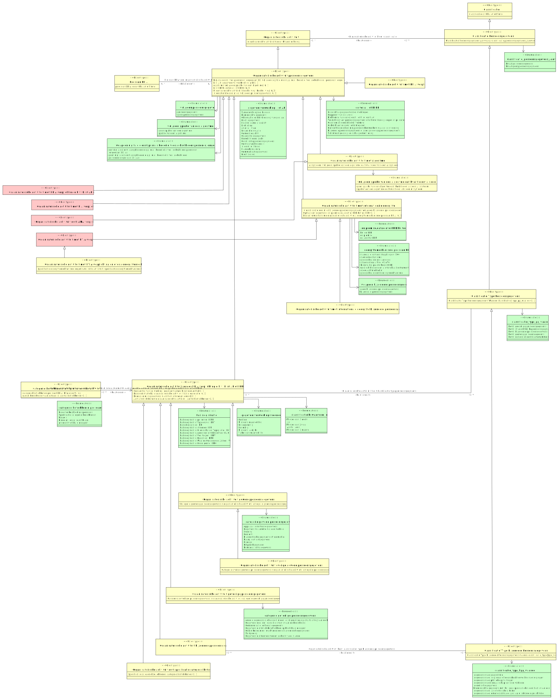

# CIM pre-scan_dpia

- [Categorie betrokkenen in organisatorische activiteit](#TCategorie-betrokkenen-in-organisatorische-activiteit)
- [Classificatie](#TClassificatie)
  - [Classificatie Persoonsgegevens](#TClassificatie-Persoonsgegevens)
    - [Classificatie Type Persoonsgegevens](#TClassificatie-Type-Persoonsgegevens)
      - [Classificatie Type Bijzondere Persoonsgegevens](#TClassificatie-Type-Bijzondere-Persoonsgegevens)
- [Organisatorische activiteit](#TOrganisatorische-activiteit)
  - [Organisatorische activiteit persoonsgegevens](#TOrganisatorische-activiteit-persoonsgegevens)
    - [Organisatorische activiteit met DPIA-verplichting](#TOrganisatorische-activiteit-met-DPIA-verplichting)
    - [Organisatorische activiteit met DPIA-verplichting o.b.v. Lijst AP of EDPB](#TOrganisatorische-activiteit-met-DPIA-verplichting-o-b-v-Lijst-AP-of-EDPB)
    - [Organisatorische activiteit met KIA verplichting](#TOrganisatorische-activiteit-met-KIA-verplichting)
    - [Organisatorische activiteit met algoritme](#TOrganisatorische-activiteit-met-algoritme)
      - [Organisatorische activiteit met IAMA verplichting](#TOrganisatorische-activiteit-met-IAMA-verplichting)
    - [Organisatorische activiteit met internationale doorgifte](#TOrganisatorische-activiteit-met-internationale-doorgifte)
      - [Organisatorische activiteit met DTIA-verplichting](#TOrganisatorische-activiteit-met-DTIA-verplichting)
        - [Organisatorische activiteit met DTIA-verplichting en overig doorgiftemechanisme](#TOrganisatorische-activiteit-met-DTIA-verplichting-en-overig-doorgiftemechanisme)
      - [Organisatorische activiteit met internationale doorgifte bijzondere persoonsgegevens](#TOrganisatorische-activiteit-met-internationale-doorgifte-bijzondere-persoonsgegevens)
    - [Organisatorische activiteit zonder DPIA-verplichting o.b.v. Lijst AP of EDPB](#TOrganisatorische-activiteit-zonder-DPIA-verplichting-o-b-v-Lijst-AP-of-EDPB)
      - [Organisatorische activiteit bijzondere persoonsgegevens](#TOrganisatorische-activiteit-bijzondere-persoonsgegevens)
      - [Organisatorische activiteit gevoelige persoonsgegevens](#TOrganisatorische-activiteit-gevoelige-persoonsgegevens)
      - [Organisatorische activiteit gewone persoonsgegevens](#TOrganisatorische-activiteit-gewone-persoonsgegevens)
        - [Organisatorische activiteit overige gewone persoonsgegevens](#TOrganisatorische-activiteit-overige-gewone-persoonsgegevens)
      - [Organisatorische activiteit met specificatie categorie betrokkenen](#TOrganisatorische-activiteit-met-specificatie-categorie-betrokkenen)
- [Pre-scan DPIA](#TPre-scan-DPIA)

## Categorie betrokkenen in organisatorische activiteit {#TCategorie-betrokkenen-in-organisatorische-activiteit}

|{: .def}||
|-|-|
|Begrip|[Categorie betrokkenen in organisatorische activiteit](#categorie-betrokkenen-in-organisatorische-activiteit)|
|Kenmerken|[Aantal betrokkenen van categorie](#TAantal-betrokkenen-van-categorie), [categorie betrokkenen pre-scan DPIA](#TCategorie-betrokkenen-in-organisatorische-activiteit-categorie-betrokkenen-pre-scan-DPIA)|
|Rollen|[Categorie betrokkenen in organisatorische activiteit in relatie met Organisatorische activiteit zonder DPIA-verplichting o.b.v. Lijst AP of EDPB](#TCategorie-betrokkenen-in-organisatorische-activiteit-Organisatorische-activiteit-zonder-DPIA-verplichting-o-b-v-Lijst-AP-of-EDPB)|

### categorie betrokkenen pre-scan DPIA {#TCategorie-betrokkenen-in-organisatorische-activiteit-categorie-betrokkenen-pre-scan-DPIA}

|{: .def}||
|-|-|
|Eigenschap van|[Categorie betrokkenen in organisatorische activiteit](#TCategorie-betrokkenen-in-organisatorische-activiteit)|
|Type|CharacterString|

### Aantal betrokkenen van categorie {#TAantal-betrokkenen-van-categorie}

|{: .def}||
|-|-|
|Eigenschap van|[Categorie betrokkenen in organisatorische activiteit](#TCategorie-betrokkenen-in-organisatorische-activiteit)|
|Type|[aantal betrokkenen](#Taantal-betrokkenen)|

### Categorie betrokkenen in organisatorische activiteit in relatie met Organisatorische activiteit zonder DPIA-verplichting o.b.v. Lijst AP of EDPB {#TCategorie-betrokkenen-in-organisatorische-activiteit-Organisatorische-activiteit-zonder-DPIA-verplichting-o-b-v-Lijst-AP-of-EDPB}

|{: .def}||
|-|-|
|Rol van|0..* [Categorie betrokkenen in organisatorische activiteit](#TCategorie-betrokkenen-in-organisatorische-activiteit)|
|Met|1..1 [Organisatorische activiteit zonder DPIA-verplichting o.b.v. Lijst AP of EDPB](#TOrganisatorische-activiteit-zonder-DPIA-verplichting-o-b-v-Lijst-AP-of-EDPB)|

## Classificatie {#TClassificatie}

|{: .def}||
|-|-|
|Begrip|[Classificatie](#classificatie)|
|Subtype(s)|[Classificatie Persoonsgegevens](#TClassificatie-Persoonsgegevens)|
|Kenmerken|[classificatie id](#TClassificatie-classificatie-id)|

### classificatie id {#TClassificatie-classificatie-id}

|{: .def}||
|-|-|
|Eigenschap van|[Classificatie](#TClassificatie)|
|Type|CharacterString|

## Classificatie Persoonsgegevens {#TClassificatie-Persoonsgegevens}

|{: .def}||
|-|-|
|Begrip|[Classificatie persoonsgegevens](#classificatie-persoonsgegevens)|
|Supertype|[Classificatie](#TClassificatie)|
|Subtype(s)|[Classificatie Type Persoonsgegevens](#TClassificatie-Type-Persoonsgegevens)|
|Kenmerken|[Classificatie Persoonsgegevens Aanwezig](#TClassificatie-Persoonsgegevens-Aanwezig)|
|Relatie met|[Organisatorische activiteit heeft classificatie](#TOrganisatorische-activiteit-heeft-classificatie)|

### Classificatie Persoonsgegevens Aanwezig {#TClassificatie-Persoonsgegevens-Aanwezig}

|{: .def}||
|-|-|
|Eigenschap van|[Classificatie Persoonsgegevens](#TClassificatie-Persoonsgegevens)|
|Type|[classificatie_persoonsgegevens_aanwezig](#Tclassificatie-persoonsgegevens-aanwezig)|
|Mogelijke waarden|bevat geen persoonsgegevens; bevat persoonsgegevens|

## Classificatie Type Bijzondere Persoonsgegevens {#TClassificatie-Type-Bijzondere-Persoonsgegevens}

|{: .def}||
|-|-|
|Supertype|[Classificatie Type Persoonsgegevens](#TClassificatie-Type-Persoonsgegevens)|
|Kenmerken|[Classificatie Type Bijzondere Persoonsgegevens waarde](#TClassificatie-Type-Bijzondere-Persoonsgegevens-waarde)|
|Relatie met|[Organisatorische activiteit heeft classificatie type bijzondere persoonsgegevens](#TOrganisatorische-activiteit-heeft-classificatie-type-bijzondere-persoonsgegevens)|

### Classificatie Type Bijzondere Persoonsgegevens waarde {#TClassificatie-Type-Bijzondere-Persoonsgegevens-waarde}

|{: .def}||
|-|-|
|Eigenschap van|[Classificatie Type Bijzondere Persoonsgegevens](#TClassificatie-Type-Bijzondere-Persoonsgegevens)|
|Type|[classificatie_type_bpg_waarde](#Tclassificatie-type-bpg-waarde)|
|Mogelijke waarden|gegevens over iemands seksueel gedrag of seksuele gerichtheid; gegevens over politieke opvattingen; gegevens over ras of etnische afkomst; biometrische gegevens met het oog op de unieke identificatie van een persoon; gegevens over lidmaatschap van een vakbond; gegevens over gezondheid; genetische gegevens; gegevens over religieuze of levensbeschouwelijke overtuigingen|

## Classificatie Type Persoonsgegevens {#TClassificatie-Type-Persoonsgegevens}

|{: .def}||
|-|-|
|Begrip|[Classificatie type persoonsgegevens](#classificatie-type-persoonsgegevens)|
|Supertype|[Classificatie Persoonsgegevens](#TClassificatie-Persoonsgegevens)|
|Subtype(s)|[Classificatie Type Bijzondere Persoonsgegevens](#TClassificatie-Type-Bijzondere-Persoonsgegevens)|
|Kenmerken|[Classificatie Type Persoonsgegevens Waarde](#TClassificatie-Type-Persoonsgegevens-Waarde)|
|Relatie met|[Organisatorische activiteit heeft classificatie type persoonsgegevens](#TOrganisatorische-activiteit-heeft-classificatie-type-persoonsgegevens)|

### Classificatie Type Persoonsgegevens Waarde {#TClassificatie-Type-Persoonsgegevens-Waarde}

|{: .def}||
|-|-|
|Eigenschap van|[Classificatie Type Persoonsgegevens](#TClassificatie-Type-Persoonsgegevens)|
|Type|[classificatie_type_pg_waarde](#Tclassificatie-type-pg-waarde)|
|Mogelijke waarden|bevat bijzondere persoonsgegevens; bevat nationale identificatienummers; bevat gewone persoonsgegevens; bevat strafrechtelijke persoonsgegevens; bevat gevoelige persoonsgegevens|

## Organisatorische activiteit {#TOrganisatorische-activiteit}

|{: .def}||
|-|-|
|Begrip|[Organisatorische activiteit](#organisatorische-activiteit)|
|Subtype(s)|[Organisatorische activiteit persoonsgegevens](#TOrganisatorische-activiteit-persoonsgegevens)|
|Kenmerken|[organisatorische activiteit code](#TOrganisatorische-activiteit-organisatorische-activiteit-code)|
|Rollen|[Organisatorische activiteit heeft classificatie](#TOrganisatorische-activiteit-heeft-classificatie)|

### organisatorische activiteit code {#TOrganisatorische-activiteit-organisatorische-activiteit-code}

|{: .def}||
|-|-|
|Eigenschap van|[Organisatorische activiteit](#TOrganisatorische-activiteit)|
|Type|CharacterString|

### Organisatorische activiteit heeft classificatie {#TOrganisatorische-activiteit-heeft-classificatie}

|{: .def}||
|-|-|
|Rol van|0..* [Organisatorische activiteit](#TOrganisatorische-activiteit)|
|Met|0..* [Classificatie Persoonsgegevens](#TClassificatie-Persoonsgegevens)|

## Organisatorische activiteit bijzondere persoonsgegevens {#TOrganisatorische-activiteit-bijzondere-persoonsgegevens}

|{: .def}||
|-|-|
|Begrip|[Organisatorische activiteit bijzondere persoonsgegevens](#organisatorische-activiteit-bijzondere-persoonsgegevens)|
|Supertype|[Organisatorische activiteit zonder DPIA-verplichting o.b.v. Lijst AP of EDPB](#TOrganisatorische-activiteit-zonder-DPIA-verplichting-o-b-v-Lijst-AP-of-EDPB)|
|Rollen|[Organisatorische activiteit heeft classificatie type bijzondere persoonsgegevens](#TOrganisatorische-activiteit-heeft-classificatie-type-bijzondere-persoonsgegevens)|

### Organisatorische activiteit heeft classificatie type bijzondere persoonsgegevens {#TOrganisatorische-activiteit-heeft-classificatie-type-bijzondere-persoonsgegevens}

|{: .def}||
|-|-|
|Rol van|0..* [Organisatorische activiteit bijzondere persoonsgegevens](#TOrganisatorische-activiteit-bijzondere-persoonsgegevens)|
|Met|0..* [Classificatie Type Bijzondere Persoonsgegevens](#TClassificatie-Type-Bijzondere-Persoonsgegevens)|

## Organisatorische activiteit gevoelige persoonsgegevens {#TOrganisatorische-activiteit-gevoelige-persoonsgegevens}

|{: .def}||
|-|-|
|Begrip|[Organisatorische activiteit gevoelige persoonsgegevens](#organisatorische-activiteit-gevoelige-persoonsgegevens)|
|Supertype|[Organisatorische activiteit zonder DPIA-verplichting o.b.v. Lijst AP of EDPB](#TOrganisatorische-activiteit-zonder-DPIA-verplichting-o-b-v-Lijst-AP-of-EDPB)|
|Kenmerken|[Categorie gevoelige persoonsgegevens in organisatorische activiteit](#TCategorie-gevoelige-persoonsgegevens-in-organisatorische-activiteit)|

### Categorie gevoelige persoonsgegevens in organisatorische activiteit {#TCategorie-gevoelige-persoonsgegevens-in-organisatorische-activiteit}

|{: .def}||
|-|-|
|Eigenschap van|[Organisatorische activiteit gevoelige persoonsgegevens](#TOrganisatorische-activiteit-gevoelige-persoonsgegevens)|
|Type|[categorie gevoelige persoonsgegevens](#Tcategorie-gevoelige-persoonsgegevens)|
|Mogelijke waarden|Communicatie- en locatiegegevens; Gegevens over de financiële situatie van de betrokkene; Surfgedrag; Gegevens die betrekking hebben op kwetsbare groepen; Gegevens die kunnen worden gebruikt voor fraude; Andere gegevens die kunnen leiden tot stigmatisering of uitsluiting van de betrokkene; Gebruikersnamen, wachtwoorden en andere inloggegevens|

## Organisatorische activiteit gewone persoonsgegevens {#TOrganisatorische-activiteit-gewone-persoonsgegevens}

|{: .def}||
|-|-|
|Begrip|[Organisatorische activiteit gewone persoonsgegevens](#organisatorische-activiteit-gewone-persoonsgegevens)|
|Supertype|[Organisatorische activiteit zonder DPIA-verplichting o.b.v. Lijst AP of EDPB](#TOrganisatorische-activiteit-zonder-DPIA-verplichting-o-b-v-Lijst-AP-of-EDPB)|
|Subtype(s)|[Organisatorische activiteit overige gewone persoonsgegevens](#TOrganisatorische-activiteit-overige-gewone-persoonsgegevens)|
|Kenmerken|[Categorie gewone persoonsgegevens in organisatorische activiteit](#TCategorie-gewone-persoonsgegevens-in-organisatorische-activiteit)|

### Categorie gewone persoonsgegevens in organisatorische activiteit {#TCategorie-gewone-persoonsgegevens-in-organisatorische-activiteit}

|{: .def}||
|-|-|
|Eigenschap van|[Organisatorische activiteit gewone persoonsgegevens](#TOrganisatorische-activiteit-gewone-persoonsgegevens)|
|Type|[categorie gewone persoonsgegevens](#Tcategorie-gewone-persoonsgegevens)|
|Mogelijke waarden|Helpdeskgegevens; Demografische gegevens; Gegevens verzameld via een website; Diagnostische gegevens of telemetrie; Logging; Overige; Apparaat- en internetgegevens; Content; Naam, contactgegevens|

## Organisatorische activiteit met DPIA-verplichting {#TOrganisatorische-activiteit-met-DPIA-verplichting}

|{: .def}||
|-|-|
|Begrip|[Organisatorische activiteit met DPIA-verplichting](#organisatorische-activiteit-met-dpia-verplichting)|
|Supertype|[Organisatorische activiteit persoonsgegevens](#TOrganisatorische-activiteit-persoonsgegevens)|

## Organisatorische activiteit met DPIA-verplichting o.b.v. Lijst AP of EDPB {#TOrganisatorische-activiteit-met-DPIA-verplichting-o-b-v-Lijst-AP-of-EDPB}

|{: .def}||
|-|-|
|Begrip|[Organisatorische activiteit met DPIA-verplichting o.b.v. lijst AP of EDPB](#organisatorische-activiteit-met-dpia-verplichting-o-b-v-lijst-ap-of-edpb)|
|Supertype|[Organisatorische activiteit persoonsgegevens](#TOrganisatorische-activiteit-persoonsgegevens)|

## Organisatorische activiteit met DTIA-verplichting {#TOrganisatorische-activiteit-met-DTIA-verplichting}

|{: .def}||
|-|-|
|Begrip|[Organisatorische activiteit met DTIA-verplichting](#organisatorische-activiteit-met-dtia-verplichting)|
|Supertype|[Organisatorische activiteit met internationale doorgifte](#TOrganisatorische-activiteit-met-internationale-doorgifte)|
|Subtype(s)|[Organisatorische activiteit met DTIA-verplichting en overig doorgiftemechanisme](#TOrganisatorische-activiteit-met-DTIA-verplichting-en-overig-doorgiftemechanisme)|

## Organisatorische activiteit met DTIA-verplichting en overig doorgiftemechanisme {#TOrganisatorische-activiteit-met-DTIA-verplichting-en-overig-doorgiftemechanisme}

|{: .def}||
|-|-|
|Begrip|[Organisatorische activiteit met DTIA-verplichting en overig doorgiftemechanisme](#organisatorische-activiteit-met-dtia-verplichting-en-overig-doorgiftemechanisme)|
|Supertype|[Organisatorische activiteit met DTIA-verplichting](#TOrganisatorische-activiteit-met-DTIA-verplichting)|
|Kenmerken|[Specificatie doorgiftemechanisme organisatorische activiteit](#TSpecificatie-doorgiftemechanisme-organisatorische-activiteit)|

### Specificatie doorgiftemechanisme organisatorische activiteit {#TSpecificatie-doorgiftemechanisme-organisatorische-activiteit}

|{: .def}||
|-|-|
|Eigenschap van|[Organisatorische activiteit met DTIA-verplichting en overig doorgiftemechanisme](#TOrganisatorische-activiteit-met-DTIA-verplichting-en-overig-doorgiftemechanisme)|
|Type|[specificatie doorgiftemechanisme](#Tspecificatie-doorgiftemechanisme)|

## Organisatorische activiteit met IAMA verplichting {#TOrganisatorische-activiteit-met-IAMA-verplichting}

|{: .def}||
|-|-|
|Supertype|[Organisatorische activiteit met algoritme](#TOrganisatorische-activiteit-met-algoritme)|

## Organisatorische activiteit met KIA verplichting {#TOrganisatorische-activiteit-met-KIA-verplichting}

|{: .def}||
|-|-|
|Supertype|[Organisatorische activiteit persoonsgegevens](#TOrganisatorische-activiteit-persoonsgegevens)|

## Organisatorische activiteit met algoritme {#TOrganisatorische-activiteit-met-algoritme}

|{: .def}||
|-|-|
|Begrip|[Organisatorische activiteit met algoritme](#organisatorische-activiteit-met-algoritme)|
|Supertype|[Organisatorische activiteit persoonsgegevens](#TOrganisatorische-activiteit-persoonsgegevens)|
|Subtype(s)|[Organisatorische activiteit met IAMA verplichting](#TOrganisatorische-activiteit-met-IAMA-verplichting)|
|Kenmerken|[AI-systeem](#TAI-systeem)|

### AI-systeem {#TAI-systeem}

|{: .def}||
|-|-|
|Begrip|[AI-systeem](#ai-systeem)|
|Eigenschap van|[Organisatorische activiteit met algoritme](#TOrganisatorische-activiteit-met-algoritme)|
|Type|[wel/geen sprake van een algoritme dat kwalificeert als een AI-systeem](#Twel-geen-sprake-van-een-algoritme-dat-kwalificeert-als-een-AI-systeem)|
|Mogelijke waarden|geen sprake van een algoritme dat kwalificeert als een AI-systeem; sprake van een algoritme dat kwalificeert als een AI-systeem|

## Organisatorische activiteit met internationale doorgifte {#TOrganisatorische-activiteit-met-internationale-doorgifte}

|{: .def}||
|-|-|
|Begrip|[Organisatorische activiteit met internationale doorgifte](#organisatorische-activiteit-met-internationale-doorgifte)|
|Supertype|[Organisatorische activiteit persoonsgegevens](#TOrganisatorische-activiteit-persoonsgegevens)|
|Subtype(s)|[Organisatorische activiteit met internationale doorgifte bijzondere persoonsgegevens](#TOrganisatorische-activiteit-met-internationale-doorgifte-bijzondere-persoonsgegevens), [Organisatorische activiteit met DTIA-verplichting](#TOrganisatorische-activiteit-met-DTIA-verplichting)|
|Kenmerken|[Doorgiftemechanisme organisatorische activiteit](#TDoorgiftemechanisme-organisatorische-activiteit), [Internationale doorgifte bijzondere persoonsgegevens](#TInternationale-doorgifte-bijzondere-persoonsgegevens), [Opslag van gegevens](#TOpslag-van-gegevens)|

### Internationale doorgifte bijzondere persoonsgegevens {#TInternationale-doorgifte-bijzondere-persoonsgegevens}

|{: .def}||
|-|-|
|Eigenschap van|[Organisatorische activiteit met internationale doorgifte](#TOrganisatorische-activiteit-met-internationale-doorgifte)|
|Type|[wel/geen bijzondere persoonsgegevens](#Twel-geen-bijzondere-persoonsgegevens)|
|Mogelijke waarden|bijzondere persoonsgegevens; geen bijzondere persoonsgegevens|

### Opslag van gegevens {#TOpslag-van-gegevens}

|{: .def}||
|-|-|
|Begrip|[Opslag van gegevens](#opslag-van-gegevens)|
|Eigenschap van|[Organisatorische activiteit met internationale doorgifte](#TOrganisatorische-activiteit-met-internationale-doorgifte)|
|Type|[on premise/datacenter EER/buiten EER](#Ton-premise-datacenter-EER-buiten-EER)|
|Mogelijke waarden|buiten EER; datacenter EER; on premise|

### Doorgiftemechanisme organisatorische activiteit {#TDoorgiftemechanisme-organisatorische-activiteit}

|{: .def}||
|-|-|
|Eigenschap van|[Organisatorische activiteit met internationale doorgifte](#TOrganisatorische-activiteit-met-internationale-doorgifte)|
|Type|[doorgiftemechanisme pre-scan DPIA](#Tdoorgiftemechanisme-pre-scan-DPIA)|
|Mogelijke waarden|standaard contractsbepalingen (SCC); uitzondering artikel 49 AVG; Binding Corporate Rules (BCR); goedgekeurd certificeringsmechanisme; overig mechanisme; goedgekeurde gedragscode; juridisch bindend en afdwingbaar instrument; adequaatheidsbesluit|

## Organisatorische activiteit met internationale doorgifte bijzondere persoonsgegevens {#TOrganisatorische-activiteit-met-internationale-doorgifte-bijzondere-persoonsgegevens}

|{: .def}||
|-|-|
|Begrip|[Organisatorische activiteit met internationale doorgifte bijzondere persoonsgegevens](#organisatorische-activiteit-met-internationale-doorgifte-bijzondere-persoonsgegevens)|
|Supertype|[Organisatorische activiteit met internationale doorgifte](#TOrganisatorische-activiteit-met-internationale-doorgifte)|

## Organisatorische activiteit met specificatie categorie betrokkenen {#TOrganisatorische-activiteit-met-specificatie-categorie-betrokkenen}

|{: .def}||
|-|-|
|Begrip|[Organisatorische activiteit met specificatie categorie betrokkenen](#organisatorische-activiteit-met-specificatie-categorie-betrokkenen)|
|Supertype|[Organisatorische activiteit zonder DPIA-verplichting o.b.v. Lijst AP of EDPB](#TOrganisatorische-activiteit-zonder-DPIA-verplichting-o-b-v-Lijst-AP-of-EDPB)|
|Kenmerken|[Specificatie categorie betrokkenen](#TSpecificatie-categorie-betrokkenen)|

### Specificatie categorie betrokkenen {#TSpecificatie-categorie-betrokkenen}

|{: .def}||
|-|-|
|Begrip|[Specificatie categorie betrokkenen](#specificatie-categorie-betrokkenen)|
|Eigenschap van|[Organisatorische activiteit met specificatie categorie betrokkenen](#TOrganisatorische-activiteit-met-specificatie-categorie-betrokkenen)|
|Type|[categorie betrokkenen](#Tcategorie-betrokkenen)|

## Organisatorische activiteit overige gewone persoonsgegevens {#TOrganisatorische-activiteit-overige-gewone-persoonsgegevens}

|{: .def}||
|-|-|
|Begrip|[Organisatorische activiteit overige gewone persoonsgegevens](#organisatorische-activiteit-overige-gewone-persoonsgegevens)|
|Supertype|[Organisatorische activiteit gewone persoonsgegevens](#TOrganisatorische-activiteit-gewone-persoonsgegevens)|
|Kenmerken|[Categorie overige gewone persoonsgegevens in organisatorische activiteit](#TCategorie-overige-gewone-persoonsgegevens-in-organisatorische-activiteit)|

### Categorie overige gewone persoonsgegevens in organisatorische activiteit {#TCategorie-overige-gewone-persoonsgegevens-in-organisatorische-activiteit}

|{: .def}||
|-|-|
|Eigenschap van|[Organisatorische activiteit overige gewone persoonsgegevens](#TOrganisatorische-activiteit-overige-gewone-persoonsgegevens)|
|Type|[categorie persoonsgegevens](#Tcategorie-persoonsgegevens)|

## Organisatorische activiteit persoonsgegevens {#TOrganisatorische-activiteit-persoonsgegevens}

|{: .def}||
|-|-|
|Begrip|[Organisatorische activiteit persoonsgegevens](#organisatorische-activiteit-persoonsgegevens)|
|Supertype|[Organisatorische activiteit](#TOrganisatorische-activiteit)|
|Subtype(s)|[Organisatorische activiteit met DPIA-verplichting o.b.v. Lijst AP of EDPB](#TOrganisatorische-activiteit-met-DPIA-verplichting-o-b-v-Lijst-AP-of-EDPB), [Organisatorische activiteit met DPIA-verplichting](#TOrganisatorische-activiteit-met-DPIA-verplichting), [Organisatorische activiteit met internationale doorgifte](#TOrganisatorische-activiteit-met-internationale-doorgifte), [Organisatorische activiteit met KIA verplichting](#TOrganisatorische-activiteit-met-KIA-verplichting), [Organisatorische activiteit zonder DPIA-verplichting o.b.v. Lijst AP of EDPB](#TOrganisatorische-activiteit-zonder-DPIA-verplichting-o-b-v-Lijst-AP-of-EDPB), [Organisatorische activiteit met algoritme](#TOrganisatorische-activiteit-met-algoritme)|
|Kenmerken|[Algoritme](#TAlgoritme), [Digitale dienst voor personen jonger dan 18](#TDigitale-dienst-voor-personen-jonger-dan-18), [Internationale doorgifte](#TInternationale-doorgifte), [Lijst AP](#TLijst-AP), [Lijst EDPB](#TLijst-EDPB), [Organisatorische activiteit beschrijving](#TOrganisatorische-activiteit-beschrijving)|
|Relatie met|[Pre-scan DPIA voor organisatorische activiteit](#TPre-scan-DPIA-voor-organisatorische-activiteit)|

### Digitale dienst voor personen jonger dan 18 {#TDigitale-dienst-voor-personen-jonger-dan-18}

|{: .def}||
|-|-|
|Eigenschap van|[Organisatorische activiteit persoonsgegevens](#TOrganisatorische-activiteit-persoonsgegevens)|
|Type|[wel/geen digitale dienst primair bedoeld voor gebruik door personen jonger dan 18](#Twel-geen-digitale-dienst-primair-bedoeld-voor-gebruik-door-personen-jonger-dan-18)|
|Mogelijke waarden|een digitale dienst aangeboden die primair bedoeld is voor gebruik door personen; personen jonger dan 18 jaar; jonger dan 18 jaar; geen digitale dienst aangeboden die primair bedoeld is voor gebruik door|

### Lijst AP {#TLijst-AP}

|{: .def}||
|-|-|
|Begrip|[Lijst AP](#lijst-ap)|
|Eigenschap van|[Organisatorische activiteit persoonsgegevens](#TOrganisatorische-activiteit-persoonsgegevens)|
|Type|[gegevensverwerking lijst AP](#Tgegevensverwerking-lijst-AP)|
|Mogelijke waarden|Communicatiegegevens; Observatie en beïnvloeding van gedrag; Zwarte lijsten; Biometrische gegevens; Gezondheidsgegevens; Locatiegegevens; Heimelijk onderzoek; Profilering; Financiële situatie; Controle werknemers; Creditscores; Internet of things; Genetische persoonsgegevens; Cameratoezicht; Fraudebestrijding; Samenwerkingsverbanden; Flexibel cameratoezicht|

### Algoritme {#TAlgoritme}

|{: .def}||
|-|-|
|Begrip|[Algoritme](#algoritme)|
|Eigenschap van|[Organisatorische activiteit persoonsgegevens](#TOrganisatorische-activiteit-persoonsgegevens)|
|Type|[wel/geen sprake van een algoritme](#Twel-geen-sprake-van-een-algoritme)|
|Mogelijke waarden|sprake van een algoritme; geen sprake van een algoritme|

### Lijst EDPB {#TLijst-EDPB}

|{: .def}||
|-|-|
|Begrip|[Lijst EDPB](#lijst-edpb)|
|Eigenschap van|[Organisatorische activiteit persoonsgegevens](#TOrganisatorische-activiteit-persoonsgegevens)|
|Type|[criteria lijst EDPB](#Tcriteria-lijst-EDPB)|
|Mogelijke waarden|Stelselmatige en grootschalige monitoring; Geautomatiseerde besluitvorming; Grootschalige gegevensverwerkingen; Mensen beoordelen met persoonskenmerken (evaluatie of scoring); Blokkering van een dienst, recht of contract; Koppelen van datasets; Verwerking van persoonsgegevens over kwetsbare groepen of personen; Gebruik van nieuwe technologieën; Bijzondere persoonsgegevens of zeer gevoelige persoonsgegevens|

### Organisatorische activiteit beschrijving {#TOrganisatorische-activiteit-beschrijving}

|{: .def}||
|-|-|
|Begrip|[Organisatorische activiteit beschrijving](#organisatorische-activiteit-beschrijving)|
|Eigenschap van|[Organisatorische activiteit persoonsgegevens](#TOrganisatorische-activiteit-persoonsgegevens)|
|Type|[beschrijving](#Tbeschrijving)|

### Internationale doorgifte {#TInternationale-doorgifte}

|{: .def}||
|-|-|
|Begrip|[Internationale doorgifte](#internationale-doorgifte)|
|Eigenschap van|[Organisatorische activiteit persoonsgegevens](#TOrganisatorische-activiteit-persoonsgegevens)|
|Type|[wel/geen persoonsgegevens](#Twel-geen-persoonsgegevens)|
|Mogelijke waarden|persoonsgegevens; geen persoonsgegevens|

## Organisatorische activiteit zonder DPIA-verplichting o.b.v. Lijst AP of EDPB {#TOrganisatorische-activiteit-zonder-DPIA-verplichting-o-b-v-Lijst-AP-of-EDPB}

|{: .def}||
|-|-|
|Begrip|[Organisatorische activiteit zonder DPIA-verplichting o.b.v. lijst AP of EDPB](#organisatorische-activiteit-zonder-dpia-verplichting-o-b-v-lijst-ap-of-edpb)|
|Supertype|[Organisatorische activiteit persoonsgegevens](#TOrganisatorische-activiteit-persoonsgegevens)|
|Subtype(s)|[Organisatorische activiteit met specificatie categorie betrokkenen](#TOrganisatorische-activiteit-met-specificatie-categorie-betrokkenen), [Organisatorische activiteit gewone persoonsgegevens](#TOrganisatorische-activiteit-gewone-persoonsgegevens), [Organisatorische activiteit gevoelige persoonsgegevens](#TOrganisatorische-activiteit-gevoelige-persoonsgegevens), [Organisatorische activiteit bijzondere persoonsgegevens](#TOrganisatorische-activiteit-bijzondere-persoonsgegevens)|
|Kenmerken|[Aantal betrokkenen in organisatorische activiteit](#TAantal-betrokkenen-in-organisatorische-activiteit), [Basisregistratie bij organisatorische activiteit](#TBasisregistratie-bij-organisatorische-activiteit), [Bewaartermijn gegevens](#TBewaartermijn-gegevens), [Frequentie van verwerking](#TFrequentie-van-verwerking)|
|Rollen|[Organisatorische activiteit heeft classificatie type persoonsgegevens](#TOrganisatorische-activiteit-heeft-classificatie-type-persoonsgegevens)|
|Relatie met|[Categorie betrokkenen in organisatorische activiteit in relatie met Organisatorische activiteit zonder DPIA-verplichting o.b.v. Lijst AP of EDPB](#TCategorie-betrokkenen-in-organisatorische-activiteit-Organisatorische-activiteit-zonder-DPIA-verplichting-o-b-v-Lijst-AP-of-EDPB)|

### Frequentie van verwerking {#TFrequentie-van-verwerking}

|{: .def}||
|-|-|
|Begrip|[Frequentie van verwerking](#frequentie-van-verwerking)|
|Eigenschap van|[Organisatorische activiteit zonder DPIA-verplichting o.b.v. Lijst AP of EDPB](#TOrganisatorische-activiteit-zonder-DPIA-verplichting-o-b-v-Lijst-AP-of-EDPB)|
|Type|[gegevensverwerkingsfrequentie](#Tgegevensverwerkingsfrequentie)|
|Mogelijke waarden|Onregelmatig; Minstens maandelijks; Continu; Minstens jaarlijks; Eenmalig; Vaker dan maandelijks|

### Basisregistratie bij organisatorische activiteit {#TBasisregistratie-bij-organisatorische-activiteit}

|{: .def}||
|-|-|
|Eigenschap van|[Organisatorische activiteit zonder DPIA-verplichting o.b.v. Lijst AP of EDPB](#TOrganisatorische-activiteit-zonder-DPIA-verplichting-o-b-v-Lijst-AP-of-EDPB)|
|Type|[basisregistratie](#Tbasisregistratie)|
|Mogelijke waarden|Basisregistratie Voertuigen - BRV; Basisregistratie personen - BRP; Basisregistratie Kadaster - BRK; Basisregistratie Inkomen - BRI; Handelsregister - HR; Basisregistratie Grootschalige Topografie - BGT; Basisregistratie Ondergrond - BRO; Basisregistratie Waarde Onroerende Zaken - WOZ; Basisregistratie Adressen en Gebouwen - BAG; Basisregistratie Topografie - BRT|

### Bewaartermijn gegevens {#TBewaartermijn-gegevens}

|{: .def}||
|-|-|
|Eigenschap van|[Organisatorische activiteit zonder DPIA-verplichting o.b.v. Lijst AP of EDPB](#TOrganisatorische-activiteit-zonder-DPIA-verplichting-o-b-v-Lijst-AP-of-EDPB)|
|Type|[classificatie bewaartermijn](#Tclassificatie-bewaartermijn)|
|Mogelijke waarden|Minder dan 24 uur; Minder dan 1 week; Minder dan 1 maand; Aantal jaren; Jaar|

### Aantal betrokkenen in organisatorische activiteit {#TAantal-betrokkenen-in-organisatorische-activiteit}

|{: .def}||
|-|-|
|Eigenschap van|[Organisatorische activiteit zonder DPIA-verplichting o.b.v. Lijst AP of EDPB](#TOrganisatorische-activiteit-zonder-DPIA-verplichting-o-b-v-Lijst-AP-of-EDPB)|
|Type|[aantal betrokkenen](#Taantal-betrokkenen)|

### Organisatorische activiteit heeft classificatie type persoonsgegevens {#TOrganisatorische-activiteit-heeft-classificatie-type-persoonsgegevens}

|{: .def}||
|-|-|
|Rol van|0..* [Organisatorische activiteit zonder DPIA-verplichting o.b.v. Lijst AP of EDPB](#TOrganisatorische-activiteit-zonder-DPIA-verplichting-o-b-v-Lijst-AP-of-EDPB)|
|Met|0..* [Classificatie Type Persoonsgegevens](#TClassificatie-Type-Persoonsgegevens)|

## Pre-scan DPIA {#TPre-scan-DPIA}

|{: .def}||
|-|-|
|Begrip|[Pre-scan DPIA](#pre-scan-dpia)|
|Kenmerken|[pre-scan DPIA code](#TPre-scan-DPIA-pre-scan-DPIA-code)|
|Rollen|[Pre-scan DPIA voor organisatorische activiteit](#TPre-scan-DPIA-voor-organisatorische-activiteit)|

### pre-scan DPIA code {#TPre-scan-DPIA-pre-scan-DPIA-code}

|{: .def}||
|-|-|
|Eigenschap van|[Pre-scan DPIA](#TPre-scan-DPIA)|
|Type|CharacterString|

### Pre-scan DPIA voor organisatorische activiteit {#TPre-scan-DPIA-voor-organisatorische-activiteit}

|{: .def}||
|-|-|
|Rol van|0..* [Pre-scan DPIA](#TPre-scan-DPIA)|
|Met|0..* [Organisatorische activiteit persoonsgegevens](#TOrganisatorische-activiteit-persoonsgegevens)|

## Waardetypering en referentielijsten

### aantal betrokkenen {#Taantal-betrokkenen}

|{: .def}||
|-|-|
|Gebaseerd op|CharacterString|

### beschrijving {#Tbeschrijving}

|{: .def}||
|-|-|
|Gebaseerd op|CharacterString|

### categorie betrokkenen {#Tcategorie-betrokkenen}

|{: .def}||
|-|-|
|Begrip|[Categorie betrokkenen](#categorie-betrokkenen)|
|Gebaseerd op|[beschrijving](#Tbeschrijving)|

### categorie persoonsgegevens {#Tcategorie-persoonsgegevens}

|{: .def}||
|-|-|
|Begrip|[Categorie persoonsgegevens](#categorie-persoonsgegevens)|
|Gebaseerd op|[beschrijving](#Tbeschrijving)|

### specificatie doorgiftemechanisme {#Tspecificatie-doorgiftemechanisme}

|{: .def}||
|-|-|
|Begrip|[Specificatie doorgiftemechanisme](#specificatie-doorgiftemechanisme)|
|Gebaseerd op|[beschrijving](#Tbeschrijving)|

### basisregistratie {#Tbasisregistratie}

De volgende waarden zijn mogelijk:

- [Basisregistratie Adressen en Gebouwen - BAG](#basisregistratie-basisregistratie-adressen-en-gebouwen)
- [Basisregistratie Grootschalige Topografie - BGT](#basisregistratie-basisregistratie-grootschalige-topografie)
- [Basisregistratie Inkomen - BRI](#basisregistratie-basisregistratie-inkomen)
- [Basisregistratie Kadaster - BRK](#basisregistratie-basisregistratie-kadaster)
- [Basisregistratie Ondergrond - BRO](#basisregistratie-basisregistratie-ondergrond)
- [Basisregistratie Topografie - BRT](#basisregistratie-basisregistratie-topografie)
- [Basisregistratie Voertuigen - BRV](#basisregistratie-basisregistratie-voertuigen)
- [Basisregistratie Waarde Onroerende Zaken - WOZ](#basisregistratie-basisregistratie-waarde-onroerende-zaken)
- [Basisregistratie personen - BRP](#basisregistratie-basisregistratie-personen)
- [Handelsregister - HR](#basisregistratie-handelsregister)

### categorie betrokkenen pre-scan DPIA {#Tcategorie-betrokkenen-pre-scan-DPIA}

De volgende waarden zijn mogelijk:

- [Andere kwetsbare groepen](#categorie-betrokkenen-andere-kwetsbare-groepen)
- [Burgers](#categorie-betrokkenen-burgers)
- [Kinderen jonger dan 16 jaar](#categorie-betrokkenen-kinderen-jonger-dan-16-jaar)
- [Medewerkers/bewindspersonen](#categorie-betrokkenen-medewerkers-bewindspersonen)
- [Specificatie categorie betrokkenen](#categorie-betrokkenen-specificatie-categorie-betrokkenenspecificatie-categorie-betrokkenen)

### categorie gevoelige persoonsgegevens {#Tcategorie-gevoelige-persoonsgegevens}

De volgende waarden zijn mogelijk:
- [Andere gegevens die kunnen leiden tot stigmatisering of uitsluiting van de betrokkene](#categorie-gevoelige-persoonsgegevens-andere-gegevens-die-kunnen-leiden-tot-stigmatisering-of-uitsluiting-van-de-betrokkene)
- [Communicatie- en locatiegegevens](#categorie-gevoelige-persoonsgegevens-communicatie-en-locatiegegevens)
- [Gebruikersnamen, wachtwoorden en andere inloggegevens](#categorie-gevoelige-persoonsgegevens-gebruikersnamen-wachtwoorden-en-andere-inloggegevens)
- [Gegevens die betrekking hebben op kwetsbare groepen](#categorie-gevoelige-persoonsgegevens-gegevens-die-betrekking-hebben-op-kwetsbare-groepen)
- [Gegevens die kunnen worden gebruikt voor fraude](#categorie-gevoelige-persoonsgegevens-gegevens-die-kunnen-worden-gebruikt-voor-fraude)
- [Gegevens over de financiële situatie van de betrokkene](#categorie-gevoelige-persoonsgegevens-gegevens-over-de-financi-le-situatie-van-de-betrokkene)
- [Surfgedrag](#categorie-gevoelige-persoonsgegevens-surfgedrag)

### categorie gewone persoonsgegevens {#Tcategorie-gewone-persoonsgegevens}

De volgende waarden zijn mogelijk:

- [Apparaat- en internetgegevens](#categorie-gewone-persoonsgegevens-apparaat-en-internetgegevens)
- [Content](#categorie-gewone-persoonsgegevens-content)
- [Demografische gegevens](#categorie-gewone-persoonsgegevens-demografische-gegevens)
- [Diagnostische gegevens of telemetrie](#categorie-gewone-persoonsgegevens-diagnostische-gegevens-of-telemetrie)
- [Gegevens verzameld via een website](#categorie-gewone-persoonsgegevens-gegevens-verzameld-via-een-website)
- [Helpdeskgegevens](#categorie-gewone-persoonsgegevens-helpdeskgegevens)
- [Logging](#categorie-gewone-persoonsgegevens-logging)
- [Naam, contactgegevens](#categorie-gewone-persoonsgegevens-naam-contactgegevens)
- Overige

### classificatie bewaartermijn {#Tclassificatie-bewaartermijn}

De volgende waarden zijn mogelijk:

- [Aantal jaren](#bewaartermijn-aantal-jaren)
- [Jaar](#bewaartermijn-jaar)
- [Minder dan 1 maand](#bewaartermijn-minder-dan-1-maand)
- [Minder dan 1 week](#bewaartermijn-minder-dan-1-week)
- [Minder dan 24 uur](#bewaartermijn-minder-dan-24-uur)

### classificatie_persoonsgegevens_aanwezig {#Tclassificatie-persoonsgegevens-aanwezig}

De volgende waarden zijn mogelijk:
- [bevat geen persoonsgegevens](#classificatie-persoonsgegevens-bevat-geen-persoonsgegevens)
- [bevat persoonsgegevens](#classificatie-persoonsgegevens-bevat-persoonsgegevens)

### classificatie_type_bpg_waarde {#Tclassificatie-type-bpg-waarde}

De volgende waarden zijn mogelijk:

- [biometrische gegevens met het oog op de unieke identificatie van een persoon](#type-bijzondere-persoonsgegevens-biometrische-gegevens-met-het-oog-op-de-unieke-identificatie-van-een-persoon)
- [gegevens over gezondheid](#type-bijzondere-persoonsgegevens-gegevens-over-gezondheid)
- [gegevens over iemands seksueel gedrag of seksuele gerichtheid](#type-bijzondere-persoonsgegevens-gegevens-met-betrekking-tot-iemands-seksueel-gedrag-of-seksuele-gerichtheid)
- [gegevens over lidmaatschap van een vakbond](#type-bijzondere-persoonsgegevens-persoonsgegevens-waaruit-het-lidmaatschap-van-een-vakbond-blijkt)
- [gegevens over politieke opvattingen](#type-bijzondere-persoonsgegevens-persoonsgegevens-waaruit-politieke-opvattingen-blijken)
- [gegevens over ras of etnische afkomst](#type-bijzondere-persoonsgegevens-persoonsgegevens-waaruit-ras-of-etnische-afkomst-blijkt)
- [gegevens over religieuze of levensbeschouwelijke overtuigingen](#type-bijzondere-persoonsgegevens-persoonsgegevens-waaruit-religieuze-of-levensbeschouwelijke-overtuigingen-blijken)
- [genetische gegevens](#type-bijzondere-persoonsgegevens-genetische-gegevens)

### classificatie_type_pg_waarde {#Tclassificatie-type-pg-waarde}

De volgende waarden zijn mogelijk:

- [bevat bijzondere persoonsgegevens](#classificatie-type-persoonsgegevens-bijzonder)
- [bevat gevoelige persoonsgegevens](#classificatie-type-persoonsgegevens-gevoelig)
- [bevat gewone persoonsgegevens](#classificatie-type-persoonsgegevens-gewoon)
- [bevat nationale identificatienummers](#classificatie-type-persoonsgegevens-nationaal-identificatienummer)
- [bevat strafrechtelijke persoonsgegevens](#classificatie-type-persoonsgegevens-strafrechtelijk)

### criteria lijst EDPB {#Tcriteria-lijst-EDPB}

De volgende waarden zijn mogelijk:

- [Bijzondere persoonsgegevens of zeer gevoelige persoonsgegevens](#lijst-edpb-bijzondere-persoonsgegevens-of-zeer-gevoelige-persoonsgegevens)
- [Blokkering van een dienst, recht of contract](#lijst-edpb-blokkering-van-een-dienst-recht-of-contract)
- [Geautomatiseerde besluitvorming](#geautomatiseerde-besluitvorminglijst-edpb-geautomatiseerde-besluitvorming)
- [Gebruik van nieuwe technologieën](#lijst-edpb-gebruik-van-nieuwe-technologie-n)
- [Grootschalige gegevensverwerkingen](#lijst-edpb-grootschalige-gegevensverwerkingen)
- [Koppelen van datasets](#lijst-edpb-koppelen-van-datasets)
- [Mensen beoordelen met persoonskenmerken (evaluatie of scoring)](#lijst-edpb-mensen-beoordelen-met-persoonskenmerken-evaluatie-of-scoring-)
- [Stelselmatige en grootschalige monitoring](#lijst-edpb-stelselmatige-en-grootschalige-monitoring)
- [Verwerking van persoonsgegevens over kwetsbare groepen of personen](#lijst-edpb-verwerking-van-persoonsgegevens-over-kwetsbare-groepen-of-personen)

### doorgiftemechanisme pre-scan DPIA {#Tdoorgiftemechanisme-pre-scan-DPIA}

De volgende waarden zijn mogelijk:

- [Binding Corporate Rules (BCR)](#doorgiftemechanisme-bindend-bedrijfsvoorschrift)
- [adequaatheidsbesluit](#doorgiftemechanisme-adequaatheidsbesluit)
- [goedgekeurd certificeringsmechanisme](#doorgiftemechanisme-goedgekeurd-certificeringsmechanisme)
- [goedgekeurde gedragscode](#doorgiftemechanisme-goedgekeurde-gedragscode)
- [juridisch bindend en afdwingbaar instrument](#doorgiftemechanisme-juridisch-bindend-en-afdwingbaar-instrument)
- [overig mechanisme](#doorgiftemechanisme-overig-mechanisme)
- [standaard contractsbepalingen (SCC)](#doorgiftemechanisme-standaard-contractsbepaling)
- [uitzondering artikel 49 AVG](#doorgiftemechanisme-uitzondering-artikel-49-avg)

### gegevensverwerking lijst AP {#Tgegevensverwerking-lijst-AP}

De volgende waarden zijn mogelijk:

- [Biometrische gegevens](#lijst-ap-biometrische-gegevens)
- [Cameratoezicht](#lijst-ap-cameratoezicht)
- [Communicatiegegevens](#lijst-ap-communicatiegegevens)
- [Controle werknemers](#lijst-ap-controle-werknemers)
- [Creditscores](#lijst-ap-creditscores)
- [Financiële situatie](#lijst-ap-financi-le-situatie)
- [Flexibel cameratoezicht](#lijst-ap-flexibel-cameratoezicht)
- [Fraudebestrijding](#lijst-ap-fraudebestrijding)
- [Genetische persoonsgegevens](#lijst-ap-genetische-persoonsgegevens)
- [Gezondheidsgegevens](#lijst-ap-gezondheidsgegevens)
- [Heimelijk onderzoek](#lijst-ap-heimelijk-onderzoek)
- [Internet of things](#lijst-ap-internet-of-things)
- [Locatiegegevens](#lijst-ap-locatiegegevens)
- [Observatie en beïnvloeding van gedrag](#lijst-ap-observatie-en-be-nvloeding-van-gedrag)
- [Profilering](#profileringlijst-ap-profilering)
- [Samenwerkingsverbanden](#lijst-ap-samenwerkingsverbanden)
- [Zwarte lijsten](#lijst-ap-zwarte-lijsten)

### gegevensverwerkingsfrequentie {#Tgegevensverwerkingsfrequentie}

De volgende waarden zijn mogelijk:

- [Continu](#frequentie-van-verwerking-continu)
- [Eenmalig](#frequentie-van-verwerking-eenmalig)
- [Minstens jaarlijks](#frequentie-van-verwerking-minstens-jaarlijks)
- [Minstens maandelijks](#frequentie-van-verwerking-minstens-maandelijks)
- [Onregelmatig](#frequentie-van-verwerking-onregelmatig)
- [Vaker dan maandelijks](#frequentie-van-verwerking-vaker-dan-maandelijks)

### on premise/datacenter EER/buiten EER {#Ton-premise-datacenter-EER-buiten-EER}

De volgende waarden zijn mogelijk:

- buiten EER
- datacenter EER
- on premise

### wel/geen bijzondere persoonsgegevens {#Twel-geen-bijzondere-persoonsgegevens}

De volgende waarden zijn mogelijk:

- bijzondere persoonsgegevens
- geen bijzondere persoonsgegevens

### wel/geen digitale dienst primair bedoeld voor gebruik door personen jonger dan 18 {#Twel-geen-digitale-dienst-primair-bedoeld-voor-gebruik-door-personen-jonger-dan-18}

De volgende waarden zijn mogelijk:

- een digitale dienst aangeboden die primair bedoeld is voor gebruik door personen
- geen digitale dienst aangeboden die primair bedoeld is voor gebruik door
- jonger dan 18 jaar
- personen jonger dan 18 jaar

### wel/geen persoonsgegevens {#Twel-geen-persoonsgegevens}

De volgende waarden zijn mogelijk:

- geen persoonsgegevens
- persoonsgegevens

### wel/geen sprake van een algoritme {#Twel-geen-sprake-van-een-algoritme}

De volgende waarden zijn mogelijk:

- [geen sprake van een algoritme](#algoritme-geen-sprake-van-een-algoritme)
- [sprake van een algoritme](#algoritme-sprake-van-een-algoritme)

### wel/geen sprake van een algoritme dat kwalificeert als een AI-systeem {#Twel-geen-sprake-van-een-algoritme-dat-kwalificeert-als-een-AI-systeem}

De volgende waarden zijn mogelijk:

- [geen sprake van een algoritme dat kwalificeert als een AI-systeem](#ai-systeem-geen-sprake-van-een-algoritme-dat-kwalificeert-als-een-ai-systeem)
- [sprake van een algoritme dat kwalificeert als een AI-systeem](#ai-systeem-sprake-van-een-algoritme-dat-kwalificeert-als-een-ai-systeem)

