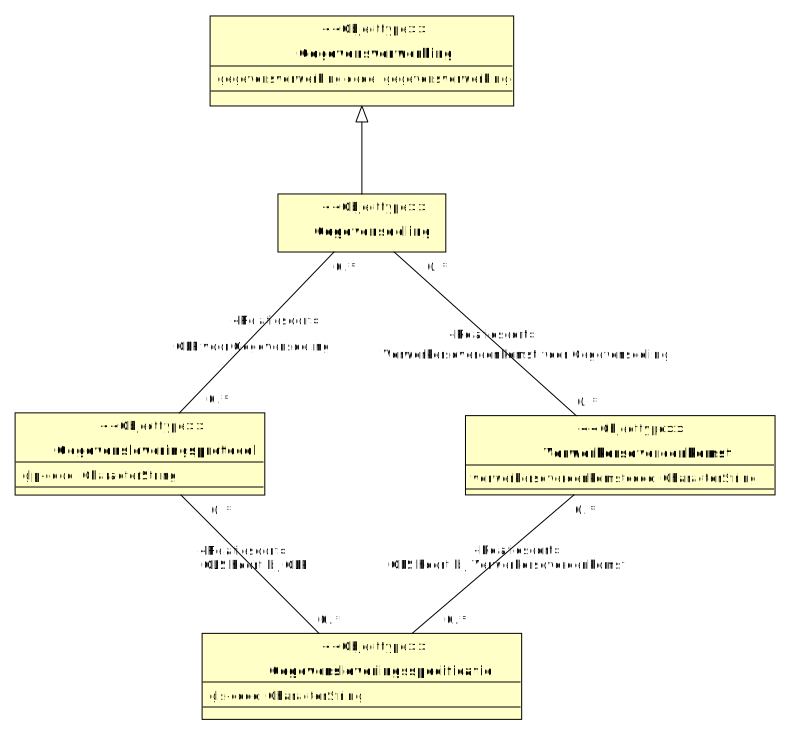

# CIM gegevensdelingsbeleid

- [Gegevensleveringsprotocol](#TGegevensleveringsprotocol)
- [Gegevensleveringsspecificatie](#TGegevensleveringsspecificatie)
- [Gegevensverwerking](#TGegevensverwerking)
  - [Gegevensdeling](#TGegevensdeling)
- [Verwerkersovereenkomst](#TVerwerkersovereenkomst)

## Gegevensdeling {#TGegevensdeling}

|{: .def}||
|-|-|
|Begrip|[Gegevensdeling](#gegevensdeling)|
|Supertype|[Gegevensverwerking](#TGegevensverwerking)|
|Relatie met|[GLP voor Gegevensdeling](#TGLP-voor-Gegevensdeling), [Verwerkersovereenkomst voor Gegevensdeling](#TVerwerkersovereenkomst-voor-Gegevensdeling)|

## Gegevensleveringsprotocol {#TGegevensleveringsprotocol}

|{: .def}||
|-|-|
|Begrip|[Gegevensleveringsprotocol](#gegevensleveringsprotocol)|
|Kenmerken|[glp-code](#TGegevensleveringsprotocol-glp-code)|
|Rollen|[GLP voor Gegevensdeling](#TGLP-voor-Gegevensdeling)|
|Relatie met|[GLS hoort bij GLP](#TGLS-hoort-bij-GLP)|

### glp-code {#TGegevensleveringsprotocol-glp-code}

|{: .def}||
|-|-|
|Begrip|[GLP-code](#glp-code)|
|Eigenschap van|[Gegevensleveringsprotocol](#TGegevensleveringsprotocol)|
|Type|CharacterString|

### GLP voor Gegevensdeling {#TGLP-voor-Gegevensdeling}

|{: .def}||
|-|-|
|Rol van|0..* [Gegevensleveringsprotocol](#TGegevensleveringsprotocol)|
|Met|0..* [Gegevensdeling](#TGegevensdeling)|

## Gegevensleveringsspecificatie {#TGegevensleveringsspecificatie}

|{: .def}||
|-|-|
|Begrip|[Gegevensleveringsspecificatie](#gegevensleveringsspecificatie)|
|Kenmerken|[gls-code](#TGegevensleveringsspecificatie-gls-code)|
|Rollen|[GLS hoort bij GLP](#TGLS-hoort-bij-GLP), [GLS hoort bij Verwerkersovereenkomst](#TGLS-hoort-bij-Verwerkersovereenkomst)|

### gls-code {#TGegevensleveringsspecificatie-gls-code}

|{: .def}||
|-|-|
|Begrip|[GLS-code](#gls-code)|
|Eigenschap van|[Gegevensleveringsspecificatie](#TGegevensleveringsspecificatie)|
|Type|CharacterString|

### GLS hoort bij Verwerkersovereenkomst {#TGLS-hoort-bij-Verwerkersovereenkomst}

|{: .def}||
|-|-|
|Rol van|0..* [Gegevensleveringsspecificatie](#TGegevensleveringsspecificatie)|
|Met|0..* [Verwerkersovereenkomst](#TVerwerkersovereenkomst)|

### GLS hoort bij GLP {#TGLS-hoort-bij-GLP}

|{: .def}||
|-|-|
|Rol van|0..* [Gegevensleveringsspecificatie](#TGegevensleveringsspecificatie)|
|Met|0..* [Gegevensleveringsprotocol](#TGegevensleveringsprotocol)|

## Gegevensverwerking {#TGegevensverwerking}

|{: .def}||
|-|-|
|Begrip|[Gegevensverwerking](#gegevensverwerking)|
|Subtype(s)|[Gegevensdeling](#TGegevensdeling)|
|Kenmerken|[gegevensverwerking code](#TGegevensverwerking-gegevensverwerking-code)|

### gegevensverwerking code {#TGegevensverwerking-gegevensverwerking-code}

|{: .def}||
|-|-|
|Eigenschap van|[Gegevensverwerking](#TGegevensverwerking)|
|Type|CharacterString|

## Verwerkersovereenkomst {#TVerwerkersovereenkomst}

|{: .def}||
|-|-|
|Begrip|[Verwerkersovereenkomst](#verwerkersovereenkomst)|
|Kenmerken|[verwerkersovereenkomstcode](#TVerwerkersovereenkomst-verwerkersovereenkomstcode)|
|Rollen|[Verwerkersovereenkomst voor Gegevensdeling](#TVerwerkersovereenkomst-voor-Gegevensdeling)|
|Relatie met|[GLS hoort bij Verwerkersovereenkomst](#TGLS-hoort-bij-Verwerkersovereenkomst)|

### verwerkersovereenkomstcode {#TVerwerkersovereenkomst-verwerkersovereenkomstcode}

|{: .def}||
|-|-|
|Eigenschap van|[Verwerkersovereenkomst](#TVerwerkersovereenkomst)|
|Type|CharacterString|

### Verwerkersovereenkomst voor Gegevensdeling {#TVerwerkersovereenkomst-voor-Gegevensdeling}

|{: .def}||
|-|-|
|Rol van|0..* [Verwerkersovereenkomst](#TVerwerkersovereenkomst)|
|Met|0..* [Gegevensdeling](#TGegevensdeling)|

## Waardetypering en referentielijsten

