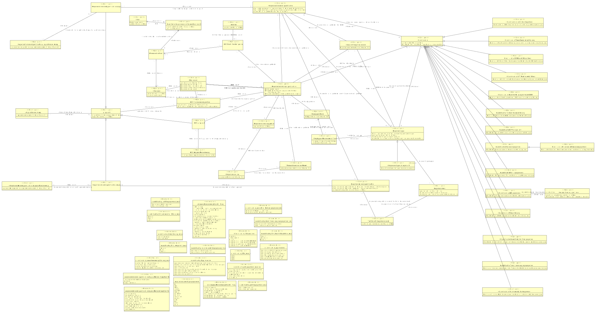

# CIM gegevensleveringsspecificatie

- [Afspraak](#TAfspraak)
  - [GLS Afspraak](#TGLS-Afspraak)
  - [Gegevensleversetafspraak](#TGegevensleversetafspraak)
  - [Gegevensmiddelafspraak](#TGegevensmiddelafspraak)
- [Afspraakonderwerp](#TAfspraakonderwerp)
- [Begrippenkader](#TBegrippenkader)
- [Begrippenkader omvat Term](#TBegrippenkader-omvat-Term)
- [Classificatie](#TClassificatie)
- [Document](#TDocument)
- [Functie in organisatorische eenheid van Partij](#TFunctie-in-organisatorische-eenheid-van-Partij)
- [GLS Afspraakonderwerp](#TGLS-Afspraakonderwerp)
- [GLS Rol](#TGLS-Rol)
- [GLS Standaardafspraken](#TGLS-Standaardafspraken)
- [GLS heeft Contactpersoon](#TGLS-heeft-Contactpersoon)
- [Gegevensleveringsprotocol](#TGegevensleveringsprotocol)
- [Gegevensleveringsspecificatie](#TGegevensleveringsspecificatie)
- [Gegevensleverset Afspraakonderwerp](#TGegevensleverset-Afspraakonderwerp)
- [Gegevensleversetspecificatie](#TGegevensleversetspecificatie)
- [Gegevensmiddel Afspraakonderwerp](#TGegevensmiddel-Afspraakonderwerp)
- [Gegevensmiddelspecificatie](#TGegevensmiddelspecificatie)
- [Gegevensset](#TGegevensset)
- [Gegevenstype](#TGegevenstype)
  - [Gegevenstype categorisch](#TGegevenstype-categorisch)
- [Gegevensveld](#TGegevensveld)
- [Gegevensverwerking](#TGegevensverwerking)
  - [Gegevensdeling](#TGegevensdeling)
- [Logisch Gegevensmodel](#TLogisch-Gegevensmodel)
- [Partij](#TPartij)
- [Persoon](#TPersoon)
- [Persoon in Functie](#TPersoon-in-Functie)
- [Technisch Gegevensmodel](#TTechnisch-Gegevensmodel)
- [Verwerkersovereenkomst](#TVerwerkersovereenkomst)

## Afspraak {#TAfspraak}

|{: .def}||
|-|-|
|Begrip|[Afspraak](#afspraak)|
|Subtype(s)|[Gegevensleversetafspraak](#TGegevensleversetafspraak), [Gegevensmiddelafspraak](#TGegevensmiddelafspraak), [GLS Afspraak](#TGLS-Afspraak)|
|Kenmerken|[Afspraak Beschrijving](#TAfspraak-Beschrijving), [afspraaknaam](#TAfspraak-afspraaknaam)|
|Relatie met|[Afspraak over Afspraakonderwerp](#TAfspraak-over-Afspraakonderwerp), [Afspraken in GLS Standaardafspraken](#TAfspraken-in-GLS-Standaardafspraken)|

### Afspraak Beschrijving {#TAfspraak-Beschrijving}

|{: .def}||
|-|-|
|Eigenschap van|[Afspraak](#TAfspraak)|
|Type|[afspraakbeschrijving](#Tafspraakbeschrijving)|

### afspraaknaam {#TAfspraak-afspraaknaam}

|{: .def}||
|-|-|
|Eigenschap van|[Afspraak](#TAfspraak)|
|Type|CharacterString|

## Afspraakonderwerp {#TAfspraakonderwerp}

|{: .def}||
|-|-|
|Kenmerken|[afspraakonderwerpbeschrijving](#TAfspraakonderwerp-afspraakonderwerpbeschrijving)|
|Rollen|[Afspraak over Afspraakonderwerp](#TAfspraak-over-Afspraakonderwerp)|

### afspraakonderwerpbeschrijving {#TAfspraakonderwerp-afspraakonderwerpbeschrijving}

|{: .def}||
|-|-|
|Eigenschap van|[Afspraakonderwerp](#TAfspraakonderwerp)|
|Type|CharacterString|

### Afspraak over Afspraakonderwerp {#TAfspraak-over-Afspraakonderwerp}

|{: .def}||
|-|-|
|Rol van|0..* [Afspraakonderwerp](#TAfspraakonderwerp)|
|Met|0..* [Afspraak](#TAfspraak)|

## Begrippenkader {#TBegrippenkader}

|{: .def}||
|-|-|
|Begrip|[Begrippenkader](#begrippenkader)|
|Kenmerken|[begrippenkadercode](#TBegrippenkader-begrippenkadercode)|
|Relatie met|[Begrippenkader omvat Term in relatie met Begrippenkader](#TBegrippenkader-omvat-Term-Begrippenkader), [GLS Begrippenkader](#TGLS-Begrippenkader)|

### begrippenkadercode {#TBegrippenkader-begrippenkadercode}

|{: .def}||
|-|-|
|Eigenschap van|[Begrippenkader](#TBegrippenkader)|
|Type|CharacterString|

## Begrippenkader omvat Term {#TBegrippenkader-omvat-Term}

|{: .def}||
|-|-|
|Kenmerken|[Term beschrijving](#TTerm-beschrijving), [termnaam](#TBegrippenkader-omvat-Term-termnaam)|
|Rollen|[Begrippenkader omvat Term in relatie met Begrippenkader](#TBegrippenkader-omvat-Term-Begrippenkader), [Term bij Gegevenstype](#TTerm-bij-Gegevenstype)|

### Term beschrijving {#TTerm-beschrijving}

|{: .def}||
|-|-|
|Eigenschap van|[Begrippenkader omvat Term](#TBegrippenkader-omvat-Term)|
|Type|[Termbeschrijving](#TTermbeschrijving)|

### termnaam {#TBegrippenkader-omvat-Term-termnaam}

|{: .def}||
|-|-|
|Eigenschap van|[Begrippenkader omvat Term](#TBegrippenkader-omvat-Term)|
|Type|CharacterString|

### Begrippenkader omvat Term in relatie met Begrippenkader {#TBegrippenkader-omvat-Term-Begrippenkader}

|{: .def}||
|-|-|
|Rol van|0..* [Begrippenkader omvat Term](#TBegrippenkader-omvat-Term)|
|Met|1..1 [Begrippenkader](#TBegrippenkader)|

### Term bij Gegevenstype {#TTerm-bij-Gegevenstype}

|{: .def}||
|-|-|
|Rol van|0..* [Begrippenkader omvat Term](#TBegrippenkader-omvat-Term)|
|Met|0..* [Gegevenstype](#TGegevenstype)|

## Classificatie {#TClassificatie}

|{: .def}||
|-|-|
|Begrip|[Classificatie](#classificatie)|
|Kenmerken|[classificatie id](#TClassificatie-classificatie-id)|
|Relatie met|[Gegevensleversetspecificatie heeft Classificatie](#TGegevensleversetspecificatie-heeft-Classificatie), [Gegevenstype heeft Classificatie](#TGegevenstype-heeft-Classificatie)|

### classificatie id {#TClassificatie-classificatie-id}

|{: .def}||
|-|-|
|Eigenschap van|[Classificatie](#TClassificatie)|
|Type|CharacterString|

## Document {#TDocument}

|{: .def}||
|-|-|
|Begrip|[Document](#document)|
|Kenmerken|[Document Locatie](#TDocument-Locatie), [Document Naam](#TDocument-Naam), [Document Soort](#TDocument-Soort), [Document Versie](#TDocument-Versie), [documentcode](#TDocument-documentcode)|
|Rollen|[Auteur](#TAuteur)|
|Relatie met|[GLS Standaardafspraken vastgelegd in Document](#TGLS-Standaardafspraken-vastgelegd-in-Document), [GLS Standaardmodel Document](#TGLS-Standaardmodel-Document), [GLS heeft gerelateerd Document](#TGLS-heeft-gerelateerd-Document)|

### documentcode {#TDocument-documentcode}

|{: .def}||
|-|-|
|Eigenschap van|[Document](#TDocument)|
|Type|CharacterString|

### Document Locatie {#TDocument-Locatie}

|{: .def}||
|-|-|
|Eigenschap van|[Document](#TDocument)|
|Type|[locatie](#Tlocatie)|

### Document Soort {#TDocument-Soort}

|{: .def}||
|-|-|
|Eigenschap van|[Document](#TDocument)|
|Type|[documentsoort](#Tdocumentsoort)|

### Document Versie {#TDocument-Versie}

|{: .def}||
|-|-|
|Eigenschap van|[Document](#TDocument)|
|Type|[versienummer](#Tversienummer)|

### Document Naam {#TDocument-Naam}

|{: .def}||
|-|-|
|Eigenschap van|[Document](#TDocument)|
|Type|[naam](#Tnaam)|

### Auteur {#TAuteur}

|{: .def}||
|-|-|
|Begrip|[Auteur](#auteur)|
|Rol van|0..* [Document](#TDocument)|
|Met|0..* [Persoon](#TPersoon)|

## Functie in organisatorische eenheid van Partij {#TFunctie-in-organisatorische-eenheid-van-Partij}

|{: .def}||
|-|-|

## GLS Afspraak {#TGLS-Afspraak}

|{: .def}||
|-|-|
|Begrip|[GLS afspraak](#gls-afspraak)|
|Supertype|[Afspraak](#TAfspraak)|
|Rollen|[GLS Afspraak Afspraakonderwerp](#TGLS-Afspraak-Afspraakonderwerp)|
|Relatie met|[GLS bevat extra GLS Afspraak](#TGLS-bevat-extra-GLS-Afspraak)|

### GLS Afspraak Afspraakonderwerp {#TGLS-Afspraak-Afspraakonderwerp}

|{: .def}||
|-|-|
|Rol van|0..* [GLS Afspraak](#TGLS-Afspraak)|
|Met|0..* [GLS Afspraakonderwerp](#TGLS-Afspraakonderwerp)|

## GLS Afspraakonderwerp {#TGLS-Afspraakonderwerp}

|{: .def}||
|-|-|
|Kenmerken|[glsafspraakonderwerp](#TGLS-Afspraakonderwerp-glsafspraakonderwerp)|
|Relatie met|[GLS Afspraak Afspraakonderwerp](#TGLS-Afspraak-Afspraakonderwerp)|

### glsafspraakonderwerp {#TGLS-Afspraakonderwerp-glsafspraakonderwerp}

|{: .def}||
|-|-|
|Eigenschap van|[GLS Afspraakonderwerp](#TGLS-Afspraakonderwerp)|
|Type|CharacterString|

## GLS Rol {#TGLS-Rol}

|{: .def}||
|-|-|
|Kenmerken|[gls_rolnaam](#TGLS-Rol-gls-rolnaam)|
|Relatie met|[GLS heeft Contactpersoon in Rol](#TGLS-heeft-Contactpersoon-in-Rol)|

### gls_rolnaam {#TGLS-Rol-gls-rolnaam}

|{: .def}||
|-|-|
|Eigenschap van|[GLS Rol](#TGLS-Rol)|
|Type|CharacterString|

## GLS Standaardafspraken {#TGLS-Standaardafspraken}

|{: .def}||
|-|-|
|Begrip|[GLS Standaardafspraken](#gls-standaardafspraken)|
|Kenmerken|[GLS Standaardafsprakenversie](#TGLS-Standaardafsprakenversie), [glsstandaardafsprakencode](#TGLS-Standaardafspraken-glsstandaardafsprakencode)|
|Rollen|[Afspraken in GLS Standaardafspraken](#TAfspraken-in-GLS-Standaardafspraken), [GLS Standaardafspraken vastgelegd in Document](#TGLS-Standaardafspraken-vastgelegd-in-Document)|
|Relatie met|[GLS heeft GLS Standaardafspraken](#TGLS-heeft-GLS-Standaardafspraken)|

### GLS Standaardafsprakenversie {#TGLS-Standaardafsprakenversie}

|{: .def}||
|-|-|
|Eigenschap van|[GLS Standaardafspraken](#TGLS-Standaardafspraken)|
|Type|[versienummer](#Tversienummer)|

### glsstandaardafsprakencode {#TGLS-Standaardafspraken-glsstandaardafsprakencode}

|{: .def}||
|-|-|
|Eigenschap van|[GLS Standaardafspraken](#TGLS-Standaardafspraken)|
|Type|CharacterString|

### Afspraken in GLS Standaardafspraken {#TAfspraken-in-GLS-Standaardafspraken}

|{: .def}||
|-|-|
|Rol van|0..* [GLS Standaardafspraken](#TGLS-Standaardafspraken)|
|Met|0..* [Afspraak](#TAfspraak)|

### GLS Standaardafspraken vastgelegd in Document {#TGLS-Standaardafspraken-vastgelegd-in-Document}

|{: .def}||
|-|-|
|Rol van|0..* [GLS Standaardafspraken](#TGLS-Standaardafspraken)|
|Met|0..* [Document](#TDocument)|

## GLS heeft Contactpersoon {#TGLS-heeft-Contactpersoon}

|{: .def}||
|-|-|
|Rollen|[GLS heeft Contactpersoon in Rol](#TGLS-heeft-Contactpersoon-in-Rol), [GLS heeft Contactpersoon in relatie met Gegevensleveringsspecificatie](#TGLS-heeft-Contactpersoon-Gegevensleveringsspecificatie), [GLS heeft Contactpersoon in relatie met Persoon in Functie](#TGLS-heeft-Contactpersoon-Persoon-in-Functie)|

### GLS heeft Contactpersoon in relatie met Persoon in Functie {#TGLS-heeft-Contactpersoon-Persoon-in-Functie}

|{: .def}||
|-|-|
|Rol van|0..* [GLS heeft Contactpersoon](#TGLS-heeft-Contactpersoon)|
|Met|1..1 [Persoon in Functie](#TPersoon-in-Functie)|

### GLS heeft Contactpersoon in relatie met Gegevensleveringsspecificatie {#TGLS-heeft-Contactpersoon-Gegevensleveringsspecificatie}

|{: .def}||
|-|-|
|Rol van|0..* [GLS heeft Contactpersoon](#TGLS-heeft-Contactpersoon)|
|Met|1..1 [Gegevensleveringsspecificatie](#TGegevensleveringsspecificatie)|

### GLS heeft Contactpersoon in Rol {#TGLS-heeft-Contactpersoon-in-Rol}

|{: .def}||
|-|-|
|Rol van|0..* [GLS heeft Contactpersoon](#TGLS-heeft-Contactpersoon)|
|Met|0..* [GLS Rol](#TGLS-Rol)|

## Gegevensdeling {#TGegevensdeling}

|{: .def}||
|-|-|
|Begrip|[Gegevensdeling](#gegevensdeling)|
|Supertype|[Gegevensverwerking](#TGegevensverwerking)|
|Relatie met|[GLP voor Gegevensdeling](#TGLP-voor-Gegevensdeling), [Verwerkersovereenkomst voor Gegevensdeling](#TVerwerkersovereenkomst-voor-Gegevensdeling)|

## Gegevensleveringsprotocol {#TGegevensleveringsprotocol}

|{: .def}||
|-|-|
|Begrip|[Gegevensleveringsprotocol](#gegevensleveringsprotocol)|
|Kenmerken|[glp-code](#TGegevensleveringsprotocol-glp-code)|
|Rollen|[GLP voor Gegevensdeling](#TGLP-voor-Gegevensdeling)|
|Relatie met|[GLS hoort bij GLP](#TGLS-hoort-bij-GLP)|

### glp-code {#TGegevensleveringsprotocol-glp-code}

|{: .def}||
|-|-|
|Begrip|[GLP-code](#glp-code)|
|Eigenschap van|[Gegevensleveringsprotocol](#TGegevensleveringsprotocol)|
|Type|CharacterString|

### GLP voor Gegevensdeling {#TGLP-voor-Gegevensdeling}

|{: .def}||
|-|-|
|Rol van|0..* [Gegevensleveringsprotocol](#TGegevensleveringsprotocol)|
|Met|0..* [Gegevensdeling](#TGegevensdeling)|

## Gegevensleveringsspecificatie {#TGegevensleveringsspecificatie}

|{: .def}||
|-|-|
|Begrip|[Gegevensleveringsspecificatie](#gegevensleveringsspecificatie)|
|Kenmerken|[GLS Naam](#TGLS-Naam), [GLS globale beschrijving](#TGLS-globale-beschrijving), [GLS populatiebeschrijving](#TGLS-populatiebeschrijving), [Gegevensleveringsspecificatie Versie](#TGegevensleveringsspecificatie-Versie), [gls-code](#TGegevensleveringsspecificatie-gls-code)|
|Rollen|[GLS Begrippenkader](#TGLS-Begrippenkader), [GLS Standaardmodel Document](#TGLS-Standaardmodel-Document), [GLS bevat extra GLS Afspraak](#TGLS-bevat-extra-GLS-Afspraak), [GLS heeft GLS Standaardafspraken](#TGLS-heeft-GLS-Standaardafspraken), [GLS heeft LGM](#TGLS-heeft-LGM), [GLS heeft gerelateerd Document](#TGLS-heeft-gerelateerd-Document), [GLS hoort bij GLP](#TGLS-hoort-bij-GLP), [GLS hoort bij Verwerkersovereenkomst](#TGLS-hoort-bij-Verwerkersovereenkomst)|
|Relatie met|[GLS heeft Contactpersoon in relatie met Gegevensleveringsspecificatie](#TGLS-heeft-Contactpersoon-Gegevensleveringsspecificatie), [GLS omvat Gegevensleversetspecificatie](#TGLS-omvat-Gegevensleversetspecificatie)|

### GLS Naam {#TGLS-Naam}

|{: .def}||
|-|-|
|Eigenschap van|[Gegevensleveringsspecificatie](#TGegevensleveringsspecificatie)|
|Type|[gls_naam](#Tgls-naam)|

### GLS populatiebeschrijving {#TGLS-populatiebeschrijving}

|{: .def}||
|-|-|
|Eigenschap van|[Gegevensleveringsspecificatie](#TGegevensleveringsspecificatie)|
|Type|[populatiebeschrijving](#Tpopulatiebeschrijving)|

### gls-code {#TGegevensleveringsspecificatie-gls-code}

|{: .def}||
|-|-|
|Begrip|[GLS-code](#gls-code)|
|Eigenschap van|[Gegevensleveringsspecificatie](#TGegevensleveringsspecificatie)|
|Type|CharacterString|

### Gegevensleveringsspecificatie Versie {#TGegevensleveringsspecificatie-Versie}

|{: .def}||
|-|-|
|Eigenschap van|[Gegevensleveringsspecificatie](#TGegevensleveringsspecificatie)|
|Type|[versienummer](#Tversienummer)|

### GLS globale beschrijving {#TGLS-globale-beschrijving}

|{: .def}||
|-|-|
|Eigenschap van|[Gegevensleveringsspecificatie](#TGegevensleveringsspecificatie)|
|Type|[GLS-globalebeschrijving](#TGLS-globalebeschrijving)|

### GLS Begrippenkader {#TGLS-Begrippenkader}

|{: .def}||
|-|-|
|Rol van|0..* [Gegevensleveringsspecificatie](#TGegevensleveringsspecificatie)|
|Met|0..* [Begrippenkader](#TBegrippenkader)|

### GLS heeft gerelateerd Document {#TGLS-heeft-gerelateerd-Document}

|{: .def}||
|-|-|
|Rol van|0..* [Gegevensleveringsspecificatie](#TGegevensleveringsspecificatie)|
|Met|0..* [Document](#TDocument)|

### GLS bevat extra GLS Afspraak {#TGLS-bevat-extra-GLS-Afspraak}

|{: .def}||
|-|-|
|Rol van|0..* [Gegevensleveringsspecificatie](#TGegevensleveringsspecificatie)|
|Met|0..* [GLS Afspraak](#TGLS-Afspraak)|

### GLS Standaardmodel Document {#TGLS-Standaardmodel-Document}

|{: .def}||
|-|-|
|Rol van|0..* [Gegevensleveringsspecificatie](#TGegevensleveringsspecificatie)|
|Met|0..* [Document](#TDocument)|

### GLS hoort bij Verwerkersovereenkomst {#TGLS-hoort-bij-Verwerkersovereenkomst}

|{: .def}||
|-|-|
|Rol van|0..* [Gegevensleveringsspecificatie](#TGegevensleveringsspecificatie)|
|Met|0..* [Verwerkersovereenkomst](#TVerwerkersovereenkomst)|

### GLS heeft GLS Standaardafspraken {#TGLS-heeft-GLS-Standaardafspraken}

|{: .def}||
|-|-|
|Rol van|0..* [Gegevensleveringsspecificatie](#TGegevensleveringsspecificatie)|
|Met|0..* [GLS Standaardafspraken](#TGLS-Standaardafspraken)|

### GLS heeft LGM {#TGLS-heeft-LGM}

|{: .def}||
|-|-|
|Rol van|0..* [Gegevensleveringsspecificatie](#TGegevensleveringsspecificatie)|
|Met|0..* [Logisch Gegevensmodel](#TLogisch-Gegevensmodel)|

### GLS hoort bij GLP {#TGLS-hoort-bij-GLP}

|{: .def}||
|-|-|
|Rol van|0..* [Gegevensleveringsspecificatie](#TGegevensleveringsspecificatie)|
|Met|0..* [Gegevensleveringsprotocol](#TGegevensleveringsprotocol)|

## Gegevensleverset Afspraakonderwerp {#TGegevensleverset-Afspraakonderwerp}

|{: .def}||
|-|-|
|Kenmerken|[gegevensleversetafspraakonderwerp](#TGegevensleverset-Afspraakonderwerp-gegevensleversetafspraakonderwerp)|
|Relatie met|[Gegevensleversetafspraak Afspraakonderwerp](#TGegevensleversetafspraak-Afspraakonderwerp)|

### gegevensleversetafspraakonderwerp {#TGegevensleverset-Afspraakonderwerp-gegevensleversetafspraakonderwerp}

|{: .def}||
|-|-|
|Eigenschap van|[Gegevensleverset Afspraakonderwerp](#TGegevensleverset-Afspraakonderwerp)|
|Type|CharacterString|

## Gegevensleversetafspraak {#TGegevensleversetafspraak}

|{: .def}||
|-|-|
|Begrip|[Gegevensleversetafspraak](#gegevensleversetafspraak)|
|Supertype|[Afspraak](#TAfspraak)|
|Rollen|[Gegevensleversetafspraak Afspraakonderwerp](#TGegevensleversetafspraak-Afspraakonderwerp)|
|Relatie met|[Gegevensleversetspecificatie bevat Gegevensleversetafspraak](#TGegevensleversetspecificatie-bevat-Gegevensleversetafspraak)|

### Gegevensleversetafspraak Afspraakonderwerp {#TGegevensleversetafspraak-Afspraakonderwerp}

|{: .def}||
|-|-|
|Rol van|0..* [Gegevensleversetafspraak](#TGegevensleversetafspraak)|
|Met|0..* [Gegevensleverset Afspraakonderwerp](#TGegevensleverset-Afspraakonderwerp)|

## Gegevensleversetspecificatie {#TGegevensleversetspecificatie}

|{: .def}||
|-|-|
|Begrip|[Gegevensleversetspecificatie](#gegevensleversetspecificatie)|
|Kenmerken|[Gegevensleversetspecificatie populatiebeschrijving](#TGegevensleversetspecificatie-populatiebeschrijving), [gegevensleversetspecificatiecode](#TGegevensleversetspecificatie-gegevensleversetspecificatiecode)|
|Rollen|[GLS omvat Gegevensleversetspecificatie](#TGLS-omvat-Gegevensleversetspecificatie), [Gegevensleverset wordt gefilterd op Gegevenstype](#TGegevensleverset-wordt-gefilterd-op-Gegevenstype), [Gegevensleversetspecificatie bevat Gegevensleversetafspraak](#TGegevensleversetspecificatie-bevat-Gegevensleversetafspraak), [Gegevensleversetspecificatie heeft Classificatie](#TGegevensleversetspecificatie-heeft-Classificatie), [Gegevensleversetspecificatie heeft LGM](#TGegevensleversetspecificatie-heeft-LGM), [Gegevensleversetspecificatie omvat Gegevensmiddelspecificatie](#TGegevensleversetspecificatie-omvat-Gegevensmiddelspecificatie)|

### Gegevensleversetspecificatie populatiebeschrijving {#TGegevensleversetspecificatie-populatiebeschrijving}

|{: .def}||
|-|-|
|Eigenschap van|[Gegevensleversetspecificatie](#TGegevensleversetspecificatie)|
|Type|[populatiebeschrijving](#Tpopulatiebeschrijving)|

### gegevensleversetspecificatiecode {#TGegevensleversetspecificatie-gegevensleversetspecificatiecode}

|{: .def}||
|-|-|
|Eigenschap van|[Gegevensleversetspecificatie](#TGegevensleversetspecificatie)|
|Type|CharacterString|

### Gegevensleversetspecificatie omvat Gegevensmiddelspecificatie {#TGegevensleversetspecificatie-omvat-Gegevensmiddelspecificatie}

|{: .def}||
|-|-|
|Rol van|0..* [Gegevensleversetspecificatie](#TGegevensleversetspecificatie)|
|Met|0..* [Gegevensmiddelspecificatie](#TGegevensmiddelspecificatie)|

### Gegevensleversetspecificatie bevat Gegevensleversetafspraak {#TGegevensleversetspecificatie-bevat-Gegevensleversetafspraak}

|{: .def}||
|-|-|
|Rol van|0..* [Gegevensleversetspecificatie](#TGegevensleversetspecificatie)|
|Met|0..* [Gegevensleversetafspraak](#TGegevensleversetafspraak)|

### GLS omvat Gegevensleversetspecificatie {#TGLS-omvat-Gegevensleversetspecificatie}

|{: .def}||
|-|-|
|Rol van|0..* [Gegevensleversetspecificatie](#TGegevensleversetspecificatie)|
|Met|0..* [Gegevensleveringsspecificatie](#TGegevensleveringsspecificatie)|

### Gegevensleverset wordt gefilterd op Gegevenstype {#TGegevensleverset-wordt-gefilterd-op-Gegevenstype}

|{: .def}||
|-|-|
|Rol van|0..* [Gegevensleversetspecificatie](#TGegevensleversetspecificatie)|
|Met|0..* [Gegevenstype](#TGegevenstype)|

### Gegevensleversetspecificatie heeft LGM {#TGegevensleversetspecificatie-heeft-LGM}

|{: .def}||
|-|-|
|Rol van|0..* [Gegevensleversetspecificatie](#TGegevensleversetspecificatie)|
|Met|0..* [Logisch Gegevensmodel](#TLogisch-Gegevensmodel)|

### Gegevensleversetspecificatie heeft Classificatie {#TGegevensleversetspecificatie-heeft-Classificatie}

|{: .def}||
|-|-|
|Rol van|0..* [Gegevensleversetspecificatie](#TGegevensleversetspecificatie)|
|Met|0..* [Classificatie](#TClassificatie)|

## Gegevensmiddel Afspraakonderwerp {#TGegevensmiddel-Afspraakonderwerp}

|{: .def}||
|-|-|
|Kenmerken|[gegevensmiddelafspraakonderwerp](#TGegevensmiddel-Afspraakonderwerp-gegevensmiddelafspraakonderwerp)|
|Relatie met|[Gegevensmiddelafspraak Afspraakonderwerp](#TGegevensmiddelafspraak-Afspraakonderwerp)|

### gegevensmiddelafspraakonderwerp {#TGegevensmiddel-Afspraakonderwerp-gegevensmiddelafspraakonderwerp}

|{: .def}||
|-|-|
|Eigenschap van|[Gegevensmiddel Afspraakonderwerp](#TGegevensmiddel-Afspraakonderwerp)|
|Type|CharacterString|

## Gegevensmiddelafspraak {#TGegevensmiddelafspraak}

|{: .def}||
|-|-|
|Begrip|[Gegevensmiddelafspraak](#gegevensmiddelafspraak)|
|Supertype|[Afspraak](#TAfspraak)|
|Rollen|[Gegevensmiddelafspraak Afspraakonderwerp](#TGegevensmiddelafspraak-Afspraakonderwerp)|
|Relatie met|[Gegevensmiddelspecificatie bevat Gegevensmiddelafspraak](#TGegevensmiddelspecificatie-bevat-Gegevensmiddelafspraak)|

### Gegevensmiddelafspraak Afspraakonderwerp {#TGegevensmiddelafspraak-Afspraakonderwerp}

|{: .def}||
|-|-|
|Rol van|0..* [Gegevensmiddelafspraak](#TGegevensmiddelafspraak)|
|Met|0..* [Gegevensmiddel Afspraakonderwerp](#TGegevensmiddel-Afspraakonderwerp)|

## Gegevensmiddelspecificatie {#TGegevensmiddelspecificatie}

|{: .def}||
|-|-|
|Begrip|[Gegevensmiddelspecificatie](#gegevensmiddelspecificatie)|
|Kenmerken|[Gegevensmiddelspecificatie beschrijving](#TGegevensmiddelspecificatie-beschrijving), [Gegevensmiddelspecificatie specificeert Type](#TGegevensmiddelspecificatie-specificeert-Type), [gegevensmiddelspecificatiecode](#TGegevensmiddelspecificatie-gegevensmiddelspecificatiecode)|
|Rollen|[Gegevensmiddelspecificatie bevat Gegevensmiddelafspraak](#TGegevensmiddelspecificatie-bevat-Gegevensmiddelafspraak), [Gegevensmiddelspecificatie omvat Technisch Gegevensmodel](#TGegevensmiddelspecificatie-omvat-Technisch-Gegevensmodel)|
|Relatie met|[Gegevensleversetspecificatie omvat Gegevensmiddelspecificatie](#TGegevensleversetspecificatie-omvat-Gegevensmiddelspecificatie)|

### Gegevensmiddelspecificatie beschrijving {#TGegevensmiddelspecificatie-beschrijving}

|{: .def}||
|-|-|
|Eigenschap van|[Gegevensmiddelspecificatie](#TGegevensmiddelspecificatie)|
|Type|[gegevensmiddelspecificatiebeschrijving](#Tgegevensmiddelspecificatiebeschrijving)|

### Gegevensmiddelspecificatie specificeert Type {#TGegevensmiddelspecificatie-specificeert-Type}

|{: .def}||
|-|-|
|Eigenschap van|[Gegevensmiddelspecificatie](#TGegevensmiddelspecificatie)|
|Type|[gegevensmiddeltype](#Tgegevensmiddeltype)|

### gegevensmiddelspecificatiecode {#TGegevensmiddelspecificatie-gegevensmiddelspecificatiecode}

|{: .def}||
|-|-|
|Eigenschap van|[Gegevensmiddelspecificatie](#TGegevensmiddelspecificatie)|
|Type|CharacterString|

### Gegevensmiddelspecificatie bevat Gegevensmiddelafspraak {#TGegevensmiddelspecificatie-bevat-Gegevensmiddelafspraak}

|{: .def}||
|-|-|
|Rol van|0..* [Gegevensmiddelspecificatie](#TGegevensmiddelspecificatie)|
|Met|0..* [Gegevensmiddelafspraak](#TGegevensmiddelafspraak)|

### Gegevensmiddelspecificatie omvat Technisch Gegevensmodel {#TGegevensmiddelspecificatie-omvat-Technisch-Gegevensmodel}

|{: .def}||
|-|-|
|Rol van|0..* [Gegevensmiddelspecificatie](#TGegevensmiddelspecificatie)|
|Met|0..* [Technisch Gegevensmodel](#TTechnisch-Gegevensmodel)|

## Gegevensset {#TGegevensset}

|{: .def}||
|-|-|
|Kenmerken|[gegevensset code](#TGegevensset-gegevensset-code)|
|Rollen|[Gegevenstype in Gegevensset](#TGegevenstype-in-Gegevensset)|

### gegevensset code {#TGegevensset-gegevensset-code}

|{: .def}||
|-|-|
|Eigenschap van|[Gegevensset](#TGegevensset)|
|Type|CharacterString|

### Gegevenstype in Gegevensset {#TGegevenstype-in-Gegevensset}

|{: .def}||
|-|-|
|Rol van|0..* 0..* [Gegevensset](#TGegevensset)|
|Met|0..* 0..* [Gegevenstype](#TGegevenstype)|

## Gegevenstype {#TGegevenstype}

|{: .def}||
|-|-|
|Begrip|[Gegevenstype](#gegevenstype)|
|Subtype(s)|[Gegevenstype categorisch](#TGegevenstype-categorisch)|
|Kenmerken|[Beschrijving gegevenstype](#TBeschrijving-gegevenstype), [Naam gegevenstype](#TNaam-gegevenstype), [Waardetype gegevenstype](#TWaardetype-gegevenstype), [gegevenstype code](#TGegevenstype-gegevenstype-code)|
|Rollen|[Gegevenstype heeft Classificatie](#TGegevenstype-heeft-Classificatie), [Gegevenstypemapping](#TGegevenstypemapping)|
|Relatie met|[Gegevensleverset wordt gefilterd op Gegevenstype](#TGegevensleverset-wordt-gefilterd-op-Gegevenstype), [Gegevenstype in Gegevensset](#TGegevenstype-in-Gegevensset), [LGM bevat Gegevenstype](#TLGM-bevat-Gegevenstype), [Term bij Gegevenstype](#TTerm-bij-Gegevenstype)|

### Waardetype gegevenstype {#TWaardetype-gegevenstype}

|{: .def}||
|-|-|
|Begrip|[Waardetype gegevenstype](#waardetype-gegevenstype)|
|Eigenschap van|[Gegevenstype](#TGegevenstype)|
|Type|[waarde waardetype gegevenstype](#Twaarde-waardetype-gegevenstype)|
|Mogelijke waarden|Duration; Categorical; Byte; Blob; Float; Integer; Decimal; Date; Double; List; Boolean; DateTime; Time; String|

### Beschrijving gegevenstype {#TBeschrijving-gegevenstype}

|{: .def}||
|-|-|
|Eigenschap van|[Gegevenstype](#TGegevenstype)|
|Type|[gegevenstypebeschrijving](#Tgegevenstypebeschrijving)|

### gegevenstype code {#TGegevenstype-gegevenstype-code}

|{: .def}||
|-|-|
|Eigenschap van|[Gegevenstype](#TGegevenstype)|
|Type|CharacterString|

### Naam gegevenstype {#TNaam-gegevenstype}

|{: .def}||
|-|-|
|Eigenschap van|[Gegevenstype](#TGegevenstype)|
|Type|[gegevenstypenaam](#Tgegevenstypenaam)|

### Gegevenstype heeft Classificatie {#TGegevenstype-heeft-Classificatie}

|{: .def}||
|-|-|
|Rol van|0..* [Gegevenstype](#TGegevenstype)|
|Met|0..* [Classificatie](#TClassificatie)|

### Gegevenstypemapping {#TGegevenstypemapping}

|{: .def}||
|-|-|
|Begrip|[Gegevenstypemapping](#gegevenstypemapping)|
|Rol van|0..* 0..* [Gegevenstype](#TGegevenstype)|
|Met|0..* 0..* [Gegevensveld](#TGegevensveld)|

## Gegevenstype categorisch {#TGegevenstype-categorisch}

|{: .def}||
|-|-|
|Supertype|[Gegevenstype](#TGegevenstype)|
|Kenmerken|[Waardebereik gegevenstype](#TWaardebereik-gegevenstype)|

### Waardebereik gegevenstype {#TWaardebereik-gegevenstype}

|{: .def}||
|-|-|
|Begrip|[Waardebereik gegevenstype](#waardebereik-gegevenstype)|
|Eigenschap van|[Gegevenstype categorisch](#TGegevenstype-categorisch)|
|Type|[waardes gegevenstype](#Twaardes-gegevenstype)|

## Gegevensveld {#TGegevensveld}

|{: .def}||
|-|-|
|Begrip|[Gegevensveld](#gegevensveld)|
|Kenmerken|[Naam gegevensveld](#TNaam-gegevensveld), [gegevensveld id](#TGegevensveld-gegevensveld-id)|
|Relatie met|[Gegevenstypemapping](#TGegevenstypemapping), [Gegevensveld in Technisch Gegevensmodel](#TGegevensveld-in-Technisch-Gegevensmodel)|

### gegevensveld id {#TGegevensveld-gegevensveld-id}

|{: .def}||
|-|-|
|Eigenschap van|[Gegevensveld](#TGegevensveld)|
|Type|CharacterString|

### Naam gegevensveld {#TNaam-gegevensveld}

|{: .def}||
|-|-|
|Eigenschap van|[Gegevensveld](#TGegevensveld)|
|Type|[gegevensveldnaam](#Tgegevensveldnaam)|

## Gegevensverwerking {#TGegevensverwerking}

|{: .def}||
|-|-|
|Begrip|[Gegevensverwerking](#gegevensverwerking)|
|Subtype(s)|[Gegevensdeling](#TGegevensdeling)|
|Kenmerken|[gegevensverwerking code](#TGegevensverwerking-gegevensverwerking-code)|

### gegevensverwerking code {#TGegevensverwerking-gegevensverwerking-code}

|{: .def}||
|-|-|
|Eigenschap van|[Gegevensverwerking](#TGegevensverwerking)|
|Type|CharacterString|

## Logisch Gegevensmodel {#TLogisch-Gegevensmodel}

|{: .def}||
|-|-|
|Begrip|[Logisch gegevensmodel](#logisch-gegevensmodel)|
|Kenmerken|[logisch gegevensmodel code](#TLogisch-Gegevensmodel-logisch-gegevensmodel-code)|
|Rollen|[LGM bevat Gegevenstype](#TLGM-bevat-Gegevenstype)|
|Relatie met|[GLS heeft LGM](#TGLS-heeft-LGM), [Gegevensleversetspecificatie heeft LGM](#TGegevensleversetspecificatie-heeft-LGM)|

### logisch gegevensmodel code {#TLogisch-Gegevensmodel-logisch-gegevensmodel-code}

|{: .def}||
|-|-|
|Eigenschap van|[Logisch Gegevensmodel](#TLogisch-Gegevensmodel)|
|Type|CharacterString|

### LGM bevat Gegevenstype {#TLGM-bevat-Gegevenstype}

|{: .def}||
|-|-|
|Rol van|0..* [Logisch Gegevensmodel](#TLogisch-Gegevensmodel)|
|Met|0..* [Gegevenstype](#TGegevenstype)|

## Partij {#TPartij}

|{: .def}||
|-|-|
|Begrip|[Partij](#partij)|
|Kenmerken|[Partij naam](#TPartij-naam), [partij id](#TPartij-partij-id)|

### Partij naam {#TPartij-naam}

|{: .def}||
|-|-|
|Eigenschap van|[Partij](#TPartij)|
|Type|[naam](#Tnaam)|

### partij id {#TPartij-partij-id}

|{: .def}||
|-|-|
|Eigenschap van|[Partij](#TPartij)|
|Type|CharacterString|

## Persoon {#TPersoon}

|{: .def}||
|-|-|
|Kenmerken|[Persoonsnaam](#TPersoonsnaam), [persoon id](#TPersoon-persoon-id)|
|Relatie met|[Auteur](#TAuteur), [Persoon in Functie in relatie met Persoon](#TPersoon-in-Functie-Persoon)|

### persoon id {#TPersoon-persoon-id}

|{: .def}||
|-|-|
|Eigenschap van|[Persoon](#TPersoon)|
|Type|CharacterString|

### Persoonsnaam {#TPersoonsnaam}

|{: .def}||
|-|-|
|Eigenschap van|[Persoon](#TPersoon)|
|Type|[naam](#Tnaam)|

## Persoon in Functie {#TPersoon-in-Functie}

|{: .def}||
|-|-|
|Rollen|[Persoon in Functie in relatie met Persoon](#TPersoon-in-Functie-Persoon)|
|Relatie met|[GLS heeft Contactpersoon in relatie met Persoon in Functie](#TGLS-heeft-Contactpersoon-Persoon-in-Functie)|

### Persoon in Functie in relatie met Persoon {#TPersoon-in-Functie-Persoon}

|{: .def}||
|-|-|
|Rol van|0..* [Persoon in Functie](#TPersoon-in-Functie)|
|Met|1..1 [Persoon](#TPersoon)|

## Technisch Gegevensmodel {#TTechnisch-Gegevensmodel}

|{: .def}||
|-|-|
|Begrip|[Technisch gegevensmodel](#technisch-gegevensmodel)|
|Kenmerken|[technisch gegevensmodel code](#TTechnisch-Gegevensmodel-technisch-gegevensmodel-code)|
|Rollen|[Gegevensveld in Technisch Gegevensmodel](#TGegevensveld-in-Technisch-Gegevensmodel)|
|Relatie met|[Gegevensmiddelspecificatie omvat Technisch Gegevensmodel](#TGegevensmiddelspecificatie-omvat-Technisch-Gegevensmodel)|

### technisch gegevensmodel code {#TTechnisch-Gegevensmodel-technisch-gegevensmodel-code}

|{: .def}||
|-|-|
|Eigenschap van|[Technisch Gegevensmodel](#TTechnisch-Gegevensmodel)|
|Type|CharacterString|

### Gegevensveld in Technisch Gegevensmodel {#TGegevensveld-in-Technisch-Gegevensmodel}

|{: .def}||
|-|-|
|Rol van|0..* [Technisch Gegevensmodel](#TTechnisch-Gegevensmodel)|
|Met|0..* [Gegevensveld](#TGegevensveld)|

## Verwerkersovereenkomst {#TVerwerkersovereenkomst}

|{: .def}||
|-|-|
|Begrip|[Verwerkersovereenkomst](#verwerkersovereenkomst)|
|Kenmerken|[verwerkersovereenkomstcode](#TVerwerkersovereenkomst-verwerkersovereenkomstcode)|
|Rollen|[Verwerkersovereenkomst voor Gegevensdeling](#TVerwerkersovereenkomst-voor-Gegevensdeling)|
|Relatie met|[GLS hoort bij Verwerkersovereenkomst](#TGLS-hoort-bij-Verwerkersovereenkomst)|

### verwerkersovereenkomstcode {#TVerwerkersovereenkomst-verwerkersovereenkomstcode}

|{: .def}||
|-|-|
|Eigenschap van|[Verwerkersovereenkomst](#TVerwerkersovereenkomst)|
|Type|CharacterString|

### Verwerkersovereenkomst voor Gegevensdeling {#TVerwerkersovereenkomst-voor-Gegevensdeling}

|{: .def}||
|-|-|
|Rol van|0..* [Verwerkersovereenkomst](#TVerwerkersovereenkomst)|
|Met|0..* [Gegevensdeling](#TGegevensdeling)|

## Waardetypering en referentielijsten

### GLS-globalebeschrijving {#TGLS-globalebeschrijving}

|{: .def}||
|-|-|
|Gebaseerd op|CharacterString|

### Termbeschrijving {#TTermbeschrijving}

|{: .def}||
|-|-|
|Gebaseerd op|CharacterString|

### afspraakbeschrijving {#Tafspraakbeschrijving}

|{: .def}||
|-|-|
|Gebaseerd op|CharacterString|

### documentsoort {#Tdocumentsoort}

|{: .def}||
|-|-|
|Gebaseerd op|CharacterString|

### gegevensmiddelspecificatiebeschrijving {#Tgegevensmiddelspecificatiebeschrijving}

|{: .def}||
|-|-|
|Gebaseerd op|CharacterString|

### gegevensmiddeltype {#Tgegevensmiddeltype}

|{: .def}||
|-|-|
|Gebaseerd op|CharacterString|

### gegevenstypebeschrijving {#Tgegevenstypebeschrijving}

|{: .def}||
|-|-|
|Gebaseerd op|CharacterString|

### gegevenstypenaam {#Tgegevenstypenaam}

|{: .def}||
|-|-|
|Gebaseerd op|CharacterString|

### gegevensveldnaam {#Tgegevensveldnaam}

|{: .def}||
|-|-|
|Gebaseerd op|CharacterString|

### gls_naam {#Tgls-naam}

|{: .def}||
|-|-|
|Gebaseerd op|CharacterString|

### locatie {#Tlocatie}

|{: .def}||
|-|-|
|Gebaseerd op|CharacterString|

### naam {#Tnaam}

|{: .def}||
|-|-|
|Gebaseerd op|CharacterString|

### populatiebeschrijving {#Tpopulatiebeschrijving}

|{: .def}||
|-|-|
|Begrip|[Populatiebeschrijving](#populatiebeschrijving)|
|Gebaseerd op|CharacterString|

### versienummer {#Tversienummer}

|{: .def}||
|-|-|
|Begrip|[Versienummer](#versienummer)|
|Gebaseerd op|CharacterString|

### waardes gegevenstype {#Twaardes-gegevenstype}

|{: .def}||
|-|-|
|Gebaseerd op|CharacterString|

### afspraakonderwerpbeschrijving {#Tafspraakonderwerpbeschrijving}

De volgende waarden zijn mogelijk:
- [afspraak over administratieve kwaliteit](#afspraak-over-administratieve-kwaliteit)
- [afspraak over bewaartermijnen](#afspraak-over-bewaartermijnen)
- [afspraak over communicatie bij afwijkende levering](#afspraak-over-communicatie-bij-afwijkende-levering)
- [afspraak over communicatie bij normale levering](#afspraak-over-communicatie-bij-normale-levering)
- [afspraak over communicatie over kwaliteit](#afspraak-over-communicatie-over-kwaliteit)
- [afspraak over de actualiteit van het gegevensmiddel](#afspraak-over-de-actualiteit-van-het-gegevensmiddel)
- [afspraak over de gegevensleveringsfrequentie](#afspraak-over-de-gegevensleveringsfrequentie)
- [afspraak over de gegevensleveringsinitiatie](#afspraak-over-de-gegevensleveringsinitiatie)
- [afspraak over de interpretatie van het gegevensmiddel](#afspraak-over-de-interpretatie-van-het-gegevensmiddel)
- [afspraak over de naamgevingsconventies](#afspraak-over-de-naamgevingsconventies)
- [afspraak over de samenstelling van het gegevensmiddel](#afspraak-over-de-samenstelling-van-het-gegevensmiddel)
- [afspraak over de transportkarakteristieken](#afspraak-over-de-transportkarakteristieken)
- [afspraak over de wijze van leveren](#afspraak-over-de-wijze-van-leveren)
- [afspraak over deelleveringen](#afspraak-over-deelleveringen)
- [afspraak over deltaverwerking](#afspraak-over-deltaverwerking)
- [afspraak over foutherstel door hernieuwde levering](#afspraak-over-foutherstel-door-hernieuwde-levering)
- [afspraak over gegevenskwaliteit](#afspraak-over-gegevenskwaliteit)
- [afspraak over het gegevensmiddeltype](#afspraak-over-het-gegevensmiddeltype)
- [afspraak over maatregelen tegen herleidbaarheid van gegevens](#afspraak-over-maatregelen-tegen-herleidbaarheid-van-gegevens)
- [afspraak over tijdslijnen](#afspraak-over-tijdslijnen)
- [afspraak over toe te passen beveiligingsmaatregelen](#afspraak-over-toe-te-passen-beveiligingsmaatregelen)
- [afspraak over toegangsgerechtigden](#afspraak-over-toegangsgerechtigden)

### gegevensleversetafspraakonderwerp {#Tgegevensleversetafspraakonderwerp}

De volgende waarden zijn mogelijk:
- [afspraak over bewaartermijnen](#afspraak-over-bewaartermijnen)
- [afspraak over tijdslijnen](#afspraak-over-tijdslijnen)
- [afspraak over toe te passen beveiligingsmaatregelen](#afspraak-over-toe-te-passen-beveiligingsmaatregelen)
- [afspraak over toegangsgerechtigden](#afspraak-over-toegangsgerechtigden)

### gegevensmiddelafspraakonderwerp {#Tgegevensmiddelafspraakonderwerp}

De volgende waarden zijn mogelijk:
- [afspraak over de actualiteit van het gegevensmiddel](#afspraak-over-de-actualiteit-van-het-gegevensmiddel)
- [afspraak over de gegevensleveringsfrequentie](#afspraak-over-de-gegevensleveringsfrequentie)
- [afspraak over de gegevensleveringsinitiatie](#afspraak-over-de-gegevensleveringsinitiatie)
- [afspraak over de interpretatie van het gegevensmiddel](#afspraak-over-de-interpretatie-van-het-gegevensmiddel)
- [afspraak over de naamgevingsconventies](#afspraak-over-de-naamgevingsconventies)
- [afspraak over de samenstelling van het gegevensmiddel](#afspraak-over-de-samenstelling-van-het-gegevensmiddel)
- [afspraak over de transportkarakteristieken](#afspraak-over-de-transportkarakteristieken)
- [afspraak over de wijze van leveren](#afspraak-over-de-wijze-van-leveren)
- [afspraak over deelleveringen](#afspraak-over-deelleveringen)
- [afspraak over deltaverwerking](#afspraak-over-deltaverwerking)
- [afspraak over het gegevensmiddeltype](#afspraak-over-het-gegevensmiddeltype)

### gls_rolnaam {#Tgls-rolnaam}

De volgende waarden zijn mogelijk:
- Anders, namelijk...
- Data Steward
- Gegevensverantwoordelijke
- [Leveringsuitvoerder](#leveringsuitvoerder)
- [Ontvangstbeheerder](#ontvangstbeheerder)
- [Privacy Officer](#privacy-officer)

### glsafspraakonderwerp {#Tglsafspraakonderwerp}

De volgende waarden zijn mogelijk:
- [afspraak over administratieve kwaliteit](#afspraak-over-administratieve-kwaliteit)
- [afspraak over communicatie bij afwijkende levering](#afspraak-over-communicatie-bij-afwijkende-levering)
- [afspraak over communicatie bij normale levering](#afspraak-over-communicatie-over-kwaliteitafspraak-over-communicatie-bij-normale-levering)
- [afspraak over communicatie over kwaliteit](#afspraak-over-communicatie-over-kwaliteitafspraak-over-communicatie-bij-normale-levering)
- [afspraak over foutherstel door hernieuwde levering](#afspraak-over-foutherstel-door-hernieuwde-levering)
- [afspraak over gegevenskwaliteit](#afspraak-over-gegevenskwaliteit)
- [afspraak over maatregelen tegen herleidbaarheid van gegevens](#afspraak-over-maatregelen-tegen-herleidbaarheid-van-gegevens)

### waarde waardetype gegevenstype {#Twaarde-waardetype-gegevenstype}

De volgende waarden zijn mogelijk:
- Blob
- Boolean
- Byte
- Categorical
- Date
- DateTime
- Decimal
- Double
- Duration
- Float
- Integer
- List
- String
- Time

