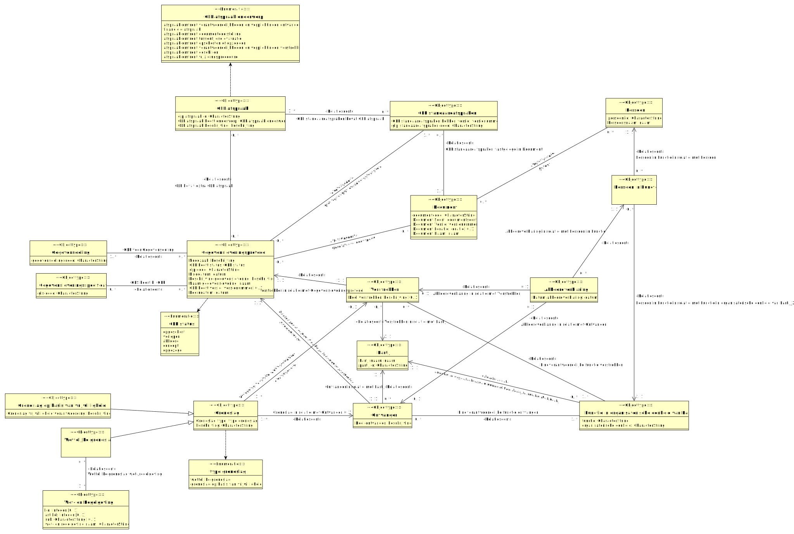

# CIM gegevensleveringsprotocol

- [Akkoordverklaring](#TAkkoordverklaring)
- [Document](#TDocument)
- [Functie in Organisatorische eenheid van Partij](#TFunctie_in_Organisatorische_eenheid_van_Partij)
- [GLP afspraak](#TGLP_afspraak)
- [GLP standaardafspraken](#TGLP_standaardafspraken)
- [Gegevensdeling](#TGegevensdeling)
- [Gegevensleveringsprotocol](#TGegevensleveringsprotocol)
- [Gegevensleveringsspecificatie](#TGegevensleveringsspecificatie)
- [Grondslag](#TGrondslag)
  - [Grondslag op basis van vrijwilligheid](#TGrondslag_op_basis_van_vrijwilligheid)
  - [Wettelijke grondslag](#TWettelijke_grondslag)
- [Ontvanger](#TOntvanger)
- [Partij](#TPartij)
- [Persoon](#TPersoon)
- [Persoon in Functie](#TPersoon_in_Functie)
- [Verstrekker](#TVerstrekker)
- [Wet- en Regelgeving](#TWet-_en_Regelgeving)

## Akkoordverklaring {#TAkkoordverklaring}

|{: .def}||
|-|-|
|Begrip|[Akkoordverklaring](#akkoordverklaring)|
|Toelichting|[Persoon in Functie](#TPersoon_in_Functie) heeft namens [Verstrekker](#TVerstrekker) akkoord verklaard; [Verstrekker](#TVerstrekker) is akkoord verklaard namens de verstrekkende partij door [Persoon in Functie](#TPersoon_in_Functie); [Persoon in Functie](#TPersoon_in_Functie) heeft namens [Ontvanger](#TOntvanger) akkoord verklaard|
|Kenmerken|[Datum akkoordverklaring](#TDatum_akkoordverklaring)|
|Rollen|[Ontvanger](#TAkkoordverklaringOntvanger), [Persoon in Functie](#TAkkoordverklaringPersoon_in_Functie), [Verstrekker](#TAkkoordverklaringVerstrekker)|

### Datum akkoordverklaring {#TDatum_akkoordverklaring}

|{: .def}||
|-|-|
|Toelichting|[Akkoordverklaring](#TAkkoordverklaring) op [datum]()|
|Eigenschap van|[Akkoordverklaring](#TAkkoordverklaring)|
|Type|[datum](#Tdatum)|

### Verstrekker {#TAkkoordverklaringVerstrekker}

|{: .def}||
|-|-|
|Begrip|[Verstrekker](#verstrekker)|
|Rol van|0..1 [Akkoordverklaring](#TAkkoordverklaring)|
|Met| [Verstrekker](#TVerstrekker)|

### Ontvanger {#TAkkoordverklaringOntvanger}

|{: .def}||
|-|-|
|Begrip|[Ontvanger](#ontvanger)|
|Rol van|0..1 [Akkoordverklaring](#TAkkoordverklaring)|
|Met| [Ontvanger](#TOntvanger)|

### Persoon in Functie {#TAkkoordverklaringPersoon_in_Functie}

|{: .def}||
|-|-|
|Rol van|0..* [Akkoordverklaring](#TAkkoordverklaring)|
|Met| [Persoon in Functie](#TPersoon_in_Functie)|

## Document {#TDocument}

|{: .def}||
|-|-|
|Begrip|[Document](#document)|
|Toelichting|bD_MinJenV_vermogensoverzicht_gls; document [documentcode](); [documentcode](); Document [documentcode]()|
|Kenmerken|[Document Locatie](#TDocument_Locatie), [Document Naam](#TDocument_Naam), [Document Soort](#TDocument_Soort), [Document Versie](#TDocument_Versie), [documentcode](#TDocumentdocumentcode)|
|Rollen|[Auteur](#TAuteur)|
|Relatie met|[GLP standaardafspraken vastgelegd in Document](#TGLP_standaardafspraken_vastgelegd_in_Document), [Gerelateerd document](#TGerelateerd_document)|

### documentcode {#TDocumentdocumentcode}

|{: .def}||
|-|-|
|Eigenschap van|[Document](#TDocument)|
|Type|CharacterString|

### Document Soort {#TDocument_Soort}

|{: .def}||
|-|-|
|Toelichting|[Document](#TDocument) is van het soort [documentsoort]()|
|Eigenschap van|[Document](#TDocument)|
|Type|[documentsoort](#Tdocumentsoort)|

### Document Versie {#TDocument_Versie}

|{: .def}||
|-|-|
|Toelichting|[Document](#TDocument) heeft versienummer [versienummer]()|
|Eigenschap van|[Document](#TDocument)|
|Type|[versienummer](#Tversienummer)|

### Document Locatie {#TDocument_Locatie}

|{: .def}||
|-|-|
|Toelichting|de locatie van document [Document](#TDocument) is [locatie]()|
|Eigenschap van|[Document](#TDocument)|
|Type|[locatie](#Tlocatie)|

### Document Naam {#TDocument_Naam}

|{: .def}||
|-|-|
|Toelichting|document [Document](#TDocument) heet [naam]()|
|Eigenschap van|[Document](#TDocument)|
|Type|[naam](#Tnaam)|

### Auteur {#TAuteur}

|{: .def}||
|-|-|
|Begrip|[Auteur](#auteur)|
|Toelichting|document [Document](#TDocument) heeft auteur [Persoon](#TPersoon)|
|Rol van|0..* [Document](#TDocument)|
|Met|0..* [Persoon](#TPersoon)|

## Functie in Organisatorische eenheid van Partij {#TFunctie_in_Organisatorische_eenheid_van_Partij}

|{: .def}||
|-|-|
|Toelichting|[functie]() bij [organisatorische eenheid]() aan [Partij](#TPartij); [functie]() van [organisatorische eenheid]() bij [Partij](#TPartij); [functie]()  [organisatorische eenheid]() bij [Partij](#TPartij); [functie]() bij [organisatorische eenheid]() , [Partij](#TPartij); [functie]() in [organisatorische eenheid]() binnen [Partij](#TPartij); de functie [functie]() van [organisatorische eenheid]() binnen [Partij](#TPartij); [functie]() binnen [organisatorische eenheid]() van [Partij](#TPartij); [functie]()  [organisatorische eenheid]() van [Partij](#TPartij)|
|Kenmerken|[functie](#TFunctie_in_Organisatorische_eenheid_van_Partijfunctie), [organisatorische eenheid](#TFunctie_in_Organisatorische_eenheid_van_Partijorganisatorische_eenheid)|
|Rollen|[Partij](#TFunctie_in_Organisatorische_eenheid_van_PartijPartij)|
|Relatie met|[Functie in Organisatorische eenheid van Partij](#TPersoon_in_FunctieFunctie_in_Organisatorische_eenheid_van_Partij)|

### organisatorische eenheid {#TFunctie_in_Organisatorische_eenheid_van_Partijorganisatorische_eenheid}

|{: .def}||
|-|-|
|Begrip|[Organisatorische eenheid](#organisatorische-eenheid)|
|Eigenschap van|[Functie in Organisatorische eenheid van Partij](#TFunctie_in_Organisatorische_eenheid_van_Partij)|
|Type|CharacterString|

### functie {#TFunctie_in_Organisatorische_eenheid_van_Partijfunctie}

|{: .def}||
|-|-|
|Begrip|[Functie](#functie)|
|Eigenschap van|[Functie in Organisatorische eenheid van Partij](#TFunctie_in_Organisatorische_eenheid_van_Partij)|
|Type|CharacterString|

### Partij {#TFunctie_in_Organisatorische_eenheid_van_PartijPartij}

|{: .def}||
|-|-|
|Begrip|[Partij](#partij)|
|Rol van|0..* 0..* [Functie in Organisatorische eenheid van Partij](#TFunctie_in_Organisatorische_eenheid_van_Partij)|
|Met| [Partij](#TPartij)|

## GLP afspraak {#TGLP_afspraak}

|{: .def}||
|-|-|
|Toelichting|GLP afspraak [glp afspraak id](); bepaling [glp afspraak id](); afspraak [glp afspraak id](); er is een GLP afspraak [glp afspraak id]()|
|Kenmerken|[GLP afspraak beschrijving](#TGLP_afspraak_beschrijving), [GLP afspraak heeft onderwerp](#TGLP_afspraak_heeft_onderwerp), [glp afspraak id](#TGLP_afspraakglp_afspraak_id)|
|Relatie met|[GLP bevat extra GLP afspraak](#TGLP_bevat_extra_GLP_afspraak), [GLP standaardafspraken bevat GLP afspraak](#TGLP_standaardafspraken_bevat_GLP_afspraak)|

### glp afspraak id {#TGLP_afspraakglp_afspraak_id}

|{: .def}||
|-|-|
|Eigenschap van|[GLP afspraak](#TGLP_afspraak)|
|Type|CharacterString|

### GLP afspraak heeft onderwerp {#TGLP_afspraak_heeft_onderwerp}

|{: .def}||
|-|-|
|Toelichting|[GLP afspraak](#TGLP_afspraak) is van het type [GLP afspraak onderwerp](); het type van [GLP afspraak](#TGLP_afspraak) is [GLP afspraak onderwerp]()|
|Eigenschap van|[GLP afspraak](#TGLP_afspraak)|
|Type|[GLP afspraak onderwerp](#TGLP_afspraak_onderwerp)|
|Mogelijke waarden|afspraak omtrent tussentijdse evaluatie; afspraak omtrent documentdoelstelling; afspraak omtrent geschillen; afspraak omtrent verantwoordelijkheden en verplichtingen verstrekker; afspraak omtrent verantwoordelijkheden en verplichtingen ontvanger; afspraak omtrent opschorten of opzeggen; afspraak omtrent wijzigingsprocedure; financiële afspraak|

### GLP afspraak beschrijving {#TGLP_afspraak_beschrijving}

|{: .def}||
|-|-|
|Toelichting|[GLP afspraak](#TGLP_afspraak) is [beschrijving]()|
|Eigenschap van|[GLP afspraak](#TGLP_afspraak)|
|Type|[beschrijving](#Tbeschrijving)|

## GLP standaardafspraken {#TGLP_standaardafspraken}

|{: .def}||
|-|-|
|Begrip|[GLP Standaardafspraken](#glp-standaardafspraken)|
|Toelichting|GLP standaard afspraken [glp standaardafspraken code](); gLP Standaardafspraken [glp standaardafspraken code](); er bestaan GLP standaard afspraken met naam [glp standaardafspraken code]()|
|Kenmerken|[GLP Standaardafspraken hebben Versie](#TGLP_Standaardafspraken_hebben_Versie), [glp standaardafspraken code](#TGLP_standaardafsprakenglp_standaardafspraken_code)|
|Rollen|[GLP standaardafspraken bevat GLP afspraak](#TGLP_standaardafspraken_bevat_GLP_afspraak), [GLP standaardafspraken vastgelegd in Document](#TGLP_standaardafspraken_vastgelegd_in_Document)|
|Relatie met|[GLP bevat GLP standaardafspraken](#TGLP_bevat_GLP_standaardafspraken)|

### glp standaardafspraken code {#TGLP_standaardafsprakenglp_standaardafspraken_code}

|{: .def}||
|-|-|
|Eigenschap van|[GLP standaardafspraken](#TGLP_standaardafspraken)|
|Type|CharacterString|

### GLP Standaardafspraken hebben Versie {#TGLP_Standaardafspraken_hebben_Versie}

|{: .def}||
|-|-|
|Toelichting|[GLP standaardafspraken](#TGLP_standaardafspraken) hebben Versie [versienummer]()|
|Eigenschap van|[GLP standaardafspraken](#TGLP_standaardafspraken)|
|Type|[versienummer](#Tversienummer)|

### GLP standaardafspraken bevat GLP afspraak {#TGLP_standaardafspraken_bevat_GLP_afspraak}

|{: .def}||
|-|-|
|Toelichting|[GLP standaardafspraken](#TGLP_standaardafspraken) bevat [GLP afspraak](#TGLP_afspraak)|
|Rol van|0..* [GLP standaardafspraken](#TGLP_standaardafspraken)|
|Met|1..* [GLP afspraak](#TGLP_afspraak)|

### GLP standaardafspraken vastgelegd in Document {#TGLP_standaardafspraken_vastgelegd_in_Document}

|{: .def}||
|-|-|
|Toelichting|de bron van [GLP standaardafspraken](#TGLP_standaardafspraken) is [Document](#TDocument)|
|Rol van|0..1 [GLP standaardafspraken](#TGLP_standaardafspraken)|
|Met|1..1 [Document](#TDocument)|

## Gegevensdeling {#TGegevensdeling}

|{: .def}||
|-|-|
|Begrip|[Gegevensdeling](#gegevensdeling)|
|Toelichting|gegevensdeling met gegevensdelingscode [gegevensdelingscode](); gegevensdeling met gegevensdelingscode [gegevensdelingscode]() bestaat|
|Kenmerken|[gegevensdelingscode](#TGegevensdelinggegevensdelingscode)|
|Rollen|[GLP voor Gegevensdeling](#TGLP_voor_Gegevensdeling)|

### gegevensdelingscode {#TGegevensdelinggegevensdelingscode}

|{: .def}||
|-|-|
|Eigenschap van|[Gegevensdeling](#TGegevensdeling)|
|Type|CharacterString|

### GLP voor Gegevensdeling {#TGLP_voor_Gegevensdeling}

|{: .def}||
|-|-|
|Toelichting|[Gegevensleveringsprotocol](#TGegevensleveringsprotocol) beschrijft de juridische en organisatorische afspraken voor [Gegevensdeling](#TGegevensdeling)|
|Rol van|1..1 [Gegevensdeling](#TGegevensdeling)|
|Met|0..1 [Gegevensleveringsprotocol](#TGegevensleveringsprotocol)|

## Gegevensleveringsprotocol {#TGegevensleveringsprotocol}

|{: .def}||
|-|-|
|Begrip|[Gegevensleveringsprotocol](#gegevensleveringsprotocol)|
|Toelichting|er is een GLP met GLP-code [glp-code](); GLP [glp-code](); [glp-code]()|
|Kenmerken|[Algemene beschrijving](#TAlgemene_beschrijving), [Begindatum](#TBegindatum), [Einddatum](#TEinddatum), [GLP status](#TGLP_status), [Naam gegevenslevering](#TNaam_gegevenslevering), [Noodzaak](#TNoodzaak), [glp-code](#TGegevensleveringsprotocolglp-code)|
|Rollen|[GLP bevat GLP standaardafspraken](#TGLP_bevat_GLP_standaardafspraken), [GLP bevat extra GLP afspraak](#TGLP_bevat_extra_GLP_afspraak), [Gerelateerd document](#TGerelateerd_document)|
|Relatie met|[GLP voor Gegevensdeling](#TGLP_voor_Gegevensdeling), [GLS hoort bij GLP](#TGLS_hoort_bij_GLP), [Gegevensleveringsprotocol](#TOntvangerGegevensleveringsprotocol), [Gegevensleveringsprotocol](#TVerstrekkerGegevensleveringsprotocol)|

### Noodzaak {#TNoodzaak}

|{: .def}||
|-|-|
|Begrip|[Noodzaak](#noodzaak)|
|Toelichting|de noodzaak van de gegevensdeling ten behoeve van [Gegevensleveringsprotocol](#TGegevensleveringsprotocol) is [beschrijving]()|
|Eigenschap van|[Gegevensleveringsprotocol](#TGegevensleveringsprotocol)|
|Type|[beschrijving](#Tbeschrijving)|

### GLP status {#TGLP_status}

|{: .def}||
|-|-|
|Begrip|[GLP status](#glp-status)|
|Toelichting|de status van [Gegevensleveringsprotocol](#TGegevensleveringsprotocol) is [status]()|
|Eigenschap van|[Gegevensleveringsprotocol](#TGegevensleveringsprotocol)|
|Type|[status](#Tstatus)|
|Mogelijke waarden|opgeschort; concept; akkoord; verlopen; opgezegd|

### glp-code {#TGegevensleveringsprotocolglp-code}

|{: .def}||
|-|-|
|Begrip|[GLP-code](#glp-code)|
|Eigenschap van|[Gegevensleveringsprotocol](#TGegevensleveringsprotocol)|
|Type|CharacterString|

### Einddatum {#TEinddatum}

|{: .def}||
|-|-|
|Toelichting|de afspraken zoals vastgelegd in [Gegevensleveringsprotocol](#TGegevensleveringsprotocol) eindigen na [datum](); de afspraken conform [Gegevensleveringsprotocol](#TGegevensleveringsprotocol) lopen ten einde na [datum]()|
|Eigenschap van|[Gegevensleveringsprotocol](#TGegevensleveringsprotocol)|
|Type|[datum](#Tdatum)|

### Algemene beschrijving {#TAlgemene_beschrijving}

|{: .def}||
|-|-|
|Toelichting|de gegevenslevering waarvoor [Gegevensleveringsprotocol](#TGegevensleveringsprotocol) de afspraken vastlegt, heeft betrekking op [beschrijving](); de gegevensverstrekking waarvoor [Gegevensleveringsprotocol](#TGegevensleveringsprotocol) de afspraken vastlegt, heeft betrekking op [beschrijving]()|
|Eigenschap van|[Gegevensleveringsprotocol](#TGegevensleveringsprotocol)|
|Type|[beschrijving](#Tbeschrijving)|

### Naam gegevenslevering {#TNaam_gegevenslevering}

|{: .def}||
|-|-|
|Toelichting|de naam van de gegevensdeling ten behoeve van [Gegevensleveringsprotocol](#TGegevensleveringsprotocol) is [naam]()|
|Eigenschap van|[Gegevensleveringsprotocol](#TGegevensleveringsprotocol)|
|Type|[naam](#Tnaam)|

### Begindatum {#TBegindatum}

|{: .def}||
|-|-|
|Toelichting|de afspraken zoals vastgelegd in [Gegevensleveringsprotocol](#TGegevensleveringsprotocol) gaan in op [datum](); de afspraken conform [Gegevensleveringsprotocol](#TGegevensleveringsprotocol) gaan van start op [datum]()|
|Eigenschap van|[Gegevensleveringsprotocol](#TGegevensleveringsprotocol)|
|Type|[datum](#Tdatum)|

### GLP bevat GLP standaardafspraken {#TGLP_bevat_GLP_standaardafspraken}

|{: .def}||
|-|-|
|Toelichting|[Gegevensleveringsprotocol](#TGegevensleveringsprotocol) bevat [GLP standaardafspraken](#TGLP_standaardafspraken)|
|Rol van|0..1 [Gegevensleveringsprotocol](#TGegevensleveringsprotocol)|
|Met|1..1 [GLP standaardafspraken](#TGLP_standaardafspraken)|

### GLP bevat extra GLP afspraak {#TGLP_bevat_extra_GLP_afspraak}

|{: .def}||
|-|-|
|Toelichting|[Gegevensleveringsprotocol](#TGegevensleveringsprotocol) bevat [GLP afspraak](#TGLP_afspraak)|
|Rol van|0..* [Gegevensleveringsprotocol](#TGegevensleveringsprotocol)|
|Met|0..* [GLP afspraak](#TGLP_afspraak)|

### Gerelateerd document {#TGerelateerd_document}

|{: .def}||
|-|-|
|Toelichting|[Gegevensleveringsprotocol](#TGegevensleveringsprotocol) hangt samen met [Document](#TDocument)|
|Rol van|0..* [Gegevensleveringsprotocol](#TGegevensleveringsprotocol)|
|Met|0..* [Document](#TDocument)|

## Gegevensleveringsspecificatie {#TGegevensleveringsspecificatie}

|{: .def}||
|-|-|
|Begrip|[Gegevensleveringsspecificatie](#gegevensleveringsspecificatie)|
|Toelichting|[gls-code]()|
|Kenmerken|[gls-code](#TGegevensleveringsspecificatiegls-code)|
|Rollen|[GLS hoort bij GLP](#TGLS_hoort_bij_GLP)|

### gls-code {#TGegevensleveringsspecificatiegls-code}

|{: .def}||
|-|-|
|Begrip|[GLS-code](#gls-code)|
|Eigenschap van|[Gegevensleveringsspecificatie](#TGegevensleveringsspecificatie)|
|Type|CharacterString|

### GLS hoort bij GLP {#TGLS_hoort_bij_GLP}

|{: .def}||
|-|-|
|Toelichting|gegevensleveringsspecificatie met GLS-code [Gegevensleveringsspecificatie](#TGegevensleveringsspecificatie) hoort bij gegevensleveringsprotocol met GLP-code [Gegevensleveringsprotocol](#TGegevensleveringsprotocol)|
|Rol van|0..* [Gegevensleveringsspecificatie](#TGegevensleveringsspecificatie)|
|Met|0..* [Gegevensleveringsprotocol](#TGegevensleveringsprotocol)|

## Grondslag {#TGrondslag}

|{: .def}||
|-|-|
|Begrip|[Grondslag](#grondslag)|
|Subtype(s)|[Wettelijke grondslag](#TWettelijke_grondslag), [Grondslag op basis van vrijwilligheid](#TGrondslag_op_basis_van_vrijwilligheid)|
|Toelichting|de grondslag van [Ontvanger](#TOntvanger) is [beschrijving](); grondslag verstrekker in [Verstrekker](#TVerstrekker) , [beschrijving](); grondslag verstrekker op basis van vrijwilligheid in [Verstrekker](#TVerstrekker) [beschrijving](); grondslag verstrekker van [Verstrekker](#TVerstrekker) , [beschrijving](); grondslag verstrekker in [Verstrekker](#TVerstrekker)  [beschrijving](); grondslag verstrekker van [Verstrekker](#TVerstrekker) is [beschrijving](); de grondslag van [Verstrekker](#TVerstrekker) is [beschrijving](); grondslag verstrekker in [Verstrekker](#TVerstrekker) is [beschrijving]()|
|Kenmerken|[Grondslag type](#TGrondslag_type), [beschrijving](#TGrondslagbeschrijving)|
|Rollen|[Ontvanger](#TGrondslagOntvanger), [Verstrekker](#TGrondslagVerstrekker)|

### Grondslag type {#TGrondslag_type}

|{: .def}||
|-|-|
|Toelichting|[Grondslag](#TGrondslag) is van het type [type grondslag](); [Grondslag](#TGrondslag) heeft de categorie [type grondslag]()|
|Eigenschap van|[Grondslag](#TGrondslag)|
|Type|[type grondslag](#Ttype_grondslag)|
|Mogelijke waarden|grondslag op basis van vrijwilligheid; wettelijke grondslag|

### beschrijving {#TGrondslagbeschrijving}

|{: .def}||
|-|-|
|Eigenschap van|[Grondslag](#TGrondslag)|
|Type|CharacterString|

### Ontvanger {#TGrondslagOntvanger}

|{: .def}||
|-|-|
|Begrip|[Ontvanger](#ontvanger)|
|Rol van|1..* [Grondslag](#TGrondslag)|
|Met| [Ontvanger](#TOntvanger)|

### Verstrekker {#TGrondslagVerstrekker}

|{: .def}||
|-|-|
|Begrip|[Verstrekker](#verstrekker)|
|Rol van|1..* [Grondslag](#TGrondslag)|
|Met| [Verstrekker](#TVerstrekker)|

## Grondslag op basis van vrijwilligheid {#TGrondslag_op_basis_van_vrijwilligheid}

|{: .def}||
|-|-|
|Begrip|[Grondslag op basis van vrijwilligheid](#grondslag-op-basis-van-vrijwilligheid)|
|Supertype|[Grondslag](#TGrondslag)|
|Toelichting|[Grondslag](#TGrondslag)|
|Kenmerken|[Grondslag vrijwilligheid verantwoording](#TGrondslag_vrijwilligheid_verantwoording)|

### Grondslag vrijwilligheid verantwoording {#TGrondslag_vrijwilligheid_verantwoording}

|{: .def}||
|-|-|
|Begrip|[Grondslag vrijwilligheid verantwoording](#grondslag-vrijwilligheid-verantwoording)|
|Toelichting|verantwoording van [Grondslag op basis van vrijwilligheid](#TGrondslag_op_basis_van_vrijwilligheid) , is [beschrijving]()|
|Eigenschap van|[Grondslag op basis van vrijwilligheid](#TGrondslag_op_basis_van_vrijwilligheid)|
|Type|[beschrijving](#Tbeschrijving)|

## Ontvanger {#TOntvanger}

|{: .def}||
|-|-|
|Begrip|[Ontvanger](#ontvanger)|
|Toelichting|ontvangende [Partij](#TPartij) in [Gegevensleveringsprotocol](#TGegevensleveringsprotocol); [Partij](#TPartij) vervult de rol van ontvanger in de gegevenslevering ten behoeve van [Gegevensleveringsprotocol](#TGegevensleveringsprotocol); ontvangende partij [Partij](#TPartij) in de gegevensdeling ten behoeve van [Gegevensleveringsprotocol](#TGegevensleveringsprotocol); Ontvangende [Partij](#TPartij)  [Gegevensleveringsprotocol](#TGegevensleveringsprotocol)|
|Kenmerken|[Doel ontvanger](#TDoel_ontvanger)|
|Rollen|[Gegevensleveringsprotocol](#TOntvangerGegevensleveringsprotocol), [Partij](#TOntvangerPartij)|
|Relatie met|[Ontvanger](#TAkkoordverklaringOntvanger), [Ontvanger](#TGrondslagOntvanger)|

### Doel ontvanger {#TDoel_ontvanger}

|{: .def}||
|-|-|
|Begrip|[Doel ontvanger](#doel-ontvanger)|
|Toelichting|het doel van [Ontvanger](#TOntvanger) is [beschrijving]()|
|Eigenschap van|[Ontvanger](#TOntvanger)|
|Type|[beschrijving](#Tbeschrijving)|

### Gegevensleveringsprotocol {#TOntvangerGegevensleveringsprotocol}

|{: .def}||
|-|-|
|Begrip|[Gegevensleveringsprotocol](#gegevensleveringsprotocol)|
|Rol van|1..1 [Ontvanger](#TOntvanger)|
|Met| [Gegevensleveringsprotocol](#TGegevensleveringsprotocol)|

### Partij {#TOntvangerPartij}

|{: .def}||
|-|-|
|Begrip|[Partij](#partij)|
|Rol van|0..* [Ontvanger](#TOntvanger)|
|Met| [Partij](#TPartij)|

## Partij {#TPartij}

|{: .def}||
|-|-|
|Begrip|[Partij](#partij)|
|Toelichting|Partij [partij id](); Partij [partij id]() bestaat; [partij id](); partij [partij id]()|
|Kenmerken|[Partij naam](#TPartij_naam), [partij id](#TPartijpartij_id)|
|Relatie met|[Partij](#TFunctie_in_Organisatorische_eenheid_van_PartijPartij), [Partij](#TVerstrekkerPartij), [Partij](#TOntvangerPartij)|

### Partij naam {#TPartij_naam}

|{: .def}||
|-|-|
|Toelichting|[Partij](#TPartij) heet [naam](); de naam van [Partij](#TPartij) is [naam]()|
|Eigenschap van|[Partij](#TPartij)|
|Type|[naam](#Tnaam)|

### partij id {#TPartijpartij_id}

|{: .def}||
|-|-|
|Eigenschap van|[Partij](#TPartij)|
|Type|CharacterString|

## Persoon {#TPersoon}

|{: .def}||
|-|-|
|Toelichting|Persoon [persoon id](); Er is een persoon [persoon id]()|
|Kenmerken|[Persoonsnaam](#TPersoonsnaam), [persoon id](#TPersoonpersoon_id)|
|Relatie met|[Auteur](#TAuteur), [Persoon](#TPersoon_in_FunctiePersoon)|

### persoon id {#TPersoonpersoon_id}

|{: .def}||
|-|-|
|Eigenschap van|[Persoon](#TPersoon)|
|Type|CharacterString|

### Persoonsnaam {#TPersoonsnaam}

|{: .def}||
|-|-|
|Toelichting|[naam]() is de naam van [Persoon](#TPersoon); [Persoon](#TPersoon) heet [naam]()|
|Eigenschap van|[Persoon](#TPersoon)|
|Type|[naam](#Tnaam)|

## Persoon in Functie {#TPersoon_in_Functie}

|{: .def}||
|-|-|
|Toelichting|[Persoon](#TPersoon) bekleedt [Functie in Organisatorische eenheid van Partij](#TFunctie_in_Organisatorische_eenheid_van_Partij); [Persoon](#TPersoon) in [Functie in Organisatorische eenheid van Partij](#TFunctie_in_Organisatorische_eenheid_van_Partij); [Persoon](#TPersoon) , [Functie in Organisatorische eenheid van Partij](#TFunctie_in_Organisatorische_eenheid_van_Partij)|
|Rollen|[Functie in Organisatorische eenheid van Partij](#TPersoon_in_FunctieFunctie_in_Organisatorische_eenheid_van_Partij), [Persoon](#TPersoon_in_FunctiePersoon)|
|Relatie met|[Persoon in Functie](#TAkkoordverklaringPersoon_in_Functie)|

### Persoon {#TPersoon_in_FunctiePersoon}

|{: .def}||
|-|-|
|Rol van|0..* [Persoon in Functie](#TPersoon_in_Functie)|
|Met| [Persoon](#TPersoon)|

### Functie in Organisatorische eenheid van Partij {#TPersoon_in_FunctieFunctie_in_Organisatorische_eenheid_van_Partij}

|{: .def}||
|-|-|
|Rol van|0..* [Persoon in Functie](#TPersoon_in_Functie)|
|Met| [Functie in Organisatorische eenheid van Partij](#TFunctie_in_Organisatorische_eenheid_van_Partij)|

## Verstrekker {#TVerstrekker}

|{: .def}||
|-|-|
|Begrip|[Verstrekker](#verstrekker)|
|Toelichting|Verstrekkende [Partij](#TPartij) in [Gegevensleveringsprotocol](#TGegevensleveringsprotocol); verstrekkende partij [Partij](#TPartij) in de gegevensdeling ten behoeve van [Gegevensleveringsprotocol](#TGegevensleveringsprotocol); Verstrekkende [Partij](#TPartij)  [Gegevensleveringsprotocol](#TGegevensleveringsprotocol); [Partij](#TPartij) vervult de rol van verstrekker in de gegevenslevering ten behoeve van [Gegevensleveringsprotocol](#TGegevensleveringsprotocol)|
|Kenmerken|[Doel verstrekker](#TDoel_verstrekker)|
|Rollen|[Gegevensleveringsprotocol](#TVerstrekkerGegevensleveringsprotocol), [Partij](#TVerstrekkerPartij)|
|Relatie met|[Verstrekker](#TAkkoordverklaringVerstrekker), [Verstrekker](#TGrondslagVerstrekker)|

### Doel verstrekker {#TDoel_verstrekker}

|{: .def}||
|-|-|
|Begrip|[Doel verstrekker](#doel-verstrekker)|
|Toelichting|het doel van [Verstrekker](#TVerstrekker) is [beschrijving]()|
|Eigenschap van|[Verstrekker](#TVerstrekker)|
|Type|[beschrijving](#Tbeschrijving)|

### Partij {#TVerstrekkerPartij}

|{: .def}||
|-|-|
|Begrip|[Partij](#partij)|
|Rol van|0..* [Verstrekker](#TVerstrekker)|
|Met| [Partij](#TPartij)|

### Gegevensleveringsprotocol {#TVerstrekkerGegevensleveringsprotocol}

|{: .def}||
|-|-|
|Begrip|[Gegevensleveringsprotocol](#gegevensleveringsprotocol)|
|Rol van|1..1 [Verstrekker](#TVerstrekker)|
|Met| [Gegevensleveringsprotocol](#TGegevensleveringsprotocol)|

## Wet- en Regelgeving {#TWet-_en_Regelgeving}

|{: .def}||
|-|-|
|Toelichting|Artikel [artikel]() , lid [lid]() , [wet- en regelgeving naam](); [wet- en regelgeving naam](); Artikel [artikel]() , lid [lid]() , sub [sub]() , [wet- en regelgeving naam](); Artikel [artikel]() , [wet- en regelgeving naam]()|
|Kenmerken|[artikel](#TWet-_en_Regelgevingartikel), [lid](#TWet-_en_Regelgevinglid), [sub](#TWet-_en_Regelgevingsub), [wet- en regelgeving naam](#TWet-_en_Regelgevingwet-_en_regelgeving_naam)|
|Relatie met|[Wettelijke grondslag wet-/regelgeving](#TWettelijke_grondslag_wet-_regelgeving)|

### lid {#TWet-_en_Regelgevinglid}

|{: .def}||
|-|-|
|Eigenschap van|[Wet- en Regelgeving](#TWet-_en_Regelgeving)|
|Type|Integer|

### artikel {#TWet-_en_Regelgevingartikel}

|{: .def}||
|-|-|
|Eigenschap van|[Wet- en Regelgeving](#TWet-_en_Regelgeving)|
|Type|CharacterString|

### sub {#TWet-_en_Regelgevingsub}

|{: .def}||
|-|-|
|Eigenschap van|[Wet- en Regelgeving](#TWet-_en_Regelgeving)|
|Type|CharacterString|

### wet- en regelgeving naam {#TWet-_en_Regelgevingwet-_en_regelgeving_naam}

|{: .def}||
|-|-|
|Eigenschap van|[Wet- en Regelgeving](#TWet-_en_Regelgeving)|
|Type|CharacterString|

## Wettelijke grondslag {#TWettelijke_grondslag}

|{: .def}||
|-|-|
|Begrip|[Wettelijke grondslag](#wettelijke-grondslag)|
|Supertype|[Grondslag](#TGrondslag)|
|Toelichting|[Grondslag](#TGrondslag)|
|Rollen|[Wettelijke grondslag wet-/regelgeving](#TWettelijke_grondslag_wet-_regelgeving)|

### Wettelijke grondslag wet-/regelgeving {#TWettelijke_grondslag_wet-_regelgeving}

|{: .def}||
|-|-|
|Toelichting|[Wettelijke grondslag](#TWettelijke_grondslag) , is op basis van [Wet- en Regelgeving](#TWet-_en_Regelgeving)|
|Rol van|0..* [Wettelijke grondslag](#TWettelijke_grondslag)|
|Met|1..* [Wet- en Regelgeving](#TWet-_en_Regelgeving)|

## Waardetypering en referentielijsten

### beschrijving {#Tbeschrijving}

|{: .def}||
|-|-|
|Gebaseerd op|CharacterString|

### datum {#Tdatum}

|{: .def}||
|-|-|

### documentsoort {#Tdocumentsoort}

|{: .def}||
|-|-|
|Gebaseerd op|CharacterString|

### locatie {#Tlocatie}

|{: .def}||
|-|-|
|Gebaseerd op|CharacterString|

### naam {#Tnaam}

|{: .def}||
|-|-|
|Gebaseerd op|CharacterString|

### versienummer {#Tversienummer}

|{: .def}||
|-|-|
|Begrip|[Versienummer](#versienummer)|
|Gebaseerd op|CharacterString|

### GLP afspraak onderwerp {#TGLP_afspraak_onderwerp}

De volgende waarden zijn mogelijk:
- [afspraak omtrent documentdoelstelling](#afspraak-omtrent-documentdoelstelling)
- [afspraak omtrent geschillen](#afspraak-omtrent-geschillen)
- [afspraak omtrent opschorten of opzeggen](#afspraak-omtrent-opschorten-of-opzeggen)
- [afspraak omtrent tussentijdse evaluatie](#afspraak-omtrent-tussentijdse-evaluatie)
- [afspraak omtrent verantwoordelijkheden en verplichtingen ontvanger](#afspraak-omtrent-verantwoordelijkheden-en-verplichtingen-ontvanger)
- [afspraak omtrent verantwoordelijkheden en verplichtingen verstrekker](#afspraak-omtrent-verantwoordelijkheden-en-verplichtingen-verstrekker)
- [afspraak omtrent wijzigingsprocedure](#afspraak-omtrent-wijzigingsprocedure)
- [financiële afspraak](#financiële-afspraak)

### status {#Tstatus}

De volgende waarden zijn mogelijk:
- [akkoord](#akkoord)
- [concept](#concept)
- [opgeschort](#opgeschort)
- [opgezegd](#opgezegd)
- [verlopen](#verlopen)

### type grondslag {#Ttype_grondslag}

De volgende waarden zijn mogelijk:
- [grondslag op basis van vrijwilligheid](#grondslag-op-basis-van-vrijwilligheid)
- [wettelijke grondslag](#wettelijke-grondslag)

