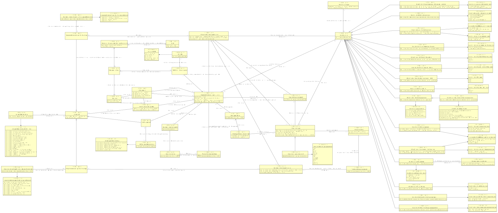

# CIM gegevensleveringsspecificatie

- [Afspraak](#-fspraak)
  - [GLS Afspraak](#-fspraak)
  - [Gegevensleversetspecificatie Afspraak](#-egevensleversetspecificatie-fspraak)
  - [Gegevensmiddelspecificatie Afspraak](#-egevensmiddelspecificatie-fspraak)
- [Afspraakonderwerp](#-fspraakonderwerp)
- [Begrippenkader](#-egrippenkader)
- [Begrippenkader omvat Term](#-egrippenkader-omvat-erm)
- [Classificatie](#-lassificatie)
  - [Classificatie AKI-gegevens](#-lassificatie-gegevens)
  - [Classificatie BIV Beschikbaarheid](#-lassificatie-eschikbaarheid)
  - [Classificatie BIV Integriteit](#-lassificatie-ntegriteit)
  - [Classificatie BIV Vertrouwelijkheid](#-lassificatie-ertrouwelijkheid)
  - [Classificatie Basisbeveiligingsniveau (BBN)](#-lassificatie-asisbeveiligingsniveau-)
  - [Classificatie Gerechtelijke Strafgegevens](#-lassificatie-erechtelijke-trafgegevens)
  - [Classificatie Justitiële Gegevens](#-lassificatie-ustiti-le-egevens)
  - [Classificatie Persoonsgegevens](#-lassificatie-ersoonsgegevens)
    - [Classificatie Bijzondere Persoonsgegevens](#-lassificatie-ijzondere-ersoonsgegevens)
  - [Classificatie Politiegegevens](#-lassificatie-olitiegegevens)
  - [Classificatie Rubriceringsniveau](#-lassificatie-ubriceringsniveau)
  - [Classificatie Strafvorderlijke Gegevens](#-lassificatie-trafvorderlijke-egevens)
  - [Classificatie Tenuitvoerleggingsgegevens](#-lassificatie-enuitvoerleggingsgegevens)
  - [Classificatie Verantwoordingsbelang](#-lassificatie-erantwoordingsbelang)
  - [Classificatie Verantwoordingsbelang met context](#-lassificatie-erantwoordingsbelang-met-context)
  - [Classificatie Vitaal Belang](#-lassificatie-itaal-elang)
- [Classificatietype](#-lassificatietype)
- [Document](#-ocument)
- [Functie in Organisatorische eenheid van Partij](#-unctie-in-rganisatorische-eenheid-van-artij)
- [GLS Afspraakonderwerp](#-fspraakonderwerp)
- [GLS Rol](#-ol)
- [GLS Standaardafspraken](#-tandaardafspraken)
- [GLS heeft Contactpersoon](#-heeft-ontactpersoon)
- [Gegevensdeling](#-egevensdeling)
- [Gegevensleveringsprotocol](#-egevensleveringsprotocol)
- [Gegevensleveringsspecificatie](#-egevensleveringsspecificatie)
- [Gegevensleversetspecificatie](#-egevensleversetspecificatie)
- [Gegevensleversetspecificatie Afspraakonderwerp](#-egevensleversetspecificatie-fspraakonderwerp)
- [Gegevensmiddelspecificatie](#-egevensmiddelspecificatie)
- [Gegevensmiddelspecificatie Afspraakonderwerp](#-egevensmiddelspecificatie-fspraakonderwerp)
- [Gegevenstype](#-egevenstype)
  - [Gegevenstype categorisch](#-egevenstype-categorisch)
- [Gegevensveld](#-egevensveld)
- [Geregistreerd Algoritme](#-eregistreerd-lgoritme)
- [Logisch Gegevensmodel](#-ogisch-egevensmodel)
- [Partij](#-artij)
- [Persoon](#-ersoon)
- [Persoon in Functie](#-ersoon-in-unctie)
- [Technisch Gegevensmodel](#-echnisch-egevensmodel)
- [Verwerkersovereenkomst](#-erwerkersovereenkomst)

## Afspraak {#-fspraak}

|{: .def}||
|-|-|
|Begrip|[Afspraak](#afspraak)|
|Subtype(s)|[Gegevensmiddelspecificatie Afspraak](#-egevensmiddelspecificatie-fspraak), [Gegevensleversetspecificatie Afspraak](#-egevensleversetspecificatie-fspraak), [GLS Afspraak](#-fspraak)|
|Toelichting|afspraak [afspraaknaam](#TAfspraak.afspraaknaam) bestaat|
|Kenmerken|[Afspraak Beschrijving](#-fspraak-eschrijving), [afspraaknaam](#-fspraak-afspraaknaam)|
|Relatie met|[Afspraak over Afspraakonderwerp](#-fspraak-over-fspraakonderwerp), [Afspraken in GLS Standaardafspraken](#-fspraken-in-tandaardafspraken)|

### Afspraak Beschrijving {#-fspraak-eschrijving}

|{: .def}||
|-|-|
|Toelichting|[Afspraak](#TAfspraak) is: [afspraakbeschrijving](#Tafspraakbeschrijving)|
|Eigenschap van|[Afspraak](#-fspraak)|
|Type|[afspraakbeschrijving](#-afspraakbeschrijving)|

### afspraaknaam {#-fspraak-afspraaknaam}

|{: .def}||
|-|-|
|Eigenschap van|[Afspraak](#-fspraak)|
|Type|CharacterString|

## Afspraakonderwerp {#-fspraakonderwerp}

|{: .def}||
|-|-|
|Toelichting|We kunnen afspraken maken over [afspraakonderwerpbeschrijving](#Tafspraakonderwerpbeschrijving)|
|Kenmerken|[afspraakonderwerpbeschrijving](#-fspraakonderwerp-afspraakonderwerpbeschrijving)|
|Rollen|[Afspraak over Afspraakonderwerp](#-fspraak-over-fspraakonderwerp)|

### afspraakonderwerpbeschrijving {#-fspraakonderwerp-afspraakonderwerpbeschrijving}

|{: .def}||
|-|-|
|Eigenschap van|[Afspraakonderwerp](#-fspraakonderwerp)|
|Type|CharacterString|

### Afspraak over Afspraakonderwerp {#-fspraak-over-fspraakonderwerp}

|{: .def}||
|-|-|
|Toelichting|[Afspraak](#TAfspraak) over [Afspraakonderwerp](#TAfspraakonderwerp)|
|Rol van|1..* [Afspraakonderwerp](#-fspraakonderwerp)|
|Met|0..* [Afspraak](#-fspraak)|

## Begrippenkader {#-egrippenkader}

|{: .def}||
|-|-|
|Begrip|[Begrippenkader](#begrippenkader)|
|Toelichting|Er is een begrippenkader met code [begrippenkadercode](#TBegrippenkader.begrippenkadercode)|
|Kenmerken|[begrippenkadercode](#-egrippenkader-begrippenkadercode)|
|Relatie met|[Begrippenkader omvat Term in relatie met Begrippenkader](#-egrippenkader-omvat-erm-egrippenkader), [GLS Begrippenkader](#-egrippenkader)|

### begrippenkadercode {#-egrippenkader-begrippenkadercode}

|{: .def}||
|-|-|
|Eigenschap van|[Begrippenkader](#-egrippenkader)|
|Type|CharacterString|

## Begrippenkader omvat Term {#-egrippenkader-omvat-erm}

|{: .def}||
|-|-|
|Toelichting|begrippenkader [Begrippenkader](#TBegrippenkader) definieert Term [termnaam](#TBegrippenkader_omvat_Term.termnaam)|
|Kenmerken|[Term beschrijving](#-erm-beschrijving), [termnaam](#-egrippenkader-omvat-erm-termnaam)|
|Rollen|[Begrippenkader omvat Term in relatie met Begrippenkader](#-egrippenkader-omvat-erm-egrippenkader), [Term bij Gegevenstype](#-erm-bij-egevenstype)|

### Term beschrijving {#-erm-beschrijving}

|{: .def}||
|-|-|
|Toelichting|[Begrippenkader omvat Term](#TBegrippenkader_omvat_Term) met termbeschrijving [Termbeschrijving](#TTermbeschrijving)|
|Eigenschap van|[Begrippenkader omvat Term](#-egrippenkader-omvat-erm)|
|Type|[Termbeschrijving](#-ermbeschrijving)|

### termnaam {#-egrippenkader-omvat-erm-termnaam}

|{: .def}||
|-|-|
|Eigenschap van|[Begrippenkader omvat Term](#-egrippenkader-omvat-erm)|
|Type|CharacterString|

### Begrippenkader omvat Term in relatie met Begrippenkader {#-egrippenkader-omvat-erm-egrippenkader}

|{: .def}||
|-|-|
|Rol van|1..* [Begrippenkader omvat Term](#-egrippenkader-omvat-erm)|
|Met|1..1 [Begrippenkader](#-egrippenkader)|

### Term bij Gegevenstype {#-erm-bij-egevenstype}

|{: .def}||
|-|-|
|Toelichting|[Begrippenkader omvat Term](#TBegrippenkader_omvat_Term) behorende bij [Gegevenstype](#TGegevenstype)|
|Rol van|1..* [Begrippenkader omvat Term](#-egrippenkader-omvat-erm)|
|Met|0..* [Gegevenstype](#-egevenstype)|

## Classificatie {#-lassificatie}

|{: .def}||
|-|-|
|Begrip|[Classificatie](#classificatie)|
|Subtype(s)|[Classificatie Strafvorderlijke Gegevens](#-lassificatie-trafvorderlijke-egevens), [Classificatie Vitaal Belang](#-lassificatie-itaal-elang), [Classificatie Rubriceringsniveau](#-lassificatie-ubriceringsniveau), [Classificatie Verantwoordingsbelang](#-lassificatie-erantwoordingsbelang), [Classificatie Gerechtelijke Strafgegevens](#-lassificatie-erechtelijke-trafgegevens), [Classificatie Tenuitvoerleggingsgegevens](#-lassificatie-enuitvoerleggingsgegevens), [Classificatie BIV Beschikbaarheid](#-lassificatie-eschikbaarheid), [Classificatie Politiegegevens](#-lassificatie-olitiegegevens), [Classificatie BIV Integriteit](#-lassificatie-ntegriteit), [Classificatie Persoonsgegevens](#-lassificatie-ersoonsgegevens), [Classificatie Basisbeveiligingsniveau (BBN)](#-lassificatie-asisbeveiligingsniveau-), [Classificatie Justitiële Gegevens](#-lassificatie-ustiti-le-egevens), [Classificatie BIV Vertrouwelijkheid](#-lassificatie-ertrouwelijkheid), [Classificatie AKI-gegevens](#-lassificatie-gegevens), [Classificatie Verantwoordingsbelang met context](#-lassificatie-erantwoordingsbelang-met-context)|
|Toelichting|Classificatie [classificatie id](#TClassificatie.classificatie_id) bestaat|
|Kenmerken|[classificatie id](#-lassificatie-classificatie-id)|
|Rollen|[Classificatie heeft classificatietype](#-lassificatie-heeft-classificatietype)|
|Relatie met|[GLS heeft Classificatie](#-heeft-lassificatie), [Gegevensleversetspecificatie heeft Classificatie](#-egevensleversetspecificatie-heeft-lassificatie), [Gegevenstype heeft Classificatie](#-egevenstype-heeft-lassificatie)|

### classificatie id {#-lassificatie-classificatie-id}

|{: .def}||
|-|-|
|Eigenschap van|[Classificatie](#-lassificatie)|
|Type|CharacterString|

### Classificatie heeft classificatietype {#-lassificatie-heeft-classificatietype}

|{: .def}||
|-|-|
|Toelichting|[Classificatie](#TClassificatie) is een [Classificatietype](#TClassificatietype)|
|Rol van|0..* [Classificatie](#-lassificatie)|
|Met|1..* [Classificatietype](#-lassificatietype)|

## Classificatie AKI-gegevens {#-lassificatie-gegevens}

|{: .def}||
|-|-|
|Supertype|[Classificatie](#-lassificatie)|
|Toelichting|classificatie AKI-gegevens [Classificatie](#TClassificatie)|
|Kenmerken|[Classificatie AKI-gegevens waarde](#-lassificatie-gegevens-waarde)|
|Rollen|[Bij AKI-Classificatie hoort Geregistreerd Algoritme](#-ij-lassificatie-hoort-eregistreerd-lgoritme)|

### Classificatie AKI-gegevens waarde {#-lassificatie-gegevens-waarde}

|{: .def}||
|-|-|
|Toelichting|[Classificatie AKI-gegevens](#TClassificatie_AKI-gegevens) heeft waarde [classificatie_akigegevens_waarde](#Tclassificatie_akigegevens_waarde)|
|Eigenschap van|[Classificatie AKI-gegevens](#-lassificatie-gegevens)|
|Type|[classificatie_akigegevens_waarde](#-classificatie-akigegevens-waarde)|
|Mogelijke waarden|bevat geen AKI-gegevens; ja, specifiek risico; ja, minimaal of geen risico; ja, onaanvaardbaar risico; ja, hoog risico|

### Bij AKI-Classificatie hoort Geregistreerd Algoritme {#-ij-lassificatie-hoort-eregistreerd-lgoritme}

|{: .def}||
|-|-|
|Toelichting|[Classificatie AKI-gegevens](#TClassificatie_AKI-gegevens) en heeft een geregistreerd algoritme [Geregistreerd Algoritme](#TGeregistreerd_Algoritme)|
|Rol van|1..* [Classificatie AKI-gegevens](#-lassificatie-gegevens)|
|Met|0..* [Geregistreerd Algoritme](#-eregistreerd-lgoritme)|

## Classificatie BIV Beschikbaarheid {#-lassificatie-eschikbaarheid}

|{: .def}||
|-|-|
|Supertype|[Classificatie](#-lassificatie)|
|Toelichting|Classificatie BIV Beschikbaarheid [Classificatie](#TClassificatie)|
|Kenmerken|[Classificatie BIV Beschikbaarheid waarde](#-lassificatie-eschikbaarheid-waarde)|

### Classificatie BIV Beschikbaarheid waarde {#-lassificatie-eschikbaarheid-waarde}

|{: .def}||
|-|-|
|Toelichting|[Classificatie BIV Beschikbaarheid](#TClassificatie_BIV_Beschikbaarheid) heeft waarde [classificatie_biv_beschikbaarheid_waarde](#Tclassificatie_biv_beschikbaarheid_waarde)|
|Eigenschap van|[Classificatie BIV Beschikbaarheid](#-lassificatie-eschikbaarheid)|
|Type|[classificatie_biv_beschikbaarheid_waarde](#-classificatie-biv-beschikbaarheid-waarde)|
|Mogelijke waarden|midden-2; hoog-3; laag-1|

## Classificatie BIV Integriteit {#-lassificatie-ntegriteit}

|{: .def}||
|-|-|
|Supertype|[Classificatie](#-lassificatie)|
|Toelichting|Classificatie BIV Integriteit [Classificatie](#TClassificatie)|
|Kenmerken|[Classificatie BIV Integriteit waarde](#-lassificatie-ntegriteit-waarde)|

### Classificatie BIV Integriteit waarde {#-lassificatie-ntegriteit-waarde}

|{: .def}||
|-|-|
|Toelichting|[Classificatie BIV Integriteit](#TClassificatie_BIV_Integriteit) heeft waarde [classificatie_biv_integriteit_waarde](#Tclassificatie_biv_integriteit_waarde)|
|Eigenschap van|[Classificatie BIV Integriteit](#-lassificatie-ntegriteit)|
|Type|[classificatie_biv_integriteit_waarde](#-classificatie-biv-integriteit-waarde)|
|Mogelijke waarden|midden-2; laag-1; hoog-3|

## Classificatie BIV Vertrouwelijkheid {#-lassificatie-ertrouwelijkheid}

|{: .def}||
|-|-|
|Supertype|[Classificatie](#-lassificatie)|
|Toelichting|Classificatie BIV Vertrouwelijkheid [Classificatie](#TClassificatie)|
|Kenmerken|[Classificatie BIV Vertrouwelijkheid waarde](#-lassificatie-ertrouwelijkheid-waarde)|

### Classificatie BIV Vertrouwelijkheid waarde {#-lassificatie-ertrouwelijkheid-waarde}

|{: .def}||
|-|-|
|Toelichting|[Classificatie BIV Vertrouwelijkheid](#TClassificatie_BIV_Vertrouwelijkheid) heeft waarde [classificatie_biv_vertrouwelijkheid_waarde](#Tclassificatie_biv_vertrouwelijkheid_waarde)|
|Eigenschap van|[Classificatie BIV Vertrouwelijkheid](#-lassificatie-ertrouwelijkheid)|
|Type|[classificatie_biv_vertrouwelijkheid_waarde](#-classificatie-biv-vertrouwelijkheid-waarde)|
|Mogelijke waarden|hoog-3; laag-1; midden-2|

## Classificatie Basisbeveiligingsniveau (BBN) {#-lassificatie-asisbeveiligingsniveau-}

|{: .def}||
|-|-|
|Supertype|[Classificatie](#-lassificatie)|
|Toelichting|Classificatie Vastgesteld Basisbeveiligingsniveau (BBN) [Classificatie](#TClassificatie)|
|Kenmerken|[Classificatie Basisbeveiligingsniveau (BBN) waarde](#-lassificatie-asisbeveiligingsniveau-waarde)|

### Classificatie Basisbeveiligingsniveau (BBN) waarde {#-lassificatie-asisbeveiligingsniveau-waarde}

|{: .def}||
|-|-|
|Toelichting|[Classificatie Basisbeveiligingsniveau (BBN)](#TClassificatie_Basisbeveiligingsniveau__BBN_) heeft waarde [classificatie_bbn_waarde](#Tclassificatie_bbn_waarde)|
|Eigenschap van|[Classificatie Basisbeveiligingsniveau (BBN)](#-lassificatie-asisbeveiligingsniveau-)|
|Type|[classificatie_bbn_waarde](#-classificatie-bbn-waarde)|
|Mogelijke waarden|BBN3; BBN1; BBN2|

## Classificatie Bijzondere Persoonsgegevens {#-lassificatie-ijzondere-ersoonsgegevens}

|{: .def}||
|-|-|
|Supertype|[Classificatie Persoonsgegevens](#-lassificatie-ersoonsgegevens)|
|Toelichting|classificatie Bijzondere Persoonsgegevens als onderdeel van [Classificatie Persoonsgegevens](#TClassificatie_Persoonsgegevens)|
|Kenmerken|[Classificatie Bijzondere Persoonsgegevens waarde](#-lassificatie-ijzondere-ersoonsgegevens-waarde)|

### Classificatie Bijzondere Persoonsgegevens waarde {#-lassificatie-ijzondere-ersoonsgegevens-waarde}

|{: .def}||
|-|-|
|Toelichting|[Classificatie Bijzondere Persoonsgegevens](#TClassificatie_Bijzondere_Persoonsgegevens) bevat [classificatie_bpg_waarde](#Tclassificatie_bpg_waarde)|
|Eigenschap van|[Classificatie Bijzondere Persoonsgegevens](#-lassificatie-ijzondere-ersoonsgegevens)|
|Type|[classificatie_bpg_waarde](#-classificatie-bpg-waarde)|
|Mogelijke waarden|gegevens over politieke opvattingen; biometrische gegevens met het oog op de unieke identificatie van een persoon; gegevens over iemands seksueel gedrag of seksuele gerichtheid; gegevens over religieuze of levensbeschouwelijke overtuigingen; genetische gegevens; gegevens over gezondheid; gegevens over lidmaatschap van een vakbond; gegevens over ras of etnische afkomst|

## Classificatie Gerechtelijke Strafgegevens {#-lassificatie-erechtelijke-trafgegevens}

|{: .def}||
|-|-|
|Supertype|[Classificatie](#-lassificatie)|
|Toelichting|Classificatie Gerechtelijke Strafgegevens [Classificatie](#TClassificatie)|
|Kenmerken|[Classificatie Gerechtelijke Strafgegevens Waarde](#-lassificatie-erechtelijke-trafgegevens-aarde)|

### Classificatie Gerechtelijke Strafgegevens Waarde {#-lassificatie-erechtelijke-trafgegevens-aarde}

|{: .def}||
|-|-|
|Toelichting|[Classificatie Gerechtelijke Strafgegevens](#TClassificatie_Gerechtelijke_Strafgegevens)  [classificatie_gerechtelijkestrafgegevens_waarde](#Tclassificatie_gerechtelijkestrafgegevens_waarde)|
|Eigenschap van|[Classificatie Gerechtelijke Strafgegevens](#-lassificatie-erechtelijke-trafgegevens)|
|Type|[classificatie_gerechtelijkestrafgegevens_waarde](#-classificatie-gerechtelijkestrafgegevens-waarde)|
|Mogelijke waarden|bevat gerechtelijke strafgegevens; bevat geen gerechtelijke strafgegevens|

## Classificatie Justitiële Gegevens {#-lassificatie-ustiti-le-egevens}

|{: .def}||
|-|-|
|Supertype|[Classificatie](#-lassificatie)|
|Toelichting|Classificatie Justitie- en Strafvordelijke gegevens [Classificatie](#TClassificatie)|
|Kenmerken|[Betrokkenen bij Justitiële Gegevens](#-etrokkenen-bij-ustiti-le-egevens), [Classificatie Justitiële Gegevens waarde](#-lassificatie-ustiti-le-egevens-waarde)|

### Betrokkenen bij Justitiële Gegevens {#-etrokkenen-bij-ustiti-le-egevens}

|{: .def}||
|-|-|
|Toelichting|[Classificatie Justitiële Gegevens](#TClassificatie_Justiti_le_Gegevens) heeft categorie betrokkenen [categorie_betrokkenen_justitiegegevens](#Tcategorie_betrokkenen_justitiegegevens)|
|Eigenschap van|[Classificatie Justitiële Gegevens](#-lassificatie-ustiti-le-egevens)|
|Type|[categorie_betrokkenen_justitiegegevens](#-categorie-betrokkenen-justitiegegevens)|
|Mogelijke waarden|van rechtsvervolging ontslagen personen; veroordeelde personen; vrijgesproken personen|

### Classificatie Justitiële Gegevens waarde {#-lassificatie-ustiti-le-egevens-waarde}

|{: .def}||
|-|-|
|Toelichting|[Classificatie Justitiële Gegevens](#TClassificatie_Justiti_le_Gegevens)  [classificatie_justitiegegevens_waarde](#Tclassificatie_justitiegegevens_waarde)|
|Eigenschap van|[Classificatie Justitiële Gegevens](#-lassificatie-ustiti-le-egevens)|
|Type|[classificatie_justitiegegevens_waarde](#-classificatie-justitiegegevens-waarde)|
|Mogelijke waarden|bevat justitiële gegevens; bevat geen justitiële gegevens|

## Classificatie Persoonsgegevens {#-lassificatie-ersoonsgegevens}

|{: .def}||
|-|-|
|Supertype|[Classificatie](#-lassificatie)|
|Subtype(s)|[Classificatie Bijzondere Persoonsgegevens](#-lassificatie-ijzondere-ersoonsgegevens)|
|Toelichting|Classificatie Persoonsgegevens [Classificatie](#TClassificatie)|
|Kenmerken|[Classificatie Persoonsgegevens Waarde](#-lassificatie-ersoonsgegevens-aarde)|

### Classificatie Persoonsgegevens Waarde {#-lassificatie-ersoonsgegevens-aarde}

|{: .def}||
|-|-|
|Toelichting|[Classificatie Persoonsgegevens](#TClassificatie_Persoonsgegevens) heeft waarde [classificatie_pg_waarde](#Tclassificatie_pg_waarde)|
|Eigenschap van|[Classificatie Persoonsgegevens](#-lassificatie-ersoonsgegevens)|
|Type|[classificatie_pg_waarde](#-classificatie-pg-waarde)|
|Mogelijke waarden|bevat gewone persoonsgegeven; bevat wettelijk identificatienummer; bevat strafrechtelijke persoonsgegevens; bevat bijzondere persoonsgegevens; bevat geen persoonsgegevens|

## Classificatie Politiegegevens {#-lassificatie-olitiegegevens}

|{: .def}||
|-|-|
|Supertype|[Classificatie](#-lassificatie)|
|Toelichting|Classificatie Politiegegevens [Classificatie](#TClassificatie)|
|Kenmerken|[Betrokkenen bij Politiegegevens](#-etrokkenen-bij-olitiegegevens), [Classificatie Politiegegevens Waarde](#-lassificatie-olitiegegevens-aarde)|

### Betrokkenen bij Politiegegevens {#-etrokkenen-bij-olitiegegevens}

|{: .def}||
|-|-|
|Toelichting|[Classificatie Politiegegevens](#TClassificatie_Politiegegevens) heeft categorie betrokkenen [categorie_betrokkenen_politiestrafgegevens](#Tcategorie_betrokkenen_politiestrafgegevens)|
|Eigenschap van|[Classificatie Politiegegevens](#-lassificatie-olitiegegevens)|
|Type|[categorie_betrokkenen_politiestrafgegevens](#-categorie-betrokkenen-politiestrafgegevens)|
|Mogelijke waarden|verdachte personen; mogelijke of huidige slachtoffers; veroordeelde daders; getuigen, informanten of contacten verdachten/daders|

### Classificatie Politiegegevens Waarde {#-lassificatie-olitiegegevens-aarde}

|{: .def}||
|-|-|
|Toelichting|[Classificatie Politiegegevens](#TClassificatie_Politiegegevens) heeft waarde [classificatie_politiegegevens_waarde](#Tclassificatie_politiegegevens_waarde)|
|Eigenschap van|[Classificatie Politiegegevens](#-lassificatie-olitiegegevens)|
|Type|[classificatie_politiegegevens_waarde](#-classificatie-politiegegevens-waarde)|
|Mogelijke waarden|bevat geen politiegegevens; bevat bijzondere politiegegevens; bevat gewone politiegegevens|

## Classificatie Rubriceringsniveau {#-lassificatie-ubriceringsniveau}

|{: .def}||
|-|-|
|Supertype|[Classificatie](#-lassificatie)|
|Toelichting|Classificatie Te Beschermen Belang [Classificatie](#TClassificatie)|
|Kenmerken|[Classificatie Rubriceringsniveau waarde](#-lassificatie-ubriceringsniveau-waarde)|

### Classificatie Rubriceringsniveau waarde {#-lassificatie-ubriceringsniveau-waarde}

|{: .def}||
|-|-|
|Toelichting|[Classificatie Rubriceringsniveau](#TClassificatie_Rubriceringsniveau) heeft waarde [classificatie_rubriceringsniveau_waarde](#Tclassificatie_rubriceringsniveau_waarde)|
|Eigenschap van|[Classificatie Rubriceringsniveau](#-lassificatie-ubriceringsniveau)|
|Type|[classificatie_rubriceringsniveau_waarde](#-classificatie-rubriceringsniveau-waarde)|
|Mogelijke waarden|staatsgeheim ZEER GEHEIM; staatsgeheim CONFIDENTIEEL; departementaal VERTROUWELIJK; ongerubriceerd; staatsgeheim GEHEIM|

## Classificatie Strafvorderlijke Gegevens {#-lassificatie-trafvorderlijke-egevens}

|{: .def}||
|-|-|
|Supertype|[Classificatie](#-lassificatie)|
|Toelichting|Classificatie Strafvorderlijke Gegevens [Classificatie](#TClassificatie)|
|Kenmerken|[Betrokkenen bij Strafvorderlijke Gegevens](#-etrokkenen-bij-trafvorderlijke-egevens), [Classificatie Strafvorderlijke Gegevens waarde](#-lassificatie-trafvorderlijke-egevens-waarde)|

### Betrokkenen bij Strafvorderlijke Gegevens {#-etrokkenen-bij-trafvorderlijke-egevens}

|{: .def}||
|-|-|
|Toelichting|[Classificatie Strafvorderlijke Gegevens](#TClassificatie_Strafvorderlijke_Gegevens) heeft categorie betrokkenen [categorie_betrokkenen_politiestrafgegevens](#Tcategorie_betrokkenen_politiestrafgegevens)|
|Eigenschap van|[Classificatie Strafvorderlijke Gegevens](#-lassificatie-trafvorderlijke-egevens)|
|Type|[categorie_betrokkenen_politiestrafgegevens](#-categorie-betrokkenen-politiestrafgegevens)|
|Mogelijke waarden|verdachte personen; mogelijke of huidige slachtoffers; veroordeelde daders; getuigen, informanten of contacten verdachten/daders|

### Classificatie Strafvorderlijke Gegevens waarde {#-lassificatie-trafvorderlijke-egevens-waarde}

|{: .def}||
|-|-|
|Toelichting|[Classificatie Strafvorderlijke Gegevens](#TClassificatie_Strafvorderlijke_Gegevens)  [classificatie_strafvorderlijkegegevens_waarde](#Tclassificatie_strafvorderlijkegegevens_waarde)|
|Eigenschap van|[Classificatie Strafvorderlijke Gegevens](#-lassificatie-trafvorderlijke-egevens)|
|Type|[classificatie_strafvorderlijkegegevens_waarde](#-classificatie-strafvorderlijkegegevens-waarde)|
|Mogelijke waarden|bevat strafvorderlijke gegevens; bevat geen strafvorderlijke gegevens|

## Classificatie Tenuitvoerleggingsgegevens {#-lassificatie-enuitvoerleggingsgegevens}

|{: .def}||
|-|-|
|Supertype|[Classificatie](#-lassificatie)|
|Toelichting|Classificatie Tenuitvoerleggingsgegevens [Classificatie](#TClassificatie)|
|Kenmerken|[Classificatie Tenuitvoerleggingsgegevens Waarde](#-lassificatie-enuitvoerleggingsgegevens-aarde)|

### Classificatie Tenuitvoerleggingsgegevens Waarde {#-lassificatie-enuitvoerleggingsgegevens-aarde}

|{: .def}||
|-|-|
|Toelichting|[Classificatie Tenuitvoerleggingsgegevens](#TClassificatie_Tenuitvoerleggingsgegevens)  [classificatie_tenuitvoerleggingsgegevens_waarde](#Tclassificatie_tenuitvoerleggingsgegevens_waarde)|
|Eigenschap van|[Classificatie Tenuitvoerleggingsgegevens](#-lassificatie-enuitvoerleggingsgegevens)|
|Type|[classificatie_tenuitvoerleggingsgegevens_waarde](#-classificatie-tenuitvoerleggingsgegevens-waarde)|
|Mogelijke waarden|bevat tenuitvoerleggingsgegevens; bevat geen tenuitvoerleggingsgegevens|

## Classificatie Verantwoordingsbelang {#-lassificatie-erantwoordingsbelang}

|{: .def}||
|-|-|
|Supertype|[Classificatie](#-lassificatie)|
|Toelichting|Classificatie Verantwoordingsbelang [Classificatie](#TClassificatie)|
|Kenmerken|[Classificatie Verantwoordingsbelang waarde](#-lassificatie-erantwoordingsbelang-waarde)|

### Classificatie Verantwoordingsbelang waarde {#-lassificatie-erantwoordingsbelang-waarde}

|{: .def}||
|-|-|
|Toelichting|[Classificatie Verantwoordingsbelang](#TClassificatie_Verantwoordingsbelang) heeft waarde [classificatie_verantwoordingsbelang_waarde](#Tclassificatie_verantwoordingsbelang_waarde)|
|Eigenschap van|[Classificatie Verantwoordingsbelang](#-lassificatie-erantwoordingsbelang)|
|Type|[classificatie_verantwoordingsbelang_waarde](#-classificatie-verantwoordingsbelang-waarde)|
|Mogelijke waarden|ja, moet blijvend worden bewaard; geen verantwoordingsbelang|

## Classificatie Verantwoordingsbelang met context {#-lassificatie-erantwoordingsbelang-met-context}

|{: .def}||
|-|-|
|Supertype|[Classificatie](#-lassificatie)|
|Toelichting|classificatie Verantwoordingsbelang met context [Classificatie](#TClassificatie)|
|Kenmerken|[Classificatie Verantwoordingsbelang met context heeft context](#-lassificatie-erantwoordingsbelang-met-context-heeft-context), [Classificatie Verantwoordingsbelang met context verantwoordingsbelang waarde](#-lassificatie-erantwoordingsbelang-met-context-verantwoordingsbelang-waarde)|

### Classificatie Verantwoordingsbelang met context heeft context {#-lassificatie-erantwoordingsbelang-met-context-heeft-context}

|{: .def}||
|-|-|
|Toelichting|[Classificatie Verantwoordingsbelang met context](#TClassificatie_Verantwoordingsbelang_met_context) heeft [classificatie_verantwoordingsbelang_context](#Tclassificatie_verantwoordingsbelang_context)|
|Eigenschap van|[Classificatie Verantwoordingsbelang met context](#-lassificatie-erantwoordingsbelang-met-context)|
|Type|[classificatie_verantwoordingsbelang_context](#-classificatie-verantwoordingsbelang-context)|

### Classificatie Verantwoordingsbelang met context verantwoordingsbelang waarde {#-lassificatie-erantwoordingsbelang-met-context-verantwoordingsbelang-waarde}

|{: .def}||
|-|-|
|Toelichting|[Classificatie Verantwoordingsbelang met context](#TClassificatie_Verantwoordingsbelang_met_context)  [classificatie_verantwbelangctxt_waarde](#Tclassificatie_verantwbelangctxt_waarde)|
|Eigenschap van|[Classificatie Verantwoordingsbelang met context](#-lassificatie-erantwoordingsbelang-met-context)|
|Type|[classificatie_verantwbelangctxt_waarde](#-classificatie-verantwbelangctxt-waarde)|
|Mogelijke waarden|ja, moet tijdelijk worden bewaard; ja, de termijn is afhankelijk van de context|

## Classificatie Vitaal Belang {#-lassificatie-itaal-elang}

|{: .def}||
|-|-|
|Supertype|[Classificatie](#-lassificatie)|
|Toelichting|Classificatie Vitaal Belang [Classificatie](#TClassificatie)|
|Kenmerken|[Classificatie Vitaal Belang waarde](#-lassificatie-itaal-elang-waarde)|

### Classificatie Vitaal Belang waarde {#-lassificatie-itaal-elang-waarde}

|{: .def}||
|-|-|
|Toelichting|[Classificatie Vitaal Belang](#TClassificatie_Vitaal_Belang) heeft waarde [classificatie_vitaalbelang_waarde](#Tclassificatie_vitaalbelang_waarde)|
|Eigenschap van|[Classificatie Vitaal Belang](#-lassificatie-itaal-elang)|
|Type|[classificatie_vitaalbelang_waarde](#-classificatie-vitaalbelang-waarde)|
|Mogelijke waarden|een vitaal belang; geen vitaal belang|

## Classificatietype {#-lassificatietype}

|{: .def}||
|-|-|
|Toelichting|Er is een classificatietype genaamd [classificatietypenaam](#TClassificatietype.classificatietypenaam)|
|Kenmerken|[Classificatietype van Classificatiesoort](#-lassificatietype-van-lassificatiesoort), [classificatietypenaam](#-lassificatietype-classificatietypenaam)|
|Relatie met|[Classificatie heeft classificatietype](#-lassificatie-heeft-classificatietype)|

### Classificatietype van Classificatiesoort {#-lassificatietype-van-lassificatiesoort}

|{: .def}||
|-|-|
|Toelichting|[Classificatietype](#TClassificatietype) hoort bij [classificatiesoortnaam](#Tclassificatiesoortnaam)|
|Eigenschap van|[Classificatietype](#-lassificatietype)|
|Type|[classificatiesoortnaam](#-classificatiesoortnaam)|

### classificatietypenaam {#-lassificatietype-classificatietypenaam}

|{: .def}||
|-|-|
|Eigenschap van|[Classificatietype](#-lassificatietype)|
|Type|CharacterString|

## Document {#-ocument}

|{: .def}||
|-|-|
|Begrip|[Document](#document)|
|Kenmerken|[Document Locatie](#-ocument-ocatie), [Document Naam](#-ocument-aam), [Document Soort](#-ocument-oort), [Document Versie](#-ocument-ersie), [documentcode](#-ocument-documentcode)|
|Rollen|[Document Auteur](#-ocument-uteur)|
|Relatie met|[GLS Standaardafspraken vastgelegd in Document](#-tandaardafspraken-vastgelegd-in-ocument), [GLS Standaardmodel Document](#-tandaardmodel-ocument), [GLS heeft gerelateerd Document](#-heeft-gerelateerd-ocument)|

### documentcode {#-ocument-documentcode}

|{: .def}||
|-|-|
|Eigenschap van|[Document](#-ocument)|
|Type|CharacterString|

### Document Locatie {#-ocument-ocatie}

|{: .def}||
|-|-|
|Toelichting|de locatie van document [Document](#TDocument) is [locatie](#Tlocatie)|
|Eigenschap van|[Document](#-ocument)|
|Type|[locatie](#-locatie)|

### Document Soort {#-ocument-oort}

|{: .def}||
|-|-|
|Toelichting|[Document](#TDocument) is van het soort [documentsoort](#Tdocumentsoort)|
|Eigenschap van|[Document](#-ocument)|
|Type|[documentsoort](#-documentsoort)|

### Document Versie {#-ocument-ersie}

|{: .def}||
|-|-|
|Toelichting|[Document](#TDocument) heeft versienummer [versienummer](#Tversienummer)|
|Eigenschap van|[Document](#-ocument)|
|Type|[versienummer](#-versienummer)|

### Document Naam {#-ocument-aam}

|{: .def}||
|-|-|
|Toelichting|document [Document](#TDocument) heet [naam](#Tnaam)|
|Eigenschap van|[Document](#-ocument)|
|Type|[naam](#-naam)|

### Document Auteur {#-ocument-uteur}

|{: .def}||
|-|-|
|Toelichting|document [Document](#TDocument) heeft auteur [Persoon](#TPersoon)|
|Rol van|1..* [Document](#-ocument)|
|Met|0..* [Persoon](#-ersoon)|

## Functie in Organisatorische eenheid van Partij {#-unctie-in-rganisatorische-eenheid-van-artij}

|{: .def}||
|-|-|
|Toelichting|[functie](#TFunctie_in_Organisatorische_eenheid_van_Partij.functie) in [organisatorische eenheid](#TFunctie_in_Organisatorische_eenheid_van_Partij.organisatorische_eenheid) binnen [Partij](#TPartij)|
|Kenmerken|[functie](#-unctie-in-rganisatorische-eenheid-van-artij-functie), [organisatorische eenheid](#-unctie-in-rganisatorische-eenheid-van-artij-organisatorische-eenheid)|
|Rollen|[Functie in Organisatorische eenheid van Partij in relatie met Partij](#-unctie-in-rganisatorische-eenheid-van-artij-artij)|
|Relatie met|[Persoon in Functie in relatie met Functie in Organisatorische eenheid van Partij](#-ersoon-in-unctie-unctie-in-rganisatorische-eenheid-van-artij)|

### organisatorische eenheid {#-unctie-in-rganisatorische-eenheid-van-artij-organisatorische-eenheid}

|{: .def}||
|-|-|
|Begrip|[Organisatorische eenheid](#organisatorische-eenheid)|
|Eigenschap van|[Functie in Organisatorische eenheid van Partij](#-unctie-in-rganisatorische-eenheid-van-artij)|
|Type|CharacterString|

### functie {#-unctie-in-rganisatorische-eenheid-van-artij-functie}

|{: .def}||
|-|-|
|Begrip|[Functie](#functie)|
|Eigenschap van|[Functie in Organisatorische eenheid van Partij](#-unctie-in-rganisatorische-eenheid-van-artij)|
|Type|CharacterString|

### Functie in Organisatorische eenheid van Partij in relatie met Partij {#-unctie-in-rganisatorische-eenheid-van-artij-artij}

|{: .def}||
|-|-|
|Rol van|0..* 0..* [Functie in Organisatorische eenheid van Partij](#-unctie-in-rganisatorische-eenheid-van-artij)|
|Met|1..1 [Partij](#-artij)|

## GLS Afspraak {#-fspraak}

|{: .def}||
|-|-|
|Supertype|[Afspraak](#-fspraak)|
|Toelichting|Een GLS bevat een afspraak over de gegevenslevering met code [Afspraak](#TAfspraak)|
|Rollen|[GLS Afspraak over GLS Afspraakonderwerp](#-fspraak-over-fspraakonderwerp)|
|Relatie met|[GLS heeft extra Afspraak](#-heeft-extra-fspraak)|

### GLS Afspraak over GLS Afspraakonderwerp {#-fspraak-over-fspraakonderwerp}

|{: .def}||
|-|-|
|Toelichting|[GLS Afspraak](#TGLS_Afspraak) over [GLS Afspraakonderwerp](#TGLS_Afspraakonderwerp)|
|Rol van|0..* [GLS Afspraak](#-fspraak)|
|Met|1..* [GLS Afspraakonderwerp](#-fspraakonderwerp)|

## GLS Afspraakonderwerp {#-fspraakonderwerp}

|{: .def}||
|-|-|
|Toelichting|We kunnen afspraken maken over [glsafspraakonderwerp](#Tglsafspraakonderwerp)|
|Kenmerken|[glsafspraakonderwerp](#-fspraakonderwerp-glsafspraakonderwerp)|
|Relatie met|[GLS Afspraak over GLS Afspraakonderwerp](#-fspraak-over-fspraakonderwerp)|

### glsafspraakonderwerp {#-fspraakonderwerp-glsafspraakonderwerp}

|{: .def}||
|-|-|
|Eigenschap van|[GLS Afspraakonderwerp](#-fspraakonderwerp)|
|Type|CharacterString|

## GLS Rol {#-ol}

|{: .def}||
|-|-|
|Toelichting|De rol [gls_rolnaam](#Tgls_rolnaam) bestaat|
|Kenmerken|[gls_rolnaam](#-ol-gls-rolnaam)|
|Relatie met|[GLS heeft Contactpersoon in Rol](#-heeft-ontactpersoon-in-ol)|

### gls_rolnaam {#-ol-gls-rolnaam}

|{: .def}||
|-|-|
|Eigenschap van|[GLS Rol](#-ol)|
|Type|CharacterString|

## GLS Standaardafspraken {#-tandaardafspraken}

|{: .def}||
|-|-|
|Begrip|[GLS Standaardafspraken](#gls-standaardafspraken)|
|Toelichting|De set standaardafspraken is bekend onder code [glsstandaardafsprakencode](#TGLS_Standaardafspraken.glsstandaardafsprakencode)|
|Kenmerken|[GLS Standaardafsprakenversie](#-tandaardafsprakenversie), [glsstandaardafsprakencode](#-tandaardafspraken-glsstandaardafsprakencode)|
|Rollen|[Afspraken in GLS Standaardafspraken](#-fspraken-in-tandaardafspraken), [GLS Standaardafspraken vastgelegd in Document](#-tandaardafspraken-vastgelegd-in-ocument)|
|Relatie met|[GLS heeft GLS Standaardafspraken](#-heeft-tandaardafspraken)|

### GLS Standaardafsprakenversie {#-tandaardafsprakenversie}

|{: .def}||
|-|-|
|Toelichting|[GLS Standaardafspraken](#TGLS_Standaardafspraken) versie [versienummer](#Tversienummer)|
|Eigenschap van|[GLS Standaardafspraken](#-tandaardafspraken)|
|Type|[versienummer](#-versienummer)|

### glsstandaardafsprakencode {#-tandaardafspraken-glsstandaardafsprakencode}

|{: .def}||
|-|-|
|Eigenschap van|[GLS Standaardafspraken](#-tandaardafspraken)|
|Type|CharacterString|

### Afspraken in GLS Standaardafspraken {#-fspraken-in-tandaardafspraken}

|{: .def}||
|-|-|
|Toelichting|[GLS Standaardafspraken](#TGLS_Standaardafspraken) bevat [Afspraak](#TAfspraak)|
|Rol van|0..* [GLS Standaardafspraken](#-tandaardafspraken)|
|Met|1..* [Afspraak](#-fspraak)|

### GLS Standaardafspraken vastgelegd in Document {#-tandaardafspraken-vastgelegd-in-ocument}

|{: .def}||
|-|-|
|Toelichting|[GLS Standaardafspraken](#TGLS_Standaardafspraken) worden vastgelegd in [Document](#TDocument)|
|Rol van|0..* [GLS Standaardafspraken](#-tandaardafspraken)|
|Met|1..* [Document](#-ocument)|

## GLS heeft Contactpersoon {#-heeft-ontactpersoon}

|{: .def}||
|-|-|
|Toelichting|Contactpersoon  voor [Gegevensleveringsspecificatie](#TGegevensleveringsspecificatie) is [Persoon in Functie](#TPersoon_in_Functie)|
|Rollen|[GLS heeft Contactpersoon in Rol](#-heeft-ontactpersoon-in-ol), [GLS heeft Contactpersoon in relatie met Gegevensleveringsspecificatie](#-heeft-ontactpersoon-egevensleveringsspecificatie), [GLS heeft Contactpersoon in relatie met Persoon in Functie](#-heeft-ontactpersoon-ersoon-in-unctie)|

### GLS heeft Contactpersoon in relatie met Persoon in Functie {#-heeft-ontactpersoon-ersoon-in-unctie}

|{: .def}||
|-|-|
|Rol van|0..* [GLS heeft Contactpersoon](#-heeft-ontactpersoon)|
|Met|1..1 [Persoon in Functie](#-ersoon-in-unctie)|

### GLS heeft Contactpersoon in relatie met Gegevensleveringsspecificatie {#-heeft-ontactpersoon-egevensleveringsspecificatie}

|{: .def}||
|-|-|
|Rol van|1..* [GLS heeft Contactpersoon](#-heeft-ontactpersoon)|
|Met|1..1 [Gegevensleveringsspecificatie](#-egevensleveringsspecificatie)|

### GLS heeft Contactpersoon in Rol {#-heeft-ontactpersoon-in-ol}

|{: .def}||
|-|-|
|Toelichting|[GLS heeft Contactpersoon](#TGLS_heeft_Contactpersoon) in rol [GLS Rol](#TGLS_Rol)|
|Rol van|0..* [GLS heeft Contactpersoon](#-heeft-ontactpersoon)|
|Met|1..* [GLS Rol](#-ol)|

## Gegevensdeling {#-egevensdeling}

|{: .def}||
|-|-|
|Begrip|[Gegevensdeling](#gegevensdeling)|
|Toelichting|gegevensdeling met gegevensdelingscode [gegevensdelingscode](#TGegevensdeling.gegevensdelingscode) bestaat|
|Kenmerken|[gegevensdelingscode](#-egevensdeling-gegevensdelingscode)|
|Relatie met|[GLP voor Gegevensdeling](#-voor-egevensdeling), [Verwerkersovereenkomst voor Gegevensdeling](#-erwerkersovereenkomst-voor-egevensdeling)|

### gegevensdelingscode {#-egevensdeling-gegevensdelingscode}

|{: .def}||
|-|-|
|Eigenschap van|[Gegevensdeling](#-egevensdeling)|
|Type|CharacterString|

## Gegevensleveringsprotocol {#-egevensleveringsprotocol}

|{: .def}||
|-|-|
|Begrip|[Gegevensleveringsprotocol](#gegevensleveringsprotocol)|
|Toelichting|er is een GLP met GLP-code [glp-code](#TGegevensleveringsprotocol.glp-code)|
|Kenmerken|[glp-code](#-egevensleveringsprotocol-glp-code)|
|Rollen|[GLP voor Gegevensdeling](#-voor-egevensdeling)|
|Relatie met|[GLS hoort bij GLP](#-hoort-bij-)|

### glp-code {#-egevensleveringsprotocol-glp-code}

|{: .def}||
|-|-|
|Begrip|[GLP-code](#glp-code)|
|Eigenschap van|[Gegevensleveringsprotocol](#-egevensleveringsprotocol)|
|Type|CharacterString|

### GLP voor Gegevensdeling {#-voor-egevensdeling}

|{: .def}||
|-|-|
|Toelichting|[Gegevensleveringsprotocol](#TGegevensleveringsprotocol) beschrijft de juridische en organisatorische afspraken voor [Gegevensdeling](#TGegevensdeling)|
|Rol van|1..* [Gegevensleveringsprotocol](#-egevensleveringsprotocol)|
|Met|1..* [Gegevensdeling](#-egevensdeling)|

## Gegevensleveringsspecificatie {#-egevensleveringsspecificatie}

|{: .def}||
|-|-|
|Begrip|[Gegevensleveringsspecificatie](#gegevensleveringsspecificatie)|
|Toelichting|[gls-code](#TGegevensleveringsspecificatie.gls-code)|
|Kenmerken|[GLS Naam](#-aam), [GLS globale beschrijving](#-globale-beschrijving), [GLS populatiebeschrijving](#-populatiebeschrijving), [Gegevensleveringsspecificatie Versie](#-egevensleveringsspecificatie-ersie), [gls-code](#-egevensleveringsspecificatie-gls-code)|
|Rollen|[GLS Begrippenkader](#-egrippenkader), [GLS Standaardmodel Document](#-tandaardmodel-ocument), [GLS heeft Classificatie](#-heeft-lassificatie), [GLS heeft GLS Standaardafspraken](#-heeft-tandaardafspraken), [GLS heeft LGM](#-heeft-), [GLS heeft extra Afspraak](#-heeft-extra-fspraak), [GLS heeft gerelateerd Document](#-heeft-gerelateerd-ocument), [GLS hoort bij GLP](#-hoort-bij-), [GLS hoort bij Verwerkersovereenkomst](#-hoort-bij-erwerkersovereenkomst)|
|Relatie met|[GLS heeft Contactpersoon in relatie met Gegevensleveringsspecificatie](#-heeft-ontactpersoon-egevensleveringsspecificatie), [GLS omvat Gegevensleversetspecificatie](#-omvat-egevensleversetspecificatie)|

### GLS Naam {#-aam}

|{: .def}||
|-|-|
|Toelichting|[Gegevensleveringsspecificatie](#TGegevensleveringsspecificatie) heet [gls_naam](#Tgls_naam)|
|Eigenschap van|[Gegevensleveringsspecificatie](#-egevensleveringsspecificatie)|
|Type|[gls_naam](#-gls-naam)|

### GLS populatiebeschrijving {#-populatiebeschrijving}

|{: .def}||
|-|-|
|Toelichting|[Gegevensleveringsspecificatie](#TGegevensleveringsspecificatie) deelt gegevens over [populatiebeschrijving](#Tpopulatiebeschrijving)|
|Eigenschap van|[Gegevensleveringsspecificatie](#-egevensleveringsspecificatie)|
|Type|[populatiebeschrijving](#-populatiebeschrijving)|

### gls-code {#-egevensleveringsspecificatie-gls-code}

|{: .def}||
|-|-|
|Begrip|[GLS-code](#gls-code)|
|Eigenschap van|[Gegevensleveringsspecificatie](#-egevensleveringsspecificatie)|
|Type|CharacterString|

### Gegevensleveringsspecificatie Versie {#-egevensleveringsspecificatie-ersie}

|{: .def}||
|-|-|
|Toelichting|[Gegevensleveringsspecificatie](#TGegevensleveringsspecificatie) heeft [versienummer](#Tversienummer)|
|Eigenschap van|[Gegevensleveringsspecificatie](#-egevensleveringsspecificatie)|
|Type|[versienummer](#-versienummer)|

### GLS globale beschrijving {#-globale-beschrijving}

|{: .def}||
|-|-|
|Toelichting|gegevensleveringsspecificatie [Gegevensleveringsspecificatie](#TGegevensleveringsspecificatie) wordt globaal beschreven als [GLS-globalebeschrijving](#TGLS-globalebeschrijving)|
|Eigenschap van|[Gegevensleveringsspecificatie](#-egevensleveringsspecificatie)|
|Type|[GLS-globalebeschrijving](#-globalebeschrijving)|

### GLS Begrippenkader {#-egrippenkader}

|{: .def}||
|-|-|
|Toelichting|gegevensleveringsspecificatie [Gegevensleveringsspecificatie](#TGegevensleveringsspecificatie) bevat term [Begrippenkader](#TBegrippenkader)|
|Rol van|0..* [Gegevensleveringsspecificatie](#-egevensleveringsspecificatie)|
|Met|1..* [Begrippenkader](#-egrippenkader)|

### GLS heeft gerelateerd Document {#-heeft-gerelateerd-ocument}

|{: .def}||
|-|-|
|Toelichting|[Gegevensleveringsspecificatie](#TGegevensleveringsspecificatie) heeft gerelateerd [Document](#TDocument)|
|Rol van|0..* [Gegevensleveringsspecificatie](#-egevensleveringsspecificatie)|
|Met|0..* [Document](#-ocument)|

### GLS Standaardmodel Document {#-tandaardmodel-ocument}

|{: .def}||
|-|-|
|Toelichting|[Gegevensleveringsspecificatie](#TGegevensleveringsspecificatie) gebruikt standaardmodel [Document](#TDocument)|
|Rol van|0..* [Gegevensleveringsspecificatie](#-egevensleveringsspecificatie)|
|Met|0..* [Document](#-ocument)|

### GLS hoort bij Verwerkersovereenkomst {#-hoort-bij-erwerkersovereenkomst}

|{: .def}||
|-|-|
|Toelichting|gegevensleveringsspecificatie met GLS-code [Gegevensleveringsspecificatie](#TGegevensleveringsspecificatie) hoort bij verwerkersovereenkomst met verwerkersovereenkomstcode [Verwerkersovereenkomst](#TVerwerkersovereenkomst)|
|Rol van|0..* [Gegevensleveringsspecificatie](#-egevensleveringsspecificatie)|
|Met|1..* [Verwerkersovereenkomst](#-erwerkersovereenkomst)|

### GLS heeft GLS Standaardafspraken {#-heeft-tandaardafspraken}

|{: .def}||
|-|-|
|Toelichting|[Gegevensleveringsspecificatie](#TGegevensleveringsspecificatie) conformeert aan [GLS Standaardafspraken](#TGLS_Standaardafspraken)|
|Rol van|0..* [Gegevensleveringsspecificatie](#-egevensleveringsspecificatie)|
|Met|0..* [GLS Standaardafspraken](#-tandaardafspraken)|

### GLS heeft LGM {#-heeft-}

|{: .def}||
|-|-|
|Toelichting|gegevensleveringsspecificatie [Gegevensleveringsspecificatie](#TGegevensleveringsspecificatie) heeft Logisch Gegevensmodel [Logisch Gegevensmodel](#TLogisch_Gegevensmodel)|
|Rol van|1..* [Gegevensleveringsspecificatie](#-egevensleveringsspecificatie)|
|Met|1..* [Logisch Gegevensmodel](#-ogisch-egevensmodel)|

### GLS hoort bij GLP {#-hoort-bij-}

|{: .def}||
|-|-|
|Toelichting|gegevensleveringsspecificatie met GLS-code [Gegevensleveringsspecificatie](#TGegevensleveringsspecificatie) hoort bij gegevensleveringsprotocol met GLP-code [Gegevensleveringsprotocol](#TGegevensleveringsprotocol)|
|Rol van|0..* [Gegevensleveringsspecificatie](#-egevensleveringsspecificatie)|
|Met|1..* [Gegevensleveringsprotocol](#-egevensleveringsprotocol)|

### GLS heeft extra Afspraak {#-heeft-extra-fspraak}

|{: .def}||
|-|-|
|Toelichting|GLS [Gegevensleveringsspecificatie](#TGegevensleveringsspecificatie) bevat [GLS Afspraak](#TGLS_Afspraak)|
|Rol van|1..* [Gegevensleveringsspecificatie](#-egevensleveringsspecificatie)|
|Met|1..* [GLS Afspraak](#-fspraak)|

### GLS heeft Classificatie {#-heeft-lassificatie}

|{: .def}||
|-|-|
|Toelichting|[Gegevensleveringsspecificatie](#TGegevensleveringsspecificatie) heeft classificatie [Classificatie](#TClassificatie)|
|Rol van|0..* [Gegevensleveringsspecificatie](#-egevensleveringsspecificatie)|
|Met|0..* [Classificatie](#-lassificatie)|

## Gegevensleversetspecificatie {#-egevensleversetspecificatie}

|{: .def}||
|-|-|
|Begrip|[Gegevensleversetspecificatie](#gegevensleversetspecificatie)|
|Toelichting|Er is een gegevensleversetspecificatie met code [gegevensleversetspecificatiecode](#TGegevensleversetspecificatie.gegevensleversetspecificatiecode)|
|Kenmerken|[Gegevensleverset wordt gefilterd op Gegevenstype](#-egevensleverset-wordt-gefilterd-op-egevenstype), [Gegevensleversetspecificatie populatiebeschrijving](#-egevensleversetspecificatie-populatiebeschrijving), [gegevensleversetspecificatiecode](#-egevensleversetspecificatie-gegevensleversetspecificatiecode)|
|Rollen|[GLS omvat Gegevensleversetspecificatie](#-omvat-egevensleversetspecificatie), [Gegevensleverset wordt gefilterd op Gegevenstype](#-egevensleverset-wordt-gefilterd-op-egevenstype), [Gegevensleversetspecificatie heeft Afspraak](#-egevensleversetspecificatie-heeft-fspraak), [Gegevensleversetspecificatie heeft Classificatie](#-egevensleversetspecificatie-heeft-lassificatie), [Gegevensleversetspecificatie heeft LGM](#-egevensleversetspecificatie-heeft-), [Gegevensleversetspecificatie omvat Gegevensmiddelspecificatie](#-egevensleversetspecificatie-omvat-egevensmiddelspecificatie)|

### Gegevensleversetspecificatie populatiebeschrijving {#-egevensleversetspecificatie-populatiebeschrijving}

|{: .def}||
|-|-|
|Toelichting|[Gegevensleversetspecificatie](#TGegevensleversetspecificatie) deelt gegevens over [populatiebeschrijving](#Tpopulatiebeschrijving)|
|Eigenschap van|[Gegevensleversetspecificatie](#-egevensleversetspecificatie)|
|Type|[populatiebeschrijving](#-populatiebeschrijving)|

### Gegevensleverset wordt gefilterd op Gegevenstype {#-egevensleverset-wordt-gefilterd-op-egevenstype}

|{: .def}||
|-|-|
|Toelichting|[Gegevensleversetspecificatie](#TGegevensleversetspecificatie) filtert gegevenstype [Gegevenstype](#TGegevenstype) op gegevensfilterconditie [gegevensfilterconditie](#Tgegevensfilterconditie); [Gegevensleversetspecificatie](#TGegevensleversetspecificatie) filtert gegevenstype [Gegevenstype](#TGegevenstype) op gegevensfilterconditie [gegevensfilterconditie](#Tgegevensfilterconditie)|
|Eigenschap van|[Gegevensleversetspecificatie](#-egevensleversetspecificatie)[Gegevenstype](#-egevenstype)|
|Type|[gegevensfilterconditie](#-gegevensfilterconditie)|

### gegevensleversetspecificatiecode {#-egevensleversetspecificatie-gegevensleversetspecificatiecode}

|{: .def}||
|-|-|
|Eigenschap van|[Gegevensleversetspecificatie](#-egevensleversetspecificatie)|
|Type|CharacterString|

### Gegevensleversetspecificatie omvat Gegevensmiddelspecificatie {#-egevensleversetspecificatie-omvat-egevensmiddelspecificatie}

|{: .def}||
|-|-|
|Toelichting|[Gegevensleversetspecificatie](#TGegevensleversetspecificatie) omvat gegevensmiddelspecificatie [Gegevensmiddelspecificatie](#TGegevensmiddelspecificatie)|
|Rol van|1..* [Gegevensleversetspecificatie](#-egevensleversetspecificatie)|
|Met|1..* [Gegevensmiddelspecificatie](#-egevensmiddelspecificatie)|

### GLS omvat Gegevensleversetspecificatie {#-omvat-egevensleversetspecificatie}

|{: .def}||
|-|-|
|Toelichting|[Gegevensleveringsspecificatie](#TGegevensleveringsspecificatie) omvat gegevensleversetspecificatie [Gegevensleversetspecificatie](#TGegevensleversetspecificatie)|
|Rol van|1..* [Gegevensleversetspecificatie](#-egevensleversetspecificatie)|
|Met|1..* [Gegevensleveringsspecificatie](#-egevensleveringsspecificatie)|

### Gegevensleversetspecificatie heeft Afspraak {#-egevensleversetspecificatie-heeft-fspraak}

|{: .def}||
|-|-|
|Toelichting|[Gegevensleversetspecificatie](#TGegevensleversetspecificatie) heeft [Gegevensleversetspecificatie Afspraak](#TGegevensleversetspecificatie_Afspraak)|
|Rol van|1..* [Gegevensleversetspecificatie](#-egevensleversetspecificatie)|
|Met|0..* [Gegevensleversetspecificatie Afspraak](#-egevensleversetspecificatie-fspraak)|

### Gegevensleverset wordt gefilterd op Gegevenstype {#-egevensleverset-wordt-gefilterd-op-egevenstype}

|{: .def}||
|-|-|
|Toelichting|[Gegevensleversetspecificatie](#TGegevensleversetspecificatie) filtert gegevenstype [Gegevenstype](#TGegevenstype) op gegevensfilterconditie [gegevensfilterconditie](#Tgegevensfilterconditie); [Gegevensleversetspecificatie](#TGegevensleversetspecificatie) filtert gegevenstype [Gegevenstype](#TGegevenstype) op gegevensfilterconditie [gegevensfilterconditie](#Tgegevensfilterconditie)|
|Rol van|0..* [Gegevensleversetspecificatie](#-egevensleversetspecificatie)|
|Met|0..* [Gegevenstype](#-egevenstype)|

### Gegevensleversetspecificatie heeft LGM {#-egevensleversetspecificatie-heeft-}

|{: .def}||
|-|-|
|Toelichting|gegevensleversetspecificatie [Gegevensleversetspecificatie](#TGegevensleversetspecificatie) heeft LGM [Logisch Gegevensmodel](#TLogisch_Gegevensmodel)|
|Rol van|1..* [Gegevensleversetspecificatie](#-egevensleversetspecificatie)|
|Met|1..* [Logisch Gegevensmodel](#-ogisch-egevensmodel)|

### Gegevensleversetspecificatie heeft Classificatie {#-egevensleversetspecificatie-heeft-lassificatie}

|{: .def}||
|-|-|
|Toelichting|[Gegevensleversetspecificatie](#TGegevensleversetspecificatie) heeft classificatie [Classificatie](#TClassificatie)|
|Rol van|0..* [Gegevensleversetspecificatie](#-egevensleversetspecificatie)|
|Met|0..* [Classificatie](#-lassificatie)|

## Gegevensleversetspecificatie Afspraak {#-egevensleversetspecificatie-fspraak}

|{: .def}||
|-|-|
|Supertype|[Afspraak](#-fspraak)|
|Toelichting|een gegevensleversetspecificatie bevat een afspraak over de gegevensleverset met code [Afspraak](#TAfspraak)|
|Rollen|[Gegevensleversetspecificatie Afspraak Afspraakonderwerp](#-egevensleversetspecificatie-fspraak-fspraakonderwerp)|
|Relatie met|[Gegevensleversetspecificatie heeft Afspraak](#-egevensleversetspecificatie-heeft-fspraak)|

### Gegevensleversetspecificatie Afspraak Afspraakonderwerp {#-egevensleversetspecificatie-fspraak-fspraakonderwerp}

|{: .def}||
|-|-|
|Toelichting|[Gegevensleversetspecificatie Afspraak](#TGegevensleversetspecificatie_Afspraak) over [Gegevensleversetspecificatie Afspraakonderwerp](#TGegevensleversetspecificatie_Afspraakonderwerp)|
|Rol van|0..* [Gegevensleversetspecificatie Afspraak](#-egevensleversetspecificatie-fspraak)|
|Met|1..* [Gegevensleversetspecificatie Afspraakonderwerp](#-egevensleversetspecificatie-fspraakonderwerp)|

## Gegevensleversetspecificatie Afspraakonderwerp {#-egevensleversetspecificatie-fspraakonderwerp}

|{: .def}||
|-|-|
|Toelichting|We kunnen afspraken maken over [gegevensleversetspecificatieafspraakonderwerp](#Tgegevensleversetspecificatieafspraakonderwerp)|
|Kenmerken|[gegevensleversetspecificatieafspraakonderwerp](#-egevensleversetspecificatie-fspraakonderwerp-gegevensleversetspecificatieafspraakonderwerp)|
|Relatie met|[Gegevensleversetspecificatie Afspraak Afspraakonderwerp](#-egevensleversetspecificatie-fspraak-fspraakonderwerp)|

### gegevensleversetspecificatieafspraakonderwerp {#-egevensleversetspecificatie-fspraakonderwerp-gegevensleversetspecificatieafspraakonderwerp}

|{: .def}||
|-|-|
|Eigenschap van|[Gegevensleversetspecificatie Afspraakonderwerp](#-egevensleversetspecificatie-fspraakonderwerp)|
|Type|CharacterString|

## Gegevensmiddelspecificatie {#-egevensmiddelspecificatie}

|{: .def}||
|-|-|
|Begrip|[Gegevensmiddelspecificatie](#gegevensmiddelspecificatie)|
|Toelichting|er is een gegevensmiddelspecificatie met code [gegevensmiddelspecificatiecode](#TGegevensmiddelspecificatie.gegevensmiddelspecificatiecode)|
|Kenmerken|[Gegevensmiddelspecificatie beschrijving](#-egevensmiddelspecificatie-beschrijving), [Gegevensmiddelspecificatie specificeert Type](#-egevensmiddelspecificatie-specificeert-ype), [gegevensmiddelspecificatiecode](#-egevensmiddelspecificatie-gegevensmiddelspecificatiecode)|
|Rollen|[Gegevensmiddelspecificatie heeft Afspraak](#-egevensmiddelspecificatie-heeft-fspraak), [Gegevensmiddelspecificatie omvat Technisch Gegevensmodel](#-egevensmiddelspecificatie-omvat-echnisch-egevensmodel)|
|Relatie met|[Gegevensleversetspecificatie omvat Gegevensmiddelspecificatie](#-egevensleversetspecificatie-omvat-egevensmiddelspecificatie)|

### Gegevensmiddelspecificatie beschrijving {#-egevensmiddelspecificatie-beschrijving}

|{: .def}||
|-|-|
|Toelichting|Gegevensmiddelspecificatie [Gegevensmiddelspecificatie](#TGegevensmiddelspecificatie) beschrijft [gegevensmiddelspecificatiebeschrijving](#Tgegevensmiddelspecificatiebeschrijving)|
|Eigenschap van|[Gegevensmiddelspecificatie](#-egevensmiddelspecificatie)|
|Type|[gegevensmiddelspecificatiebeschrijving](#-gegevensmiddelspecificatiebeschrijving)|

### Gegevensmiddelspecificatie specificeert Type {#-egevensmiddelspecificatie-specificeert-ype}

|{: .def}||
|-|-|
|Toelichting|gegevensmiddel voor [Gegevensmiddelspecificatie](#TGegevensmiddelspecificatie) wordt geleverd in de vorm van een [gegevensmiddeltype](#Tgegevensmiddeltype)|
|Eigenschap van|[Gegevensmiddelspecificatie](#-egevensmiddelspecificatie)|
|Type|[gegevensmiddeltype](#-gegevensmiddeltype)|

### gegevensmiddelspecificatiecode {#-egevensmiddelspecificatie-gegevensmiddelspecificatiecode}

|{: .def}||
|-|-|
|Eigenschap van|[Gegevensmiddelspecificatie](#-egevensmiddelspecificatie)|
|Type|CharacterString|

### Gegevensmiddelspecificatie heeft Afspraak {#-egevensmiddelspecificatie-heeft-fspraak}

|{: .def}||
|-|-|
|Toelichting|[Gegevensmiddelspecificatie](#TGegevensmiddelspecificatie) heeft [Gegevensmiddelspecificatie Afspraak](#TGegevensmiddelspecificatie_Afspraak)|
|Rol van|1..* [Gegevensmiddelspecificatie](#-egevensmiddelspecificatie)|
|Met|0..* [Gegevensmiddelspecificatie Afspraak](#-egevensmiddelspecificatie-fspraak)|

### Gegevensmiddelspecificatie omvat Technisch Gegevensmodel {#-egevensmiddelspecificatie-omvat-echnisch-egevensmodel}

|{: .def}||
|-|-|
|Toelichting|gegevensmiddelspecificatie [Gegevensmiddelspecificatie](#TGegevensmiddelspecificatie) heeft technisch gegevensmodel [Technisch Gegevensmodel](#TTechnisch_Gegevensmodel)|
|Rol van|1..* [Gegevensmiddelspecificatie](#-egevensmiddelspecificatie)|
|Met|1..* [Technisch Gegevensmodel](#-echnisch-egevensmodel)|

## Gegevensmiddelspecificatie Afspraak {#-egevensmiddelspecificatie-fspraak}

|{: .def}||
|-|-|
|Supertype|[Afspraak](#-fspraak)|
|Toelichting|een gegevensmiddelspecificatie bevat een afspraak over het gegevensmiddel met code [Afspraak](#TAfspraak)|
|Rollen|[Gegevensmiddelspecificatie Afspraak Afspraakonderwerp](#-egevensmiddelspecificatie-fspraak-fspraakonderwerp)|
|Relatie met|[Gegevensmiddelspecificatie heeft Afspraak](#-egevensmiddelspecificatie-heeft-fspraak)|

### Gegevensmiddelspecificatie Afspraak Afspraakonderwerp {#-egevensmiddelspecificatie-fspraak-fspraakonderwerp}

|{: .def}||
|-|-|
|Toelichting|[Gegevensmiddelspecificatie Afspraak](#TGegevensmiddelspecificatie_Afspraak) over [Gegevensmiddelspecificatie Afspraakonderwerp](#TGegevensmiddelspecificatie_Afspraakonderwerp)|
|Rol van|0..* [Gegevensmiddelspecificatie Afspraak](#-egevensmiddelspecificatie-fspraak)|
|Met|1..* [Gegevensmiddelspecificatie Afspraakonderwerp](#-egevensmiddelspecificatie-fspraakonderwerp)|

## Gegevensmiddelspecificatie Afspraakonderwerp {#-egevensmiddelspecificatie-fspraakonderwerp}

|{: .def}||
|-|-|
|Toelichting|We kunnen afspraken maken over [gegevensmiddelspecificatieafspraakonderwerp](#Tgegevensmiddelspecificatieafspraakonderwerp)|
|Kenmerken|[gegevensmiddelspecificatieafspraakonderwerp](#-egevensmiddelspecificatie-fspraakonderwerp-gegevensmiddelspecificatieafspraakonderwerp)|
|Relatie met|[Gegevensmiddelspecificatie Afspraak Afspraakonderwerp](#-egevensmiddelspecificatie-fspraak-fspraakonderwerp)|

### gegevensmiddelspecificatieafspraakonderwerp {#-egevensmiddelspecificatie-fspraakonderwerp-gegevensmiddelspecificatieafspraakonderwerp}

|{: .def}||
|-|-|
|Eigenschap van|[Gegevensmiddelspecificatie Afspraakonderwerp](#-egevensmiddelspecificatie-fspraakonderwerp)|
|Type|CharacterString|

## Gegevenstype {#-egevenstype}

|{: .def}||
|-|-|
|Begrip|[Gegevenstype](#gegevenstype)|
|Subtype(s)|[Gegevenstype categorisch](#-egevenstype-categorisch)|
|Toelichting|er is een Gegevenstype [gegevenstype code](#TGegevenstype.gegevenstype_code); gegevenstype [gegevenstype code](#TGegevenstype.gegevenstype_code) bestaat|
|Kenmerken|[Beschrijving gegevenstype](#-eschrijving-gegevenstype), [Gegevensleverset wordt gefilterd op Gegevenstype](#-egevensleverset-wordt-gefilterd-op-egevenstype), [Naam gegevenstype](#-aam-gegevenstype), [Waardetype gegevenstype](#-aardetype-gegevenstype), [gegevenstype code](#-egevenstype-gegevenstype-code)|
|Rollen|[Gegevenstype heeft Classificatie](#-egevenstype-heeft-lassificatie), [Gegevenstypemapping](#-egevenstypemapping)|
|Relatie met|[Gegevensleverset wordt gefilterd op Gegevenstype](#-egevensleverset-wordt-gefilterd-op-egevenstype), [LGM bevat Gegevenstype](#-bevat-egevenstype), [Term bij Gegevenstype](#-erm-bij-egevenstype)|

### Waardetype gegevenstype {#-aardetype-gegevenstype}

|{: .def}||
|-|-|
|Begrip|[Waardetype gegevenstype](#waardetype-gegevenstype)|
|Toelichting|het type van [Gegevenstype](#TGegevenstype) is [waarde waardetype gegevenstype](#Twaarde_waardetype_gegevenstype)|
|Eigenschap van|[Gegevenstype](#-egevenstype)|
|Type|[waarde waardetype gegevenstype](#-waarde-waardetype-gegevenstype)|
|Mogelijke waarden|Double; Categorical; Date; String; List; Time; Decimal; Byte; Boolean; DateTime; Duration; Integer; Float; Blob|

### Beschrijving gegevenstype {#-eschrijving-gegevenstype}

|{: .def}||
|-|-|
|Toelichting|[Gegevenstype](#TGegevenstype) beschrijft [gegevenstypebeschrijving](#Tgegevenstypebeschrijving); [Gegevenstype](#TGegevenstype) is [gegevenstypebeschrijving](#Tgegevenstypebeschrijving)|
|Eigenschap van|[Gegevenstype](#-egevenstype)|
|Type|[gegevenstypebeschrijving](#-gegevenstypebeschrijving)|

### gegevenstype code {#-egevenstype-gegevenstype-code}

|{: .def}||
|-|-|
|Eigenschap van|[Gegevenstype](#-egevenstype)|
|Type|CharacterString|

### Naam gegevenstype {#-aam-gegevenstype}

|{: .def}||
|-|-|
|Toelichting|[Gegevenstype](#TGegevenstype) heet [gegevenstypenaam](#Tgegevenstypenaam); [gegevenstypenaam](#Tgegevenstypenaam) is de naam van [Gegevenstype](#TGegevenstype)|
|Eigenschap van|[Gegevenstype](#-egevenstype)|
|Type|[gegevenstypenaam](#-gegevenstypenaam)|

### Gegevensleverset wordt gefilterd op Gegevenstype {#-egevensleverset-wordt-gefilterd-op-egevenstype}

|{: .def}||
|-|-|
|Toelichting|[Gegevensleversetspecificatie](#TGegevensleversetspecificatie) filtert gegevenstype [Gegevenstype](#TGegevenstype) op gegevensfilterconditie [gegevensfilterconditie](#Tgegevensfilterconditie); [Gegevensleversetspecificatie](#TGegevensleversetspecificatie) filtert gegevenstype [Gegevenstype](#TGegevenstype) op gegevensfilterconditie [gegevensfilterconditie](#Tgegevensfilterconditie)|
|Eigenschap van|[Gegevensleversetspecificatie](#-egevensleversetspecificatie)[Gegevenstype](#-egevenstype)|
|Type|[gegevensfilterconditie](#-gegevensfilterconditie)|

### Gegevenstype heeft Classificatie {#-egevenstype-heeft-lassificatie}

|{: .def}||
|-|-|
|Toelichting|[Gegevenstype](#TGegevenstype) heeft classificatie [Classificatie](#TClassificatie)|
|Rol van|0..* [Gegevenstype](#-egevenstype)|
|Met|0..* [Classificatie](#-lassificatie)|

### Gegevenstypemapping {#-egevenstypemapping}

|{: .def}||
|-|-|
|Begrip|[Gegevenstypemapping](#gegevenstypemapping)|
|Toelichting|[Gegevenstype](#TGegevenstype) wordt fysiek gerepresenteerd door [Gegevensveld](#TGegevensveld); [Gegevensveld](#TGegevensveld) is een fysieke representatie van [Gegevenstype](#TGegevenstype)|
|Rol van|1..* [Gegevenstype](#-egevenstype)|
|Met|0..* [Gegevensveld](#-egevensveld)|

## Gegevenstype categorisch {#-egevenstype-categorisch}

|{: .def}||
|-|-|
|Supertype|[Gegevenstype](#-egevenstype)|
|Toelichting|Categorisch [Gegevenstype](#TGegevenstype)|
|Kenmerken|[Waardebereik gegevenstype](#-aardebereik-gegevenstype)|

### Waardebereik gegevenstype {#-aardebereik-gegevenstype}

|{: .def}||
|-|-|
|Begrip|[Waardebereik gegevenstype](#waardebereik-gegevenstype)|
|Toelichting|de mogelijke waardes van [Gegevenstype categorisch](#TGegevenstype_categorisch) zijn [waardes gegevenstype](#Twaardes_gegevenstype)|
|Eigenschap van|[Gegevenstype categorisch](#-egevenstype-categorisch)|
|Type|[waardes gegevenstype](#-waardes-gegevenstype)|

## Gegevensveld {#-egevensveld}

|{: .def}||
|-|-|
|Begrip|[Gegevensveld](#gegevensveld)|
|Toelichting|Gegevensveld met ID [gegevensveld id](#TGegevensveld.gegevensveld_id) bestaat|
|Kenmerken|[Naam gegevensveld](#-aam-gegevensveld), [gegevensveld id](#-egevensveld-gegevensveld-id)|
|Relatie met|[Gegevenstypemapping](#-egevenstypemapping), [Gegevensveld in Technisch Gegevensmodel](#-egevensveld-in-echnisch-egevensmodel)|

### gegevensveld id {#-egevensveld-gegevensveld-id}

|{: .def}||
|-|-|
|Eigenschap van|[Gegevensveld](#-egevensveld)|
|Type|CharacterString|

### Naam gegevensveld {#-aam-gegevensveld}

|{: .def}||
|-|-|
|Toelichting|de naam van [Gegevensveld](#TGegevensveld) is [gegevensveldnaam](#Tgegevensveldnaam)|
|Eigenschap van|[Gegevensveld](#-egevensveld)|
|Type|[gegevensveldnaam](#-gegevensveldnaam)|

## Geregistreerd Algoritme {#-eregistreerd-lgoritme}

|{: .def}||
|-|-|
|Begrip|[Geregistreerd algoritme](#geregistreerd-algoritme)|
|Toelichting|Er is een geregistreerd algoritme genaamd [geregistreerdalgoritmenaam](#TGeregistreerd_Algoritme.geregistreerdalgoritmenaam)|
|Kenmerken|[Geregistreerd Algoritme heeft URL](#-eregistreerd-lgoritme-heeft-), [geregistreerdalgoritmenaam](#-eregistreerd-lgoritme-geregistreerdalgoritmenaam)|
|Relatie met|[Bij AKI-Classificatie hoort Geregistreerd Algoritme](#-ij-lassificatie-hoort-eregistreerd-lgoritme)|

### geregistreerdalgoritmenaam {#-eregistreerd-lgoritme-geregistreerdalgoritmenaam}

|{: .def}||
|-|-|
|Eigenschap van|[Geregistreerd Algoritme](#-eregistreerd-lgoritme)|
|Type|CharacterString|

### Geregistreerd Algoritme heeft URL {#-eregistreerd-lgoritme-heeft-}

|{: .def}||
|-|-|
|Toelichting|[Geregistreerd Algoritme](#TGeregistreerd_Algoritme) heeft registerURL [geregistreerdalgoritmeurl](#Tgeregistreerdalgoritmeurl)|
|Eigenschap van|[Geregistreerd Algoritme](#-eregistreerd-lgoritme)|
|Type|[geregistreerdalgoritmeurl](#-geregistreerdalgoritmeurl)|

## Logisch Gegevensmodel {#-ogisch-egevensmodel}

|{: .def}||
|-|-|
|Begrip|[Logisch gegevensmodel](#logisch-gegevensmodel)|
|Toelichting|Logisch Gegevensmodel [logisch gegevensmodel code](#TLogisch_Gegevensmodel.logisch_gegevensmodel_code) bestaat|
|Kenmerken|[logisch gegevensmodel code](#-ogisch-egevensmodel-logisch-gegevensmodel-code)|
|Rollen|[LGM bevat Gegevenstype](#-bevat-egevenstype)|
|Relatie met|[GLS heeft LGM](#-heeft-), [Gegevensleversetspecificatie heeft LGM](#-egevensleversetspecificatie-heeft-)|

### logisch gegevensmodel code {#-ogisch-egevensmodel-logisch-gegevensmodel-code}

|{: .def}||
|-|-|
|Eigenschap van|[Logisch Gegevensmodel](#-ogisch-egevensmodel)|
|Type|CharacterString|

### LGM bevat Gegevenstype {#-bevat-egevenstype}

|{: .def}||
|-|-|
|Toelichting|logisch gegevensmodel [Logisch Gegevensmodel](#TLogisch_Gegevensmodel) bevat gegevenstype [Gegevenstype](#TGegevenstype)|
|Rol van|0..* [Logisch Gegevensmodel](#-ogisch-egevensmodel)|
|Met|1..* [Gegevenstype](#-egevenstype)|

## Partij {#-artij}

|{: .def}||
|-|-|
|Begrip|[Partij](#partij)|
|Toelichting|Partij [partij id](#TPartij.partij_id) bestaat|
|Kenmerken|[Partij naam](#-artij-naam), [partij id](#-artij-partij-id)|
|Relatie met|[Functie in Organisatorische eenheid van Partij in relatie met Partij](#-unctie-in-rganisatorische-eenheid-van-artij-artij)|

### Partij naam {#-artij-naam}

|{: .def}||
|-|-|
|Toelichting|[Partij](#TPartij) heet [naam](#Tnaam)|
|Eigenschap van|[Partij](#-artij)|
|Type|[naam](#-naam)|

### partij id {#-artij-partij-id}

|{: .def}||
|-|-|
|Eigenschap van|[Partij](#-artij)|
|Type|CharacterString|

## Persoon {#-ersoon}

|{: .def}||
|-|-|
|Toelichting|Er is een persoon [persoon id](#TPersoon.persoon_id)|
|Kenmerken|[Persoonsnaam](#-ersoonsnaam), [persoon id](#-ersoon-persoon-id)|
|Relatie met|[Document Auteur](#-ocument-uteur), [Persoon in Functie in relatie met Persoon](#-ersoon-in-unctie-ersoon)|

### persoon id {#-ersoon-persoon-id}

|{: .def}||
|-|-|
|Eigenschap van|[Persoon](#-ersoon)|
|Type|CharacterString|

### Persoonsnaam {#-ersoonsnaam}

|{: .def}||
|-|-|
|Toelichting|[naam](#Tnaam) is de naam van [Persoon](#TPersoon)|
|Eigenschap van|[Persoon](#-ersoon)|
|Type|[naam](#-naam)|

## Persoon in Functie {#-ersoon-in-unctie}

|{: .def}||
|-|-|
|Toelichting|[Persoon](#TPersoon) bekleedt [Functie in Organisatorische eenheid van Partij](#TFunctie_in_Organisatorische_eenheid_van_Partij)|
|Rollen|[Persoon in Functie in relatie met Functie in Organisatorische eenheid van Partij](#-ersoon-in-unctie-unctie-in-rganisatorische-eenheid-van-artij), [Persoon in Functie in relatie met Persoon](#-ersoon-in-unctie-ersoon)|
|Relatie met|[GLS heeft Contactpersoon in relatie met Persoon in Functie](#-heeft-ontactpersoon-ersoon-in-unctie)|

### Persoon in Functie in relatie met Persoon {#-ersoon-in-unctie-ersoon}

|{: .def}||
|-|-|
|Rol van|1..* [Persoon in Functie](#-ersoon-in-unctie)|
|Met|1..1 [Persoon](#-ersoon)|

### Persoon in Functie in relatie met Functie in Organisatorische eenheid van Partij {#-ersoon-in-unctie-unctie-in-rganisatorische-eenheid-van-artij}

|{: .def}||
|-|-|
|Rol van|0..* [Persoon in Functie](#-ersoon-in-unctie)|
|Met|1..1 [Functie in Organisatorische eenheid van Partij](#-unctie-in-rganisatorische-eenheid-van-artij)|

## Technisch Gegevensmodel {#-echnisch-egevensmodel}

|{: .def}||
|-|-|
|Begrip|[Technisch gegevensmodel](#technisch-gegevensmodel)|
|Toelichting|Een technisch gegevensmodel met code [technisch gegevensmodel code](#TTechnisch_Gegevensmodel.technisch_gegevensmodel_code) bestaat|
|Kenmerken|[technisch gegevensmodel code](#-echnisch-egevensmodel-technisch-gegevensmodel-code)|
|Rollen|[Gegevensveld in Technisch Gegevensmodel](#-egevensveld-in-echnisch-egevensmodel)|
|Relatie met|[Gegevensmiddelspecificatie omvat Technisch Gegevensmodel](#-egevensmiddelspecificatie-omvat-echnisch-egevensmodel)|

### technisch gegevensmodel code {#-echnisch-egevensmodel-technisch-gegevensmodel-code}

|{: .def}||
|-|-|
|Eigenschap van|[Technisch Gegevensmodel](#-echnisch-egevensmodel)|
|Type|CharacterString|

### Gegevensveld in Technisch Gegevensmodel {#-egevensveld-in-echnisch-egevensmodel}

|{: .def}||
|-|-|
|Toelichting|technisch gegevensmodel [Technisch Gegevensmodel](#TTechnisch_Gegevensmodel) bevat gegevensveld [Gegevensveld](#TGegevensveld)|
|Rol van|1..* [Technisch Gegevensmodel](#-echnisch-egevensmodel)|
|Met|1..* [Gegevensveld](#-egevensveld)|

## Verwerkersovereenkomst {#-erwerkersovereenkomst}

|{: .def}||
|-|-|
|Begrip|[Verwerkersovereenkomst](#verwerkersovereenkomst)|
|Toelichting|verwerkersovereenkomst met verwerkersovereenkomstcode [verwerkersovereenkomstcode](#TVerwerkersovereenkomst.verwerkersovereenkomstcode)|
|Kenmerken|[verwerkersovereenkomstcode](#-erwerkersovereenkomst-verwerkersovereenkomstcode)|
|Rollen|[Verwerkersovereenkomst voor Gegevensdeling](#-erwerkersovereenkomst-voor-egevensdeling)|
|Relatie met|[GLS hoort bij Verwerkersovereenkomst](#-hoort-bij-erwerkersovereenkomst)|

### verwerkersovereenkomstcode {#-erwerkersovereenkomst-verwerkersovereenkomstcode}

|{: .def}||
|-|-|
|Eigenschap van|[Verwerkersovereenkomst](#-erwerkersovereenkomst)|
|Type|CharacterString|

### Verwerkersovereenkomst voor Gegevensdeling {#-erwerkersovereenkomst-voor-egevensdeling}

|{: .def}||
|-|-|
|Toelichting|[Verwerkersovereenkomst](#TVerwerkersovereenkomst) regelt xxx voor de [Gegevensdeling](#TGegevensdeling)|
|Rol van|1..* [Verwerkersovereenkomst](#-erwerkersovereenkomst)|
|Met|1..* [Gegevensdeling](#-egevensdeling)|

## Waardetypering en referentielijsten

### GLS-globalebeschrijving {#-globalebeschrijving}

|{: .def}||
|-|-|
|Gebaseerd op|CharacterString|

### Termbeschrijving {#-ermbeschrijving}

|{: .def}||
|-|-|
|Gebaseerd op|CharacterString|

### afspraakbeschrijving {#-afspraakbeschrijving}

|{: .def}||
|-|-|
|Gebaseerd op|CharacterString|

### classificatie_verantwoordingsbelang_context {#-classificatie-verantwoordingsbelang-context}

|{: .def}||
|-|-|
|Gebaseerd op|CharacterString|

### classificatiesoortnaam {#-classificatiesoortnaam}

|{: .def}||
|-|-|
|Gebaseerd op|CharacterString|

### documentsoort {#-documentsoort}

|{: .def}||
|-|-|
|Gebaseerd op|CharacterString|

### gegevensfilterconditie {#-gegevensfilterconditie}

|{: .def}||
|-|-|
|Gebaseerd op|CharacterString|

### gegevensmiddelspecificatiebeschrijving {#-gegevensmiddelspecificatiebeschrijving}

|{: .def}||
|-|-|
|Gebaseerd op|CharacterString|

### gegevensmiddeltype {#-gegevensmiddeltype}

|{: .def}||
|-|-|
|Gebaseerd op|CharacterString|

### gegevenstypebeschrijving {#-gegevenstypebeschrijving}

|{: .def}||
|-|-|

### gegevenstypenaam {#-gegevenstypenaam}

|{: .def}||
|-|-|
|Gebaseerd op|CharacterString|

### gegevensveldnaam {#-gegevensveldnaam}

|{: .def}||
|-|-|
|Gebaseerd op|CharacterString|

### geregistreerdalgoritmeurl {#-geregistreerdalgoritmeurl}

|{: .def}||
|-|-|
|Gebaseerd op|CharacterString|

### gls_naam {#-gls-naam}

|{: .def}||
|-|-|
|Gebaseerd op|CharacterString|

### locatie {#-locatie}

|{: .def}||
|-|-|
|Gebaseerd op|CharacterString|

### naam {#-naam}

|{: .def}||
|-|-|
|Gebaseerd op|CharacterString|

### populatiebeschrijving {#-populatiebeschrijving}

|{: .def}||
|-|-|
|Begrip|[Populatiebeschrijving](#populatiebeschrijving)|
|Gebaseerd op|CharacterString|

### versienummer {#-versienummer}

|{: .def}||
|-|-|
|Begrip|[Versienummer](#versienummer)|
|Gebaseerd op|CharacterString|

### waardes gegevenstype {#-waardes-gegevenstype}

|{: .def}||
|-|-|
|Gebaseerd op|CharacterString|

### afspraakonderwerpbeschrijving {#-afspraakonderwerpbeschrijving}

De volgende waarden zijn mogelijk:
- afpraak over de interpretatie van het gegevensmiddel
- [afspraak over administratieve kwaliteit](#afspraak-over-administratieve-kwaliteit)
- [afspraak over bewaartermijnen](#afspraak-over-bewaartermijnen)
- [afspraak over communicatie bij afwijkende levering](#afspraak-over-communicatie-bij-afwijkende-levering)
- [afspraak over communicatie bij normale levering](#afspraak-over-communicatie-bij-normale-levering)
- [afspraak over communicatie over kwaliteit](#afspraak-over-communicatie-over-kwaliteit)
- [afspraak over de actualiteit van het gegevensmiddel](#afspraak-over-de-actualiteit-van-het-gegevensmiddel)
- [afspraak over de gegevensleveringsfrequentie](#afspraak-over-de-gegevensleveringsfrequentie)
- [afspraak over de gegevensleveringsinitiatie](#afspraak-over-de-gegevensleveringsinitiatie)
- [afspraak over de naamgevingsconventies](#afspraak-over-de-naamgevingsconventies)
- [afspraak over de samenstelling van het gegevensmiddel](#afspraak-over-de-samenstelling-van-het-gegevensmiddel)
- [afspraak over de transportkarakteristieken](#afspraak-over-de-transportkarakteristieken)
- [afspraak over de wijze van leveren](#afspraak-over-de-wijze-van-leveren)
- [afspraak over deelleveringen](#afspraak-over-deelleveringen)
- [afspraak over deltaverwerking](#afspraak-over-deltaverwerking)
- [afspraak over foutherstel door hernieuwde levering](#afspraak-over-foutherstel-door-hernieuwde-levering)
- [afspraak over gegevenskwaliteit](#afspraak-over-gegevenskwaliteit)
- [afspraak over het gegevensmiddeltype](#afspraak-over-het-gegevensmiddeltype)
- afspraak over maatregelen tegen herleidbaarheid van gegevens
- [afspraak over tijdslijnen](#afspraak-over-tijdslijnen)
- [afspraak over toe te passen beveiligingsmaatregelen](#afspraak-over-toe-te-passen-beveiligingsmaatregelen)
- [afspraak over toegangsgerechtigden](#afspraak-over-toegangsgerechtigden)

### categorie_betrokkenen_justitiegegevens {#-categorie-betrokkenen-justitiegegevens}

De volgende waarden zijn mogelijk:
- van rechtsvervolging ontslagen personen
- veroordeelde personen
- vrijgesproken personen

### categorie_betrokkenen_politiestrafgegevens {#-categorie-betrokkenen-politiestrafgegevens}

De volgende waarden zijn mogelijk:
- getuigen, informanten of contacten verdachten/daders
- mogelijke of huidige slachtoffers
- verdachte personen
- veroordeelde daders

### classificatie_akigegevens_waarde {#-classificatie-akigegevens-waarde}

De volgende waarden zijn mogelijk:
- bevat geen AKI-gegevens
- [ja, hoog risico](#aki-gegevens-ja-hoog-risico)
- ja, minimaal of geen risico
- [ja, onaanvaardbaar risico](#aki-gegevens-ja-onaanvaardbaar-risico)
- [ja, specifiek risico](#aki-gegevens-ja-specifiek-risico)

### classificatie_bbn_waarde {#-classificatie-bbn-waarde}

De volgende waarden zijn mogelijk:
- [BBN1](#basis-beveiliging-niveau-bbn1)
- [BBN2](#basis-beveiliging-niveau-bbn2)
- [BBN3](#basis-beveiliging-niveau-bbn3)

### classificatie_biv_beschikbaarheid_waarde {#-classificatie-biv-beschikbaarheid-waarde}

De volgende waarden zijn mogelijk:
- [hoog-3](#biv-classificatie-beschikbaarheid-hoog)
- [laag-1](#biv-classificatie-beschikbaarheid-laag)
- [midden-2](#biv-classificatie-beschikbaarheid-midden)

### classificatie_biv_integriteit_waarde {#-classificatie-biv-integriteit-waarde}

De volgende waarden zijn mogelijk:
- [hoog-3](#biv-classificatie-integriteit-hoog)
- [laag-1](#biv-classificatie-integriteit-laag)
- [midden-2](#biv-classificatie-integriteit-midden)

### classificatie_biv_vertrouwelijkheid_waarde {#-classificatie-biv-vertrouwelijkheid-waarde}

De volgende waarden zijn mogelijk:
- [hoog-3](#biv-classificatie-vertrouwelijkheid-hoog)
- [laag-1](#biv-classificatie-vertrouwelijkheid-laag)
- [midden-2](#biv-classificatie-vertrouwelijkheid-midden)

### classificatie_bpg_waarde {#-classificatie-bpg-waarde}

De volgende waarden zijn mogelijk:
- [biometrische gegevens met het oog op de unieke identificatie van een persoon](#bijzondere-persoonsgegevens-politieke-opvattingen)
- [gegevens over gezondheid](#bijzondere-persoonsgegevens-ras-of-etnische-afkomst)
- [gegevens over iemands seksueel gedrag of seksuele gerichtheid](#bijzondere-persoonsgegevens-religieuze-of-levensbeschouwelijke-overtuigingen)
- [gegevens over lidmaatschap van een vakbond](#bijzondere-persoonsgegevens-genetische-gegevens)
- [gegevens over politieke opvattingen](#bijzondere-persoonsgegevens-gegevens-met-betrekking-tot-iemands-seksueel-gedrag-of-seksuele-gerichtheid)
- [gegevens over ras of etnische afkomst](#bijzondere-persoonsgegevens-biometrische-gegevens-met-het-oog-op-de-unieke-identificatie-van-een-persoon)
- [gegevens over religieuze of levensbeschouwelijke overtuigingen](#bijzondere-persoonsgegevens-gegevens-over-gezondheid)
- [genetische gegevens](#bijzondere-persoonsgegevens-lidmaatschap-van-een-vakbond)

### classificatie_gerechtelijkestrafgegevens_waarde {#-classificatie-gerechtelijkestrafgegevens-waarde}

De volgende waarden zijn mogelijk:
- [bevat geen gerechtelijke strafgegevens](#gerechtelijke-strafgegevens-bevat-geen-gerechtelijke-strafgegevens)
- [bevat gerechtelijke strafgegevens](#gerechtelijke-strafgegevens-bevat-gerechtelijke-strafgegevens)

### classificatie_justitiegegevens_waarde {#-classificatie-justitiegegevens-waarde}

De volgende waarden zijn mogelijk:
- [bevat geen justitiële gegevens](#justiti-le-gegevens-bevat-geen-justiti-le-gegevens)
- [bevat justitiële gegevens](#justiti-le-gegevens-bevat-justiti-le-gegevens)

### classificatie_pg_waarde {#-classificatie-pg-waarde}

De volgende waarden zijn mogelijk:
- [bevat bijzondere persoonsgegevens](#persoonsgegevens-bevat-bijzondere-persoonsgegevens)
- [bevat geen persoonsgegevens](#persoonsgegevens-bevat-geen-persoonsgegevens)
- [bevat gewone persoonsgegeven](#persoonsgegevens-bevat-gewone-persoonsgegeven)
- [bevat strafrechtelijke persoonsgegevens](#persoonsgegevens-bevat-persoonsgegevens-van-strafrechtelijke-aard)
- [bevat wettelijk identificatienummer](#persoonsgegevens-bevat-wettelijk-identificatienummer)

### classificatie_politiegegevens_waarde {#-classificatie-politiegegevens-waarde}

De volgende waarden zijn mogelijk:
- [bevat bijzondere politiegegevens](#politiegegevens-bevat-bijzondere-politiegegevens)
- [bevat geen politiegegevens](#politiegegevens-bevat-geen-politiegegevens)
- bevat gewone politiegegevens

### classificatie_rubriceringsniveau_waarde {#-classificatie-rubriceringsniveau-waarde}

De volgende waarden zijn mogelijk:
- departementaal VERTROUWELIJK
- [ongerubriceerd](#rubriceringsniveau-ongerubriceerd)
- staatsgeheim CONFIDENTIEEL
- staatsgeheim GEHEIM
- staatsgeheim ZEER GEHEIM

### classificatie_strafvorderlijkegegevens_waarde {#-classificatie-strafvorderlijkegegevens-waarde}

De volgende waarden zijn mogelijk:
- [bevat geen strafvorderlijke gegevens](#strafvorderlijke-gegevens-bevat-geen-strafvorderlijke-gegevens)
- [bevat strafvorderlijke gegevens](#strafvorderlijke-gegevens-bevat-strafvorderlijke-gegevens)

### classificatie_tenuitvoerleggingsgegevens_waarde {#-classificatie-tenuitvoerleggingsgegevens-waarde}

De volgende waarden zijn mogelijk:
- [bevat geen tenuitvoerleggingsgegevens](#tenuitvoerleggingsgegevens-bevat-geen-tenuitvoerleggingsgegevens)
- [bevat tenuitvoerleggingsgegevens](#tenuitvoerleggingsgegevens-bevat-tenuitvoerleggingsgegevens)

### classificatie_verantwbelangctxt_waarde {#-classificatie-verantwbelangctxt-waarde}

De volgende waarden zijn mogelijk:
- [ja, de termijn is afhankelijk van de context](#verantwoordingsbelang-met-context-ja-de-termijn-is-afhankelijk-van-de-context)
- [ja, moet tijdelijk worden bewaard](#verantwoordingsbelang-met-context-moet-tijdelijk-worden-bewaard)

### classificatie_verantwoordingsbelang_waarde {#-classificatie-verantwoordingsbelang-waarde}

De volgende waarden zijn mogelijk:
- [geen verantwoordingsbelang](#verantwoordingsbelang-geen-verantwoordingsbelang)
- [ja, moet blijvend worden bewaard](#verantwoordingsbelang-moet-blijvend-worden-bewaard)

### classificatie_vitaalbelang_waarde {#-classificatie-vitaalbelang-waarde}

De volgende waarden zijn mogelijk:
- [een vitaal belang](#vitaal-belang-vitaal-belang)
- [geen vitaal belang](#vitaal-belang-geen-vitaal-belang)

### gegevensleversetspecificatieafspraakonderwerp {#-gegevensleversetspecificatieafspraakonderwerp}

De volgende waarden zijn mogelijk:
- [afspraak over bewaartermijnen](#afspraak-over-bewaartermijnen)
- [afspraak over tijdslijnen](#afspraak-over-tijdslijnen)
- [afspraak over toe te passen beveiligingsmaatregelen](#afspraak-over-toe-te-passen-beveiligingsmaatregelen)
- [afspraak over toegangsgerechtigden](#afspraak-over-toegangsgerechtigden)

### gegevensmiddelspecificatieafspraakonderwerp {#-gegevensmiddelspecificatieafspraakonderwerp}

De volgende waarden zijn mogelijk:
- [Afspraak over de gegevensleveringsfrequentie](#afspraak-over-de-gegevensleveringsfrequentie)
- [Afspraak over de gegevensleveringsinitiatie](#afspraak-over-de-gegevensleveringsinitiatie)
- [Afspraak over de interpretatie van het gegevensmiddel](#afspraak-over-de-interpretatie-van-het-gegevensmiddel)
- [Afspraak over de naamgevingsconventies](#afspraak-over-de-naamgevingsconventies)
- [Afspraak over de samenstelling van het gegevensmiddel](#afspraak-over-de-samenstelling-van-het-gegevensmiddel)
- [Afspraak over de transportkarakteristieken](#afspraak-over-de-transportkarakteristieken)
- [Afspraak over de wijze van leveren](#afspraak-over-de-wijze-van-leveren)
- [Afspraak over deelleveringen](#afspraak-over-deelleveringen)
- [Afspraak over deltaverwerking](#afspraak-over-deltaverwerking)
- [Afspraak over het gegevensmiddeltype](#afspraak-over-het-gegevensmiddeltype)
- [afspraak over de actualiteit van het gegevensmiddel](#afspraak-over-de-actualiteit-van-het-gegevensmiddel)

### gls_rolnaam {#-gls-rolnaam}

De volgende waarden zijn mogelijk:
- Anders, namelijk...
- Data Steward
- Gegevensverantwoordelijke
- [Leveringsuitvoerder](#leveringsuitvoerder)
- [Ontvangstbeheerder](#ontvangstbeheerder)
- [Privacy Officer](#privacy-officer)

### glsafspraakonderwerp {#-glsafspraakonderwerp}

De volgende waarden zijn mogelijk:
- [afspraak over administratieve kwaliteit](#afspraak-over-administratieve-kwaliteit)
- [afspraak over communicatie bij afwijkende levering](#afspraak-over-communicatie-bij-afwijkende-levering)
- [afspraak over communicatie bij normale levering](#afspraak-over-communicatie-bij-normale-levering)
- [afspraak over communicatie over kwaliteit](#afspraak-over-communicatie-over-kwaliteit)
- [afspraak over foutherstel door hernieuwde levering](#afspraak-over-foutherstel-door-hernieuwde-levering)
- [afspraak over gegevenskwaliteit](#afspraak-over-gegevenskwaliteit)
- afspraak over maatregelen tegen herleidbaarheid van gegevens

### waarde waardetype gegevenstype {#-waarde-waardetype-gegevenstype}

De volgende waarden zijn mogelijk:
- Blob
- Boolean
- Byte
- Categorical
- Date
- DateTime
- Decimal
- Double
- Duration
- Float
- Integer
- List
- String
- Time

