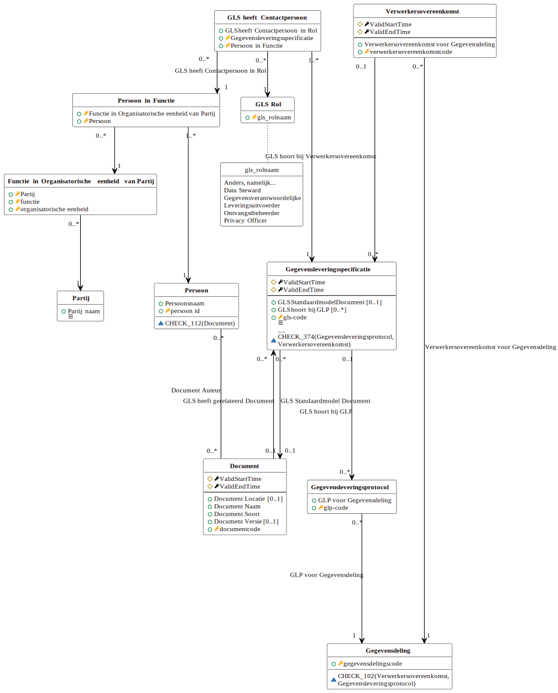

# Logische gegevensmodellen

## LGM Gegevensleveringsprotocol

## LGM Gegevensleveringsspecificatie

Vanwege de omvang van het logisch model gegevensleveringsspecificatie wordt het model hieropvolgend nogmaals weergegeven, opgesplitst in sub-modellen. Deze sub-modellen bevatten gezamenlijk alle informatie uit het bovenliggende model.

### Afspraken

### Classificaties

### Gegevenstypering

### Overig

