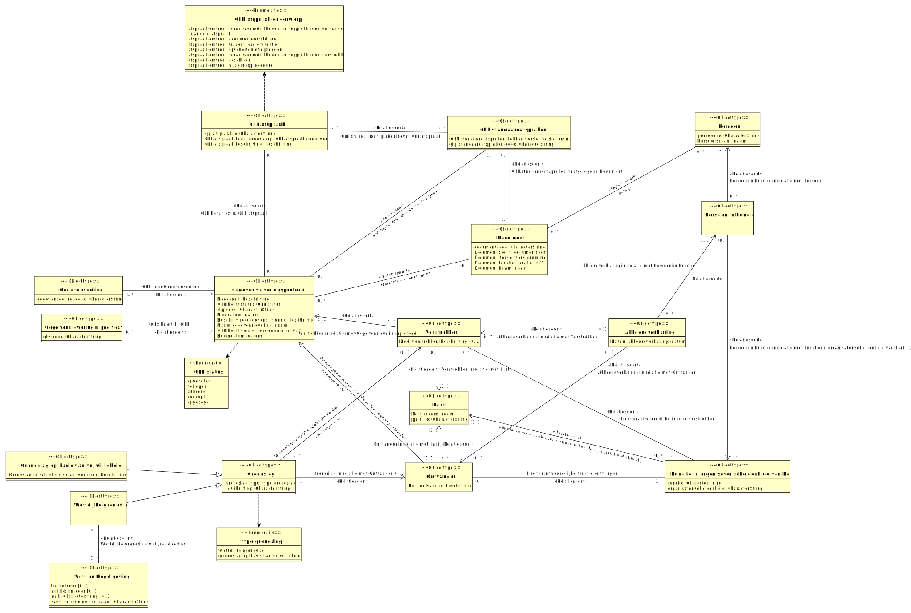

# CIM gegevensleveringsprotocol

- [Akkoordverklaring](#-kkoordverklaring)
- [Document](#-ocument)
- [Functie in organisatorische eenheid van Partij_2](#-unctie-in-organisatorische-eenheid-van-artij-2)
- [GLP afspraak](#-afspraak)
- [GLP standaardafspraken](#-standaardafspraken)
- [Gegevensdeling](#-egevensdeling)
- [Gegevensleveringsprotocol](#-egevensleveringsprotocol)
- [Gegevensleveringsspecificatie](#-egevensleveringsspecificatie)
- [Grondslag](#-rondslag)
  - [Grondslag op basis van vrijwilligheid](#-rondslag-op-basis-van-vrijwilligheid)
  - [Wettelijke grondslag](#-ettelijke-grondslag)
- [Ontvanger](#-ntvanger)
- [Partij](#-artij)
- [Persoon](#-ersoon)
- [Persoon in Functie](#-ersoon-in-unctie)
- [Verstrekker](#-erstrekker)
- [Wet- en Regelgeving](#-et-en-egelgeving)

## Akkoordverklaring {#-kkoordverklaring}

|{: .def}||
|-|-|
|Begrip|[Akkoordverklaring](#akkoordverklaring)|
|Toelichting|[Persoon in Functie](#TPersoon_in_Functie) verklaart namens [Verstrekker](#TVerstrekker) akkoord te gaan met de afspraken zoals gesteld in het GLP.; [Persoon in Functie](#TPersoon_in_Functie) verklaart namens [Ontvanger](#TOntvanger) akkoord te gaan met de afspraken zoals gesteld in het GLP.|
|Kenmerken|[Datum akkoordverklaring](#-atum-akkoordverklaring)|
|Rollen|[Akkoordverklaring in relatie met Ontvanger](#-kkoordverklaring-ntvanger), [Akkoordverklaring in relatie met Persoon in Functie](#-kkoordverklaring-ersoon-in-unctie), [Akkoordverklaring in relatie met Verstrekker](#-kkoordverklaring-erstrekker)|

### Datum akkoordverklaring {#-atum-akkoordverklaring}

|{: .def}||
|-|-|
|Toelichting|[Akkoordverklaring](#TAkkoordverklaring) is gedaan op [datum](#Tdatum)|
|Eigenschap van|[Akkoordverklaring](#-kkoordverklaring)|
|Type|[datum](#-datum)|

### Akkoordverklaring in relatie met Verstrekker {#-kkoordverklaring-erstrekker}

|{: .def}||
|-|-|
|Rol van|0..1 [Akkoordverklaring](#-kkoordverklaring)|
|Met|0..1 [Verstrekker](#-erstrekker)|

### Akkoordverklaring in relatie met Ontvanger {#-kkoordverklaring-ntvanger}

|{: .def}||
|-|-|
|Rol van|0..1 [Akkoordverklaring](#-kkoordverklaring)|
|Met|0..1 [Ontvanger](#-ntvanger)|

### Akkoordverklaring in relatie met Persoon in Functie {#-kkoordverklaring-ersoon-in-unctie}

|{: .def}||
|-|-|
|Rol van|0..* [Akkoordverklaring](#-kkoordverklaring)|
|Met|1..1 [Persoon in Functie](#-ersoon-in-unctie)|

## Document {#-ocument}

|{: .def}||
|-|-|
|Begrip|[Document](#document)|
|Kenmerken|[Document Locatie](#-ocument-ocatie), [Document Naam](#-ocument-aam), [Document Soort](#-ocument-oort), [Document Versie](#-ocument-ersie), [documentcode](#-ocument-documentcode)|
|Rollen|[Auteur](#-uteur)|
|Relatie met|[GLP standaardafspraken vastgelegd in Document](#-standaardafspraken-vastgelegd-in-ocument), [Gerelateerd document](#-erelateerd-document)|

### documentcode {#-ocument-documentcode}

|{: .def}||
|-|-|
|Eigenschap van|[Document](#-ocument)|
|Type|CharacterString|

### Document Soort {#-ocument-oort}

|{: .def}||
|-|-|
|Toelichting|[Document](#TDocument) is van het soort [documentsoort](#Tdocumentsoort)|
|Eigenschap van|[Document](#-ocument)|
|Type|[documentsoort](#-documentsoort)|

### Document Versie {#-ocument-ersie}

|{: .def}||
|-|-|
|Toelichting|[Document](#TDocument) heeft versie [versienummer](#Tversienummer)|
|Eigenschap van|[Document](#-ocument)|
|Type|[versienummer](#-versienummer)|

### Document Locatie {#-ocument-ocatie}

|{: .def}||
|-|-|
|Toelichting|[Document](#TDocument) is te vinden op [locatie](#Tlocatie)|
|Eigenschap van|[Document](#-ocument)|
|Type|[locatie](#-locatie)|

### Document Naam {#-ocument-aam}

|{: .def}||
|-|-|
|Toelichting|[Document](#TDocument) heet [naam](#Tnaam)|
|Eigenschap van|[Document](#-ocument)|
|Type|[naam](#-naam)|

### Auteur {#-uteur}

|{: .def}||
|-|-|
|Begrip|[Auteur](#auteur)|
|Toelichting|[Document](#TDocument) is opgesteld door [Persoon](#TPersoon)|
|Rol van|0..* [Document](#-ocument)|
|Met|0..* [Persoon](#-ersoon)|

## Functie in organisatorische eenheid van Partij_2 {#-unctie-in-organisatorische-eenheid-van-artij-2}

|{: .def}||
|-|-|
|Toelichting|[functie](#TFunctie_in_organisatorische_eenheid_van_Partij_2.functie) in [organisatorische eenheid](#TFunctie_in_organisatorische_eenheid_van_Partij_2.organisatorische_eenheid) van [Partij](#TPartij)|
|Kenmerken|[functie](#-unctie-in-organisatorische-eenheid-van-artij-2-functie), [organisatorische eenheid](#-unctie-in-organisatorische-eenheid-van-artij-2-organisatorische-eenheid)|
|Rollen|[Functie in organisatorische eenheid van Partij_2 in relatie met Partij](#-unctie-in-organisatorische-eenheid-van-artij-2-artij)|
|Relatie met|[Eindverantwoordelijke functie ontvanger](#-indverantwoordelijke-functie-ontvanger), [Eindverantwoordelijke functie verstrekker](#-indverantwoordelijke-functie-verstrekker), [Persoon in Functie in relatie met Functie in organisatorische eenheid van Partij_2](#-ersoon-in-unctie-unctie-in-organisatorische-eenheid-van-artij-2)|

### functie {#-unctie-in-organisatorische-eenheid-van-artij-2-functie}

|{: .def}||
|-|-|
|Begrip|[Functie](#functie)|
|Eigenschap van|[Functie in organisatorische eenheid van Partij_2](#-unctie-in-organisatorische-eenheid-van-artij-2)|
|Type|CharacterString|

### organisatorische eenheid {#-unctie-in-organisatorische-eenheid-van-artij-2-organisatorische-eenheid}

|{: .def}||
|-|-|
|Begrip|[Organisatorische eenheid](#organisatorische-eenheid)|
|Eigenschap van|[Functie in organisatorische eenheid van Partij_2](#-unctie-in-organisatorische-eenheid-van-artij-2)|
|Type|CharacterString|

### Functie in organisatorische eenheid van Partij_2 in relatie met Partij {#-unctie-in-organisatorische-eenheid-van-artij-2-artij}

|{: .def}||
|-|-|
|Rol van|0..* 0..* [Functie in organisatorische eenheid van Partij_2](#-unctie-in-organisatorische-eenheid-van-artij-2)|
|Met|1..1 [Partij](#-artij)|

## GLP afspraak {#-afspraak}

|{: .def}||
|-|-|
|Kenmerken|[GLP afspraak beschrijving](#-afspraak-beschrijving), [GLP afspraak heeft onderwerp](#-afspraak-heeft-onderwerp), [glp afspraak id](#-afspraak-glp-afspraak-id)|
|Relatie met|[GLP bevat extra GLP afspraak](#-bevat-extra-afspraak), [GLP standaardafspraken bevat GLP afspraak](#-standaardafspraken-bevat-afspraak)|

### glp afspraak id {#-afspraak-glp-afspraak-id}

|{: .def}||
|-|-|
|Eigenschap van|[GLP afspraak](#-afspraak)|
|Type|CharacterString|

### GLP afspraak heeft onderwerp {#-afspraak-heeft-onderwerp}

|{: .def}||
|-|-|
|Toelichting|[GLP afspraak](#TGLP_afspraak) gaat over [GLP afspraak onderwerp](#TGLP_afspraak_onderwerp)|
|Eigenschap van|[GLP afspraak](#-afspraak)|
|Type|[GLP afspraak onderwerp](#-afspraak-onderwerp)|
|Mogelijke waarden|afspraak omtrent documentdoelstelling; afspraak omtrent tussentijdse evaluatie; afspraak omtrent wijzigingsprocedure; afspraak omtrent verantwoordelijkheden en verplichtingen verstrekker; afspraak omtrent verantwoordelijkheden en verplichtingen ontvanger; afspraak omtrent geschillen; afspraak omtrent opschorten of opzeggen; financiële afspraak|

### GLP afspraak beschrijving {#-afspraak-beschrijving}

|{: .def}||
|-|-|
|Toelichting|[GLP afspraak](#TGLP_afspraak) is [beschrijving](#Tbeschrijving)|
|Eigenschap van|[GLP afspraak](#-afspraak)|
|Type|[beschrijving](#-beschrijving)|

## GLP standaardafspraken {#-standaardafspraken}

|{: .def}||
|-|-|
|Begrip|[GLP Standaardafspraken](#glp-standaardafspraken)|
|Kenmerken|[GLP standaardafspraken hebben versie](#-standaardafspraken-hebben-versie), [glp standaardafspraken code](#-standaardafspraken-glp-standaardafspraken-code)|
|Rollen|[GLP standaardafspraken bevat GLP afspraak](#-standaardafspraken-bevat-afspraak), [GLP standaardafspraken vastgelegd in Document](#-standaardafspraken-vastgelegd-in-ocument)|
|Relatie met|[GLP bevat GLP standaardafspraken](#-bevat-standaardafspraken)|

### GLP standaardafspraken hebben versie {#-standaardafspraken-hebben-versie}

|{: .def}||
|-|-|
|Toelichting|De verzameling [GLP standaardafspraken](#TGLP_standaardafspraken) heeft versie [versienummer](#Tversienummer)|
|Eigenschap van|[GLP standaardafspraken](#-standaardafspraken)|
|Type|[versienummer](#-versienummer)|

### glp standaardafspraken code {#-standaardafspraken-glp-standaardafspraken-code}

|{: .def}||
|-|-|
|Eigenschap van|[GLP standaardafspraken](#-standaardafspraken)|
|Type|CharacterString|

### GLP standaardafspraken bevat GLP afspraak {#-standaardafspraken-bevat-afspraak}

|{: .def}||
|-|-|
|Toelichting|De verzameling [GLP standaardafspraken](#TGLP_standaardafspraken) bevat [GLP afspraak](#TGLP_afspraak)|
|Rol van|0..* [GLP standaardafspraken](#-standaardafspraken)|
|Met|1..* [GLP afspraak](#-afspraak)|

### GLP standaardafspraken vastgelegd in Document {#-standaardafspraken-vastgelegd-in-ocument}

|{: .def}||
|-|-|
|Toelichting|de bron van [GLP standaardafspraken](#TGLP_standaardafspraken) is [Document](#TDocument)|
|Rol van|0..* [GLP standaardafspraken](#-standaardafspraken)|
|Met|1..* [Document](#-ocument)|

## Gegevensdeling {#-egevensdeling}

|{: .def}||
|-|-|
|Begrip|[Gegevensdeling](#gegevensdeling)|
|Kenmerken|[gegevensdelingscode](#-egevensdeling-gegevensdelingscode)|
|Rollen|[GLP voor Gegevensdeling](#-voor-egevensdeling)|

### gegevensdelingscode {#-egevensdeling-gegevensdelingscode}

|{: .def}||
|-|-|
|Eigenschap van|[Gegevensdeling](#-egevensdeling)|
|Type|CharacterString|

### GLP voor Gegevensdeling {#-voor-egevensdeling}

|{: .def}||
|-|-|
|Toelichting|[Gegevensleveringsprotocol](#TGegevensleveringsprotocol) beschrijft de juridische en organisatorische afspraken voor [Gegevensdeling](#TGegevensdeling)|
|Rol van|1..* [Gegevensdeling](#-egevensdeling)|
|Met|0..* [Gegevensleveringsprotocol](#-egevensleveringsprotocol)|

## Gegevensleveringsprotocol {#-egevensleveringsprotocol}

|{: .def}||
|-|-|
|Begrip|[Gegevensleveringsprotocol](#gegevensleveringsprotocol)|
|Toelichting|er is een GLP met GLP-code [glp-code](#TGegevensleveringsprotocol.glp-code)|
|Kenmerken|[Begindatum](#-egindatum), [Beschrijving gegevenslevering](#-eschrijving-gegevenslevering), [Einddatum](#-inddatum), [GLP heeft status](#-heeft-status), [GLP heeft versie](#-heeft-versie), [Naam gegevenslevering](#-aam-gegevenslevering), [Noodzaak](#-oodzaak), [glp-code](#-egevensleveringsprotocol-glp-code)|
|Rollen|[GLP bevat GLP standaardafspraken](#-bevat-standaardafspraken), [GLP bevat extra GLP afspraak](#-bevat-extra-afspraak), [Gerelateerd document](#-erelateerd-document)|
|Relatie met|[GLP voor Gegevensdeling](#-voor-egevensdeling), [GLS hoort bij GLP](#-hoort-bij-), [Ontvanger in relatie met Gegevensleveringsprotocol](#-ntvanger-egevensleveringsprotocol), [Verstrekker in relatie met Gegevensleveringsprotocol](#-erstrekker-egevensleveringsprotocol)|

### Noodzaak {#-oodzaak}

|{: .def}||
|-|-|
|Begrip|[Noodzaak](#noodzaak)|
|Toelichting|de beoordeling ten behoeve van [Gegevensleveringsprotocol](#TGegevensleveringsprotocol) waarom de gegevens voor het bepaalde doel nodig zijn en of daadwerkelijk alle gegevens nodig zijn is [beschrijving](#Tbeschrijving)|
|Eigenschap van|[Gegevensleveringsprotocol](#-egevensleveringsprotocol)|
|Type|[beschrijving](#-beschrijving)|

### GLP heeft status {#-heeft-status}

|{: .def}||
|-|-|
|Toelichting|de status van [Gegevensleveringsprotocol](#TGegevensleveringsprotocol) is [GLP status](#TGLP_status)|
|Eigenschap van|[Gegevensleveringsprotocol](#-egevensleveringsprotocol)|
|Type|[GLP status](#-status)|
|Mogelijke waarden|opgezegd; concept; akkoord; verlopen; opgeschort|

### glp-code {#-egevensleveringsprotocol-glp-code}

|{: .def}||
|-|-|
|Begrip|[GLP-code](#glp-code)|
|Eigenschap van|[Gegevensleveringsprotocol](#-egevensleveringsprotocol)|
|Type|CharacterString|

### Einddatum {#-inddatum}

|{: .def}||
|-|-|
|Toelichting|de afspraken conform [Gegevensleveringsprotocol](#TGegevensleveringsprotocol) lopen ten einde na [datum](#Tdatum)|
|Eigenschap van|[Gegevensleveringsprotocol](#-egevensleveringsprotocol)|
|Type|[datum](#-datum)|

### Beschrijving gegevenslevering {#-eschrijving-gegevenslevering}

|{: .def}||
|-|-|
|Toelichting|de gegevensdeling waarvoor [Gegevensleveringsprotocol](#TGegevensleveringsprotocol) de afspraken vastlegt heeft betrekking op [beschrijving](#Tbeschrijving)|
|Eigenschap van|[Gegevensleveringsprotocol](#-egevensleveringsprotocol)|
|Type|[beschrijving](#-beschrijving)|

### Naam gegevenslevering {#-aam-gegevenslevering}

|{: .def}||
|-|-|
|Toelichting|de naam van de gegevensdeling ten behoeve van [Gegevensleveringsprotocol](#TGegevensleveringsprotocol) is [naam](#Tnaam)|
|Eigenschap van|[Gegevensleveringsprotocol](#-egevensleveringsprotocol)|
|Type|[naam](#-naam)|

### GLP heeft versie {#-heeft-versie}

|{: .def}||
|-|-|
|Toelichting|[Gegevensleveringsprotocol](#TGegevensleveringsprotocol) heeft versie [versienummer](#Tversienummer)|
|Eigenschap van|[Gegevensleveringsprotocol](#-egevensleveringsprotocol)|
|Type|[versienummer](#-versienummer)|

### Begindatum {#-egindatum}

|{: .def}||
|-|-|
|Toelichting|de afspraken conform [Gegevensleveringsprotocol](#TGegevensleveringsprotocol) gaan van start op [datum](#Tdatum)|
|Eigenschap van|[Gegevensleveringsprotocol](#-egevensleveringsprotocol)|
|Type|[datum](#-datum)|

### GLP bevat GLP standaardafspraken {#-bevat-standaardafspraken}

|{: .def}||
|-|-|
|Toelichting|In [Gegevensleveringsprotocol](#TGegevensleveringsprotocol) worden [GLP standaardafspraken](#TGLP_standaardafspraken) afgesproken|
|Rol van|0..* [Gegevensleveringsprotocol](#-egevensleveringsprotocol)|
|Met|1..* [GLP standaardafspraken](#-standaardafspraken)|

### GLP bevat extra GLP afspraak {#-bevat-extra-afspraak}

|{: .def}||
|-|-|
|Toelichting|In [Gegevensleveringsprotocol](#TGegevensleveringsprotocol) wordt naast de opgenomen standaardafspraken [GLP afspraak](#TGLP_afspraak) afgesproken|
|Rol van|0..* [Gegevensleveringsprotocol](#-egevensleveringsprotocol)|
|Met|0..* [GLP afspraak](#-afspraak)|

### Gerelateerd document {#-erelateerd-document}

|{: .def}||
|-|-|
|Toelichting|[Gegevensleveringsprotocol](#TGegevensleveringsprotocol) hangt samen met [Document](#TDocument)|
|Rol van|0..* [Gegevensleveringsprotocol](#-egevensleveringsprotocol)|
|Met|0..* [Document](#-ocument)|

## Gegevensleveringsspecificatie {#-egevensleveringsspecificatie}

|{: .def}||
|-|-|
|Begrip|[Gegevensleveringsspecificatie](#gegevensleveringsspecificatie)|
|Toelichting|[gls-code](#TGegevensleveringsspecificatie.gls-code)|
|Kenmerken|[gls-code](#-egevensleveringsspecificatie-gls-code)|
|Rollen|[GLS hoort bij GLP](#-hoort-bij-)|

### gls-code {#-egevensleveringsspecificatie-gls-code}

|{: .def}||
|-|-|
|Begrip|[GLS-code](#gls-code)|
|Eigenschap van|[Gegevensleveringsspecificatie](#-egevensleveringsspecificatie)|
|Type|CharacterString|

### GLS hoort bij GLP {#-hoort-bij-}

|{: .def}||
|-|-|
|Toelichting|[Gegevensleveringsspecificatie](#TGegevensleveringsspecificatie) specificeert de technische en semantische eigenschappen die van toepassing zijn op de gegevensdeling ten behoeve van [Gegevensleveringsprotocol](#TGegevensleveringsprotocol)|
|Rol van|0..* [Gegevensleveringsspecificatie](#-egevensleveringsspecificatie)|
|Met|0..* [Gegevensleveringsprotocol](#-egevensleveringsprotocol)|

## Grondslag {#-rondslag}

|{: .def}||
|-|-|
|Begrip|[Grondslag](#grondslag)|
|Subtype(s)|[Wettelijke grondslag](#-ettelijke-grondslag), [Grondslag op basis van vrijwilligheid](#-rondslag-op-basis-van-vrijwilligheid)|
|Toelichting|de grondslag van [Ontvanger](#TOntvanger) is [beschrijving](#Tbeschrijving); de grondslag van [Verstrekker](#TVerstrekker) is [beschrijving](#Tbeschrijving)|
|Kenmerken|[Grondslag type](#-rondslag-type), [beschrijving](#-rondslag-beschrijving)|
|Rollen|[Grondslag in relatie met Ontvanger](#-rondslag-ntvanger), [Grondslag in relatie met Verstrekker](#-rondslag-erstrekker)|

### Grondslag type {#-rondslag-type}

|{: .def}||
|-|-|
|Toelichting|[Grondslag](#TGrondslag) is van het type [type grondslag](#Ttype_grondslag)|
|Eigenschap van|[Grondslag](#-rondslag)|
|Type|[type grondslag](#-type-grondslag)|
|Mogelijke waarden|wettelijke grondslag; grondslag op basis van vrijwilligheid|

### beschrijving {#-rondslag-beschrijving}

|{: .def}||
|-|-|
|Eigenschap van|[Grondslag](#-rondslag)|
|Type|CharacterString|

### Grondslag in relatie met Ontvanger {#-rondslag-ntvanger}

|{: .def}||
|-|-|
|Rol van|1..* [Grondslag](#-rondslag)|
|Met|0..1 [Ontvanger](#-ntvanger)|

### Grondslag in relatie met Verstrekker {#-rondslag-erstrekker}

|{: .def}||
|-|-|
|Rol van|1..* [Grondslag](#-rondslag)|
|Met|0..1 [Verstrekker](#-erstrekker)|

## Grondslag op basis van vrijwilligheid {#-rondslag-op-basis-van-vrijwilligheid}

|{: .def}||
|-|-|
|Begrip|[Grondslag op basis van vrijwilligheid](#grondslag-op-basis-van-vrijwilligheid)|
|Supertype|[Grondslag](#-rondslag)|
|Kenmerken|[Grondslag vrijwilligheid verantwoording](#-rondslag-vrijwilligheid-verantwoording)|

### Grondslag vrijwilligheid verantwoording {#-rondslag-vrijwilligheid-verantwoording}

|{: .def}||
|-|-|
|Begrip|[Grondslag vrijwilligheid verantwoording](#grondslag-vrijwilligheid-verantwoording)|
|Toelichting|de verantwoording dat bij [Grondslag op basis van vrijwilligheid](#TGrondslag_op_basis_van_vrijwilligheid) geen beperkingen zijn op basis van wet- en regelgeving is [beschrijving](#Tbeschrijving)|
|Eigenschap van|[Grondslag op basis van vrijwilligheid](#-rondslag-op-basis-van-vrijwilligheid)|
|Type|[beschrijving](#-beschrijving)|

## Ontvanger {#-ntvanger}

|{: .def}||
|-|-|
|Begrip|[Ontvanger](#ontvanger)|
|Toelichting|[Partij](#TPartij) vervult de rol van ontvanger in de gegevensdeling ten behoeve van [Gegevensleveringsprotocol](#TGegevensleveringsprotocol)|
|Kenmerken|[Doel ontvanger](#-oel-ontvanger)|
|Rollen|[Eindverantwoordelijke functie ontvanger](#-indverantwoordelijke-functie-ontvanger), [Ontvanger in relatie met Gegevensleveringsprotocol](#-ntvanger-egevensleveringsprotocol), [Ontvanger in relatie met Partij](#-ntvanger-artij)|
|Relatie met|[Akkoordverklaring in relatie met Ontvanger](#-kkoordverklaring-ntvanger), [Grondslag in relatie met Ontvanger](#-rondslag-ntvanger)|

### Doel ontvanger {#-oel-ontvanger}

|{: .def}||
|-|-|
|Begrip|[Doel ontvanger](#doel-ontvanger)|
|Toelichting|hetgeen dat [Ontvanger](#TOntvanger) met de gegevens uit de gegevensdeling probeert te realiseren is [beschrijving](#Tbeschrijving)|
|Eigenschap van|[Ontvanger](#-ntvanger)|
|Type|[beschrijving](#-beschrijving)|

### Ontvanger in relatie met Gegevensleveringsprotocol {#-ntvanger-egevensleveringsprotocol}

|{: .def}||
|-|-|
|Rol van|1..1 [Ontvanger](#-ntvanger)|
|Met|1..1 [Gegevensleveringsprotocol](#-egevensleveringsprotocol)|

### Eindverantwoordelijke functie ontvanger {#-indverantwoordelijke-functie-ontvanger}

|{: .def}||
|-|-|
|Toelichting|de eindverantwoordelijkheid namens [Ontvanger](#TOntvanger) ligt bij [Functie in organisatorische eenheid van Partij_2](#TFunctie_in_organisatorische_eenheid_van_Partij_2)|
|Rol van|0..* [Ontvanger](#-ntvanger)|
|Met|1..* [Functie in organisatorische eenheid van Partij_2](#-unctie-in-organisatorische-eenheid-van-artij-2)|

### Ontvanger in relatie met Partij {#-ntvanger-artij}

|{: .def}||
|-|-|
|Rol van|0..* [Ontvanger](#-ntvanger)|
|Met|1..1 [Partij](#-artij)|

## Partij {#-artij}

|{: .def}||
|-|-|
|Begrip|[Partij](#partij)|
|Toelichting|Partij [partij id](#TPartij.partij_id) bestaat|
|Kenmerken|[Partij naam](#-artij-naam), [partij id](#-artij-partij-id)|
|Relatie met|[Functie in organisatorische eenheid van Partij_2 in relatie met Partij](#-unctie-in-organisatorische-eenheid-van-artij-2-artij), [Ontvanger in relatie met Partij](#-ntvanger-artij), [Verstrekker in relatie met Partij](#-erstrekker-artij)|

### Partij naam {#-artij-naam}

|{: .def}||
|-|-|
|Toelichting|[Partij](#TPartij) heet [naam](#Tnaam)|
|Eigenschap van|[Partij](#-artij)|
|Type|[naam](#-naam)|

### partij id {#-artij-partij-id}

|{: .def}||
|-|-|
|Eigenschap van|[Partij](#-artij)|
|Type|CharacterString|

## Persoon {#-ersoon}

|{: .def}||
|-|-|
|Toelichting|Er is een persoon [persoon id](#TPersoon.persoon_id)|
|Kenmerken|[Persoonsnaam](#-ersoonsnaam), [persoon id](#-ersoon-persoon-id)|
|Relatie met|[Auteur](#-uteur), [Persoon in Functie in relatie met Persoon](#-ersoon-in-unctie-ersoon)|

### persoon id {#-ersoon-persoon-id}

|{: .def}||
|-|-|
|Eigenschap van|[Persoon](#-ersoon)|
|Type|CharacterString|

### Persoonsnaam {#-ersoonsnaam}

|{: .def}||
|-|-|
|Toelichting|[Persoon](#TPersoon) heet [naam](#Tnaam); [naam](#Tnaam) is de naam van [Persoon](#TPersoon)|
|Eigenschap van|[Persoon](#-ersoon)|
|Type|[naam](#-naam)|

## Persoon in Functie {#-ersoon-in-unctie}

|{: .def}||
|-|-|
|Toelichting|[Persoon](#TPersoon) bekleedt [Functie in organisatorische eenheid van Partij_2](#TFunctie_in_organisatorische_eenheid_van_Partij_2)|
|Rollen|[Persoon in Functie in relatie met Functie in organisatorische eenheid van Partij_2](#-ersoon-in-unctie-unctie-in-organisatorische-eenheid-van-artij-2), [Persoon in Functie in relatie met Persoon](#-ersoon-in-unctie-ersoon)|
|Relatie met|[Akkoordverklaring in relatie met Persoon in Functie](#-kkoordverklaring-ersoon-in-unctie)|

### Persoon in Functie in relatie met Persoon {#-ersoon-in-unctie-ersoon}

|{: .def}||
|-|-|
|Rol van|0..* [Persoon in Functie](#-ersoon-in-unctie)|
|Met|1..1 [Persoon](#-ersoon)|

### Persoon in Functie in relatie met Functie in organisatorische eenheid van Partij_2 {#-ersoon-in-unctie-unctie-in-organisatorische-eenheid-van-artij-2}

|{: .def}||
|-|-|
|Rol van|0..* [Persoon in Functie](#-ersoon-in-unctie)|
|Met|1..1 [Functie in organisatorische eenheid van Partij_2](#-unctie-in-organisatorische-eenheid-van-artij-2)|

## Verstrekker {#-erstrekker}

|{: .def}||
|-|-|
|Begrip|[Verstrekker](#verstrekker)|
|Toelichting|[Partij](#TPartij) vervult de rol van verstrekker in de gegevensdeling ten behoeve van [Gegevensleveringsprotocol](#TGegevensleveringsprotocol)|
|Kenmerken|[Doel verstrekker](#-oel-verstrekker)|
|Rollen|[Eindverantwoordelijke functie verstrekker](#-indverantwoordelijke-functie-verstrekker), [Verstrekker in relatie met Gegevensleveringsprotocol](#-erstrekker-egevensleveringsprotocol), [Verstrekker in relatie met Partij](#-erstrekker-artij)|
|Relatie met|[Akkoordverklaring in relatie met Verstrekker](#-kkoordverklaring-erstrekker), [Grondslag in relatie met Verstrekker](#-rondslag-erstrekker)|

### Doel verstrekker {#-oel-verstrekker}

|{: .def}||
|-|-|
|Begrip|[Doel verstrekker](#doel-verstrekker)|
|Toelichting|hetgeen dat [Verstrekker](#TVerstrekker) met de gegevens uit de gegevensdeling probeert te realiseren is [beschrijving](#Tbeschrijving)|
|Eigenschap van|[Verstrekker](#-erstrekker)|
|Type|[beschrijving](#-beschrijving)|

### Verstrekker in relatie met Partij {#-erstrekker-artij}

|{: .def}||
|-|-|
|Rol van|0..* [Verstrekker](#-erstrekker)|
|Met|1..1 [Partij](#-artij)|

### Verstrekker in relatie met Gegevensleveringsprotocol {#-erstrekker-egevensleveringsprotocol}

|{: .def}||
|-|-|
|Rol van|1..1 [Verstrekker](#-erstrekker)|
|Met|1..1 [Gegevensleveringsprotocol](#-egevensleveringsprotocol)|

### Eindverantwoordelijke functie verstrekker {#-indverantwoordelijke-functie-verstrekker}

|{: .def}||
|-|-|
|Toelichting|de eindverantwoordelijkheid namens [Verstrekker](#TVerstrekker) ligt bij [Functie in organisatorische eenheid van Partij_2](#TFunctie_in_organisatorische_eenheid_van_Partij_2)|
|Rol van|0..* [Verstrekker](#-erstrekker)|
|Met|1..* [Functie in organisatorische eenheid van Partij_2](#-unctie-in-organisatorische-eenheid-van-artij-2)|

## Wet- en Regelgeving {#-et-en-egelgeving}

|{: .def}||
|-|-|
|Toelichting|[wet- en regelgeving naam](#TWet-_en_Regelgeving.wet-_en_regelgeving_naam)|
|Kenmerken|[artikel](#-et-en-egelgeving-artikel), [lid](#-et-en-egelgeving-lid), [sub](#-et-en-egelgeving-sub), [wet- en regelgeving naam](#-et-en-egelgeving-wet-en-regelgeving-naam)|
|Relatie met|[Wettelijke grondslag wet-/regelgeving](#-ettelijke-grondslag-wet-regelgeving)|

### lid {#-et-en-egelgeving-lid}

|{: .def}||
|-|-|
|Eigenschap van|[Wet- en Regelgeving](#-et-en-egelgeving)|
|Type|Integer|

### artikel {#-et-en-egelgeving-artikel}

|{: .def}||
|-|-|
|Eigenschap van|[Wet- en Regelgeving](#-et-en-egelgeving)|
|Type|Integer|

### sub {#-et-en-egelgeving-sub}

|{: .def}||
|-|-|
|Eigenschap van|[Wet- en Regelgeving](#-et-en-egelgeving)|
|Type|CharacterString|

### wet- en regelgeving naam {#-et-en-egelgeving-wet-en-regelgeving-naam}

|{: .def}||
|-|-|
|Eigenschap van|[Wet- en Regelgeving](#-et-en-egelgeving)|
|Type|CharacterString|

## Wettelijke grondslag {#-ettelijke-grondslag}

|{: .def}||
|-|-|
|Begrip|[Wettelijke grondslag](#wettelijke-grondslag)|
|Supertype|[Grondslag](#-rondslag)|
|Rollen|[Wettelijke grondslag wet-/regelgeving](#-ettelijke-grondslag-wet-regelgeving)|

### Wettelijke grondslag wet-/regelgeving {#-ettelijke-grondslag-wet-regelgeving}

|{: .def}||
|-|-|
|Toelichting|[Wettelijke grondslag](#TWettelijke_grondslag) is op basis van [Wet- en Regelgeving](#TWet-_en_Regelgeving)|
|Rol van|0..* [Wettelijke grondslag](#-ettelijke-grondslag)|
|Met|1..* [Wet- en Regelgeving](#-et-en-egelgeving)|

## Waardetypering en referentielijsten

### beschrijving {#-beschrijving}

|{: .def}||
|-|-|
|Gebaseerd op|CharacterString|

### datum {#-datum}

|{: .def}||
|-|-|

### documentsoort {#-documentsoort}

|{: .def}||
|-|-|
|Gebaseerd op|CharacterString|

### locatie {#-locatie}

|{: .def}||
|-|-|
|Gebaseerd op|CharacterString|

### naam {#-naam}

|{: .def}||
|-|-|
|Gebaseerd op|CharacterString|

### versienummer {#-versienummer}

|{: .def}||
|-|-|
|Begrip|[Versienummer](#versienummer)|
|Gebaseerd op|CharacterString|

### GLP afspraak onderwerp {#-afspraak-onderwerp}

De volgende waarden zijn mogelijk:
- [afspraak omtrent documentdoelstelling](#afspraak-omtrent-documentdoelstelling)
- [afspraak omtrent geschillen](#afspraak-omtrent-geschillen)
- [afspraak omtrent opschorten of opzeggen](#afspraak-omtrent-opschorten-of-opzeggen)
- [afspraak omtrent tussentijdse evaluatie](#afspraak-omtrent-tussentijdse-evaluatie)
- [afspraak omtrent verantwoordelijkheden en verplichtingen ontvanger](#afspraak-omtrent-verantwoordelijkheden-en-verplichtingen-ontvanger)
- [afspraak omtrent verantwoordelijkheden en verplichtingen verstrekker](#afspraak-omtrent-verantwoordelijkheden-en-verplichtingen-verstrekker)
- [afspraak omtrent wijzigingsprocedure](#afspraak-omtrent-wijzigingsprocedure)
- [financiële afspraak](#financi-le-afspraak)

### GLP status {#-status}

De volgende waarden zijn mogelijk:
- [akkoord](#akkoord)
- [concept](#concept)
- [opgeschort](#opgeschort)
- [opgezegd](#opgezegd)
- [verlopen](#verlopen)

### type grondslag {#-type-grondslag}

De volgende waarden zijn mogelijk:
- [grondslag op basis van vrijwilligheid](#grondslag-op-basis-van-vrijwilligheid)
- [wettelijke grondslag](#wettelijke-grondslag)

