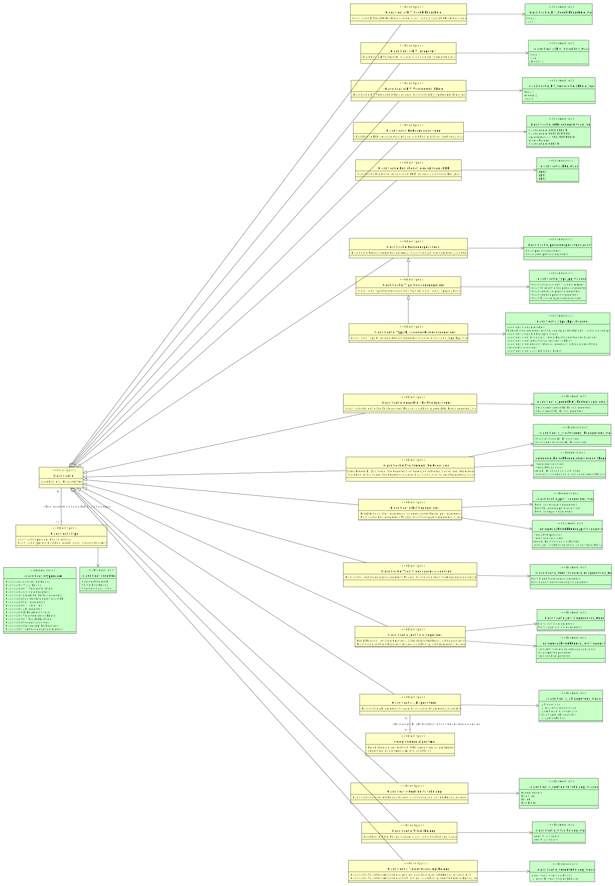

# CIM gegevensclassificaties

- [Classificatie](#TClassificatie)
  - [Classificatie AKI-gegevens](#TClassificatie-AKI-gegevens)
  - [Classificatie BIV Beschikbaarheid](#TClassificatie-BIV-Beschikbaarheid)
  - [Classificatie BIV Integriteit](#TClassificatie-BIV-Integriteit)
  - [Classificatie BIV Vertrouwelijkheid](#TClassificatie-BIV-Vertrouwelijkheid)
  - [Classificatie Basisbeveiligingsniveau (BBN)](#TClassificatie-Basisbeveiligingsniveau-BBN)
  - [Classificatie Continuïteitsbelang](#TClassificatie-Continu-teitsbelang)
  - [Classificatie Gerechtelijke Strafgegevens](#TClassificatie-Gerechtelijke-Strafgegevens)
  - [Classificatie Justitiële Gegevens](#TClassificatie-Justiti-le-Gegevens)
  - [Classificatie Persoonsgegevens](#TClassificatie-Persoonsgegevens)
    - [Classificatie Type Persoonsgegevens](#TClassificatie-Type-Persoonsgegevens)
      - [Classificatie Type Bijzondere Persoonsgegevens](#TClassificatie-Type-Bijzondere-Persoonsgegevens)
  - [Classificatie Politiegegevens](#TClassificatie-Politiegegevens)
  - [Classificatie Rubriceringsniveau](#TClassificatie-Rubriceringsniveau)
  - [Classificatie Strafvorderlijke Gegevens](#TClassificatie-Strafvorderlijke-Gegevens)
  - [Classificatie Tenuitvoerleggingsgegevens](#TClassificatie-Tenuitvoerleggingsgegevens)
  - [Classificatie Verantwoordingsbelang](#TClassificatie-Verantwoordingsbelang)
  - [Classificatie Vitaal Belang](#TClassificatie-Vitaal-Belang)
- [Classificatietype](#TClassificatietype)
- [Geregistreerd Algoritme](#TGeregistreerd-Algoritme)

## Classificatie {#TClassificatie}

|{: .def}||
|-|-|
|Begrip|[Classificatie](#classificatie)|
|Subtype(s)|[Classificatie Strafvorderlijke Gegevens](#TClassificatie-Strafvorderlijke-Gegevens), [Classificatie BIV Beschikbaarheid](#TClassificatie-BIV-Beschikbaarheid), [Classificatie Vitaal Belang](#TClassificatie-Vitaal-Belang), [Classificatie Politiegegevens](#TClassificatie-Politiegegevens), [Classificatie BIV Integriteit](#TClassificatie-BIV-Integriteit), [Classificatie Persoonsgegevens](#TClassificatie-Persoonsgegevens), [Classificatie Basisbeveiligingsniveau (BBN)](#TClassificatie-Basisbeveiligingsniveau-BBN), [Classificatie Justitiële Gegevens](#TClassificatie-Justiti-le-Gegevens), [Classificatie BIV Vertrouwelijkheid](#TClassificatie-BIV-Vertrouwelijkheid), [Classificatie Rubriceringsniveau](#TClassificatie-Rubriceringsniveau), [Classificatie Verantwoordingsbelang](#TClassificatie-Verantwoordingsbelang), [Classificatie AKI-gegevens](#TClassificatie-AKI-gegevens), [Classificatie Continuïteitsbelang](#TClassificatie-Continu-teitsbelang), [Classificatie Gerechtelijke Strafgegevens](#TClassificatie-Gerechtelijke-Strafgegevens), [Classificatie Tenuitvoerleggingsgegevens](#TClassificatie-Tenuitvoerleggingsgegevens)|
|Kenmerken|[classificatie id](#TClassificatie-classificatie-id)|
|Rollen|[Classificatie heeft classificatietype](#TClassificatie-heeft-classificatietype)|

### classificatie id {#TClassificatie-classificatie-id}

|{: .def}||
|-|-|
|Eigenschap van|[Classificatie](#TClassificatie)|
|Type|CharacterString|

### Classificatie heeft classificatietype {#TClassificatie-heeft-classificatietype}

|{: .def}||
|-|-|
|Rol van|0..* [Classificatie](#TClassificatie)|
|Met|0..* [Classificatietype](#TClassificatietype)|

## Classificatie AKI-gegevens {#TClassificatie-AKI-gegevens}

|{: .def}||
|-|-|
|Begrip|[Classificatie AKI-gegevens](#classificatie-aki-gegevens)|
|Supertype|[Classificatie](#TClassificatie)|
|Kenmerken|[Classificatie AKI-gegevens waarde](#TClassificatie-AKI-gegevens-waarde)|
|Rollen|[Bij AKI-Classificatie hoort Geregistreerd Algoritme](#TBij-AKI-Classificatie-hoort-Geregistreerd-Algoritme)|

### Classificatie AKI-gegevens waarde {#TClassificatie-AKI-gegevens-waarde}

|{: .def}||
|-|-|
|Eigenschap van|[Classificatie AKI-gegevens](#TClassificatie-AKI-gegevens)|
|Type|[classificatie_akigegevens_waarde](#Tclassificatie-akigegevens-waarde)|
|Mogelijke waarden|ja, onaanvaardbaar risico; bevat geen AKI-gegevens; ja, minimaal of geen risico; ja, hoog risico; ja, specifiek risico|

### Bij AKI-Classificatie hoort Geregistreerd Algoritme {#TBij-AKI-Classificatie-hoort-Geregistreerd-Algoritme}

|{: .def}||
|-|-|
|Rol van|0..* [Classificatie AKI-gegevens](#TClassificatie-AKI-gegevens)|
|Met|0..* [Geregistreerd Algoritme](#TGeregistreerd-Algoritme)|

## Classificatie BIV Beschikbaarheid {#TClassificatie-BIV-Beschikbaarheid}

|{: .def}||
|-|-|
|Begrip|[Classificatie BIV Beschikbaarheid](#classificatie-biv-beschikbaarheid)|
|Supertype|[Classificatie](#TClassificatie)|
|Kenmerken|[Classificatie BIV Beschikbaarheid waarde](#TClassificatie-BIV-Beschikbaarheid-waarde)|

### Classificatie BIV Beschikbaarheid waarde {#TClassificatie-BIV-Beschikbaarheid-waarde}

|{: .def}||
|-|-|
|Eigenschap van|[Classificatie BIV Beschikbaarheid](#TClassificatie-BIV-Beschikbaarheid)|
|Type|[classificatie_biv_beschikbaarheid_waarde](#Tclassificatie-biv-beschikbaarheid-waarde)|
|Mogelijke waarden|laag-1; hoog-3; midden-2|

## Classificatie BIV Integriteit {#TClassificatie-BIV-Integriteit}

|{: .def}||
|-|-|
|Begrip|[Classificatie BIV Integriteit](#classificatie-biv-integriteit)|
|Supertype|[Classificatie](#TClassificatie)|
|Kenmerken|[Classificatie BIV Integriteit waarde](#TClassificatie-BIV-Integriteit-waarde)|

### Classificatie BIV Integriteit waarde {#TClassificatie-BIV-Integriteit-waarde}

|{: .def}||
|-|-|
|Eigenschap van|[Classificatie BIV Integriteit](#TClassificatie-BIV-Integriteit)|
|Type|[classificatie_biv_integriteit_waarde](#Tclassificatie-biv-integriteit-waarde)|
|Mogelijke waarden|laag-1; midden-2; hoog-3|

## Classificatie BIV Vertrouwelijkheid {#TClassificatie-BIV-Vertrouwelijkheid}

|{: .def}||
|-|-|
|Begrip|[Classificatie BIV Vertrouwelijkheid](#classificatie-biv-vertrouwelijkheid)|
|Supertype|[Classificatie](#TClassificatie)|
|Kenmerken|[Classificatie BIV Vertrouwelijkheid waarde](#TClassificatie-BIV-Vertrouwelijkheid-waarde)|

### Classificatie BIV Vertrouwelijkheid waarde {#TClassificatie-BIV-Vertrouwelijkheid-waarde}

|{: .def}||
|-|-|
|Eigenschap van|[Classificatie BIV Vertrouwelijkheid](#TClassificatie-BIV-Vertrouwelijkheid)|
|Type|[classificatie_biv_vertrouwelijkheid_waarde](#Tclassificatie-biv-vertrouwelijkheid-waarde)|
|Mogelijke waarden|midden-2; laag-1; hoog-3|

## Classificatie Basisbeveiligingsniveau (BBN) {#TClassificatie-Basisbeveiligingsniveau-BBN}

|{: .def}||
|-|-|
|Begrip|[Classificatie Basisbeveiligingsniveau (BBN)](#classificatie-basisbeveiligingsniveau-bbn)|
|Supertype|[Classificatie](#TClassificatie)|
|Kenmerken|[Classificatie Basisbeveiligingsniveau (BBN) waarde](#TClassificatie-Basisbeveiligingsniveau-BBN-waarde)|

### Classificatie Basisbeveiligingsniveau (BBN) waarde {#TClassificatie-Basisbeveiligingsniveau-BBN-waarde}

|{: .def}||
|-|-|
|Eigenschap van|[Classificatie Basisbeveiligingsniveau (BBN)](#TClassificatie-Basisbeveiligingsniveau-BBN)|
|Type|[classificatie_bbn_waarde](#Tclassificatie-bbn-waarde)|
|Mogelijke waarden|BBN1; BBN3; BBN2|

## Classificatie Continuïteitsbelang {#TClassificatie-Continu-teitsbelang}

|{: .def}||
|-|-|
|Begrip|[Classificatie Continuïteitsbelang](#classificatie-continuiteitsbelang)|
|Supertype|[Classificatie](#TClassificatie)|
|Kenmerken|[Classificatie Continuïteitsbelang waarde](#TClassificatie-Continu-teitsbelang-waarde)|

### Classificatie Continuïteitsbelang waarde {#TClassificatie-Continu-teitsbelang-waarde}

|{: .def}||
|-|-|
|Eigenschap van|[Classificatie Continuïteitsbelang](#TClassificatie-Continu-teitsbelang)|
|Type|[classificatie_continuiteitsbelang_waarde](#Tclassificatie-continuiteitsbelang-waarde)|
|Mogelijke waarden|Essentieel; Niet kritiek; Kritiek; Ondersteunend|

## Classificatie Gerechtelijke Strafgegevens {#TClassificatie-Gerechtelijke-Strafgegevens}

|{: .def}||
|-|-|
|Begrip|[Classificatie Gerechtelijke Strafgegevens](#classificatie-gerechtelijke-strafgegevens)|
|Supertype|[Classificatie](#TClassificatie)|
|Kenmerken|[Classificatie Gerechtelijke Strafgegevens Waarde](#TClassificatie-Gerechtelijke-Strafgegevens-Waarde)|

### Classificatie Gerechtelijke Strafgegevens Waarde {#TClassificatie-Gerechtelijke-Strafgegevens-Waarde}

|{: .def}||
|-|-|
|Eigenschap van|[Classificatie Gerechtelijke Strafgegevens](#TClassificatie-Gerechtelijke-Strafgegevens)|
|Type|[classificatie_gerechtelijkestrafgegevens_waarde](#Tclassificatie-gerechtelijkestrafgegevens-waarde)|
|Mogelijke waarden|bevat geen gerechtelijke strafgegevens; bevat gerechtelijke strafgegevens|

## Classificatie Justitiële Gegevens {#TClassificatie-Justiti-le-Gegevens}

|{: .def}||
|-|-|
|Begrip|[Classificatie Justitiële gegevens](#classificatie-justitiele-gegevens)|
|Supertype|[Classificatie](#TClassificatie)|
|Kenmerken|[Betrokkenen bij Justitiële Gegevens](#TBetrokkenen-bij-Justiti-le-Gegevens), [Classificatie Justitiële Gegevens waarde](#TClassificatie-Justiti-le-Gegevens-waarde)|

### Betrokkenen bij Justitiële Gegevens {#TBetrokkenen-bij-Justiti-le-Gegevens}

|{: .def}||
|-|-|
|Begrip|[Betrokkenen bij justitiële gegevens](#betrokkenen-bij-justitiele-gegevens)|
|Eigenschap van|[Classificatie Justitiële Gegevens](#TClassificatie-Justiti-le-Gegevens)|
|Type|[categorie_betrokkenen_justitiegegevens](#Tcategorie-betrokkenen-justitiegegevens)|
|Mogelijke waarden|van rechtsvervolging ontslagen personen; vrijgesproken personen; veroordeelde personen|

### Classificatie Justitiële Gegevens waarde {#TClassificatie-Justiti-le-Gegevens-waarde}

|{: .def}||
|-|-|
|Eigenschap van|[Classificatie Justitiële Gegevens](#TClassificatie-Justiti-le-Gegevens)|
|Type|[classificatie_justitiegegevens_waarde](#Tclassificatie-justitiegegevens-waarde)|
|Mogelijke waarden|bevat geen justitiële gegevens; bevat justitiële gegevens|

## Classificatie Persoonsgegevens {#TClassificatie-Persoonsgegevens}

|{: .def}||
|-|-|
|Begrip|[Classificatie Persoonsgegevens](#classificatie-persoonsgegevens)|
|Supertype|[Classificatie](#TClassificatie)|
|Subtype(s)|[Classificatie Type Persoonsgegevens](#TClassificatie-Type-Persoonsgegevens)|
|Kenmerken|[Classificatie Persoonsgegevens Aanwezig](#TClassificatie-Persoonsgegevens-Aanwezig)|

### Classificatie Persoonsgegevens Aanwezig {#TClassificatie-Persoonsgegevens-Aanwezig}

|{: .def}||
|-|-|
|Eigenschap van|[Classificatie Persoonsgegevens](#TClassificatie-Persoonsgegevens)|
|Type|[classificatie_persoonsgegevens_aanwezig](#Tclassificatie-persoonsgegevens-aanwezig)|
|Mogelijke waarden|bevat persoonsgegevens; bevat geen persoonsgegevens|

## Classificatie Politiegegevens {#TClassificatie-Politiegegevens}

|{: .def}||
|-|-|
|Begrip|[Classificatie Politiegegevens](#classificatie-politiegegevens)|
|Supertype|[Classificatie](#TClassificatie)|
|Kenmerken|[Betrokkenen bij Politiegegevens](#TBetrokkenen-bij-Politiegegevens), [Classificatie Politiegegevens Waarde](#TClassificatie-Politiegegevens-Waarde)|

### Betrokkenen bij Politiegegevens {#TBetrokkenen-bij-Politiegegevens}

|{: .def}||
|-|-|
|Begrip|[Betrokkenen bij politiegegevens](#betrokkenen-bij-politiegegevens)|
|Eigenschap van|[Classificatie Politiegegevens](#TClassificatie-Politiegegevens)|
|Type|[categorie_betrokkenen_politiegegevens](#Tcategorie-betrokkenen-politiegegevens)|
|Mogelijke waarden|verdachte personen; veroordeelde daders; getuigen, informanten of contacten verdachten/daders; mogelijke of huidige slachtoffers|

### Classificatie Politiegegevens Waarde {#TClassificatie-Politiegegevens-Waarde}

|{: .def}||
|-|-|
|Eigenschap van|[Classificatie Politiegegevens](#TClassificatie-Politiegegevens)|
|Type|[classificatie_politiegegevens_waarde](#Tclassificatie-politiegegevens-waarde)|
|Mogelijke waarden|bevat bijzondere politiegegevens; bevat geen politiegegevens; bevat gewone politiegegevens|

## Classificatie Rubriceringsniveau {#TClassificatie-Rubriceringsniveau}

|{: .def}||
|-|-|
|Begrip|[Classificatie Rubriceringsniveau](#classificatie-rubriceringsniveau)|
|Supertype|[Classificatie](#TClassificatie)|
|Kenmerken|[Classificatie Rubriceringsniveau waarde](#TClassificatie-Rubriceringsniveau-waarde)|

### Classificatie Rubriceringsniveau waarde {#TClassificatie-Rubriceringsniveau-waarde}

|{: .def}||
|-|-|
|Eigenschap van|[Classificatie Rubriceringsniveau](#TClassificatie-Rubriceringsniveau)|
|Type|[classificatie_rubriceringsniveau_waarde](#Tclassificatie-rubriceringsniveau-waarde)|
|Mogelijke waarden|staatsgeheim GEHEIM; departementaal VERTROUWELIJK; staatsgeheim ZEER GEHEIM; ongerubriceerd; staatsgeheim CONFIDENTIEEL|

## Classificatie Strafvorderlijke Gegevens {#TClassificatie-Strafvorderlijke-Gegevens}

|{: .def}||
|-|-|
|Begrip|[Classificatie Strafvorderlijke gegevens](#classificatie-strafvorderlijke-gegevens)|
|Supertype|[Classificatie](#TClassificatie)|
|Kenmerken|[Betrokkenen bij Strafvorderlijke Gegevens](#TBetrokkenen-bij-Strafvorderlijke-Gegevens), [Classificatie Strafvorderlijke Gegevens waarde](#TClassificatie-Strafvorderlijke-Gegevens-waarde)|

### Betrokkenen bij Strafvorderlijke Gegevens {#TBetrokkenen-bij-Strafvorderlijke-Gegevens}

|{: .def}||
|-|-|
|Begrip|[Betrokkenen bij strafvorderlijke gegevens](#betrokkenen-bij-strafvorderlijke-gegevens)|
|Eigenschap van|[Classificatie Strafvorderlijke Gegevens](#TClassificatie-Strafvorderlijke-Gegevens)|
|Type|[categorie_betrokkenen_strafvorderlijkegegevens](#Tcategorie-betrokkenen-strafvorderlijkegegevens)|
|Mogelijke waarden|verdachte personen; veroordeelde daders; mogelijke of huidige slachtoffers; getuigen, informanten of contacten verdachten/daders|

### Classificatie Strafvorderlijke Gegevens waarde {#TClassificatie-Strafvorderlijke-Gegevens-waarde}

|{: .def}||
|-|-|
|Eigenschap van|[Classificatie Strafvorderlijke Gegevens](#TClassificatie-Strafvorderlijke-Gegevens)|
|Type|[classificatie_strafvorderlijkegegevens_waarde](#Tclassificatie-strafvorderlijkegegevens-waarde)|
|Mogelijke waarden|bevat geen strafvorderlijke gegevens; bevat strafvorderlijke gegevens|

## Classificatie Tenuitvoerleggingsgegevens {#TClassificatie-Tenuitvoerleggingsgegevens}

|{: .def}||
|-|-|
|Begrip|[Classificatie Tenuitvoerleggingsgegevens](#classificatie-tenuitvoerleggingsgegevens)|
|Supertype|[Classificatie](#TClassificatie)|
|Kenmerken|[Classificatie Tenuitvoerleggingsgegevens Waarde](#TClassificatie-Tenuitvoerleggingsgegevens-Waarde)|

### Classificatie Tenuitvoerleggingsgegevens Waarde {#TClassificatie-Tenuitvoerleggingsgegevens-Waarde}

|{: .def}||
|-|-|
|Eigenschap van|[Classificatie Tenuitvoerleggingsgegevens](#TClassificatie-Tenuitvoerleggingsgegevens)|
|Type|[classificatie_tenuitvoerleggingsgegevens_waarde](#Tclassificatie-tenuitvoerleggingsgegevens-waarde)|
|Mogelijke waarden|bevat tenuitvoerleggingsgegevens; bevat geen tenuitvoerleggingsgegevens|

## Classificatie Type Bijzondere Persoonsgegevens {#TClassificatie-Type-Bijzondere-Persoonsgegevens}

|{: .def}||
|-|-|
|Supertype|[Classificatie Type Persoonsgegevens](#TClassificatie-Type-Persoonsgegevens)|
|Kenmerken|[Classificatie Type Bijzondere Persoonsgegevens waarde](#TClassificatie-Type-Bijzondere-Persoonsgegevens-waarde)|

### Classificatie Type Bijzondere Persoonsgegevens waarde {#TClassificatie-Type-Bijzondere-Persoonsgegevens-waarde}

|{: .def}||
|-|-|
|Eigenschap van|[Classificatie Type Bijzondere Persoonsgegevens](#TClassificatie-Type-Bijzondere-Persoonsgegevens)|
|Type|[classificatie_type_bpg_waarde](#Tclassificatie-type-bpg-waarde)|
|Mogelijke waarden|gegevens over iemands seksueel gedrag of seksuele gerichtheid; gegevens over politieke opvattingen; gegevens over religieuze of levensbeschouwelijke overtuigingen; gegevens over lidmaatschap van een vakbond; gegevens over ras of etnische afkomst; biometrische gegevens met het oog op de unieke identificatie van een persoon; genetische gegevens; gegevens over gezondheid|

## Classificatie Type Persoonsgegevens {#TClassificatie-Type-Persoonsgegevens}

|{: .def}||
|-|-|
|Begrip|[Classificatie type persoonsgegevens](#classificatie-type-persoonsgegevens)|
|Supertype|[Classificatie Persoonsgegevens](#TClassificatie-Persoonsgegevens)|
|Subtype(s)|[Classificatie Type Bijzondere Persoonsgegevens](#TClassificatie-Type-Bijzondere-Persoonsgegevens)|
|Kenmerken|[Classificatie Type Persoonsgegevens Waarde](#TClassificatie-Type-Persoonsgegevens-Waarde)|

### Classificatie Type Persoonsgegevens Waarde {#TClassificatie-Type-Persoonsgegevens-Waarde}

|{: .def}||
|-|-|
|Eigenschap van|[Classificatie Type Persoonsgegevens](#TClassificatie-Type-Persoonsgegevens)|
|Type|[classificatie_type_pg_waarde](#Tclassificatie-type-pg-waarde)|
|Mogelijke waarden|bevat gevoelige persoonsgegevens; bevat strafrechtelijke persoonsgegevens; bevat nationale identificatienummers; bevat gewone persoonsgegevens; bevat bijzondere persoonsgegevens|

## Classificatie Verantwoordingsbelang {#TClassificatie-Verantwoordingsbelang}

|{: .def}||
|-|-|
|Begrip|[Classificatie Verantwoordingsbelang](#classificatie-verantwoordingsbelang)|
|Supertype|[Classificatie](#TClassificatie)|
|Kenmerken|[Classificatie Verantwoordingsbelang heeft context](#TClassificatie-Verantwoordingsbelang-heeft-context), [Classificatie Verantwoordingsbelang waarde](#TClassificatie-Verantwoordingsbelang-waarde)|

### Classificatie Verantwoordingsbelang waarde {#TClassificatie-Verantwoordingsbelang-waarde}

|{: .def}||
|-|-|
|Eigenschap van|[Classificatie Verantwoordingsbelang](#TClassificatie-Verantwoordingsbelang)|
|Type|[classificatie_verantwbelang_waarde](#Tclassificatie-verantwbelang-waarde)|
|Mogelijke waarden|ja, moet tijdelijk worden bewaard; ja, moet blijvend worden bewaard; geen verantwoordingsbelang; ja, de termijn is afhankelijk van de context|

### Classificatie Verantwoordingsbelang heeft context {#TClassificatie-Verantwoordingsbelang-heeft-context}

|{: .def}||
|-|-|
|Eigenschap van|[Classificatie Verantwoordingsbelang](#TClassificatie-Verantwoordingsbelang)|
|Type|[classificatie_verantwoordingsbelang_context](#Tclassificatie-verantwoordingsbelang-context)|

## Classificatie Vitaal Belang {#TClassificatie-Vitaal-Belang}

|{: .def}||
|-|-|
|Begrip|[Classificatie Vitaal Belang](#classificatie-vitaal-belang)|
|Supertype|[Classificatie](#TClassificatie)|
|Kenmerken|[Classificatie Vitaal Belang waarde](#TClassificatie-Vitaal-Belang-waarde)|

### Classificatie Vitaal Belang waarde {#TClassificatie-Vitaal-Belang-waarde}

|{: .def}||
|-|-|
|Eigenschap van|[Classificatie Vitaal Belang](#TClassificatie-Vitaal-Belang)|
|Type|[classificatie_vitaalbelang_waarde](#Tclassificatie-vitaalbelang-waarde)|
|Mogelijke waarden|een vitaal belang; geen vitaal belang|

## Classificatietype {#TClassificatietype}

|{: .def}||
|-|-|
|Begrip|[Classificatietype](#classificatietype)|
|Kenmerken|[Classificatietype van Classificatiesoort](#TClassificatietype-van-Classificatiesoort), [classificatietypenaam](#TClassificatietype-classificatietypenaam)|
|Relatie met|[Classificatie heeft classificatietype](#TClassificatie-heeft-classificatietype)|

### classificatietypenaam {#TClassificatietype-classificatietypenaam}

|{: .def}||
|-|-|
|Eigenschap van|[Classificatietype](#TClassificatietype)|
|Type|CharacterString|

### Classificatietype van Classificatiesoort {#TClassificatietype-van-Classificatiesoort}

|{: .def}||
|-|-|
|Eigenschap van|[Classificatietype](#TClassificatietype)|
|Type|[classificatiesoortnaam](#Tclassificatiesoortnaam)|
|Mogelijke waarden|Verwerkingsbelang; Gegevensclassificatie; Gegevenskenmerk|

## Geregistreerd Algoritme {#TGeregistreerd-Algoritme}

|{: .def}||
|-|-|
|Begrip|[Geregistreerd algoritme](#geregistreerd-algoritme)|
|Kenmerken|[Geregistreerd Algoritme heeft URL](#TGeregistreerd-Algoritme-heeft-URL), [geregistreerdalgoritmenaam](#TGeregistreerd-Algoritme-geregistreerdalgoritmenaam)|
|Relatie met|[Bij AKI-Classificatie hoort Geregistreerd Algoritme](#TBij-AKI-Classificatie-hoort-Geregistreerd-Algoritme)|

### Geregistreerd Algoritme heeft URL {#TGeregistreerd-Algoritme-heeft-URL}

|{: .def}||
|-|-|
|Eigenschap van|[Geregistreerd Algoritme](#TGeregistreerd-Algoritme)|
|Type|[geregistreerdalgoritmeurl](#Tgeregistreerdalgoritmeurl)|

### geregistreerdalgoritmenaam {#TGeregistreerd-Algoritme-geregistreerdalgoritmenaam}

|{: .def}||
|-|-|
|Eigenschap van|[Geregistreerd Algoritme](#TGeregistreerd-Algoritme)|
|Type|CharacterString|

## Waardetypering en referentielijsten

### classificatie_verantwoordingsbelang_context {#Tclassificatie-verantwoordingsbelang-context}

|{: .def}||
|-|-|
|Gebaseerd op|CharacterString|

### geregistreerdalgoritmeurl {#Tgeregistreerdalgoritmeurl}

|{: .def}||
|-|-|
|Gebaseerd op|CharacterString|

### categorie_betrokkenen_justitiegegevens {#Tcategorie-betrokkenen-justitiegegevens}

De volgende waarden zijn mogelijk:
- [van rechtsvervolging ontslagen personen](#betrokkenen-bij-justitiele-gegevens-van-rechtsvervolging-ontslagen-personen)
- [veroordeelde personen](#betrokkenen-bij-justitiele-gegevens-veroordeelde-personen)
- [vrijgesproken personen](#betrokkenen-bij-justitiele-gegevens-vrijgesproken-personen)

### categorie_betrokkenen_politiegegevens {#Tcategorie-betrokkenen-politiegegevens}

De volgende waarden zijn mogelijk:
- [getuigen, informanten of contacten verdachten/daders](#betrokkenen-bij-politiegegevens-getuigen-informanten-of-contacten-van-verdachte-en-of-dader-s)
- [mogelijke of huidige slachtoffers](#betrokkenen-bij-politiegegevens-mogelijke-of-huidige-slachtoffers)
- [verdachte personen](#betrokkenen-bij-politiegegevens-verdachte-personen)
- [veroordeelde daders](#betrokkenen-bij-politiegegevens-veroordeelde-dader-s)

### categorie_betrokkenen_strafvorderlijkegegevens {#Tcategorie-betrokkenen-strafvorderlijkegegevens}

De volgende waarden zijn mogelijk:
- [getuigen, informanten of contacten verdachten/daders](#betrokkenen-bij-strafvorderlijke-gegevens-getuigen-informanten-of-contacten-van-verdachte-en-of-dader-s)
- [mogelijke of huidige slachtoffers](#betrokkenen-bij-strafvorderlijke-gegevens-mogelijke-of-huidige-slachtoffers)
- [verdachte personen](#betrokkenen-bij-strafvorderlijke-gegevens-verdachte-personen)
- [veroordeelde daders](#betrokkenen-bij-strafvorderlijke-gegevens-veroordeelde-dader-s)

### classificatie_akigegevens_waarde {#Tclassificatie-akigegevens-waarde}

De volgende waarden zijn mogelijk:
- [bevat geen AKI-gegevens](#aki-gegevens-bevat-geen-aki-gegevens)
- [ja, hoog risico](#aki-gegevens-ja-hoog-risico)
- [ja, minimaal of geen risico](#aki-gegevens-ja-minimaal-of-geen-risico)
- [ja, onaanvaardbaar risico](#aki-gegevens-ja-onaanvaardbaar-risico)
- [ja, specifiek risico](#aki-gegevens-ja-specifiek-risico)

### classificatie_bbn_waarde {#Tclassificatie-bbn-waarde}

De volgende waarden zijn mogelijk:
- [BBN1](#basis-beveiligings-niveau-bbn1)
- [BBN2](#basis-beveiligings-niveau-bbn2)
- [BBN3](#basis-beveiligings-niveau-bbn3)

### classificatie_biv_beschikbaarheid_waarde {#Tclassificatie-biv-beschikbaarheid-waarde}

De volgende waarden zijn mogelijk:
- [hoog-3](#biv-classificatie-beschikbaarheid-hoog)
- [laag-1](#biv-classificatie-beschikbaarheid-laag)
- [midden-2](#biv-classificatie-beschikbaarheid-midden)

### classificatie_biv_integriteit_waarde {#Tclassificatie-biv-integriteit-waarde}

De volgende waarden zijn mogelijk:
- [hoog-3](#biv-classificatie-integriteit-hoog)
- [laag-1](#biv-classificatie-integriteit-laag)
- [midden-2](#biv-classificatie-integriteit-midden)

### classificatie_biv_vertrouwelijkheid_waarde {#Tclassificatie-biv-vertrouwelijkheid-waarde}

De volgende waarden zijn mogelijk:
- [hoog-3](#biv-classificatie-vertrouwelijkheid-hoog)
- [laag-1](#biv-classificatie-vertrouwelijkheid-laag)
- [midden-2](#biv-classificatie-vertrouwelijkheid-midden)

### classificatie_continuiteitsbelang_waarde {#Tclassificatie-continuiteitsbelang-waarde}

De volgende waarden zijn mogelijk:
- [Essentieel](#continuiteitsbelang-essentieel)
- [Kritiek](#continuiteitsbelang-kritiek)
- [Niet kritiek](#continuiteitsbelang-niet-kritiek)
- [Ondersteunend](#continuiteitsbelang-ondersteunend)

### classificatie_gerechtelijkestrafgegevens_waarde {#Tclassificatie-gerechtelijkestrafgegevens-waarde}

De volgende waarden zijn mogelijk:
- [bevat geen gerechtelijke strafgegevens](#gerechtelijke-strafgegevens-bevat-geen-gerechtelijke-strafgegevens)
- [bevat gerechtelijke strafgegevens](#gerechtelijke-strafgegevens-bevat-gerechtelijke-strafgegevens)

### classificatie_justitiegegevens_waarde {#Tclassificatie-justitiegegevens-waarde}

De volgende waarden zijn mogelijk:
- [bevat geen justitiële gegevens](#justitiele-gegevens-bevat-geen-justitiele-gegevens)
- [bevat justitiële gegevens](#justitiele-gegevens-bevat-justitiele-gegevens)

### classificatie_persoonsgegevens_aanwezig {#Tclassificatie-persoonsgegevens-aanwezig}

De volgende waarden zijn mogelijk:
- [bevat geen persoonsgegevens](#persoonsgegevens-aanwezig-bevat-geen-persoonsgegevens)
- [bevat persoonsgegevens](#persoonsgegevens-aanwezig-bevat-persoonsgegevens)

### classificatie_politiegegevens_waarde {#Tclassificatie-politiegegevens-waarde}

De volgende waarden zijn mogelijk:
- [bevat bijzondere politiegegevens](#politiegegevens-bevat-bijzondere-politiegegevens)
- [bevat geen politiegegevens](#politiegegevens-bevat-geen-politiegegevens)
- [bevat gewone politiegegevens](#politiegegevens-bevat-gewone-politiegegevens)

### classificatie_rubriceringsniveau_waarde {#Tclassificatie-rubriceringsniveau-waarde}

De volgende waarden zijn mogelijk:
- [departementaal VERTROUWELIJK](#rubriceringsniveau-departementaal-vertrouwelijk-dep-v)
- [ongerubriceerd](#rubriceringsniveau-ongerubriceerd)
- [staatsgeheim CONFIDENTIEEL](#rubriceringsniveau-staatsgeheim-confidentieel-stg-c)
- [staatsgeheim GEHEIM](#rubriceringsniveau-staatsgeheim-geheim-stg-g)
- [staatsgeheim ZEER GEHEIM](#rubriceringsniveau-staatsgeheim-zeer-geheim-stg-zg)

### classificatie_strafvorderlijkegegevens_waarde {#Tclassificatie-strafvorderlijkegegevens-waarde}

De volgende waarden zijn mogelijk:
- [bevat geen strafvorderlijke gegevens](#strafvorderlijke-gegevens-bevat-geen-strafvorderlijke-gegevens)
- [bevat strafvorderlijke gegevens](#strafvorderlijke-gegevens-bevat-strafvorderlijke-gegevens)

### classificatie_tenuitvoerleggingsgegevens_waarde {#Tclassificatie-tenuitvoerleggingsgegevens-waarde}

De volgende waarden zijn mogelijk:
- [bevat geen tenuitvoerleggingsgegevens](#tenuitvoerleggingsgegevens-bevat-geen-tenuitvoerleggingsgegevens)
- [bevat tenuitvoerleggingsgegevens](#tenuitvoerleggingsgegevens-bevat-tenuitvoerleggingsgegevens)

### classificatie_type_bpg_waarde {#Tclassificatie-type-bpg-waarde}

De volgende waarden zijn mogelijk:
- [biometrische gegevens met het oog op de unieke identificatie van een persoon](#type-bijzondere-persoonsgegevens-biometrische-gegevens-met-het-oog-op-de-unieke-identificatie-van-een-persoon)
- [gegevens over gezondheid](#type-bijzondere-persoonsgegevens-gegevens-over-gezondheid)
- [gegevens over iemands seksueel gedrag of seksuele gerichtheid](#type-bijzondere-persoonsgegevens-gegevens-over-iemands-seksueel-gedrag-of-seksuele-gerichtheid)
- [gegevens over lidmaatschap van een vakbond](#type-bijzondere-persoonsgegevens-gegevens-over-lidmaatschap-van-een-vakbond)
- [gegevens over politieke opvattingen](#type-bijzondere-persoonsgegevens-gegevens-over-politieke-opvattingen)
- [gegevens over ras of etnische afkomst](#type-bijzondere-persoonsgegevens-gegevens-over-ras-of-etnische-afkomst)
- [gegevens over religieuze of levensbeschouwelijke overtuigingen](#type-bijzondere-persoonsgegevens-gegevens-over-religieuze-of-levensbeschouwelijke-overtuigingen)
- [genetische gegevens](#type-bijzondere-persoonsgegevens-genetische-gegevens)

### classificatie_type_pg_waarde {#Tclassificatie-type-pg-waarde}

De volgende waarden zijn mogelijk:
- [bevat bijzondere persoonsgegevens](#type-persoonsgegevens-bevat-bijzondere-persoonsgegevens)
- [bevat gevoelige persoonsgegevens](#type-persoonsgegevens-bevat-gevoelige-persoonsgegevens)
- [bevat gewone persoonsgegevens](#type-persoonsgegevens-bevat-gewone-persoonsgegevens)
- [bevat nationale identificatienummers](#type-persoonsgegevens-bevat-nationale-identificatienummers)
- [bevat strafrechtelijke persoonsgegevens](#type-persoonsgegevens-bevat-strafrechtelijke-persoonsgegevens)

### classificatie_verantwbelang_waarde {#Tclassificatie-verantwbelang-waarde}

De volgende waarden zijn mogelijk:
- [geen verantwoordingsbelang](#verantwoordingsbelang-geen-verantwoordingsbelang)
- [ja, de termijn is afhankelijk van de context](#verantwoordingsbelang-ja-de-termijn-is-afhankelijk-van-de-context)
- [ja, moet blijvend worden bewaard](#verantwoordingsbelang-ja-moet-blijvend-worden-bewaard)
- [ja, moet tijdelijk worden bewaard](#verantwoordingsbelang-ja-moet-tijdelijk-worden-bewaard)

### classificatie_vitaalbelang_waarde {#Tclassificatie-vitaalbelang-waarde}

De volgende waarden zijn mogelijk:
- [een vitaal belang](#vitaal-belang-vitaal-belang)
- [geen vitaal belang](#vitaal-belang-geen-vitaal-belang)

### classificatiesoortnaam {#Tclassificatiesoortnaam}

De volgende waarden zijn mogelijk:
- [Gegevensclassificatie](#gegevensclassificatieclassificatiesoort-gegevensclassificatie)
- [Gegevenskenmerk](#classificatiesoort-gegevenskenmerk)
- [Verwerkingsbelang](#classificatiesoort-verwerkingsbelangverwerkingsbelang)

### classificatietypenaam {#Tclassificatietypenaam}

De volgende waarden zijn mogelijk:
- [Classificatie AKI-gegevens](#classificatie-aki-gegevens)
- [Classificatie BIV Beschikbaarheid](#classificatie-biv-beschikbaarheid)
- [Classificatie BIV Integriteit](#classificatie-biv-integriteit)
- [Classificatie BIV Vertrouwelijkheid](#classificatie-biv-vertrouwelijkheid)
- [Classificatie Basisbeveiligingsniveau (BBN)](#classificatie-basisbeveiligingsniveau-bbn)
- [Classificatie Continuïteitsbelang](#classificatie-continuiteitsbelang)
- [Classificatie Gerechtelijke Strafgegevens](#classificatie-gerechtelijke-strafgegevens)
- [Classificatie Justitiële Gegevens](#classificatie-justitiele-gegevens)
- [Classificatie Persoonsgegevens](#classificatie-persoonsgegevens)
- [Classificatie Politiegegevens](#classificatie-politiegegevens)
- [Classificatie Rubriceringsniveau](#classificatie-rubriceringsniveau)
- [Classificatie Strafvorderlijke Gegevens](#classificatie-strafvorderlijke-gegevens)
- [Classificatie Tenuitvoerleggingsgegevens](#classificatie-tenuitvoerleggingsgegevens)
- [Classificatie Verantwoordingsbelang](#classificatie-verantwoordingsbelang)
- [Classificatie Vitaal Belang](#classificatie-vitaal-belang)

