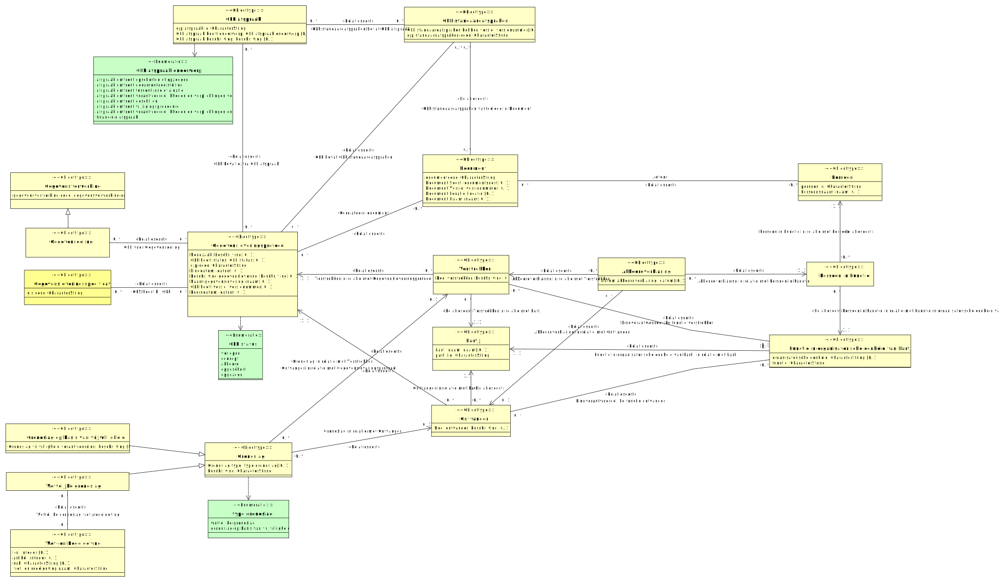

# CIM gegevensleveringsprotocol

- [Akkoordverklaring](#TAkkoordverklaring)
- [Document](#TDocument)
- [Functie in organisatorische eenheid van Partij](#TFunctie-in-organisatorische-eenheid-van-Partij)
- [GLP afspraak](#TGLP-afspraak)
- [GLP standaardafspraken](#TGLP-standaardafspraken)
- [Gegevensleveringsprotocol](#TGegevensleveringsprotocol)
- [Gegevensleveringsspecificatie](#TGegevensleveringsspecificatie)
- [Gegevensverwerking](#TGegevensverwerking)
  - [Gegevensdeling](#TGegevensdeling)
- [Grondslag](#TGrondslag)
  - [Grondslag op basis van vrijwilligheid](#TGrondslag-op-basis-van-vrijwilligheid)
  - [Wettelijke grondslag](#TWettelijke-grondslag)
- [Ontvanger](#TOntvanger)
- [Partij](#TPartij)
- [Persoon](#TPersoon)
- [Persoon in Functie](#TPersoon-in-Functie)
- [Verstrekker](#TVerstrekker)
- [Wet- en Regelgeving](#TWet-en-Regelgeving)

## Akkoordverklaring {#TAkkoordverklaring}

|{: .def}||
|-|-|
|Begrip|[Akkoordverklaring](#akkoordverklaring)|
|Kenmerken|[Datum akkoordverklaring](#TDatum-akkoordverklaring)|
|Rollen|[Akkoordverklaring in relatie met Ontvanger](#TAkkoordverklaring-Ontvanger), [Akkoordverklaring in relatie met Persoon in Functie](#TAkkoordverklaring-Persoon-in-Functie), [Akkoordverklaring in relatie met Verstrekker](#TAkkoordverklaring-Verstrekker)|

### Datum akkoordverklaring {#TDatum-akkoordverklaring}

|{: .def}||
|-|-|
|Eigenschap van|[Akkoordverklaring](#TAkkoordverklaring)|
|Type|[datum](#Tdatum)|

### Akkoordverklaring in relatie met Verstrekker {#TAkkoordverklaring-Verstrekker}

|{: .def}||
|-|-|
|Rol van|0..* [Akkoordverklaring](#TAkkoordverklaring)|
|Met|0..1 [Verstrekker](#TVerstrekker)|

### Akkoordverklaring in relatie met Ontvanger {#TAkkoordverklaring-Ontvanger}

|{: .def}||
|-|-|
|Rol van|0..* [Akkoordverklaring](#TAkkoordverklaring)|
|Met|0..1 [Ontvanger](#TOntvanger)|

### Akkoordverklaring in relatie met Persoon in Functie {#TAkkoordverklaring-Persoon-in-Functie}

|{: .def}||
|-|-|
|Rol van|0..* [Akkoordverklaring](#TAkkoordverklaring)|
|Met|1..1 [Persoon in Functie](#TPersoon-in-Functie)|

## Document {#TDocument}

|{: .def}||
|-|-|
|Begrip|[Document](#document)|
|Kenmerken|[Document Locatie](#TDocument-Locatie), [Document Naam](#TDocument-Naam), [Document Soort](#TDocument-Soort), [Document Versie](#TDocument-Versie), [documentcode](#TDocument-documentcode)|
|Rollen|[Auteur](#TAuteur)|
|Relatie met|[GLP standaardafspraken vastgelegd in Document](#TGLP-standaardafspraken-vastgelegd-in-Document), [Gerelateerd document](#TGerelateerd-document)|

### documentcode {#TDocument-documentcode}

|{: .def}||
|-|-|
|Eigenschap van|[Document](#TDocument)|
|Type|CharacterString|

### Document Soort {#TDocument-Soort}

|{: .def}||
|-|-|
|Eigenschap van|[Document](#TDocument)|
|Type|[documentsoort](#Tdocumentsoort)|

### Document Versie {#TDocument-Versie}

|{: .def}||
|-|-|
|Eigenschap van|[Document](#TDocument)|
|Type|[versienummer](#Tversienummer)|

### Document Locatie {#TDocument-Locatie}

|{: .def}||
|-|-|
|Eigenschap van|[Document](#TDocument)|
|Type|[locatie](#Tlocatie)|

### Document Naam {#TDocument-Naam}

|{: .def}||
|-|-|
|Eigenschap van|[Document](#TDocument)|
|Type|[naam](#Tnaam)|

### Auteur {#TAuteur}

|{: .def}||
|-|-|
|Begrip|[Auteur](#auteur)|
|Rol van|0..* [Document](#TDocument)|
|Met|0..* [Persoon](#TPersoon)|

## Functie in organisatorische eenheid van Partij {#TFunctie-in-organisatorische-eenheid-van-Partij}

|{: .def}||
|-|-|
|Kenmerken|[functie](#TFunctie-in-organisatorische-eenheid-van-Partij-functie), [organisatorische eenheid](#TFunctie-in-organisatorische-eenheid-van-Partij-organisatorische-eenheid)|
|Rollen|[Functie in organisatorische eenheid van Partij in relatie met Partij](#TFunctie-in-organisatorische-eenheid-van-Partij-Partij)|
|Relatie met|[Eindverantwoordelijke functie ontvanger](#TEindverantwoordelijke-functie-ontvanger), [Eindverantwoordelijke functie verstrekker](#TEindverantwoordelijke-functie-verstrekker), [Persoon in Functie in relatie met Functie in organisatorische eenheid van Partij](#TPersoon-in-Functie-Functie-in-organisatorische-eenheid-van-Partij)|

### organisatorische eenheid {#TFunctie-in-organisatorische-eenheid-van-Partij-organisatorische-eenheid}

|{: .def}||
|-|-|
|Begrip|[Organisatorische eenheid](#organisatorische-eenheid)|
|Eigenschap van|[Functie in organisatorische eenheid van Partij](#TFunctie-in-organisatorische-eenheid-van-Partij)|
|Type|CharacterString|

### functie {#TFunctie-in-organisatorische-eenheid-van-Partij-functie}

|{: .def}||
|-|-|
|Begrip|[Functie](#functie)|
|Eigenschap van|[Functie in organisatorische eenheid van Partij](#TFunctie-in-organisatorische-eenheid-van-Partij)|
|Type|CharacterString|

### Functie in organisatorische eenheid van Partij in relatie met Partij {#TFunctie-in-organisatorische-eenheid-van-Partij-Partij}

|{: .def}||
|-|-|
|Rol van|0..* [Functie in organisatorische eenheid van Partij](#TFunctie-in-organisatorische-eenheid-van-Partij)|
|Met|1..1 [Partij](#TPartij)|

## GLP afspraak {#TGLP-afspraak}

|{: .def}||
|-|-|
|Begrip|[GLP afspraak](#glp-afspraak)|
|Kenmerken|[GLP afspraak beschrijving](#TGLP-afspraak-beschrijving), [GLP afspraak heeft onderwerp](#TGLP-afspraak-heeft-onderwerp), [glp afspraak id](#TGLP-afspraak-glp-afspraak-id)|
|Relatie met|[GLP bevat extra GLP afspraak](#TGLP-bevat-extra-GLP-afspraak), [GLP standaardafspraken bevat GLP afspraak](#TGLP-standaardafspraken-bevat-GLP-afspraak)|

### glp afspraak id {#TGLP-afspraak-glp-afspraak-id}

|{: .def}||
|-|-|
|Eigenschap van|[GLP afspraak](#TGLP-afspraak)|
|Type|CharacterString|

### GLP afspraak heeft onderwerp {#TGLP-afspraak-heeft-onderwerp}

|{: .def}||
|-|-|
|Eigenschap van|[GLP afspraak](#TGLP-afspraak)|
|Type|[GLP afspraak onderwerp](#TGLP-afspraak-onderwerp)|
|Mogelijke waarden|financiële afspraak; afspraak omtrent geschillen; afspraak omtrent opschorten of opzeggen; afspraak omtrent documentdoelstelling; afspraak omtrent verantwoordelijkheden en verplichtingen ontvanger; afspraak omtrent tussentijdse evaluatie; afspraak omtrent verantwoordelijkheden en verplichtingen verstrekker; afspraak omtrent wijzigingsprocedure|

### GLP afspraak beschrijving {#TGLP-afspraak-beschrijving}

|{: .def}||
|-|-|
|Eigenschap van|[GLP afspraak](#TGLP-afspraak)|
|Type|[beschrijving](#Tbeschrijving)|

## GLP standaardafspraken {#TGLP-standaardafspraken}

|{: .def}||
|-|-|
|Begrip|[GLP Standaardafspraken](#glp-standaardafspraken)|
|Kenmerken|[GLP standaardafspraken hebben versie](#TGLP-standaardafspraken-hebben-versie), [glp standaardafspraken code](#TGLP-standaardafspraken-glp-standaardafspraken-code)|
|Rollen|[GLP standaardafspraken bevat GLP afspraak](#TGLP-standaardafspraken-bevat-GLP-afspraak), [GLP standaardafspraken vastgelegd in Document](#TGLP-standaardafspraken-vastgelegd-in-Document)|
|Relatie met|[GLP bevat GLP standaardafspraken](#TGLP-bevat-GLP-standaardafspraken)|

### GLP standaardafspraken hebben versie {#TGLP-standaardafspraken-hebben-versie}

|{: .def}||
|-|-|
|Eigenschap van|[GLP standaardafspraken](#TGLP-standaardafspraken)|
|Type|[versienummer](#Tversienummer)|

### glp standaardafspraken code {#TGLP-standaardafspraken-glp-standaardafspraken-code}

|{: .def}||
|-|-|
|Eigenschap van|[GLP standaardafspraken](#TGLP-standaardafspraken)|
|Type|CharacterString|

### GLP standaardafspraken bevat GLP afspraak {#TGLP-standaardafspraken-bevat-GLP-afspraak}

|{: .def}||
|-|-|
|Rol van|0..* [GLP standaardafspraken](#TGLP-standaardafspraken)|
|Met|0..* [GLP afspraak](#TGLP-afspraak)|

### GLP standaardafspraken vastgelegd in Document {#TGLP-standaardafspraken-vastgelegd-in-Document}

|{: .def}||
|-|-|
|Rol van|0..* [GLP standaardafspraken](#TGLP-standaardafspraken)|
|Met|0..* [Document](#TDocument)|

## Gegevensdeling {#TGegevensdeling}

|{: .def}||
|-|-|
|Begrip|[Gegevensdeling](#gegevensdeling)|
|Supertype|[Gegevensverwerking](#TGegevensverwerking)|
|Relatie met|[GLP voor Gegevensdeling](#TGLP-voor-Gegevensdeling)|

## Gegevensleveringsprotocol {#TGegevensleveringsprotocol}

|{: .def}||
|-|-|
|Begrip|[Gegevensleveringsprotocol](#gegevensleveringsprotocol)|
|Kenmerken|[Begindatum](#TBegindatum), [Beschrijving gegevenslevering](#TBeschrijving-gegevenslevering), [Einddatum](#TEinddatum), [GLP heeft status](#TGLP-heeft-status), [GLP heeft versie](#TGLP-heeft-versie), [Naam gegevenslevering](#TNaam-gegevenslevering), [Noodzaak](#TNoodzaak), [glp-code](#TGegevensleveringsprotocol-glp-code)|
|Rollen|[GLP bevat GLP standaardafspraken](#TGLP-bevat-GLP-standaardafspraken), [GLP bevat extra GLP afspraak](#TGLP-bevat-extra-GLP-afspraak), [GLP voor Gegevensdeling](#TGLP-voor-Gegevensdeling), [Gerelateerd document](#TGerelateerd-document)|
|Relatie met|[GLS hoort bij GLP](#TGLS-hoort-bij-GLP), [Ontvanger in relatie met Gegevensleveringsprotocol](#TOntvanger-Gegevensleveringsprotocol), [Verstrekker in relatie met Gegevensleveringsprotocol](#TVerstrekker-Gegevensleveringsprotocol)|

### Noodzaak {#TNoodzaak}

|{: .def}||
|-|-|
|Begrip|[Noodzaak](#noodzaak)|
|Eigenschap van|[Gegevensleveringsprotocol](#TGegevensleveringsprotocol)|
|Type|[beschrijving](#Tbeschrijving)|

### GLP heeft status {#TGLP-heeft-status}

|{: .def}||
|-|-|
|Eigenschap van|[Gegevensleveringsprotocol](#TGegevensleveringsprotocol)|
|Type|[GLP status](#TGLP-status)|
|Mogelijke waarden|opgeschort; verlopen; concept; opgezegd; akkoord|

### glp-code {#TGegevensleveringsprotocol-glp-code}

|{: .def}||
|-|-|
|Begrip|[GLP-code](#glp-code)|
|Eigenschap van|[Gegevensleveringsprotocol](#TGegevensleveringsprotocol)|
|Type|CharacterString|

### Einddatum {#TEinddatum}

|{: .def}||
|-|-|
|Eigenschap van|[Gegevensleveringsprotocol](#TGegevensleveringsprotocol)|
|Type|[datum](#Tdatum)|

### Beschrijving gegevenslevering {#TBeschrijving-gegevenslevering}

|{: .def}||
|-|-|
|Eigenschap van|[Gegevensleveringsprotocol](#TGegevensleveringsprotocol)|
|Type|[beschrijving](#Tbeschrijving)|

### Naam gegevenslevering {#TNaam-gegevenslevering}

|{: .def}||
|-|-|
|Eigenschap van|[Gegevensleveringsprotocol](#TGegevensleveringsprotocol)|
|Type|[naam](#Tnaam)|

### GLP heeft versie {#TGLP-heeft-versie}

|{: .def}||
|-|-|
|Eigenschap van|[Gegevensleveringsprotocol](#TGegevensleveringsprotocol)|
|Type|[versienummer](#Tversienummer)|

### Begindatum {#TBegindatum}

|{: .def}||
|-|-|
|Eigenschap van|[Gegevensleveringsprotocol](#TGegevensleveringsprotocol)|
|Type|[datum](#Tdatum)|

### GLP bevat GLP standaardafspraken {#TGLP-bevat-GLP-standaardafspraken}

|{: .def}||
|-|-|
|Rol van|0..* [Gegevensleveringsprotocol](#TGegevensleveringsprotocol)|
|Met|0..* [GLP standaardafspraken](#TGLP-standaardafspraken)|

### GLP voor Gegevensdeling {#TGLP-voor-Gegevensdeling}

|{: .def}||
|-|-|
|Rol van|0..* [Gegevensleveringsprotocol](#TGegevensleveringsprotocol)|
|Met|0..* [Gegevensdeling](#TGegevensdeling)|

### GLP bevat extra GLP afspraak {#TGLP-bevat-extra-GLP-afspraak}

|{: .def}||
|-|-|
|Rol van|0..* [Gegevensleveringsprotocol](#TGegevensleveringsprotocol)|
|Met|0..* [GLP afspraak](#TGLP-afspraak)|

### Gerelateerd document {#TGerelateerd-document}

|{: .def}||
|-|-|
|Rol van|0..* [Gegevensleveringsprotocol](#TGegevensleveringsprotocol)|
|Met|0..* [Document](#TDocument)|

## Gegevensleveringsspecificatie {#TGegevensleveringsspecificatie}

|{: .def}||
|-|-|
|Begrip|[Gegevensleveringsspecificatie](#gegevensleveringsspecificatie)|
|Kenmerken|[gls-code](#TGegevensleveringsspecificatie-gls-code)|
|Rollen|[GLS hoort bij GLP](#TGLS-hoort-bij-GLP)|

### gls-code {#TGegevensleveringsspecificatie-gls-code}

|{: .def}||
|-|-|
|Begrip|[GLS-code](#gls-code)|
|Eigenschap van|[Gegevensleveringsspecificatie](#TGegevensleveringsspecificatie)|
|Type|CharacterString|

### GLS hoort bij GLP {#TGLS-hoort-bij-GLP}

|{: .def}||
|-|-|
|Rol van|0..* [Gegevensleveringsspecificatie](#TGegevensleveringsspecificatie)|
|Met|0..* [Gegevensleveringsprotocol](#TGegevensleveringsprotocol)|

## Gegevensverwerking {#TGegevensverwerking}

|{: .def}||
|-|-|
|Begrip|[Gegevensverwerking](#gegevensverwerking)|
|Subtype(s)|[Gegevensdeling](#TGegevensdeling)|
|Kenmerken|[gegevensverwerking code](#TGegevensverwerking-gegevensverwerking-code)|

### gegevensverwerking code {#TGegevensverwerking-gegevensverwerking-code}

|{: .def}||
|-|-|
|Eigenschap van|[Gegevensverwerking](#TGegevensverwerking)|
|Type|CharacterString|

## Grondslag {#TGrondslag}

|{: .def}||
|-|-|
|Begrip|[Grondslag](#grondslag)|
|Subtype(s)|[Wettelijke grondslag](#TWettelijke-grondslag), [Grondslag op basis van vrijwilligheid](#TGrondslag-op-basis-van-vrijwilligheid)|
|Kenmerken|[Grondslag type](#TGrondslag-type), [beschrijving](#TGrondslag-beschrijving)|
|Rollen|[Grondslag in relatie met Ontvanger](#TGrondslag-Ontvanger), [Grondslag in relatie met Verstrekker](#TGrondslag-Verstrekker)|

### Grondslag type {#TGrondslag-type}

|{: .def}||
|-|-|
|Eigenschap van|[Grondslag](#TGrondslag)|
|Type|[type grondslag](#Ttype-grondslag)|
|Mogelijke waarden|grondslag op basis van vrijwilligheid; wettelijke grondslag|

### beschrijving {#TGrondslag-beschrijving}

|{: .def}||
|-|-|
|Eigenschap van|[Grondslag](#TGrondslag)|
|Type|CharacterString|

### Grondslag in relatie met Ontvanger {#TGrondslag-Ontvanger}

|{: .def}||
|-|-|
|Rol van|0..* [Grondslag](#TGrondslag)|
|Met|0..1 [Ontvanger](#TOntvanger)|

### Grondslag in relatie met Verstrekker {#TGrondslag-Verstrekker}

|{: .def}||
|-|-|
|Rol van|0..* [Grondslag](#TGrondslag)|
|Met|0..1 [Verstrekker](#TVerstrekker)|

## Grondslag op basis van vrijwilligheid {#TGrondslag-op-basis-van-vrijwilligheid}

|{: .def}||
|-|-|
|Begrip|[Grondslag op basis van vrijwilligheid](#grondslag-op-basis-van-vrijwilligheid)|
|Supertype|[Grondslag](#TGrondslag)|
|Kenmerken|[Grondslag vrijwilligheid verantwoording](#TGrondslag-vrijwilligheid-verantwoording)|

### Grondslag vrijwilligheid verantwoording {#TGrondslag-vrijwilligheid-verantwoording}

|{: .def}||
|-|-|
|Begrip|[Grondslag vrijwilligheid verantwoording](#grondslag-vrijwilligheid-verantwoording)|
|Eigenschap van|[Grondslag op basis van vrijwilligheid](#TGrondslag-op-basis-van-vrijwilligheid)|
|Type|[beschrijving](#Tbeschrijving)|

## Ontvanger {#TOntvanger}

|{: .def}||
|-|-|
|Begrip|[Ontvanger](#ontvanger)|
|Kenmerken|[Doel ontvanger](#TDoel-ontvanger)|
|Rollen|[Eindverantwoordelijke functie ontvanger](#TEindverantwoordelijke-functie-ontvanger), [Ontvanger in relatie met Gegevensleveringsprotocol](#TOntvanger-Gegevensleveringsprotocol), [Ontvanger in relatie met Partij](#TOntvanger-Partij)|
|Relatie met|[Akkoordverklaring in relatie met Ontvanger](#TAkkoordverklaring-Ontvanger), [Grondslag in relatie met Ontvanger](#TGrondslag-Ontvanger)|

### Doel ontvanger {#TDoel-ontvanger}

|{: .def}||
|-|-|
|Begrip|[Doel ontvanger](#doel-ontvanger)|
|Eigenschap van|[Ontvanger](#TOntvanger)|
|Type|[beschrijving](#Tbeschrijving)|

### Ontvanger in relatie met Gegevensleveringsprotocol {#TOntvanger-Gegevensleveringsprotocol}

|{: .def}||
|-|-|
|Rol van|0..* [Ontvanger](#TOntvanger)|
|Met|1..1 [Gegevensleveringsprotocol](#TGegevensleveringsprotocol)|

### Eindverantwoordelijke functie ontvanger {#TEindverantwoordelijke-functie-ontvanger}

|{: .def}||
|-|-|
|Rol van|0..* [Ontvanger](#TOntvanger)|
|Met|0..* [Functie in organisatorische eenheid van Partij](#TFunctie-in-organisatorische-eenheid-van-Partij)|

### Ontvanger in relatie met Partij {#TOntvanger-Partij}

|{: .def}||
|-|-|
|Rol van|0..* [Ontvanger](#TOntvanger)|
|Met|1..1 [Partij](#TPartij)|

## Partij {#TPartij}

|{: .def}||
|-|-|
|Begrip|[Partij](#partij)|
|Kenmerken|[Partij naam](#TPartij-naam), [partij id](#TPartij-partij-id)|
|Relatie met|[Functie in organisatorische eenheid van Partij in relatie met Partij](#TFunctie-in-organisatorische-eenheid-van-Partij-Partij), [Ontvanger in relatie met Partij](#TOntvanger-Partij), [Verstrekker in relatie met Partij](#TVerstrekker-Partij)|

### Partij naam {#TPartij-naam}

|{: .def}||
|-|-|
|Eigenschap van|[Partij](#TPartij)|
|Type|[naam](#Tnaam)|

### partij id {#TPartij-partij-id}

|{: .def}||
|-|-|
|Eigenschap van|[Partij](#TPartij)|
|Type|CharacterString|

## Persoon {#TPersoon}

|{: .def}||
|-|-|
|Kenmerken|[Persoonsnaam](#TPersoonsnaam), [persoon id](#TPersoon-persoon-id)|
|Relatie met|[Auteur](#TAuteur), [Persoon in Functie in relatie met Persoon](#TPersoon-in-Functie-Persoon)|

### persoon id {#TPersoon-persoon-id}

|{: .def}||
|-|-|
|Eigenschap van|[Persoon](#TPersoon)|
|Type|CharacterString|

### Persoonsnaam {#TPersoonsnaam}

|{: .def}||
|-|-|
|Eigenschap van|[Persoon](#TPersoon)|
|Type|[naam](#Tnaam)|

## Persoon in Functie {#TPersoon-in-Functie}

|{: .def}||
|-|-|
|Rollen|[Persoon in Functie in relatie met Functie in organisatorische eenheid van Partij](#TPersoon-in-Functie-Functie-in-organisatorische-eenheid-van-Partij), [Persoon in Functie in relatie met Persoon](#TPersoon-in-Functie-Persoon)|
|Relatie met|[Akkoordverklaring in relatie met Persoon in Functie](#TAkkoordverklaring-Persoon-in-Functie)|

### Persoon in Functie in relatie met Functie in organisatorische eenheid van Partij {#TPersoon-in-Functie-Functie-in-organisatorische-eenheid-van-Partij}

|{: .def}||
|-|-|
|Rol van|0..* [Persoon in Functie](#TPersoon-in-Functie)|
|Met|1..1 [Functie in organisatorische eenheid van Partij](#TFunctie-in-organisatorische-eenheid-van-Partij)|

### Persoon in Functie in relatie met Persoon {#TPersoon-in-Functie-Persoon}

|{: .def}||
|-|-|
|Rol van|0..* [Persoon in Functie](#TPersoon-in-Functie)|
|Met|1..1 [Persoon](#TPersoon)|

## Verstrekker {#TVerstrekker}

|{: .def}||
|-|-|
|Begrip|[Verstrekker](#verstrekker)|
|Kenmerken|[Doel verstrekker](#TDoel-verstrekker)|
|Rollen|[Eindverantwoordelijke functie verstrekker](#TEindverantwoordelijke-functie-verstrekker), [Verstrekker in relatie met Gegevensleveringsprotocol](#TVerstrekker-Gegevensleveringsprotocol), [Verstrekker in relatie met Partij](#TVerstrekker-Partij)|
|Relatie met|[Akkoordverklaring in relatie met Verstrekker](#TAkkoordverklaring-Verstrekker), [Grondslag in relatie met Verstrekker](#TGrondslag-Verstrekker)|

### Doel verstrekker {#TDoel-verstrekker}

|{: .def}||
|-|-|
|Begrip|[Doel verstrekker](#doel-verstrekker)|
|Eigenschap van|[Verstrekker](#TVerstrekker)|
|Type|[beschrijving](#Tbeschrijving)|

### Verstrekker in relatie met Partij {#TVerstrekker-Partij}

|{: .def}||
|-|-|
|Rol van|0..* [Verstrekker](#TVerstrekker)|
|Met|1..1 [Partij](#TPartij)|

### Verstrekker in relatie met Gegevensleveringsprotocol {#TVerstrekker-Gegevensleveringsprotocol}

|{: .def}||
|-|-|
|Rol van|0..* [Verstrekker](#TVerstrekker)|
|Met|1..1 [Gegevensleveringsprotocol](#TGegevensleveringsprotocol)|

### Eindverantwoordelijke functie verstrekker {#TEindverantwoordelijke-functie-verstrekker}

|{: .def}||
|-|-|
|Rol van|0..* [Verstrekker](#TVerstrekker)|
|Met|0..* [Functie in organisatorische eenheid van Partij](#TFunctie-in-organisatorische-eenheid-van-Partij)|

## Wet- en Regelgeving {#TWet-en-Regelgeving}

|{: .def}||
|-|-|
|Kenmerken|[artikel](#TWet-en-Regelgeving-artikel), [lid](#TWet-en-Regelgeving-lid), [sub](#TWet-en-Regelgeving-sub), [wet- en regelgeving naam](#TWet-en-Regelgeving-wet-en-regelgeving-naam)|
|Relatie met|[Wettelijke grondslag wet-/regelgeving](#TWettelijke-grondslag-wet-regelgeving)|

### lid {#TWet-en-Regelgeving-lid}

|{: .def}||
|-|-|
|Eigenschap van|[Wet- en Regelgeving](#TWet-en-Regelgeving)|
|Type|Integer|

### artikel {#TWet-en-Regelgeving-artikel}

|{: .def}||
|-|-|
|Eigenschap van|[Wet- en Regelgeving](#TWet-en-Regelgeving)|
|Type|Integer|

### sub {#TWet-en-Regelgeving-sub}

|{: .def}||
|-|-|
|Eigenschap van|[Wet- en Regelgeving](#TWet-en-Regelgeving)|
|Type|CharacterString|

### wet- en regelgeving naam {#TWet-en-Regelgeving-wet-en-regelgeving-naam}

|{: .def}||
|-|-|
|Eigenschap van|[Wet- en Regelgeving](#TWet-en-Regelgeving)|
|Type|CharacterString|

## Wettelijke grondslag {#TWettelijke-grondslag}

|{: .def}||
|-|-|
|Begrip|[Wettelijke grondslag](#wettelijke-grondslag)|
|Supertype|[Grondslag](#TGrondslag)|
|Rollen|[Wettelijke grondslag wet-/regelgeving](#TWettelijke-grondslag-wet-regelgeving)|

### Wettelijke grondslag wet-/regelgeving {#TWettelijke-grondslag-wet-regelgeving}

|{: .def}||
|-|-|
|Rol van|0..* [Wettelijke grondslag](#TWettelijke-grondslag)|
|Met|0..* [Wet- en Regelgeving](#TWet-en-Regelgeving)|

## Waardetypering en referentielijsten

### beschrijving {#Tbeschrijving}

|{: .def}||
|-|-|
|Gebaseerd op|CharacterString|

### datum {#Tdatum}

|{: .def}||
|-|-|
|Gebaseerd op|Date|

### documentsoort {#Tdocumentsoort}

|{: .def}||
|-|-|
|Gebaseerd op|CharacterString|

### locatie {#Tlocatie}

|{: .def}||
|-|-|
|Gebaseerd op|CharacterString|

### naam {#Tnaam}

|{: .def}||
|-|-|
|Gebaseerd op|CharacterString|

### versienummer {#Tversienummer}

|{: .def}||
|-|-|
|Begrip|[Versienummer](#versienummer)|
|Gebaseerd op|CharacterString|

### GLP afspraak onderwerp {#TGLP-afspraak-onderwerp}

De volgende waarden zijn mogelijk:
- [afspraak omtrent documentdoelstelling](#afspraak-omtrent-documentdoelstelling)
- [afspraak omtrent geschillen](#afspraak-omtrent-geschillen)
- [afspraak omtrent opschorten of opzeggen](#afspraak-omtrent-opschorten-of-opzeggen)
- [afspraak omtrent tussentijdse evaluatie](#afspraak-omtrent-tussentijdse-evaluatie)
- [afspraak omtrent verantwoordelijkheden en verplichtingen ontvanger](#afspraak-omtrent-verantwoordelijkheden-en-verplichtingen-ontvanger)
- [afspraak omtrent verantwoordelijkheden en verplichtingen verstrekker](#afspraak-omtrent-verantwoordelijkheden-en-verplichtingen-verstrekker)
- [afspraak omtrent wijzigingsprocedure](#afspraak-omtrent-wijzigingsprocedure)
- [financiële afspraak](#financiele-afspraak)

### GLP status {#TGLP-status}

De volgende waarden zijn mogelijk:
- [akkoord](#akkoord)
- [concept](#concept)
- [opgeschort](#opgeschort)
- [opgezegd](#opgezegd)
- [verlopen](#verlopen)

### type grondslag {#Ttype-grondslag}

De volgende waarden zijn mogelijk:
- [grondslag op basis van vrijwilligheid](#grondslag-op-basis-van-vrijwilligheid)
- [wettelijke grondslag](#wettelijke-grondslag)

