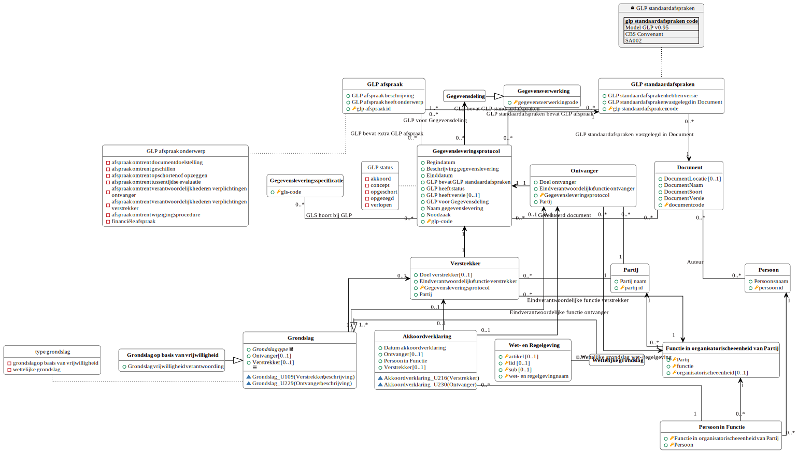
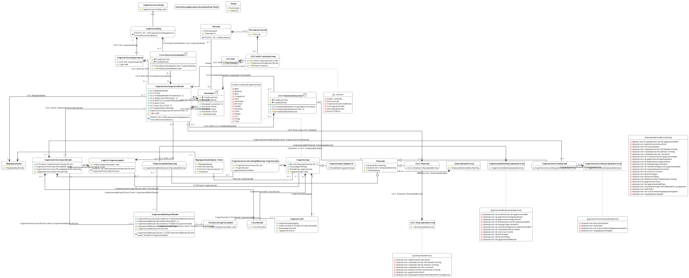
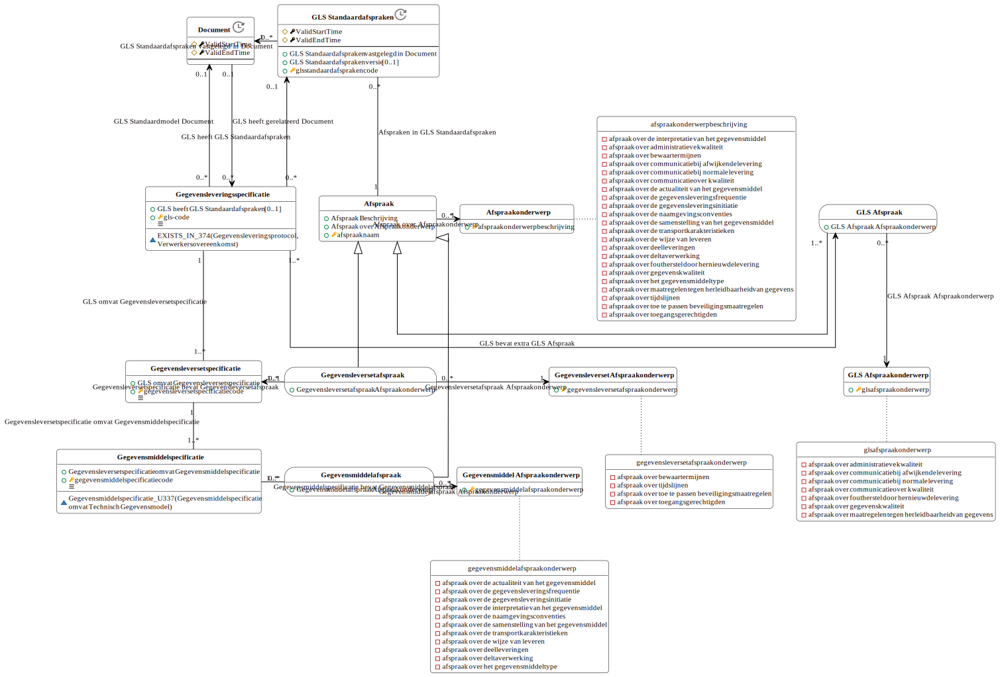
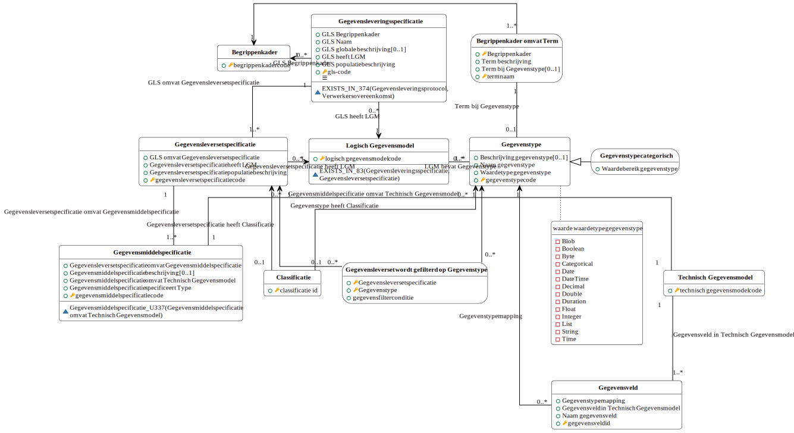
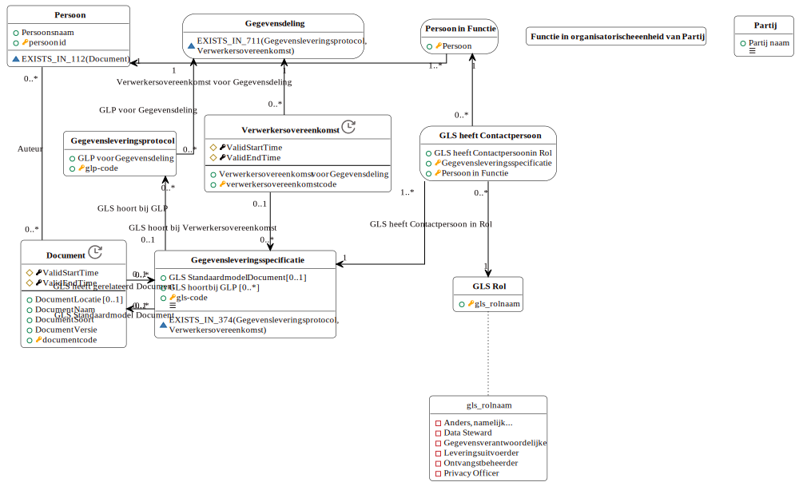
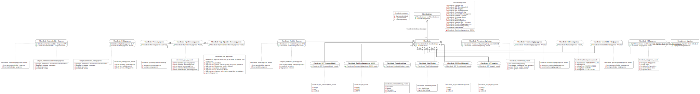

# Logische gegevensmodellen

## LGM Gegevensleveringsprotocol

<a href="./logische-modellen/glp.uml.svg" target="_blank">Vergrote versie op nieuw tabblad</a>

## LGM Gegevensleveringsspecificatie

<a href="./logische-modellen/gegevensleveringsspecificatie.uml.svg" target="_blank">Vergrote versie op nieuw tabblad</a>

Vanwege de omvang van het logisch model gegevensleveringsspecificatie wordt het model hieropvolgend nogmaals weergegeven, opgesplitst in sub-modellen. Deze sub-modellen bevatten gezamenlijk alle informatie uit het bovenliggende model.

### Afspraken

<a href="./logische-modellen/afspraken.uml.svg" target="_blank">Vergrote versie op nieuw tabblad</a>

### Gegevenstypering

<a href="./logische-modellen/typeringsadministratie.uml.svg" target="_blank">Vergrote versie op nieuw tabblad</a>

### Overig

<a href="./logische-modellen/gls_overig.uml.svg" target="_blank">Vergrote versie op nieuw tabblad</a>

## LGM Gegevensclassificaties

Classificaties komen op meerdere modellen voor. Vanwege de omvang van het logisch model voor gegevensclassificaties wordt het logisch model apart weergegeven.

<a href="./logische-modellen/gegevensclassificaties.uml.svg" target="_blank">Vergrote versie op nieuw tabblad</a>

