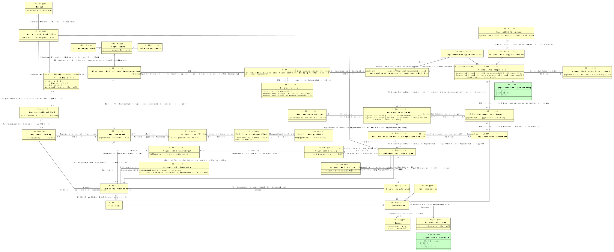

# CIM gegevenskwaliteitsbeleid

- [Begrippenkader](#TBegrippenkader)
- [Gegevensbron](#TGegevensbron)
  - [Primaire gegevensbron](#TPrimaire-gegevensbron)
  - [Secundaire gegevensbron](#TSecundaire-gegevensbron)
- [Gegevenscorrectie](#TGegevenscorrectie)
- [Gegevenselement](#TGegevenselement)
- [Gegevenskwaliteit Rol](#TGegevenskwaliteit-Rol)
- [Gegevenskwaliteitsattribuut](#TGegevenskwaliteitsattribuut)
- [Gegevenskwaliteitsdimensie](#TGegevenskwaliteitsdimensie)
- [Gegevenskwaliteitseis](#TGegevenskwaliteitseis)
- [Gegevenskwaliteitseis op KGE](#TGegevenskwaliteitseis-op-KGE)
- [Gegevenskwaliteitsmeting](#TGegevenskwaliteitsmeting)
- [Gegevenskwaliteitsmeting constateert Gegevenskwaliteitsprobleem](#TGegevenskwaliteitsmeting-constateert-Gegevenskwaliteitsprobleem)
- [Gegevenskwaliteitsmeting voor Gegevenskwaliteitseis op KGE](#TGegevenskwaliteitsmeting-voor-Gegevenskwaliteitseis-op-KGE)
- [Gegevenskwaliteitsmetriek](#TGegevenskwaliteitsmetriek)
- [Gegevenskwaliteitsnorm](#TGegevenskwaliteitsnorm)
- [Gegevenskwaliteitsprobleem](#TGegevenskwaliteitsprobleem)
- [Gegevenskwaliteitsprobleem na Gegevenskwaliteitsmeting op Gegevenselement in Gegevensbron](#TGegevenskwaliteitsprobleem-na-Gegevenskwaliteitsmeting-op-Gegevenselement-in-Gegevensbron)
- [Gegevenskwaliteitsprobleemcategorie](#TGegevenskwaliteitsprobleemcategorie)
- [Gegevenskwaliteitsrapport](#TGegevenskwaliteitsrapport)
- [Gegevenstype](#TGegevenstype)
- [Gegevensverwerking](#TGegevensverwerking)
- [Kritiek Gegevenselement](#TKritiek-Gegevenselement)
- [Motivatie](#TMotivatie)
- [Organisatorische Doelstelling](#TOrganisatorische-Doelstelling)
- [Organisatorische activiteit](#TOrganisatorische-activiteit)
- [Persoon](#TPersoon)
- [Persoon in Rol](#TPersoon-in-Rol)
  - [Data Steward](#TData-Steward)
  - [Gegevenskwaliteitscontroleur](#TGegevenskwaliteitscontroleur)
  - [Gegevensmanager](#TGegevensmanager)
  - [Gegevensverantwoordelijke](#TGegevensverantwoordelijke)
- [Term in Begrippenkader](#TTerm-in-Begrippenkader)
- [U2 - Gegevenskwaliteit is verankerd in de gegevensbron](#TU2-Gegevenskwaliteit-is-verankerd-in-de-gegevensbron)
- [Wet- en Regelgeving](#TWet-en-Regelgeving)

## Begrippenkader {#TBegrippenkader}

|{: .def}||
|-|-|
|Begrip|[Begrippenkader](#begrippenkader)|
|Kenmerken|[begrippenkadercode](#TBegrippenkader-begrippenkadercode)|
|Relatie met|[Term in Begrippenkader in relatie met Begrippenkader](#TTerm-in-Begrippenkader-Begrippenkader)|

### begrippenkadercode {#TBegrippenkader-begrippenkadercode}

|{: .def}||
|-|-|
|Eigenschap van|[Begrippenkader](#TBegrippenkader)|
|Type|CharacterString|

## Data Steward {#TData-Steward}

|{: .def}||
|-|-|
|Begrip|[Data Steward](#data-steward)|
|Supertype|[Persoon in Rol](#TPersoon-in-Rol)|
|Rollen|[U4 - Data Steward beheert Kritiek Gegevenselement](#TU4-Data-Steward-beheert-Kritiek-Gegevenselement)|

### U4 - Data Steward beheert Kritiek Gegevenselement {#TU4-Data-Steward-beheert-Kritiek-Gegevenselement}

|{: .def}||
|-|-|
|Rol van|0..* [Data Steward](#TData-Steward)|
|Met|0..* [Kritiek Gegevenselement](#TKritiek-Gegevenselement)|

## Gegevensbron {#TGegevensbron}

|{: .def}||
|-|-|
|Begrip|[Gegevensbron](#gegevensbron)|
|Subtype(s)|[Secundaire gegevensbron](#TSecundaire-gegevensbron), [Primaire gegevensbron](#TPrimaire-gegevensbron)|
|Kenmerken|[gegevensbronnaam](#TGegevensbron-gegevensbronnaam)|
|Relatie met|[U2 - Gegevenskwaliteit is verankerd in de gegevensbron in relatie met Gegevensbron](#TU2-Gegevenskwaliteit-is-verankerd-in-de-gegevensbron-Gegevensbron)|

### gegevensbronnaam {#TGegevensbron-gegevensbronnaam}

|{: .def}||
|-|-|
|Eigenschap van|[Gegevensbron](#TGegevensbron)|
|Type|CharacterString|

## Gegevenscorrectie {#TGegevenscorrectie}

|{: .def}||
|-|-|
|Begrip|[Gegevenscorrectie](#gegevenscorrectie)|
|Kenmerken|[Gegevenscorrectie beschrijving](#TGegevenscorrectie-beschrijving), [Gegevenscorrectie doorvoerdatum](#TGegevenscorrectie-doorvoerdatum), [gegevenscorrectieid](#TGegevenscorrectie-gegevenscorrectieid)|
|Relatie met|[Gegevenscorrectie voor Gegevenskwaliteitsprobleem](#TGegevenscorrectie-voor-Gegevenskwaliteitsprobleem)|

### gegevenscorrectieid {#TGegevenscorrectie-gegevenscorrectieid}

|{: .def}||
|-|-|
|Eigenschap van|[Gegevenscorrectie](#TGegevenscorrectie)|
|Type|CharacterString|

### Gegevenscorrectie doorvoerdatum {#TGegevenscorrectie-doorvoerdatum}

|{: .def}||
|-|-|
|Eigenschap van|[Gegevenscorrectie](#TGegevenscorrectie)|
|Type|[gegevenscorrectiemoment](#Tgegevenscorrectiemoment)|

### Gegevenscorrectie beschrijving {#TGegevenscorrectie-beschrijving}

|{: .def}||
|-|-|
|Eigenschap van|[Gegevenscorrectie](#TGegevenscorrectie)|
|Type|[gegevenscorrectiebeschrijving](#Tgegevenscorrectiebeschrijving)|

## Gegevenselement {#TGegevenselement}

|{: .def}||
|-|-|
|Begrip|[Gegevenselement](#gegevenselement)|
|Kenmerken|[gegevenselementnaam](#TGegevenselement-gegevenselementnaam)|
|Relatie met|[Gegevenstype specificeert Gegevenselement](#TGegevenstype-specificeert-Gegevenselement), [Gegevensverwerking gebruikt Gegevenselement](#TGegevensverwerking-gebruikt-Gegevenselement), [Kritiek Gegevenselement in relatie met Gegevenselement](#TKritiek-Gegevenselement-Gegevenselement), [U2 - Gegevenskwaliteit is verankerd in de gegevensbron in relatie met Gegevenselement](#TU2-Gegevenskwaliteit-is-verankerd-in-de-gegevensbron-Gegevenselement)|

### gegevenselementnaam {#TGegevenselement-gegevenselementnaam}

|{: .def}||
|-|-|
|Eigenschap van|[Gegevenselement](#TGegevenselement)|
|Type|CharacterString|

## Gegevenskwaliteit Rol {#TGegevenskwaliteit-Rol}

|{: .def}||
|-|-|
|Begrip|[Gegevenskwaliteit Rol](#gegevenskwaliteit-rol)|
|Kenmerken|[gegevenskwaliteitrolnaam](#TGegevenskwaliteit-Rol-gegevenskwaliteitrolnaam)|
|Relatie met|[Persoon in Rol in relatie met Gegevenskwaliteit Rol](#TPersoon-in-Rol-Gegevenskwaliteit-Rol)|

### gegevenskwaliteitrolnaam {#TGegevenskwaliteit-Rol-gegevenskwaliteitrolnaam}

|{: .def}||
|-|-|
|Eigenschap van|[Gegevenskwaliteit Rol](#TGegevenskwaliteit-Rol)|
|Type|CharacterString|

## Gegevenskwaliteitsattribuut {#TGegevenskwaliteitsattribuut}

|{: .def}||
|-|-|
|Begrip|[Gegevenskwaliteitsattribuut](#gegevenskwaliteitsattribuut)|
|Kenmerken|[gegevenskwaliteitsattribuutnaam](#TGegevenskwaliteitsattribuut-gegevenskwaliteitsattribuutnaam)|
|Rollen|[Gegevenskwaliteitsdimensie omvat Gegevenskwaliteitsattribuut](#TGegevenskwaliteitsdimensie-omvat-Gegevenskwaliteitsattribuut), [Relevant Gegevenskwaliteitsattribuut bij Kritiek Gegevenselement](#TRelevant-Gegevenskwaliteitsattribuut-bij-Kritiek-Gegevenselement)|
|Relatie met|[Gegevenskwaliteitseis voor Gegevenskwaliteitsattribuut](#TGegevenskwaliteitseis-voor-Gegevenskwaliteitsattribuut)|

### gegevenskwaliteitsattribuutnaam {#TGegevenskwaliteitsattribuut-gegevenskwaliteitsattribuutnaam}

|{: .def}||
|-|-|
|Eigenschap van|[Gegevenskwaliteitsattribuut](#TGegevenskwaliteitsattribuut)|
|Type|CharacterString|

### Gegevenskwaliteitsdimensie omvat Gegevenskwaliteitsattribuut {#TGegevenskwaliteitsdimensie-omvat-Gegevenskwaliteitsattribuut}

|{: .def}||
|-|-|
|Rol van|0..* [Gegevenskwaliteitsattribuut](#TGegevenskwaliteitsattribuut)|
|Met|0..* [Gegevenskwaliteitsdimensie](#TGegevenskwaliteitsdimensie)|

### Relevant Gegevenskwaliteitsattribuut bij Kritiek Gegevenselement {#TRelevant-Gegevenskwaliteitsattribuut-bij-Kritiek-Gegevenselement}

|{: .def}||
|-|-|
|Rol van|0..* [Gegevenskwaliteitsattribuut](#TGegevenskwaliteitsattribuut)|
|Met|0..* [Kritiek Gegevenselement](#TKritiek-Gegevenselement)|

## Gegevenskwaliteitscontroleur {#TGegevenskwaliteitscontroleur}

|{: .def}||
|-|-|
|Begrip|[Gegevenskwaliteitscontroleur](#gegevenskwaliteitscontroleur)|
|Supertype|[Persoon in Rol](#TPersoon-in-Rol)|
|Relatie met|[Gegevenskwaliteitscontroleur maakt Gegevenskwaliteitsrapport](#TGegevenskwaliteitscontroleur-maakt-Gegevenskwaliteitsrapport), [U5 - Gegevenskwaliteitscontroleur is verantwoordelijk voor Gegevenskwaliteitsmeting](#TU5-Gegevenskwaliteitscontroleur-is-verantwoordelijk-voor-Gegevenskwaliteitsmeting)|

## Gegevenskwaliteitsdimensie {#TGegevenskwaliteitsdimensie}

|{: .def}||
|-|-|
|Begrip|[Gegevenskwaliteitsdimensie](#gegevenskwaliteitsdimensie)|
|Kenmerken|[Gegevenskwaliteitsdimensie heeft Omschrijving](#TGegevenskwaliteitsdimensie-heeft-Omschrijving), [gegevenskwaliteitsdimensienaam](#TGegevenskwaliteitsdimensie-gegevenskwaliteitsdimensienaam)|
|Rollen|[Relevante Gegevenskwaliteitsdimensie bij Kritiek Gegevenselement](#TRelevante-Gegevenskwaliteitsdimensie-bij-Kritiek-Gegevenselement)|
|Relatie met|[Gegevenskwaliteitsdimensie omvat Gegevenskwaliteitsattribuut](#TGegevenskwaliteitsdimensie-omvat-Gegevenskwaliteitsattribuut)|

### gegevenskwaliteitsdimensienaam {#TGegevenskwaliteitsdimensie-gegevenskwaliteitsdimensienaam}

|{: .def}||
|-|-|
|Eigenschap van|[Gegevenskwaliteitsdimensie](#TGegevenskwaliteitsdimensie)|
|Type|CharacterString|

### Gegevenskwaliteitsdimensie heeft Omschrijving {#TGegevenskwaliteitsdimensie-heeft-Omschrijving}

|{: .def}||
|-|-|
|Eigenschap van|[Gegevenskwaliteitsdimensie](#TGegevenskwaliteitsdimensie)|
|Type|[Gegevenskwaliteitsdimensieomschrijving](#TGegevenskwaliteitsdimensieomschrijving)|

### Relevante Gegevenskwaliteitsdimensie bij Kritiek Gegevenselement {#TRelevante-Gegevenskwaliteitsdimensie-bij-Kritiek-Gegevenselement}

|{: .def}||
|-|-|
|Rol van|0..* [Gegevenskwaliteitsdimensie](#TGegevenskwaliteitsdimensie)|
|Met|0..* [Kritiek Gegevenselement](#TKritiek-Gegevenselement)|

## Gegevenskwaliteitseis {#TGegevenskwaliteitseis}

|{: .def}||
|-|-|
|Begrip|[Gegevenskwaliteitseis](#gegevenskwaliteitseis)|
|Kenmerken|[gegevenskwaliteitseisomschrijving](#TGegevenskwaliteitseis-gegevenskwaliteitseisomschrijving)|
|Rollen|[Gegevenskwaliteitseis voor Gegevenskwaliteitsattribuut](#TGegevenskwaliteitseis-voor-Gegevenskwaliteitsattribuut)|
|Relatie met|[Gegevenskwaliteitseis op KGE in relatie met Gegevenskwaliteitseis](#TGegevenskwaliteitseis-op-KGE-Gegevenskwaliteitseis)|

### gegevenskwaliteitseisomschrijving {#TGegevenskwaliteitseis-gegevenskwaliteitseisomschrijving}

|{: .def}||
|-|-|
|Eigenschap van|[Gegevenskwaliteitseis](#TGegevenskwaliteitseis)|
|Type|CharacterString|

### Gegevenskwaliteitseis voor Gegevenskwaliteitsattribuut {#TGegevenskwaliteitseis-voor-Gegevenskwaliteitsattribuut}

|{: .def}||
|-|-|
|Rol van|0..* [Gegevenskwaliteitseis](#TGegevenskwaliteitseis)|
|Met|0..* [Gegevenskwaliteitsattribuut](#TGegevenskwaliteitsattribuut)|

## Gegevenskwaliteitseis op KGE {#TGegevenskwaliteitseis-op-KGE}

|{: .def}||
|-|-|
|Rollen|[Gegevenskwaliteitseis op KGE in relatie met Gegevenskwaliteitseis](#TGegevenskwaliteitseis-op-KGE-Gegevenskwaliteitseis), [Gegevenskwaliteitseis op KGE in relatie met Kritiek Gegevenselement](#TGegevenskwaliteitseis-op-KGE-Kritiek-Gegevenselement), [U1 - Gegevenskwaliteit is contextafhankelijk](#TU1-Gegevenskwaliteit-is-contextafhankelijk)|
|Relatie met|[Gegevenskwaliteitsmeting voor Gegevenskwaliteitseis op KGE in relatie met Gegevenskwaliteitseis op KGE](#TGegevenskwaliteitsmeting-voor-Gegevenskwaliteitseis-op-KGE-Gegevenskwaliteitseis-op-KGE), [Gegevenskwaliteitsnorm toegepast op Gegevenskwaliteitseis op KGE](#TGegevenskwaliteitsnorm-toegepast-op-Gegevenskwaliteitseis-op-KGE), [U3 - Gegevensverantwoordelijke stelt Gegevenskwaliteitseis aan KGE](#TU3-Gegevensverantwoordelijke-stelt-Gegevenskwaliteitseis-aan-KGE)|

### U1 - Gegevenskwaliteit is contextafhankelijk {#TU1-Gegevenskwaliteit-is-contextafhankelijk}

|{: .def}||
|-|-|
|Rol van|0..* [Gegevenskwaliteitseis op KGE](#TGegevenskwaliteitseis-op-KGE)|
|Met|0..* [Organisatorische Doelstelling](#TOrganisatorische-Doelstelling)|

### Gegevenskwaliteitseis op KGE in relatie met Kritiek Gegevenselement {#TGegevenskwaliteitseis-op-KGE-Kritiek-Gegevenselement}

|{: .def}||
|-|-|
|Rol van|0..* [Gegevenskwaliteitseis op KGE](#TGegevenskwaliteitseis-op-KGE)|
|Met|1..1 [Kritiek Gegevenselement](#TKritiek-Gegevenselement)|

### Gegevenskwaliteitseis op KGE in relatie met Gegevenskwaliteitseis {#TGegevenskwaliteitseis-op-KGE-Gegevenskwaliteitseis}

|{: .def}||
|-|-|
|Rol van|0..* [Gegevenskwaliteitseis op KGE](#TGegevenskwaliteitseis-op-KGE)|
|Met|1..1 [Gegevenskwaliteitseis](#TGegevenskwaliteitseis)|

## Gegevenskwaliteitsmeting {#TGegevenskwaliteitsmeting}

|{: .def}||
|-|-|
|Begrip|[Gegevenskwaliteitsmeting](#gegevenskwaliteitsmeting)|
|Kenmerken|[Gegevenskwaliteitsmeting meetmoment](#TGegevenskwaliteitsmeting-meetmoment), [Gegevenskwaliteitsmeting waarde](#TGegevenskwaliteitsmeting-waarde), [gegevenskwaliteitsmetingid](#TGegevenskwaliteitsmeting-gegevenskwaliteitsmetingid)|
|Rollen|[Gegevenskwaliteitsmeting gerapporteerd op Gegevenskwaliteitsrapport](#TGegevenskwaliteitsmeting-gerapporteerd-op-Gegevenskwaliteitsrapport), [Gegevenskwaliteitsmeting metriek](#TGegevenskwaliteitsmeting-metriek)|
|Relatie met|[Gegevenskwaliteitsmeting constateert Gegevenskwaliteitsprobleem in relatie met Gegevenskwaliteitsmeting](#TGegevenskwaliteitsmeting-constateert-Gegevenskwaliteitsprobleem-Gegevenskwaliteitsmeting), [Gegevenskwaliteitsmeting voor Gegevenskwaliteitseis op KGE in relatie met Gegevenskwaliteitsmeting](#TGegevenskwaliteitsmeting-voor-Gegevenskwaliteitseis-op-KGE-Gegevenskwaliteitsmeting)|

### Gegevenskwaliteitsmeting waarde {#TGegevenskwaliteitsmeting-waarde}

|{: .def}||
|-|-|
|Eigenschap van|[Gegevenskwaliteitsmeting](#TGegevenskwaliteitsmeting)|
|Type|[gegevenskwaliteitsmetingwaarde](#Tgegevenskwaliteitsmetingwaarde)|

### Gegevenskwaliteitsmeting meetmoment {#TGegevenskwaliteitsmeting-meetmoment}

|{: .def}||
|-|-|
|Eigenschap van|[Gegevenskwaliteitsmeting](#TGegevenskwaliteitsmeting)|
|Type|[gegevenskwaliteitsmetingmeetmoment](#Tgegevenskwaliteitsmetingmeetmoment)|

### gegevenskwaliteitsmetingid {#TGegevenskwaliteitsmeting-gegevenskwaliteitsmetingid}

|{: .def}||
|-|-|
|Eigenschap van|[Gegevenskwaliteitsmeting](#TGegevenskwaliteitsmeting)|
|Type|CharacterString|

### Gegevenskwaliteitsmeting metriek {#TGegevenskwaliteitsmeting-metriek}

|{: .def}||
|-|-|
|Rol van|0..* [Gegevenskwaliteitsmeting](#TGegevenskwaliteitsmeting)|
|Met|0..* [Gegevenskwaliteitsmetriek](#TGegevenskwaliteitsmetriek)|

### Gegevenskwaliteitsmeting gerapporteerd op Gegevenskwaliteitsrapport {#TGegevenskwaliteitsmeting-gerapporteerd-op-Gegevenskwaliteitsrapport}

|{: .def}||
|-|-|
|Rol van|0..* [Gegevenskwaliteitsmeting](#TGegevenskwaliteitsmeting)|
|Met|0..* [Gegevenskwaliteitsrapport](#TGegevenskwaliteitsrapport)|

## Gegevenskwaliteitsmeting constateert Gegevenskwaliteitsprobleem {#TGegevenskwaliteitsmeting-constateert-Gegevenskwaliteitsprobleem}

|{: .def}||
|-|-|
|Rollen|[Gegevenskwaliteitsmeting constateert Gegevenskwaliteitsprobleem in relatie met Gegevenskwaliteitsmeting](#TGegevenskwaliteitsmeting-constateert-Gegevenskwaliteitsprobleem-Gegevenskwaliteitsmeting), [Gegevenskwaliteitsmeting constateert Gegevenskwaliteitsprobleem in relatie met Gegevenskwaliteitsprobleem](#TGegevenskwaliteitsmeting-constateert-Gegevenskwaliteitsprobleem-Gegevenskwaliteitsprobleem)|
|Relatie met|[Gegevenskwaliteitsprobleem na Gegevenskwaliteitsmeting op Gegevenselement in Gegevensbron in relatie met Gegevenskwaliteitsmeting constateert Gegevenskwaliteitsprobleem](#TGegevenskwaliteitsprobleem-na-Gegevenskwaliteitsmeting-op-Gegevenselement-in-Gegevensbron-Gegevenskwaliteitsmeting-constateert-Gegevenskwaliteitsprobleem)|

### Gegevenskwaliteitsmeting constateert Gegevenskwaliteitsprobleem in relatie met Gegevenskwaliteitsmeting {#TGegevenskwaliteitsmeting-constateert-Gegevenskwaliteitsprobleem-Gegevenskwaliteitsmeting}

|{: .def}||
|-|-|
|Rol van|0..* [Gegevenskwaliteitsmeting constateert Gegevenskwaliteitsprobleem](#TGegevenskwaliteitsmeting-constateert-Gegevenskwaliteitsprobleem)|
|Met|1..1 [Gegevenskwaliteitsmeting](#TGegevenskwaliteitsmeting)|

### Gegevenskwaliteitsmeting constateert Gegevenskwaliteitsprobleem in relatie met Gegevenskwaliteitsprobleem {#TGegevenskwaliteitsmeting-constateert-Gegevenskwaliteitsprobleem-Gegevenskwaliteitsprobleem}

|{: .def}||
|-|-|
|Rol van|0..* [Gegevenskwaliteitsmeting constateert Gegevenskwaliteitsprobleem](#TGegevenskwaliteitsmeting-constateert-Gegevenskwaliteitsprobleem)|
|Met|1..1 [Gegevenskwaliteitsprobleem](#TGegevenskwaliteitsprobleem)|

## Gegevenskwaliteitsmeting voor Gegevenskwaliteitseis op KGE {#TGegevenskwaliteitsmeting-voor-Gegevenskwaliteitseis-op-KGE}

|{: .def}||
|-|-|
|Rollen|[Gegevenskwaliteitsmeting voor Gegevenskwaliteitseis op KGE in relatie met Gegevenskwaliteitseis op KGE](#TGegevenskwaliteitsmeting-voor-Gegevenskwaliteitseis-op-KGE-Gegevenskwaliteitseis-op-KGE), [Gegevenskwaliteitsmeting voor Gegevenskwaliteitseis op KGE in relatie met Gegevenskwaliteitsmeting](#TGegevenskwaliteitsmeting-voor-Gegevenskwaliteitseis-op-KGE-Gegevenskwaliteitsmeting), [U5 - Gegevenskwaliteitscontroleur is verantwoordelijk voor Gegevenskwaliteitsmeting](#TU5-Gegevenskwaliteitscontroleur-is-verantwoordelijk-voor-Gegevenskwaliteitsmeting)|

### U5 - Gegevenskwaliteitscontroleur is verantwoordelijk voor Gegevenskwaliteitsmeting {#TU5-Gegevenskwaliteitscontroleur-is-verantwoordelijk-voor-Gegevenskwaliteitsmeting}

|{: .def}||
|-|-|
|Rol van|0..* [Gegevenskwaliteitsmeting voor Gegevenskwaliteitseis op KGE](#TGegevenskwaliteitsmeting-voor-Gegevenskwaliteitseis-op-KGE)|
|Met|0..* [Gegevenskwaliteitscontroleur](#TGegevenskwaliteitscontroleur)|

### Gegevenskwaliteitsmeting voor Gegevenskwaliteitseis op KGE in relatie met Gegevenskwaliteitsmeting {#TGegevenskwaliteitsmeting-voor-Gegevenskwaliteitseis-op-KGE-Gegevenskwaliteitsmeting}

|{: .def}||
|-|-|
|Rol van|0..* [Gegevenskwaliteitsmeting voor Gegevenskwaliteitseis op KGE](#TGegevenskwaliteitsmeting-voor-Gegevenskwaliteitseis-op-KGE)|
|Met|1..1 [Gegevenskwaliteitsmeting](#TGegevenskwaliteitsmeting)|

### Gegevenskwaliteitsmeting voor Gegevenskwaliteitseis op KGE in relatie met Gegevenskwaliteitseis op KGE {#TGegevenskwaliteitsmeting-voor-Gegevenskwaliteitseis-op-KGE-Gegevenskwaliteitseis-op-KGE}

|{: .def}||
|-|-|
|Rol van|0..* [Gegevenskwaliteitsmeting voor Gegevenskwaliteitseis op KGE](#TGegevenskwaliteitsmeting-voor-Gegevenskwaliteitseis-op-KGE)|
|Met|1..1 [Gegevenskwaliteitseis op KGE](#TGegevenskwaliteitseis-op-KGE)|

## Gegevenskwaliteitsmetriek {#TGegevenskwaliteitsmetriek}

|{: .def}||
|-|-|
|Begrip|[Gegevenskwaliteitsmetriek](#gegevenskwaliteitsmetriek)|
|Kenmerken|[gegevenskwaliteitsmetrieknaam](#TGegevenskwaliteitsmetriek-gegevenskwaliteitsmetrieknaam)|
|Relatie met|[Gegevenskwaliteitsmeting metriek](#TGegevenskwaliteitsmeting-metriek)|

### gegevenskwaliteitsmetrieknaam {#TGegevenskwaliteitsmetriek-gegevenskwaliteitsmetrieknaam}

|{: .def}||
|-|-|
|Eigenschap van|[Gegevenskwaliteitsmetriek](#TGegevenskwaliteitsmetriek)|
|Type|CharacterString|

## Gegevenskwaliteitsnorm {#TGegevenskwaliteitsnorm}

|{: .def}||
|-|-|
|Begrip|[Gegevenskwaliteitsnorm](#gegevenskwaliteitsnorm)|
|Kenmerken|[gegevenskwaliteitsnormwaarde](#TGegevenskwaliteitsnorm-gegevenskwaliteitsnormwaarde)|
|Rollen|[Gegevenskwaliteitsnorm toegepast op Gegevenskwaliteitseis op KGE](#TGegevenskwaliteitsnorm-toegepast-op-Gegevenskwaliteitseis-op-KGE)|

### gegevenskwaliteitsnormwaarde {#TGegevenskwaliteitsnorm-gegevenskwaliteitsnormwaarde}

|{: .def}||
|-|-|
|Eigenschap van|[Gegevenskwaliteitsnorm](#TGegevenskwaliteitsnorm)|
|Type|CharacterString|

### Gegevenskwaliteitsnorm toegepast op Gegevenskwaliteitseis op KGE {#TGegevenskwaliteitsnorm-toegepast-op-Gegevenskwaliteitseis-op-KGE}

|{: .def}||
|-|-|
|Rol van|0..* [Gegevenskwaliteitsnorm](#TGegevenskwaliteitsnorm)|
|Met|0..* [Gegevenskwaliteitseis op KGE](#TGegevenskwaliteitseis-op-KGE)|

## Gegevenskwaliteitsprobleem {#TGegevenskwaliteitsprobleem}

|{: .def}||
|-|-|
|Begrip|[Gegevenskwaliteitsprobleem](#gegevenskwaliteitsprobleem)|
|Kenmerken|[Gegevenskwaliteitsprobleem Omschrijving](#TGegevenskwaliteitsprobleem-Omschrijving), [Gegevenskwaliteitsprobleem Oorsprong](#TGegevenskwaliteitsprobleem-Oorsprong), [gegevenskwaliteitsprobleemcode](#TGegevenskwaliteitsprobleem-gegevenskwaliteitsprobleemcode)|
|Rollen|[Gegevenskwaliteitsprobleem Categorie](#TGegevenskwaliteitsprobleem-Categorie), [Gegevenskwaliteitsprobleem gerapporteerd op Gegevenskwaliteitsrapport](#TGegevenskwaliteitsprobleem-gerapporteerd-op-Gegevenskwaliteitsrapport)|
|Relatie met|[Gegevenskwaliteitsmeting constateert Gegevenskwaliteitsprobleem in relatie met Gegevenskwaliteitsprobleem](#TGegevenskwaliteitsmeting-constateert-Gegevenskwaliteitsprobleem-Gegevenskwaliteitsprobleem)|

### Gegevenskwaliteitsprobleem Oorsprong {#TGegevenskwaliteitsprobleem-Oorsprong}

|{: .def}||
|-|-|
|Eigenschap van|[Gegevenskwaliteitsprobleem](#TGegevenskwaliteitsprobleem)|
|Type|[gegevenskwaliteitsprobleemoorsprong](#Tgegevenskwaliteitsprobleemoorsprong)|
|Mogelijke waarden|interne meting; externe melding; interne melding; externe meting|

### Gegevenskwaliteitsprobleem Omschrijving {#TGegevenskwaliteitsprobleem-Omschrijving}

|{: .def}||
|-|-|
|Eigenschap van|[Gegevenskwaliteitsprobleem](#TGegevenskwaliteitsprobleem)|
|Type|[gegevenskwaliteitsprobleemomschrijving](#Tgegevenskwaliteitsprobleemomschrijving)|

### gegevenskwaliteitsprobleemcode {#TGegevenskwaliteitsprobleem-gegevenskwaliteitsprobleemcode}

|{: .def}||
|-|-|
|Eigenschap van|[Gegevenskwaliteitsprobleem](#TGegevenskwaliteitsprobleem)|
|Type|CharacterString|

### Gegevenskwaliteitsprobleem gerapporteerd op Gegevenskwaliteitsrapport {#TGegevenskwaliteitsprobleem-gerapporteerd-op-Gegevenskwaliteitsrapport}

|{: .def}||
|-|-|
|Rol van|0..* [Gegevenskwaliteitsprobleem](#TGegevenskwaliteitsprobleem)|
|Met|0..* [Gegevenskwaliteitsrapport](#TGegevenskwaliteitsrapport)|

### Gegevenskwaliteitsprobleem Categorie {#TGegevenskwaliteitsprobleem-Categorie}

|{: .def}||
|-|-|
|Rol van|0..* [Gegevenskwaliteitsprobleem](#TGegevenskwaliteitsprobleem)|
|Met|0..* [Gegevenskwaliteitsprobleemcategorie](#TGegevenskwaliteitsprobleemcategorie)|

## Gegevenskwaliteitsprobleem na Gegevenskwaliteitsmeting op Gegevenselement in Gegevensbron {#TGegevenskwaliteitsprobleem-na-Gegevenskwaliteitsmeting-op-Gegevenselement-in-Gegevensbron}

|{: .def}||
|-|-|
|Rollen|[Gegevenscorrectie voor Gegevenskwaliteitsprobleem](#TGegevenscorrectie-voor-Gegevenskwaliteitsprobleem), [Gegevenskwaliteitsprobleem na Gegevenskwaliteitsmeting op Gegevenselement in Gegevensbron in relatie met Gegevenskwaliteitsmeting constateert Gegevenskwaliteitsprobleem](#TGegevenskwaliteitsprobleem-na-Gegevenskwaliteitsmeting-op-Gegevenselement-in-Gegevensbron-Gegevenskwaliteitsmeting-constateert-Gegevenskwaliteitsprobleem), [Gegevenskwaliteitsprobleem na Gegevenskwaliteitsmeting op Gegevenselement in Gegevensbron in relatie met U2 - Gegevenskwaliteit is verankerd in de gegevensbron](#TGegevenskwaliteitsprobleem-na-Gegevenskwaliteitsmeting-op-Gegevenselement-in-Gegevensbron-U2-Gegevenskwaliteit-is-verankerd-in-de-gegevensbron)|

### Gegevenscorrectie voor Gegevenskwaliteitsprobleem {#TGegevenscorrectie-voor-Gegevenskwaliteitsprobleem}

|{: .def}||
|-|-|
|Rol van|0..* [Gegevenskwaliteitsprobleem na Gegevenskwaliteitsmeting op Gegevenselement in Gegevensbron](#TGegevenskwaliteitsprobleem-na-Gegevenskwaliteitsmeting-op-Gegevenselement-in-Gegevensbron)|
|Met|0..* [Gegevenscorrectie](#TGegevenscorrectie)|

### Gegevenskwaliteitsprobleem na Gegevenskwaliteitsmeting op Gegevenselement in Gegevensbron in relatie met Gegevenskwaliteitsmeting constateert Gegevenskwaliteitsprobleem {#TGegevenskwaliteitsprobleem-na-Gegevenskwaliteitsmeting-op-Gegevenselement-in-Gegevensbron-Gegevenskwaliteitsmeting-constateert-Gegevenskwaliteitsprobleem}

|{: .def}||
|-|-|
|Rol van|0..* [Gegevenskwaliteitsprobleem na Gegevenskwaliteitsmeting op Gegevenselement in Gegevensbron](#TGegevenskwaliteitsprobleem-na-Gegevenskwaliteitsmeting-op-Gegevenselement-in-Gegevensbron)|
|Met|1..1 [Gegevenskwaliteitsmeting constateert Gegevenskwaliteitsprobleem](#TGegevenskwaliteitsmeting-constateert-Gegevenskwaliteitsprobleem)|

### Gegevenskwaliteitsprobleem na Gegevenskwaliteitsmeting op Gegevenselement in Gegevensbron in relatie met U2 - Gegevenskwaliteit is verankerd in de gegevensbron {#TGegevenskwaliteitsprobleem-na-Gegevenskwaliteitsmeting-op-Gegevenselement-in-Gegevensbron-U2-Gegevenskwaliteit-is-verankerd-in-de-gegevensbron}

|{: .def}||
|-|-|
|Rol van|0..* [Gegevenskwaliteitsprobleem na Gegevenskwaliteitsmeting op Gegevenselement in Gegevensbron](#TGegevenskwaliteitsprobleem-na-Gegevenskwaliteitsmeting-op-Gegevenselement-in-Gegevensbron)|
|Met|1..1 [U2 - Gegevenskwaliteit is verankerd in de gegevensbron](#TU2-Gegevenskwaliteit-is-verankerd-in-de-gegevensbron)|

## Gegevenskwaliteitsprobleemcategorie {#TGegevenskwaliteitsprobleemcategorie}

|{: .def}||
|-|-|
|Begrip|[Gegevenskwaliteitsprobleemcategorie](#gegevenskwaliteitsprobleemcategorie)|
|Kenmerken|[gegevenskwaliteitsprobleemcategoriebeschrijving](#TGegevenskwaliteitsprobleemcategorie-gegevenskwaliteitsprobleemcategoriebeschrijving)|
|Relatie met|[Gegevenskwaliteitsprobleem Categorie](#TGegevenskwaliteitsprobleem-Categorie)|

### gegevenskwaliteitsprobleemcategoriebeschrijving {#TGegevenskwaliteitsprobleemcategorie-gegevenskwaliteitsprobleemcategoriebeschrijving}

|{: .def}||
|-|-|
|Eigenschap van|[Gegevenskwaliteitsprobleemcategorie](#TGegevenskwaliteitsprobleemcategorie)|
|Type|CharacterString|

## Gegevenskwaliteitsrapport {#TGegevenskwaliteitsrapport}

|{: .def}||
|-|-|
|Begrip|[Gegevenskwaliteitsrapport](#gegevenskwaliteitsrapport)|
|Kenmerken|[gegevenskwaliteitsrapportcode](#TGegevenskwaliteitsrapport-gegevenskwaliteitsrapportcode)|
|Rollen|[Gegevenskwaliteitscontroleur maakt Gegevenskwaliteitsrapport](#TGegevenskwaliteitscontroleur-maakt-Gegevenskwaliteitsrapport)|
|Relatie met|[Gegevenskwaliteitsmeting gerapporteerd op Gegevenskwaliteitsrapport](#TGegevenskwaliteitsmeting-gerapporteerd-op-Gegevenskwaliteitsrapport), [Gegevenskwaliteitsprobleem gerapporteerd op Gegevenskwaliteitsrapport](#TGegevenskwaliteitsprobleem-gerapporteerd-op-Gegevenskwaliteitsrapport)|

### gegevenskwaliteitsrapportcode {#TGegevenskwaliteitsrapport-gegevenskwaliteitsrapportcode}

|{: .def}||
|-|-|
|Eigenschap van|[Gegevenskwaliteitsrapport](#TGegevenskwaliteitsrapport)|
|Type|CharacterString|

### Gegevenskwaliteitscontroleur maakt Gegevenskwaliteitsrapport {#TGegevenskwaliteitscontroleur-maakt-Gegevenskwaliteitsrapport}

|{: .def}||
|-|-|
|Rol van|0..* [Gegevenskwaliteitsrapport](#TGegevenskwaliteitsrapport)|
|Met|0..* [Gegevenskwaliteitscontroleur](#TGegevenskwaliteitscontroleur)|

## Gegevensmanager {#TGegevensmanager}

|{: .def}||
|-|-|
|Begrip|[Gegevensmanager](#gegevensmanager)|
|Supertype|[Persoon in Rol](#TPersoon-in-Rol)|

## Gegevenstype {#TGegevenstype}

|{: .def}||
|-|-|
|Begrip|[Gegevenstype](#gegevenstype)|
|Kenmerken|[gegevenstypenaam](#TGegevenstype-gegevenstypenaam)|
|Rollen|[Gegevenstype specificeert Gegevenselement](#TGegevenstype-specificeert-Gegevenselement), [U7 - Gegevenstype gedefinieerd door Term in Begrippenkader](#TU7-Gegevenstype-gedefinieerd-door-Term-in-Begrippenkader)|

### gegevenstypenaam {#TGegevenstype-gegevenstypenaam}

|{: .def}||
|-|-|
|Eigenschap van|[Gegevenstype](#TGegevenstype)|
|Type|CharacterString|

### Gegevenstype specificeert Gegevenselement {#TGegevenstype-specificeert-Gegevenselement}

|{: .def}||
|-|-|
|Rol van|0..* [Gegevenstype](#TGegevenstype)|
|Met|0..* [Gegevenselement](#TGegevenselement)|

### U7 - Gegevenstype gedefinieerd door Term in Begrippenkader {#TU7-Gegevenstype-gedefinieerd-door-Term-in-Begrippenkader}

|{: .def}||
|-|-|
|Rol van|0..* [Gegevenstype](#TGegevenstype)|
|Met|0..* [Term in Begrippenkader](#TTerm-in-Begrippenkader)|

## Gegevensverantwoordelijke {#TGegevensverantwoordelijke}

|{: .def}||
|-|-|
|Begrip|[Gegevensverantwoordelijke](#gegevensverantwoordelijke)|
|Supertype|[Persoon in Rol](#TPersoon-in-Rol)|
|Rollen|[U3 - Gegevensverantwoordelijke stelt Gegevenskwaliteitseis aan KGE](#TU3-Gegevensverantwoordelijke-stelt-Gegevenskwaliteitseis-aan-KGE)|
|Relatie met|[U3 - Gegevensverantwoordelijke bepaalt Kritiek Gegevenselement](#TU3-Gegevensverantwoordelijke-bepaalt-Kritiek-Gegevenselement)|

### U3 - Gegevensverantwoordelijke stelt Gegevenskwaliteitseis aan KGE {#TU3-Gegevensverantwoordelijke-stelt-Gegevenskwaliteitseis-aan-KGE}

|{: .def}||
|-|-|
|Rol van|0..* [Gegevensverantwoordelijke](#TGegevensverantwoordelijke)|
|Met|0..* [Gegevenskwaliteitseis op KGE](#TGegevenskwaliteitseis-op-KGE)|

## Gegevensverwerking {#TGegevensverwerking}

|{: .def}||
|-|-|
|Begrip|[Gegevensverwerking](#gegevensverwerking)|
|Kenmerken|[gegevensverwerking code](#TGegevensverwerking-gegevensverwerking-code)|
|Rollen|[Gegevensverwerking bij Organisatorische Activiteit](#TGegevensverwerking-bij-Organisatorische-Activiteit), [Gegevensverwerking gebruikt Gegevenselement](#TGegevensverwerking-gebruikt-Gegevenselement)|
|Relatie met|[Kritiek Gegevenselement in relatie met Gegevensverwerking](#TKritiek-Gegevenselement-Gegevensverwerking)|

### gegevensverwerking code {#TGegevensverwerking-gegevensverwerking-code}

|{: .def}||
|-|-|
|Eigenschap van|[Gegevensverwerking](#TGegevensverwerking)|
|Type|CharacterString|

### Gegevensverwerking bij Organisatorische Activiteit {#TGegevensverwerking-bij-Organisatorische-Activiteit}

|{: .def}||
|-|-|
|Rol van|0..* [Gegevensverwerking](#TGegevensverwerking)|
|Met|0..* [Organisatorische activiteit](#TOrganisatorische-activiteit)|

### Gegevensverwerking gebruikt Gegevenselement {#TGegevensverwerking-gebruikt-Gegevenselement}

|{: .def}||
|-|-|
|Rol van|0..* [Gegevensverwerking](#TGegevensverwerking)|
|Met|0..* [Gegevenselement](#TGegevenselement)|

## Kritiek Gegevenselement {#TKritiek-Gegevenselement}

|{: .def}||
|-|-|
|Begrip|[Kritiek gegevenselement](#kritiek-gegevenselement)|
|Rollen|[Kritiek Gegevenselement in relatie met Gegevenselement](#TKritiek-Gegevenselement-Gegevenselement), [Kritiek Gegevenselement in relatie met Gegevensverwerking](#TKritiek-Gegevenselement-Gegevensverwerking), [U3 - Gegevensverantwoordelijke bepaalt Kritiek Gegevenselement](#TU3-Gegevensverantwoordelijke-bepaalt-Kritiek-Gegevenselement)|
|Relatie met|[Gegevenskwaliteitseis op KGE in relatie met Kritiek Gegevenselement](#TGegevenskwaliteitseis-op-KGE-Kritiek-Gegevenselement), [Relevant Gegevenskwaliteitsattribuut bij Kritiek Gegevenselement](#TRelevant-Gegevenskwaliteitsattribuut-bij-Kritiek-Gegevenselement), [Relevante Gegevenskwaliteitsdimensie bij Kritiek Gegevenselement](#TRelevante-Gegevenskwaliteitsdimensie-bij-Kritiek-Gegevenselement), [U4 - Data Steward beheert Kritiek Gegevenselement](#TU4-Data-Steward-beheert-Kritiek-Gegevenselement)|

### U3 - Gegevensverantwoordelijke bepaalt Kritiek Gegevenselement {#TU3-Gegevensverantwoordelijke-bepaalt-Kritiek-Gegevenselement}

|{: .def}||
|-|-|
|Rol van|0..* [Kritiek Gegevenselement](#TKritiek-Gegevenselement)|
|Met|0..* [Gegevensverantwoordelijke](#TGegevensverantwoordelijke)|

### Kritiek Gegevenselement in relatie met Gegevenselement {#TKritiek-Gegevenselement-Gegevenselement}

|{: .def}||
|-|-|
|Rol van|0..* [Kritiek Gegevenselement](#TKritiek-Gegevenselement)|
|Met|1..1 [Gegevenselement](#TGegevenselement)|

### Kritiek Gegevenselement in relatie met Gegevensverwerking {#TKritiek-Gegevenselement-Gegevensverwerking}

|{: .def}||
|-|-|
|Rol van|0..* [Kritiek Gegevenselement](#TKritiek-Gegevenselement)|
|Met|1..1 [Gegevensverwerking](#TGegevensverwerking)|

## Motivatie {#TMotivatie}

|{: .def}||
|-|-|
|Begrip|[Motivatie](#motivatie)|
|Kenmerken|[motivatienaam](#TMotivatie-motivatienaam)|
|Rollen|[Motivatie voor Organisatorische Doelstelling](#TMotivatie-voor-Organisatorische-Doelstelling)|

### motivatienaam {#TMotivatie-motivatienaam}

|{: .def}||
|-|-|
|Eigenschap van|[Motivatie](#TMotivatie)|
|Type|CharacterString|

### Motivatie voor Organisatorische Doelstelling {#TMotivatie-voor-Organisatorische-Doelstelling}

|{: .def}||
|-|-|
|Rol van|0..* [Motivatie](#TMotivatie)|
|Met|0..* [Organisatorische Doelstelling](#TOrganisatorische-Doelstelling)|

## Organisatorische Doelstelling {#TOrganisatorische-Doelstelling}

|{: .def}||
|-|-|
|Begrip|[Organisatorische doelstelling](#organisatorische-doelstelling)|
|Kenmerken|[organisatorischedoelstelling](#TOrganisatorische-Doelstelling-organisatorischedoelstelling)|
|Rollen|[Organisatorische Doelstelling is gebaseerd op Wet- en Regelgeving](#TOrganisatorische-Doelstelling-is-gebaseerd-op-Wet-en-Regelgeving), [Organisatorische Doelstelling van Organisatorische Activiteit](#TOrganisatorische-Doelstelling-van-Organisatorische-Activiteit)|
|Relatie met|[Motivatie voor Organisatorische Doelstelling](#TMotivatie-voor-Organisatorische-Doelstelling), [U1 - Gegevenskwaliteit is contextafhankelijk](#TU1-Gegevenskwaliteit-is-contextafhankelijk)|

### organisatorischedoelstelling {#TOrganisatorische-Doelstelling-organisatorischedoelstelling}

|{: .def}||
|-|-|
|Eigenschap van|[Organisatorische Doelstelling](#TOrganisatorische-Doelstelling)|
|Type|CharacterString|

### Organisatorische Doelstelling van Organisatorische Activiteit {#TOrganisatorische-Doelstelling-van-Organisatorische-Activiteit}

|{: .def}||
|-|-|
|Rol van|0..* [Organisatorische Doelstelling](#TOrganisatorische-Doelstelling)|
|Met|0..* [Organisatorische activiteit](#TOrganisatorische-activiteit)|

### Organisatorische Doelstelling is gebaseerd op Wet- en Regelgeving {#TOrganisatorische-Doelstelling-is-gebaseerd-op-Wet-en-Regelgeving}

|{: .def}||
|-|-|
|Rol van|0..* [Organisatorische Doelstelling](#TOrganisatorische-Doelstelling)|
|Met|0..* [Wet- en Regelgeving](#TWet-en-Regelgeving)|

## Organisatorische activiteit {#TOrganisatorische-activiteit}

|{: .def}||
|-|-|
|Begrip|[Organisatorische activiteit](#organisatorische-activiteit)|
|Kenmerken|[organisatorische activiteitcode](#TOrganisatorische-activiteit-organisatorische-activiteitcode)|
|Rollen|[Organisatorische Activiteit is onderhevig aan Wet- en Regelgeving](#TOrganisatorische-Activiteit-is-onderhevig-aan-Wet-en-Regelgeving)|
|Relatie met|[Gegevensverwerking bij Organisatorische Activiteit](#TGegevensverwerking-bij-Organisatorische-Activiteit), [Organisatorische Doelstelling van Organisatorische Activiteit](#TOrganisatorische-Doelstelling-van-Organisatorische-Activiteit)|

### organisatorische activiteitcode {#TOrganisatorische-activiteit-organisatorische-activiteitcode}

|{: .def}||
|-|-|
|Eigenschap van|[Organisatorische activiteit](#TOrganisatorische-activiteit)|
|Type|CharacterString|

### Organisatorische Activiteit is onderhevig aan Wet- en Regelgeving {#TOrganisatorische-Activiteit-is-onderhevig-aan-Wet-en-Regelgeving}

|{: .def}||
|-|-|
|Rol van|0..* [Organisatorische activiteit](#TOrganisatorische-activiteit)|
|Met|0..* [Wet- en Regelgeving](#TWet-en-Regelgeving)|

## Persoon {#TPersoon}

|{: .def}||
|-|-|
|Begrip|[Persoon](#persoon)|
|Kenmerken|[Persoonsnaam](#TPersoonsnaam), [persoon id](#TPersoon-persoon-id)|
|Relatie met|[Persoon in Rol in relatie met Persoon](#TPersoon-in-Rol-Persoon)|

### persoon id {#TPersoon-persoon-id}

|{: .def}||
|-|-|
|Eigenschap van|[Persoon](#TPersoon)|
|Type|CharacterString|

### Persoonsnaam {#TPersoonsnaam}

|{: .def}||
|-|-|
|Eigenschap van|[Persoon](#TPersoon)|
|Type|[naam](#Tnaam)|

## Persoon in Rol {#TPersoon-in-Rol}

|{: .def}||
|-|-|
|Begrip|[Persoon in rol](#persoon-in-rol)|
|Subtype(s)|[Gegevenskwaliteitscontroleur](#TGegevenskwaliteitscontroleur), [Data Steward](#TData-Steward), [Gegevensmanager](#TGegevensmanager), [Gegevensverantwoordelijke](#TGegevensverantwoordelijke)|
|Rollen|[Persoon in Rol in relatie met Gegevenskwaliteit Rol](#TPersoon-in-Rol-Gegevenskwaliteit-Rol), [Persoon in Rol in relatie met Persoon](#TPersoon-in-Rol-Persoon)|

### Persoon in Rol in relatie met Gegevenskwaliteit Rol {#TPersoon-in-Rol-Gegevenskwaliteit-Rol}

|{: .def}||
|-|-|
|Rol van|0..* [Persoon in Rol](#TPersoon-in-Rol)|
|Met|1..1 [Gegevenskwaliteit Rol](#TGegevenskwaliteit-Rol)|

### Persoon in Rol in relatie met Persoon {#TPersoon-in-Rol-Persoon}

|{: .def}||
|-|-|
|Rol van|0..* [Persoon in Rol](#TPersoon-in-Rol)|
|Met|1..1 [Persoon](#TPersoon)|

## Primaire gegevensbron {#TPrimaire-gegevensbron}

|{: .def}||
|-|-|
|Begrip|[Primaire gegevensbron](#primaire-gegevensbron)|
|Supertype|[Gegevensbron](#TGegevensbron)|

## Secundaire gegevensbron {#TSecundaire-gegevensbron}

|{: .def}||
|-|-|
|Begrip|[Secundaire gegevensbron](#secundaire-gegevensbron)|
|Supertype|[Gegevensbron](#TGegevensbron)|

## Term in Begrippenkader {#TTerm-in-Begrippenkader}

|{: .def}||
|-|-|
|Begrip|[Term in begrippenkader](#term-in-begrippenkader)|
|Kenmerken|[Term beschrijving](#TTerm-beschrijving), [termnaam](#TTerm-in-Begrippenkader-termnaam)|
|Rollen|[Term in Begrippenkader in relatie met Begrippenkader](#TTerm-in-Begrippenkader-Begrippenkader)|
|Relatie met|[U7 - Gegevenstype gedefinieerd door Term in Begrippenkader](#TU7-Gegevenstype-gedefinieerd-door-Term-in-Begrippenkader)|

### Term beschrijving {#TTerm-beschrijving}

|{: .def}||
|-|-|
|Eigenschap van|[Term in Begrippenkader](#TTerm-in-Begrippenkader)|
|Type|[Termbeschrijving](#TTermbeschrijving)|

### termnaam {#TTerm-in-Begrippenkader-termnaam}

|{: .def}||
|-|-|
|Eigenschap van|[Term in Begrippenkader](#TTerm-in-Begrippenkader)|
|Type|CharacterString|

### Term in Begrippenkader in relatie met Begrippenkader {#TTerm-in-Begrippenkader-Begrippenkader}

|{: .def}||
|-|-|
|Rol van|0..* [Term in Begrippenkader](#TTerm-in-Begrippenkader)|
|Met|1..1 [Begrippenkader](#TBegrippenkader)|

## U2 - Gegevenskwaliteit is verankerd in de gegevensbron {#TU2-Gegevenskwaliteit-is-verankerd-in-de-gegevensbron}

|{: .def}||
|-|-|
|Rollen|[U2 - Gegevenskwaliteit is verankerd in de gegevensbron in relatie met Gegevensbron](#TU2-Gegevenskwaliteit-is-verankerd-in-de-gegevensbron-Gegevensbron), [U2 - Gegevenskwaliteit is verankerd in de gegevensbron in relatie met Gegevenselement](#TU2-Gegevenskwaliteit-is-verankerd-in-de-gegevensbron-Gegevenselement)|
|Relatie met|[Gegevenskwaliteitsprobleem na Gegevenskwaliteitsmeting op Gegevenselement in Gegevensbron in relatie met U2 - Gegevenskwaliteit is verankerd in de gegevensbron](#TGegevenskwaliteitsprobleem-na-Gegevenskwaliteitsmeting-op-Gegevenselement-in-Gegevensbron-U2-Gegevenskwaliteit-is-verankerd-in-de-gegevensbron)|

### U2 - Gegevenskwaliteit is verankerd in de gegevensbron in relatie met Gegevensbron {#TU2-Gegevenskwaliteit-is-verankerd-in-de-gegevensbron-Gegevensbron}

|{: .def}||
|-|-|
|Rol van|0..* [U2 - Gegevenskwaliteit is verankerd in de gegevensbron](#TU2-Gegevenskwaliteit-is-verankerd-in-de-gegevensbron)|
|Met|1..1 [Gegevensbron](#TGegevensbron)|

### U2 - Gegevenskwaliteit is verankerd in de gegevensbron in relatie met Gegevenselement {#TU2-Gegevenskwaliteit-is-verankerd-in-de-gegevensbron-Gegevenselement}

|{: .def}||
|-|-|
|Rol van|0..* [U2 - Gegevenskwaliteit is verankerd in de gegevensbron](#TU2-Gegevenskwaliteit-is-verankerd-in-de-gegevensbron)|
|Met|1..1 [Gegevenselement](#TGegevenselement)|

## Wet- en Regelgeving {#TWet-en-Regelgeving}

|{: .def}||
|-|-|
|Begrip|[Wet- en regelgeving](#wet-en-regelgeving)|
|Kenmerken|[artikel](#TWet-en-Regelgeving-artikel), [lid](#TWet-en-Regelgeving-lid), [sub](#TWet-en-Regelgeving-sub), [wet- en regelgeving naam](#TWet-en-Regelgeving-wet-en-regelgeving-naam)|
|Relatie met|[Organisatorische Activiteit is onderhevig aan Wet- en Regelgeving](#TOrganisatorische-Activiteit-is-onderhevig-aan-Wet-en-Regelgeving), [Organisatorische Doelstelling is gebaseerd op Wet- en Regelgeving](#TOrganisatorische-Doelstelling-is-gebaseerd-op-Wet-en-Regelgeving)|

### lid {#TWet-en-Regelgeving-lid}

|{: .def}||
|-|-|
|Eigenschap van|[Wet- en Regelgeving](#TWet-en-Regelgeving)|
|Type|CharacterString|

### artikel {#TWet-en-Regelgeving-artikel}

|{: .def}||
|-|-|
|Eigenschap van|[Wet- en Regelgeving](#TWet-en-Regelgeving)|
|Type|CharacterString|

### sub {#TWet-en-Regelgeving-sub}

|{: .def}||
|-|-|
|Eigenschap van|[Wet- en Regelgeving](#TWet-en-Regelgeving)|
|Type|CharacterString|

### wet- en regelgeving naam {#TWet-en-Regelgeving-wet-en-regelgeving-naam}

|{: .def}||
|-|-|
|Eigenschap van|[Wet- en Regelgeving](#TWet-en-Regelgeving)|
|Type|CharacterString|

## Waardetypering en referentielijsten

### Gegevenskwaliteitsdimensieomschrijving {#TGegevenskwaliteitsdimensieomschrijving}

|{: .def}||
|-|-|
|Gebaseerd op|CharacterString|

### Termbeschrijving {#TTermbeschrijving}

|{: .def}||
|-|-|
|Gebaseerd op|CharacterString|

### gegevenscorrectiebeschrijving {#Tgegevenscorrectiebeschrijving}

|{: .def}||
|-|-|
|Gebaseerd op|CharacterString|

### gegevenscorrectiemoment {#Tgegevenscorrectiemoment}

|{: .def}||
|-|-|
|Gebaseerd op|DateTime|

### gegevenskwaliteitsmetingmeetmoment {#Tgegevenskwaliteitsmetingmeetmoment}

|{: .def}||
|-|-|
|Gebaseerd op|DateTime|

### gegevenskwaliteitsmetingwaarde {#Tgegevenskwaliteitsmetingwaarde}

|{: .def}||
|-|-|
|Gebaseerd op|Integer|

### gegevenskwaliteitsprobleemomschrijving {#Tgegevenskwaliteitsprobleemomschrijving}

|{: .def}||
|-|-|
|Gebaseerd op|CharacterString|

### naam {#Tnaam}

|{: .def}||
|-|-|
|Gebaseerd op|CharacterString|

### gegevenskwaliteitrolnaam {#Tgegevenskwaliteitrolnaam}

De volgende waarden zijn mogelijk:
- [data steward](#data-steward)
- [gegevenskwaliteitscontroleur](#gegevenskwaliteitscontroleur)
- [gegevensmanager](#gegevensmanager)
- [gegevensverantwoordelijke](#gegevensverantwoordelijke)

### gegevenskwaliteitsprobleemoorsprong {#Tgegevenskwaliteitsprobleemoorsprong}

De volgende waarden zijn mogelijk:
- externe melding
- externe meting
- interne melding
- interne meting

