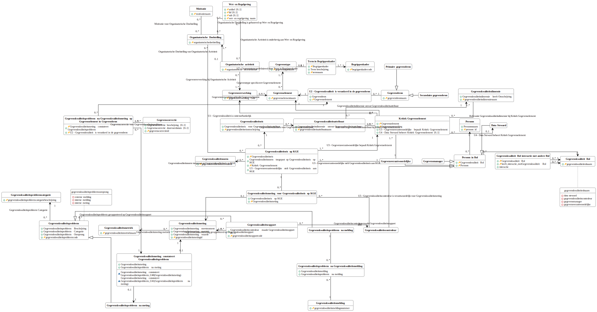

# Logische gegevensmodellen

## Gegevenskwaliteitsbeleid

Het logische model van de gegevens die nodig zijn om het gegevenskwaliteitsbeleid te implementeren wordt hieronder getoond.

<a href="./logische-modellen/gegevenskwaliteitsbeleid.uml.svg" target="_blank">Vergrote versie op nieuw tabblad</a>
