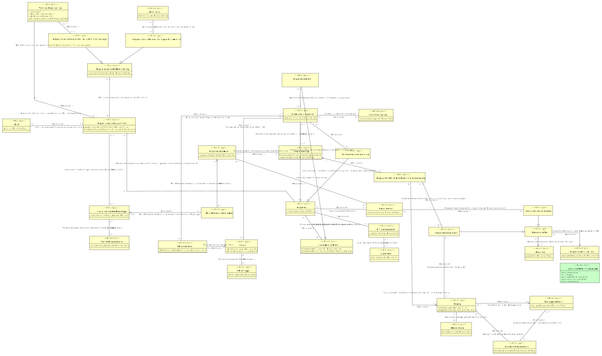

# CIM gegevenstyperingsbeleid

- [Administratie](#TAdministratie)
- [Algoritme](#TAlgoritme)
- [Begrip](#TBegrip)
- [Begrip beschrijft betekenis van Gegevenstype (U3)](#TBegrip-beschrijft-betekenis-van-Gegevenstype-U3-)
- [Begrippenkader](#TBegrippenkader)
- [Beschouwingsdomein](#TBeschouwingsdomein)
- [Definitiebron](#TDefinitiebron)
- [Gegeven](#TGegeven)
  - [Elementair gegeven](#TElementair-gegeven)
  - [Gestructureerd gegeven](#TGestructureerd-gegeven)
  - [Ongestructureerd gegeven](#TOngestructureerd-gegeven)
- [Gegevenselement](#TGegevenselement)
- [Gegevenskwaliteit Rol](#TGegevenskwaliteit-Rol)
- [Gegevensset](#TGegevensset)
- [Gegevenstype](#TGegevenstype)
- [Gegevensverwerkingstype](#TGegevensverwerkingstype)
- [Informatieobject](#TInformatieobject)
  - [Gegevensobject](#TGegevensobject)
- [Kritiek Gegevenselement](#TKritiek-Gegevenselement)
- [Motivatie](#TMotivatie)
- [Object](#TObject)
- [Objectrelatie](#TObjectrelatie)
- [Objecttype](#TObjecttype)
- [Organisatorische Doelstelling](#TOrganisatorische-Doelstelling)
  - [Organisatorische doelstelling o.b.v. motivatie](#TOrganisatorische-doelstelling-o-b-v-motivatie)
  - [Organisatorische doelstelling o.b.v. wet- en regelgeving](#TOrganisatorische-doelstelling-o-b-v-wet-en-regelgeving)
- [Organisatorische activiteit](#TOrganisatorische-activiteit)
- [Partij](#TPartij)
- [Persoon](#TPersoon)
- [Persoon in Rol](#TPersoon-in-Rol)
  - [Gegevensmodelleur](#TGegevensmodelleur)
  - [Gegevensverantwoordelijke](#TGegevensverantwoordelijke)
- [Uitvoeringsregel](#TUitvoeringsregel)
- [Verwerkingsdomein](#TVerwerkingsdomein)
- [Wet- en Regelgeving](#TWet-en-Regelgeving)

## Administratie {#TAdministratie}

|{: .def}||
|-|-|
|Begrip|[Administratie](#administratie)|
|Kenmerken|[administratienaam](#TAdministratie-administratienaam)|
|Relatie met|[Gegeven in Administratie](#TGegeven-in-Administratie)|

### administratienaam {#TAdministratie-administratienaam}

|{: .def}||
|-|-|
|Eigenschap van|[Administratie](#TAdministratie)|
|Type|CharacterString|

## Algoritme {#TAlgoritme}

|{: .def}||
|-|-|
|Begrip|[Algoritme](#algoritme)|
|Kenmerken|[algoritmenaam](#TAlgoritme-algoritmenaam)|
|Rollen|[Algoritme omvat Uitvoeringsregel](#TAlgoritme-omvat-Uitvoeringsregel)|

### algoritmenaam {#TAlgoritme-algoritmenaam}

|{: .def}||
|-|-|
|Eigenschap van|[Algoritme](#TAlgoritme)|
|Type|CharacterString|

### Algoritme omvat Uitvoeringsregel {#TAlgoritme-omvat-Uitvoeringsregel}

|{: .def}||
|-|-|
|Rol van|0..* [Algoritme](#TAlgoritme)|
|Met|0..* [Uitvoeringsregel](#TUitvoeringsregel)|

## Begrip {#TBegrip}

|{: .def}||
|-|-|
|Begrip|[Begrip](#begrip)|
|Kenmerken|[Begripsbeschrijving](#TBegripsbeschrijving), [voorkeursterm](#TBegrip-voorkeursterm)|
|Rollen|[Begrip gebruikt Definitiebron (U10)](#TBegrip-gebruikt-Definitiebron-U10-), [Begrip in relatie met Begrippenkader](#TBegrip-Begrippenkader), [Begrip is uniek binnen Beschouwingsdomein](#TBegrip-is-uniek-binnen-Beschouwingsdomein), [Gegevensmodelleur beschrijft Begrip (U5)](#TGegevensmodelleur-beschrijft-Begrip-U5-)|
|Relatie met|[Begrip beschrijft betekenis van Gegevenstype (U3) in relatie met Begrip](#TBegrip-beschrijft-betekenis-van-Gegevenstype-U3-Begrip)|

### voorkeursterm {#TBegrip-voorkeursterm}

|{: .def}||
|-|-|
|Begrip|[Voorkeursterm](#voorkeursterm)|
|Eigenschap van|[Begrip](#TBegrip)|
|Type|CharacterString|

### Begripsbeschrijving {#TBegripsbeschrijving}

|{: .def}||
|-|-|
|Eigenschap van|[Begrip](#TBegrip)|
|Type|[begrip beschrijving](#Tbegrip-beschrijving)|

### Begrip is uniek binnen Beschouwingsdomein {#TBegrip-is-uniek-binnen-Beschouwingsdomein}

|{: .def}||
|-|-|
|Rol van|0..* [Begrip](#TBegrip)|
|Met|0..* [Beschouwingsdomein](#TBeschouwingsdomein)|

### Gegevensmodelleur beschrijft Begrip (U5) {#TGegevensmodelleur-beschrijft-Begrip-U5-}

|{: .def}||
|-|-|
|Rol van|0..* [Begrip](#TBegrip)|
|Met|0..* [Gegevensmodelleur](#TGegevensmodelleur)|

### Begrip gebruikt Definitiebron (U10) {#TBegrip-gebruikt-Definitiebron-U10-}

|{: .def}||
|-|-|
|Rol van|0..* [Begrip](#TBegrip)|
|Met|0..* [Definitiebron](#TDefinitiebron)|

### Begrip in relatie met Begrippenkader {#TBegrip-Begrippenkader}

|{: .def}||
|-|-|
|Rol van|0..* [Begrip](#TBegrip)|
|Met|1..1 [Begrippenkader](#TBegrippenkader)|

## Begrip beschrijft betekenis van Gegevenstype (U3) {#TBegrip-beschrijft-betekenis-van-Gegevenstype-U3-}

|{: .def}||
|-|-|
|Rollen|[Begrip beschrijft betekenis van Gegevenstype (U3) in relatie met Begrip](#TBegrip-beschrijft-betekenis-van-Gegevenstype-U3-Begrip), [Begrip beschrijft betekenis van Gegevenstype (U3) in relatie met Gegevenstype](#TBegrip-beschrijft-betekenis-van-Gegevenstype-U3-Gegevenstype), [Gegevensmodelleur beschrijft relatie tussen Begrip en Gegevenstype](#TGegevensmodelleur-beschrijft-relatie-tussen-Begrip-en-Gegevenstype)|

### Begrip beschrijft betekenis van Gegevenstype (U3) in relatie met Gegevenstype {#TBegrip-beschrijft-betekenis-van-Gegevenstype-U3-Gegevenstype}

|{: .def}||
|-|-|
|Rol van|0..* [Begrip beschrijft betekenis van Gegevenstype (U3)](#TBegrip-beschrijft-betekenis-van-Gegevenstype-U3-)|
|Met|1..1 [Gegevenstype](#TGegevenstype)|

### Begrip beschrijft betekenis van Gegevenstype (U3) in relatie met Begrip {#TBegrip-beschrijft-betekenis-van-Gegevenstype-U3-Begrip}

|{: .def}||
|-|-|
|Rol van|0..* [Begrip beschrijft betekenis van Gegevenstype (U3)](#TBegrip-beschrijft-betekenis-van-Gegevenstype-U3-)|
|Met|1..1 [Begrip](#TBegrip)|

### Gegevensmodelleur beschrijft relatie tussen Begrip en Gegevenstype {#TGegevensmodelleur-beschrijft-relatie-tussen-Begrip-en-Gegevenstype}

|{: .def}||
|-|-|
|Rol van|0..* [Begrip beschrijft betekenis van Gegevenstype (U3)](#TBegrip-beschrijft-betekenis-van-Gegevenstype-U3-)|
|Met|0..* [Gegevensmodelleur](#TGegevensmodelleur)|

## Begrippenkader {#TBegrippenkader}

|{: .def}||
|-|-|
|Begrip|[Begrippenkader](#begrippenkader)|
|Kenmerken|[begrippenkadercode](#TBegrippenkader-begrippenkadercode)|
|Relatie met|[Begrip in relatie met Begrippenkader](#TBegrip-Begrippenkader), [Begrippenkader beschrijft Beschouwingsdomein (U1)](#TBegrippenkader-beschrijft-Beschouwingsdomein-U1-)|

### begrippenkadercode {#TBegrippenkader-begrippenkadercode}

|{: .def}||
|-|-|
|Eigenschap van|[Begrippenkader](#TBegrippenkader)|
|Type|CharacterString|

## Beschouwingsdomein {#TBeschouwingsdomein}

|{: .def}||
|-|-|
|Begrip|[Beschouwingsdomein](#beschouwingsdomein)|
|Kenmerken|[Beschouwingsdomeinnaam](#TBeschouwingsdomein-Beschouwingsdomeinnaam)|
|Rollen|[Begrippenkader beschrijft Beschouwingsdomein (U1)](#TBegrippenkader-beschrijft-Beschouwingsdomein-U1-)|
|Relatie met|[Begrip is uniek binnen Beschouwingsdomein](#TBegrip-is-uniek-binnen-Beschouwingsdomein)|

### Beschouwingsdomeinnaam {#TBeschouwingsdomein-Beschouwingsdomeinnaam}

|{: .def}||
|-|-|
|Eigenschap van|[Beschouwingsdomein](#TBeschouwingsdomein)|
|Type|CharacterString|

### Begrippenkader beschrijft Beschouwingsdomein (U1) {#TBegrippenkader-beschrijft-Beschouwingsdomein-U1-}

|{: .def}||
|-|-|
|Rol van|0..* [Beschouwingsdomein](#TBeschouwingsdomein)|
|Met|0..* [Begrippenkader](#TBegrippenkader)|

## Definitiebron {#TDefinitiebron}

|{: .def}||
|-|-|
|Kenmerken|[definitiebron naam](#TDefinitiebron-definitiebron-naam)|
|Relatie met|[Begrip gebruikt Definitiebron (U10)](#TBegrip-gebruikt-Definitiebron-U10-)|

### definitiebron naam {#TDefinitiebron-definitiebron-naam}

|{: .def}||
|-|-|
|Eigenschap van|[Definitiebron](#TDefinitiebron)|
|Type|CharacterString|

## Elementair gegeven {#TElementair-gegeven}

|{: .def}||
|-|-|
|Begrip|[Elementair gegeven](#elementair-gegeven)|
|Supertype|[Gegeven](#TGegeven)|
|Relatie met|[Gegevensobject is geheel van Elementaire gegevens](#TGegevensobject-is-geheel-van-Elementaire-gegevens), [Gegevenstype typeert gelijksoortig Elementair gegeven](#TGegevenstype-typeert-gelijksoortig-Elementair-gegeven), [Gestructureerd gegeven wordt opgebouwd uit Elementaire gegevens](#TGestructureerd-gegeven-wordt-opgebouwd-uit-Elementaire-gegevens)|

## Gegeven {#TGegeven}

|{: .def}||
|-|-|
|Begrip|[Gegeven](#gegeven)|
|Subtype(s)|[Elementair gegeven](#TElementair-gegeven), [Ongestructureerd gegeven](#TOngestructureerd-gegeven), [Gestructureerd gegeven](#TGestructureerd-gegeven)|
|Kenmerken|[Registratietijd](#TRegistratietijd), [vastgelegde uitspraak](#TGegeven-vastgelegde-uitspraak)|
|Rollen|[Gegeven in Administratie](#TGegeven-in-Administratie), [Informatieobject is geheel van Gegevens](#TInformatieobject-is-geheel-van-Gegevens), [Uitspraak over eigenschap van Object (U1)](#TUitspraak-over-eigenschap-van-Object-U1-), [Uitspraak over eigenschap van Objectrelatie (U1)](#TUitspraak-over-eigenschap-van-Objectrelatie-U1-)|
|Relatie met|[Gegevensset bevat Gegeven](#TGegevensset-bevat-Gegeven), [Organisatorische activiteit bepaalt pragmatische betekenis van Gegeven (U4)](#TOrganisatorische-activiteit-bepaalt-pragmatische-betekenis-van-Gegeven-U4-), [Uitvoeringsregel bepaalt pragmatische betekenis van Gegeven (U4)](#TUitvoeringsregel-bepaalt-pragmatische-betekenis-van-Gegeven-U4-)|

### vastgelegde uitspraak {#TGegeven-vastgelegde-uitspraak}

|{: .def}||
|-|-|
|Begrip|[Vastgelegde uitspraak](#vastgelegde-uitspraak)|
|Eigenschap van|[Gegeven](#TGegeven)|
|Type|CharacterString|

### Registratietijd {#TRegistratietijd}

|{: .def}||
|-|-|
|Begrip|[Registratietijd](#registratietijd)|
|Eigenschap van|[Gegeven](#TGegeven)|
|Type|[registratietijdslijn](#Tregistratietijdslijn)|

### Uitspraak over eigenschap van Objectrelatie (U1) {#TUitspraak-over-eigenschap-van-Objectrelatie-U1-}

|{: .def}||
|-|-|
|Rol van|0..* [Gegeven](#TGegeven)|
|Met|0..* [Objectrelatie](#TObjectrelatie)|

### Informatieobject is geheel van Gegevens {#TInformatieobject-is-geheel-van-Gegevens}

|{: .def}||
|-|-|
|Rol van|0..* [Gegeven](#TGegeven)|
|Met|0..* [Informatieobject](#TInformatieobject)|

### Uitspraak over eigenschap van Object (U1) {#TUitspraak-over-eigenschap-van-Object-U1-}

|{: .def}||
|-|-|
|Rol van|0..* [Gegeven](#TGegeven)|
|Met|0..* [Object](#TObject)|

### Gegeven in Administratie {#TGegeven-in-Administratie}

|{: .def}||
|-|-|
|Rol van|0..* [Gegeven](#TGegeven)|
|Met|0..* [Administratie](#TAdministratie)|

## Gegevenselement {#TGegevenselement}

|{: .def}||
|-|-|
|Begrip|[Gegevenselement](#gegevenselement)|
|Kenmerken|[gegevenselementnaam](#TGegevenselement-gegevenselementnaam)|
|Rollen|[Gegevenselement bij Gegevensset](#TGegevenselement-bij-Gegevensset), [Gegevenselement wordt gespecificeerd door Gegevenstype](#TGegevenselement-wordt-gespecificeerd-door-Gegevenstype)|
|Relatie met|[Kritiek Gegevenselement in relatie met Gegevenselement](#TKritiek-Gegevenselement-Gegevenselement)|

### gegevenselementnaam {#TGegevenselement-gegevenselementnaam}

|{: .def}||
|-|-|
|Eigenschap van|[Gegevenselement](#TGegevenselement)|
|Type|CharacterString|

### Gegevenselement wordt gespecificeerd door Gegevenstype {#TGegevenselement-wordt-gespecificeerd-door-Gegevenstype}

|{: .def}||
|-|-|
|Rol van|0..* [Gegevenselement](#TGegevenselement)|
|Met|0..* [Gegevenstype](#TGegevenstype)|

### Gegevenselement bij Gegevensset {#TGegevenselement-bij-Gegevensset}

|{: .def}||
|-|-|
|Rol van|0..* [Gegevenselement](#TGegevenselement)|
|Met|0..* [Gegevensset](#TGegevensset)|

## Gegevenskwaliteit Rol {#TGegevenskwaliteit-Rol}

|{: .def}||
|-|-|
|Kenmerken|[gegevenskwaliteitrolnaam](#TGegevenskwaliteit-Rol-gegevenskwaliteitrolnaam)|
|Relatie met|[Persoon in Rol in relatie met Gegevenskwaliteit Rol](#TPersoon-in-Rol-Gegevenskwaliteit-Rol)|

### gegevenskwaliteitrolnaam {#TGegevenskwaliteit-Rol-gegevenskwaliteitrolnaam}

|{: .def}||
|-|-|
|Eigenschap van|[Gegevenskwaliteit Rol](#TGegevenskwaliteit-Rol)|
|Type|CharacterString|

## Gegevensmodelleur {#TGegevensmodelleur}

|{: .def}||
|-|-|
|Supertype|[Persoon in Rol](#TPersoon-in-Rol)|
|Relatie met|[Gegevensmodelleur beschrijft Begrip (U5)](#TGegevensmodelleur-beschrijft-Begrip-U5-), [Gegevensmodelleur beschrijft relatie tussen Begrip en Gegevenstype](#TGegevensmodelleur-beschrijft-relatie-tussen-Begrip-en-Gegevenstype)|

## Gegevensobject {#TGegevensobject}

|{: .def}||
|-|-|
|Begrip|[Gegevensobject](#gegevensobject)|
|Supertype|[Informatieobject](#TInformatieobject)|
|Rollen|[Gegevensobject is geheel van Elementaire gegevens](#TGegevensobject-is-geheel-van-Elementaire-gegevens)|

### Gegevensobject is geheel van Elementaire gegevens {#TGegevensobject-is-geheel-van-Elementaire-gegevens}

|{: .def}||
|-|-|
|Rol van|0..* [Gegevensobject](#TGegevensobject)|
|Met|0..* [Elementair gegeven](#TElementair-gegeven)|

## Gegevensset {#TGegevensset}

|{: .def}||
|-|-|
|Begrip|[Gegevensset](#gegevensset)|
|Kenmerken|[gegevenssetcode](#TGegevensset-gegevenssetcode)|
|Rollen|[Gegevensset bevat Gegeven](#TGegevensset-bevat-Gegeven), [Gegevensverantwoordelijke is verantwoordelijk voor Gegevensset](#TGegevensverantwoordelijke-is-verantwoordelijk-voor-Gegevensset)|
|Relatie met|[Gegevenselement bij Gegevensset](#TGegevenselement-bij-Gegevensset)|

### gegevenssetcode {#TGegevensset-gegevenssetcode}

|{: .def}||
|-|-|
|Eigenschap van|[Gegevensset](#TGegevensset)|
|Type|CharacterString|

### Gegevensverantwoordelijke is verantwoordelijk voor Gegevensset {#TGegevensverantwoordelijke-is-verantwoordelijk-voor-Gegevensset}

|{: .def}||
|-|-|
|Rol van|0..* [Gegevensset](#TGegevensset)|
|Met|0..* [Gegevensverantwoordelijke](#TGegevensverantwoordelijke)|

### Gegevensset bevat Gegeven {#TGegevensset-bevat-Gegeven}

|{: .def}||
|-|-|
|Rol van|0..* [Gegevensset](#TGegevensset)|
|Met|0..* [Gegeven](#TGegeven)|

## Gegevenstype {#TGegevenstype}

|{: .def}||
|-|-|
|Begrip|[Gegevenstype](#gegevenstype)|
|Kenmerken|[Naam gegevenstype](#TNaam-gegevenstype), [gegevenstype code](#TGegevenstype-gegevenstype-code)|
|Rollen|[Gegevenstype typeert gelijksoortig Elementair gegeven](#TGegevenstype-typeert-gelijksoortig-Elementair-gegeven)|
|Relatie met|[Begrip beschrijft betekenis van Gegevenstype (U3) in relatie met Gegevenstype](#TBegrip-beschrijft-betekenis-van-Gegevenstype-U3-Gegevenstype), [Gegevenselement wordt gespecificeerd door Gegevenstype](#TGegevenselement-wordt-gespecificeerd-door-Gegevenstype)|

### Naam gegevenstype {#TNaam-gegevenstype}

|{: .def}||
|-|-|
|Eigenschap van|[Gegevenstype](#TGegevenstype)|
|Type|[gegevenstypenaam](#Tgegevenstypenaam)|

### gegevenstype code {#TGegevenstype-gegevenstype-code}

|{: .def}||
|-|-|
|Eigenschap van|[Gegevenstype](#TGegevenstype)|
|Type|CharacterString|

### Gegevenstype typeert gelijksoortig Elementair gegeven {#TGegevenstype-typeert-gelijksoortig-Elementair-gegeven}

|{: .def}||
|-|-|
|Rol van|0..* [Gegevenstype](#TGegevenstype)|
|Met|0..* [Elementair gegeven](#TElementair-gegeven)|

## Gegevensverantwoordelijke {#TGegevensverantwoordelijke}

|{: .def}||
|-|-|
|Begrip|[Gegevensverantwoordelijke](#gegevensverantwoordelijke)|
|Supertype|[Persoon in Rol](#TPersoon-in-Rol)|
|Relatie met|[Gegevensverantwoordelijke is verantwoordelijk voor Gegevensset](#TGegevensverantwoordelijke-is-verantwoordelijk-voor-Gegevensset)|

## Gegevensverwerkingstype {#TGegevensverwerkingstype}

|{: .def}||
|-|-|
|Begrip|[Gegevensverwerkingstype](#gegevensverwerkingstype)|
|Kenmerken|[gegevensverwerkingstypecode](#TGegevensverwerkingstype-gegevensverwerkingstypecode)|
|Rollen|[Gegevensverwerkingstype in Organisatorische activiteit](#TGegevensverwerkingstype-in-Organisatorische-activiteit)|
|Relatie met|[Kritiek Gegevenselement in relatie met Gegevensverwerkingstype](#TKritiek-Gegevenselement-Gegevensverwerkingstype), [Verwerkingsdomein bestaat uit Gegevensverwerkingstype](#TVerwerkingsdomein-bestaat-uit-Gegevensverwerkingstype)|

### gegevensverwerkingstypecode {#TGegevensverwerkingstype-gegevensverwerkingstypecode}

|{: .def}||
|-|-|
|Eigenschap van|[Gegevensverwerkingstype](#TGegevensverwerkingstype)|
|Type|CharacterString|

### Gegevensverwerkingstype in Organisatorische activiteit {#TGegevensverwerkingstype-in-Organisatorische-activiteit}

|{: .def}||
|-|-|
|Rol van|0..* [Gegevensverwerkingstype](#TGegevensverwerkingstype)|
|Met|0..* [Organisatorische activiteit](#TOrganisatorische-activiteit)|

## Gestructureerd gegeven {#TGestructureerd-gegeven}

|{: .def}||
|-|-|
|Supertype|[Gegeven](#TGegeven)|
|Rollen|[Gestructureerd gegeven wordt opgebouwd uit Elementaire gegevens](#TGestructureerd-gegeven-wordt-opgebouwd-uit-Elementaire-gegevens)|

### Gestructureerd gegeven wordt opgebouwd uit Elementaire gegevens {#TGestructureerd-gegeven-wordt-opgebouwd-uit-Elementaire-gegevens}

|{: .def}||
|-|-|
|Rol van|0..* [Gestructureerd gegeven](#TGestructureerd-gegeven)|
|Met|0..* [Elementair gegeven](#TElementair-gegeven)|

## Informatieobject {#TInformatieobject}

|{: .def}||
|-|-|
|Begrip|[Informatieobject](#informatieobject)|
|Subtype(s)|[Gegevensobject](#TGegevensobject)|
|Kenmerken|[Informatieobject identiteit](#TInformatieobject-Informatieobject-identiteit), [Informatieobjectverwijzing](#TInformatieobjectverwijzing)|
|Relatie met|[Informatieobject is geheel van Gegevens](#TInformatieobject-is-geheel-van-Gegevens)|

### Informatieobject identiteit {#TInformatieobject-Informatieobject-identiteit}

|{: .def}||
|-|-|
|Eigenschap van|[Informatieobject](#TInformatieobject)|
|Type|CharacterString|

### Informatieobjectverwijzing {#TInformatieobjectverwijzing}

|{: .def}||
|-|-|
|Eigenschap van|[Informatieobject](#TInformatieobject)|
|Type|[Informatieobject verwijzing](#TInformatieobject-verwijzing)|

## Kritiek Gegevenselement {#TKritiek-Gegevenselement}

|{: .def}||
|-|-|
|Begrip|[Kritiek gegevenselement](#kritiek-gegevenselement)|
|Rollen|[Kritiek Gegevenselement in relatie met Gegevenselement](#TKritiek-Gegevenselement-Gegevenselement), [Kritiek Gegevenselement in relatie met Gegevensverwerkingstype](#TKritiek-Gegevenselement-Gegevensverwerkingstype)|

### Kritiek Gegevenselement in relatie met Gegevenselement {#TKritiek-Gegevenselement-Gegevenselement}

|{: .def}||
|-|-|
|Rol van|0..* [Kritiek Gegevenselement](#TKritiek-Gegevenselement)|
|Met|1..1 [Gegevenselement](#TGegevenselement)|

### Kritiek Gegevenselement in relatie met Gegevensverwerkingstype {#TKritiek-Gegevenselement-Gegevensverwerkingstype}

|{: .def}||
|-|-|
|Rol van|0..* [Kritiek Gegevenselement](#TKritiek-Gegevenselement)|
|Met|1..1 [Gegevensverwerkingstype](#TGegevensverwerkingstype)|

## Motivatie {#TMotivatie}

|{: .def}||
|-|-|
|Kenmerken|[motivatienaam](#TMotivatie-motivatienaam)|
|Rollen|[Motivatie voor Organisatorische Doelstelling](#TMotivatie-voor-Organisatorische-Doelstelling)|

### motivatienaam {#TMotivatie-motivatienaam}

|{: .def}||
|-|-|
|Eigenschap van|[Motivatie](#TMotivatie)|
|Type|CharacterString|

### Motivatie voor Organisatorische Doelstelling {#TMotivatie-voor-Organisatorische-Doelstelling}

|{: .def}||
|-|-|
|Rol van|0..* [Motivatie](#TMotivatie)|
|Met|0..* [Organisatorische doelstelling o.b.v. motivatie](#TOrganisatorische-doelstelling-o-b-v-motivatie)|

## Object {#TObject}

|{: .def}||
|-|-|
|Begrip|[Object](#object)|
|Kenmerken|[Objectgeldigheidstijd](#TObjectgeldigheidstijd), [objectbeschrijving](#TObject-objectbeschrijving)|
|Relatie met|[Objectrelatie in relatie met Object](#TObjectrelatie-Object), [Objecttype groepeert Object](#TObjecttype-groepeert-Object), [Uitspraak over eigenschap van Object (U1)](#TUitspraak-over-eigenschap-van-Object-U1-)|

### objectbeschrijving {#TObject-objectbeschrijving}

|{: .def}||
|-|-|
|Eigenschap van|[Object](#TObject)|
|Type|CharacterString|

### Objectgeldigheidstijd {#TObjectgeldigheidstijd}

|{: .def}||
|-|-|
|Eigenschap van|[Object](#TObject)|
|Type|[geldigheidstijdslijn](#Tgeldigheidstijdslijn)|

## Objectrelatie {#TObjectrelatie}

|{: .def}||
|-|-|
|Begrip|[Objectrelatie](#objectrelatie)|
|Kenmerken|[Objectrelatie geldigheidstijd](#TObjectrelatie-geldigheidstijd)|
|Rollen|[Objectrelatie in relatie met Object](#TObjectrelatie-Object)|
|Relatie met|[Uitspraak over eigenschap van Objectrelatie (U1)](#TUitspraak-over-eigenschap-van-Objectrelatie-U1-)|

### Objectrelatie geldigheidstijd {#TObjectrelatie-geldigheidstijd}

|{: .def}||
|-|-|
|Eigenschap van|[Objectrelatie](#TObjectrelatie)|
|Type|[geldigheidstijdslijn](#Tgeldigheidstijdslijn)|

### Objectrelatie in relatie met Object {#TObjectrelatie-Object}

|{: .def}||
|-|-|
|Rol van|0..* [Objectrelatie](#TObjectrelatie)|
|Met|1..1 [Object](#TObject)|

## Objecttype {#TObjecttype}

|{: .def}||
|-|-|
|Begrip|[Objecttype](#objecttype)|
|Kenmerken|[objecttypenaam](#TObjecttype-objecttypenaam)|
|Rollen|[Objecttype groepeert Object](#TObjecttype-groepeert-Object)|

### objecttypenaam {#TObjecttype-objecttypenaam}

|{: .def}||
|-|-|
|Eigenschap van|[Objecttype](#TObjecttype)|
|Type|[objecttypenaam](#Tobjecttypenaam)|

### Objecttype groepeert Object {#TObjecttype-groepeert-Object}

|{: .def}||
|-|-|
|Rol van|0..* [Objecttype](#TObjecttype)|
|Met|0..* [Object](#TObject)|

## Ongestructureerd gegeven {#TOngestructureerd-gegeven}

|{: .def}||
|-|-|
|Supertype|[Gegeven](#TGegeven)|

## Organisatorische Doelstelling {#TOrganisatorische-Doelstelling}

|{: .def}||
|-|-|
|Subtype(s)|[Organisatorische doelstelling o.b.v. wet- en regelgeving](#TOrganisatorische-doelstelling-o-b-v-wet-en-regelgeving), [Organisatorische doelstelling o.b.v. motivatie](#TOrganisatorische-doelstelling-o-b-v-motivatie)|
|Kenmerken|[organisatorischedoelstelling](#TOrganisatorische-Doelstelling-organisatorischedoelstelling)|
|Rollen|[Grondslag van Organisatorische Activiteit](#TGrondslag-van-Organisatorische-Activiteit)|

### organisatorischedoelstelling {#TOrganisatorische-Doelstelling-organisatorischedoelstelling}

|{: .def}||
|-|-|
|Eigenschap van|[Organisatorische Doelstelling](#TOrganisatorische-Doelstelling)|
|Type|CharacterString|

### Grondslag van Organisatorische Activiteit {#TGrondslag-van-Organisatorische-Activiteit}

|{: .def}||
|-|-|
|Rol van|0..* [Organisatorische Doelstelling](#TOrganisatorische-Doelstelling)|
|Met|0..* [Organisatorische activiteit](#TOrganisatorische-activiteit)|

## Organisatorische activiteit {#TOrganisatorische-activiteit}

|{: .def}||
|-|-|
|Begrip|[Organisatorische activiteit](#organisatorische-activiteit)|
|Subtype(s)||
|Kenmerken|[Naam organisatorische activiteit](#TNaam-organisatorische-activiteit), [organisatorische activiteit code](#TOrganisatorische-activiteit-organisatorische-activiteit-code)|
|Rollen|[Organisatorische Activiteit is onderhevig aan Wet- en Regelgeving](#TOrganisatorische-Activiteit-is-onderhevig-aan-Wet-en-Regelgeving), [Organisatorische activiteit bepaalt pragmatische betekenis van Gegeven (U4)](#TOrganisatorische-activiteit-bepaalt-pragmatische-betekenis-van-Gegeven-U4-), [Partij verantwoordelijk voor Organisatorische activiteit](#TPartij-verantwoordelijk-voor-Organisatorische-activiteit)|
|Relatie met|[Gegevensverwerkingstype in Organisatorische activiteit](#TGegevensverwerkingstype-in-Organisatorische-activiteit), [Grondslag van Organisatorische Activiteit](#TGrondslag-van-Organisatorische-Activiteit)|

### organisatorische activiteit code {#TOrganisatorische-activiteit-organisatorische-activiteit-code}

|{: .def}||
|-|-|
|Eigenschap van|[Organisatorische activiteit](#TOrganisatorische-activiteit)|
|Type|CharacterString|

### Naam organisatorische activiteit {#TNaam-organisatorische-activiteit}

|{: .def}||
|-|-|
|Eigenschap van|[Organisatorische activiteit](#TOrganisatorische-activiteit)|
|Type|[organisatorische activiteit naam](#Torganisatorische-activiteit-naam)|

### Partij verantwoordelijk voor Organisatorische activiteit {#TPartij-verantwoordelijk-voor-Organisatorische-activiteit}

|{: .def}||
|-|-|
|Rol van|0..* [Organisatorische activiteit](#TOrganisatorische-activiteit)|
|Met|0..* [Partij](#TPartij)|

### Organisatorische activiteit bepaalt pragmatische betekenis van Gegeven (U4) {#TOrganisatorische-activiteit-bepaalt-pragmatische-betekenis-van-Gegeven-U4-}

|{: .def}||
|-|-|
|Rol van|0..* [Organisatorische activiteit](#TOrganisatorische-activiteit)|
|Met|0..* [Gegeven](#TGegeven)|

### Organisatorische Activiteit is onderhevig aan Wet- en Regelgeving {#TOrganisatorische-Activiteit-is-onderhevig-aan-Wet-en-Regelgeving}

|{: .def}||
|-|-|
|Rol van|0..* [Organisatorische activiteit](#TOrganisatorische-activiteit)|
|Met|0..* [Wet- en Regelgeving](#TWet-en-Regelgeving)|

## Organisatorische doelstelling o.b.v. motivatie {#TOrganisatorische-doelstelling-o-b-v-motivatie}

|{: .def}||
|-|-|
|Supertype|[Organisatorische Doelstelling](#TOrganisatorische-Doelstelling)|
|Relatie met|[Motivatie voor Organisatorische Doelstelling](#TMotivatie-voor-Organisatorische-Doelstelling)|

## Organisatorische doelstelling o.b.v. wet- en regelgeving {#TOrganisatorische-doelstelling-o-b-v-wet-en-regelgeving}

|{: .def}||
|-|-|
|Supertype|[Organisatorische Doelstelling](#TOrganisatorische-Doelstelling)|
|Rollen|[Wettelijke grondslag voor Organisatorische Doelstelling o.b.v. Wet- en regelgeving](#TWettelijke-grondslag-voor-Organisatorische-Doelstelling-o-b-v-Wet-en-regelgeving)|

### Wettelijke grondslag voor Organisatorische Doelstelling o.b.v. Wet- en regelgeving {#TWettelijke-grondslag-voor-Organisatorische-Doelstelling-o-b-v-Wet-en-regelgeving}

|{: .def}||
|-|-|
|Rol van|0..* [Organisatorische doelstelling o.b.v. wet- en regelgeving](#TOrganisatorische-doelstelling-o-b-v-wet-en-regelgeving)|
|Met|0..* [Wet- en Regelgeving](#TWet-en-Regelgeving)|

## Partij {#TPartij}

|{: .def}||
|-|-|
|Kenmerken|[partij id](#TPartij-partij-id)|
|Relatie met|[Partij verantwoordelijk voor Organisatorische activiteit](#TPartij-verantwoordelijk-voor-Organisatorische-activiteit)|

### partij id {#TPartij-partij-id}

|{: .def}||
|-|-|
|Eigenschap van|[Partij](#TPartij)|
|Type|CharacterString|

## Persoon {#TPersoon}

|{: .def}||
|-|-|
|Kenmerken|[persoon id](#TPersoon-persoon-id)|
|Relatie met|[Persoon in Rol in relatie met Persoon](#TPersoon-in-Rol-Persoon)|

### persoon id {#TPersoon-persoon-id}

|{: .def}||
|-|-|
|Eigenschap van|[Persoon](#TPersoon)|
|Type|CharacterString|

## Persoon in Rol {#TPersoon-in-Rol}

|{: .def}||
|-|-|
|Subtype(s)|[Gegevensmodelleur](#TGegevensmodelleur), [Gegevensverantwoordelijke](#TGegevensverantwoordelijke)|
|Rollen|[Persoon in Rol in relatie met Gegevenskwaliteit Rol](#TPersoon-in-Rol-Gegevenskwaliteit-Rol), [Persoon in Rol in relatie met Persoon](#TPersoon-in-Rol-Persoon)|

### Persoon in Rol in relatie met Gegevenskwaliteit Rol {#TPersoon-in-Rol-Gegevenskwaliteit-Rol}

|{: .def}||
|-|-|
|Rol van|0..* [Persoon in Rol](#TPersoon-in-Rol)|
|Met|1..1 [Gegevenskwaliteit Rol](#TGegevenskwaliteit-Rol)|

### Persoon in Rol in relatie met Persoon {#TPersoon-in-Rol-Persoon}

|{: .def}||
|-|-|
|Rol van|0..* [Persoon in Rol](#TPersoon-in-Rol)|
|Met|1..1 [Persoon](#TPersoon)|

## Uitvoeringsregel {#TUitvoeringsregel}

|{: .def}||
|-|-|
|Begrip|[Uitvoeringsregel](#uitvoeringsregel)|
|Kenmerken|[regelbeschrijving](#TUitvoeringsregel-regelbeschrijving)|
|Rollen|[Uitvoeringsregel bepaalt pragmatische betekenis van Gegeven (U4)](#TUitvoeringsregel-bepaalt-pragmatische-betekenis-van-Gegeven-U4-)|
|Relatie met|[Algoritme omvat Uitvoeringsregel](#TAlgoritme-omvat-Uitvoeringsregel)|

### regelbeschrijving {#TUitvoeringsregel-regelbeschrijving}

|{: .def}||
|-|-|
|Eigenschap van|[Uitvoeringsregel](#TUitvoeringsregel)|
|Type|CharacterString|

### Uitvoeringsregel bepaalt pragmatische betekenis van Gegeven (U4) {#TUitvoeringsregel-bepaalt-pragmatische-betekenis-van-Gegeven-U4-}

|{: .def}||
|-|-|
|Rol van|0..* [Uitvoeringsregel](#TUitvoeringsregel)|
|Met|0..* [Gegeven](#TGegeven)|

## Verwerkingsdomein {#TVerwerkingsdomein}

|{: .def}||
|-|-|
|Begrip|[Verwerkingsdomein](#verwerkingsdomein)|
|Kenmerken|[verwerkingsdomeinnaam](#TVerwerkingsdomein-verwerkingsdomeinnaam)|
|Rollen|[Verwerkingsdomein bestaat uit Gegevensverwerkingstype](#TVerwerkingsdomein-bestaat-uit-Gegevensverwerkingstype)|

### verwerkingsdomeinnaam {#TVerwerkingsdomein-verwerkingsdomeinnaam}

|{: .def}||
|-|-|
|Eigenschap van|[Verwerkingsdomein](#TVerwerkingsdomein)|
|Type|CharacterString|

### Verwerkingsdomein bestaat uit Gegevensverwerkingstype {#TVerwerkingsdomein-bestaat-uit-Gegevensverwerkingstype}

|{: .def}||
|-|-|
|Rol van|0..* [Verwerkingsdomein](#TVerwerkingsdomein)|
|Met|0..* [Gegevensverwerkingstype](#TGegevensverwerkingstype)|

## Wet- en Regelgeving {#TWet-en-Regelgeving}

|{: .def}||
|-|-|
|Kenmerken|[artikel](#TWet-en-Regelgeving-artikel), [lid](#TWet-en-Regelgeving-lid), [sub](#TWet-en-Regelgeving-sub), [wet- en regelgeving naam](#TWet-en-Regelgeving-wet-en-regelgeving-naam)|
|Relatie met|[Organisatorische Activiteit is onderhevig aan Wet- en Regelgeving](#TOrganisatorische-Activiteit-is-onderhevig-aan-Wet-en-Regelgeving), [Wettelijke grondslag voor Organisatorische Doelstelling o.b.v. Wet- en regelgeving](#TWettelijke-grondslag-voor-Organisatorische-Doelstelling-o-b-v-Wet-en-regelgeving)|

### lid {#TWet-en-Regelgeving-lid}

|{: .def}||
|-|-|
|Eigenschap van|[Wet- en Regelgeving](#TWet-en-Regelgeving)|
|Type|Integer|

### artikel {#TWet-en-Regelgeving-artikel}

|{: .def}||
|-|-|
|Eigenschap van|[Wet- en Regelgeving](#TWet-en-Regelgeving)|
|Type|CharacterString|

### sub {#TWet-en-Regelgeving-sub}

|{: .def}||
|-|-|
|Eigenschap van|[Wet- en Regelgeving](#TWet-en-Regelgeving)|
|Type|CharacterString|

### wet- en regelgeving naam {#TWet-en-Regelgeving-wet-en-regelgeving-naam}

|{: .def}||
|-|-|
|Eigenschap van|[Wet- en Regelgeving](#TWet-en-Regelgeving)|
|Type|CharacterString|

## Waardetypering en referentielijsten

### Informatieobject verwijzing {#TInformatieobject-verwijzing}

|{: .def}||
|-|-|
|Gebaseerd op|CharacterString|

### begrip beschrijving {#Tbegrip-beschrijving}

|{: .def}||
|-|-|
|Gebaseerd op|CharacterString|

### gegevenstypenaam {#Tgegevenstypenaam}

|{: .def}||
|-|-|
|Gebaseerd op|CharacterString|

### geldigheidstijdslijn {#Tgeldigheidstijdslijn}

|{: .def}||
|-|-|

### naam {#Tnaam}

|{: .def}||
|-|-|
|Gebaseerd op|CharacterString|

### objecttypenaam {#Tobjecttypenaam}

|{: .def}||
|-|-|

### organisatorische activiteit naam {#Torganisatorische-activiteit-naam}

|{: .def}||
|-|-|
|Gebaseerd op|[naam](#Tnaam)|

### registratietijdslijn {#Tregistratietijdslijn}

|{: .def}||
|-|-|

### gegevenskwaliteitrolnaam {#Tgegevenskwaliteitrolnaam}

De volgende waarden zijn mogelijk:
- data steward
- gegevenskwaliteitscontroleur
- gegevensmanager
- gegevensmodelleur
- [gegevensverantwoordelijke](#gegevensverantwoordelijke)

