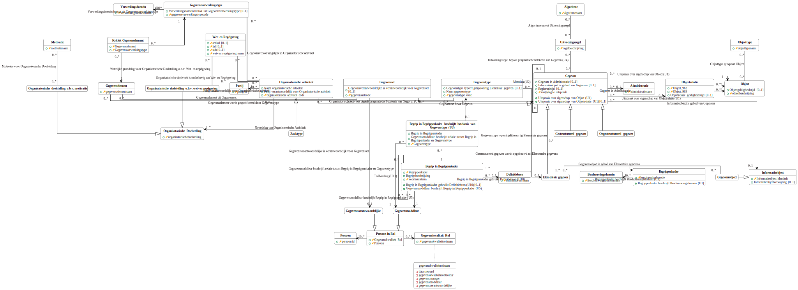
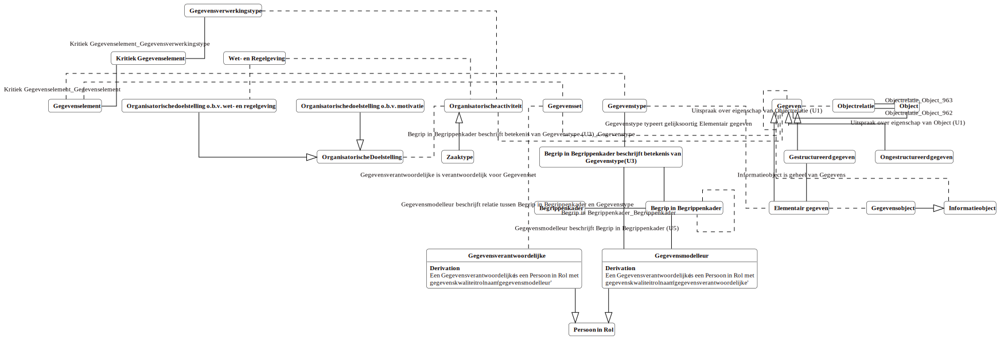

# Logische gegevensmodellen

## Gegevenstyperingsbeleid

Het logische model van de gegevens die nodig zijn om het gegevenstyperingsbeleid te implementeren wordt hieronder getoond.

<a href="./logische-modellen/gegevenstyperingsbeleid.uml.svg" target="_blank">Vergrote versie LDM op nieuw tabblad</a>

De afleidingsregels die bij de gegevens horen die nodig zijn om het gegevenstyperingsbeleid te implementeren wordt hieronder getoond.

<a href="./logische-modellen/gegevenstyperingsbeleid.map.svg" target="_blank">Vergrote versie DRM op nieuw tabblad</a>

