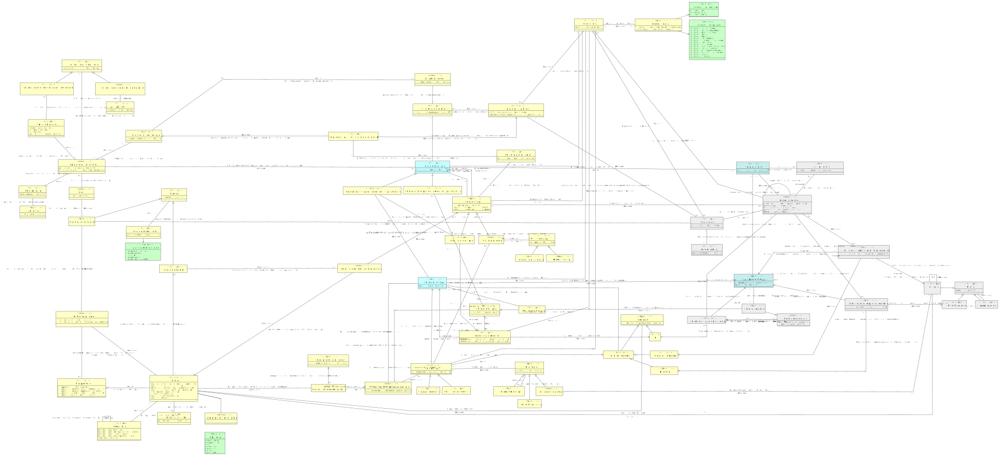

# CIM gegevenstyperingsbeleid

- [Algoritme](#TAlgoritme)
- [Attribuuttype](#TAttribuuttype)
  - [Classificerend attribuuttype](#TClassificerend-attribuuttype)
  - [Concreet Attribuuttype](#TConcreet-Attribuuttype)
- [Begrip](#TBegrip)
- [Begrippenkader](#TBegrippenkader)
- [Benoemd conceptueel modelelement](#TBenoemd-conceptueel-modelelement)
- [Beschouwingsdomein](#TBeschouwingsdomein)
- [Binaire Domeinrelatie](#TBinaire-Domeinrelatie)
  - [Relatiedomeinobject](#TRelatiedomeinobject)
- [Classificatie](#TClassificatie)
- [Classificatietype](#TClassificatietype)
- [Conceptueel informatiemodel](#TConceptueel-informatiemodel)
- [Conceptueel informatiemodelelement](#TConceptueel-informatiemodelelement)
- [Datatype](#TDatatype)
  - [Gestructureerd datatype](#TGestructureerd-datatype)
  - [Primitief datatype](#TPrimitief-datatype)
- [Domeinobject](#TDomeinobject)
- [Domeinobject in een Rol in een relatie](#TDomeinobject-in-een-Rol-in-een-relatie)
- [Domeinobjecttype](#TDomeinobjecttype)
- [Domeinrelatietype](#TDomeinrelatietype)
  - [Relatiedomeinobjecttype](#TRelatiedomeinobjecttype)
- [Domeinrelatieverbintenis](#TDomeinrelatieverbintenis)
- [ElementairGegeven](#TElementairGegeven)
- [Feit over categorisch kenmerk van domeinobject](#TFeit-over-categorisch-kenmerk-van-domeinobject)
- [Feit over eigenschap van domeinobject](#TFeit-over-eigenschap-van-domeinobject)
- [Gegevenskwaliteit Rol](#TGegevenskwaliteit-Rol)
- [Gegevensobject](#TGegevensobject)
- [Gegevensobjecttype](#TGegevensobjecttype)
  - [Gegevensobjecttype met domeinobjecttype als hoofdonderwerp](#TGegevensobjecttype-met-domeinobjecttype-als-hoofdonderwerp)
  - [Gegevensobjecttype met domeinrelatietype als hoofdonderwerp](#TGegevensobjecttype-met-domeinrelatietype-als-hoofdonderwerp)
- [Gegevensopslag](#TGegevensopslag)
- [Gegevensset](#TGegevensset)
- [Gegevenssetspecificatie](#TGegevenssetspecificatie)
- [Gegevenssetspecificatie voor Gegevensverwerkingstype](#TGegevenssetspecificatie-voor-Gegevensverwerkingstype)
- [Gegevenstype](#TGegevenstype)
  - [Relatiegegevenstype](#TRelatiegegevenstype)
  - [Waardegegevenstype](#TWaardegegevenstype)
- [Gegevensverwerkingstype](#TGegevensverwerkingstype)
- [Informatieobject](#TInformatieobject)
- [Juridische classificatie](#TJuridische-classificatie)
- [Kenmerk](#TKenmerk)
  - [Inherent kenmerk](#TInherent-kenmerk)
    - [Categorisch kenmerk](#TCategorisch-kenmerk)
    - [Eigenschap](#TEigenschap)
  - [Rol](#TRol)
- [Kennisbron](#TKennisbron)
- [Kritiek gegevenselement](#TKritiek-gegevenselement)
- [Logisch gegevensmodel](#TLogisch-gegevensmodel)
- [Motivatie](#TMotivatie)
- [Normatieve betekenis van Gegevenstype (U3)](#TNormatieve-betekenis-van-Gegevenstype-U3)
- [Organisatorische Doelstelling](#TOrganisatorische-Doelstelling)
  - [Organisatorische doelstelling o.b.v. motivatie](#TOrganisatorische-doelstelling-o-b-v-motivatie)
  - [Organisatorische doelstelling o.b.v. wet- en regelgeving](#TOrganisatorische-doelstelling-o-b-v-wet-en-regelgeving)
- [Organisatorische activiteit](#TOrganisatorische-activiteit)
- [Partij](#TPartij)
- [Persoon](#TPersoon)
  - [Gegevensmodelleur](#TGegevensmodelleur)
  - [Gegevensverantwoordelijke](#TGegevensverantwoordelijke)
- [Uitvoeringsregel](#TUitvoeringsregel)
- [Verwerkingsdomein](#TVerwerkingsdomein)
- [Waarde](#TWaarde)
  - [Categorie](#TCategorie)
  - [Complexe waarde](#TComplexe-waarde)
  - [Letterlijke waarde](#TLetterlijke-waarde)
- [Waardetype](#TWaardetype)
  - [Categorisch waardetype](#TCategorisch-waardetype)
  - [Complex Waardetype](#TComplex-Waardetype)
  - [Letterlijk waardetype](#TLetterlijk-waardetype)
- [Wet- en Regelgeving](#TWet-en-Regelgeving)

## Algoritme {#TAlgoritme}

|{: .def}||
|-|-|
|Begrip|[Algoritme](#algoritme)|
|Kenmerken|[algoritmenaam](#TAlgoritme-algoritmenaam)|
|Rollen|[[Algoritme]  bestaat uit  [Uitvoeringsregel]](#TAlgoritme-omvat-Uitvoeringsregel)|

### algoritmenaam {#TAlgoritme-algoritmenaam}

|{: .def}||
|-|-|
|Eigenschap van|[Algoritme](#TAlgoritme)|
|Type|CharacterString|

## Attribuuttype {#TAttribuuttype}

|{: .def}||
|-|-|
|Begrip|[Attribuuttype](#attribuuttype)|
|Subtype(s)|[Concreet Attribuuttype](#TConcreet-Attribuuttype), [Classificerend attribuuttype](#TClassificerend-attribuuttype)|
|Toelichting|[Domeinobjecttype](#TDomeinobjecttype)  heeft  [Inherent kenmerk](#TInherent_kenmerk)|
|Kenmerken|[Conditie op attribuuttype](#TConditie-op-attribuuttype)|
|Rollen|[Attribuuttype in relatie met Domeinobjecttype](#TAttribuuttype-Domeinobjecttype), [Attribuuttype in relatie met Inherent kenmerk](#TAttribuuttype-Inherent-kenmerk), [[Attribuuttype]  van  [Waardetype]](#TWaardetype-van-Attribuuttype)|
|Relatie met|[[Attribuuttype]  heeft classificatie  [Classificatie]](#TAttribuuttype-heeft-Classificatie), [[Benoemd conceptueel modelelement]  bevat getypeerde eigenschap  [Attribuuttype]](#TConceptueel-informatiemodel-bevat-Geattribueerde-eigenschap-van-Domeinobjecttype), [[Waardegegevenstype]  betreft  [Attribuuttype]](#TGegevenstype-betreft-Attribuuttype)|

### Conditie op attribuuttype {#TConditie-op-attribuuttype}

|{: .def}||
|-|-|
|Begrip|[Conditie op attribuuttype](#conditie-op-attribuuttype)|
|Toelichting|[Attribuuttype](#TAttribuuttype)  heeft als conditie  [conditiebeschrijving](#Tconditiebeschrijving)|
|Eigenschap van|[Attribuuttype](#TAttribuuttype)|
|Type|[conditiebeschrijving](#Tconditiebeschrijving)|

## Begrip {#TBegrip}

|{: .def}||
|-|-|
|Begrip|[Begrip](#begrip)|
|Toelichting|begrippenkader  [Begrippenkader](#TBegrippenkader)  definieert Term  [voorkeursterm](#TBegrip.voorkeursterm)|
|Kenmerken|[Begrip heeft alternatieve term](#TBegrip-heeft-alternatieve-term), [Begrip heeft intern unieke code](#TBegrip-heeft-intern-unieke-code), [Begrip heeft zoekterm](#TBegrip-heeft-zoekterm), [Begrip wordt geillustreerd met voorbeeld](#TBegrip-wordt-geillustreerd-met-voorbeeld), [Begripsdefinitie](#TBegripsdefinitie), [Redactionele notitie bij Begrip](#TRedactionele-notitie-bij-Begrip), [Toelichting bij Begrip](#TToelichting-bij-Begrip), [voorkeursterm](#TBegrip-voorkeursterm)|
|Rollen|[Begrip in relatie met Begrippenkader](#TBegrip-Begrippenkader), [[Begrip]  beschrijft  [Categorie]](#TBegrip-beschrijft-Categorie), [[Begrip]  beschrijft  [Kenmerk]](#TBegrip-beschrijft-Kenmerk), [[Begrip]  beschrijft onderdeel van  [Conceptueel informatiemodelelement]](#TBegrip-beschrijft-onderdeel-van-Conceptueel-informatiemodel), [[Begrip]  gebruikt informatie uit  [Kennisbron]](#TBegrip-heeft-Kennisbron-U10), [[Begrip]  heeft  [Juridische classificatie]](#TJuridische-Begripscategorie), [[Begrip]  is uniek binnen  [Beschouwingsdomein]](#TBegrip-is-uniek-binnen-Beschouwingsdomein), [[Gegevensmodelleur]  is verantwoordelijk voor beschrijven van  [Begrip]](#TGegevensmodelleur-beschrijft-Begrip-U5)|
|Relatie met|[Normatieve betekenis van Gegevenstype (U3) in relatie met Begrip](#TNormatieve-betekenis-van-Gegevenstype-U3-Begrip)|

### Begrip wordt geillustreerd met voorbeeld {#TBegrip-wordt-geillustreerd-met-voorbeeld}

|{: .def}||
|-|-|
|Toelichting|[Begrip](#TBegrip)  heeft als voorbeeld de tekst  [voorbeeld](#Tvoorbeeld)|
|Eigenschap van|[Begrip](#TBegrip)|
|Type|[voorbeeld](#Tvoorbeeld)|

### Begrip heeft intern unieke code {#TBegrip-heeft-intern-unieke-code}

|{: .def}||
|-|-|
|Toelichting|[Begrip](#TBegrip)  heeft als unieke code in dit schema  [code](#Tcode)|
|Eigenschap van|[Begrip](#TBegrip)|
|Type|[code](#Tcode)|

### Redactionele notitie bij Begrip {#TRedactionele-notitie-bij-Begrip}

|{: .def}||
|-|-|
|Toelichting|[Begrip](#TBegrip)  heeft een redactionele notitie  [redactionele notitie](#Tredactionele_notitie)|
|Eigenschap van|[Begrip](#TBegrip)|
|Type|[redactionele notitie](#Tredactionele-notitie)|

### Begrip heeft alternatieve term {#TBegrip-heeft-alternatieve-term}

|{: .def}||
|-|-|
|Toelichting|[Begrip](#TBegrip)  heeft als alternatieve term  [alternatieve term](#Talternatieve_term)|
|Eigenschap van|[Begrip](#TBegrip)|
|Type|[alternatieve term](#Talternatieve-term)|

### Toelichting bij Begrip {#TToelichting-bij-Begrip}

|{: .def}||
|-|-|
|Toelichting|[Begrip](#TBegrip)  heeft toelichting  [toelichting](#Ttoelichting)|
|Eigenschap van|[Begrip](#TBegrip)|
|Type|[toelichting](#Ttoelichting)|

### voorkeursterm {#TBegrip-voorkeursterm}

|{: .def}||
|-|-|
|Begrip|[Voorkeursterm](#voorkeursterm)|
|Eigenschap van|[Begrip](#TBegrip)|
|Type|CharacterString|

### Begrip heeft zoekterm {#TBegrip-heeft-zoekterm}

|{: .def}||
|-|-|
|Toelichting|[Begrip](#TBegrip)  heeft als zoekterm  [zoekterm](#Tzoekterm)|
|Eigenschap van|[Begrip](#TBegrip)|
|Type|[zoekterm](#Tzoekterm)|

### Begripsdefinitie {#TBegripsdefinitie}

|{: .def}||
|-|-|
|Toelichting|[Begrip](#TBegrip)  met verwoording van de betekenis van het begrip als volgt:  [definitie](#Tdefinitie)|
|Eigenschap van|[Begrip](#TBegrip)|
|Type|[definitie](#Tdefinitie)|

## Begrippenkader {#TBegrippenkader}

|{: .def}||
|-|-|
|Begrip|[Begrippenkader](#begrippenkader)|
|Toelichting|Er is een begrippenkader met code  [begrippenkadercode](#TBegrippenkader.begrippenkadercode)|
|Kenmerken|[Begrippenkader naam](#TBegrippenkader-naam), [Begrippenkader toelichting](#TBegrippenkader-toelichting), [Begrippenkader versie](#TBegrippenkader-versie), [Begrippenkader versiedatum](#TBegrippenkader-versiedatum), [begrippenkadercode](#TBegrippenkader-begrippenkadercode)|
|Relatie met|[Begrip in relatie met Begrippenkader](#TBegrip-Begrippenkader), [[Begrippenkader]  beschrijft begrippen in  [Beschouwingsdomein]](#TBegrippenkader-beschrijft-Beschouwingsdomein-U1)|

### begrippenkadercode {#TBegrippenkader-begrippenkadercode}

|{: .def}||
|-|-|
|Eigenschap van|[Begrippenkader](#TBegrippenkader)|
|Type|CharacterString|

### Begrippenkader versiedatum {#TBegrippenkader-versiedatum}

|{: .def}||
|-|-|
|Toelichting|begrippenkader  [Begrippenkader](#TBegrippenkader)  heeft versiedatum  [begrippenkaderversiedatum](#Tbegrippenkaderversiedatum)|
|Eigenschap van|[Begrippenkader](#TBegrippenkader)|
|Type|[begrippenkaderversiedatum](#Tbegrippenkaderversiedatum)|

### Begrippenkader versie {#TBegrippenkader-versie}

|{: .def}||
|-|-|
|Toelichting|begrippenkader  [Begrippenkader](#TBegrippenkader)  heeft versienummer  [begrippenkaderversienummer](#Tbegrippenkaderversienummer)|
|Eigenschap van|[Begrippenkader](#TBegrippenkader)|
|Type|[begrippenkaderversienummer](#Tbegrippenkaderversienummer)|

### Begrippenkader toelichting {#TBegrippenkader-toelichting}

|{: .def}||
|-|-|
|Toelichting|begrippenkader  [Begrippenkader](#TBegrippenkader)  heeft de volgende toelichting:  [begrippenkadertoelichting](#Tbegrippenkadertoelichting)|
|Eigenschap van|[Begrippenkader](#TBegrippenkader)|
|Type|[begrippenkadertoelichting](#Tbegrippenkadertoelichting)|

### Begrippenkader naam {#TBegrippenkader-naam}

|{: .def}||
|-|-|
|Toelichting|begrippenkader  [Begrippenkader](#TBegrippenkader)  heet  [begrippenkadernaam](#Tbegrippenkadernaam)|
|Eigenschap van|[Begrippenkader](#TBegrippenkader)|
|Type|[begrippenkadernaam](#Tbegrippenkadernaam)|

## Benoemd conceptueel modelelement {#TBenoemd-conceptueel-modelelement}

|{: .def}||
|-|-|
|Begrip|[Benoemd conceptueel modelelement](#benoemd-conceptueel-modelelement)|
|Kenmerken|[Benoemd conceptueel modelelement naam](#TBenoemd-conceptueel-modelelement-Benoemd-conceptueel-modelelement-naam)|
|Rollen|[[Benoemd conceptueel modelelement]  bevat  [Domeinobjecttype]](#TConceptueel-informatiemodel-bevat-Domeinobjecttype), [[Benoemd conceptueel modelelement]  bevat  [Domeinrelatietype]](#TConceptueel-informatiemodel-element-bevat-Domeinrelatietype), [[Benoemd conceptueel modelelement]  bevat getypeerde eigenschap  [Attribuuttype]](#TConceptueel-informatiemodel-bevat-Geattribueerde-eigenschap-van-Domeinobjecttype)|
|Relatie met|[Conceptueel informatiemodelelement in relatie met Benoemd conceptueel modelelement](#TConceptueel-informatiemodelelement-Benoemd-conceptueel-modelelement)|

### Benoemd conceptueel modelelement naam {#TBenoemd-conceptueel-modelelement-Benoemd-conceptueel-modelelement-naam}

|{: .def}||
|-|-|
|Eigenschap van|[Benoemd conceptueel modelelement](#TBenoemd-conceptueel-modelelement)|
|Type|CharacterString|

## Beschouwingsdomein {#TBeschouwingsdomein}

|{: .def}||
|-|-|
|Begrip|[Beschouwingsdomein](#beschouwingsdomein)|
|Toelichting|[Beschouwingsdomeinnaam](#TBeschouwingsdomein.Beschouwingsdomeinnaam)  is een beschouwingsdomein|
|Kenmerken|[Beschouwingsdomein beschrijving](#TBeschouwingsdomein-beschrijving), [Beschouwingsdomeinnaam](#TBeschouwingsdomein-Beschouwingsdomeinnaam)|
|Rollen|[[Begrippenkader]  beschrijft begrippen in  [Beschouwingsdomein]](#TBegrippenkader-beschrijft-Beschouwingsdomein-U1), [[Gegevensverantwoordelijke]  is verantwoordelijk voor duiding van begrippen in  [Beschouwingsdomein]](#TGegevensverantwoordelijke-is-verantwoordelijk-voor-duiding-in-Beschouwingsdomein)|
|Relatie met|[[Begrip]  is uniek binnen  [Beschouwingsdomein]](#TBegrip-is-uniek-binnen-Beschouwingsdomein)|

### Beschouwingsdomeinnaam {#TBeschouwingsdomein-Beschouwingsdomeinnaam}

|{: .def}||
|-|-|
|Eigenschap van|[Beschouwingsdomein](#TBeschouwingsdomein)|
|Type|CharacterString|

### Beschouwingsdomein beschrijving {#TBeschouwingsdomein-beschrijving}

|{: .def}||
|-|-|
|Toelichting|[Beschouwingsdomein](#TBeschouwingsdomein)  omvat  [beschouwingsdomeinbeschrijving](#Tbeschouwingsdomeinbeschrijving)  ..|
|Eigenschap van|[Beschouwingsdomein](#TBeschouwingsdomein)|
|Type|[beschouwingsdomeinbeschrijving](#Tbeschouwingsdomeinbeschrijving)|

## Binaire Domeinrelatie {#TBinaire-Domeinrelatie}

|{: .def}||
|-|-|
|Begrip|[Binaire domeinrelatie](#binaire-domeinrelatie)|
|Subtype(s)|[Relatiedomeinobject](#TRelatiedomeinobject)|
|Kenmerken|[Domeinrelatielevensduur](#TDomeinrelatielevensduur), [domeinrelatienaam](#TBinaire-Domeinrelatie-domeinrelatienaam)|
|Rollen|[Binaire Domeinrelatie in relatie met Domeinobject in een Rol in een relatie](#TBinaire-Domeinrelatie-Domeinobject-in-een-Rol-in-een-relatie-1182), [Binaire Domeinrelatie in relatie met Domeinobject in een Rol in een relatie](#TBinaire-Domeinrelatie-Domeinobject-in-een-Rol-in-een-relatie-1181)|

### Domeinrelatielevensduur {#TDomeinrelatielevensduur}

|{: .def}||
|-|-|
|Toelichting|[Binaire Domeinrelatie](#TBinaire_Domeinrelatie)  met geldigheidstijdslijn  [geldigheidstijd](#Tgeldigheidstijd)|
|Eigenschap van|[Binaire Domeinrelatie](#TBinaire-Domeinrelatie)|
|Type|[geldigheidstijd](#Tgeldigheidstijd)|

### domeinrelatienaam {#TBinaire-Domeinrelatie-domeinrelatienaam}

|{: .def}||
|-|-|
|Eigenschap van|[Binaire Domeinrelatie](#TBinaire-Domeinrelatie)|
|Type|CharacterString|

## Categorie {#TCategorie}

|{: .def}||
|-|-|
|Begrip|[Categorie](#categorie)|
|Supertype|[Waarde](#TWaarde)|
|Rollen|[categorie  [Categorie]  is een ondercategorie van categorie  [Categorie]](#TCategoriehi-rarchie)|
|Relatie met|[Feit over categorisch kenmerk van domeinobject in relatie met Categorie](#TFeit-over-categorisch-kenmerk-van-domeinobject-Categorie), [[Begrip]  beschrijft  [Categorie]](#TBegrip-beschrijft-Categorie), [[Categorisch waardetype]  typeert  [Categorie]](#TCategorisch-waardetype-betreft-Categorie), [categorie  [Categorie]  is een ondercategorie van categorie  [Categorie]](#TCategoriehi-rarchie)|

## Categorisch kenmerk {#TCategorisch-kenmerk}

|{: .def}||
|-|-|
|Begrip|[Categorisch kenmerk](#categorisch-kenmerk)|
|Supertype|[Inherent kenmerk](#TInherent-kenmerk)|
|Relatie met|[Feit over categorisch kenmerk van domeinobject in relatie met Categorisch kenmerk](#TFeit-over-categorisch-kenmerk-van-domeinobject-Categorisch-kenmerk)|

## Categorisch waardetype {#TCategorisch-waardetype}

|{: .def}||
|-|-|
|Begrip|[Categorisch waardetype](#categorisch-waardetype)|
|Supertype|[Waardetype](#TWaardetype)|
|Rollen|[[Categorisch waardetype]  typeert  [Categorie]](#TCategorisch-waardetype-betreft-Categorie)|

## Classificatie {#TClassificatie}

|{: .def}||
|-|-|
|Begrip|[Classificatie](#classificatie)|
|Toelichting|classificatie met id  [classificatie id](#TClassificatie.classificatie_id)|
|Kenmerken|[classificatie id](#TClassificatie-classificatie-id)|
|Rollen|[[Attribuuttype]  heeft classificatie  [Classificatie]](#TAttribuuttype-heeft-Classificatie), [[Classificatie]  is een  [Classificatietype]](#TClassificatie-heeft-classificatietype), [[Gegevenssetspecificatie]  heeft  [Classificatie]](#TGegevenssetspecificatie-heeft-Classificatie)|
|Relatie met|[[Domeinobjecttype]  heeft classificatie  [Classificatie]](#TDomeinobjecttype-heeft-Classificatie), [[Domeinrelatieverbintenis]  heeft classificatie  [Classificatie]](#TDomeinrelatieverbintenis-heeft-Classificatie), [[ElementairGegeven]  heeft  [Classificatie]](#TElementair-gegeven-heeft-Classificatie), [[Gegevensobjecttype]  heeft  [Classificatie]](#TGegevensobjecttype-heeft-Classificatie), [[Gegevensset]  heeft  [Classificatie]](#TGegevensset-heeft-Classificatie), [[Gegevenstype]  heeft  [Classificatie]](#TGegevenstype-heeft-Classificatie)|

### classificatie id {#TClassificatie-classificatie-id}

|{: .def}||
|-|-|
|Eigenschap van|[Classificatie](#TClassificatie)|
|Type|CharacterString|

## Classificatietype {#TClassificatietype}

|{: .def}||
|-|-|
|Begrip|[Classificatietype](#classificatietype)|
|Toelichting|Er is een classificatietype genaamd  [classificatietypenaam](#Tclassificatietypenaam)|
|Kenmerken|[Classificatietype van Classificatiesoort](#TClassificatietype-van-Classificatiesoort), [classificatietypenaam](#TClassificatietype-classificatietypenaam)|
|Relatie met|[[Classificatie]  is een  [Classificatietype]](#TClassificatie-heeft-classificatietype)|

### Classificatietype van Classificatiesoort {#TClassificatietype-van-Classificatiesoort}

|{: .def}||
|-|-|
|Toelichting|[Classificatietype](#TClassificatietype)  hoort bij  [classificatiesoortnaam](#Tclassificatiesoortnaam)|
|Eigenschap van|[Classificatietype](#TClassificatietype)|
|Type|[classificatiesoortnaam](#Tclassificatiesoortnaam)|
|Mogelijke waarden|Gegevensclassificatie; Verwerkingsbelang; Gegevenskenmerk|

### classificatietypenaam {#TClassificatietype-classificatietypenaam}

|{: .def}||
|-|-|
|Eigenschap van|[Classificatietype](#TClassificatietype)|
|Type|[classificatietypenaam](#Tclassificatietypenaam)|
|Mogelijke waarden|Classificatie Rubriceringsniveau; Classificatie BIV Beschikbaarheid; Classificatie Basisbeveiligingsniveau (BBN); Classificatie Strafvorderlijke Gegevens; Classificatie BIV Integriteit; Classificatie AKI-gegevens; Classificatie Verantwoordingsbelang; Classificatie Gerechtelijke Strafgegevens; Classificatie Persoonsgegevens; Classificatie Continuïteitsbelang; Classificatie BIV Vertrouwelijkheid; Classificatie Justitiële Gegevens; Classificatie Vitaal Belang; Classificatie Politiegegevens; Classificatie Tenuitvoerleggingsgegevens|

## Classificerend attribuuttype {#TClassificerend-attribuuttype}

|{: .def}||
|-|-|
|Begrip|[Classificerend attribuuttype](#classificerend-attribuuttype)|
|Supertype|[Attribuuttype](#TAttribuuttype)|

## Complex Waardetype {#TComplex-Waardetype}

|{: .def}||
|-|-|
|Begrip|[Complex Waardetype](#complex-waardetype)|
|Supertype|[Waardetype](#TWaardetype)|
|Relatie met|[[Complex Waardetype]  omvat  [Waardetype]](#TComplex-Waardetype-omvat-Waardetype)|

## Complexe waarde {#TComplexe-waarde}

|{: .def}||
|-|-|
|Begrip|[Complexe waarde](#complexe-waarde)|
|Supertype|[Waarde](#TWaarde)|
|Rollen|[[Complexe waarde]  bestaande uit  [Waarde]](#TComplexe-waarde-bestaat-uit-Waarde)|

## Conceptueel informatiemodel {#TConceptueel-informatiemodel}

|{: .def}||
|-|-|
|Begrip|[Conceptueel informatiemodel](#conceptueel-informatiemodel)|
|Kenmerken|[conceptueel informatiemodel naam](#TConceptueel-informatiemodel-conceptueel-informatiemodel-naam)|
|Relatie met|[Conceptueel informatiemodelelement in relatie met Conceptueel informatiemodel](#TConceptueel-informatiemodelelement-Conceptueel-informatiemodel)|

### conceptueel informatiemodel naam {#TConceptueel-informatiemodel-conceptueel-informatiemodel-naam}

|{: .def}||
|-|-|
|Eigenschap van|[Conceptueel informatiemodel](#TConceptueel-informatiemodel)|
|Type|CharacterString|

## Conceptueel informatiemodelelement {#TConceptueel-informatiemodelelement}

|{: .def}||
|-|-|
|Begrip|[Conceptueel informatiemodelelement](#conceptueel-informatiemodelelement)|
|Toelichting|[Benoemd conceptueel modelelement](#TBenoemd_conceptueel_modelelement)  is element in  [Conceptueel informatiemodel](#TConceptueel_informatiemodel)|
|Rollen|[Conceptueel informatiemodelelement in relatie met Benoemd conceptueel modelelement](#TConceptueel-informatiemodelelement-Benoemd-conceptueel-modelelement), [Conceptueel informatiemodelelement in relatie met Conceptueel informatiemodel](#TConceptueel-informatiemodelelement-Conceptueel-informatiemodel)|
|Relatie met|[[Begrip]  beschrijft onderdeel van  [Conceptueel informatiemodelelement]](#TBegrip-beschrijft-onderdeel-van-Conceptueel-informatiemodel)|

## Concreet Attribuuttype {#TConcreet-Attribuuttype}

|{: .def}||
|-|-|
|Begrip|[Concreet Attribuuttype](#concreet-attribuuttype)|
|Supertype|[Attribuuttype](#TAttribuuttype)|

## Datatype {#TDatatype}

|{: .def}||
|-|-|
|Begrip|[Datatype](#datatype)|
|Subtype(s)|[Primitief datatype](#TPrimitief-datatype), [Gestructureerd datatype](#TGestructureerd-datatype)|
|Kenmerken|[datatypenaam](#TDatatype-datatypenaam)|
|Relatie met|[[Waardegegevenstype]  is van het  [Datatype]](#TGegevenstype-heeft-Datatype)|

### datatypenaam {#TDatatype-datatypenaam}

|{: .def}||
|-|-|
|Eigenschap van|[Datatype](#TDatatype)|
|Type|CharacterString|

## Domeinobject {#TDomeinobject}

|{: .def}||
|-|-|
|Begrip|[Domeinobject](#domeinobject)|
|Kenmerken|[Domeinobjectlevensduur](#TDomeinobjectlevensduur), [objectidentiteit](#TDomeinobject-objectidentiteit)|
|Rollen|[[Domeinobject]  verzelfstandigt  [Relatiedomeinobject]](#TRelatiedomeinobject-is-een-domeinobject)|
|Relatie met|[Domeinobject in een Rol in een relatie in relatie met Domeinobject](#TDomeinobject-in-een-Rol-in-een-relatie-Domeinobject), [Feit over categorisch kenmerk van domeinobject in relatie met Domeinobject](#TFeit-over-categorisch-kenmerk-van-domeinobject-Domeinobject), [Feit over eigenschap van domeinobject in relatie met Domeinobject](#TFeit-over-eigenschap-van-domeinobject-Domeinobject), [[Gegevensobject]  beschrijft hoofdzakelijk  [Domeinobject]](#TGegevensobject-heeft-Domeinobject-als-Hoofdonderwerp), [objecttype  [Domeinobjecttype]  groepeert gelijksoortig object  [Domeinobject]](#TDomeinobjecttype-benoemt-gemeenschappelijke-kenmerken-van-Domeinobject)|

### Domeinobjectlevensduur {#TDomeinobjectlevensduur}

|{: .def}||
|-|-|
|Begrip|[Domeinobjectlevensduur](#domeinobjectlevensduur)|
|Toelichting|een  [Domeinobject](#TDomeinobject)  heeft een geldigheidstijdslijn van  [geldigheidstijd](#Tgeldigheidstijd)|
|Eigenschap van|[Domeinobject](#TDomeinobject)|
|Type|[geldigheidstijd](#Tgeldigheidstijd)|

### objectidentiteit {#TDomeinobject-objectidentiteit}

|{: .def}||
|-|-|
|Eigenschap van|[Domeinobject](#TDomeinobject)|
|Type|CharacterString|

## Domeinobject in een Rol in een relatie {#TDomeinobject-in-een-Rol-in-een-relatie}

|{: .def}||
|-|-|
|Begrip|[Domeinobject in een Rol in een relatie](#domeinobject-in-een-rol-in-een-relatie)|
|Toelichting|[Domeinobject](#TDomeinobject)  speelt  [Rol](#TRol)|
|Rollen|[Domeinobject in een Rol in een relatie in relatie met Domeinobject](#TDomeinobject-in-een-Rol-in-een-relatie-Domeinobject), [Domeinobject in een Rol in een relatie in relatie met Rol](#TDomeinobject-in-een-Rol-in-een-relatie-Rol)|
|Relatie met|[Binaire Domeinrelatie in relatie met Domeinobject in een Rol in een relatie](#TBinaire-Domeinrelatie-Domeinobject-in-een-Rol-in-een-relatie-1182), [Binaire Domeinrelatie in relatie met Domeinobject in een Rol in een relatie](#TBinaire-Domeinrelatie-Domeinobject-in-een-Rol-in-een-relatie-1181), [[ElementairGegeven]  is een uitspraak over een  [Domeinobject in een Rol in een relatie]](#TElementair-gegeven-is-uitspraak-over-Domeinobject-in-een-Rol-in-een-relatie)|

## Domeinobjecttype {#TDomeinobjecttype}

|{: .def}||
|-|-|
|Begrip|[Domeinobjecttype](#domeinobjecttype)|
|Kenmerken|[objecttypenaam](#TDomeinobjecttype-objecttypenaam)|
|Rollen|[[Domeinobjecttype]  heeft classificatie  [Classificatie]](#TDomeinobjecttype-heeft-Classificatie), [[Domeinobjecttype]  verzelfstandigt een  [Relatiedomeinobjecttype]](#TRelatiedomeinobjecttype-heeft-kenmerken-zoals-domeinobjecttype), [[Inherent kenmerk]  identificeert  [Domeinobjecttype]](#TIdentificator-voor-Domeinobjecttype), [objecttype  [Domeinobjecttype]  groepeert gelijksoortig object  [Domeinobject]](#TDomeinobjecttype-benoemt-gemeenschappelijke-kenmerken-van-Domeinobject)|
|Relatie met|[Attribuuttype in relatie met Domeinobjecttype](#TAttribuuttype-Domeinobjecttype), [Domeinrelatieverbintenis in relatie met Domeinobjecttype](#TDomeinrelatieverbintenis-Domeinobjecttype), [[Benoemd conceptueel modelelement]  bevat  [Domeinobjecttype]](#TConceptueel-informatiemodel-bevat-Domeinobjecttype), [[Gegevensobjecttype met domeinobjecttype als hoofdonderwerp]  heeft  [Domeinobjecttype]  als hoofdonderwerp](#TGegevensobjecttype-heeft-Domeinobjecttype-als-hoofdonderwerp)|

### objecttypenaam {#TDomeinobjecttype-objecttypenaam}

|{: .def}||
|-|-|
|Eigenschap van|[Domeinobjecttype](#TDomeinobjecttype)|
|Type|CharacterString|

## Domeinrelatietype {#TDomeinrelatietype}

|{: .def}||
|-|-|
|Begrip|[Domeinrelatietype](#domeinrelatietype)|
|Subtype(s)|[Relatiedomeinobjecttype](#TRelatiedomeinobjecttype)|
|Kenmerken|[domeinrelatietypenaam](#TDomeinrelatietype-domeinrelatietypenaam)|
|Relatie met|[Domeinrelatieverbintenis in relatie met Domeinrelatietype](#TDomeinrelatieverbintenis-Domeinrelatietype), [[Benoemd conceptueel modelelement]  bevat  [Domeinrelatietype]](#TConceptueel-informatiemodel-element-bevat-Domeinrelatietype), [[Gegevensobjecttype met domeinrelatietype als hoofdonderwerp]  heeft  [Domeinrelatietype]  als hoofdonderwerp](#TGegevensobjecttype-heeft-Domeinrelatietype-als-hoofdonderwerp)|

### domeinrelatietypenaam {#TDomeinrelatietype-domeinrelatietypenaam}

|{: .def}||
|-|-|
|Eigenschap van|[Domeinrelatietype](#TDomeinrelatietype)|
|Type|CharacterString|

## Domeinrelatieverbintenis {#TDomeinrelatieverbintenis}

|{: .def}||
|-|-|
|Begrip|[Domeinrelatieverbintenis](#domeinrelatieverbintenis)|
|Toelichting|[Domeinrelatietype](#TDomeinrelatietype)  verbindt  [Domeinobjecttype](#TDomeinobjecttype)  als  [Rol](#TRol)|
|Kenmerken|[Maximale cardinaliteit](#TMaximale-cardinaliteit), [Minimale cardinaliteit](#TMinimale-cardinaliteit)|
|Rollen|[Domeinrelatieverbintenis in relatie met Domeinobjecttype](#TDomeinrelatieverbintenis-Domeinobjecttype), [Domeinrelatieverbintenis in relatie met Domeinrelatietype](#TDomeinrelatieverbintenis-Domeinrelatietype), [Domeinrelatieverbintenis in relatie met Rol](#TDomeinrelatieverbintenis-Rol), [[Domeinrelatieverbintenis]  heeft classificatie  [Classificatie]](#TDomeinrelatieverbintenis-heeft-Classificatie), [[Relatiegegevenstype]  betreft  [Domeinrelatieverbintenis]](#TRelatiegegevenstype-betreft-Domeinrelatieverbintenis)|

### Maximale cardinaliteit {#TMaximale-cardinaliteit}

|{: .def}||
|-|-|
|Begrip|[Maximale cardinaliteit](#maximale-cardinaliteit)|
|Toelichting|[Domeinrelatieverbintenis](#TDomeinrelatieverbintenis)  heeft maximaal  [maximale cardinaliteit beschrijving](#Tmaximale_cardinaliteit_beschrijving)  invullingen|
|Eigenschap van|[Domeinrelatieverbintenis](#TDomeinrelatieverbintenis)|
|Type|[maximale cardinaliteit beschrijving](#Tmaximale-cardinaliteit-beschrijving)|

### Minimale cardinaliteit {#TMinimale-cardinaliteit}

|{: .def}||
|-|-|
|Begrip|[Minimale cardinaliteit](#minimale-cardinaliteit)|
|Toelichting|[Domeinrelatieverbintenis](#TDomeinrelatieverbintenis)  heeft minimaal  [minimale cardinaliteit beschrijving](#Tminimale_cardinaliteit_beschrijving)  invullingen|
|Eigenschap van|[Domeinrelatieverbintenis](#TDomeinrelatieverbintenis)|
|Type|[minimale cardinaliteit beschrijving](#Tminimale-cardinaliteit-beschrijving)|

## Eigenschap {#TEigenschap}

|{: .def}||
|-|-|
|Begrip|[Eigenschap](#eigenschap)|
|Supertype|[Inherent kenmerk](#TInherent-kenmerk)|
|Relatie met|[Feit over eigenschap van domeinobject in relatie met Eigenschap](#TFeit-over-eigenschap-van-domeinobject-Eigenschap)|

## ElementairGegeven {#TElementairGegeven}

|{: .def}||
|-|-|
|Kenmerken|[Gegevensbron](#TGegevensbron), [Levensduur van elementair gegeven](#TLevensduur-van-elementair-gegeven), [domeinobjectidentiteit](#TElementairGegeven-domeinobjectidentiteit), [gegevenswaarde](#TElementairGegeven-gegevenswaarde), [kenmerknaam](#TElementairGegeven-kenmerknaam)|
|Rollen|[[ElementairGegeven]  heeft  [Classificatie]](#TElementair-gegeven-heeft-Classificatie), [[ElementairGegeven]  is een uitspraak over een  [Domeinobject in een Rol in een relatie]](#TElementair-gegeven-is-uitspraak-over-Domeinobject-in-een-Rol-in-een-relatie), [[ElementairGegeven]  is metadata over  [ElementairGegeven]](#TGegevens-over-gegevens-metadata-U2)|
|Relatie met|[[ElementairGegeven]  is een uitspraak over  [Feit over categorisch kenmerk van domeinobject]](#TElementair-gegeven-is-uitspraak-over-waarde-van-categorisch-attribuut), [[ElementairGegeven]  is metadata over  [ElementairGegeven]](#TGegevens-over-gegevens-metadata-U2), [[ElementairGegeven]  is vastgelegde uitspraak over  [Feit over eigenschap van domeinobject]](#TElementair-gegeven-is-uitspraak-over-waarde-van-eigenschap-van-domeinobject), [[Gegevensobject]  omvat  [ElementairGegeven]](#TGegevensobject-is-groep-van-Elementaire-gegevens), [[Gegevensset]  bevat  [ElementairGegeven]](#TGegevensset-bestaat-uit-Elementair-gegeven), [[Gegevenstype]  typeert  [ElementairGegeven]](#TGegevenstype-typeert-gelijksoortig-Elementair-gegeven), [[Informatieobject] [ElementairGegeven]](#TInformatieobject-is-geheel-van-gegevens-met-eigen-identiteit)|

### Levensduur van elementair gegeven {#TLevensduur-van-elementair-gegeven}

|{: .def}||
|-|-|
|Toelichting|[ElementairGegeven](#TElementairGegeven)  heeft een registratietijd  [registratietijd](#Tregistratietijd)|
|Eigenschap van|[ElementairGegeven](#TElementairGegeven)|
|Type|[registratietijd](#Tregistratietijd)|

### gegevenswaarde {#TElementairGegeven-gegevenswaarde}

|{: .def}||
|-|-|
|Eigenschap van|[ElementairGegeven](#TElementairGegeven)|
|Type|[gegevenswaarde](#Tgegevenswaarde)|

### Gegevensbron {#TGegevensbron}

|{: .def}||
|-|-|
|Toelichting|de bron van de uitspraak  [ElementairGegeven](#TElementairGegeven)  is  [gegevensbronnaam](#Tgegevensbronnaam)|
|Eigenschap van|[ElementairGegeven](#TElementairGegeven)|
|Type|[gegevensbronnaam](#Tgegevensbronnaam)|

### domeinobjectidentiteit {#TElementairGegeven-domeinobjectidentiteit}

|{: .def}||
|-|-|
|Eigenschap van|[ElementairGegeven](#TElementairGegeven)|
|Type|[domeinobjectidentiteit](#Tdomeinobjectidentiteit)|

### kenmerknaam {#TElementairGegeven-kenmerknaam}

|{: .def}||
|-|-|
|Eigenschap van|[ElementairGegeven](#TElementairGegeven)|
|Type|[kenmerknaam](#Tkenmerknaam)|

## Feit over categorisch kenmerk van domeinobject {#TFeit-over-categorisch-kenmerk-van-domeinobject}

|{: .def}||
|-|-|
|Begrip|[Feit over categorisch kenmerk van domeinobject](#feit-over-categorisch-kenmerk-van-domeinobject)|
|Toelichting|[Domeinobject](#TDomeinobject)   heeft  [Categorisch kenmerk](#TCategorisch_kenmerk)  met  [Categorie](#TCategorie)|
|Kenmerken|[Levensduur van categorische attribuutwaarde](#TLevensduur-van-categorische-attribuutwaarde)|
|Rollen|[Feit over categorisch kenmerk van domeinobject in relatie met Categorie](#TFeit-over-categorisch-kenmerk-van-domeinobject-Categorie), [Feit over categorisch kenmerk van domeinobject in relatie met Categorisch kenmerk](#TFeit-over-categorisch-kenmerk-van-domeinobject-Categorisch-kenmerk), [Feit over categorisch kenmerk van domeinobject in relatie met Domeinobject](#TFeit-over-categorisch-kenmerk-van-domeinobject-Domeinobject), [[ElementairGegeven]  is een uitspraak over  [Feit over categorisch kenmerk van domeinobject]](#TElementair-gegeven-is-uitspraak-over-waarde-van-categorisch-attribuut)|

### Levensduur van categorische attribuutwaarde {#TLevensduur-van-categorische-attribuutwaarde}

|{: .def}||
|-|-|
|Toelichting|[Feit over categorisch kenmerk van domeinobject](#TFeit_over_categorisch_kenmerk_van_domeinobject)  heeft levensduur  [geldigheidstijd](#Tgeldigheidstijd)|
|Eigenschap van|[Feit over categorisch kenmerk van domeinobject](#TFeit-over-categorisch-kenmerk-van-domeinobject)|
|Type|[geldigheidstijd](#Tgeldigheidstijd)|

## Feit over eigenschap van domeinobject {#TFeit-over-eigenschap-van-domeinobject}

|{: .def}||
|-|-|
|Begrip|[Feit over eigenschap van domeinobject](#feit-over-eigenschap-van-domeinobject)|
|Toelichting|[Domeinobject](#TDomeinobject)   heeft  [Eigenschap](#TEigenschap)  met  [Letterlijke waarde](#TLetterlijke_waarde)|
|Kenmerken|[Levensduur van attribuutwaarde](#TLevensduur-van-attribuutwaarde)|
|Rollen|[Feit over eigenschap van domeinobject in relatie met Domeinobject](#TFeit-over-eigenschap-van-domeinobject-Domeinobject), [Feit over eigenschap van domeinobject in relatie met Eigenschap](#TFeit-over-eigenschap-van-domeinobject-Eigenschap), [Feit over eigenschap van domeinobject in relatie met Letterlijke waarde](#TFeit-over-eigenschap-van-domeinobject-Letterlijke-waarde), [[ElementairGegeven]  is vastgelegde uitspraak over  [Feit over eigenschap van domeinobject]](#TElementair-gegeven-is-uitspraak-over-waarde-van-eigenschap-van-domeinobject)|

### Levensduur van attribuutwaarde {#TLevensduur-van-attribuutwaarde}

|{: .def}||
|-|-|
|Toelichting|[Feit over eigenschap van domeinobject](#TFeit_over_eigenschap_van_domeinobject)  heeft  [geldigheidstijd](#Tgeldigheidstijd)|
|Eigenschap van|[Feit over eigenschap van domeinobject](#TFeit-over-eigenschap-van-domeinobject)|
|Type|[geldigheidstijd](#Tgeldigheidstijd)|

## Gegevenskwaliteit Rol {#TGegevenskwaliteit-Rol}

|{: .def}||
|-|-|
|Begrip|[Gegevenskwaliteit Rol](#gegevenskwaliteit-rol)|
|Kenmerken|[gegevenskwaliteitrolnaam](#TGegevenskwaliteit-Rol-gegevenskwaliteitrolnaam)|
|Relatie met|[persoon  [Persoon]  heeft de rol van  [Gegevenskwaliteit Rol]](#TPersoon-heeft-Rol)|

### gegevenskwaliteitrolnaam {#TGegevenskwaliteit-Rol-gegevenskwaliteitrolnaam}

|{: .def}||
|-|-|
|Eigenschap van|[Gegevenskwaliteit Rol](#TGegevenskwaliteit-Rol)|
|Type|[gegevenskwaliteitrolnaam](#Tgegevenskwaliteitrolnaam)|
|Mogelijke waarden|gegevensmodelleur; data steward; gegevenskwaliteitscontroleur; gegevensverantwoordelijke; gegevensmanager|

## Gegevensmodelleur {#TGegevensmodelleur}

|{: .def}||
|-|-|
|Begrip|[Gegevensmodelleur](#gegevensmodelleur)|
|Supertype|[Persoon](#TPersoon)|
|Relatie met|[[Gegevensmodelleur]  beschrijft  [Normatieve betekenis van Gegevenstype (U3)]](#TGegevensmodelleur-beschrijft-relatie-tussen-Begrip-en-Gegevenstype), [[Gegevensmodelleur]  is verantwoordelijk voor beschrijven van  [Begrip]](#TGegevensmodelleur-beschrijft-Begrip-U5)|

## Gegevensobject {#TGegevensobject}

|{: .def}||
|-|-|
|Begrip|[Gegevensobject](#gegevensobject)|
|Kenmerken|[gegevensobjectnaam](#TGegevensobject-gegevensobjectnaam)|
|Rollen|[[Gegevensobject]  beschrijft hoofdzakelijk  [Domeinobject]](#TGegevensobject-heeft-Domeinobject-als-Hoofdonderwerp), [[Gegevensobject]  omvat  [ElementairGegeven]](#TGegevensobject-is-groep-van-Elementaire-gegevens)|
|Relatie met|[[Gegevensobjecttype]  typeert gelijksoortig  [Gegevensobject]](#TGegevensobjecttype-typeert-gelijksoortig-Gegevensobject), [[Informatieobject]  omvat  [Gegevensobject]](#TInformatieobject-omvat-Gegevensobject)|

### gegevensobjectnaam {#TGegevensobject-gegevensobjectnaam}

|{: .def}||
|-|-|
|Eigenschap van|[Gegevensobject](#TGegevensobject)|
|Type|CharacterString|

## Gegevensobjecttype {#TGegevensobjecttype}

|{: .def}||
|-|-|
|Begrip|[Gegevensobjecttype](#gegevensobjecttype)|
|Subtype(s)|[Gegevensobjecttype met domeinrelatietype als hoofdonderwerp](#TGegevensobjecttype-met-domeinrelatietype-als-hoofdonderwerp), [Gegevensobjecttype met domeinobjecttype als hoofdonderwerp](#TGegevensobjecttype-met-domeinobjecttype-als-hoofdonderwerp)|
|Toelichting|gegevensobjecttype  [gegevensobjecttypenaam](#TGegevensobjecttype.gegevensobjecttypenaam)|
|Kenmerken|[gegevensobjecttypenaam](#TGegevensobjecttype-gegevensobjecttypenaam)|
|Rollen|[[Gegevensobjecttype]  bestaat uit  [Gegevenstype]](#TGegevensobjecttype-bestaat-uit-gegevenstype), [[Gegevensobjecttype]  heeft  [Classificatie]](#TGegevensobjecttype-heeft-Classificatie), [[Gegevensobjecttype]  typeert gelijksoortig  [Gegevensobject]](#TGegevensobjecttype-typeert-gelijksoortig-Gegevensobject), [[Gegevenstype]  vormt sleutel van  [Gegevensobjecttype]](#TGegevenstype-vormt-sleutel-van-gegevensobjecttype)|
|Relatie met|[[Logisch gegevensmodel]  bevat  [Gegevensobjecttype]](#TLogisch-gegevensmodel-bevat-Gegevensobjecttype), [[Organisatorische activiteit]  bepaalt de pragmatische betekenis van  [Gegevensobjecttype]](#TOrganisatorische-activiteit-bepaalt-pragmatische-betekenis-van-Gegevensobjecttype-U4)|

### gegevensobjecttypenaam {#TGegevensobjecttype-gegevensobjecttypenaam}

|{: .def}||
|-|-|
|Eigenschap van|[Gegevensobjecttype](#TGegevensobjecttype)|
|Type|CharacterString|

## Gegevensobjecttype met domeinobjecttype als hoofdonderwerp {#TGegevensobjecttype-met-domeinobjecttype-als-hoofdonderwerp}

|{: .def}||
|-|-|
|Begrip|[Gegevensobjecttype met domeinobjecttype als hoofdonderwerp](#gegevensobjecttype-met-domeinobjecttype-als-hoofdonderwerp)|
|Supertype|[Gegevensobjecttype](#TGegevensobjecttype)|
|Rollen|[[Gegevensobjecttype met domeinobjecttype als hoofdonderwerp]  heeft  [Domeinobjecttype]  als hoofdonderwerp](#TGegevensobjecttype-heeft-Domeinobjecttype-als-hoofdonderwerp)|
|Relatie met|[[Relatiegegevenstype]  verwijst naar  [Gegevensobjecttype met domeinobjecttype als hoofdonderwerp]](#TRelatiegegevenstype-verwijst-naar-Gegevensobjecttype)|

## Gegevensobjecttype met domeinrelatietype als hoofdonderwerp {#TGegevensobjecttype-met-domeinrelatietype-als-hoofdonderwerp}

|{: .def}||
|-|-|
|Begrip|[Gegevensobjecttype met domeinrelatietype als hoofdonderwerp](#gegevensobjecttype-met-domeinrelatietype-als-hoofdonderwerp)|
|Supertype|[Gegevensobjecttype](#TGegevensobjecttype)|
|Rollen|[[Gegevensobjecttype met domeinrelatietype als hoofdonderwerp]  heeft  [Domeinrelatietype]  als hoofdonderwerp](#TGegevensobjecttype-heeft-Domeinrelatietype-als-hoofdonderwerp)|

## Gegevensopslag {#TGegevensopslag}

|{: .def}||
|-|-|
|Begrip|[Gegevensopslag](#gegevensopslag)|
|Kenmerken|[gegevensopslagplaats](#TGegevensopslag-gegevensopslagplaats)|
|Relatie met|[[Gegevensset]  wordt vastgelegd in gegevensopslag  [Gegevensopslag]](#TGegevensset-is-vastgelegd)|

### gegevensopslagplaats {#TGegevensopslag-gegevensopslagplaats}

|{: .def}||
|-|-|
|Eigenschap van|[Gegevensopslag](#TGegevensopslag)|
|Type|CharacterString|

## Gegevensset {#TGegevensset}

|{: .def}||
|-|-|
|Begrip|[Gegevensset](#gegevensset)|
|Toelichting|er is een gegevensset met code  [gegevenssetcode](#TGegevensset.gegevenssetcode)|
|Kenmerken|[gegevenssetcode](#TGegevensset-gegevenssetcode)|
|Rollen|[[Gegevensset]  bevat  [ElementairGegeven]](#TGegevensset-bestaat-uit-Elementair-gegeven), [[Gegevensset]  heeft  [Classificatie]](#TGegevensset-heeft-Classificatie), [[Gegevensset]  wordt vastgelegd in gegevensopslag  [Gegevensopslag]](#TGegevensset-is-vastgelegd), [[Gegevensverantwoordelijke]  is eindverantwoordelijke voor  [Gegevensset]](#TGegevensverantwoordelijke-is-verantwoordelijk-voor-Gegevensset), [gegevensset  [Gegevensset]  wordt gespecificeerd door Gegevenssetspecificatie  [Gegevenssetspecificatie]](#TGegevensset-wordt-gespecificeerd-door-Gegevenssetspecificatie)|

### gegevenssetcode {#TGegevensset-gegevenssetcode}

|{: .def}||
|-|-|
|Eigenschap van|[Gegevensset](#TGegevensset)|
|Type|CharacterString|

## Gegevenssetspecificatie {#TGegevenssetspecificatie}

|{: .def}||
|-|-|
|Begrip|[Gegevenssetspecificatie](#gegevenssetspecificatie)|
|Kenmerken|[Gegevenssetspecificatie populatiebeschrijving](#TGegevenssetspecificatie-populatiebeschrijving), [gegevenssetspecificatiecode](#TGegevenssetspecificatie-gegevenssetspecificatiecode)|
|Rollen|[[Gegevenssetspecificatie]  heeft  [Logisch gegevensmodel]](#TGegevenssetspecificatie-heeft-Logisch-gegevensmodel)|
|Relatie met|[Gegevenssetspecificatie voor Gegevensverwerkingstype in relatie met Gegevenssetspecificatie](#TGegevenssetspecificatie-voor-Gegevensverwerkingstype-Gegevenssetspecificatie), [[Gegevenssetspecificatie]  heeft  [Classificatie]](#TGegevenssetspecificatie-heeft-Classificatie), [gegevensset  [Gegevensset]  wordt gespecificeerd door Gegevenssetspecificatie  [Gegevenssetspecificatie]](#TGegevensset-wordt-gespecificeerd-door-Gegevenssetspecificatie)|

### gegevenssetspecificatiecode {#TGegevenssetspecificatie-gegevenssetspecificatiecode}

|{: .def}||
|-|-|
|Eigenschap van|[Gegevenssetspecificatie](#TGegevenssetspecificatie)|
|Type|CharacterString|

### Gegevenssetspecificatie populatiebeschrijving {#TGegevenssetspecificatie-populatiebeschrijving}

|{: .def}||
|-|-|
|Toelichting|gegevenssetspecificatie  [Gegevenssetspecificatie](#TGegevenssetspecificatie)  heeft populatie:  [populatiebeschrijving](#Tpopulatiebeschrijving)|
|Eigenschap van|[Gegevenssetspecificatie](#TGegevenssetspecificatie)|
|Type|[populatiebeschrijving](#Tpopulatiebeschrijving)|

## Gegevenssetspecificatie voor Gegevensverwerkingstype {#TGegevenssetspecificatie-voor-Gegevensverwerkingstype}

|{: .def}||
|-|-|
|Begrip|[Gegevenssetspecificatie voor Gegevensverwerkingstype](#gegevenssetspecificatie-voor-gegevensverwerkingstype)|
|Toelichting|[Gegevensverwerkingstype](#TGegevensverwerkingstype)  verwerkt  [Gegevenssetspecificatie](#TGegevenssetspecificatie)|
|Rollen|[Gegevenssetspecificatie voor Gegevensverwerkingstype in relatie met Gegevenssetspecificatie](#TGegevenssetspecificatie-voor-Gegevensverwerkingstype-Gegevenssetspecificatie), [Gegevenssetspecificatie voor Gegevensverwerkingstype in relatie met Gegevensverwerkingstype](#TGegevenssetspecificatie-voor-Gegevensverwerkingstype-Gegevensverwerkingstype)|
|Relatie met|[[Kritiek gegevenselement]  is een categorie van gegevens uit een  [Gegevenssetspecificatie voor Gegevensverwerkingstype]](#TGegevenssetspecificatie-omvat-Kritiek-Gegevenselement)|

## Gegevenstype {#TGegevenstype}

|{: .def}||
|-|-|
|Begrip|[Gegevenstype](#gegevenstype)|
|Subtype(s)|[Waardegegevenstype](#TWaardegegevenstype), [Relatiegegevenstype](#TRelatiegegevenstype)|
|Toelichting|er is een Gegevenstype  [gegevenstype code](#TGegevenstype.gegevenstype_code); gegevenstype  [gegevenstype code](#TGegevenstype.gegevenstype_code)  bestaat|
|Kenmerken|[Conditie op gegevenstype](#TConditie-op-gegevenstype), [Naam gegevenstype](#TNaam-gegevenstype), [gegevenstype code](#TGegevenstype-gegevenstype-code)|
|Rollen|[[Gegevenstype]  heeft  [Classificatie]](#TGegevenstype-heeft-Classificatie), [[Gegevenstype]  typeert  [ElementairGegeven]](#TGegevenstype-typeert-gelijksoortig-Elementair-gegeven)|
|Relatie met|[Normatieve betekenis van Gegevenstype (U3) in relatie met Gegevenstype](#TNormatieve-betekenis-van-Gegevenstype-U3-Gegevenstype), [[Gegevensobjecttype]  bestaat uit  [Gegevenstype]](#TGegevensobjecttype-bestaat-uit-gegevenstype), [[Gegevenstype]  vormt sleutel van  [Gegevensobjecttype]](#TGegevenstype-vormt-sleutel-van-gegevensobjecttype), [[Kritiek gegevenselement]  wordt gespecificeerd door  [Gegevenstype]](#TKritiek-Gegevenselement-wordt-gespecificeerd-door-Gegevenstype)|

### gegevenstype code {#TGegevenstype-gegevenstype-code}

|{: .def}||
|-|-|
|Eigenschap van|[Gegevenstype](#TGegevenstype)|
|Type|CharacterString|

### Naam gegevenstype {#TNaam-gegevenstype}

|{: .def}||
|-|-|
|Toelichting|[Gegevenstype](#TGegevenstype)  heet  [gegevenstypenaam](#Tgegevenstypenaam); [gegevenstypenaam](#Tgegevenstypenaam)  is de naam van  [Gegevenstype](#TGegevenstype)|
|Eigenschap van|[Gegevenstype](#TGegevenstype)|
|Type|[gegevenstypenaam](#Tgegevenstypenaam)|

### Conditie op gegevenstype {#TConditie-op-gegevenstype}

|{: .def}||
|-|-|
|Toelichting|gegevenstype  [Gegevenstype](#TGegevenstype)  heeft conditie  [gegevenstypeconditiebeschrijving](#Tgegevenstypeconditiebeschrijving)|
|Eigenschap van|[Gegevenstype](#TGegevenstype)|
|Type|[gegevenstypeconditiebeschrijving](#Tgegevenstypeconditiebeschrijving)|

## Gegevensverantwoordelijke {#TGegevensverantwoordelijke}

|{: .def}||
|-|-|
|Begrip|[Gegevensverantwoordelijke](#gegevensverantwoordelijke)|
|Supertype|[Persoon](#TPersoon)|
|Toelichting|persoon  [Persoon](#TPersoon)  is een gegevensverantwoordelijke|
|Rollen|[[Gegevensverantwoordelijke]  binnen  [Partij]](#TGegevensverantwoordelijke-is-medewerker-van-Partij)|
|Relatie met|[[Gegevensverantwoordelijke]  is eindverantwoordelijke voor  [Gegevensset]](#TGegevensverantwoordelijke-is-verantwoordelijk-voor-Gegevensset), [[Gegevensverantwoordelijke]  is verantwoordelijk voor duiding van begrippen in  [Beschouwingsdomein]](#TGegevensverantwoordelijke-is-verantwoordelijk-voor-duiding-in-Beschouwingsdomein)|

## Gegevensverwerkingstype {#TGegevensverwerkingstype}

|{: .def}||
|-|-|
|Begrip|[Gegevensverwerkingstype](#gegevensverwerkingstype)|
|Kenmerken|[gegevensverwerkingstypecode](#TGegevensverwerkingstype-gegevensverwerkingstypecode)|
|Rollen|[[Gegevensverwerkingstype]  vindt plaats voor  [Organisatorische activiteit]](#TGegevensverwerkingstype-in-Organisatorische-activiteit)|
|Relatie met|[Gegevenssetspecificatie voor Gegevensverwerkingstype in relatie met Gegevensverwerkingstype](#TGegevenssetspecificatie-voor-Gegevensverwerkingstype-Gegevensverwerkingstype), [[Verwerkingsdomein]  bestaat uit  [Gegevensverwerkingstype]](#TVerwerkingsdomein-bestaat-uit-Gegevensverwerkingstype)|

### gegevensverwerkingstypecode {#TGegevensverwerkingstype-gegevensverwerkingstypecode}

|{: .def}||
|-|-|
|Eigenschap van|[Gegevensverwerkingstype](#TGegevensverwerkingstype)|
|Type|CharacterString|

## Gestructureerd datatype {#TGestructureerd-datatype}

|{: .def}||
|-|-|
|Begrip|[Gestructureerd datatype](#gestructureerd-datatype)|
|Supertype|[Datatype](#TDatatype)|

## Informatieobject {#TInformatieobject}

|{: .def}||
|-|-|
|Begrip|[Informatieobject](#informatieobject)|
|Toelichting|[Informatieobject identiteit](#TInformatieobject.Informatieobject_identiteit)  is een informatieobject; er is een informatieobject met naam  [Informatieobject identiteit](#TInformatieobject.Informatieobject_identiteit)|
|Kenmerken|[Informatieobject identiteit](#TInformatieobject-Informatieobject-identiteit)|
|Rollen|[[Informatieobject]  omvat  [Gegevensobject]](#TInformatieobject-omvat-Gegevensobject), [[Informatieobject] [ElementairGegeven]](#TInformatieobject-is-geheel-van-gegevens-met-eigen-identiteit)|

### Informatieobject identiteit {#TInformatieobject-Informatieobject-identiteit}

|{: .def}||
|-|-|
|Eigenschap van|[Informatieobject](#TInformatieobject)|
|Type|CharacterString|

## Inherent kenmerk {#TInherent-kenmerk}

|{: .def}||
|-|-|
|Begrip|[Inherent kenmerk](#inherent-kenmerk)|
|Supertype|[Kenmerk](#TKenmerk)|
|Subtype(s)|[Eigenschap](#TEigenschap), [Categorisch kenmerk](#TCategorisch-kenmerk)|
|Relatie met|[Attribuuttype in relatie met Inherent kenmerk](#TAttribuuttype-Inherent-kenmerk), [[Inherent kenmerk]  identificeert  [Domeinobjecttype]](#TIdentificator-voor-Domeinobjecttype)|

## Juridische classificatie {#TJuridische-classificatie}

|{: .def}||
|-|-|
|Begrip|[Juridische classificatie](#juridische-classificatie)|
|Kenmerken|[juridische classificatienaam](#TJuridische-classificatie-juridische-classificatienaam)|
|Relatie met|[[Begrip]  heeft  [Juridische classificatie]](#TJuridische-Begripscategorie)|

### juridische classificatienaam {#TJuridische-classificatie-juridische-classificatienaam}

|{: .def}||
|-|-|
|Eigenschap van|[Juridische classificatie](#TJuridische-classificatie)|
|Type|CharacterString|

## Kenmerk {#TKenmerk}

|{: .def}||
|-|-|
|Begrip|[Kenmerk](#kenmerk)|
|Subtype(s)|[Rol](#TRol), [Inherent kenmerk](#TInherent-kenmerk)|
|Toelichting|[benaming voor een verschijnsel](#TKenmerk.benaming_voor_een_verschijnsel)|
|Kenmerken|[benaming voor een verschijnsel](#TKenmerk-benaming-voor-een-verschijnsel)|
|Relatie met|[[Begrip]  beschrijft  [Kenmerk]](#TBegrip-beschrijft-Kenmerk)|

### benaming voor een verschijnsel {#TKenmerk-benaming-voor-een-verschijnsel}

|{: .def}||
|-|-|
|Eigenschap van|[Kenmerk](#TKenmerk)|
|Type|CharacterString|

## Kennisbron {#TKennisbron}

|{: .def}||
|-|-|
|Begrip|[Kennisbron](#kennisbron)|
|Kenmerken|[Kennisbron heeft URL](#TKennisbron-heeft-URL), [Kennisbron heeft bronverwijzing](#TKennisbron-heeft-bronverwijzing), [Kennisbron heeft naam](#TKennisbron-heeft-naam), [Kennisbron heeft toelichting](#TKennisbron-heeft-toelichting), [citeertitel](#TKennisbron-citeertitel)|
|Rollen|[kennisbron  [Kennisbron]  is onderdeel van Kennisbron  [Kennisbron]](#TKennisbron-is-deel-van-andere-Kennisbron)|
|Relatie met|[[Begrip]  gebruikt informatie uit  [Kennisbron]](#TBegrip-heeft-Kennisbron-U10), [kennisbron  [Kennisbron]  is onderdeel van Kennisbron  [Kennisbron]](#TKennisbron-is-deel-van-andere-Kennisbron)|

### Kennisbron heeft URL {#TKennisbron-heeft-URL}

|{: .def}||
|-|-|
|Toelichting|[Kennisbron](#TKennisbron)  is te vinden op URL  [bronurl](#Tbronurl)|
|Eigenschap van|[Kennisbron](#TKennisbron)|
|Type|[bronurl](#Tbronurl)|

### Kennisbron heeft toelichting {#TKennisbron-heeft-toelichting}

|{: .def}||
|-|-|
|Toelichting|[Kennisbron](#TKennisbron)  heeft toelichting:  [kennisbron toelichting](#Tkennisbron_toelichting)|
|Eigenschap van|[Kennisbron](#TKennisbron)|
|Type|[kennisbron toelichting](#Tkennisbron-toelichting)|

### Kennisbron heeft naam {#TKennisbron-heeft-naam}

|{: .def}||
|-|-|
|Toelichting|de citeertitel voor de  [Kennisbron](#TKennisbron)  is  [bronnaam](#Tbronnaam)|
|Eigenschap van|[Kennisbron](#TKennisbron)|
|Type|[bronnaam](#Tbronnaam)|

### Kennisbron heeft bronverwijzing {#TKennisbron-heeft-bronverwijzing}

|{: .def}||
|-|-|
|Toelichting|[Kennisbron](#TKennisbron)  heeft bronverwijzing  [bronverwijzing](#Tbronverwijzing)|
|Eigenschap van|[Kennisbron](#TKennisbron)|
|Type|[bronverwijzing](#Tbronverwijzing)|

### citeertitel {#TKennisbron-citeertitel}

|{: .def}||
|-|-|
|Begrip|[Citeertitel](#citeertitel)|
|Eigenschap van|[Kennisbron](#TKennisbron)|
|Type|CharacterString|

## Kritiek gegevenselement {#TKritiek-gegevenselement}

|{: .def}||
|-|-|
|Begrip|[Kritiek gegevenselement](#kritiek-gegevenselement)|
|Toelichting|[kritiekgegevenselementnaam](#TKritiek_gegevenselement.kritiekgegevenselementnaam)|
|Kenmerken|[kritiekgegevenselementnaam](#TKritiek-gegevenselement-kritiekgegevenselementnaam)|
|Rollen|[[Kritiek gegevenselement]  is een categorie van gegevens uit een  [Gegevenssetspecificatie voor Gegevensverwerkingstype]](#TGegevenssetspecificatie-omvat-Kritiek-Gegevenselement), [[Kritiek gegevenselement]  wordt gespecificeerd door  [Gegevenstype]](#TKritiek-Gegevenselement-wordt-gespecificeerd-door-Gegevenstype)|

### kritiekgegevenselementnaam {#TKritiek-gegevenselement-kritiekgegevenselementnaam}

|{: .def}||
|-|-|
|Eigenschap van|[Kritiek gegevenselement](#TKritiek-gegevenselement)|
|Type|CharacterString|

## Letterlijk waardetype {#TLetterlijk-waardetype}

|{: .def}||
|-|-|
|Begrip|[Letterlijk waardetype](#letterlijk-waardetype)|
|Supertype|[Waardetype](#TWaardetype)|

## Letterlijke waarde {#TLetterlijke-waarde}

|{: .def}||
|-|-|
|Begrip|[Letterlijke waarde](#letterlijke-waarde)|
|Supertype|[Waarde](#TWaarde)|
|Relatie met|[Feit over eigenschap van domeinobject in relatie met Letterlijke waarde](#TFeit-over-eigenschap-van-domeinobject-Letterlijke-waarde)|

## Logisch gegevensmodel {#TLogisch-gegevensmodel}

|{: .def}||
|-|-|
|Begrip|[Logisch gegevensmodel](#logisch-gegevensmodel)|
|Kenmerken|[logisch gegevensmodel code](#TLogisch-gegevensmodel-logisch-gegevensmodel-code)|
|Rollen|[[Logisch gegevensmodel]  beschrijft deel van  [Verwerkingsdomein]](#TLogisch-gegevensmodel-beschrijft-deel-van-Verwerkingsdomein), [[Logisch gegevensmodel]  bevat  [Gegevensobjecttype]](#TLogisch-gegevensmodel-bevat-Gegevensobjecttype)|
|Relatie met|[[Gegevenssetspecificatie]  heeft  [Logisch gegevensmodel]](#TGegevenssetspecificatie-heeft-Logisch-gegevensmodel)|

### logisch gegevensmodel code {#TLogisch-gegevensmodel-logisch-gegevensmodel-code}

|{: .def}||
|-|-|
|Eigenschap van|[Logisch gegevensmodel](#TLogisch-gegevensmodel)|
|Type|CharacterString|

## Motivatie {#TMotivatie}

|{: .def}||
|-|-|
|Begrip|[Motivatie](#motivatie)|
|Kenmerken|[motivatienaam](#TMotivatie-motivatienaam)|
|Rollen|[[Motivatie]  voor  [Organisatorische doelstelling o.b.v. motivatie]](#TMotivatie-voor-Organisatorische-Doelstelling)|

### motivatienaam {#TMotivatie-motivatienaam}

|{: .def}||
|-|-|
|Eigenschap van|[Motivatie](#TMotivatie)|
|Type|CharacterString|

## Normatieve betekenis van Gegevenstype (U3) {#TNormatieve-betekenis-van-Gegevenstype-U3}

|{: .def}||
|-|-|
|Begrip|[Normatieve betekenis van Gegevenstype (U3)](#normatieve-betekenis-van-gegevenstype-u3)|
|Toelichting|[Begrip](#TBegrip)  beschrijft de betekenis van  [Gegevenstype](#TGegevenstype)|
|Rollen|[Normatieve betekenis van Gegevenstype (U3) in relatie met Begrip](#TNormatieve-betekenis-van-Gegevenstype-U3-Begrip), [Normatieve betekenis van Gegevenstype (U3) in relatie met Gegevenstype](#TNormatieve-betekenis-van-Gegevenstype-U3-Gegevenstype), [[Gegevensmodelleur]  beschrijft  [Normatieve betekenis van Gegevenstype (U3)]](#TGegevensmodelleur-beschrijft-relatie-tussen-Begrip-en-Gegevenstype)|

## Organisatorische Doelstelling {#TOrganisatorische-Doelstelling}

|{: .def}||
|-|-|
|Begrip|[Organisatorische doelstelling](#organisatorische-doelstelling)|
|Subtype(s)|[Organisatorische doelstelling o.b.v. wet- en regelgeving](#TOrganisatorische-doelstelling-o-b-v-wet-en-regelgeving), [Organisatorische doelstelling o.b.v. motivatie](#TOrganisatorische-doelstelling-o-b-v-motivatie)|
|Kenmerken|[organisatorischedoelstelling](#TOrganisatorische-Doelstelling-organisatorischedoelstelling)|
|Rollen|[[Organisatorische Doelstelling]  van  [Organisatorische activiteit]](#TGrondslag-van-Organisatorische-Activiteit)|

### organisatorischedoelstelling {#TOrganisatorische-Doelstelling-organisatorischedoelstelling}

|{: .def}||
|-|-|
|Eigenschap van|[Organisatorische Doelstelling](#TOrganisatorische-Doelstelling)|
|Type|CharacterString|

## Organisatorische activiteit {#TOrganisatorische-activiteit}

|{: .def}||
|-|-|
|Begrip|[Organisatorische activiteit](#organisatorische-activiteit)|
|Toelichting|organisatorische activiteit  [organisatorische activiteit code](#TOrganisatorische_activiteit.organisatorische_activiteit_code)  bestaat|
|Kenmerken|[Naam organisatorische activiteit](#TNaam-organisatorische-activiteit), [organisatorische activiteit code](#TOrganisatorische-activiteit-organisatorische-activiteit-code)|
|Rollen|[[Organisatorische activiteit]  bepaalt de pragmatische betekenis van  [Gegevensobjecttype]](#TOrganisatorische-activiteit-bepaalt-pragmatische-betekenis-van-Gegevensobjecttype-U4), [[Organisatorische activiteit]  is onderhevig aan  [Wet- en Regelgeving]](#TOrganisatorische-Activiteit-is-onderhevig-aan-Wet-en-Regelgeving), [[Organisatorische activiteit] [Partij]](#TPartij-verantwoordelijk-voor-Organisatorische-activiteit)|
|Relatie met|[[Gegevensverwerkingstype]  vindt plaats voor  [Organisatorische activiteit]](#TGegevensverwerkingstype-in-Organisatorische-activiteit), [[Organisatorische Doelstelling]  van  [Organisatorische activiteit]](#TGrondslag-van-Organisatorische-Activiteit), [[Organisatorische activiteit]  gebruikt  [Uitvoeringsregel]](#TOrganische-activiteit-is-onderhevig-aan-Uitvoeringsregel)|

### organisatorische activiteit code {#TOrganisatorische-activiteit-organisatorische-activiteit-code}

|{: .def}||
|-|-|
|Eigenschap van|[Organisatorische activiteit](#TOrganisatorische-activiteit)|
|Type|CharacterString|

### Naam organisatorische activiteit {#TNaam-organisatorische-activiteit}

|{: .def}||
|-|-|
|Toelichting|[Organisatorische activiteit](#TOrganisatorische_activiteit)  heet  [organisatorische activiteit naam](#Torganisatorische_activiteit_naam)|
|Eigenschap van|[Organisatorische activiteit](#TOrganisatorische-activiteit)|
|Type|[organisatorische activiteit naam](#Torganisatorische-activiteit-naam)|

## Organisatorische doelstelling o.b.v. motivatie {#TOrganisatorische-doelstelling-o-b-v-motivatie}

|{: .def}||
|-|-|
|Begrip|[Organisatorische doelstelling o.b.v. motivatie](#organisatorische-doelstelling-o-b-v-motivatie)|
|Supertype|[Organisatorische Doelstelling](#TOrganisatorische-Doelstelling)|
|Relatie met|[[Motivatie]  voor  [Organisatorische doelstelling o.b.v. motivatie]](#TMotivatie-voor-Organisatorische-Doelstelling)|

## Organisatorische doelstelling o.b.v. wet- en regelgeving {#TOrganisatorische-doelstelling-o-b-v-wet-en-regelgeving}

|{: .def}||
|-|-|
|Begrip|[Organisatorische doelstelling o.b.v. wet- en regelgeving](#organisatorische-doelstelling-o-b-v-wet-en-regelgeving)|
|Supertype|[Organisatorische Doelstelling](#TOrganisatorische-Doelstelling)|
|Rollen|[[Organisatorische doelstelling o.b.v. wet- en regelgeving]  is gebaseerd op  [Wet- en Regelgeving]](#TWettelijke-grondslag-voor-Organisatorische-Doelstelling-o-b-v-Wet-en-regelgeving)|

## Partij {#TPartij}

|{: .def}||
|-|-|
|Begrip|[Partij](#partij)|
|Toelichting|Partij  [partij id](#TPartij.partij_id)  bestaat|
|Kenmerken|[partij id](#TPartij-partij-id)|
|Relatie met|[[Gegevensverantwoordelijke]  binnen  [Partij]](#TGegevensverantwoordelijke-is-medewerker-van-Partij), [[Organisatorische activiteit] [Partij]](#TPartij-verantwoordelijk-voor-Organisatorische-activiteit)|

### partij id {#TPartij-partij-id}

|{: .def}||
|-|-|
|Eigenschap van|[Partij](#TPartij)|
|Type|CharacterString|

## Persoon {#TPersoon}

|{: .def}||
|-|-|
|Begrip|[Persoon](#persoon)|
|Subtype(s)|[Gegevensmodelleur](#TGegevensmodelleur), [Gegevensverantwoordelijke](#TGegevensverantwoordelijke)|
|Kenmerken|[persoon id](#TPersoon-persoon-id)|
|Rollen|[persoon  [Persoon]  heeft de rol van  [Gegevenskwaliteit Rol]](#TPersoon-heeft-Rol)|

### persoon id {#TPersoon-persoon-id}

|{: .def}||
|-|-|
|Eigenschap van|[Persoon](#TPersoon)|
|Type|CharacterString|

## Primitief datatype {#TPrimitief-datatype}

|{: .def}||
|-|-|
|Begrip|[Primitief datatype](#primitief-datatype)|
|Supertype|[Datatype](#TDatatype)|

## Relatiedomeinobject {#TRelatiedomeinobject}

|{: .def}||
|-|-|
|Begrip|[Relatiedomeinobject](#relatiedomeinobject)|
|Supertype|[Binaire Domeinrelatie](#TBinaire-Domeinrelatie)|
|Relatie met|[[Domeinobject]  verzelfstandigt  [Relatiedomeinobject]](#TRelatiedomeinobject-is-een-domeinobject), [[Relatiedomeinobjecttype]  typeert  [Relatiedomeinobject]](#TRelatiedomeinobjecttype-typeert-Relatiedomeinobject)|

## Relatiedomeinobjecttype {#TRelatiedomeinobjecttype}

|{: .def}||
|-|-|
|Begrip|[Relatiedomeinobjecttype](#relatiedomeinobjecttype)|
|Supertype|[Domeinrelatietype](#TDomeinrelatietype)|
|Rollen|[[Relatiedomeinobjecttype]  typeert  [Relatiedomeinobject]](#TRelatiedomeinobjecttype-typeert-Relatiedomeinobject)|
|Relatie met|[[Domeinobjecttype]  verzelfstandigt een  [Relatiedomeinobjecttype]](#TRelatiedomeinobjecttype-heeft-kenmerken-zoals-domeinobjecttype)|

## Relatiegegevenstype {#TRelatiegegevenstype}

|{: .def}||
|-|-|
|Begrip|[Relatiegegevenstype](#relatiegegevenstype)|
|Supertype|[Gegevenstype](#TGegevenstype)|
|Rollen|[[Relatiegegevenstype]  verwijst naar  [Gegevensobjecttype met domeinobjecttype als hoofdonderwerp]](#TRelatiegegevenstype-verwijst-naar-Gegevensobjecttype)|
|Relatie met|[[Relatiegegevenstype]  betreft  [Domeinrelatieverbintenis]](#TRelatiegegevenstype-betreft-Domeinrelatieverbintenis)|

## Rol {#TRol}

|{: .def}||
|-|-|
|Begrip|[Rol](#rol)|
|Supertype|[Kenmerk](#TKenmerk)|
|Relatie met|[Domeinobject in een Rol in een relatie in relatie met Rol](#TDomeinobject-in-een-Rol-in-een-relatie-Rol), [Domeinrelatieverbintenis in relatie met Rol](#TDomeinrelatieverbintenis-Rol)|

## Uitvoeringsregel {#TUitvoeringsregel}

|{: .def}||
|-|-|
|Begrip|[Uitvoeringsregel](#uitvoeringsregel)|
|Toelichting|[regelbeschrijving](#TUitvoeringsregel.regelbeschrijving)|
|Kenmerken|[regelbeschrijving](#TUitvoeringsregel-regelbeschrijving)|
|Rollen|[[Organisatorische activiteit]  gebruikt  [Uitvoeringsregel]](#TOrganische-activiteit-is-onderhevig-aan-Uitvoeringsregel)|
|Relatie met|[[Algoritme]  bestaat uit  [Uitvoeringsregel]](#TAlgoritme-omvat-Uitvoeringsregel)|

### regelbeschrijving {#TUitvoeringsregel-regelbeschrijving}

|{: .def}||
|-|-|
|Eigenschap van|[Uitvoeringsregel](#TUitvoeringsregel)|
|Type|CharacterString|

## Verwerkingsdomein {#TVerwerkingsdomein}

|{: .def}||
|-|-|
|Begrip|[Verwerkingsdomein](#verwerkingsdomein)|
|Kenmerken|[verwerkingsdomeinnaam](#TVerwerkingsdomein-verwerkingsdomeinnaam)|
|Rollen|[[Verwerkingsdomein]  bestaat uit  [Gegevensverwerkingstype]](#TVerwerkingsdomein-bestaat-uit-Gegevensverwerkingstype)|
|Relatie met|[[Logisch gegevensmodel]  beschrijft deel van  [Verwerkingsdomein]](#TLogisch-gegevensmodel-beschrijft-deel-van-Verwerkingsdomein)|

### verwerkingsdomeinnaam {#TVerwerkingsdomein-verwerkingsdomeinnaam}

|{: .def}||
|-|-|
|Eigenschap van|[Verwerkingsdomein](#TVerwerkingsdomein)|
|Type|CharacterString|

## Waarde {#TWaarde}

|{: .def}||
|-|-|
|Begrip|[Waarde](#waarde)|
|Subtype(s)|[Complexe waarde](#TComplexe-waarde), [Categorie](#TCategorie), [Letterlijke waarde](#TLetterlijke-waarde)|
|Kenmerken|[tekenreeks](#TWaarde-tekenreeks)|
|Relatie met|[[Complexe waarde]  bestaande uit  [Waarde]](#TComplexe-waarde-bestaat-uit-Waarde)|

### tekenreeks {#TWaarde-tekenreeks}

|{: .def}||
|-|-|
|Eigenschap van|[Waarde](#TWaarde)|
|Type|CharacterString|

## Waardegegevenstype {#TWaardegegevenstype}

|{: .def}||
|-|-|
|Begrip|[Waardegegevenstype](#waardegegevenstype)|
|Supertype|[Gegevenstype](#TGegevenstype)|
|Rollen|[[Waardegegevenstype]  betreft  [Attribuuttype]](#TGegevenstype-betreft-Attribuuttype), [[Waardegegevenstype]  is van het  [Datatype]](#TGegevenstype-heeft-Datatype)|

## Waardetype {#TWaardetype}

|{: .def}||
|-|-|
|Begrip|[Waardetype](#waardetype)|
|Subtype(s)|[Complex Waardetype](#TComplex-Waardetype), [Letterlijk waardetype](#TLetterlijk-waardetype), [Categorisch waardetype](#TCategorisch-waardetype)|
|Kenmerken|[waardetypenaam](#TWaardetype-waardetypenaam)|
|Rollen|[[Complex Waardetype]  omvat  [Waardetype]](#TComplex-Waardetype-omvat-Waardetype)|
|Relatie met|[[Attribuuttype]  van  [Waardetype]](#TWaardetype-van-Attribuuttype)|

### waardetypenaam {#TWaardetype-waardetypenaam}

|{: .def}||
|-|-|
|Eigenschap van|[Waardetype](#TWaardetype)|
|Type|CharacterString|

## Wet- en Regelgeving {#TWet-en-Regelgeving}

|{: .def}||
|-|-|
|Begrip|[Wet- en Regelgeving](#wet-en-regelgeving)|
|Kenmerken|[artikel](#TWet-en-Regelgeving-artikel), [lid](#TWet-en-Regelgeving-lid), [sub](#TWet-en-Regelgeving-sub), [wet- en regelgeving naam](#TWet-en-Regelgeving-wet-en-regelgeving-naam)|
|Relatie met|[[Organisatorische activiteit]  is onderhevig aan  [Wet- en Regelgeving]](#TOrganisatorische-Activiteit-is-onderhevig-aan-Wet-en-Regelgeving), [[Organisatorische doelstelling o.b.v. wet- en regelgeving]  is gebaseerd op  [Wet- en Regelgeving]](#TWettelijke-grondslag-voor-Organisatorische-Doelstelling-o-b-v-Wet-en-regelgeving)|

### artikel {#TWet-en-Regelgeving-artikel}

|{: .def}||
|-|-|
|Eigenschap van|[Wet- en Regelgeving](#TWet-en-Regelgeving)|
|Type|CharacterString|

### sub {#TWet-en-Regelgeving-sub}

|{: .def}||
|-|-|
|Eigenschap van|[Wet- en Regelgeving](#TWet-en-Regelgeving)|
|Type|CharacterString|

### lid {#TWet-en-Regelgeving-lid}

|{: .def}||
|-|-|
|Eigenschap van|[Wet- en Regelgeving](#TWet-en-Regelgeving)|
|Type|Integer|

### wet- en regelgeving naam {#TWet-en-Regelgeving-wet-en-regelgeving-naam}

|{: .def}||
|-|-|
|Eigenschap van|[Wet- en Regelgeving](#TWet-en-Regelgeving)|
|Type|CharacterString|

### Attribuuttype in relatie met Domeinobjecttype {#TAttribuuttype-Domeinobjecttype}

|{: .def}||
|-|-|
|Rol van|0..* [Attribuuttype](#TAttribuuttype)|
|Met|1..1 [Domeinobjecttype](#TDomeinobjecttype)|

### Attribuuttype in relatie met Inherent kenmerk {#TAttribuuttype-Inherent-kenmerk}

|{: .def}||
|-|-|
|Rol van|0..* [Attribuuttype](#TAttribuuttype)|
|Met|1..1 [Inherent kenmerk](#TInherent-kenmerk)|

### Begrip in relatie met Begrippenkader {#TBegrip-Begrippenkader}

|{: .def}||
|-|-|
|Rol van|1..* [Begrip](#TBegrip)|
|Met|1..1 [Begrippenkader](#TBegrippenkader)|

### Binaire Domeinrelatie in relatie met Domeinobject in een Rol in een relatie {#TBinaire-Domeinrelatie-Domeinobject-in-een-Rol-in-een-relatie-1182}

|{: .def}||
|-|-|
|Rol van|0..* [Binaire Domeinrelatie](#TBinaire-Domeinrelatie)|
|Met|1..1 [Domeinobject in een Rol in een relatie](#TDomeinobject-in-een-Rol-in-een-relatie)|

### Binaire Domeinrelatie in relatie met Domeinobject in een Rol in een relatie {#TBinaire-Domeinrelatie-Domeinobject-in-een-Rol-in-een-relatie-1181}

|{: .def}||
|-|-|
|Rol van|0..* [Binaire Domeinrelatie](#TBinaire-Domeinrelatie)|
|Met|1..1 [Domeinobject in een Rol in een relatie](#TDomeinobject-in-een-Rol-in-een-relatie)|

### Conceptueel informatiemodelelement in relatie met Benoemd conceptueel modelelement {#TConceptueel-informatiemodelelement-Benoemd-conceptueel-modelelement}

|{: .def}||
|-|-|
|Rol van|0..* [Conceptueel informatiemodelelement](#TConceptueel-informatiemodelelement)|
|Met|1..1 [Benoemd conceptueel modelelement](#TBenoemd-conceptueel-modelelement)|

### Conceptueel informatiemodelelement in relatie met Conceptueel informatiemodel {#TConceptueel-informatiemodelelement-Conceptueel-informatiemodel}

|{: .def}||
|-|-|
|Rol van|0..* [Conceptueel informatiemodelelement](#TConceptueel-informatiemodelelement)|
|Met|1..1 [Conceptueel informatiemodel](#TConceptueel-informatiemodel)|

### Domeinobject in een Rol in een relatie in relatie met Domeinobject {#TDomeinobject-in-een-Rol-in-een-relatie-Domeinobject}

|{: .def}||
|-|-|
|Rol van|0..* [Domeinobject in een Rol in een relatie](#TDomeinobject-in-een-Rol-in-een-relatie)|
|Met|1..1 [Domeinobject](#TDomeinobject)|

### Domeinobject in een Rol in een relatie in relatie met Rol {#TDomeinobject-in-een-Rol-in-een-relatie-Rol}

|{: .def}||
|-|-|
|Rol van|0..* [Domeinobject in een Rol in een relatie](#TDomeinobject-in-een-Rol-in-een-relatie)|
|Met|1..1 [Rol](#TRol)|

### Domeinrelatieverbintenis in relatie met Domeinobjecttype {#TDomeinrelatieverbintenis-Domeinobjecttype}

|{: .def}||
|-|-|
|Rol van|0..* [Domeinrelatieverbintenis](#TDomeinrelatieverbintenis)|
|Met|1..1 [Domeinobjecttype](#TDomeinobjecttype)|

### Domeinrelatieverbintenis in relatie met Domeinrelatietype {#TDomeinrelatieverbintenis-Domeinrelatietype}

|{: .def}||
|-|-|
|Rol van|0..1 0..* [Domeinrelatieverbintenis](#TDomeinrelatieverbintenis)|
|Met|1..1 1..1 [Domeinrelatietype](#TDomeinrelatietype)|

### Domeinrelatieverbintenis in relatie met Rol {#TDomeinrelatieverbintenis-Rol}

|{: .def}||
|-|-|
|Rol van|0..* [Domeinrelatieverbintenis](#TDomeinrelatieverbintenis)|
|Met|1..1 [Rol](#TRol)|

### Feit over categorisch kenmerk van domeinobject in relatie met Categorie {#TFeit-over-categorisch-kenmerk-van-domeinobject-Categorie}

|{: .def}||
|-|-|
|Rol van|0..* [Feit over categorisch kenmerk van domeinobject](#TFeit-over-categorisch-kenmerk-van-domeinobject)|
|Met|1..1 [Categorie](#TCategorie)|

### Feit over categorisch kenmerk van domeinobject in relatie met Categorisch kenmerk {#TFeit-over-categorisch-kenmerk-van-domeinobject-Categorisch-kenmerk}

|{: .def}||
|-|-|
|Rol van|0..* [Feit over categorisch kenmerk van domeinobject](#TFeit-over-categorisch-kenmerk-van-domeinobject)|
|Met|1..1 [Categorisch kenmerk](#TCategorisch-kenmerk)|

### Feit over categorisch kenmerk van domeinobject in relatie met Domeinobject {#TFeit-over-categorisch-kenmerk-van-domeinobject-Domeinobject}

|{: .def}||
|-|-|
|Rol van|0..* [Feit over categorisch kenmerk van domeinobject](#TFeit-over-categorisch-kenmerk-van-domeinobject)|
|Met|1..1 [Domeinobject](#TDomeinobject)|

### Feit over eigenschap van domeinobject in relatie met Domeinobject {#TFeit-over-eigenschap-van-domeinobject-Domeinobject}

|{: .def}||
|-|-|
|Rol van|0..* [Feit over eigenschap van domeinobject](#TFeit-over-eigenschap-van-domeinobject)|
|Met|1..1 [Domeinobject](#TDomeinobject)|

### Feit over eigenschap van domeinobject in relatie met Eigenschap {#TFeit-over-eigenschap-van-domeinobject-Eigenschap}

|{: .def}||
|-|-|
|Rol van|0..* [Feit over eigenschap van domeinobject](#TFeit-over-eigenschap-van-domeinobject)|
|Met|1..1 [Eigenschap](#TEigenschap)|

### Feit over eigenschap van domeinobject in relatie met Letterlijke waarde {#TFeit-over-eigenschap-van-domeinobject-Letterlijke-waarde}

|{: .def}||
|-|-|
|Rol van|0..* [Feit over eigenschap van domeinobject](#TFeit-over-eigenschap-van-domeinobject)|
|Met|1..1 [Letterlijke waarde](#TLetterlijke-waarde)|

### Gegevenssetspecificatie voor Gegevensverwerkingstype in relatie met Gegevenssetspecificatie {#TGegevenssetspecificatie-voor-Gegevensverwerkingstype-Gegevenssetspecificatie}

|{: .def}||
|-|-|
|Rol van|0..* [Gegevenssetspecificatie voor Gegevensverwerkingstype](#TGegevenssetspecificatie-voor-Gegevensverwerkingstype)|
|Met|1..1 [Gegevenssetspecificatie](#TGegevenssetspecificatie)|

### Gegevenssetspecificatie voor Gegevensverwerkingstype in relatie met Gegevensverwerkingstype {#TGegevenssetspecificatie-voor-Gegevensverwerkingstype-Gegevensverwerkingstype}

|{: .def}||
|-|-|
|Rol van|0..* [Gegevenssetspecificatie voor Gegevensverwerkingstype](#TGegevenssetspecificatie-voor-Gegevensverwerkingstype)|
|Met|1..1 [Gegevensverwerkingstype](#TGegevensverwerkingstype)|

### Normatieve betekenis van Gegevenstype (U3) in relatie met Begrip {#TNormatieve-betekenis-van-Gegevenstype-U3-Begrip}

|{: .def}||
|-|-|
|Rol van|0..* [Normatieve betekenis van Gegevenstype (U3)](#TNormatieve-betekenis-van-Gegevenstype-U3)|
|Met|1..1 [Begrip](#TBegrip)|

### Normatieve betekenis van Gegevenstype (U3) in relatie met Gegevenstype {#TNormatieve-betekenis-van-Gegevenstype-U3-Gegevenstype}

|{: .def}||
|-|-|
|Rol van|0..1 [Normatieve betekenis van Gegevenstype (U3)](#TNormatieve-betekenis-van-Gegevenstype-U3)|
|Met|1..1 [Gegevenstype](#TGegevenstype)|

### [Algoritme]  bestaat uit  [Uitvoeringsregel] {#TAlgoritme-omvat-Uitvoeringsregel}

|{: .def}||
|-|-|
|Toelichting|[Algoritme](#TAlgoritme)  bestaat uit  [Uitvoeringsregel](#TUitvoeringsregel)|
|Rol van|0..* [Algoritme](#TAlgoritme)|
|Met|0..* [Uitvoeringsregel](#TUitvoeringsregel)|

### [Attribuuttype]  heeft classificatie  [Classificatie] {#TAttribuuttype-heeft-Classificatie}

|{: .def}||
|-|-|
|Toelichting|[Attribuuttype](#TAttribuuttype)  heeft classificatie  [Classificatie](#TClassificatie)|
|Rol van|0..* [Classificatie](#TClassificatie)|
|Met|0..* [Attribuuttype](#TAttribuuttype)|

### [Attribuuttype]  van  [Waardetype] {#TWaardetype-van-Attribuuttype}

|{: .def}||
|-|-|
|Toelichting|[Attribuuttype](#TAttribuuttype)  van  [Waardetype](#TWaardetype)|
|Rol van|0..1 [Attribuuttype](#TAttribuuttype)|
|Met|0..* [Waardetype](#TWaardetype)|

### [Begrip]  [relatiesoort]  [Begrip] {#TRelatie-met-begrip-van-soort}

|{: .def}||
|-|-|
|Toelichting|[Begrip](#TBegrip)  [relatiesoort](#Trelatiesoort)  [Begrip](#TBegrip)|
|Rol van|0..* [Begrip](#TBegrip)|
|Met|0..* [Begrip](#TBegrip)|
|Kenmerken|[relatiesoort]()|

### relatiesoort

|{: .def}||
|-|-|
|Eigenschap van|[[Begrip]  [relatiesoort]  [Begrip]](#TRelatie-met-begrip-van-soort)|
|Type||

### [Begrip]  beschrijft  [Categorie] {#TBegrip-beschrijft-Categorie}

|{: .def}||
|-|-|
|Toelichting|[Begrip](#TBegrip)  beschrijft  [Categorie](#TCategorie)|
|Rol van|0..* [Begrip](#TBegrip)|
|Met|0..1 [Categorie](#TCategorie)|

### [Begrip]  beschrijft  [Kenmerk] {#TBegrip-beschrijft-Kenmerk}

|{: .def}||
|-|-|
|Toelichting|[Begrip](#TBegrip)  beschrijft  [Kenmerk](#TKenmerk)|
|Rol van|0..* [Begrip](#TBegrip)|
|Met|0..1 [Kenmerk](#TKenmerk)|

### [Begrip]  beschrijft onderdeel van  [Conceptueel informatiemodelelement] {#TBegrip-beschrijft-onderdeel-van-Conceptueel-informatiemodel}

|{: .def}||
|-|-|
|Toelichting|[Begrip](#TBegrip)  beschrijft onderdeel van  [Conceptueel informatiemodelelement](#TConceptueel_informatiemodelelement)|
|Rol van|0..* [Begrip](#TBegrip)|
|Met|0..* [Conceptueel informatiemodelelement](#TConceptueel-informatiemodelelement)|

### [Begrip]  gebruikt informatie uit  [Kennisbron] {#TBegrip-heeft-Kennisbron-U10}

|{: .def}||
|-|-|
|Toelichting|[Begrip](#TBegrip)  gebruikt informatie uit  [Kennisbron](#TKennisbron)|
|Rol van|0..* [Begrip](#TBegrip)|
|Met|0..* [Kennisbron](#TKennisbron)|

### [Begrip]  heeft  [Juridische classificatie] {#TJuridische-Begripscategorie}

|{: .def}||
|-|-|
|Toelichting|[Begrip](#TBegrip)  heeft  [Juridische classificatie](#TJuridische_classificatie)|
|Rol van|0..1 [Begrip](#TBegrip)|
|Met|0..* [Juridische classificatie](#TJuridische-classificatie)|

### [Begrip]  is uniek binnen  [Beschouwingsdomein] {#TBegrip-is-uniek-binnen-Beschouwingsdomein}

|{: .def}||
|-|-|
|Toelichting|[Begrip](#TBegrip)  is uniek binnen  [Beschouwingsdomein](#TBeschouwingsdomein)|
|Rol van|0..* [Begrip](#TBegrip)|
|Met|0..* [Beschouwingsdomein](#TBeschouwingsdomein)|

### [Begrippenkader]  beschrijft begrippen in  [Beschouwingsdomein] {#TBegrippenkader-beschrijft-Beschouwingsdomein-U1}

|{: .def}||
|-|-|
|Toelichting|[Begrippenkader](#TBegrippenkader)  beschrijft begrippen in  [Beschouwingsdomein](#TBeschouwingsdomein)|
|Rol van|0..* [Beschouwingsdomein](#TBeschouwingsdomein)|
|Met|0..1 [Begrippenkader](#TBegrippenkader)|

### [Benoemd conceptueel modelelement]  bevat  [Domeinobjecttype] {#TConceptueel-informatiemodel-bevat-Domeinobjecttype}

|{: .def}||
|-|-|
|Toelichting|[Benoemd conceptueel modelelement](#TBenoemd_conceptueel_modelelement)  bevat  [Domeinobjecttype](#TDomeinobjecttype)|
|Rol van|0..* [Benoemd conceptueel modelelement](#TBenoemd-conceptueel-modelelement)|
|Met|0..* [Domeinobjecttype](#TDomeinobjecttype)|

### [Benoemd conceptueel modelelement]  bevat  [Domeinrelatietype] {#TConceptueel-informatiemodel-element-bevat-Domeinrelatietype}

|{: .def}||
|-|-|
|Toelichting|[Benoemd conceptueel modelelement](#TBenoemd_conceptueel_modelelement)  bevat  [Domeinrelatietype](#TDomeinrelatietype)|
|Rol van|0..1 [Benoemd conceptueel modelelement](#TBenoemd-conceptueel-modelelement)|
|Met|0..1 [Domeinrelatietype](#TDomeinrelatietype)|

### [Benoemd conceptueel modelelement]  bevat getypeerde eigenschap  [Attribuuttype] {#TConceptueel-informatiemodel-bevat-Geattribueerde-eigenschap-van-Domeinobjecttype}

|{: .def}||
|-|-|
|Toelichting|[Benoemd conceptueel modelelement](#TBenoemd_conceptueel_modelelement)  bevat getypeerde eigenschap  [Attribuuttype](#TAttribuuttype)|
|Rol van|0..* [Benoemd conceptueel modelelement](#TBenoemd-conceptueel-modelelement)|
|Met|0..* [Attribuuttype](#TAttribuuttype)|

### [Categorisch waardetype]  typeert  [Categorie] {#TCategorisch-waardetype-betreft-Categorie}

|{: .def}||
|-|-|
|Toelichting|[Categorisch waardetype](#TCategorisch_waardetype)  typeert  [Categorie](#TCategorie)|
|Rol van|0..* [Categorisch waardetype](#TCategorisch-waardetype)|
|Met|0..* [Categorie](#TCategorie)|

### [Classificatie]  is een  [Classificatietype] {#TClassificatie-heeft-classificatietype}

|{: .def}||
|-|-|
|Toelichting|[Classificatie](#TClassificatie)  is een  [Classificatietype](#TClassificatietype)|
|Rol van|0..1 [Classificatie](#TClassificatie)|
|Met|0..* [Classificatietype](#TClassificatietype)|

### [Complex Waardetype]  omvat  [Waardetype] {#TComplex-Waardetype-omvat-Waardetype}

|{: .def}||
|-|-|
|Toelichting|[Complex Waardetype](#TComplex_Waardetype)  omvat  [Waardetype](#TWaardetype)|
|Rol van|0..* [Waardetype](#TWaardetype)|
|Met|0..* [Complex Waardetype](#TComplex-Waardetype)|

### [Complexe waarde]  bestaande uit  [Waarde] {#TComplexe-waarde-bestaat-uit-Waarde}

|{: .def}||
|-|-|
|Toelichting|[Complexe waarde](#TComplexe_waarde)  bestaande uit  [Waarde](#TWaarde)|
|Rol van|0..* [Complexe waarde](#TComplexe-waarde)|
|Met|0..* [Waarde](#TWaarde)|

### [Domeinobject]  verzelfstandigt  [Relatiedomeinobject] {#TRelatiedomeinobject-is-een-domeinobject}

|{: .def}||
|-|-|
|Toelichting|[Domeinobject](#TDomeinobject)  verzelfstandigt  [Relatiedomeinobject](#TRelatiedomeinobject)|
|Rol van|0..1 [Domeinobject](#TDomeinobject)|
|Met|0..1 [Relatiedomeinobject](#TRelatiedomeinobject)|

### [Domeinobjecttype]  heeft classificatie  [Classificatie] {#TDomeinobjecttype-heeft-Classificatie}

|{: .def}||
|-|-|
|Toelichting|[Domeinobjecttype](#TDomeinobjecttype)  heeft classificatie  [Classificatie](#TClassificatie)|
|Rol van|0..* [Domeinobjecttype](#TDomeinobjecttype)|
|Met|0..* [Classificatie](#TClassificatie)|

### [Domeinobjecttype]  verzelfstandigt een  [Relatiedomeinobjecttype] {#TRelatiedomeinobjecttype-heeft-kenmerken-zoals-domeinobjecttype}

|{: .def}||
|-|-|
|Toelichting|[Domeinobjecttype](#TDomeinobjecttype)  verzelfstandigt een  [Relatiedomeinobjecttype](#TRelatiedomeinobjecttype)|
|Rol van|0..1 [Domeinobjecttype](#TDomeinobjecttype)|
|Met|0..1 [Relatiedomeinobjecttype](#TRelatiedomeinobjecttype)|

### [Domeinrelatieverbintenis]  heeft classificatie  [Classificatie] {#TDomeinrelatieverbintenis-heeft-Classificatie}

|{: .def}||
|-|-|
|Toelichting|[Domeinrelatieverbintenis](#TDomeinrelatieverbintenis)  heeft classificatie  [Classificatie](#TClassificatie)|
|Rol van|0..* [Domeinrelatieverbintenis](#TDomeinrelatieverbintenis)|
|Met|0..* [Classificatie](#TClassificatie)|

### [ElementairGegeven]  heeft  [Classificatie] {#TElementair-gegeven-heeft-Classificatie}

|{: .def}||
|-|-|
|Toelichting|[ElementairGegeven](#TElementairGegeven)  heeft  [Classificatie](#TClassificatie)|
|Rol van|0..* [ElementairGegeven](#TElementairGegeven)|
|Met|0..* [Classificatie](#TClassificatie)|

### [ElementairGegeven]  is een uitspraak over  [Feit over categorisch kenmerk van domeinobject] {#TElementair-gegeven-is-uitspraak-over-waarde-van-categorisch-attribuut}

|{: .def}||
|-|-|
|Toelichting|[ElementairGegeven](#TElementairGegeven)  is een uitspraak over  [Feit over categorisch kenmerk van domeinobject](#TFeit_over_categorisch_kenmerk_van_domeinobject)|
|Rol van|0..1 [Feit over categorisch kenmerk van domeinobject](#TFeit-over-categorisch-kenmerk-van-domeinobject)|
|Met|0..1 [ElementairGegeven](#TElementairGegeven)|

### [ElementairGegeven]  is een uitspraak over een  [Domeinobject in een Rol in een relatie] {#TElementair-gegeven-is-uitspraak-over-Domeinobject-in-een-Rol-in-een-relatie}

|{: .def}||
|-|-|
|Toelichting|[ElementairGegeven](#TElementairGegeven)  is een uitspraak over een  [Domeinobject in een Rol in een relatie](#TDomeinobject_in_een_Rol_in_een_relatie)|
|Rol van|0..1 [ElementairGegeven](#TElementairGegeven)|
|Met|0..1 [Domeinobject in een Rol in een relatie](#TDomeinobject-in-een-Rol-in-een-relatie)|

### [ElementairGegeven]  is metadata over  [ElementairGegeven] {#TGegevens-over-gegevens-metadata-U2}

|{: .def}||
|-|-|
|Toelichting|[ElementairGegeven](#TElementairGegeven)  is metadata over  [ElementairGegeven](#TElementairGegeven)|
|Rol van|0..* [ElementairGegeven](#TElementairGegeven)|
|Met|0..* [ElementairGegeven](#TElementairGegeven)|

### [ElementairGegeven]  is vastgelegde uitspraak over  [Feit over eigenschap van domeinobject] {#TElementair-gegeven-is-uitspraak-over-waarde-van-eigenschap-van-domeinobject}

|{: .def}||
|-|-|
|Toelichting|[ElementairGegeven](#TElementairGegeven)  is vastgelegde uitspraak over  [Feit over eigenschap van domeinobject](#TFeit_over_eigenschap_van_domeinobject)|
|Rol van|0..1 [Feit over eigenschap van domeinobject](#TFeit-over-eigenschap-van-domeinobject)|
|Met|0..1 [ElementairGegeven](#TElementairGegeven)|

### [Gegevensmodelleur]  beschrijft  [Normatieve betekenis van Gegevenstype (U3)] {#TGegevensmodelleur-beschrijft-relatie-tussen-Begrip-en-Gegevenstype}

|{: .def}||
|-|-|
|Toelichting|[Gegevensmodelleur](#TGegevensmodelleur)  beschrijft  [Normatieve betekenis van Gegevenstype (U3)](#TNormatieve_betekenis_van_Gegevenstype__U3_)|
|Rol van|0..1 [Normatieve betekenis van Gegevenstype (U3)](#TNormatieve-betekenis-van-Gegevenstype-U3)|
|Met|0..* [Gegevensmodelleur](#TGegevensmodelleur)|

### [Gegevensmodelleur]  is verantwoordelijk voor beschrijven van  [Begrip] {#TGegevensmodelleur-beschrijft-Begrip-U5}

|{: .def}||
|-|-|
|Toelichting|[Gegevensmodelleur](#TGegevensmodelleur)  is verantwoordelijk voor beschrijven van  [Begrip](#TBegrip)|
|Rol van|0..1 [Begrip](#TBegrip)|
|Met|0..* [Gegevensmodelleur](#TGegevensmodelleur)|

### [Gegevensobject]  beschrijft hoofdzakelijk  [Domeinobject] {#TGegevensobject-heeft-Domeinobject-als-Hoofdonderwerp}

|{: .def}||
|-|-|
|Toelichting|[Gegevensobject](#TGegevensobject)  beschrijft hoofdzakelijk  [Domeinobject](#TDomeinobject)|
|Rol van|0..1 [Gegevensobject](#TGegevensobject)|
|Met|0..* [Domeinobject](#TDomeinobject)|

### [Gegevensobject]  omvat  [ElementairGegeven] {#TGegevensobject-is-groep-van-Elementaire-gegevens}

|{: .def}||
|-|-|
|Toelichting|[Gegevensobject](#TGegevensobject)  omvat  [ElementairGegeven](#TElementairGegeven)|
|Rol van|0..* [Gegevensobject](#TGegevensobject)|
|Met|0..* [ElementairGegeven](#TElementairGegeven)|

### [Gegevensobjecttype met domeinobjecttype als hoofdonderwerp]  heeft  [Domeinobjecttype]  als hoofdonderwerp {#TGegevensobjecttype-heeft-Domeinobjecttype-als-hoofdonderwerp}

|{: .def}||
|-|-|
|Toelichting|[Gegevensobjecttype met domeinobjecttype als hoofdonderwerp](#TGegevensobjecttype_met_domeinobjecttype_als_hoofdonderwerp)  heeft  [Domeinobjecttype](#TDomeinobjecttype)  als hoofdonderwerp|
|Rol van|0..1 [Gegevensobjecttype met domeinobjecttype als hoofdonderwerp](#TGegevensobjecttype-met-domeinobjecttype-als-hoofdonderwerp)|
|Met|0..* [Domeinobjecttype](#TDomeinobjecttype)|

### [Gegevensobjecttype met domeinrelatietype als hoofdonderwerp]  heeft  [Domeinrelatietype]  als hoofdonderwerp {#TGegevensobjecttype-heeft-Domeinrelatietype-als-hoofdonderwerp}

|{: .def}||
|-|-|
|Toelichting|[Gegevensobjecttype met domeinrelatietype als hoofdonderwerp](#TGegevensobjecttype_met_domeinrelatietype_als_hoofdonderwerp)  heeft  [Domeinrelatietype](#TDomeinrelatietype)  als hoofdonderwerp|
|Rol van|0..1 [Gegevensobjecttype met domeinrelatietype als hoofdonderwerp](#TGegevensobjecttype-met-domeinrelatietype-als-hoofdonderwerp)|
|Met|0..* [Domeinrelatietype](#TDomeinrelatietype)|

### [Gegevensobjecttype]  bestaat uit  [Gegevenstype] {#TGegevensobjecttype-bestaat-uit-gegevenstype}

|{: .def}||
|-|-|
|Toelichting|[Gegevensobjecttype](#TGegevensobjecttype)  bestaat uit  [Gegevenstype](#TGegevenstype)|
|Rol van|0..* [Gegevensobjecttype](#TGegevensobjecttype)|
|Met|0..* [Gegevenstype](#TGegevenstype)|

### [Gegevensobjecttype]  heeft  [Classificatie] {#TGegevensobjecttype-heeft-Classificatie}

|{: .def}||
|-|-|
|Toelichting|[Gegevensobjecttype](#TGegevensobjecttype)  heeft  [Classificatie](#TClassificatie)|
|Rol van|0..* [Gegevensobjecttype](#TGegevensobjecttype)|
|Met|0..* [Classificatie](#TClassificatie)|

### [Gegevensobjecttype]  typeert gelijksoortig  [Gegevensobject] {#TGegevensobjecttype-typeert-gelijksoortig-Gegevensobject}

|{: .def}||
|-|-|
|Toelichting|[Gegevensobjecttype](#TGegevensobjecttype)  typeert gelijksoortig  [Gegevensobject](#TGegevensobject)|
|Rol van|0..* [Gegevensobjecttype](#TGegevensobjecttype)|
|Met|0..1 [Gegevensobject](#TGegevensobject)|

### [Gegevensset]  bevat  [ElementairGegeven] {#TGegevensset-bestaat-uit-Elementair-gegeven}

|{: .def}||
|-|-|
|Toelichting|[Gegevensset](#TGegevensset)  bevat  [ElementairGegeven](#TElementairGegeven)|
|Rol van|0..* [Gegevensset](#TGegevensset)|
|Met|0..* [ElementairGegeven](#TElementairGegeven)|

### [Gegevensset]  heeft  [Classificatie] {#TGegevensset-heeft-Classificatie}

|{: .def}||
|-|-|
|Toelichting|[Gegevensset](#TGegevensset)  heeft  [Classificatie](#TClassificatie)|
|Rol van|0..* [Gegevensset](#TGegevensset)|
|Met|0..* [Classificatie](#TClassificatie)|

### [Gegevensset]  wordt vastgelegd in gegevensopslag  [Gegevensopslag] {#TGegevensset-is-vastgelegd}

|{: .def}||
|-|-|
|Toelichting|[Gegevensset](#TGegevensset)  wordt vastgelegd in gegevensopslag  [Gegevensopslag](#TGegevensopslag)|
|Rol van|0..1 [Gegevensset](#TGegevensset)|
|Met|0..* [Gegevensopslag](#TGegevensopslag)|

### [Gegevenssetspecificatie]  heeft  [Classificatie] {#TGegevenssetspecificatie-heeft-Classificatie}

|{: .def}||
|-|-|
|Toelichting|[Gegevenssetspecificatie](#TGegevenssetspecificatie)  heeft  [Classificatie](#TClassificatie)|
|Rol van|0..* [Classificatie](#TClassificatie)|
|Met|0..* [Gegevenssetspecificatie](#TGegevenssetspecificatie)|

### [Gegevenssetspecificatie]  heeft  [Logisch gegevensmodel] {#TGegevenssetspecificatie-heeft-Logisch-gegevensmodel}

|{: .def}||
|-|-|
|Toelichting|[Gegevenssetspecificatie](#TGegevenssetspecificatie)  heeft  [Logisch gegevensmodel](#TLogisch_gegevensmodel)|
|Rol van|0..1 [Gegevenssetspecificatie](#TGegevenssetspecificatie)|
|Met|0..* [Logisch gegevensmodel](#TLogisch-gegevensmodel)|

### [Gegevenstype]  heeft  [Classificatie] {#TGegevenstype-heeft-Classificatie}

|{: .def}||
|-|-|
|Toelichting|[Gegevenstype](#TGegevenstype)  heeft  [Classificatie](#TClassificatie)|
|Rol van|0..* [Gegevenstype](#TGegevenstype)|
|Met|0..* [Classificatie](#TClassificatie)|

### [Gegevenstype]  typeert  [ElementairGegeven] {#TGegevenstype-typeert-gelijksoortig-Elementair-gegeven}

|{: .def}||
|-|-|
|Toelichting|[Gegevenstype](#TGegevenstype)  typeert  [ElementairGegeven](#TElementairGegeven)|
|Rol van|0..* [Gegevenstype](#TGegevenstype)|
|Met|0..1 [ElementairGegeven](#TElementairGegeven)|

### [Gegevenstype]  vormt sleutel van  [Gegevensobjecttype] {#TGegevenstype-vormt-sleutel-van-gegevensobjecttype}

|{: .def}||
|-|-|
|Toelichting|[Gegevenstype](#TGegevenstype)  vormt sleutel van  [Gegevensobjecttype](#TGegevensobjecttype)|
|Rol van|0..* [Gegevensobjecttype](#TGegevensobjecttype)|
|Met|0..* [Gegevenstype](#TGegevenstype)|

### [Gegevensverantwoordelijke]  binnen  [Partij] {#TGegevensverantwoordelijke-is-medewerker-van-Partij}

|{: .def}||
|-|-|
|Toelichting|[Gegevensverantwoordelijke](#TGegevensverantwoordelijke)  binnen  [Partij](#TPartij)|
|Rol van|0..* [Gegevensverantwoordelijke](#TGegevensverantwoordelijke)|
|Met|0..* [Partij](#TPartij)|

### [Gegevensverantwoordelijke]  is eindverantwoordelijke voor  [Gegevensset] {#TGegevensverantwoordelijke-is-verantwoordelijk-voor-Gegevensset}

|{: .def}||
|-|-|
|Toelichting|[Gegevensverantwoordelijke](#TGegevensverantwoordelijke)  is eindverantwoordelijke voor  [Gegevensset](#TGegevensset)|
|Rol van|0..1 [Gegevensset](#TGegevensset)|
|Met|0..* [Gegevensverantwoordelijke](#TGegevensverantwoordelijke)|

### [Gegevensverantwoordelijke]  is verantwoordelijk voor duiding van begrippen in  [Beschouwingsdomein] {#TGegevensverantwoordelijke-is-verantwoordelijk-voor-duiding-in-Beschouwingsdomein}

|{: .def}||
|-|-|
|Toelichting|[Gegevensverantwoordelijke](#TGegevensverantwoordelijke)  is verantwoordelijk voor duiding van begrippen in  [Beschouwingsdomein](#TBeschouwingsdomein)|
|Rol van|0..1 [Beschouwingsdomein](#TBeschouwingsdomein)|
|Met|0..* [Gegevensverantwoordelijke](#TGegevensverantwoordelijke)|

### [Gegevensverwerkingstype]  vindt plaats voor  [Organisatorische activiteit] {#TGegevensverwerkingstype-in-Organisatorische-activiteit}

|{: .def}||
|-|-|
|Toelichting|[Gegevensverwerkingstype](#TGegevensverwerkingstype)  vindt plaats voor  [Organisatorische activiteit](#TOrganisatorische_activiteit)|
|Rol van|0..* [Gegevensverwerkingstype](#TGegevensverwerkingstype)|
|Met|0..* [Organisatorische activiteit](#TOrganisatorische-activiteit)|

### [Informatieobject]  omvat  [Gegevensobject] {#TInformatieobject-omvat-Gegevensobject}

|{: .def}||
|-|-|
|Toelichting|[Informatieobject](#TInformatieobject)  omvat  [Gegevensobject](#TGegevensobject)|
|Rol van|0..* [Informatieobject](#TInformatieobject)|
|Met|0..* [Gegevensobject](#TGegevensobject)|

### [Informatieobject] [ElementairGegeven] {#TInformatieobject-is-geheel-van-gegevens-met-eigen-identiteit}

|{: .def}||
|-|-|
|Toelichting|[Informatieobject](#TInformatieobject) [ElementairGegeven](#TElementairGegeven)|
|Rol van|0..* [Informatieobject](#TInformatieobject)|
|Met|0..* [ElementairGegeven](#TElementairGegeven)|

### [Inherent kenmerk]  identificeert  [Domeinobjecttype] {#TIdentificator-voor-Domeinobjecttype}

|{: .def}||
|-|-|
|Toelichting|[Inherent kenmerk](#TInherent_kenmerk)  identificeert  [Domeinobjecttype](#TDomeinobjecttype)|
|Rol van|0..* [Domeinobjecttype](#TDomeinobjecttype)|
|Met|0..* [Inherent kenmerk](#TInherent-kenmerk)|

### [Kritiek gegevenselement]  is een categorie van gegevens uit een  [Gegevenssetspecificatie voor Gegevensverwerkingstype] {#TGegevenssetspecificatie-omvat-Kritiek-Gegevenselement}

|{: .def}||
|-|-|
|Toelichting|[Kritiek gegevenselement](#TKritiek_gegevenselement)  is een categorie van gegevens uit een  [Gegevenssetspecificatie voor Gegevensverwerkingstype](#TGegevenssetspecificatie_voor_Gegevensverwerkingstype)|
|Rol van|0..* [Kritiek gegevenselement](#TKritiek-gegevenselement)|
|Met|0..* [Gegevenssetspecificatie voor Gegevensverwerkingstype](#TGegevenssetspecificatie-voor-Gegevensverwerkingstype)|

### [Kritiek gegevenselement]  wordt gespecificeerd door  [Gegevenstype] {#TKritiek-Gegevenselement-wordt-gespecificeerd-door-Gegevenstype}

|{: .def}||
|-|-|
|Toelichting|[Kritiek gegevenselement](#TKritiek_gegevenselement)  wordt gespecificeerd door  [Gegevenstype](#TGegevenstype)|
|Rol van|0..* [Kritiek gegevenselement](#TKritiek-gegevenselement)|
|Met|0..* [Gegevenstype](#TGegevenstype)|

### [Logisch gegevensmodel]  beschrijft deel van  [Verwerkingsdomein] {#TLogisch-gegevensmodel-beschrijft-deel-van-Verwerkingsdomein}

|{: .def}||
|-|-|
|Toelichting|[Logisch gegevensmodel](#TLogisch_gegevensmodel)  beschrijft deel van  [Verwerkingsdomein](#TVerwerkingsdomein)|
|Rol van|0..* [Logisch gegevensmodel](#TLogisch-gegevensmodel)|
|Met|0..* [Verwerkingsdomein](#TVerwerkingsdomein)|

### [Logisch gegevensmodel]  bevat  [Gegevensobjecttype] {#TLogisch-gegevensmodel-bevat-Gegevensobjecttype}

|{: .def}||
|-|-|
|Toelichting|[Logisch gegevensmodel](#TLogisch_gegevensmodel)  bevat  [Gegevensobjecttype](#TGegevensobjecttype)|
|Rol van|0..* [Logisch gegevensmodel](#TLogisch-gegevensmodel)|
|Met|0..* [Gegevensobjecttype](#TGegevensobjecttype)|

### [Motivatie]  voor  [Organisatorische doelstelling o.b.v. motivatie] {#TMotivatie-voor-Organisatorische-Doelstelling}

|{: .def}||
|-|-|
|Toelichting|[Motivatie](#TMotivatie)  voor  [Organisatorische doelstelling o.b.v. motivatie](#TOrganisatorische_doelstelling_o_b_v__motivatie)|
|Rol van|0..* [Motivatie](#TMotivatie)|
|Met|0..* [Organisatorische doelstelling o.b.v. motivatie](#TOrganisatorische-doelstelling-o-b-v-motivatie)|

### [Organisatorische Doelstelling]  van  [Organisatorische activiteit] {#TGrondslag-van-Organisatorische-Activiteit}

|{: .def}||
|-|-|
|Toelichting|[Organisatorische Doelstelling](#TOrganisatorische_Doelstelling)  van  [Organisatorische activiteit](#TOrganisatorische_activiteit)|
|Rol van|0..* [Organisatorische Doelstelling](#TOrganisatorische-Doelstelling)|
|Met|0..* [Organisatorische activiteit](#TOrganisatorische-activiteit)|

### [Organisatorische activiteit]  bepaalt de pragmatische betekenis van  [Gegevensobjecttype] {#TOrganisatorische-activiteit-bepaalt-pragmatische-betekenis-van-Gegevensobjecttype-U4}

|{: .def}||
|-|-|
|Toelichting|[Organisatorische activiteit](#TOrganisatorische_activiteit)  bepaalt de pragmatische betekenis van  [Gegevensobjecttype](#TGegevensobjecttype)|
|Rol van|0..* [Organisatorische activiteit](#TOrganisatorische-activiteit)|
|Met|0..* [Gegevensobjecttype](#TGegevensobjecttype)|

### [Organisatorische activiteit]  gebruikt  [Uitvoeringsregel] {#TOrganische-activiteit-is-onderhevig-aan-Uitvoeringsregel}

|{: .def}||
|-|-|
|Toelichting|[Organisatorische activiteit](#TOrganisatorische_activiteit)  gebruikt  [Uitvoeringsregel](#TUitvoeringsregel)|
|Rol van|0..* [Uitvoeringsregel](#TUitvoeringsregel)|
|Met|0..* [Organisatorische activiteit](#TOrganisatorische-activiteit)|

### [Organisatorische activiteit]  is onderhevig aan  [Wet- en Regelgeving] {#TOrganisatorische-Activiteit-is-onderhevig-aan-Wet-en-Regelgeving}

|{: .def}||
|-|-|
|Toelichting|[Organisatorische activiteit](#TOrganisatorische_activiteit)  is onderhevig aan  [Wet- en Regelgeving](#TWet-_en_Regelgeving)|
|Rol van|0..* [Organisatorische activiteit](#TOrganisatorische-activiteit)|
|Met|0..* [Wet- en Regelgeving](#TWet-en-Regelgeving)|

### [Organisatorische activiteit] [Partij] {#TPartij-verantwoordelijk-voor-Organisatorische-activiteit}

|{: .def}||
|-|-|
|Toelichting|[Organisatorische activiteit](#TOrganisatorische_activiteit) [Partij](#TPartij)|
|Rol van|0..1 [Organisatorische activiteit](#TOrganisatorische-activiteit)|
|Met|0..* [Partij](#TPartij)|

### [Organisatorische doelstelling o.b.v. wet- en regelgeving]  is gebaseerd op  [Wet- en Regelgeving] {#TWettelijke-grondslag-voor-Organisatorische-Doelstelling-o-b-v-Wet-en-regelgeving}

|{: .def}||
|-|-|
|Toelichting|[Organisatorische doelstelling o.b.v. wet- en regelgeving](#TOrganisatorische_doelstelling_o_b_v__wet-_en_regelgeving)  is gebaseerd op  [Wet- en Regelgeving](#TWet-_en_Regelgeving)|
|Rol van|0..* [Organisatorische doelstelling o.b.v. wet- en regelgeving](#TOrganisatorische-doelstelling-o-b-v-wet-en-regelgeving)|
|Met|0..* [Wet- en Regelgeving](#TWet-en-Regelgeving)|

### [Relatiedomeinobjecttype]  typeert  [Relatiedomeinobject] {#TRelatiedomeinobjecttype-typeert-Relatiedomeinobject}

|{: .def}||
|-|-|
|Toelichting|[Relatiedomeinobjecttype](#TRelatiedomeinobjecttype)  typeert  [Relatiedomeinobject](#TRelatiedomeinobject)|
|Rol van|0..* [Relatiedomeinobjecttype](#TRelatiedomeinobjecttype)|
|Met|0..1 [Relatiedomeinobject](#TRelatiedomeinobject)|

### [Relatiegegevenstype]  betreft  [Domeinrelatieverbintenis] {#TRelatiegegevenstype-betreft-Domeinrelatieverbintenis}

|{: .def}||
|-|-|
|Toelichting|[Relatiegegevenstype](#TRelatiegegevenstype)  betreft  [Domeinrelatieverbintenis](#TDomeinrelatieverbintenis)|
|Rol van|0..* [Domeinrelatieverbintenis](#TDomeinrelatieverbintenis)|
|Met|0..1 [Relatiegegevenstype](#TRelatiegegevenstype)|

### [Relatiegegevenstype]  verwijst naar  [Gegevensobjecttype met domeinobjecttype als hoofdonderwerp] {#TRelatiegegevenstype-verwijst-naar-Gegevensobjecttype}

|{: .def}||
|-|-|
|Toelichting|[Relatiegegevenstype](#TRelatiegegevenstype)  verwijst naar  [Gegevensobjecttype met domeinobjecttype als hoofdonderwerp](#TGegevensobjecttype_met_domeinobjecttype_als_hoofdonderwerp)|
|Rol van|0..1 [Relatiegegevenstype](#TRelatiegegevenstype)|
|Met|0..* [Gegevensobjecttype met domeinobjecttype als hoofdonderwerp](#TGegevensobjecttype-met-domeinobjecttype-als-hoofdonderwerp)|

### [Verwerkingsdomein]  bestaat uit  [Gegevensverwerkingstype] {#TVerwerkingsdomein-bestaat-uit-Gegevensverwerkingstype}

|{: .def}||
|-|-|
|Toelichting|[Verwerkingsdomein](#TVerwerkingsdomein)  bestaat uit  [Gegevensverwerkingstype](#TGegevensverwerkingstype)|
|Rol van|0..* [Verwerkingsdomein](#TVerwerkingsdomein)|
|Met|0..1 [Gegevensverwerkingstype](#TGegevensverwerkingstype)|

### [Waardegegevenstype]  betreft  [Attribuuttype] {#TGegevenstype-betreft-Attribuuttype}

|{: .def}||
|-|-|
|Toelichting|[Waardegegevenstype](#TWaardegegevenstype)  betreft  [Attribuuttype](#TAttribuuttype)|
|Rol van|0..1 [Waardegegevenstype](#TWaardegegevenstype)|
|Met|0..* [Attribuuttype](#TAttribuuttype)|

### [Waardegegevenstype]  is van het  [Datatype] {#TGegevenstype-heeft-Datatype}

|{: .def}||
|-|-|
|Toelichting|[Waardegegevenstype](#TWaardegegevenstype)  is van het  [Datatype](#TDatatype)|
|Rol van|0..1 [Waardegegevenstype](#TWaardegegevenstype)|
|Met|0..* [Datatype](#TDatatype)|

### categorie  [Categorie]  is een ondercategorie van categorie  [Categorie] {#TCategoriehi-rarchie}

|{: .def}||
|-|-|
|Toelichting|categorie  [Categorie](#TCategorie)  is een ondercategorie van categorie  [Categorie](#TCategorie)|
|Rol van|0..* [Categorie](#TCategorie)|
|Met|0..* [Categorie](#TCategorie)|

### gegevensset  [Gegevensset]  wordt gespecificeerd door Gegevenssetspecificatie  [Gegevenssetspecificatie] {#TGegevensset-wordt-gespecificeerd-door-Gegevenssetspecificatie}

|{: .def}||
|-|-|
|Toelichting|gegevensset  [Gegevensset](#TGegevensset)  wordt gespecificeerd door Gegevenssetspecificatie  [Gegevenssetspecificatie](#TGegevenssetspecificatie)|
|Rol van|0..1 [Gegevensset](#TGegevensset)|
|Met|0..1 [Gegevenssetspecificatie](#TGegevenssetspecificatie)|

### kennisbron  [Kennisbron]  is onderdeel van Kennisbron  [Kennisbron] {#TKennisbron-is-deel-van-andere-Kennisbron}

|{: .def}||
|-|-|
|Toelichting|kennisbron  [Kennisbron](#TKennisbron)  is onderdeel van Kennisbron  [Kennisbron](#TKennisbron)|
|Rol van|0..* 0..1 [Kennisbron](#TKennisbron)|
|Met|0..* 0..1 [Kennisbron](#TKennisbron)|

### objecttype  [Domeinobjecttype]  groepeert gelijksoortig object  [Domeinobject] {#TDomeinobjecttype-benoemt-gemeenschappelijke-kenmerken-van-Domeinobject}

|{: .def}||
|-|-|
|Toelichting|objecttype  [Domeinobjecttype](#TDomeinobjecttype)  groepeert gelijksoortig object  [Domeinobject](#TDomeinobject)|
|Rol van|0..* [Domeinobjecttype](#TDomeinobjecttype)|
|Met|0..1 [Domeinobject](#TDomeinobject)|

### persoon  [Persoon]  heeft de rol van  [Gegevenskwaliteit Rol] {#TPersoon-heeft-Rol}

|{: .def}||
|-|-|
|Toelichting|persoon  [Persoon](#TPersoon)  heeft de rol van  [Gegevenskwaliteit Rol](#TGegevenskwaliteit_Rol)|
|Rol van|0..* [Persoon](#TPersoon)|
|Met|0..* [Gegevenskwaliteit Rol](#TGegevenskwaliteit-Rol)|

## Waardetypering en referentielijsten

### alternatieve term {#Talternatieve-term}

|{: .def}||
|-|-|
|Gebaseerd op|CharacterString|

### begrippenkadernaam {#Tbegrippenkadernaam}

|{: .def}||
|-|-|
|Gebaseerd op|CharacterString|

### begrippenkadertoelichting {#Tbegrippenkadertoelichting}

|{: .def}||
|-|-|
|Gebaseerd op|CharacterString|

### begrippenkaderversiedatum {#Tbegrippenkaderversiedatum}

|{: .def}||
|-|-|

### begrippenkaderversienummer {#Tbegrippenkaderversienummer}

|{: .def}||
|-|-|
|Gebaseerd op|CharacterString|

### beschouwingsdomeinbeschrijving {#Tbeschouwingsdomeinbeschrijving}

|{: .def}||
|-|-|

### bronnaam {#Tbronnaam}

|{: .def}||
|-|-|
|Gebaseerd op|CharacterString|

### bronurl {#Tbronurl}

|{: .def}||
|-|-|
|Gebaseerd op|CharacterString|

### bronverwijzing {#Tbronverwijzing}

|{: .def}||
|-|-|
|Gebaseerd op|CharacterString|

### code {#Tcode}

|{: .def}||
|-|-|
|Gebaseerd op|Integer|

### conditiebeschrijving {#Tconditiebeschrijving}

|{: .def}||
|-|-|
|Gebaseerd op|CharacterString|

### definitie {#Tdefinitie}

|{: .def}||
|-|-|
|Gebaseerd op|CharacterString|

### domeinobjectidentiteit {#Tdomeinobjectidentiteit}

|{: .def}||
|-|-|

### gegevensbronnaam {#Tgegevensbronnaam}

|{: .def}||
|-|-|
|Gebaseerd op|CharacterString|

### gegevenstypeconditiebeschrijving {#Tgegevenstypeconditiebeschrijving}

|{: .def}||
|-|-|
|Gebaseerd op|CharacterString|

### gegevenstypenaam {#Tgegevenstypenaam}

|{: .def}||
|-|-|
|Gebaseerd op|CharacterString|

### gegevenswaarde {#Tgegevenswaarde}

|{: .def}||
|-|-|

### geldigheidstijd {#Tgeldigheidstijd}

|{: .def}||
|-|-|
|Begrip|[Geldigheidstijd](#geldigheidstijd)|
|Gebaseerd op|CharacterString|

### kenmerknaam {#Tkenmerknaam}

|{: .def}||
|-|-|

### kennisbron toelichting {#Tkennisbron-toelichting}

|{: .def}||
|-|-|
|Gebaseerd op|CharacterString|

### maximale cardinaliteit beschrijving {#Tmaximale-cardinaliteit-beschrijving}

|{: .def}||
|-|-|
|Gebaseerd op|CharacterString|

### minimale cardinaliteit beschrijving {#Tminimale-cardinaliteit-beschrijving}

|{: .def}||
|-|-|
|Gebaseerd op|CharacterString|

### organisatorische activiteit naam {#Torganisatorische-activiteit-naam}

|{: .def}||
|-|-|
|Gebaseerd op|, CharacterString|

### populatiebeschrijving {#Tpopulatiebeschrijving}

|{: .def}||
|-|-|
|Gebaseerd op|CharacterString|

### redactionele notitie {#Tredactionele-notitie}

|{: .def}||
|-|-|
|Gebaseerd op|CharacterString|

### registratietijd {#Tregistratietijd}

|{: .def}||
|-|-|
|Begrip|[Registratietijd](#registratietijd)|

### toelichting {#Ttoelichting}

|{: .def}||
|-|-|
|Gebaseerd op|CharacterString|

### voorbeeld {#Tvoorbeeld}

|{: .def}||
|-|-|
|Gebaseerd op|CharacterString|

### zoekterm {#Tzoekterm}

|{: .def}||
|-|-|
|Gebaseerd op|CharacterString|

### classificatiesoortnaam {#Tclassificatiesoortnaam}

De volgende waarden zijn mogelijk:
- [Gegevensclassificatie](#classificatiesoort-gegevensclassificatie)
- [Gegevenskenmerk](#classificatiesoort-gegevenskenmerk)
- [Verwerkingsbelang](#classificatiesoort-verwerkingsbelang)

### classificatietypenaam {#Tclassificatietypenaam}

De volgende waarden zijn mogelijk:
- Classificatie AKI-gegevens
- Classificatie BIV Beschikbaarheid
- Classificatie BIV Integriteit
- Classificatie BIV Vertrouwelijkheid
- Classificatie Basisbeveiligingsniveau (BBN)
- Classificatie Continuïteitsbelang
- Classificatie Gerechtelijke Strafgegevens
- Classificatie Justitiële Gegevens
- Classificatie Persoonsgegevens
- Classificatie Politiegegevens
- Classificatie Rubriceringsniveau
- Classificatie Strafvorderlijke Gegevens
- Classificatie Tenuitvoerleggingsgegevens
- Classificatie Verantwoordingsbelang
- Classificatie Vitaal Belang

### gegevenskwaliteitrolnaam {#Tgegevenskwaliteitrolnaam}

De volgende waarden zijn mogelijk:
- [data steward](#data-steward)
- [gegevenskwaliteitscontroleur](#gegevenskwaliteitscontroleur)
- [gegevensmanager](#gegevensmanager)
- [gegevensmodelleur](#gegevensmodelleur)
- [gegevensverantwoordelijke](#gegevensverantwoordelijke)

### relatiesoort {#Trelatiesoort}

De volgende waarden zijn mogelijk:
- is categorie van
- is exemplaar van
- is generalisatie van
- is gerelateerd aan
- is onderdeel van
- is specialisatie van
- omvat

